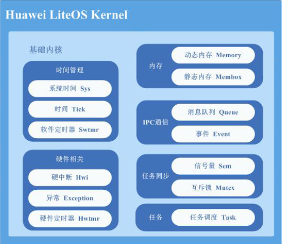

## Huawei LiteOS基础内核
华为物联网操作系统Huawei LiteOS是华为面向物联网领域开发的一个基于实时内核的轻量级操作系统。本项目属于华为物联网操作系统[Huawei LiteOS](http://developer.huawei.com/ict/cn/site-iot/product/liteos)基础内核源码(图示Basic Kernel)，目前仅开源基础内核，同时适配了STM32F412/F429/L476及GD32F190/F450开发板，后续会开放其他特性同时支持其他类型开发板。现有代码支持任务调度，内存管理，中断机制，队列管理，事件管理，IPC机制，时间管理，软定时器以及双向链表等常用数据结构。

## 加入我们
* 欢迎提交issue对关心的问题发起讨论
* 欢迎提交PR参与特性建设

## 代码导读
* doc - Kernel标准API测试文档以及IAR/Keil的第三方移植指导文档
* example - Kernel标准API测试套
* platform - Kernel支持的平台相关代码
* kernel - Huawei_LiteOS操作系统的基础内核源码
* Projects - IAR或Keil等IDE的kernel移植示例工程

## 获取LiteOS最新代码和文档    
* 代码地址：https://github.com/LITEOS/LiteOS_Kernel
* 文档地址：https://github.com/LITEOS/LiteOS_Kernel/tree/master/doc

## 项目更新
* 2016.09.06 - 支持IAR工程构建 
* 2016.12.23 - 支持keil工程构建
* 2017.01.24 - 支持GD32开发板
* 2017.02.15 - 内核代码结构调整
* 2017.04.01 - 支持NXP开发板
* 2017.04.20 - 支持MindMotion开发板

## 开发板支持
* STM32F412
* STM32F429
* STM32L476
* GD32F190
* GD32F450
* LPC824
* LPC54110
* MM32F103

## 主要特征
* 实时操作系统内核
* 轻量级
* 低功耗
* 快速启动
* 可裁剪
* 分散加载

## 内核模块
* core
* cmsis
* ipc
* mem
* misc

## 开源协议
* 遵循BSD-3开源许可协议
