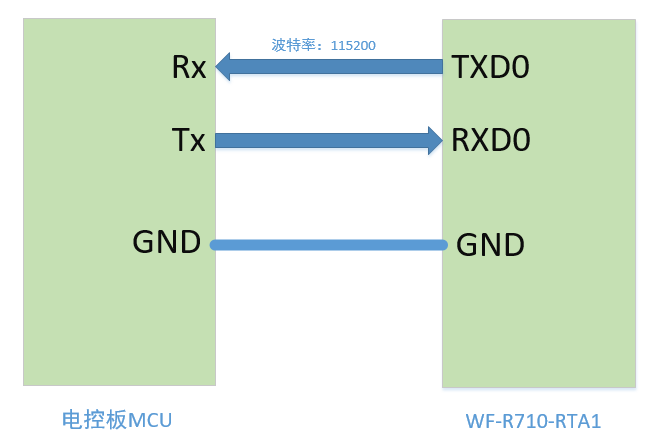
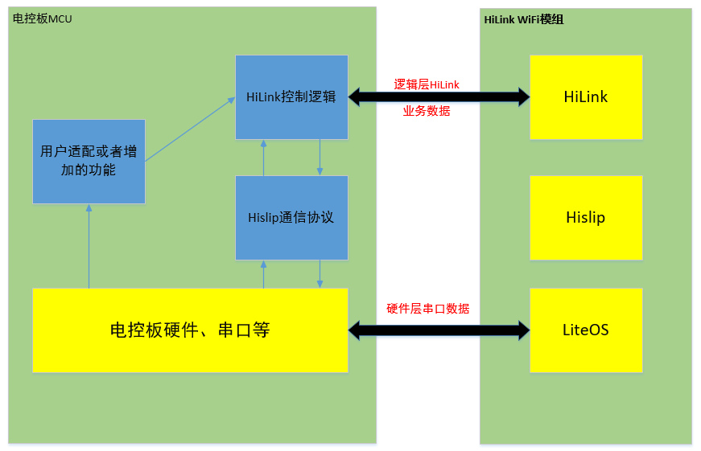
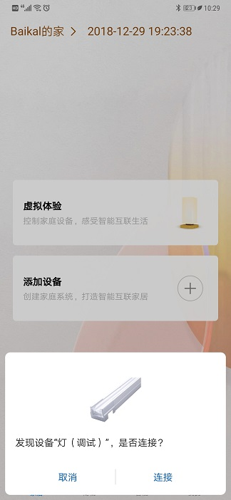
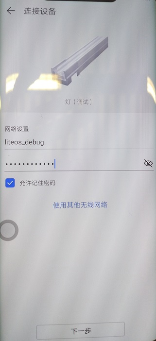
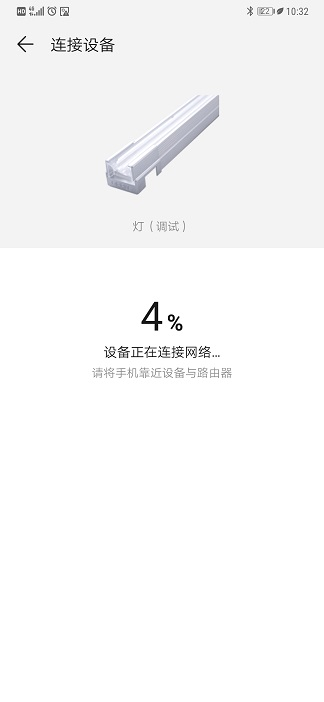
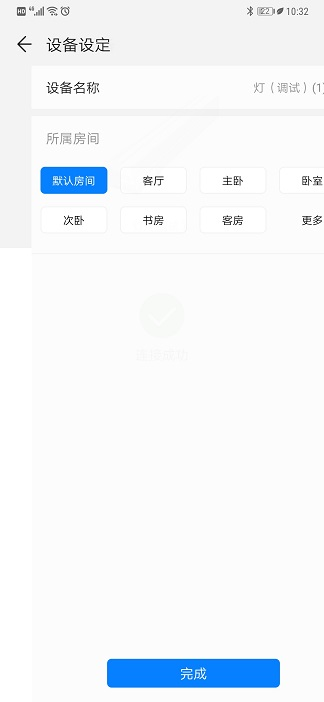
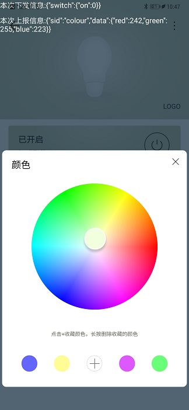

# 1 知识共享许可协议说明

**您可以自由地：**

**分享** — 在任何媒介以任何形式复制、发行本作品

**演绎** — 修改、转换或以本作品为基础进行创作

只要你遵守许可协议条款，许可人就无法收回你的这些权利。

**惟须遵守下列条件：**

**署名** —
您必须提供适当的证书，提供一个链接到许可证，并指示是否作出更改。您可以以任何合理的方式这样做，但不是以任何方式表明，许可方赞同您或您的使用。

**非商业性使用** — 您不得将本作品用于商业目的。

**相同方式共享** —
如果您的修改、转换，或以本作品为基础进行创作，仅得依本素材的授权条款来散布您的贡献作品。

**没有附加限制** —
您不能增设法律条款或科技措施，来限制别人依授权条款本已许可的作为。

**声明：**

当您使用本素材中属于公众领域的元素，或当法律有例外或限制条款允许您的使用，则您不需要遵守本授权条款。

未提供保证。本授权条款未必能完全提供您预期用途所需要的所有许可。例如：形象权、隐私权、著作人格权等其他权利，可能限制您如何使用本素材。

为了方便用户理解，这是协议的概述。您可以访问网址https://creativecommons.org/licenses/by-nc-sa/3.0/legalcode了解完整协议内容。

# 2 前言

**目的**

本文档用于指导开发者了解Huawei HiLink MCU-SDK，能够基于LiteOS MCU SDK快速对接Huawei HiLink。

**读者对象**

本文档主要适用于Huawei HiLink的开发者。

本文档主要适用于以下对象：

- 智能家居端侧软件开发工程师
- 智能家居架构设计师

**符号约定**

在本文中可能出现下列标志，它们所代表的含义如下。

| 符号                                 | 说明                                                         |
| ------------------------------------ | ------------------------------------------------------------ |
|  | 用于警示潜在的危险情形，若不避免，可能会导致人员死亡或严重的人身伤害 |
|  | 用于警示潜在的危险情形，若不避免，可能会导致中度或轻微的人身伤害 |
|  | 用于传递设备或环境安全警示信息，若不避免，可能会导致设备损坏、数据丢失、设备性能降低或其它不可预知的结果 “注意”不涉及人身伤害 |
|  | “说明”不是安全警示信息，不涉及人身、设备及环境伤害信息       |

**术语**

| 序号 | 术语名称              | 描述                                                         |
| ---- | --------------------- | ------------------------------------------------------------ |
| 1    | HiLink                | Huawei推出的适用于智能家居领域的互联互通协议。               |
| 2    | LiteOS HiLink MCU SDK | LiteOS HiLink MCU SDK是Huawei LiteOS HiLink软件开发工具包（Software Development Kit），包括LiteOS Kernel和HiLink串口协议 |
| 3    | Hislip                | Huawei基于SLIP串口协议开发的用于电控板和HiLink模组之间的串口通信协议 |
| 3    | 模组                  | HiLink模组(集成了Huawei HiLink协议的模组)                    |
| 4    | 电控板                | 产品中实际控制产品工作的硬件MCU(带串口功能)                  |

# 3 HiLink开发流程概述

HiLink全部开发认证流程如下：

本文档主要描述其中的三个开发流程：HiLink的开发流程包括HiLink网站上的产品功能定义，华为智能家居APP的H5界面手机和产品的固件开发。接下来的三个章节分别详细描述着三个开发流程。

# 4 HiLink网站创建产品Profile

在HiLink入口http://iot.hilink.huawei.com/#/ 完成开发厂商的资质认证注册，登录后即可开始创建支持HiLink的产品。

在<开发指引>页面下面有平台介绍，使用指南以及一些案例说明和文档下载中心。开发者可以在产品创建开发之前先浏览该页面中的内容。

## 4.1 创建产品

切到<产品管理>页面，在<我的产品>下有创建产品的按钮：

点击创建产品，弹出选择产品类别和具体产品类型的弹出框：

这里我们以智能照明为例，点击下一步：

产品接入方式选择Wi-Fi，其他必填项请根据实际产品填写。点击下一步之后会生成初步的产品：

这里我们需要记下DeviceTypeID，下载BI Key和AC Key。

## 4.2 定义产品Profile

作为照明类产品，已经预置了一些常见功能，请根据实际产品进行选择：

选择开关和RGB颜色作为标准功能，点击下一步生成标准功能列表和基础功能列表：
标准功能列表：

基础功能列表：

标准功能列表是刚才选择的开关和RGB颜色两项标准功能；而基础功能是默认内置的，它一般包含升级和网络信息两项基础功能。
# 5 HiLink H5界面设计

H5界面设计分为两种设计方式，第一种是采用HiLink提供的UIPlus界面来辅助设计，第二种是厂家自行开发并遵守《华为EMUI智能家居UX设计规范》。

## 5.1 UIPlus界面设计

选择左侧的UIPlus H5界面设计，跳转到UIPlus界面设计的界面：

右侧有三个图标按钮，分别是保存，下载和二维码。

点击二维码图标按钮，会生成一个二维码，可以用手机扫一扫后再设备上进行预览。

我们在示例中并不对UI进行修改，直接选择保存和下载。下载内容是一个zip包，里面是该UI的JS文件。解压如下：

## 5.2 本地部署H5测试环境

这里我们在本地设备搭建测试页面的环境：

下载一个免费http服务器小工具hfs(下载地址：http://www.rejetto.com/hfs/?f=dl)，并将PC与APP所在的手机置于同一个局域网下。在PC上打开hfs，界面如下:

将hilink_126G_20190126文件夹拖动至hfs界面内，选择“真实目录”：

点击按钮"复制到剪贴板"复制服务器路径，在PC浏览器中可以打开当前路径，同样请在手机浏览器中测试是否能打开。

## 5.3 APP上配置H5测试地址

安装华为智能家居APP，选用版本为smarthome_9.0.10.310_debug.apk。

打开APP后进入“我的-设置-关于”页面：

切换服务器-->开发测试云

切换分支->主线

H5调试信息展示->打开

切换环境目录->开发环境(debug目录)

最后点击"H5地址配置"，在弹框内输入服务器地址，则后续打开设备详情页面时，APP将访问所指定的地址。例如：

# 6 HiLink固件开发

## 6.1 HiLink MCU SDK硬件组件

模组和电控板：模组采用爱联模组WF-R710-RTA1，电控板可以采用带串口功能的MCU开发板，这里我们用野火STM32F429开发板。

HiLink MCU SDK是HiLink在MCU侧的软件开发工具包。它包含了MCU侧的HiLink控制逻辑和hislip串口通信协议。开发者仅仅需要适配平台接口(串口驱动接口和延时接口)、设备profile信息以及映射表、设备控制回调表等，就能简单快速地实现与华为HiLink平台安全可靠连接。使用HiLink MCU SDK，用户可以大大减少开发周期，聚焦自己的业务开发，快速构建自己的智能家居产品。

## 6.2 HiLink MCU SDK架构图

HiLink MCU SDK仅包括上图中蓝色部分。其中hilink控制逻辑和hislip通信协议开发者可以不关注，开发者仅需要关注用户适配或者增加的功能。

这部分分为以下几个部分：

## 6.3 平台接口适配

### 6.3.1 串口适配

##### 6.3.1.1 串口发送：

需要通过串口阻塞式的发送一个字节。

填充该函数int hislip_uart_send_one_byte(hislip_u8 data)

##### 6.3.1.2 串口接收

在hilink的集成过程中需要接收和处理串口数据。在hislip_uart.c中已经实现了接收处理一个字节的函数int hislip_uart_rcv_one_byte(hislip_u8 data)。移植hilink时，需要在串口的接收中断中直接调用hislip_uart_rcv_one_byte(data)处理收到的单个字节。

### 6.3.2 时间接口

hislip_u64 hislip_get_cur_time(void)

获取当前系统的当前时间。目前HiLink业务逻辑都是使用ms为单位进行相关延时处理的。

对于集成LiteOS的HiLink MCU SDK，可以直接调用uint64_t osKernelGetTickCount (void)接口来获取当前ms数。

对于无OS的环境，开发者需要自行实行该函数。

## 6.4 Profile以及映射表修改

设备的profile主要由3个部分描述，设备属性（dev_info_t）、服务映射表（svc_info_t）、特性映射表（dev_key_map_t）。

集成hilink功能时，需要修改这3个内容，三项内容都定义在dev_profile.h中。下面将详细介绍各个内容的情况。

### 6.4.1 设备属性修改

dev_info_t dev_info =

{

​    "", /* 设备SN，此项内容为空字符串表示设备的SN由wifi模块的mac地址自动生成 */

​    "9004", /* 设备ID，这个内容需设备使用商向华为申请，由华为提供，比如switch定义为9004 */

​    "HBL-4", /* 设备型号，具体值如何填写可以咨询华为 */

​    "005", /*设备类型，具体值如何填写可以咨询华为 */

​    "005", /*设备制造商，具体值如何填写可以咨询华为 */

};

### 6.4.2 服务映射表

svc_info_t hilink_svc[] =

{

​    {LED_SVC_INSTANCE_ID, "binarySwitch", "switch"}

};

服务映射表由三个字段组成，服务instance映射id，服务类型、服务instance name。

| **序号** | **字段**           | **功能概述**                                                 |
| -------- | ------------------ | ------------------------------------------------------------ |
| 1        | 服务instance映射id | 这个字段由用户自定义，id的值得范围是0x40到0x7f 或者0x80~0x1FFF。在电控板和wifi模组通讯时将以此id来代替服务实例的名字。 |
| 2        | 服务类型           | 如果是通用设备比如冰箱、洗衣机、开关等可以直接获取华为的profile说明文件，在其中找ServiceType。如果是新增加的设备，则需要按照profile的定义规则将新的profile提供给华为，华为在系统中添加新的profile（service type以及service 下的Characteristic）。建议：此项内容建议采用缩写字符串口来代替完整字符串 |
| 3        | 服务instance name  | 服务实例的名称，这个由用户自定义，一般有1到32个字母和数字组成。用来区分不同的服务实例。比如电控板上有多个binarySwitch类型的开关，可以将其实例名分别命为 roomsw, kitchensw等。 |

 

### 6.4.3 特性映射表

dev_name_map_t dev_map_table[]= 

{

​    {LED_SVC_KEY_SWITCH_ID, "binarySwitch", "on", HLK_DATA_TYPE_INT}

};

特性映射表由四个字段组成，特性映射id，服务类型、特性名称、特性数据类型组成。

**注意**： 每个服务类型下都必须至少有一个特性。比如binarySwitch下的on特性。

| **序号** | **字段**       | **功能概述**                                                 |
| -------- | -------------- | ------------------------------------------------------------ |
| 1        | 特性映射id     | 这个字段由用户自定义，id的值得范围是0x40到0x7f 或者0x80~0x1FFF。在电控板和wifi模组通讯时将以此id来代替特性的名称（注：减少串口传输的数据量） |
| 2        | 服务类型       | 同服务类型表中的服务类型。该字段表示的是特性属于哪个服务类型之下。 |
| 3        | 特性名称       | 特性的名称。如果服务类型是华为已经定义过的类型，直接在华为提供的profile说明文件中查找。如果是设备新增加的，有设备厂商自己定义，并且需要将定义给华为在系统中进行增加。 |
| 4        | 特性数据类型。 | 该字段表示特性对应的实际值是那种数据类型，总共分成3种类型：字符串类型、bool类型、整形。 #define HLK_DATA_TYPE_STR        0x00  #define HLK_DATA_TYPE_BOOL       0x01  #define HLK_DATA_TYPE_INT        0x02 |

## 6.4 设备控制回调表修改

设备控制主要由设备控制回调表（hilink_msg_t）定义的内容进行描述。该表中定义了特性的值以及wifi模组下达控制命令时所需要调用的回调处理函数。定义在dev_profile.h中

hilink_msg_t结构体由两部分组成

typedef struct

{

​    short svc_inst;//服务instance映射id

​    short map_id;//特性映射id

​    int value;//服务instance下的属性id对应的值

}hilink_msg_info_t;

和回调处理函数hilink_msg_func组成。

hilink_msg_info_t结构体定义了某个服务instance下的特性的值。

比如

hilink_msg_t  hilink_msg_table[] = 

{

​    {LED_SVC_INSTANCE_ID, LED_SVC_KEY_SWITCH_ID, 0, light_ctrl_func}

};

这个表中定义了switch下的on属性的值以及wifi模组更新该值的回调处理函数。

注意：

1:该表中有多少项，需要根据实际的profile和服务实例的多少来填写，回调处理函数也需要用户自己定义其功能。

2：在回调处理中，处理完成相关功能后需要更新特性的值，并调用hlk_update_local_val ()接口通知wifi模组特性的值修改后的情况。

3: LED_SVC_INSTANCE_ID和LED_SVC_KEY_SWITCH_ID此类用户自定义数据在dev_hw.h中定义。

## 6.5 AC和BI数据

在dev_profile.h中，g_rsa_cipher和g_ac 这两个数据的值需要更新为华为HiLink认证申请时华为提供给产品的对应的bi rsa（512字节）和ac（48字节）的数据。

# 7 附录：连接步骤

### 1.系统上电

MCU和模组会完成模组网络状态更新、模组工作模式更新以及设备注册。

### 2.进入配网操作，打开Huawei的智能家居APP完成配网：

#### 设备发现:

#### 网络设置:

#### 添加设备(配置网络):

#### 添加设备(注册设备):

添加完成后即可在智能家居APP上远程控制设备和获取设备状态。

#### 设备控制:

