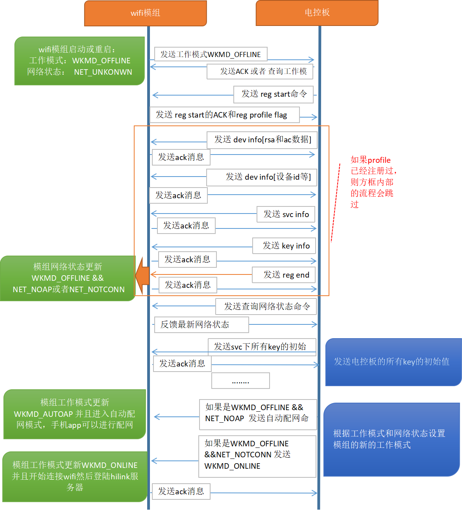

<h2 id="1">1.知识共享许可协议说明</h2>

**您可以自由地：**

**分享** — 在任何媒介以任何形式复制、发行本作品

**演绎** — 修改、转换或以本作品为基础进行创作

只要你遵守许可协议条款，许可人就无法收回你的这些权利。

**惟须遵守下列条件：**

**署名** —
您必须提供适当的证书，提供一个链接到许可证，并指示是否作出更改。您可以以任何合理的方式这样做，但不是以任何方式表明，许可方赞同您或您的使用。

**非商业性使用** — 您不得将本作品用于商业目的。

**相同方式共享** —
如果您的修改、转换，或以本作品为基础进行创作，仅得依本素材的授权条款来散布您的贡献作品。

**没有附加限制** —
您不能增设法律条款或科技措施，来限制别人依授权条款本已许可的作为。

**声明：**

当您使用本素材中属于公众领域的元素，或当法律有例外或限制条款允许您的使用，则您不需要遵守本授权条款。

未提供保证。本授权条款未必能完全提供您预期用途所需要的所有许可。例如：形象权、隐私权、著作人格权等其他权利，可能限制您如何使用本素材。

为了方便用户理解，这是协议的概述。您可以访问网址https://creativecommons.org/licenses/by-nc-sa/3.0/legalcode

了解完整协议内容。

<h2 id="2">2.前言</h2>

**目的**

本文档用于指导开发者了解Huawei HiLink Hislip协议，该协议用于HiLink MCU SDK和HiLink模组之间的串口通信。

**读者对象**

本文档主要适用于Huawei HiLink的开发者。

本文档主要适用于以下对象：

- 智能家居端侧软件开发工程师
- 智能家居架构设计师

**符号约定**

在本文中可能出现下列标志，它们所代表的含义如下。

| 符号                                 | 说明                                                         |
| ------------------------------------ | ------------------------------------------------------------ |
|  | 用于警示潜在的危险情形，若不避免，可能会导致人员死亡或严重的人身伤害 |
|  | 用于警示潜在的危险情形，若不避免，可能会导致中度或轻微的人身伤害 |
|  | 用于传递设备或环境安全警示信息，若不避免，可能会导致设备损坏、数据丢失、设备性能降低或其它不可预知的结果 “注意”不涉及人身伤害 |
|  | “说明”不是安全警示信息，不涉及人身、设备及环境伤害信息       |

**术语**

| 序号 | 术语名称              | 描述                                                         |
| ---- | --------------------- | ------------------------------------------------------------ |
| 1    | HiLink                | Huawei推出的适用于智能家居领域的互联互通协议。               |
| 2    | LiteOS HiLink MCU SDK | LiteOS HiLink MCU SDK是Huawei LiteOS HiLink软件开发工具包（Software Development Kit），包括LiteOS Kernel和HiLink串口协议 |
| 3    | 模组                  | HiLink模组(集成了Huawei HiLink协议的模组)                    |
| 4    | 电控板                | 产品中实际控制产品工作的硬件MCU(带串口功能)                  |
| 5    | SLIP                  | 串行线路网际协议                                             |
| 6    | Hislip                | Hislip协议是HiLink MCU SDK和HiLink模块之间通信的串口控制协议，采用SLIP封装格式 |

<h2 id="3">3. HiLink模块串口控制协议Hislip</h2>

<h3 id="3.1">3.1 串口协议框架</h3>

| 十六进制 | 十进制 | 八进制 | 缩写    | 描述                    |
| -------- | ------ | ------ | ------- | ----------------------- |
| 0xC0     | 192    | 300    | END     | Frame End               |
| 0xDB     | 219    | 333    | ESC     | Frame Escape            |
| 0xDC     | 220    | 334    | ESC_END | Transposed Frame End    |
| 0xDD     | 221    | 335    | ESC_ESC | Transposed Frame Escape |

**SLIP协议定义的帧格式的规则描述如下:**

a) 每个数据帧的起始和结束字符都是特殊字符END(0xC0)。

b) 如果数据帧中某个字符为END，那么就要连续传输两个字节ESC和ESC_END(0xDB, 0xDC)来替换它。

​    **注**:ESC(0xDB)这个特殊字符被称作SLIP的ESC字符，但是它的值与ASCII码的ESC字符(0x1B)不同。

c) 如果数据帧中某个字符为SLIP中的ESC字符，那么就要连续传输两个字节ESC和ESC_ESC(0xDB, 0xDD)来替换它。

**帧数据简单说明：**

| END   | Packet Num | Seq   | data      | CRC8  | END   |
| ----- | ---------- | ----- | --------- | ----- | ----- |
| 1字节 | 1字节      | 1字节 | <=123字节 | 1字节 | 1字节 |

a) 数据帧头帧尾都是END。

b) 字节2是包编号（比如0x80，表示此包命令数据长度是不超过124字节的，如果数据超过124字节那么包数据将变成0x00，下一个124字节的包编号为0x01，最后一个分包为0x80|Seq）。

c) 字节3是发送序号（从0x00到0x7f循环往复，如果序号是 >= 0x80 的表示的该包是一个ACK数据）。

d) 字节4 以及以后的data数据组成格式为cmd[1~2]和TLV 这样的格式的数据（注：有些cmd后面是没有数据的，即没有tag len data这些数据，比如查询工作模式）。采用TLV(Type-Length_Value)方式装载每个变量。

**注**：TLV简单说明

​    Type: 表示消息类型

​    Length: Value的长度(字节数)

​    Value: 消息的实际数据

e) CRC8计算从Packet Num开始。

**以MCU设备查询模组WiFi工作模式的数据为例：**

​    0xc0 0x80 0x1 0x84 0x8b 0xc0

<h3 id="3.2">3.2 应用层协议框架</h3>

应用层协议框架基本要求：

a) 请求、响应有并行的能力，而不是一个虚拟通道同时只能发送一个请求。

b) 所有的请求、指示（从模组来的请求）都应该有响应消息，哪怕只有一个ACK。

c) HiLink的串口协议的“请求——响应”配对，是针对电控板（应用）和HiLink模块简单的业务行为，而不是与HiLink智能家居IoT云的行为。

<h3 id="3.3">3.3 HiLink Hislip协议功能接口</h3>

Type定义范围(命令Type和数据Type)

命令Type，会保留一小段空间，给用户自定义，在日后模组支持脚本时，用户可以用来定义自己的控制命令。

数据Type，将保留一小段空间给HiLink系统固定使用。

Type分配原则：一次性，或者不常用的命令tag放到2字节空间上，留下1字节给未来可能存在的频繁操作用，提高协议效率。

命令Type表如下：

| Type   | 命令                 |
| ------ | -------------------- |
| 0x00   | NA（保留）           |
| 0x01   | 控制模组工作模式     |
| 0x02   | 控制模组重启         |
| 0x03   | 重置模组             |
| 0x04   | 查询模组工作模式     |
| 0x05   | 查询模组网络状态     |
| 0x06   | 查询实时时间         |
| 0x07   | 模组工作模式变更通知 |
| 0x08   | 模组重置结果         |
| 0x09   | 模组网络状态变更     |
| 0x0A   | 升级通知             |
| 0x0B   | 上报设备状态         |
| 0x0C   | 上报操作失败结果     |
| 0x0D   | 设备控制             |
| 0x0E   | 设备查询             |
|        |                      |
| 0x10   | 查询电控板需要升级   |
| 0x11   | 启动电控板升级命令   |
| 0x12   | 传输电控板OTA数据    |
| 0x13   | 结束电控板OTA传输    |
|        |                      |
| 0x2000 | 设置注册状态         |
| 0x2001 | 设置产品信息         |
| 0x2002 | 注册属性             |
| 0x2003 | 注册服务实例         |
| 0x2004 | 查询模组信息         |

数据Type表如下：

| Type   | 数据名称               |
| ------ | ---------------------- |
| 0x00   | 操作结果               |
| 0x01   | 模组工作模式           |
| 0x02   | 重启原因               |
| 0x03   | 模组网络状态           |
| 0x04   | 升级过程状态           |
| 0x05   | 升级进度               |
| 0x06   | UTC时间                |
| 0x07   | 属性映射项             |
| 0x08   | 属性类型               |
| 0x09   | 服务实例映射项         |
| 0x0A   | 服务属性名字符串存储   |
| 0x0B   | 服务属性结构存储       |
| 0x0C   | Timer/Dleay服务存储    |
|        |                        |
| 0x10   | 电控板版本号           |
| 0x11   | 电控板BIN大小          |
| 0x12   | 电控板OTA数据          |
| 0x13   | 电控板OTA校验值        |
| 0x14   | 电控板ota-bin文件名    |
|        |                        |
| 0x3F   | 多帧报文接收包号bitmap |
| 0x2000 | 电控板PROFILE版本号    |
| 0x2001 | WIFI_RAND              |
| 0x2002 | WIFI_SSID              |
| 0x2003 | WIFI_PWD               |
| 0x2004 | NTP服务器地址          |
| 0x2005 | 注册状态               |
| 0x2006 | 产品ID                 |
| 0x2007 | 设备SN                 |
| 0x2008 | 产品型号               |
| 0x2009 | 产品类型               |
| 0x200A | 设备类型               |
| 0x200B | 设备制造商             |
| 0x200C | 制造商英文简称         |
| 0x200D | CA证书                 |
| 0x200E | AC密钥                 |
| 0x200F | BI密钥                 |
| 0x2010 | 模组MAC地址            |
| 0x2011 | 模组硬件版本信息       |
| 0x2012 | 模组软件版本信息       |
| 0x2013 | 模组侦听AP的RSSI信息   |
| 0x2014 | 模组侦听AP的SSID       |

<h2 id="4">4. HiLink模组与电控板Hislip通讯流程</h2>

<h3 id="4.1">4.1 通讯流程简图</h3>

<h3 id="4.2">4.2 通讯流程简介</h3>

Step 1：模组上电时，首先发送工作模式通知的消息给电控板，并等待ACK或者电控板的查询命令

Step 2：电控板查询工作模式以及网络状态，并且需要等待各个命令的ACK消息

Step 3：电控板发送reg start命令，并且携带profile version数据

Step 4：模组接收profile 版本信息并且判断是否需要进入接收profile的流程，并且反馈ACK给电控板告诉电控板是否进入profile注册流程

Step 5：电控板如果需要注册profile，则发送dev info数据、svc info数据、key info数据，然后查询网络状态，

Step 6：电控板上报key的所有初始值（根据profile中svc info的个数决定）

Step 7：电控板根据网络状态设置WiFi模组的工作模式。模组根据设置的工作模式进入相应状态进行工作。

以上步骤完成后，电控板进入空闲状态，可以进行手机APP与电控板间的互动操作了。