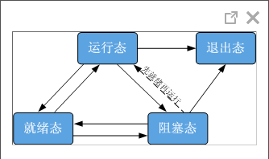
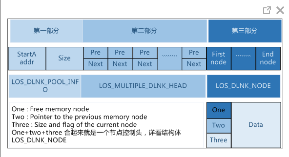
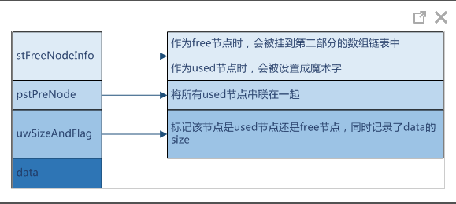
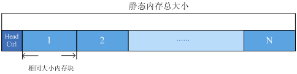
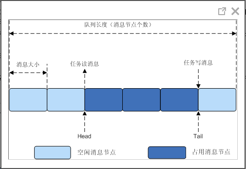
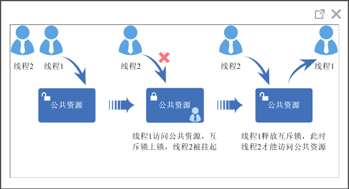
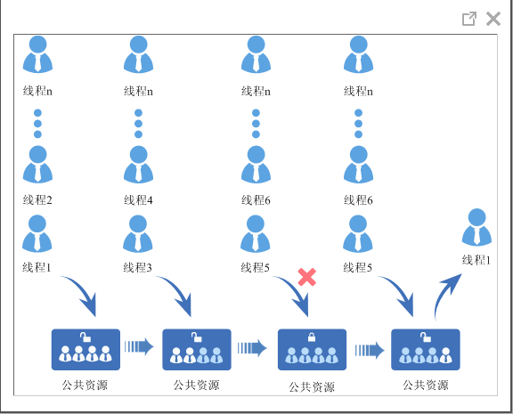

## 关于本文档的开源协议说明 ##
### 您可以自由地： ###
**分享** — 在任何媒介以任何形式复制、发行本文档

**演绎** — 修改、转换或以本文档为基础进行创作
在任何用途下，甚至商业目的。
只要你遵守许可协议条款，许可人就无法收回你的这些权利。

**惟须遵守下列条件：**
**署名** — 您必须提供适当的证书，提供一个链接到许可证，并指示是否作出更改。您可以以任何合理的方式这样做，但不是以任何方式表明，许可方赞同您或您的使用。

**非商业性使用** — 您不得将本文档用于商业目的。

**相同方式共享** — 如果您的修改、转换，或以本文档为基础进行创作，仅得依本素材的授权条款来散布您的贡献文档。

**没有附加限制** — 您不能增设法律条款或科技措施，来限制别人依授权条款本已许可的作为。

**声明：**

当您使用本素材中属于公众领域的元素，或当法律有例外或限制条款允许您的使用，则您不需要遵守本授权条款。   

未提供保证。本授权条款未必能完全提供您预期用途所需要的所有许可。例如：形象权、隐私权、著作人格权等其他权利，可能限制您如何使用本素材。

**注意：**  
为了方便用户理解，这是协议的概述. 可以访问网址https://creativecommons.org/licenses/by-sa/3.0/legalcode了解完整协议内容.

--------------------------------------------------------------------------------
版权所有 © 华为技术有限公司

## 前言 ##
## 目的 ##
本文档介绍Huawei LiteOS的体系结构，并介绍如何进行内核相关的开发和调试。

### 读者对象 ###
本文档主要适用于Huawei LiteOS Kernel的开发者。

本文档主要适用于以下对象：

物联网端侧软件开发工程师

物联网架构设计师

### 符号约定 ###
在本文中可能出现下列标志，它们所代表的含义如下。

     用于警示紧急的危险情形，若不避免，将会导致人员死亡或严重的人身伤害

    用于警示潜在的危险情形，若不避免，可能会导致人员死亡或严重的人身伤害

    用于警示潜在的危险情形，若不避免，可能会导致中度或轻微的人身伤害

     用于传递设备或环境安全警示信息，若不避免，可能会导致设备损坏、数据丢失、设备性能降低或其它不可预知的结果“注意”不涉及人身伤害

| 说明	|		“说明”不是安全警示信息，不涉及人身、设备及环境伤害信息	|				

### 修订记录 ###
修改记录累积了每次文档更新的说明。最新版本的文档包含以前所有文档版本的更新内容。

<table>
    <tr>
        <td width="20%">日期</td>
		<td width="20%">修订版本</td>
		<td width="60%">描述</td>
    </tr>
    <tr>
        <td>2016年08月05日</td>
		<td>1.0</td>
		<td>第一个发行版本</td>
    </tr>
    <tr>
        <td>2017年02月15日</td>
		<td>1.1</td>
		<td>修改中断测试代码以及相关说明</td>
    </tr>
    <tr>
        <td>2017年03月09日</td>
		<td>1.2</td>
		<td>修改、新增API测试代码及相关说明</td>
    </tr>
</table>

--------------------------------------------------------------------------------

# 概述 #
## 背景介绍 ##
Huawei LiteOS Kernel是轻量级的实时操作系统，是华为IOT OS的内核。

图1 Huawei LiteOS的基本框架图

Huawei LiteOS基础内核是最精简的Huawei LiteOS操作系统代码，包括任务管理、内存管理、时间管理、通信机制、中断管理、队列管理、事件管理、定时器、异常管理等操作系统基础组件，可以单独运行。

**Huawei LiteOS Kernel的优势**

1. 高实时性，高稳定性。
1. 超小内核，基础内核体积可以裁剪至不到10K。
1. 低功耗。
1. 支持动态加载、分散加载。
1. 支持功能静态裁剪。

### 各模块简介 ###

**任务**

提供任务的创建、删除、延迟、挂起、恢复等功能，以及锁定和解锁任务调度。任务按优先级可抢占、同优先级时间片轮转调度的方式调度。

**任务同步**

- 信号量：支持信号量的创建、删除、PV等功能。
- 互斥锁：支持互斥锁的创建、删除、PV等功能。

**硬件相关**

提供中断、定时器等功能。

- 中断：提供中断的创建、删除、使能、禁止、请求位的清除等功能。
- 定时器：提供定时器的创建、删除、启动、停止等功能。

**IPC通信**

提供事件、消息队列功能。

- 事件：支持读事件和写事件功能。
- 消息队列：支持消息队列的创建、删除、发送和接收功能。

**时间管理**

- 系统时间：系统时间是由定时/计数器产生的输出脉冲触发中断而产生的。
- Tick时间：Tick是操作系统调度的基本时间单位，对应的时长由系统主频及每秒Tick数决定，由用户配置。
- 软件定时器：以Tick为单位的定时器功能，软件定时器的超时处理函数在系统创建的Tick软中断中被调用。

**内存管理**

- 提供静态内存和动态内存两种算法，支持内存申请、释放。目前支持的内存管理算法有固定大小的BOX算法、动态申请DLINK算法。
- 提供内存统计、内存越界检测功能。

**异常接管**

异常接管是指在系统运行过程中发生异常后，跳转到异常处理信息的钩子函数，打印当前发生异常函数调用栈信息，或者保存当前系统状态的一系列动作。

Huawei LiteOS的异常接管，会在异常后打印发生异常的任务ID号、栈大小，以及LR、PC等寄存器信息。

--------------------------------------------------------------------------------

## 支持的核 ##
表1 Huawei LiteOS支持的核

<table>
    <tr>
        <td width="25%">支持的核</td>
		<td >芯片</td>
    </tr>
    <tr>
        <td>Cortex-A7</td>
		<td>Hi3516A</td>
    </tr>
    <tr>
        <td>M3</td>
		<td>K3V3，K3V3+，GDF190</td>
    </tr>
    <tr>
        <td>M4</td>
		<td>STMF411，STMF412，STMF429，STML476，GDF450</td>
    </tr>
    <tr>
        <td>M7</td>
		<td>K3V5</td>
    </tr>
    <tr>
        <td>ARM9</td>
		<td>Hi3911，Hi3518EV200</td>
    </tr>
</table>

--------------------------------------------------------------------------------

## 使用约束 ##

- Huawei LiteOS提供一套Huawei LiteOS接口，同时支持POSIX接口，它们功能一致，但混用POSIX和Huawei LiteOS接口（譬如用POSIX接口申请，但用Huawei LiteOS接口释放）可能会导致不可预知的错误。
- 开发驱动程序只能用Huawei LiteOS的接口。上层APP建议用POSIX接口。

## 如何使用本文档的测试用例
本文档中的测试用例都是在api_example\api目录下，入口是los_demo_entry.c中的LOS_Demo_Entry()这个接口，使用方法los_config.c的main中调用

示例如下：

	extern void LOS_Demo_Entry(void)；
	int main(void)
	{
		UINT32 uwRet;
		/*
			add you hardware init code here
			for example flash, i2c , system clock ....
		*/
		//HAL_init();....
		
		/*Init LiteOS kernel */
		uwRet = LOS_KernelInit();
		if (uwRet != LOS_OK) {
			return LOS_NOK;
		}
		/* Enable LiteOS system tick interrupt */
		LOS_EnableTick();
		
		/* 
		    Notice: add your code here
		    here you can create task for your function 
		    do some hw init that need after systemtick init
		*/
		LOS_EvbSetup(); 
		
		LOS_Demo_Entry();
		    
		//LOS_Inspect_Entry();
		
		//LOS_BoadExampleEntry();	
			
		/* Kernel start to run */
		LOS_Start();
		for (;;);
		/* Replace the dots (...) with your own code.  */
	}

**如何选择测试的功能：**

在api_example\include\los_demo_entry.h 打开要测试的功能的宏开关
LOS_KERNEL_TEST_xxx，比如测试task调度打开 LOS_KERNEL_TEST_TASK 即可（//#define LOS_KERNEL_TEST_TASK 修改为 #define LOS_KERNEL_TEST_TASK）

--------------------------------------------------------------------------------

# 任务 #
## 概述 ##
**基本概念**

从系统的角度看，任务是竞争系统资源的最小运行单元。任务可以使用或等待CPU、使用内存空间等系统资源，并独立于其它任务运行。

Huawei LiteOS的任务模块可以给用户提供多个任务，实现了任务之间的切换和通信，帮助用户管理业务程序流程。这样用户可以将更多的精力投入到业务功能的实现中。

Huawei LiteOS是一个支持多任务的操作系统。在Huawei LiteOS中，一个任务表示一个线程。

Huawei LiteOS中的任务是抢占式调度机制，同时支持时间片轮转调度方式。

高优先级的任务可打断低优先级任务，低优先级任务必须在高优先级任务阻塞或结束后才能得到调度。

Huawei LiteOS的任务一共有32个优先级(0-31)，最高优先级为0，最低优先级为31。

**任务相关概念**

任务状态

Huawei LiteOS系统中的每一任务都有多种运行状态。系统初始化完成后，创建的任务就可以在系统中竞争一定的资源，由内核进行调度。

任务状态通常分为以下三种：

- 就绪（Ready）：该任务在就绪列表中，只等待CPU。
- 运行（Running）：该任务正在执行。
- 阻塞（Blocked）：该任务不在就绪列表中。包含任务被挂起、任务被延时、任务正在等待信号量、读写队列或者等待读写事件等。

图1 任务状态示意图

任务状态迁移说明：

- 就绪态→运行态：

任务创建后进入就绪态，发生任务切换时，就绪列表中最高优先级的任务被执行，从而进入运行态，但此刻该任务依旧在就绪列表中。

- 运行态→阻塞态：

正在运行的任务发生阻塞（挂起、延时、读信号量等待）时，该任务会从就绪列表中删除，任务状态由运行态变成阻塞态，然后发生任务切换，运行就绪列表中剩余最高优先级任务。

- 阻塞态→就绪态（阻塞态→运行态）：

阻塞的任务被恢复后（任务恢复、延时时间超时、读信号量超时或读到信号量等），此时被恢复的任务会被加入就绪列表，从而由阻塞态变成就绪态；此时如果被恢复任务的优先级高于正在运行任务的优先级，则会发生任务切换，将该任务由就绪态变成运行态。

- 就绪态→阻塞态：

任务也有可能在就绪态时被阻塞（挂起），此时任务状态会有就绪态转变为阻塞态，该任务从就绪列表中删除，不会参与任务调度，直到该任务被恢复。

- 运行态→就绪态：

有更高优先级任务创建或者恢复后，会发生任务调度，此刻就绪列表中最高优先级任务变为运行态，那么原先运行的任务由运行态变为就绪态，依然在就绪列表中。

- 运行态→退出态

运行中的任务运行结束，任务状态由运行态变为退出态。退出态包含任务运行结束的正常退出以及impossible状态。例如，未设置分离属性（LOS_TASK_STATUS_DETACHED）的任务，运行结束后对外呈现的是impossible状态，即退出态。

- 阻塞态→退出态

阻塞的任务调用删除接口，任务状态由阻塞态变为退出态。

**任务ID**

任务ID，在任务创建时通过参数返回给用户，作为任务的一个非常重要的标识。用户可以通过任务ID对指定任务进行任务挂起、任务恢复、查询任务名等操作。

**任务优先级**

优先级表示任务执行的优先顺序。任务的优先级决定了在发生任务切换时即将要执行的任务。在就绪列表中的最高优先级的任务将得到执行。

**任务入口函数**

每个新任务得到调度后将执行的函数。该函数由用户实现，在任务创建时，通过任务创建结构体指定。

**任务控制块TCB**

每一个任务都含有一个任务控制块(TCB)。TCB包含了任务上下文栈指针（stack pointer）、任务状态、任务优先级、任务ID、任务名、任务栈大小等信息。TCB可以反映出每个任务运行情况。

**任务栈**

每一个任务都拥有一个独立的栈空间，我们称为任务栈。栈空间里保存的信息包含局部变量、寄存器、函数参数、函数返回地址等。任务在任务切换时会将切出任务的上下文信息保存在自身的任务栈空间里面，以便任务恢复时还原现场，从而在任务恢复后在切出点继续开始执行。

**任务上下文**

任务在运行过程中使用到的一些资源，如寄存器等，我们称为任务上下文。当这个任务挂起时，其他任务继续执行，在任务恢复后，如果没有把任务上下文保存下来，有可能任务切换会修改寄存器中的值，从而导致未知错误。

因此，Huawei LiteOS在任务挂起的时候会将本任务的任务上下文信息，保存在自己的任务栈里面，以便任务恢复后，从栈空间中恢复挂起时的上下文信息，从而继续执行被挂起时被打断的代码。

**任务切换**

任务切换包含获取就绪列表中最高优先级任务、切出任务上下文保存、切入任务上下文恢复等动作。

**运作机制**

Huawei LiteOS任务管理模块提供任务创建、任务延时、任务挂起和任务恢复、锁任务调度和解锁任务调度、根据任务控制块查询任务ID、根据ID查询任务控制块信息功能。

在用户创建任务之前，系统会先申请任务控制块需要的内存空间，如果系统可用的内存空间小于其所需要的内存空间，任务模块就会初始化失败。如果任务初始化成功，则系统对任务控制块内容进行初始化。

用户创建任务时，系统会将任务栈进行初始化，预置上下文。此外，系统还会将“任务入口函数”地址放在相应位置。这样在任务第一次启动进入运行态时，将会执行“任务入口函数”。

--------------------------------------------------------------------------------

## 开发指导 ##

**使用场景**

任务创建后，内核可以执行锁任务调度，解锁任务调度，挂起，恢复，延时等操作，同时也可以设置任务优先级，获取任务优先级。任务结束的时候，如果任务设置成自删除状态，进行任务资源回收。

**功能**

Huawei LiteOS 系统中的任务管理模块为用户提供下面几种功能。

<table>
	<tr>
		<td width="25%">功能分类</td>
		<td width="25%">接口名称</td>
		<td>描述</td>
	</tr>
	<tr>
		<td>任务的创建和删除</td>
		<td>LOS_TaskCreate</td>
		<td>创建任务</td>
	</tr>
	<tr>
		<td></td>
		<td>LOS_TaskDelete</td>
		<td>删除指定的任务</td>
	</tr>
	<tr>
		<td>任务状态控制</td>
		<td>LOS_TaskResume</td>
		<td>恢复挂起的任务</td>
	</tr>
	<tr>
		<td></td>
		<td>LOS_TaskSuspend</td>
		<td>挂起指定的任务</td>
	</tr>
	<tr>
		<td></td>
		<td>LOS_TaskDelay</td>
		<td>任务延时等待</td>
	</tr>
	<tr>
		<td></td>
		<td>LOS_TaskYield</td>
		<td>显式放权，调整指定优先级的任务调度顺序</td>
	</tr>
	<tr>
		<td>任务调度的控制</td>
		<td>LOS_TaskLock</td>
		<td>锁任务调度</td>
	</tr>
	<tr>
		<td></td>
		<td>LOS_TaskUnlock</td>
		<td>解锁任务调度</td>
	</tr>
	<tr>
		<td>任务优先级的维护</td>
		<td>LOS_CurTaskPriSet</td>
		<td>设置当前任务的优先级</td>
	</tr>
	<tr>
		<td></td>
		<td>LOS_TaskPriGet</td>
		<td>获取指定任务的优先级</td>
	</tr>
</table>

**开发流程**

以创建任务为例，讲解开发流程。

- 在los_config.h中配置任务模块。

	配置OS_TSK_MAX_SUPPORT_NUM系统支持最大任务数，这个可以根据需求自己配置。
	
	配置OS_TSK_IDLE_STACK_SIZE IDLE任务栈大小，这个默认即可。
	
	配置OS_TSK_DEFAULT_STACK_SIZE默认任务栈大小，用户根据自己的需求进行配置，在用户创建任务时，可以进行针对性设置。
	
	配置OS_INCLUDE_TIMESLICE 时间片开关为YES。
	
	配置OS_TSK_ROBIN_TIMEOUT时间片，根据实际情况自己配置。
	
	配置OS_TSK_MONITOR任务监控模块裁剪开关，可选择是否打开。
	
	配置OS_INCLUDE_CPUP CPU使用率裁剪开关，可选择是否打开。

- 锁任务LOS_TaskLock，锁住任务，防止高优先级任务调度。
- 创建任务LOS_TaskCreate。
- 解锁任务LOS_TaskUnlock，让任务按照优先级进行调度。
- 延时任务LOS_TaskDelay，任务延时等待。
- 挂起指定的任务LOS_TaskSuspend，任务挂起等待恢复操作。
- 恢复挂起的任务LOS_TaskResume。

**TASK错误码**

<table>
    <tr>
        <td width = "10%">序号</td>
	<td width = "25%">定义</td>
	<td>实际数值</td>
	<td>描述</td>
	<td>参考解决方案</td>
    </tr>
    <tr>
	<td >1</td>
	<td>LOS_ERRNO_TSK_NO_MEMORY</td>
	<td>0x03000200</td>
	<td>内存空间不足</td>
	<td>分配更大的内存分区</td>
    </tr>
    <tr>
	<td >2</td>
	<td>LOS_ERRNO_TSK_PTR_NULL</td>
	<td>0x02000201</td>
	<td>任务参数为空</td>
	<td>检查任务参数</td>
    </tr>	
    <tr>
	<td >3</td>
	<td>LOS_ERRNO_TSK_STKSZ_NOT_ALIGN</td>
	<td>0x02000202</td>
	<td>任务栈大小未对齐</td>
	<td>对齐任务栈</td>
    </tr>
    <tr>
	<td >4</td>
	<td>LOS_ERRNO_TSK_PRIOR_ERROR</td>
	<td>0x02000203</td>
	<td>不正确的任务优先级</td>
	<td>检查任务优先级</td>
    </tr>
    <tr>
	<td >5</td>
	<td>LOS_ERRNO_TSK_ENTRY_NULL</td>
	<td>0x02000204</td>
	<td>任务入口函数为空</td>
	<td>定义任务入口函数</td>
    </tr>
    <tr>
	<td >6</td>
	<td>LOS_ERRNO_TSK_NAME_EMPTY</td>
	<td>0x02000205</td>
	<td>任务名为空</td>
	<td>设置任务名</td>
    </tr>
    <tr>
	<td >7</td>
	<td>LOS_ERRNO_TSK_STKSZ_TOO_SMALL</td>
	<td>0x02000206</td>
	<td>任务栈太小</td>
	<td>扩大任务栈</td>
    </tr>
    <tr>
	<td >8</td>
	<td>LOS_ERRNO_TSK_ID_INVALID</td>
	<td>0x02000207</td>
	<td>无效的任务ID</td>
	<td>检查任务ID</td>
    </tr>
    <tr>
	<td >9</td>
	<td>LOS_ERRNO_TSK_ALREADY_SUSPENDED</td>
	<td>0x02000208</td>
	<td>任务已经被挂起</td>
	<td>等待这个任务被恢复后，再去尝试挂起这个任务</td>
    </tr>
    <tr>
	<td >10</td>
	<td>LOS_ERRNO_TSK_NOT_SUSPENDED</td>
	<td>0x02000209</td>
	<td>任务未被挂起</td>
	<td>挂起这个任务</td>
    </tr>
    <tr>
	<td >11</td>
	<td>LOS_ERRNO_TSK_NOT_CREATED</td>
	<td>0x0200020a</td>
	<td>任务未被创建</td>
	<td>创建这个任务</td>
    </tr>
    <tr>
	<td >12</td>
	<td>LOS_ERRNO_TSK_DELETE_LOCKED</td>
	<td>0x0300020b</td>
	<td>删除任务时，任务处于被锁状态</td>
	<td>等待解锁任务之后再进行删除操作</td>
    </tr>
    <tr>
	<td >13</td>
	<td>LOS_ERRNO_TSK_MSG_NONZERO</td>
	<td>0x0200020c</td>
	<td>任务信息非零</td>
	<td>暂不使用该错误码</td>
    </tr>
    <tr>
	<td >14</td>
	<td>LOS_ERRNO_TSK_DELAY_IN_INT</td>
	<td>0x0300020d</td>
	<td>中断期间，进行任务延时</td>
	<td>等待退出中断后再进行延时操作</td>
    </tr>
    <tr>
	<td >15</td>
	<td>LOS_ERRNO_TSK_DELAY_IN_LOCK</td>
	<td>0x0200020e</td>
	<td>任务被锁的状态下，进行延时</td>
	<td>等待解锁任务之后再进行延时操作</td>
    </tr>
    <tr>
	<td >16</td>
	<td>LOS_ERRNO_TSK_YIELD_INVALID_TASK</td>
	<td>0x0200020f</td>
	<td>将被排入行程的任务是无效的</td>
	<td>检查这个任务</td>
    </tr>
    <tr>
	<td >17</td>
	<td>LOS_ERRNO_TSK_YIELD_NOT_ENOUGH_TASK</td>
	<td>0x02000210</td>
	<td>没有或者仅有一个可用任务能进行行程安排</td>
	<td>增加任务数</td>
    </tr>
    <tr>
	<td >18</td>
	<td>LOS_ERRNO_TSK_TCB_UNAVAILABLE</td>
	<td>0x02000211</td>
	<td>没有空闲的任务控制块可用</td>
	<td>增加任务控制块数量</td>
    </tr>
    <tr>
	<td >19</td>
	<td>LOS_ERRNO_TSK_HOOK_NOT_MATCH</td>
	<td>0x02000212</td>
	<td>任务的钩子函数不匹配</td>
	<td>暂不使用该错误码</td>
    </tr>
    <tr>
	<td >20</td>
	<td>LOS_ERRNO_TSK_HOOK_IS_FULL</td>
	<td>0x02000213</td>
	<td>任务的钩子函数数量超过界限</td>
	<td>暂不使用该错误码</td>
    </tr>
    <tr>
	<td >21</td>
	<td>LOS_ERRNO_TSK_OPERATE_IDLE</td>
	<td>0x02000214</td>
	<td>这是个IDLE任务</td>
	<td>检查任务ID，不要试图操作IDLE任务</td>
    </tr>
    <tr>
	<td >22</td>
	<td>LOS_ERRNO_TSK_SUSPEND_LOCKED</td>
	<td>0x03000215</td>
	<td>将被挂起的任务处于被锁状态</td>
	<td>等待任务解锁后再尝试挂起任务</td>
    </tr>
    <tr>
	<td >23</td>
	<td>LOS_ERRNO_TSK_FREE_STACK_FAILED</td>
	<td>0x02000217</td>
	<td>任务栈free失败</td>
	<td>该错误码暂不使用</td>
    </tr>
    <tr>
	<td >24</td>
	<td>LOS_ERRNO_TSK_STKAREA_TOO_SMALL</td>
	<td>0x02000218</td>
	<td>任务栈区域太小</td>
	<td>该错误码暂不使用</td>
    </tr>
    <tr>
	<td >25</td>
	<td>LOS_ERRNO_TSK_ACTIVE_FAILED</td>
	<td>0x03000219</td>
	<td>任务触发失败</td>
	<td>创建一个IDLE任务后执行任务转换</td>
    </tr>	
    <tr>
	<td >26</td>
	<td>LOS_ERRNO_TSK_CONFIG_TOO_MANY</td>
	<td>0x0200021a</td>
	<td>过多的任务配置项</td>
	<td>该错误码暂不使用</td>
    </tr>	
    <tr>
	<td >27</td>
	<td>LOS_ERRNO_TSK_CP_SAVE_AREA_NOT_ALIGN</td>
	<td>0x0200021b</td>
	<td>暂无</td>
	<td>该错误码暂不使用</td>
    </tr>
    <tr>
	<td >28</td>
	<td>LOS_ERRNO_TSK_MSG_Q_TOO_MANY</td>
	<td>0x0200021d</td>
	<td>暂无</td>
	<td>该错误码暂不使用</td>
    </tr>
    <tr>
	<td >29</td>
	<td>LOS_ERRNO_TSK_CP_SAVE_AREA_NULL</td>
	<td>0x0200021e</td>
	<td>暂无</td>
	<td>该错误码暂不使用</td>
    </tr>
    <tr>
	<td >30</td>
	<td>LOS_ERRNO_TSK_SELF_DELETE_ERR</td>
	<td>0x0200021f</td>
	<td>暂无</td>
	<td>该错误码暂不使用</td>
    </tr>
    <tr>
	<td >31</td>
	<td>LOS_ERRNO_TSK_STKSZ_TOO_LARGE</td>
	<td>0x02000220</td>
	<td>任务栈大小设置过大</td>
	<td>减小任务栈大小</td>
    </tr>
    <tr>
	<td >32</td>
	<td>LOS_ERRNO_TSK_SUSPEND_SWTMR_NOT_ALLOWED</td>
	<td>0x02000221</td>
	<td>不允许挂起软件定时器任务</td>
	<td>检查任务ID, 不要试图挂起软件定时器任务</td>
    </tr>
</table>

对任务存在失败可能性的操作，包括创建任务、删除任务、挂起任务、恢复任务、延时任务等等，均需要返回对应的错误码，以便快速定位错误原因。

错误码定义：错误码是一个32位的存储单元，31-24位表示错误等级，23-16位表示错误码标志，15-8位代表错误码所属模块，7-0位表示错误码序号，如下

	#define LOS_ERRNO_OS_NORMAL(MID,ERRNO)
	(LOS_ERRTYPE_NORMAL | LOS_ERRNO_OS_ID | ((UINT32)(MID) << 8) | (ERRNO))
	LOS_ERRTYPE_NORMAL ：Define the error level as critical
	LOS_ERRNO_OS_ID ：OS error code flag.
	MID：OS_MOUDLE_ID
	ERRNO：error ID number
例如：
	LOS_ERRNO_TSK_NO_MEMORY  LOS_ERRNO_OS_FATAL(LOS_MOD_TSK, 0x00)
 
注意： 
错误码序号 0x16、0x1c，未被定义，不可用。

**平台差异性**

无。

--------------------------------------------------------------------------------

## 注意事项 ##

- 任务创建时，会对之前自删除任务的任务控制块和任务栈进行回收。
- 任务名是指针没有分配空间，在设置任务名时，禁止将局部变量的地址赋值给任务名指针。
- 若指定的任务栈大小为0，则使用配置项OS_TSK_DEFAULT_STACK_SIZE指定默认的任务栈大小。
- 任务栈的大小按8字节大小对齐。确定任务栈大小的原则是，够用就行：多了浪费，少了任务栈溢出。
- 挂起任务的时候若为当前任务且已锁任务，则不能被挂起。
- Idle任务及Swt_Task任务不能被挂起或者删除。
- 在中断处理函数中或者在锁任务的情况下，执行LOS_TaskDelay操作会失败。
- 锁任务调度，并不关中断，因此任务仍可被中断打断。
- 锁任务调度必须和解锁任务调度配合使用。
- 设置任务优先级的时候可能会发生任务调度。
- 除去Idle任务以外，系统可配置的任务资源个数是指：整个系统的任务总资源个数，而非用户能使用的任务资源个数；例如：系统软件定时器占用一个任务资源数，那么系统可配置的任务资源就会减少一个。
- LOS_CurTaskPriSet或者LOS_TaskPriSet接口不能用来修改软件定时器任务的优先级（优先级设定为0）及在中断中使用。
- LOS_TaskPriGet接口传入的task ID对应的任务未创建或者超过最大任务数，统一返回0xffff。
- 在删除任务时要保证任务申请的资源（如互斥锁、信号量等）已被释放。

--------------------------------------------------------------------------------

## 编程实例 ##
**实例描述**

下面的示例介绍任务的基本操作方法，包含任务创建、任务延时、任务锁与解锁调度、挂起和恢复、查询当前任务PID、根据PID查询任务信息等操作，阐述任务优先级调度的机制以及各接口的应用。

1. 创建了2个任务:TaskHi和TaskLo。
1. TaskHi为高优先级任务。
1. TaskLo为低优先级任务。

**编程示例**

请参考示例代码
los_api_task.c

    
    #include "math.h"
    #include "time.h"
    #include "los_task.h"
    #include "los_api_task.h"
    #include "los_inspect_entry.h"
    
    
    #ifdef __cplusplus
    #if __cplusplus
    extern "C" {
    #endif /* __cpluscplus */
    #endif /* __cpluscplus */
    
    
    UINT32 g_uwTskHiID;
    UINT32 g_uwTskLoID;
    
    
    #define TSK_PRIOR_HI 4
    #define TSK_PRIOR_LO 5
    
    UINT32 Example_TaskHi(VOID)
    {
    	UINT32 uwRet;
    	
    	 dprintf("Enter TaskHi Handler.\r\n");
    	
    	/*延时2个Tick，延时后该任务会挂起，执行剩余任务中就高优先级的任务(g_uwTskLoID任务)*/
    	uwRet = LOS_TaskDelay(2);
    	if (uwRet != LOS_OK)
    	{
    	    dprintf("Delay Task Failed.\r\n");
    	    return LOS_NOK;
    	}
    	
    	/*2个tick时间到了后，该任务恢复，继续执行*/
    	dprintf("TaskHi LOS_TaskDelay Done.\r\n");
    	
    	/*挂起自身任务*/
    	uwRet = LOS_TaskSuspend(g_uwTskHiID);
    	if (uwRet != LOS_OK)
    	{
    	    dprintf("Suspend TaskHi Failed.\r\n");
    		LOS_InspectStatusSetByID(LOS_INSPECT_TASK,LOS_INSPECT_STU_ERROR);
    	    return LOS_NOK;
    	}
    		
    	dprintf("TaskHi LOS_TaskResume Success.\r\n");
    		
    	LOS_InspectStatusSetByID(LOS_INSPECT_TASK,LOS_INSPECT_STU_SUCCESS);
    		
    	/*删除任务*/
    	if(LOS_OK != LOS_TaskDelete(g_uwTskHiID))
    	{
    		dprintf("TaskHi delete failed .\n");
    		return LOS_NOK;
    	}
    		 
    	return LOS_OK;
    }
    
    /*低优先级任务入口函数*/
    UINT32 Example_TaskLo(VOID)
    {
    	UINT32 uwRet;
    	
    	dprintf("Enter TaskLo Handler.\r\n");
    	
    	/*延时2个Tick，延时后该任务会挂起，执行剩余任务中最高优先级的任务(背景任务)*/
    	uwRet = LOS_TaskDelay(2);
    	if (uwRet != LOS_OK)
    	{
    		dprintf("Delay TaskLo Failed.\r\n");
    		return LOS_NOK;
    	}
    	
    	dprintf("TaskHi LOS_TaskSuspend Success.\r\n");
    	
    	/*恢复被挂起的任务g_uwTskHiID*/
    	uwRet = LOS_TaskResume(g_uwTskHiID);
    	if (uwRet != LOS_OK)
    	{
    		dprintf("Resume TaskHi Failed.\r\n");
    		LOS_InspectStatusSetByID(LOS_INSPECT_TASK,LOS_INSPECT_STU_ERROR);
    		return LOS_NOK;
    	}	
    		
    	/*删除任务*/
    	if(LOS_OK != LOS_TaskDelete(g_uwTskLoID))
    	{
    		dprintf("TaskLo delete failed .\n");
    			  
    		return LOS_NOK;
    	}
    		
    	return LOS_OK;
    }
    
    /*任务测试入口函数，在里面创建优先级不一样的两个任务*/
    UINT32 Example_TskCaseEntry(VOID)
    {
        UINT32 uwRet;
        TSK_INIT_PARAM_S stInitParam;
    
        /*锁任务调度*/
        LOS_TaskLock();
    
        dprintf("LOS_TaskLock() Success!\r\n");
    
        stInitParam.pfnTaskEntry = (TSK_ENTRY_FUNC)Example_TaskHi;
        stInitParam.usTaskPrio = TSK_PRIOR_HI;
        stInitParam.pcName = "HIGH_NAME";
        stInitParam.uwStackSize = 0x400;
        stInitParam.uwResved   = LOS_TASK_STATUS_DETACHED;
        /*创建高优先级任务，由于锁任务调度，任务创建成功后不会马上执行*/
        uwRet = LOS_TaskCreate(&g_uwTskHiID, &stInitParam);
        if (uwRet != LOS_OK)
        {
            LOS_TaskUnlock();
    
            dprintf("Example_TaskHi create Failed!\r\n");
            return LOS_NOK;
        }
    
        dprintf("Example_TaskHi create Success!\r\n");
    
        stInitParam.pfnTaskEntry = (TSK_ENTRY_FUNC)Example_TaskLo;
        stInitParam.usTaskPrio = TSK_PRIOR_LO;
        stInitParam.pcName = "LOW_NAME";
        stInitParam.uwStackSize = 0x400;
        stInitParam.uwResved   = LOS_TASK_STATUS_DETACHED;
        /*创建低优先级任务，由于锁任务调度，任务创建成功后不会马上执行*/
        uwRet = LOS_TaskCreate(&g_uwTskLoID, &stInitParam);
        if (uwRet != LOS_OK)
        {
            /*删除任务*/
            if(LOS_OK != LOS_TaskDelete(g_uwTskHiID))
            {
            	dprintf("TaskHi delete failed .\n");
            }
            	
            LOS_TaskUnlock();
            
            dprintf("Example_TaskLo create Failed!\r\n");
            	
            return LOS_NOK;
        }
    
        dprintf("Example_TaskLo create Success!\r\n");
    
        /*解锁任务调度，此时会发生任务调度，执行就绪列表中最高优先级任务*/
        LOS_TaskUnlock();
    		
        return uwRet;
    
    }
    
    #ifdef __cplusplus
    #if __cplusplus
    }
    #endif /* __cpluscplus */
    #endif /* __cpluscplus */

**结果验证**

编译运行得到的结果为：
    
	LOS_TaskLock() Success!
	Example_TaskHi create Success!
	Example_TaskLo create Success!
	Enter TaskHi Handler.
	Enter TaskLo Handler.
	TaskHi LOS_TaskDelay Done.
	TaskHi LOS_TaskSuspend Success.
	TaskHi LOS_TaskResume Success.

# 内存 #
## 概述 ##
**基本概念**

内存管理模块管理系统的内存资源，它是操作系统的核心模块之一。主要包括内存的初始化、分配以及释放。

在系统运行过程中，内存管理模块通过对内存的申请/释放操作，来管理用户和OS对内存的使用，使内存的利用率和使用效率达到最优，例如可以使系统不易产生内存碎片，申请、释放的效率较高等。

Huawei LiteOS的内存管理分为静态内存管理和动态内存管理，提供内存初始化、分配、释放等功能。

- 动态内存：在动态内存池中分配用户指定大小的内存块。
	- 优点：按需分配。
	- 缺点：内存池中可能出现碎片。
- 静态内存：在静态内存池中分配用户初始化时预设（固定）大小的内存块。
	- 优点：分配和释放效率高，静态内存池中无碎片。
	- 缺点：只能申请到初始化预设大小的内存块，不能按需申请。

**动态内存运作机制**

动态内存管理，即是在内存资源充足的情况下，从系统配置的一块比较大的连续内存（内存池），根据用户需求，分配任意大小的内存块。当用户不需要该内存块时，又可以释放回系统供下一次使用。

与静态内存相比，动态内存管理的好处是按需分配，缺点是内存池中容易出现碎片。

首先简单介绍下系统的动态内存结构如图所示：

图1

第一部分：堆内存（也称内存池）的起始地址及堆区域总大小

第二部分：本身是一个数组，每个元素是一个双向链表，所有free节点的控制头都会被分类挂在这个数组的双向链表中。

假设内存允许的最小节点为2min字节，则数组的第一个双向链表存储的是所有size为2min<size< 2min+1的free节点，第二个双向链表存储的是所有size为2min+1<size< 2min+2的free节点，依次类推第n个双向链表存储的是所有size为2min+n-1<size< 2min+n的free节点。每次申请内存的时候，会从这个数组检索最合适大小的free节点，进行分配内存。每次释放内存时，会将该片内存作为free节点存储至这个数组，以便下次再利用。

第三部分：占用内存池极大部分的空间，是用于存放各节点的实际区域。以下是

LOS_MEM_DYN_NODE节点结构体申明以及简单介绍：
	typedef struct tagLOS_MEM_DYN_NODE
	{
		LOS_DL_LIST stFreeNodeInfo;
		struct tagLOS_MEM_DYN_NODE *pstPreNode;
		UINT32 uwSizeAndFlag;
	}LOS_MEM_DYN_NODE;

图2 

**静态内存运作机制**

静态内存实质上是一块静态数组，静态内存池内的块大小在初始化时设定，初始化后块大小不可变更。

静态内存池由一个控制块和若干相同大小的内存块构成。控制块位于内存池头部，用于内存块管理。内存块的申请和释放以块大小为粒度。

图3 静态内存示意图

--------------------------------------------------------------------------------

## 动态内存 ##

### 开发指导 ###

**使用场景**

内存管理的主要工作是动态的划分并管理用户分配好的内存区间。

动态内存管理主要是在用户需要使用大小不等的内存块的场景中使用。

当用户需要使用内存，可以通过操作系统的动态内存申请函数索取指定大小内存块，一旦使用完毕，通过动态内存释放函数归还所占用内存，使之可以重复使用。

**功能**

Huawei LiteOS系统中的动态内存管理模块为用户提供下面几种功能，具体的API详见接口手册

<table>
	<tr>
		<td width = "25%">功能分类</td>
		<td>接口名</td>
		<td>描述</td>
	</tr>
	<tr>
		<td>内存初始化</td>
		<td>LOS_MemInit</td>
		<td>初始化一块动态内存池，大小为size。</td>
	</tr>
	<tr>
		<td>申请动态内存</td>
		<td>LOS_MemAlloc</td>
		<td>从动态内存中申请size长度的内存。</td>
	</tr>
	<tr>
		<td>释放动态内存</td>
		<td>LOS_MemFree</td>
		<td>释放已申请的内存。</td>
	</tr>
	<tr>
		<td>重新申请内存</td>
		<td>LOS_MemRealloc</td>
		<td>按size大小重新分配内存块，并保留原内存块内容。</td>
	</tr>
	<tr>
		<td>内存对齐分配</td>
		<td>LOS_MemAllocAlign</td>
		<td>从动态内存中申请长度为size且地址按boundary字节对齐的内存。</td>
	</tr>
</table>

**开发流程**

1. 配置：

	OS_SYS_MEM_ADDR：系统动态内存池起始地址，一般不需要修改

	OS_SYS_MEM_SIZE：系统动态内存池大小，以byte为单位，系统默认分配DDR后未使用的空间

	LOSCFG_BASE_MEM_NODE_INTEGRITY_CHECK：内存越界检测开关，默认关闭。打开后，每次申请动态内存时执行动态内存块越界检查；每次释放静态内存时执行静态内存块越界检查。

1. 初始化LOS_MemInit。
	
	初始一个内存池后如图，生成一个 EndNode，并且剩余的内存全部被标记为

	FreeNode节点。注：EndNode作为内存池末尾的节点，size为0。

	

1. 申请任意大小的动态内存LOS_MemAlloc。

	判断动态内存池中是否存在申请量大小的空间，若存在，则划出一块内存块，以指针形式返回，若不存在，返回NULL。

	调用三次LOS_MemAlloc函数可以创建三个节点,假设名称分别为UsedA，UsedB，UsedC，大小分别为sizeA，sizeB，sizeC。因为刚初始化内存池的时候只有一个大的FreeNode，所以这些内存块是从这个FreeNode中切割出来的。

	

	当内存池中存在多个FreeNode的时候进行malloc，将会适配最合适大小的FreeNode用来新建内存块，减少内存碎片。若新建的内存块不等于被使用的FreeNode的大小，则在新建内存块后，多余的内存又会被标记为一个新的FreeNode。

1. 释放动态内存LOS_MemFree。

	回收内存块，供下一次使用。

	假设调用LOS_MemFree释放内存块UsedB，则会回收内存块UsedB，并且将其标记为FreeNode

	
	

**平台差异性**

无。

--------------------------------------------------------------------------------

### 注意事项 ###

- 由于系统中动态内存管理需要消耗管理控制块结构的内存，故实际用户可使用空间总量小于在配置文件los_config.h中配置项OS_SYS_MEM_SIZE的大小。
- 系统中地址对齐申请内存分配LOS_MemAllocAlign可能会消耗部分对齐导致的空间，故存在一些内存碎片，当系统释放该对齐内存时，同时回收由于对齐导致的内存碎片。
- 系统中重新分配内存LOS_MemRealloc函数如果分配成功，系统会自己判定是否需要释放原来申请的空间，返回重新分配的空间。用户不需要手动释放原来的空间。
- 系统中多次调用LOS_MemFree时，第一次会返回成功，但对同一块内存进行多次重复释放会导致非法指针操作，导致结果不可预知。

--------------------------------------------------------------------------------

### 编程实例 ###

**实例描述**

Huawei LiteOS运行期间，用户需要频繁的使用内存资源，而内存资源有限，必须确保将有限的内存资源分配给急需的程序，同时释放不用的内存。

通过Huawei LiteOS内存管理模块可以保证高效、正确的申请、释放内存。

本实例执行以下步骤：

1. 初始化一个动态内存池。
1. 在动态内存池中申请一个内存块。
1. 使用这块内存块存放一个数据。
1. 打印出存放在内存块中的数据。
1. 释放掉这块内存。

参考los_api_dynamic_mem.c
    	
    #include <stdlib.h>
    #include "los_config.h"
    #include "los_memory.h"
    #include "los_api_dynamic_mem.h"
    #include "los_inspect_entry.h"
    
    
    #ifdef __cplusplus
    #if __cplusplus
    extern "C" {
    #endif /* __cpluscplus */
    #endif /* __cpluscplus */
    
    
    UINT32 Example_Dyn_Mem(VOID) 
    {
        UINT32 *p_num = NULL;
        UINT32 uwRet;
        uwRet = LOS_MemInit(m_aucSysMem0, OS_SYS_MEM_SIZE);
        if (LOS_OK == uwRet) 
        {
            dprintf("mempool init ok!\n");
        }
        else 
        {
            dprintf("mempool init failed!\n");
            return LOS_NOK;
        }
        /*分配内存*/
        p_num = (UINT32*)LOS_MemAlloc(m_aucSysMem0, 4);
        if (NULL == p_num) 
        {
            dprintf("mem alloc failed!\n");
            return LOS_NOK;
        }
        dprintf("mem alloc ok\n");
        /*赋值*/
        *p_num = 828;
        dprintf("*p_num = %d\n", *p_num);
        /*释放内存*/
        uwRet = LOS_MemFree(m_aucSysMem0, p_num);
        if (LOS_OK == uwRet) 
        {
            dprintf("mem free ok!\n");
            LOS_InspectStatusSetByID(LOS_INSPECT_DMEM,LOS_INSPECT_STU_SUCCESS);
        }
        else 
        {
            dprintf("mem free failed!\n");
            LOS_InspectStatusSetByID(LOS_INSPECT_DMEM,LOS_INSPECT_STU_ERROR);
            return LOS_NOK;
        }
        return LOS_OK;
    }
    
    
    #ifdef __cplusplus
    #if __cplusplus
    }
    #endif /* __cpluscplus */
    #endif /* __cpluscplus */

**结果验证**

图1 结果显示

	mempool init ok!
	mem alloc ok
	 *p_num = 828
	mem free ok!

## 静态内存 
### 开发指导 
**使用场景**

当用户需要使用固定长度的内存时，可以使用静态内存分配的方式获取内存，一旦使用完毕，通过静态内存释放函数归还所占用内存，使之可以重复使用。

**功能**

Huawei LiteOS的静态内存管理主要为用户提供以下功能。

<table>
	<tr>
		<td width = "15%">功能分类</td>
		<td>接口名</td>
		<td>描述</td>
	</tr>
	<tr>
		<td>初始化静态内存</td>
		<td>LOS_MemboxInit</td>
		<td>初始化一个静态内存池，设定其起始地址、总大小及每个块大小</td>
	</tr>
	<tr>
		<td>清除静态内存内容</td>
		<td>LOS_MemboxClr</td>
		<td>清零静态内存块</td>
	</tr>
	<tr>
		<td>申请一块静态内存</td>
		<td>LOS_MemboxAlloc</td>
		<td>申请一块静态内存块</td>
	</tr>
	<tr>
		<td>释放内存</td>
		<td>LOS_MemboxFree</td>
		<td>释放一个静态内存块</td>
	</tr>
</table>

**开发流程**

本节介绍使用静态内存的典型场景开发流程。

1. 规划一片内存区域作为静态内存池。
1. 调用LOS_MemboxInit接口。
	系统内部将会初始化静态内存池。将入参指定的内存区域分割为N块（N值取决于静态内存总大小和块大小），将所有内存块挂到空闲链表，在内存起始处放置控制头。

1. 调用LOS_MemboxAlloc接口。
	系统内部将会从空闲链表中获取第一个空闲块，并返回该块的用户空间地址。

1. 调用LOS_MemboxFree接口。
	将该块内存加入空闲块链表。

1. 调用LOS_MemboxClr接口。
	系统内部清零静态内存块，将入参地址对应的内存块清零。

**平台差异性**

无。

### 注意事项 

静态内存池区域，可以通过定义全局数组或调用动态内存分配接口方式获取。如果使用动态内存分配方式，在不需要静态内存池时，注意要释放该段内存，避免内存泄露。

### 编程实例 

**实例描述**

Huawei LiteOS运行期间，用户需要频繁的使用内存资源，而内存资源有限，必须确保将有限的内存资源分配给急需的程序，同时释放不用的内存。

通过内存管理模块可以保证正确且高效的申请释放内存。

本实例执行以下步骤：

1. 初始化一个静态内存池。
1. 从静态内存池中申请一块静态内存。
1. 使用这块内存块存放一个数据。
1. 打印出存放在内存块中的数据。
1. 清除内存块中的数据。
1. 释放掉这块内存。

**编程实例**

参考los_api_static_mem.c

    #include <stdio.h>
    #include "los_membox.h"
    #include "los_api_static_mem.h"
    #include "los_inspect_entry.h"
    
    #ifdef __cplusplus
    #if __cplusplus
    extern "C" {
    #endif /* __cpluscplus */
    #endif /* __cpluscplus */
    
    UINT32 pBoxMem[1000];
    UINT32 Example_StaticMem(VOID) 
    {
        UINT32 *p_num = NULL;
        UINT32 uwBlkSize = 10, uwBoxSize = 100;
        UINT32 uwRet;
        
        uwRet = LOS_MemboxInit( &pBoxMem[0], uwBoxSize, uwBlkSize);
        if(uwRet != LOS_OK)
        {
            dprintf("Mem box init failed\n");
            return LOS_NOK;
        }
        else
        {
            dprintf("Mem box init ok!\n");
        }
        
        /*申请内存块*/
        p_num = (UINT32*)LOS_MemboxAlloc(pBoxMem);
        if (NULL == p_num) 
        {
            dprintf("Mem box alloc failed!\n");
            return LOS_NOK;
        }
        dprintf("Mem box alloc ok\n");
        /*赋值*/
        *p_num = 828;
        dprintf("*p_num = %d\n", *p_num);
         /*清除内存内容*/
         LOS_MemboxClr(pBoxMem, p_num);
         dprintf("clear data ok\n *p_num = %d\n", *p_num);
        /*释放内存*/
        uwRet = LOS_MemboxFree(pBoxMem, p_num);
        if (LOS_OK == uwRet) 
        {
            dprintf("Mem box free ok!\n");
            LOS_InspectStatusSetByID(LOS_INSPECT_SMEM,LOS_INSPECT_STU_SUCCESS);
        }
        else
        {
            dprintf("Mem box free failed!\n");
            LOS_InspectStatusSetByID(LOS_INSPECT_SMEM,LOS_INSPECT_STU_ERROR);
        }
    		
        return LOS_OK;
    }
    
    
    #ifdef __cplusplus
    #if __cplusplus
    }
    #endif /* __cpluscplus */
    #endif /* __cpluscplus */

**结果验证**

结果显示

	Mem box init ok!
	Mem box alloc ok
	*p_num = 828
	clear data ok
	*p_num = 0
	Mem box free ok!

## 中断机制
### 概述
#### 基本概念

中断是指出现需要时，CPU暂停执行当前程序，转而执行新程序的过程。即在程序运行过程中，系统出现了一个必须由CPU立即处理的事务，此时，CPU暂时中止当前程序的执行转而处理这个事务，这个过程就叫做中断。

众多周知，CPU的处理速度比外设的运行速度快很多，外设可以在没有CPU介入的情况下完成一定的工作，但某些情况下需要CPU为其做一定的工作。

通过中断机制，在外设不需要CPU介入时，CPU可以执行其它任务，而当外设需要CPU时通过产生中断信号使CPU立即中断当前任务来响应中断请求。这样可以使CPU避免把大量时间耗费在等待，查询外设状态的操作上，因此将大大提高系统实时性以及执行效率。

Huawei LiteOS的中断支持：

1. 中断初始化。
1. 中断创建。
1. 开/关中断。
1. 恢复中断。
1. 中断使能。
1. 中断屏蔽。

Huawei LiteOS的中断机制支持中断共享。

### 中断的介绍

与中断相关的硬件可以划分为三类：设备、中断控制器、CPU本身。

设备：发起中断的源，当设备需要请求CPU时，产生一个中断信号，该信号连接至中断控制器。

中断控制器：中断控制器是CPU众多外设中的一个，它一方面接收其它外设中断引脚的输入，另一方面，它会发出中断信号给CPU。可以通过对中断控制器编程实现对中断源的优先级、触发方式、打开和关闭源等设置操作。常用的中断控制器有VIC（Vector Interrupt Controller）和GIC（General Interrupt Controller），在ARM Cortex-A7中使用的中断控制器是GIC。

CPU：CPU会响应中断源的请求，中断当前正在执行的任务，转而执行中断处理程序。

**和中断相关的名词解释**

中断号：每个中断请求信号都会有特定的标志，使得计算机能够判断是哪个设备提出的中断请求，这个标志就是中断号。

中断请求：“紧急事件”需向CPU提出申请（发一个电脉冲信号），要求中断，及要求CPU暂停当前执行的任务，转而处理该“紧急事件”，这一申请过程称为中断申请。

中断优先级：为使系统能够及时响应并处理所有中断，系统根据中断时间的重要性和紧迫程度，将中断源分为若干个级别，称作中断优先级。

中断处理程序：当外设产生中断请求后，CPU暂停当前的任务，转而响应中断申请，即执行中断处理程序。

中断触发：中断源发出并送给CPU控制信号，将接口卡上的中断触发器置“1”，表明该中断源产生了中断，要求CPU去响应该中断,CPU暂停当前任务，执行相应的中断处理程序。

中断触发类型：外部中断申请通过一个物理信号发送到GIC，可以是电平触发或边沿触发。

中断向量：中断服务程序的入口地址。

中断向量表：存储中断向量的存储区，中断向量与中断号对应，中断向量在中断向量表中按照中断号顺序存储。

中断共享：当外设较少时，可以实现一个外设对应一个中断号，但为了支持更多的硬件设备，可以让多个设备共享一个中断号，共享同一个中断的中断处理程序形成一个链表，当外部设备产生中断申请时，系统会遍历中断号对应的中断处理程序链表。

中断底半部：中断处理程序耗时应尽可能短，以满足中断的快速响应，为了在中断执行时间尽可能短和中断处理需要完成大量工作之间找到一个平衡点，将中断处理程序分解为两部分：顶半部和底半部。

顶半部完成尽可能少的比较紧急的任务，它往往只是简单地读取寄存器中的中断状态并清除中断标志位即进行“登记工作”，将耗时的底半部处理程序挂到系统的底半部执行队列中去。

### 运作机制

Huawei LiteOS的中断机制支持中断共享：

中断共享的实现依赖于链表，对应每一个中断号创建一个链表，链表节点中包含注册的中断处理函数和函数入参。当对同一中断号多次创建中断时，将中断处理函数和函数入参添加到中断号对应的链表中，因此当硬件产生中断时，通过中断号查找到其对应的结构体链表，遍历执行链表中的中断处理函数。

Huawei LiteOS的中断机制支持中断底半部：

中断底半部的实现基于workqueue，在中断处理程序中将工作分为顶半部和底半部，底半部处理程序与work关联，并挂载到合法workqueue上。系统空闲时执行workqueue中的work上的底半部程序。

### 开发指导

**使用场景**

当有中断请求产生时，CPU暂停当前的任务，转而去响应外设请求。根据需要，用户通过中断申请，注册中断处理程序，可以指定CPU响应中断请求时所执行的具体操作。

**功能**

Huawei LiteOS 系统中的中断模块为用户提供下面几种功能。
<table>
	<tr>
		<td width = "15%">接口名</td>
		<td>描述</td>
	</tr>
	<tr>
		<td>LOS_HwiCreate</td>
		<td>硬中断创建，注册硬中断处理程序</td>
	</tr>
	<tr>
		<td>LOS_IntUnLock</td>
		<td>开中断</td>
	</tr>
	<tr>
		<td>LOS_IntRestore</td>
		<td>恢复到关中断之前的状态</td>
	</tr>
	<tr>
		<td>LOS_IntLock</td>
		<td>关中断</td>
	</tr>
	<tr>
		<td>LOS_HwiDelete</td>
		<td>注销中断处理函数</td>
	</tr>
</table>

### 开发流程 

1. 修改配置项

	打开硬中断裁剪开关：OS_INCLUDE_HWI定义为YES.

	配置硬中断使用最大数：OS_HWI_MAX_USED_NUM.

1. 调用中断初始化Los_HwiInit接口。
1. 调用中断创建接口LOS_HwiCreate创建中断

### 注意事项 
- 根据具体硬件，配置支持的最大中断数及中断初始化操作的寄存器地址。
- 中断共享机制，支持同一中断处理程序的重复挂载，但中断处理程序的入参dev必须唯一，即同一中断号，同一dev只能挂载一次；但同一中断号，同一中断处理程序，dev不同则可以重复挂载。
- 中断处理程序耗时不能过长，影响CPU对中断的及时响应。
- 关中断后不能执行引起调度的函数。
- 中断恢复LOS_IntRestore()的入参必须是与之对应的LOS_IntLock()保存的关中断之前的CPSR的值。
- Cortex-A7中0-31中断为内部使用，因此不建议用户去申请和创建。
- 一般不直接调用LOS_HwiCreate()创建中断，除非中断处理程序入参为NULL。

## 编程实例

### 实例描述
本实例实现如下功能。

1. 关中断
1. 中断创建
1. 中断使能
1. 中断恢复
1. 中断屏蔽

### 编程示例 
前提条件：

在los_config.h中，将OS_INCLUDE_HWI定义为YES。

在los_config.h中，设置最大硬中断个数OS_HWI_MAX_USED_NUM。

**说明**
	目前的中断测试代码提供了基本框架，中断硬件初始化代码请用户根据开发板硬件情况在Example_Exti0_Init()函数中自行实现。

**代码实现如下：**
    参考los_api_interrupt.c
		
    #include "los_hwi.h"
    #include "los_typedef.h"
    #include "los_api_interrupt.h"
    #include "los_inspect_entry.h"
    
    
    #ifdef __cplusplus
    #if __cplusplus
    extern "C" {
    #endif /* __cpluscplus */
    #endif /* __cpluscplus */
    
    
    static void Example_Exti0_Init()
    {
    	/*add your IRQ init code here*/
    	
    	return;
    }
    
    static VOID User_IRQHandler(void)
    {
    	dprintf("\n User IRQ test\n"); 
    	//LOS_InspectStatusSetByID(LOS_INSPECT_INTERRUPT,LOS_INSPECT_STU_SUCCESS);
    	return;
    }
    
    UINT32 Example_Interrupt(VOID)
    {
    	UINTPTR uvIntSave;
    	uvIntSave = LOS_IntLock();
    	
    	Example_Exti0_Init();
    	
    	LOS_HwiCreate(6, 0,0,User_IRQHandler,0);//创建中断
    	
    	LOS_IntRestore(uvIntSave);
    	
    	return LOS_OK;
    }
    
    #ifdef __cplusplus
    #if __cplusplus
    }
    #endif /* __cpluscplus */
    #endif /* __cpluscplus */
	
**结果验证**

结果显示
User IRQ test

# 队列 #
## 概述 ##
### 基本概念 

队列又称消息队列，是一种常用于任务间通信的数据结构，实现了接收来自任务或中断的不固定长度的消息，并根据不同的接口选择传递消息是否存放在自己空间。任务能够从队列里面读取消息，当队列中的消息是空时，挂起读取任务；当队列中有新消息时，挂起的读取任务被唤醒并处理新消息。

用户在处理业务时，消息队列提供了异步处理机制，允许将一个消息放入队列，但并不立即处理它，同时队列还能起到缓冲消息作用。

Huawei LiteOS中使用队列数据结构实现任务异步通信工作，具有如下特性：

1. 消息以先进先出方式排队，支持异步读写工作方式。
1. 读队列和写队列都支持超时机制。
1. 发送消息类型由通信双方约定，可以允许不同长度（不超过队列节点最大值）消息。
1. 一个任务能够从任一个消息队列接受和发送消息。
1. 多个任务能够从同一个消息队列接受和发送消息。
1. 当队列使用结束后，如果是动态申请的内存，需要通过释放内存函数回收。

### 运作机制

**队列控制块**

	/**
	  * @ingroup los_queue
	  * Queue information block structure
	  */
	typedef struct tagQueueCB
	{
	    UINT8       *pucQueue;      /**< 队列指针 */
	    UINT16      usQueueState;   /**< 队列状态 */
	    UINT16      usQueueLen;     /**< 队列中消息个数 */
	    UINT16      usQueueSize;    /**< 消息节点大小 */
	    UINT16      usQueueHead;    /**< 消息头节点位置（数组下标）*/
	    UINT16      usQueueTail;    /**< 消息尾节点位置（数组下标）*/
	    UINT16      usWritableCnt;  /**< 队列中可写消息数*/
	    UINT16      usReadableCnt;  /**< 队列中可读消息数*/
	    UINT16      usReserved;     /**< 保留字段 */
	    LOS_DL_LIST stWriteList;    /**< 写入消息任务等待链表*/
	    LOS_DL_LIST stReadList;     /**< 读取消息任务等待链表*/
	    LOS_DL_LIST stMemList;      /**< MailBox模块使用 */
	} QUEUE_CB_S;

每个队列控制块中都含有队列状态，表示该队列的使用情况：

- OS_QUEUE_UNUSED：队列没有使用
- OS_QUEUE_INUSED：队列被使用

**队列运作原理**

创建队列时，根据用户传入队列长度和消息节点大小来开辟相应的内存空间以供该队列使用，返回队列ID。

在队列控制块中维护一个消息头节点位置Head和一个消息尾节点位置Tail来表示当前队列中消息存储情况。Head表示队列中被占用消息的起始位置。Tail表示队列中被空闲消息的起始位置。刚创建时Head和Tail均指向队列起始位置。

写队列时，根据Tail找到被占用消息节点末尾的空闲节点作为数据写入对象。如果Tail已经指向队列尾则采用回卷方式。根据usWritableCnt判断队列是否可以写入，不能对已满（usWritableCnt为0）队列进行写队列操作。

读队列时，根据Head找到最先写入队列中的消息节点进行读取。如果Head已经指向队列尾则采用回卷方式。根据usReadableCnt判断队列是否有消息读取，对全部空闲（usReadableCnt为0）队列进行读队列操作会引起任务挂起。

删除队列时，根据传入的队列ID寻找到对应的队列，把队列状态置为未使用，释放原队列所占的空间，对应的队列控制头置为初始状态。

图1 队列读写数据操作示意图

## 开发指导 ##
### 功能 ###
Huawei LiteOS中Message消息处理模块提供了以下功能。
<table>
	<tr>
		<td width = "30%">功能分类</td>
		<td>接口名</td>
		<td>描述</td>
	</tr>
	<tr>
		<td>创建消息队列</td>
		<td>LOS_QueueCreate</td>
		<td>创建一个消息队列。</td>
	</tr>
	<tr>
		<td>读队列（不带拷贝）</td>
		<td>LOS_QueueRead</td>
		<td>读取指定队列中的数据。（buff里存放的是队列节点的地址）。</td>
	</tr>
	<tr>
		<td>写队列（不带拷贝）</td>
		<td>LOS_QueueWrite</td>
		<td>向指定队列写数据。（写入队列节点中的是buff的地址）。</td>
	</tr>
	<tr>
		<td>读队列（带拷贝）</td>
		<td>LOS_QueueReadCopy</td>
		<td>暂未实现接口，读取指定队列中的数据。（buff里存放的是队列节点中的数据）</td>
	</tr>
	<tr>
		<td>写队列（带拷贝）</td>
		<td>LOS_QueueWriteCopy</td>
		<td>暂未实现接口，向指定队列写数据。（写入队列节点中的是buff中的数据）。</td>
	</tr>
	<tr>
		<td>写队列（头部）</td>
		<td>LOS_QueueWriteHead</td>
		<td>暂未实现接口，向指定队列的头部写数据</td>
	</tr>
	<tr>
		<td>删除队列</td>
		<td>LOS_QueueDelete</td>
		<td>删除一个指定的队列。</td>
	</tr>
	<tr>
		<td>获取队列信息</td>
		<td>LOS_QueueInfoGet</td>
		<td>暂未实现接口，获取指定队列信息。</td>
	</tr>
</table>

### 开发流程 ###

使用队列模块的典型流程如下：

1. 创建消息队列LOS_QueueCreate。

	创建成功后，可以得到消息队列的ID值。
1. 写队列操作函数LOS_QueueWrite。
1. 读队列操作函数LOS_QueueRead。
1. 获取队列信息函数LOS_QueueInfoGet。（目前此操作无意义）
1. 删除队列LOS_QueueDelete。

**平台差异性**

在3516A平台上，写入队列的数据长度不需要四字节对齐，但在3518e平台上，写入队列的数据需要进行四字节对齐。

##注意事项
- 系统可配置的队列资源个数是指：整个系统的队列总资源个数，而非用户能使用的个数。例如：系统软件定时器占用一个队列资源数，那么系统可配置的队列资源就会减少一个。
- 调用 LOS_QueueCreate 函数时所传入的队列名暂时未使用，作为以后的预留参数。
- 队列接口函数中的入参uwTimeOut是指相对时间。
- LOS_QueueReadCopy和LOS_QueueWriteCopy是一组接口，LOS_QueueRead和LOS_QueueWrite是一组接口，两组接口需要配套使用。

## 编程实例
### 实例描述
创建一个队列，两个任务。任务1调用发送接口发送消息；任务2通过接收接口接收消息。

1. 通过LOS_TaskCreate创建任务1和任务2。
1. 通过LOS_QueueCreate创建一个消息队列。
1. 在任务1 send_Entry中发送消息。
1. 在任务2 recv_Entry中接收消息。
1. 通过LOS_QueueDelete删除队列。

### 编程示例

参考los_api_msgqueue.c

	
    #include "los_base.h"
    #include "los_task.h"
    #include "los_swtmr.h"
    #include "los_hwi.h"
    #include "los_queue.h"
    #include "los_event.h"
    #include "los_typedef.h"
    #include "los_api_msgqueue.h"
    #include "los_inspect_entry.h"
    
    
    #ifdef __cplusplus
    #if __cplusplus
    extern "C" {
    #endif /* __cpluscplus */
    #endif /* __cpluscplus */
    
    
    	
    static UINT32 g_uwQueue;
    
    CHAR abuf[] = "test is message x";
    
    /*任务1发送数据*/
    void *send_Entry(UINT32 uwParam1,
                    UINT32 uwParam2,
                    UINT32 uwParam3,
                    UINT32 uwParam4)
    {
        UINT32 i = 0,uwRet = 0;
        UINT32 uwlen = sizeof(abuf);
    
        while (i < API_MSG_NUM)
        {
            abuf[uwlen -2] = '0' + i;
            i++;
    
            /*将abuf里的数据写入队列*/
            uwRet = LOS_QueueWrite(g_uwQueue, abuf, uwlen, 0);
            if(uwRet != LOS_OK)
            {
                dprintf("send message failure,error:%x\n",uwRet);
            }
    
            LOS_TaskDelay(5);
        }
        return NULL;
    }
    
    /*任务2接收数据*/
    void *recv_Entry(UINT32 uwParam1,
                    UINT32 uwParam2,
                    UINT32 uwParam3,
                    UINT32 uwParam4)
    {
    	UINT32 uwReadbuf;
    	UINT32 uwRet = 0;
    	UINT32 uwMsgCount = 0;
    
    	while (1)
    	{
    	
            /*读取队列里的数据存入uwReadbuf里*/
            uwRet = LOS_QueueRead(g_uwQueue, &uwReadbuf, 50, 0);
            if(uwRet != LOS_OK)
            {
                dprintf("recv message failure,error:%x\n",uwRet);
                break;
            }
            else
            {
            	dprintf("recv message:%s\n", (char *)uwReadbuf);
            	uwMsgCount++;
            }
            
            LOS_TaskDelay(5);
    	}
    	/*删除队列*/
    	while (LOS_OK != LOS_QueueDelete(g_uwQueue))
    	{
    	    LOS_TaskDelay(1);
    	}
    		
    	dprintf("delete the queue success!\n");
    		
    	if(API_MSG_NUM == uwMsgCount)
    	{
            LOS_InspectStatusSetByID(LOS_INSPECT_MSG,LOS_INSPECT_STU_SUCCESS);	 
    	}
    	else
    	{
            LOS_InspectStatusSetByID(LOS_INSPECT_MSG,LOS_INSPECT_STU_ERROR);
    	}
    			
    	return NULL;
    }
    
    UINT32 Example_MsgQueue(void)
    {
        UINT32 uwRet = 0;
        UINT32 uwTask1, uwTask2;
        TSK_INIT_PARAM_S stInitParam1;
    
        /*创建任务1*/
        stInitParam1.pfnTaskEntry = send_Entry;
        stInitParam1.usTaskPrio = 9;
        stInitParam1.uwStackSize = 0x200;
        stInitParam1.pcName = "sendQueue";
        stInitParam1.uwResved = LOS_TASK_STATUS_DETACHED;
        LOS_TaskLock();//锁住任务，防止新创建的任务比本任务高而发生调度
        uwRet = LOS_TaskCreate(&uwTask1, &stInitParam1);
        if(uwRet != LOS_OK)
        {
            dprintf("create task1 failed!,error:%x\n",uwRet);
            return uwRet;
        }
    
        /*创建任务2*/
        stInitParam1.pfnTaskEntry = recv_Entry;
        uwRet = LOS_TaskCreate(&uwTask2, &stInitParam1);
        if(uwRet != LOS_OK)
        {
            dprintf("create task2 failed!,error:%x\n",uwRet);
            return uwRet;
        }
    
        /*创建队列*/
        uwRet = LOS_QueueCreate("queue", 5, &g_uwQueue, 0, 50);
        if(uwRet != LOS_OK)
        {
            dprintf("create queue failure!,error:%x\n",uwRet);
        }
    
        dprintf("create the queue success!\n");
        LOS_TaskUnlock();//解锁任务，只有队列创建后才开始任务调度
        
        return LOS_OK;
    }
    
    #ifdef __cplusplus
    #if __cplusplus
    }
    #endif /* __cpluscplus */
    #endif /* __cpluscplus */

### 结果验证

	create the queue success!
	recv message:test is message 0
	recv message:test is message 1
	recv message:test is message 2
	recv message:test is message 3
	recv message:test is message 4
	recv message failure,error:200061d
	delete the queue success!

# 事件 #
## 概述 ##
### 基本概念 ###

事件是一种实现任务间通信的机制，可用于实现任务间的同步，但事件通信只能是事件类型的通信，无数据传输。一个任务可以等待多个事件的发生：可以是任意一个事件发生时唤醒任务进行事件处理;也可以是几个事件都发生后才唤醒任务进行事件处理。事件集合用32位无符号整型变量来表示，每一位代表一个事件。

多任务环境下，任务之间往往需要同步操作，一个等待即是一个同步。事件可以提供一对多、多对多的同步操作。一对多同步模型：一个任务等待多个事件的触发；多对多同步模型：多个任务等待多个事件的触发。

任务可以通过创建事件控制块来实现对事件的触发和等待操作。Huawei LiteOS的事件仅用于任务间的同步，不提供数据传输功能。

Huawei LiteOS提供的事件具有如下特点：

- 事件不与任务相关联，事件相互独立，一个32位的变量，用于标识该任务发生的事件类型，其中每一位表示一种事件类型（0表示该事件类型未发生、1表示该事件类型已经发生），一共31种事件类型（第25位保留）。
- 事件仅用于任务间的同步，不提供数据传输功能。
- 多次向任务发送同一事件类型，等效于只发送一次。
- 允许多个任务对同一事件进行读写操作。
- 支持事件读写超时机制。

**事件控制块**

	/**
	 \* @ingroup los_event
	 \* Event control structure
	 \*/
		typedef struct tagEvent
		{
			UINT32 uwEventID;            /**标识发生的事件类型位*/
			LOS_DL_LIST    stEventList;  /**读取事件任务链表*/
		} EVENT_CB_S, *PEVENT_CB_S;uwEventID;
	
用于标识该任务发生的事件类型，其中每一位表示一种事件类型（0表示该事件类型未发生、1表示该事件类型已经发生），一共31种事件类型，第25位系统保留。

**事件读取模式**

在读事件时，可以选择读取模式。读取模式如下：

所有事件（LOS_WAITMODE_AND）：读取掩码中所有事件类型，只有读取的所有事件类型都发生了，才能读取成功。

任一事件（LOS_WAITMODE_OR）： 读取掩码中任一事件类型，读取的事件中任意一种事件类型发生了，就可以读取成功。

清除事件（LOS_WAITMODE_CLR）：LOS_WAITMODE_AND| LOS_WAITMODE_CLR或 LOS_WAITMODE_OR| LOS_WAITMODE_CLR 时表示读取成功后，对应事件类型位会自动清除。

**运作机制**

读事件时，可以根据入参事件掩码类型uwEventMask读取事件的单个或者多个事件类型。事件读取成功后，如果设置LOS_WAITMODE_CLR会清除已读取到的事件类型，反之不会清除已读到的事件类型，需显式清除。可以通过入参选择读取模式，读取事件掩码类型中所有事件还是读取事件掩码类型中任意事件。

写事件时，对指定事件写入指定的事件类型，可以一次同时写多个事件类型。将事件读取任务链表上所有任务加入就绪队列并尝试任务调度。

清除事件时，根据入参事件和待清除的事件类型，对事件对应位进行清0操作。

图1 事件唤醒任务示意图

## 开发指导
### 使用场景
事件可应用于多种任务同步场合，能够一定程度替代信号量。

### 功能
Huawei LiteOS系统中的事件模块为用户提供下面几个接口
<table>
	<tr>
		<td width = "15%">功能分类</td>
		<td>接口名</td>
		<td>描述</td>
	</tr>
	<tr>
		<td>事件初始化</td>
		<td>LOS_EventInit</td>
		<td>初始化一个事件控制块</td>
	</tr>
	<tr>
		<td>读事件</td>
		<td>LOS_EventRead</td>
		<td>读取指定事件类型，超时时间为相对时间：Tick</td>
	</tr>
	<tr>
		<td>写事件</td>
		<td>LOS_EventWrite</td>
		<td>写指定的事件类型</td>
	</tr>
	<tr>
		<td>清除事件</td>
		<td>LOS_EventClear</td>
		<td>清除指定的事件类型</td>
	</tr>
	<tr>
		<td>校验事件掩码</td>
		<td>LOS_EventPoll</td>
		<td>根据用户传入的事件值、事件掩码及校验模式，返回用户传入的事件是否符合预期</td>
	</tr>
	<tr>
		<td>销毁事件</td>
		<td>LOS_EventDestroy</td>
		<td>暂未实现接口，销毁指定的事件控制块</td>
	</tr>
</table>

### 开发流程
使用事件模块的典型流程如下：

1. 调用事件初始化LOS_EventInit接口，初始化事件等待队列。
1. 写事件LOS_EventWrite，配置事件掩码类型。
1. 读事件LOS_EventRead，可以选择读取模式。
1. 清除事件LOS_EventClear，清除指定的事件类型。

**平台差异性**

无。

### 注意事项
- 在系统初始化之前不能调用读写事件接口。如果调用，则系统运行会不正常。
- 在中断中，可以对事件对象进行写操作，但不能读操作。
- 在锁任务调度状态下，禁止任务阻塞与读事件。
- LOS_EventClear 入参值是：要清除的指定事件类型的反码（~uwEvents）。
- 事件掩码的第25位不能使用，原因是为了区别LOS_EventRead接口返回的是事件还是错误码。

## 编程实例
### 实例描述
示例中，任务Example_SndRcvEvent创建一个任务Example_Event，Example_Event读事件阻塞，Example_SndRcvEvent向该任务写事件。

1. 在任务Example_SndRcvEvent创建任务Example_Event，其中任务Example_Event优先级高于Example_SndRcvEvent()所在的task的优先级。
1. 在任务Example_Event中读事件0x00000001，阻塞，发生任务切换，执行任务Example_TaskEntry。
1. 在任务Example_SndRcvEvent向任务Example_Event写事件0x00000001，发生任务切换，执行任务Example_Event。
1. Example_Event得以执行，直到任务结束。
1. Example_SndRcvEvent得以执行，直到任务结束。

### 编程示例
前提条件：

- 可以通过打印的先后顺序理解事件操作时伴随的任务切换。

代码实现如下：
参考los_api_event.c
	
    #include "los_event.h"
    #include "los_task.h"
    #include "los_api_event.h"
    #include "los_inspect_entry.h"
    
    
    #ifdef LOSCFG_LIB_LIBC
    #include "string.h"
    #endif
    
    
    #ifdef __cplusplus
    #if __cplusplus
    extern "C" {
    #endif /* __cpluscplus */
    #endif /* __cpluscplus */
    
    
    /*任务PID*/
    UINT32 g_TestTaskID;
    LITE_OS_SEC_BSS  UINT32  g_uweventTaskID;
    /*事件控制结构体*/
    EVENT_CB_S  example_event;
    
    /*等待的事件类型*/
    #define event_wait 0x00000001
    
    /*用例任务入口函数*/
    VOID Example_Event(VOID)
    {
        //UINT32 uwRet;
        UINT32 uwEvent;
    
       /*超时 等待方式读事件,超时时间为100 Tick
       若100 Tick 后未读取到指定事件，读事件超时，任务直接唤醒*/
        dprintf("Example_Event wait event 0x%x \n",event_wait);
    
        uwEvent = LOS_EventRead(&example_event, event_wait, LOS_WAITMODE_AND, 100);
        if(uwEvent == event_wait)
        {
            dprintf("Example_Event,read event :0x%x\n",uwEvent);
            LOS_InspectStatusSetByID(LOS_INSPECT_EVENT,LOS_INSPECT_STU_SUCCESS);
        }
        else
        {
            dprintf("Example_Event,read event timeout\n");
            LOS_InspectStatusSetByID(LOS_INSPECT_EVENT,LOS_INSPECT_STU_ERROR);
        }
        return;
    }
	
    UINT32 Example_SndRcvEvent(VOID)
    {
        UINT32 uwRet;
        TSK_INIT_PARAM_S stTask1;
        
        /*事件初始化*/
        uwRet = LOS_EventInit(&example_event);
        if(uwRet != LOS_OK)
        {
            dprintf("init event failed .\n");
            return LOS_NOK;
        }
        
        /*创建任务*/
        memset(&stTask1, 0, sizeof(TSK_INIT_PARAM_S));
        stTask1.pfnTaskEntry = (TSK_ENTRY_FUNC)Example_Event;
        stTask1.pcName       = "EventTsk1";
        stTask1.uwStackSize  = LOSCFG_BASE_CORE_TSK_DEFAULT_STACK_SIZE;
        stTask1.usTaskPrio   = 5;
        uwRet = LOS_TaskCreate(&g_TestTaskID, &stTask1);
        if(uwRet != LOS_OK)
        {
            dprintf("task create failed .\n");
            return LOS_NOK;
        }
        
        /*写用例任务等待的事件类型*/
        dprintf("Example_TaskEntry_Event write event .\n");
        
        uwRet = LOS_EventWrite(&example_event, event_wait);
        if(uwRet != LOS_OK)
        {
            dprintf("event write failed .\n");
            return LOS_NOK;
        }
        
        /*清标志位*/
        dprintf("EventMask:%d\n",example_event.uwEventID);
        LOS_EventClear(&example_event, ~example_event.uwEventID);
        dprintf("EventMask:%d\n",example_event.uwEventID);
        
        /*删除任务*/
        uwRet = LOS_TaskDelete(g_TestTaskID);
        if(uwRet != LOS_OK)
        {
            dprintf("task delete failed .\n");
            return LOS_NOK;
        }
        
        return LOS_OK;
    }

    #ifdef __cplusplus
    #if __cplusplus
    }
    #endif /* __cpluscplus */
    #endif /* __cpluscplus */

### 结果验证
编译运行得到的结果为

	Example_Event wait event 0x1 
	Example_TaskEntry_Event write event .
	Example_Event,read event :0x1
	EventMask:1
	EventMask:0

# 互斥锁 #

## 概述 ##
**基本概念**

互斥锁又称互斥型信号量，是一种特殊的二值性信号量，用于实现对共享资源的独占式处理。

任意时刻互斥锁的状态只有两种，开锁或闭锁。当有任务持有时，互斥锁处于闭锁状态，这个任务获得该互斥锁的所有权。当该任务释放它时，该互斥锁被开锁，任务失去该互斥锁的所有权。当一个任务持有互斥锁时，其他任务将不能再对该互斥锁进行开锁或持有。

多任务环境下往往存在多个任务竞争同一共享资源的应用场景，互斥锁可被用于对共享资源的保护从而实现独占式访问。另外，互斥锁可以解决信号量存在的优先级翻转问题。

Huawei LiteOS提供的互斥锁具有如下特点：

- 通过优先级继承算法，解决优先级翻转问题。

### 运作机制 ###

**互斥锁运作原理**

多任务环境下会存在多个任务访问同一公共资源的场景，而有些公共资源是非共享的，需要任务进行独占式处理。互斥锁怎样来避免这种冲突呢？

当一个任务访问某个非共享公共资源时，互斥锁为加锁状态。此时其他任务如果想访问这个公共资源则会被阻塞，直到互斥锁被该任务释放后，才能重新访问公共资源，此时互斥锁再次上锁，如此确保同一时刻只有一个任务正在访问这个公共资源，保证了共享数据操作的完整性。

互斥锁运作示意图

## 开发指导 ##

**使用场景**

互斥锁可以提供任务之间的互斥机制，用来防止两个任务在同一时刻访问相同的共享资源。

**功能**

Huawei LiteOS 系统中的互斥锁模块为用户提供下面几种功能。

<table>
	<tr>
     <td width = "25%">功能分类</td>
     <td width = "25%">接口名</td>
     <td width = "25%">描述</td>
    </tr>
	<tr>
     <td> 互斥锁的创建和删除</td>
     <td>LOS_MuxCreate</td>
     <td>创建互斥锁</td>
    </tr>
	<tr>
	 <td></td>
     <td>LOS_MuxDelete</td>
     <td> 删除指定的互斥锁</td>
    </tr>
    <tr>
	 <td>互斥锁的申请和释放</td>
	 <td>LOS_MuxPend</td>
     <td>申请指定的互斥锁</td>
    <tr>
      <td></td>
      <td>LOS_MuxPost</td>
      <td>释放指定的互斥锁</td>
    </tr>
</table>

**开发流程**

互斥锁典型场景的开发流程：

1. 创建互斥锁LOS_MuxCreate。
1. 申请互斥锁LOS_MuxPend。

	申请模式有三种：无阻塞模式、永久阻塞模式、定时阻塞模式。
 
	无阻塞模式：任务需要申请互斥锁，若该互斥锁当前没有任务，或者持有该互斥锁的任务和申请该互斥锁的任务为同一个任务，则申请成功

	永久阻塞模式：任务需要申请互斥锁，若该互斥锁当前没有被占用，则申请成功。否则，该任务进入阻塞态，系统切换到就绪任务中优先级最高者继续执行。任务进入阻塞态后，直到有其他任务释放该互斥锁，阻塞任务才会重新得以执行

	定时阻塞模式：任务需要申请互斥锁，若该互斥锁当前没有被占用，则申请成功。否则该任务进入阻塞态，系统切换到就绪任务中优先级最高者继续执行。任务进入阻塞态后，直到有其他任务释放该互斥锁，或者用户指定时间超时后，阻塞任务才会重新得以执行

1. 释放互斥锁LOS_MuxPost。

	如果有任务阻塞于指定互斥锁，则唤醒最早被阻塞的任务，该任务进入就绪态，并进行任务调度；

	如果没有任务阻塞于指定互斥锁，则互斥锁释放成功。
1. 删除互斥锁LOS_MuxDelete。

**平台差异性**

无。

## 注意事项 ##

- 两个任务不可能对同一把互斥锁加锁。如果任务对已被其他任务加锁的互斥锁加锁，该任务会被挂起，直到加锁任务对互斥锁解锁，才能执行对这把互斥锁的加锁操作。
- 互斥锁不能在中断服务例程中使用。
- Huawei LiteOS作为实时操作系统需要保证任务调度的实时性，尽量避免任务的长时间阻塞，因此在获得互斥锁之后，应该尽快释放互斥锁。
- 持有互斥锁的过程中，不得再调用LOS_TaskPriSet等接口更改持有互斥锁任务的优先级。

## 编程实例 ##
**实例描述**

本实例实现如下流程。

1. 任务Example_MutexLock创建一个互斥锁，锁任务调度，创建两个任务Example_MutexTask1、Example_MutexTask2,Example_MutexTask2优先级高于Example_MutexTask1，解锁任务调度。
1. Example_MutexTask2被调度，永久申请互斥锁，然后任务休眠100Tick，Example_MutexTask2挂起，Example_MutexTask1被唤醒。
1. Example_MutexTask1申请互斥锁，等待时间为10Tick，因互斥锁仍被Example_MutexTask2持有，Example_MutexTask1挂起，10Tick后未拿到互斥锁，Example_MutexTask1被唤醒，试图以永久等待申请互斥锁，Example_MutexTask1挂起。
1. 100Tick后Example_MutexTask2唤醒， 释放互斥锁后，Example_MutexTask1被调度运行，最后释放互斥锁。
1. Example_MutexTask1执行完，300Tick后任务Example_MutexLock被调度运行，删除互斥锁。

**编程示例**

前提条件：

- 在los_config.h中，将OS_INCLUDE_MUX配置项打开。
- 配好OS_MUX_MAX_SUPPORT_NUM最大的互斥锁个数。

代码参考los_api_mutex.c

    	
    #include "los_mux.h"
    #include "los_task.h"
    #include "los_api_mutex.h"
    #include "los_inspect_entry.h"
    
    #ifdef LOSCFG_LIB_LIBC
    #include "string.h"
    #endif
    
    
    #ifdef __cplusplus
    #if __cplusplus
    extern "C" {
    #endif /* __cpluscplus */
    #endif /* __cpluscplus */
    
    
    /*互斥锁句柄ID*/
    UINT32 g_Testmux01;
    
    
    /*任务PID*/
    UINT32 g_TestTaskID01;
    UINT32 g_TestTaskID02;
    
    
    VOID Example_MutexTask1()
    {
        UINT32 uwRet;
    
        dprintf("task1 try to get mutex, wait 10 Tick.\n");
        /*申请互斥锁*/
        uwRet=LOS_MuxPend(g_Testmux01, 10);
    
        if(uwRet == LOS_OK)
        {
            dprintf("task1 get mutex g_Testmux01.\n");
            /*释放互斥锁*/
            LOS_MuxPost(g_Testmux01);
            return;
        }
        else if(uwRet == LOS_ERRNO_MUX_TIMEOUT )
        {
            dprintf("task1 timeout and try to get  mutex, wait forever.\n");
            /*LOS_WAIT_FOREVER方式申请互斥锁,获取不到时程序阻塞，不会返回*/
            uwRet = LOS_MuxPend(g_Testmux01, LOS_WAIT_FOREVER);
            if(uwRet == LOS_OK)
            {
                dprintf("task1 wait forever,got mutex g_Testmux01 success.\n");
                /*释放互斥锁*/
                LOS_MuxPost(g_Testmux01);
                LOS_InspectStatusSetByID(LOS_INSPECT_MUTEX,LOS_INSPECT_STU_SUCCESS);
                return;
            }
        }
        return;
    }
    
    VOID Example_MutexTask2()
    {
        UINT32 uwRet;
    
        dprintf("task2 try to get mutex, wait forever.\n");
        /*申请互斥锁*/
        uwRet=LOS_MuxPend(g_Testmux01, LOS_WAIT_FOREVER);
        if(uwRet != LOS_OK)
        {
            dprintf("task2 LOS_MuxPend failed .\n");
            return;
        }
    
        dprintf("task2 get mutex g_Testmux01 and suspend 100 Tick.\n");
    
        /*任务休眠100 Tick*/
        LOS_TaskDelay(100);
    
        dprintf("task2 resumed and post the g_Testmux01\n");
        /*释放互斥锁*/
        LOS_MuxPost(g_Testmux01);
        return;
    }
    
    UINT32 Example_MutexLock(VOID)
    {
        UINT32 uwRet;
        TSK_INIT_PARAM_S stTask1;
        TSK_INIT_PARAM_S stTask2;
    
        /*创建互斥锁*/
        LOS_MuxCreate(&g_Testmux01);
    
        /*锁任务调度*/
        LOS_TaskLock();
    
        /*创建任务1*/
        memset(&stTask1, 0, sizeof(TSK_INIT_PARAM_S));
        stTask1.pfnTaskEntry = (TSK_ENTRY_FUNC)Example_MutexTask1;
        stTask1.pcName       = "MutexTsk1";
        stTask1.uwStackSize  = LOSCFG_BASE_CORE_TSK_DEFAULT_STACK_SIZE;
        stTask1.usTaskPrio   = 5;
        uwRet = LOS_TaskCreate(&g_TestTaskID01, &stTask1);
        if(uwRet != LOS_OK)
        {
            dprintf("task1 create failed .\n");
            return LOS_NOK;
        }
    
        /*创建任务2*/
        memset(&stTask2, 0, sizeof(TSK_INIT_PARAM_S));
        stTask2.pfnTaskEntry = (TSK_ENTRY_FUNC)Example_MutexTask2;
        stTask2.pcName       = "MutexTsk2";
        stTask2.uwStackSize  = LOSCFG_BASE_CORE_TSK_DEFAULT_STACK_SIZE;
        stTask2.usTaskPrio   = 4;
        uwRet = LOS_TaskCreate(&g_TestTaskID02, &stTask2);
        if(uwRet != LOS_OK)
        {
            dprintf("task2 create failed .\n");
            return LOS_NOK;
        }
    
        /*解锁任务调度*/
        LOS_TaskUnlock();
        /*任务休眠300 Tick*/
        LOS_TaskDelay(300);
    
        /*删除互斥锁*/
        LOS_MuxDelete(g_Testmux01);
    
        /*删除任务1*/
        uwRet = LOS_TaskDelete(g_TestTaskID01);
        if(uwRet != LOS_OK)
        {
            dprintf("task1 delete failed .\n");
            return LOS_NOK;
        }
        /*删除任务2*/
        uwRet = LOS_TaskDelete(g_TestTaskID02);
        if(uwRet != LOS_OK)
        {
            dprintf("task2 delete failed .\n");
            return LOS_NOK;
        }
    
        return LOS_OK;
    }
    
    
    #ifdef __cplusplus
    #if __cplusplus
    }
    #endif /* __cpluscplus */
    #endif /* __cpluscplus */

**结果验证**

	task2 try to get mutex, wait forever.
	task2 get mutex g_Testmux01 and suspend 100 Tick.
	task1 try to get mutex, wait 10 Tick.
	task1 timeout and try to get  mutex, wait forever.
	task2 resumed and post the g_Testmux01
	task1 wait forever,get mutex g_Testmux01.

# 信号量 #
## 概述 ##
### 基本概念 ###

信号量（Semaphore）是一种实现任务间通信的机制，实现任务之间同步或临界资源的互斥访问。常用于协助一组相互竞争的任务来访问临界资源。

在多任务系统中，各任务之间需要同步或互斥实现临界资源的保护，信号量功能可以为用户提供这方面的支持。

通常一个信号量的计数值用于对应有效的资源数，表示剩下的可被占用的互斥资源数。其值的含义分两种情况：

- 0，表示没有积累下来的Post操作，且有可能有在此信号量上阻塞的任务。
- 正值，表示有一个或多个Post下来的释放操作。

以同步为目的的信号量与以互斥为目的的信号量在使用有所如下不同：

- 用作互斥时，信号量创建后记数是满的，在需要使用临界资源时，先取信号量，使其变空，这样其他任务需要使用临界资源时就会因为无法取到信号量而阻塞，从而保证了临界资源的安全。
- 用作同步时，信号量在创建后被置为空，任务1取信号量而阻塞，任务2在某种条件发生后，释放信号量，于是任务1得以进入READY或RUNNING态，从而达到了两个任务间的同步。

### 运作机制 ###

**信号量控制块**

	/**
	  \* @ingroup los_sem
	 \* Semaphore control structure.
	 */
	typedef struct
	{
		UINT8           usSemStat;          /**是否使用标志位*/
		UINT16          uwSemCount;         /**信号量索引号*/
		UINT32          usSemID;            /**信号量计数*/
		LOS_DL_LIST     stSemList;          /**挂接阻塞于该信号量的任务*/
	}SEM_CB_S;

**信号量运作原理**

信号量初始化，配置的N个信号量申请内存，并把所有的信号量初始化成未使用，并加入到未使用链表中供系统使用。

信号量创建，从未使用的信号量链表中获取一个信号量资源，并设定初值。

信号量申请，若其计数器值大于0，则直接减1返回成功。否则任务阻塞，等待其它任务释放该信号量，等待的超时时间可设定。

信号量释放，若没有任务等待该信号量，则直接将计数器加1返回。否则唤醒为此信号量挂起的任务列表中的任务。

信号量删除，将正在使用的信号量置为未使用信号量，并挂回到未使用链表。

信号量允许多个任务在同一时刻访问统一资源，但会限制同一时刻访问此资源的最大任务数目。达到最大数目时不允许其他任务的进入，其他需要进入的任务必须等待直到任何一个任务释放信号量。

信号量运作示意图

## 开发指导 ##
**使用场景**

信号量是一种非常灵活的同步方式，可以运用在多种场合中，实现锁、同步、资源计数等功能，也能方便的用于任务与任务，中断与任务的同步中。

**功能**

Huawei LiteOS 系统中的信号量模块为用户提供下面几种功能。

<table>
	<tr>
     <td width = "25%">功能分类</td>
     <td width = "25%">接口名</td>
     <td width = "25%">描述</td>
    </tr>
	<tr>
     <td> 信号量的创建和删除</td>
     <td>LOS_SemCreate</td>
     <td>创建信号量</td>
    </tr>
	<tr>
	 <td></td>
     <td>LOS_SemDelete</td>
     <td>删除指定的信号量</td>
    </tr>
    <tr>
	 <td>信号量的申请和释放</td>
	 <td>LOS_SemPend</td>
     <td>申请指定的信号量</td>
    <tr>
      <td></td>
      <td>LOS_SemPost</td>
      <td>释放指定的信号量</td>
    </tr>
</table>

**开发流程**

信号量的开发典型流程：

1. 创建信号量LOS_SemCreate。
1. 申请信号量LOS_SemPend。
 
	信号量有三种申请模式：无阻塞模式、永久阻塞模式、定时阻塞模式
	
	无阻塞模式：任务需要申请信号量，若当前信号量的任务数没有到信号量设定的上限，则申请成功。否则，立即返回申请失败
	
	永久阻塞模式：任务需要申请信号量，若当前信号量的任务数没有到信号量设定的上限，则申请成功。否则，该任务进入阻塞态，系统切换到就绪任务中优先级最高者继续执行。任务进入阻塞态后，直到有其他任务释放该信号量，阻塞任务才会重新得以执行
	
    定时阻塞模式：任务需要申请信号量，若当前信号量的任务数没有到信号量设定的上限，则申请成功。否则，该任务进入阻塞态，系统切换到就绪任务中优先级最高者继续执行。任务进入阻塞态后，直到有其他任务释放该信号量，或者用户指定时间超时后，阻塞任务才会重新得以执行
1. 释放信号量LOS_SemPost。

	如果有任务阻塞于指定信号量，则唤醒该信号量阻塞队列上的第一个任务。该任务进入就绪态，并进行调度
	如果没有任务阻塞于指定信号量，释放信号量成功
1. 删除信号量LOS_SemDelete。

**平台差异性**

无。

## 注意事项 ##

- 信号量申请操作的阻塞模式（永久阻塞和定时阻塞）不能在中断中使用，原因：中断不能被阻塞。
## 编程实例 ##
**实例描述**

本实例实现如下功能:

- 测试任务Example_Semphore创建一个信号量，锁任务调度，创建两个任务Example_SemTask1、Example_SemTask2,Example_SemTask2优先级高于Example_SemTask1，两个任务中申请同一信号量，解锁任务调度后两任务阻塞，测试任务Example_Semphore释放信号量。
- Example_SemTask2得到信号量，被调度，然后任务休眠20Tick，Example_SemTask2延迟，Example_SemTask1被唤醒。
- Example_SemTask1定时阻塞模式申请信号量，等待时间为10Tick，因信号量仍被Example_SemTask2持有，Example_SemTask1挂起，10Tick后仍未得到信号量，Example_SemTask1被唤醒，试图以永久阻塞模式申请信号量，Example_SemTask1挂起。
- 20Tick后Example_SemTask2唤醒， 释放信号量后，Example_SemTask1得到信号量被调度运行，最后释放信号量。
- Example_SemTask1执行完，40Tick后任务Example_Semphore被唤醒，执行删除信号量，删除两个任务。

**编程示例**

前提条件：

- 在los_config.h中，将OS_INCLUDE_SEM配置项打开。
- 配好OS_SEM_MAX_SUPPORT_NUM最大的信号量数。

代码参考los_api_sem.c
    		
    #include "los_sem.h"
    #include "los_base.ph"
    #include "los_hwi.h"
    #include "los_api_sem.h"
    #include "los_inspect_entry.h"
    #ifdef LOSCFG_LIB_LIBC
    #include "string.h"
    #endif
    
    
    #ifdef __cplusplus
    #if __cplusplus
    extern "C" {
    #endif /* __cpluscplus */
    #endif /* __cpluscplus */
    
    
    /*测试任务优先级*/
    #define TASK_PRIO_TEST  5
    
    /*任务PID*/
    static UINT32 g_TestTaskID01,g_TestTaskID02;
    /*信号量结构体ID*/
    static UINT32 g_usSemID;
    
    
    VOID Example_SemTask1(void)
    {
        UINT32 uwRet;
        
        dprintf("Example_SemTask1 try get sem g_usSemID ,timeout 10 ticks.\n");
        /*定时阻塞模式申请信号量，定时时间为10Tick*/
        uwRet = LOS_SemPend(g_usSemID, 10);
        
        /*申请到信号量*/
        if(LOS_OK == uwRet)
        {
            LOS_SemPost(g_usSemID);
            return;
        }
        /*定时时间到，未申请到信号量*/
        if(LOS_ERRNO_SEM_TIMEOUT == uwRet)
        {
            dprintf("Example_SemTask1 timeout and try get sem g_usSemID wait forever.\n");
        	/*永久阻塞模式申请信号量,获取不到时程序阻塞，不会返回*/
            uwRet = LOS_SemPend(g_usSemID, LOS_WAIT_FOREVER);
            if(LOS_OK == uwRet)
            {
                dprintf("Example_SemTask1 wait_forever and got sem g_usSemID success.\n");
                LOS_SemPost(g_usSemID);
                LOS_InspectStatusSetByID(LOS_INSPECT_SEM,LOS_INSPECT_STU_SUCCESS);
                return;
            }
        }
        return;
    }
    
    VOID   Example_SemTask2(void)
    {
        UINT32 uwRet;
        dprintf("Example_SemTask2 try get sem g_usSemID wait forever.\n");
        /*永久阻塞模式申请信号量*/
        uwRet = LOS_SemPend(g_usSemID, LOS_WAIT_FOREVER);
    
        if(LOS_OK == uwRet)
    	{
            dprintf("Example_SemTask2 get sem g_usSemID and then delay 20ticks .\n");
    	}
    
        /*任务休眠20 Tick*/
        LOS_TaskDelay(20);
    
        dprintf("Example_SemTask2 post sem g_usSemID .\n");
        /*释放信号量*/
        LOS_SemPost(g_usSemID);
    
        return;
    }
    
    UINT32 Example_Semphore(VOID)
    {
        UINT32 uwRet = LOS_OK;
        TSK_INIT_PARAM_S stTask1;
        TSK_INIT_PARAM_S stTask2;
    
       /*创建信号量*/
        LOS_SemCreate(0,&g_usSemID);
    
        /*锁任务调度*/
        LOS_TaskLock();
    
        /*创建任务1*/
        memset(&stTask1, 0, sizeof(TSK_INIT_PARAM_S));
        stTask1.pfnTaskEntry = (TSK_ENTRY_FUNC)Example_SemTask1;
        stTask1.pcName       = "MutexTsk1";
        stTask1.uwStackSize  = LOSCFG_BASE_CORE_TSK_IDLE_STACK_SIZE;
        stTask1.usTaskPrio   = TASK_PRIO_TEST;
        uwRet = LOS_TaskCreate(&g_TestTaskID01, &stTask1);
        if(uwRet != LOS_OK)
        {
            dprintf("task1 create failed .\n");
            return LOS_NOK;
        }
    
        /*创建任务2*/
        memset(&stTask2, 0, sizeof(TSK_INIT_PARAM_S));
        stTask2.pfnTaskEntry = (TSK_ENTRY_FUNC)Example_SemTask2;
        stTask2.pcName       = "MutexTsk2";
        stTask2.uwStackSize  = LOSCFG_BASE_CORE_TSK_IDLE_STACK_SIZE;
        stTask2.usTaskPrio   = (TASK_PRIO_TEST - 1);
        uwRet = LOS_TaskCreate(&g_TestTaskID02, &stTask2);
        if(uwRet != LOS_OK)
        {
            dprintf("task2 create failed .\n");
            	   
            /*删除任务1*/
            if(LOS_OK != LOS_TaskDelete(g_TestTaskID01))
            {
            	dprintf("task1 delete failed .\n"); 
            }
            	
            return LOS_NOK;
        }
    
        /*解锁任务调度*/
        LOS_TaskUnlock();
    
        uwRet = LOS_SemPost(g_usSemID);
    
        /*任务休眠40 Tick*/
        LOS_TaskDelay(40);
    
        /*删除信号量*/
        LOS_SemDelete(g_usSemID);
    
        /*删除任务1*/
        if(LOS_OK != LOS_TaskDelete(g_TestTaskID01))
        {
            dprintf("task1 delete failed .\n"); 
            uwRet = LOS_NOK;
        }
        /*删除任务2*/
        if(LOS_OK != LOS_TaskDelete(g_TestTaskID02))
        {
            dprintf("task2 delete failed .\n");			  
            uwRet = LOS_NOK;
        }
    
        return uwRet;
    }
    
    #ifdef __cplusplus
    #if __cplusplus
    }
    #endif /* __cpluscplus */
    #endif /* __cpluscplus */

**结果验证**

	Example_SemTask2 try get sem g_usSemID wait forever.
	Example_SemTask1 try get sem g_usSemID ,timeout 10 ticks.
	Example_SemTask2 get sem g_usSemID and then delay 20ticks .
	Example_SemTask1 timeout and try get sem g_usSemID wait forever.
	Example_SemTask2 post sem g_usSemID .
	Example_SemTask1 wait_forever and got sem g_usSemID success.

# 时间管理 #

## 概述 ##
**基本概念**

时间管理以系统时钟为基础。时间管理提供给应用程序所有和时间有关的服务。

系统时钟是由定时/计数器产生的输出脉冲触发中断而产生的，一般定义为整数或长整数。输出脉冲的周期叫做一个“时钟滴答”。系统时钟也称为时标或者Tick。一个Tick的时长可以静态配置。

用户是以秒、毫秒为单位计时，而芯片CPU的计时是以Tick为单位的，当用户需要对系统操作时，例如任务挂起、延时等，输入秒为单位的数值，此时需要时间管理模块对二者进行转换。

Tick与秒之间的对应关系可以配置。

Huawei LiteOS的时间管理模块提供时间转换、统计、延迟功能以满足用户对时间相关需求的实现。

**相关概念**

- Cycle

系统最小的计时单位。Cycle的时长由系统主频决定，系统主频就是每秒钟的Cycle数。

- Tick

Tick是操作系统的基本时间单位，对应的时长由系统主频及每秒Tick数决定，由用户配置。

## 开发指导 ##
**使用场景**

用户需要了解当前系统运行的时间以及Tick与秒、毫秒之间的转换关系等。

**功能**

Huawei LiteOS系统中的时间管理主要提供以下两种功能：

- 时间转换：根据主频实现CPU Tick数到毫秒、微秒的转换。
- 时间统计：获取系统Tick数。

<table>
	<tr>
     <td width = "25%">功能分类</td>
     <td width = "25%">接口名</td>
     <td width = "25%">描述</td>
    </tr>
	<tr>
     <td> 时间转换</td>
     <td>LOS_MS2Tick</td>
     <td>毫秒转换成Tick</td>
    </tr>
	<tr>
	 <td></td>
     <td>LOS_Tick2MS</td>
     <td>Tick转化为毫秒</td>
    </tr>
    <tr>
	 <td>时间统计</td>
	 <td>LOS_CyclePerTickGet</td>
     <td>每个Tick多少Cycle数</td>
    <tr>
      <td></td>
      <td>LOS_TickCountGet</td>
      <td>获取当前的Tick数</td>
    </tr>
</table>

**开发流程**

时间管理的典型开发流程：

1. 确认配置项OS_TICK_HW_TIME1为NO关闭状态。

	在los_config.h中配置每秒的Tick数OS_TICK_PER_SECOND；

	说明： 
	OS_TICK_HW_TIME1表示使用外置定时器，与当前系统时钟冲突。
1. 调用时钟转换接口。
1. 获取系统Tick数完成时间统计。

	通过LOS_TickCountGet获取全局g_ullTickCount。

## 注意事项 ##

- 获取系统Tick数需要在系统时钟使能之后。
- 时间管理不是单独的功能模块，依赖于sys模块中的OS_SYS_CLOCK和Tick模块中的OS_TICK_PER_SECOND两个配置项。
- 系统的Tick数在关中断的情况下不进行计数，故系统Tick数不能作为准确时间计算。

## 编程实例 ##
**实例描述**

在下面的例子中，介绍了时间管理的基本方法，包括：

1. 时间转换：将毫秒数转换为Tick数，或将Tick数转换为毫秒数。
1. 时间统计和时间延迟：统计每秒的Cycle数、Tick数和延迟后的Tick数。

**编程示例**

前提条件：
在los_config.h中，将OS_TICK_HW_TIME1配置项打开。
- 配好OS_TICK_PER_SECOND每秒的Tick数。
- 配好OS_SYS_CLOCK 系统时钟，单位: Hz（比如默认的是16000000）。

代码参考 los_api_systick.c

    #include "los_sys.h"
    #include "los_task.h"
    #include "los_api_systick.h"
    #include "los_inspect_entry.h"
    
    
    #ifdef __cplusplus
    #if __cplusplus
    extern "C" {
    #endif /* __cpluscplus */
    #endif /* __cpluscplus */
    
    
    VOID Example_TransformTime(VOID)
    {
        UINT32 uwMs;
        UINT32 uwTick;
        uwTick = LOS_MS2Tick(10000);// 10000 ms数转换为tick数
        dprintf("uwTick = %d \n",uwTick);
        uwMs = LOS_Tick2MS(100);// 100 tick数转换为ms数
        dprintf("uwMs = %d \n",uwMs);
    }
    
    
    UINT32 Example_GetTick(VOID)
    {
        UINT32 uwcyclePerTick;
        UINT64 uwTickCount1,uwTickCount2;
    
        uwcyclePerTick  = LOS_CyclePerTickGet();
        if(0 != uwcyclePerTick)
        {
            dprintf("LOS_CyclePerTickGet = %d \n", uwcyclePerTick);
        }
    
        uwTickCount1 = LOS_TickCountGet();
        if(0 != uwTickCount1)
        {
            dprintf("LOS_TickCountGet = %d \n", (UINT32)uwTickCount1);
        }
        LOS_TaskDelay(200);
        uwTickCount2 = LOS_TickCountGet();
        if(0 != uwTickCount2)
        {
            dprintf("LOS_TickCountGet after delay = %d \n", (UINT32)uwTickCount2);
        }
    		
    	if((uwTickCount2 - uwTickCount1) >= 200)
    	{
            LOS_InspectStatusSetByID(LOS_INSPECT_SYSTIC,LOS_INSPECT_STU_SUCCESS);
            return LOS_OK;   
    	}
    	else
    	{
            LOS_InspectStatusSetByID(LOS_INSPECT_SYSTIC,LOS_INSPECT_STU_ERROR);
            return LOS_NOK; 
    	}
    }
    
    
    #ifdef __cplusplus
    #if __cplusplus
    }
    #endif /* __cpluscplus */
    #endif /* __cpluscplus */

**结果验证**

	LOS_CyclePerTickGet = 16000 
	LOS_TickCountGet = 1 
	LOS_TickCountGet after delay = 201 

# 软件定时器 #

## 概述 ##
### 基本概念 ###

软件定时器，是基于系统Tick时钟中断且由软件来模拟的定时器，当经过设定的Tick时钟计数值后会触发用户定义的回调函数。定时精度与系统Tick时钟的周期有关。

硬件定时器受硬件的限制，数量上不足以满足用户的实际需求，因此为了满足用户需求，提供更多的定时器，Huawei LiteOS操作系统提供软件定时器功能。

软件定时器扩展了定时器的数量，允许创建更多的定时业务。

软件定时器功能上支持：

- 静态裁剪：能通过宏关闭软件定时器功能。
- 软件定时器创建。
- 软件定时器启动。
- 软件定时器停止。
- 软件定时器删除。
- 软件定时器剩余Tick数获取

### 运作机制 ###

软件定时器是系统资源，在模块初始化的时候已经分配了一块连续的内存，系统支持的最大定时器个数可以在los_config.h文件中配置。

软件定时器使用了系统的一个队列和任务资源，软件定时器的触发遵循队列规则，先进先出。定时时间短的定时器总是比定时时间长的靠近队列头，满足优先被触发的准则。

软件定时器以Tick为基本计时单位，当用户创建并启动一个软件定时器时，Huawei LiteOS会根据当前系统Tick时间及用户设置的定时间隔确定该定时器的到期Tick时间，并将该定时器控制结构挂入计时全局链表。

当Tick中断到来时，在Tick中断处理函数中扫描软件定时器的计时全局链表，看是否有定时器超时，若有则将超时的定时器记录下来。

Tick处理结束后，软件定时器任务（优先级为最高）被唤醒，在该任务中调用之前记录下来的超时定时器的处理函数。

**定时器状态**

OS_SWTMR_STATUS_UNUSED（未使用）
系统在定时器模块初始化的时候将系统中所有定时器资源初始化成该状态。

OS_SWTMR_STATUS_CREATED（创建未启动/停止）
在未使用状态下调用LOS_SwtmrCreate接口或者启动后调用LOS_SwtmrStop接口后，定时器将变成该状态。

OS_SWTMR_STATUS_TICKING（计数）
在定时器创建后调用LOS_SwtmrStart接口，定时器将变成该状态，表示定时器运行时的状态。

**定时器模式**

Huawei LiteOS的软件定时器提供二类定时器机制：

第一类是单次触发定时器，这类定时器在启动后只会触发一次定时器事件，然后定时器自动删除。
第二类是周期触发定时器，这类定时器会周期性的触发定时器事件，直到用户手动地停止定时器，否则将永远持续执行下去。

## 开发指导 ##
**使用场景**

- 创建一个单次触发的定时器，超时后执行用户自定义的回调函数。
- 创建一个周期性触发的定时器，超时后执行用户自定义的回调函数。

**功能**

Huawei LiteOS系统中的软件定时器模块为用户提供下面几种功能，下面具体的API详见软件定时器对外接口手册。

表1  

<table>
    <tr>
    	<td width = "25%">功能分类</td>
    	<td width = "25%">接口名</td>
    	<td width = "25%">描述</td>
    </tr>
    <tr>
	<td> 创建、删除定时器</td>
	<td>LOS_SwtmrCreate</td>
	<td>创建定时器</td>
    </tr>
    <tr>
	<td>     </td>
	<td>LOS_SwtmrDelete</td>
	<td>删除定时器</td>
    </tr>
    <tr>
     <td>启动、停止定时器</td>
     <td> LOS_SwtmrStart</td>
     <td> 启动定时器</td>
    </tr>
    <tr>
	<td>     </td>
	<td>LOS_SwtmrStop</td>
	<td> 停止定时器</td>
    </tr>
    <tr>
	<td>获得软件定时器剩余Tick数</td>
	<td> LOS_SwtmrTimeGet</td>
	<td> 暂未实现的接口，获得软件定时器剩余Tick数</td>
    </tr>
</table>

**开发流程**

软件定时器的典型开发流程：

- 配置软件定时器。
- 确认配置项OS_INCLUDE_SWTMR和OS_INCLUDE_QUEUE为YES打开状态；
- 配置OS_SWTMR_MAX_SUPPORT_NUM最大支持的软件定时器数；
- 配置OS_SWTMR_HANDLE_QUEUE_SIZE软件定时器队列最大长度；
- 创建定时器LOS_SwtmrCreate。
- 创建一个指定计时时长、指定超时处理函数、指定触发模式的软件定时器；
- 返回创建成功后的软件定时器句柄；
- 启动定时器LOS_SwtmrStart。
- 获得软件定时器剩余Tick数LOS_SwtmrTimeGet。
- 停止定时器LOS_SwtmrStop。
- 删除定时器LOS_SwtmrDelete。

## 注意事项 ##

- 不要在软件定时器的回调函数中使用可能引起任务挂起或者阻塞的接口或操作。回调函数中不要做过多操作。
- 软件定时器使用了系统的一个队列和任务资源，软件定时器任务的优先级设定为0，且不允许修改 。
- 一次性软件定时器超时后会自删除，因此定时器任务中调用该回调函数时不能删除定时器，如果进行删除，则会删除失败
- 软件定时器创建成功后，需要启动后才能开始计时。
- 系统可配置的软件定时器资源个数是指：整个系统可使用的软件定时器总资源个数，而并非是用户可使用的软件定时器资源个数；例如：系统软件定时器占用一个软件定时器资源数，那么用户能使用的软件定时器资源就会减少一个。
- 创建一次性软件定时器，该定时器超时执行完回调函数后，系统会自动删除该软件定时器，并回收资源，一次性定时器不需要手动删除。

## 编程实例 ##

**实例描述**

使用软件定时器功能，先要创建一个基于Tick时钟源的软件定时器组，之后可基于该定时器组进行软件定时器的创建、删除、启动、暂停、重启操作。

步骤如下：

- 编写回调函数，实现获取并且打印当前Tick数的功能。
- 创建单次和周期性软件定时器。
- 启动单次软件定时器。
- 延时200Tick数。
- 获取当前单次软件定时器剩余Tick数。
- 停止并且重启单次软件定时器。
- 延时1000Tick数后删除单次软件定时器。
- 启动周期性软件定时器。
- 延时1000Tick数后停止周期性软件定时器。
- 删除周期性软件定时器。

代码参考los_api_timer.c
	
    #include <stdio.h>
    #include "los_swtmr.h"
    #include "time.h"
    #include "los_sys.h"
    #include "los_api_timer.h"
    #include "los_inspect_entry.h"
    
    #ifdef __cplusplus
    #if __cplusplus
    extern "C" {
    #endif /* __cpluscplus */
    #endif /* __cpluscplus */
    
    
    void Timer1_Callback  (UINT32 arg);  // callback fuction                   
    void Timer2_Callback	(UINT32 arg);  // callback fuction 
    
    UINT32 g_timercount1 = 0;  
    UINT32 g_timercount2 = 0; 
    
    
    void Timer1_Callback(UINT32 arg)
    {    
        unsigned long tick_last1;   
        g_timercount1 ++;
        tick_last1=(UINT32)LOS_TickCountGet();
        dprintf("g_timercount1=%d\n",g_timercount1);
        dprintf("tick_last1=%lu\n",tick_last1);
    }
    
    void Timer2_Callback(UINT32 arg)
    {
        unsigned long tick_last2;  
        tick_last2=(UINT32)LOS_TickCountGet();
        g_timercount2 ++;
        dprintf("g_timercount2=%d\n",g_timercount2);
        dprintf("tick_last2=%lu\n",tick_last2);
        LOS_InspectStatusSetByID(LOS_INSPECT_TIMER,LOS_INSPECT_STU_SUCCESS);
    }
    
    UINT32 Example_swTimer(void)  
    {                                                         
        UINT16 id1;  
        UINT16 id2;// timer id
      
        LOS_SwtmrCreate(1000, LOS_SWTMR_MODE_ONCE,Timer1_Callback,&id1,1);
        LOS_SwtmrCreate(100,LOS_SWTMR_MODE_PERIOD,Timer2_Callback,&id2,1);
        dprintf("create Timer1 success\n");
    	
        LOS_SwtmrStart(id1); 
        dprintf("start Timer1 sucess\n");
        LOS_TaskDelay(200);
        LOS_SwtmrStop(id1);
        dprintf("stop Timer1 sucess\n");
    	
        LOS_SwtmrStart(id1);
        LOS_TaskDelay(1000);
        LOS_SwtmrDelete(id1);
        dprintf("delete Timer1 sucess\n");
    	
        LOS_SwtmrStart(id2);
        dprintf("start Timer2\n");
        LOS_TaskDelay(1000);
        LOS_SwtmrStop(id2);
        LOS_SwtmrDelete(id2); 
    		
        return LOS_OK;
    }
    
    
    #ifdef __cplusplus
    #if __cplusplus
    }
    #endif /* __cpluscplus */
    #endif /* __cpluscplus */

**结果验证**

	create Timer1 success
	start Timer1 sucess
	stop Timer1 sucess
	g_timercount1=1
	tick_last1=1200
	delete Timer1 sucess
	start Timer2
	g_timercount2=1
	tick_last2=1300
	g_timercount2=2
	tick_last2=1400
	g_timercount2=3
	tick_last2=1500
	g_timercount2=4
	tick_last2=1600
	g_timercount2=5
	tick_last2=1700
	g_timercount2=6
	tick_last2=1800
	g_timercount2=7
	tick_last2=1900
	g_timercount2=8
	tick_last2=2000
	g_timercount2=9
	tick_last2=2100
	g_timercount2=10
	tick_last2=2200

# 双向链表 #

## 概述 ##

**基本概念**

双向链表是指含有往前和往后两个方向的链表，即每个结点中除存放下一个节点指针外，还增加一个指向其前一个节点的指针。其头指针head是唯一确定的。

从双向链表中的任意一个结点开始，都可以很方便地访问它的前驱结点和后继结点，这种数据结构形式使得双向链表在查找时更加方便，特别是大量数据的遍历。由于双向链表具有对称性，能方便地完成各种插入、删除等操作，但需要注意前后方向的操作。

## 开发指导 ##

**功能**

Huawei LiteOS系统中的事件模块为用户提供下面几个接口。

<table>
	<tr>
    <td width = "25%"> 功能分类 </td>
    <td width = "25%"> 接口名   </td>
    <td width = "25%"> 描述 </td>
	</tr>
    <tr>
       <td>初始化链表</td>
       <td>LOS_ListInit</td>
       <td>对链表进行初始化</td>
    </tr>
	<tr>
       <td>增加节点</td>
       <td>LOS_ListAdd</td>
       <td>将新节点添加到链表中。</td>
    </tr>
	<tr>
    <td>在链表尾端插入节点</td>
    <td>LOS_ListTailInsert</td>
    <td>将节点插入到双向链表尾端</td>
    </tr>
	<tr>
    <td>删除节点</td>
    <td>LOS_ListDelete</td>
    <td>将指定的节点从链表中删除</td>
    </tr>
	<tr>
    <td>判断双向链表是否为空</td>
    <td>LOS_ListEmpty</td>
    <td>判断链表是否为空</td>
</table>

**开发流程**

双向链表的典型开发流程：

1. 调用LOS_ListInit初始双向链表。
1. 调用LOS_ListAdd向链表中增加节点。
1. 调用LOS_ListTailInsert向链表尾部插入节点。
1. 调用LOS_ListDelete删除指定节点。
1. 调用LOS_ListEmpty判断链表是否为空。

## 注意事项 ##

需要注意节点指针前后方向的操作。

## 编程实例 ##

**实例描述**

使用双向链表，首先要申请内存，删除节点的时候要注意释放掉内存。

本实例实现如下功能：

1. 调用函数进行初始化双向链表。
1. 增加节点。
1. 删除节点。
1. 测试操作是否成功。

代码参考los_api_list.c
		
    #include "los_list.h"
    #include <stdio.h>
    #include <stdlib.h>
    #include "los_config.h"
    #include "los_memory.h"
    #include "los_api_list.h"
    #include "los_inspect_entry.h"
    
    #ifdef LOSCFG_LIB_LIBC
    #include "string.h"
    #endif
    
    
    #ifdef __cplusplus
    #if __cplusplus
    extern "C" {
    #endif /* __cpluscplus */
    #endif /* __cpluscplus */
    
    	
    UINT32 Example_list(VOID)
    {
    	 /*初始化，判断是否为空*/
        dprintf("initial......\n");
        LOS_DL_LIST* head;
    	head = (LOS_DL_LIST*)LOS_MemAlloc(m_aucSysMem0, sizeof(LOS_DL_LIST));
    
        LOS_ListInit(head);
        if (!LOS_ListEmpty(head))
        {
            dprintf("initial failed\n");
            return LOS_NOK;
        }
    	 
        /*增加一个节点，在尾端插入一个节点*/
        dprintf("node add and tail add......\n");
    
    	LOS_DL_LIST* node1 = (LOS_DL_LIST*)LOS_MemAlloc(m_aucSysMem0, sizeof(LOS_DL_LIST));
        LOS_DL_LIST* node2 = (LOS_DL_LIST*)LOS_MemAlloc(m_aucSysMem0, sizeof(LOS_DL_LIST));
        LOS_DL_LIST* tail = (LOS_DL_LIST*)LOS_MemAlloc(m_aucSysMem0, sizeof(LOS_DL_LIST));
    		
        LOS_ListAdd(head,node1);
        LOS_ListAdd(node1,node2);
        if((node1->pstPrev == head) || (node2->pstPrev == node1))
        {
            dprintf("add node success\n");
        }
     
        LOS_ListTailInsert(head,tail);
        if(tail->pstPrev == node2)
        {
            dprintf("add tail success\n");
        }
    
        /*删除双向链表节点*/
        dprintf("delete node......\n");
        LOS_ListDelete(node1);
        free(node1);
        if(head->pstNext == node2)
        {
            dprintf("delete node success\n");
            LOS_InspectStatusSetByID(LOS_INSPECT_LIST,LOS_INSPECT_STU_SUCCESS);	
        }
    	else
    	{
            dprintf("delete node error\n");
            LOS_InspectStatusSetByID(LOS_INSPECT_LIST,LOS_INSPECT_STU_ERROR);	
    	}
        
    	return LOS_OK;
    }
    
    
    #ifdef __cplusplus
    #if __cplusplus
    }
    #endif /* __cpluscplus */
    #endif /* __cpluscplus */

**结果验证**

	initial......
	node add and tail add......
	add node success
	add tail success
	delete node......
	delete node success

