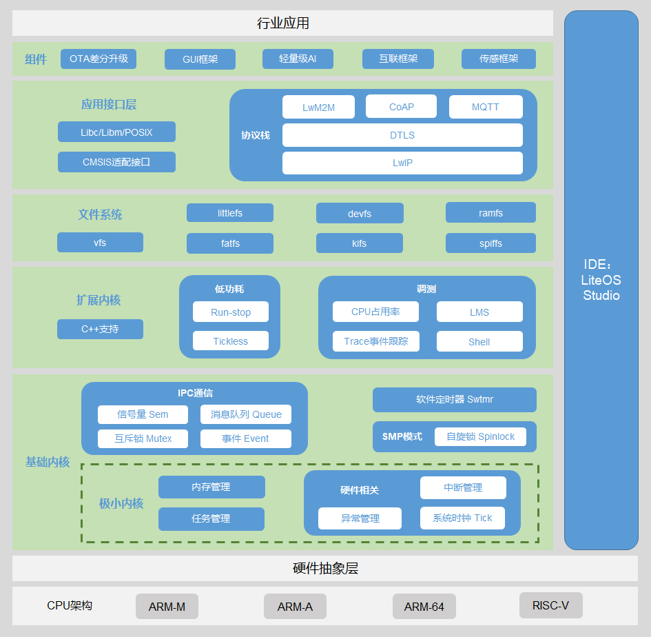

# Huawei LiteOS 产品介绍

-   **[简介](#简介)**

-   **[架构框图](#架构框图)**

-   **[硬件支持](#硬件支持)**

-   **[代码结构导读](#代码结构导读)**

<h2 id="简介">简介</h2>

Huawei LiteOS是华为面向IoT领域，构建的轻量级物联网操作系统，可广泛应用于智能家居、个人穿戴、车联网、城市公共服务、制造业等领域。

Huawei LiteOS发布于2015年5月的华为网络大会上。自开源社区发布以来，围绕 NB-IoT 物联网市场从技术、生态、解决方案、商用支持等多维度使能合作伙伴，构建开源的物联网生态。目前已经聚合了 50+ MCU 和解决方案合作伙伴，共同推出一批开源开发套件和行业解决方案，帮助众多行业客户快速的推出物联网产品和服务。客户涵盖抄表、停车、路灯、环保、共享单车、物流等众多行业，为开发者提供 “一站式” 完整软件平台，可大幅降低设备布置及维护成本，有效降低开发门槛、缩短开发周期。

Huawei LiteOS开源项目目前支持  ARM64、ARM Cortex-A、ARM Cortex-M0，Cortex-M3，Cortex-M4，Cortex-M7 等芯片架构。

### 优势

-   高实时性，高稳定性。
-   超小内核，基础内核体积可以裁剪至不到10K。
-   低功耗，配套芯片整体功耗低至uA级。
-   支持功能静态裁剪。

### Lincense

Huawei LiteOS遵循BSD-3开源许可协议。

<h2 id="架构框图">架构框图</h2>

**图 1**  Huawei LiteOS架构框图<a name="fig15710165065411"></a>




Huawei LiteOS支持多种芯片架构，如Cortex-M series、Cortex-R series、Cortex-A series等，可以快速移植到多种硬件平台。Huawei LiteOS也支持 UP（单核）与 SMP（多核）模式，即支持在单核或者多核的环境上运行。

除基础内核外，Huawei LiteOS还包含了丰富的组件，可帮助用户快速构建物联网相关领域的应用场景及实例，主要包含以下组成部分：

-   基础内核：包括不可裁剪的极小内核和可裁剪的其他模块。极小内核包含任务管理、内存管理、中断管理、异常管理和系统时钟。可裁剪的模块包括信号量、互斥锁、队列管理、事件管理、软件定时器等。
-   扩展内核：在内核基础功能之上，进一步提供扩展功能，包括C++支持、调测组件等。调测组件提供了强大的问题定位及调测能力，包括shell命令、Trace事件跟踪、获取CPU占用率、LMS等。
-   文件系统：提供一套轻量级的文件系统接口以支持文件系统的基本功能，包括vfs、ramfs、fatfs等。
-   系统库接口：提供一系列系统库接口以提升操作系统的可移植性及兼容性，包括Libc/Libm/POSIX以及CMSIS适配层接口。
-   网络协议栈：提供丰富的网络协议栈以支持多种网络功能，包括CoAP/LwM2M、MQTT等。
-   业务组件：构建于上述组件之上的一系列业务组件或框架，以支持更丰富的用户场景，包括OTA、GUI、AI、传感框架等。
-   IDE（Huawei LiteOS Studio）：基于LiteOS操作系统定制开发的一款工具。它提供了界面化的代码编辑、编译、烧录、调试等功能。

<h2 id="硬件支持">硬件支持</h2>

**表 1**  支持的架构

<a name="table1174111111341"></a>
<table><thead align="left"><tr id="row157411111645"><th class="cellrowborder" valign="top" width="50%" id="mcps1.2.3.1.1"><p id="p1874115117419"><a name="p1874115117419"></a><a name="p1874115117419"></a>架构</p>
</th>
<th class="cellrowborder" valign="top" width="50%" id="mcps1.2.3.1.2"><p id="p107416114419"><a name="p107416114419"></a><a name="p107416114419"></a>核</p>
</th>
</tr>
</thead>
<tbody><tr id="row187410111244"><td class="cellrowborder" valign="top" width="50%" headers="mcps1.2.3.1.1 "><p id="p721512579614"><a name="p721512579614"></a><a name="p721512579614"></a>ARM</p>
</td>
<td class="cellrowborder" valign="top" width="50%" headers="mcps1.2.3.1.2 "><p id="p6215175714614"><a name="p6215175714614"></a><a name="p6215175714614"></a>Cortex-M0</p>
</td>
</tr>
<tr id="row18741141114412"><td class="cellrowborder" valign="top" width="50%" headers="mcps1.2.3.1.1 ">&nbsp;&nbsp;</td>
<td class="cellrowborder" valign="top" width="50%" headers="mcps1.2.3.1.2 "><p id="p1521595713611"><a name="p1521595713611"></a><a name="p1521595713611"></a>Cortex-M3</p>
</td>
</tr>
<tr id="row37416111417"><td class="cellrowborder" valign="top" width="50%" headers="mcps1.2.3.1.1 ">&nbsp;&nbsp;</td>
<td class="cellrowborder" valign="top" width="50%" headers="mcps1.2.3.1.2 "><p id="p102158577613"><a name="p102158577613"></a><a name="p102158577613"></a>Cortex-M4</p>
</td>
</tr>
<tr id="row6741111340"><td class="cellrowborder" valign="top" width="50%" headers="mcps1.2.3.1.1 ">&nbsp;&nbsp;</td>
<td class="cellrowborder" valign="top" width="50%" headers="mcps1.2.3.1.2 "><p id="p82151577616"><a name="p82151577616"></a><a name="p82151577616"></a>Cortex-M7</p>
</td>
</tr>
<tr id="row10741011246"><td class="cellrowborder" valign="top" width="50%" headers="mcps1.2.3.1.1 ">&nbsp;&nbsp;</td>
<td class="cellrowborder" valign="top" width="50%" headers="mcps1.2.3.1.2 "><p id="p162151457462"><a name="p162151457462"></a><a name="p162151457462"></a>Cortex-A7</p>
</td>
</tr>
<tr id="row1618983181011"><td class="cellrowborder" valign="top" width="50%" headers="mcps1.2.3.1.1 ">&nbsp;&nbsp;</td>
<td class="cellrowborder" valign="top" width="50%" headers="mcps1.2.3.1.2 "><p id="p8215357261"><a name="p8215357261"></a><a name="p8215357261"></a>Cortex-A9</p>
</td>
</tr>
<tr id="row1246710552912"><td class="cellrowborder" valign="top" width="50%" headers="mcps1.2.3.1.1 ">&nbsp;&nbsp;</td>
<td class="cellrowborder" valign="top" width="50%" headers="mcps1.2.3.1.2 "><p id="p5723194014101"><a name="p5723194014101"></a><a name="p5723194014101"></a>Cortex-A53</p>
</td>
</tr>
<tr id="row14722240151019"><td class="cellrowborder" valign="top" width="50%" headers="mcps1.2.3.1.1 "><p id="p117221440111011"><a name="p117221440111011"></a><a name="p117221440111011"></a>ARM64</p>
</td>
<td class="cellrowborder" valign="top" width="50%" headers="mcps1.2.3.1.2 ">&nbsp;&nbsp;</td>
</tr>
<tr id="row5168183681011"><td class="cellrowborder" valign="top" width="50%" headers="mcps1.2.3.1.1 "><p id="p91693365104"><a name="p91693365104"></a><a name="p91693365104"></a>RISC-V</p>
</td>
<td class="cellrowborder" valign="top" width="50%" headers="mcps1.2.3.1.2 ">&nbsp;&nbsp;</td>
</tr>
</tbody>
</table>

<h2 id="代码结构导读">代码结构导读</h2>

### LiteOS代码入口

LiteOS入口在工程对应的main.c中，基本流程如下：

```c
INT32 main(VOID)
{
    HardwareInit();

    PRINT_RELEASE("\n********Hello Huawei LiteOS********\n"
                  "\nLiteOS Kernel Version : %s\n"
                  "build data : %s %s\n\n"
                  "**********************************\n",
                  HW_LITEOS_KERNEL_VERSION_STRING, __DATE__, __TIME__);

    UINT32 ret = OsMain();
    if (ret != LOS_OK) {
        return LOS_NOK;
    }

    OsStart();
    return 0;
}
```

首先进行硬件初始化HardwareInit\(\)，然后打印Huawei LiteOS的版本信息；

接着执行OsMain\(\)初始化Huawei LiteOS内核及例程，在OsMain\(\)函数中会创建用户任务，其任务处理函数为app\_init\(\)；

最后调用OsStart\(\)开始任务调度，Huawei LiteOS开始正常工作。

### Huawei LiteOS的代码目录结构说明

参见Huawei LiteOS码云代码仓的markdown文档：<a href="https://gitee.com/LiteOS/LiteOS/blob/master/doc/LiteOS_Code_Info.md#liteos%E7%9A%84%E4%BB%A3%E7%A0%81%E7%9B%AE%E5%BD%95%E7%BB%93%E6%9E%84%E8%AF%B4%E6%98%8E" target="_blank">LiteOS的代码目录结构说明</a>。