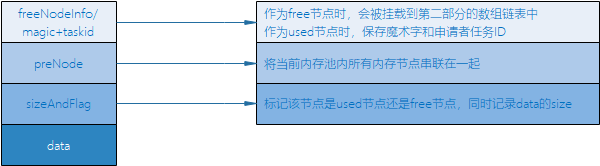
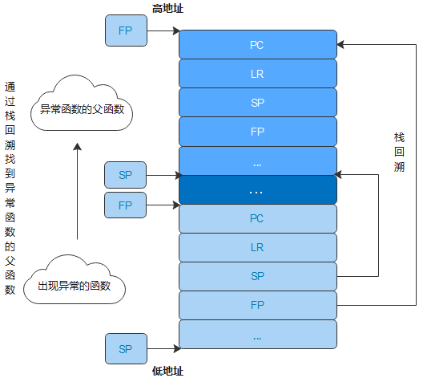
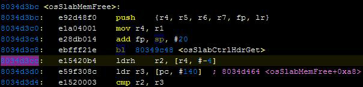
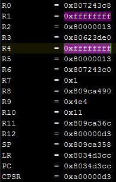
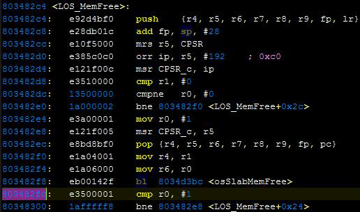
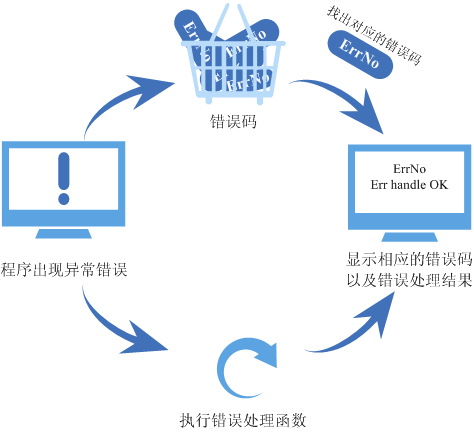
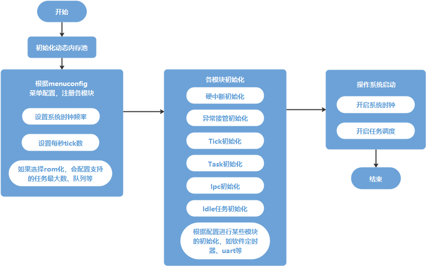

# Huawei LiteOS Kernel开发指南

## 目 录

-   [知识共享许可协议说明](#1)
-   [前言](#2)
-   [概述](#3)
-   [任务](#任务)
-   [内存](#内存)
-   [中断](#中断)
-   [异常接管](#异常接管)
-   [错误处理](#错误处理)
-   [队列](#队列)
-   [事件](#事件)
-   [信号量](#信号量)
-   [互斥锁](#互斥锁)
-   [软件定时器](#软件定时器)
-   [自旋锁](#自旋锁)
-   [C++支持](#C++支持)
-   [其他](#其他)
    -   [时间管理](#时间管理)
    -   [双向链表](#双向链表)
    -   [原子操作](#原子操作)
    -   [位操作](#位操作)
-   [附录](#附录)
    -   [Huawei LiteOS Kernel启动流程](#setup)

<h2 id="1">1.知识共享许可协议说明</h2>

**您可以自由地：**  

**分享** 在任何媒介以任何形式复制、发行本文档

**演绎** 修改、转换或以本文档为基础进行创作

只要你遵守许可协议条款，许可人就无法收回你的这些权利


**惟须遵守下列条件：**  

**署名** 您必须提供适当的证书，提供一个链接到许可证，并指示是否作出更改。您可以以任何合理的方式这样做，但不是以任何方式表明，许可方赞同您或您的使用。

**非商业性使用** 您不得将本文档用于商业目的。

**相同方式共享** 如果您的修改、转换，或以本文档为基础进行创作，仅得依本素材的授权条款来散布您的贡献作品。

**没有附加限制** 您不能增设法律条款或科技措施，来限制别人依授权条款本已许可的作为。


**声明：**  

当您使用本素材中属于公众领域的元素，或当法律有例外或限制条款允许您的使用，则您不需要遵守本授权条款。

未提供保证。本授权条款未必能完全提供您预期用途所需要的所有许可。例如：形象权、隐私权、著作人格权等其他权利，可能限制您如何使用本素材。

> **须知：**   
>为了方便用户理解，这是协议的概述。可以访问网址<https://creativecommons.org/licenses/by-nc-sa/3.0/legalcode>了解完整协议内容。  

<h2 id="2">2.前言</h2>

**目的**

本文档介绍Huawei LiteOS的体系结构，并介绍如何进行开发和调试。

**读者对象**

本文档主要适用于Huawei LiteOS的开发者，主要适用于以下对象：

- 物联网端侧软件开发工程师
- 物联网架构设计师

**符号约定**

在本文中可能出现下列标志，它们所代表的含义如下。  

| 符号 | 说明 |  
| - | :- |  
|| 用于警示紧急的危险情形，若不避免，将会导致人员死亡或严重的人身伤害 |                                                       
|| 用于警示潜在的危险情形，若不避免，可能会导致人员死亡或严重的人身伤害 |
|| 用于警示潜在的危险情形，若不避免，可能会导致中度或轻微的人身伤害 |
|| 用于传递设备或环境安全警示信息，若不避免，可能会导致设备损坏、数据丢失、设备性能降低或其它不可预知的结果，“注意”不涉及人身伤害 |
|| “说明”不是安全警示信息，不涉及人身、设备及环境伤害信息 |


<h2 id="3">3.概述</h2>

Huawei LiteOS是轻量级的实时操作系统，具备轻量级、低功耗、快速启动、组件丰富等关键能力。

### 内核架构

**图 1**  Huawei LiteOS Kernel的基本框架图<a name="f1eee3c6e1dea487dbd09c754ac1f0383"></a>  


Huawei LiteOS基础内核包括不可裁剪的极小内核和可裁剪的其他模块。极小内核包含任务管理、内存管理、中断管理、异常管理和系统时钟。可裁剪的模块包括信号量、互斥锁、队列管理、事件管理、软件定时器等。
Huawei LiteOS支持 UP（单核）与 SMP（多核）模式，即支持在单核或者多核的环境上运行。

### Lincense

Huawei LiteOS Kernel遵循BSD-3开源许可协议。

### 各模块简介

**任务管理**

提供任务的创建、删除、延迟、挂起、恢复等功能，以及锁定和解锁任务调度。支持任务按优先级高低的抢占调度以及同优先级时间片轮转调度。

**内存管理**

-   提供静态内存和动态内存两种算法，支持内存申请、释放。目前支持的内存管理算法有固定大小的BOX算法、动态申请的bestfit算法和bestfit\_little算法。
-   提供内存统计、内存越界检测功能。

**硬件相关**

提供中断管理、异常管理、系统时钟等功能。

-   中断管理：提供中断的创建、删除、使能、禁止、请求位的清除功能。
-   异常管理：系统运行过程中发生异常后，跳转到异常处理模块，打印当前发生异常的函数调用栈信息，或者保存当前系统状态。
-   Tick ：Tick是操作系统调度的基本时间单位，对应的时长由每秒Tick数决定，由用户配置。

**IPC通信**

提供消息队列、事件、信号量和互斥锁功能。

-   消息队列：支持消息队列的创建、删除、发送和接收功能。
-   事件：支持读事件和写事件功能。
-   信号量：支持信号量的创建、删除、申请和释放功能。
-   互斥锁：支持互斥锁的创建、删除、申请和释放功能。

**软件定时器**

软件定时器提供了定时器的创建、删除、启动、停止功能。

**自旋锁**

多核场景下，支持自旋锁的初始化、申请、释放功能。

**低功耗**

-   Run-stop：即休眠唤醒，是Huawei LiteOS提供的保存系统现场镜像以及从系统现场镜像中恢复运行的机制。
-   Tickless：Tickless机制通过计算下一次有意义的时钟中断的时间，来减少不必要的时钟中断，从而降低系统功耗。打开Tickless功能后，系统会在CPU空闲时启动Tickless机制。

**维测**

-   CPU占用率：可以获取系统或者指定任务的CPU占用率。
-   Trace事件跟踪：实时获取事件发生的上下文，并写入缓冲区。支持自定义缓冲区，跟踪指定模块的事件，开启/停止Trace，清除/输出trace缓冲区数据等。
-   LMS：实时检测内存操作合法性，LMS能够检测的内存问题包括缓冲区溢出（buffer overflow），释放后使用（use after free），多重释放（double free）和释放野指针（wild pointer）。
-   Shell：Huawei LiteOS Shell使用串口接收用户输入的命令，通过命令的方式调用、执行相应的应用程序。Huawei LiteOS Shell支持常用的基本调试功能，同时支持用户添加自定义命令。

**C++支持**

Huawei LiteOS支持部分STL特性、异常和RTTI特性，其他特性由编译器支持。

## 使用约束

-   Huawei LiteOS提供一套自有OS接口，同时也支持POSIX和CMSIS接口。请勿混用这些接口。混用接口可能导致不可预知的错误，例如：用POSIX接口申请信号量，但用Huawei LiteOS接口释放信号量。
-   开发驱动程序只能用Huawei LiteOS的接口，上层APP建议用POSIX接口。


<h2 id="任务">任务</h2>
<h3 id="概述-0">概述</h3>

#### 基本概念<a name="section734172610531"></a>

从系统角度看，任务是竞争系统资源的最小运行单元。任务可以使用或等待CPU、使用内存空间等系统资源，并独立于其它任务运行。

Huawei LiteOS的任务模块可以给用户提供多个任务，实现任务间的切换，帮助用户管理业务程序流程。Huawei LiteOS的任务模块具有如下特性：

-   支持多任务。
-   一个任务表示一个线程。
-   抢占式调度机制，高优先级的任务可打断低优先级任务，低优先级任务必须在高优先级任务阻塞或结束后才能得到调度。
-   相同优先级任务支持时间片轮转调度方式。
-   共有32个优先级\[0-31\]，最高优先级为0，最低优先级为31。

#### 任务相关概念<a name="section5879050715587"></a>

**任务状态**

Huawei LiteOS系统中的任务有多种运行状态。系统初始化完成后，创建的任务就可以在系统中竞争一定的资源，由内核进行调度。

任务状态通常分为以下四种：

-   就绪（Ready）：该任务在就绪队列中，只等待CPU。
-   运行（Running）：该任务正在执行。
-   阻塞（Blocked）：该任务不在就绪队列中。包含任务被挂起（suspend状态）、任务被延时（delay状态）、任务正在等待信号量、读写队列或者等待事件等。
-   退出态（Dead）：该任务运行结束，等待系统回收资源。

**任务状态迁移**

**图 1**  任务状态示意图<a name="fig4529463815587"></a>  


任务状态迁移说明：

-   就绪态→运行态

    任务创建后进入就绪态，发生任务切换时，就绪队列中最高优先级的任务被执行，从而进入运行态，但此刻该任务依旧在就绪队列中。


-   运行态→阻塞态

    正在运行的任务发生阻塞（挂起、延时、读信号量等）时，该任务会从就绪队列中删除，任务状态由运行态变成阻塞态，然后发生任务切换，运行就绪队列中最高优先级任务。


-   阻塞态→就绪态（阻塞态→运行态）

    阻塞的任务被恢复后（任务恢复、延时时间超时、读信号量超时或读到信号量等），此时被恢复的任务会被加入就绪队列，从而由阻塞态变成就绪态；此时如果被恢复任务的优先级高于正在运行任务的优先级，则会发生任务切换，该任务由就绪态变成运行态。


-   就绪态→阻塞态

    任务也有可能在就绪态时被阻塞（挂起），此时任务状态由就绪态变为阻塞态，该任务从就绪队列中删除，不会参与任务调度，直到该任务被恢复。


-   运行态→就绪态

    有更高优先级任务创建或者恢复后，会发生任务调度，此刻就绪队列中最高优先级任务变为运行态，那么原先运行的任务由运行态变为就绪态，依然在就绪队列中。


-   运行态→退出态

    运行中的任务运行结束，任务状态由运行态变为退出态。退出态包含任务运行结束的正常退出状态以及Invalid状态。例如，任务运行结束但是没有自删除，对外呈现的就是Invalid状态，即退出态。


-   阻塞态→退出态

    阻塞的任务调用删除接口，任务状态由阻塞态变为退出态。


**任务ID**

任务ID，在任务创建时通过参数返回给用户，是任务的重要标识。系统中的ID号是唯一的。用户可以通过任务ID对指定任务进行任务挂起、任务恢复、查询任务名等操作。

**任务优先级**

优先级表示任务执行的优先顺序。任务的优先级决定了在发生任务切换时即将要执行的任务，就绪队列中最高优先级的任务将得到执行。

**任务入口函数**

新任务得到调度后将执行的函数。该函数由用户实现，在任务创建时，通过任务创建结构体设置。

**任务栈**

每个任务都拥有一个独立的栈空间，我们称为任务栈。栈空间里保存的信息包含局部变量、寄存器、函数参数、函数返回地址等。

**任务上下文**

任务在运行过程中使用的一些资源，如寄存器等，称为任务上下文。当这个任务挂起时，其他任务继续执行，可能会修改寄存器等资源中的值。如果任务切换时没有保存任务上下文，可能会导致任务恢复后出现未知错误。

因此，Huawei LiteOS在任务切换时会将切出任务的任务上下文信息，保存在自身的任务栈中，以便任务恢复后，从栈空间中恢复挂起时的上下文信息，从而继续执行挂起时被打断的代码。

**任务控制块TCB**

每个任务都含有一个任务控制块\(TCB\)。TCB包含了任务上下文栈指针（stack pointer）、任务状态、任务优先级、任务ID、任务名、任务栈大小等信息。TCB可以反映出每个任务运行情况。

**任务切换**

任务切换包含获取就绪队列中最高优先级任务、切出任务上下文保存、切入任务上下文恢复等动作。

#### 运作机制<a name="section1786939515524"></a>

用户创建任务时，系统会初始化任务栈，预置上下文。此外，系统还会将“任务入口函数”地址放在相应位置。这样在任务第一次启动进入运行态时，将会执行“任务入口函数”。

<h3 id="开发指导">开发指导</h3>

#### 使用场景<a name="section5224652316715"></a>

任务创建后，内核可以执行锁任务调度，解锁任务调度，挂起，恢复，延时等操作，同时也可以设置任务优先级，获取任务优先级。

#### 功能<a name="section21906860141415"></a>

Huawei LiteOS 的任务管理模块提供下面几种功能，接口详细信息可以查看API参考。

<a name="table65300298141415"></a>
<table><thead align="left"><tr id="row54518477141415"><th class="cellrowborder" valign="top" width="23.142314231423143%" id="mcps1.1.4.1.1"><p id="p53920492141415"><a name="p53920492141415"></a><a name="p53920492141415"></a>功能分类</p>
</th>
<th class="cellrowborder" valign="top" width="25.452545254525454%" id="mcps1.1.4.1.2"><p id="p5483720141415"><a name="p5483720141415"></a><a name="p5483720141415"></a>接口名</p>
</th>
<th class="cellrowborder" valign="top" width="51.4051405140514%" id="mcps1.1.4.1.3"><p id="p41528136141415"><a name="p41528136141415"></a><a name="p41528136141415"></a>描述</p>
</th>
</tr>
</thead>
<tbody><tr id="row8335828141415"><td class="cellrowborder" rowspan="5" valign="top" width="23.142314231423143%" headers="mcps1.1.4.1.1 "><p id="p4113493141415"><a name="p4113493141415"></a><a name="p4113493141415"></a>创建和删除任务</p>
</td>
<td class="cellrowborder" valign="top" width="25.452545254525454%" headers="mcps1.1.4.1.2 "><p id="p64757555141415"><a name="p64757555141415"></a><a name="p64757555141415"></a>LOS_TaskCreateOnly</p>
</td>
<td class="cellrowborder" valign="top" width="51.4051405140514%" headers="mcps1.1.4.1.3 "><p id="p10870613141415"><a name="p10870613141415"></a><a name="p10870613141415"></a>创建任务，并使该任务进入suspend状态，不对该任务进行调度。如果需要调度，可以调用LOS_TaskResume使该任务进入ready状态</p>
</td>
</tr>
<tr id="row15367626144438"><td class="cellrowborder" valign="top" headers="mcps1.1.4.1.1 "><p id="p4090907144438"><a name="p4090907144438"></a><a name="p4090907144438"></a>LOS_TaskCreate</p>
</td>
<td class="cellrowborder" valign="top" headers="mcps1.1.4.1.2 "><p id="p62928011144438"><a name="p62928011144438"></a><a name="p62928011144438"></a>创建任务，并使该任务进入ready状态，如果就绪队列中没有更高优先级的任务，则运行该任务</p>
</td>
</tr>
<tr id="row178341441114418"><td class="cellrowborder" valign="top" headers="mcps1.1.4.1.1 "><p id="p12834104194415"><a name="p12834104194415"></a><a name="p12834104194415"></a>LOS_TaskCreateOnlyStatic</p>
</td>
<td class="cellrowborder" valign="top" headers="mcps1.1.4.1.2 "><p id="p9834164110446"><a name="p9834164110446"></a><a name="p9834164110446"></a>创建任务，任务栈由用户传入，并使该任务进入suspend状态，不对该任务进行调度。如果需要调度，可以调用LOS_TaskResume使该任务进入ready状态</p>
</td>
</tr>
<tr id="row7575193584216"><td class="cellrowborder" valign="top" headers="mcps1.1.4.1.1 "><p id="p1157543520427"><a name="p1157543520427"></a><a name="p1157543520427"></a>LOS_TaskCreateStatic</p>
</td>
<td class="cellrowborder" valign="top" headers="mcps1.1.4.1.2 "><p id="p125751635184210"><a name="p125751635184210"></a><a name="p125751635184210"></a>创建任务，任务栈由用户传入，并使该任务进入ready状态，如果就绪队列中没有更高优先级的任务，则运行该任务</p>
</td>
</tr>
<tr id="row193541212163511"><td class="cellrowborder" valign="top" headers="mcps1.1.4.1.1 "><p id="p5831495141415"><a name="p5831495141415"></a><a name="p5831495141415"></a>LOS_TaskDelete</p>
</td>
<td class="cellrowborder" valign="top" headers="mcps1.1.4.1.2 "><p id="p2589124141415"><a name="p2589124141415"></a><a name="p2589124141415"></a>删除指定的任务</p>
</td>
</tr>
<tr id="row53535882141415"><td class="cellrowborder" rowspan="4" valign="top" width="23.142314231423143%" headers="mcps1.1.4.1.1 "><p id="p1134097141415"><a name="p1134097141415"></a><a name="p1134097141415"></a>控制任务状态</p>
</td>
<td class="cellrowborder" valign="top" width="25.452545254525454%" headers="mcps1.1.4.1.2 "><p id="p24753017141415"><a name="p24753017141415"></a><a name="p24753017141415"></a>LOS_TaskResume</p>
</td>
<td class="cellrowborder" valign="top" width="51.4051405140514%" headers="mcps1.1.4.1.3 "><p id="p58837337141415"><a name="p58837337141415"></a><a name="p58837337141415"></a>恢复挂起的任务，使该任务进入ready状态</p>
</td>
</tr>
<tr id="row59773990141415"><td class="cellrowborder" valign="top" headers="mcps1.1.4.1.1 "><p id="p9855022141415"><a name="p9855022141415"></a><a name="p9855022141415"></a>LOS_TaskSuspend</p>
</td>
<td class="cellrowborder" valign="top" headers="mcps1.1.4.1.2 "><p id="p60059331141415"><a name="p60059331141415"></a><a name="p60059331141415"></a>挂起指定的任务，然后切换任务</p>
</td>
</tr>
<tr id="row3663069141415"><td class="cellrowborder" valign="top" headers="mcps1.1.4.1.1 "><p id="p28273200141415"><a name="p28273200141415"></a><a name="p28273200141415"></a>LOS_TaskDelay</p>
</td>
<td class="cellrowborder" valign="top" headers="mcps1.1.4.1.2 "><p id="p8427843141415"><a name="p8427843141415"></a><a name="p8427843141415"></a>任务延时等待，释放CPU，等待时间到期后该任务会重新进入ready状态</p>
</td>
</tr>
<tr id="row8741724141415"><td class="cellrowborder" valign="top" headers="mcps1.1.4.1.1 "><p id="p36991026141415"><a name="p36991026141415"></a><a name="p36991026141415"></a>LOS_TaskYield</p>
</td>
<td class="cellrowborder" valign="top" headers="mcps1.1.4.1.2 "><p id="p43483166141415"><a name="p43483166141415"></a><a name="p43483166141415"></a>当前任务释放CPU，并将其移到具有相同优先级的就绪任务队列的末尾</p>
</td>
</tr>
<tr id="row55804174141415"><td class="cellrowborder" rowspan="2" valign="top" width="23.142314231423143%" headers="mcps1.1.4.1.1 "><p id="p23844275141415"><a name="p23844275141415"></a><a name="p23844275141415"></a>控制任务调度</p>
</td>
<td class="cellrowborder" valign="top" width="25.452545254525454%" headers="mcps1.1.4.1.2 "><p id="p1281258141415"><a name="p1281258141415"></a><a name="p1281258141415"></a>LOS_TaskLock</p>
</td>
<td class="cellrowborder" valign="top" width="51.4051405140514%" headers="mcps1.1.4.1.3 "><p id="p36673079141415"><a name="p36673079141415"></a><a name="p36673079141415"></a>锁任务调度，但任务仍可被中断打断</p>
</td>
</tr>
<tr id="row61622261141415"><td class="cellrowborder" valign="top" headers="mcps1.1.4.1.1 "><p id="p25347244141415"><a name="p25347244141415"></a><a name="p25347244141415"></a>LOS_TaskUnlock</p>
</td>
<td class="cellrowborder" valign="top" headers="mcps1.1.4.1.2 "><p id="p39860875141415"><a name="p39860875141415"></a><a name="p39860875141415"></a>解锁任务调度</p>
</td>
</tr>
<tr id="row23203562141415"><td class="cellrowborder" rowspan="3" valign="top" width="23.142314231423143%" headers="mcps1.1.4.1.1 "><p id="p440345141415"><a name="p440345141415"></a><a name="p440345141415"></a>控制任务优先级</p>
</td>
<td class="cellrowborder" valign="top" width="25.452545254525454%" headers="mcps1.1.4.1.2 "><p id="p35667973141415"><a name="p35667973141415"></a><a name="p35667973141415"></a>LOS_CurTaskPriSet</p>
</td>
<td class="cellrowborder" valign="top" width="51.4051405140514%" headers="mcps1.1.4.1.3 "><p id="p3424661141415"><a name="p3424661141415"></a><a name="p3424661141415"></a>设置当前任务的优先级</p>
</td>
</tr>
<tr id="row31647912144835"><td class="cellrowborder" valign="top" headers="mcps1.1.4.1.1 "><p id="p16395752144835"><a name="p16395752144835"></a><a name="p16395752144835"></a>LOS_TaskPriSet</p>
</td>
<td class="cellrowborder" valign="top" headers="mcps1.1.4.1.2 "><p id="p52987508144835"><a name="p52987508144835"></a><a name="p52987508144835"></a>设置指定任务的优先级</p>
</td>
</tr>
<tr id="row30821950141415"><td class="cellrowborder" valign="top" headers="mcps1.1.4.1.1 "><p id="p13550016141415"><a name="p13550016141415"></a><a name="p13550016141415"></a>LOS_TaskPriGet</p>
</td>
<td class="cellrowborder" valign="top" headers="mcps1.1.4.1.2 "><p id="p23809498141415"><a name="p23809498141415"></a><a name="p23809498141415"></a>获取指定任务的优先级</p>
</td>
</tr>
<tr id="row1421833119412"><td class="cellrowborder" valign="top" width="23.142314231423143%" headers="mcps1.1.4.1.1 "><p id="p12998122195310"><a name="p12998122195310"></a><a name="p12998122195310"></a>设置任务亲和性</p>
</td>
<td class="cellrowborder" valign="top" width="25.452545254525454%" headers="mcps1.1.4.1.2 "><p id="p7999102185313"><a name="p7999102185313"></a><a name="p7999102185313"></a>LOS_TaskCpuAffiSet</p>
</td>
<td class="cellrowborder" valign="top" width="51.4051405140514%" headers="mcps1.1.4.1.3 "><p id="p1699910217539"><a name="p1699910217539"></a><a name="p1699910217539"></a>设置指定任务的运行cpu集合（该函数仅在SMP模式下支持）</p>
</td>
</tr>
<tr id="row269683424112"><td class="cellrowborder" valign="top" width="23.142314231423143%" headers="mcps1.1.4.1.1 "><p id="p38501673543"><a name="p38501673543"></a><a name="p38501673543"></a>回收任务栈资源</p>
</td>
<td class="cellrowborder" valign="top" width="25.452545254525454%" headers="mcps1.1.4.1.2 "><p id="p885017115415"><a name="p885017115415"></a><a name="p885017115415"></a>LOS_TaskResRecycle</p>
</td>
<td class="cellrowborder" valign="top" width="51.4051405140514%" headers="mcps1.1.4.1.3 "><p id="p88505710544"><a name="p88505710544"></a><a name="p88505710544"></a>回收所有待回收的任务栈资源</p>
</td>
</tr>
<tr id="row19937126145221"><td class="cellrowborder" rowspan="3" valign="top" width="23.142314231423143%" headers="mcps1.1.4.1.1 "><p id="p45216412145221"><a name="p45216412145221"></a><a name="p45216412145221"></a>获取任务信息</p>
</td>
<td class="cellrowborder" valign="top" width="25.452545254525454%" headers="mcps1.1.4.1.2 "><p id="p38650789145221"><a name="p38650789145221"></a><a name="p38650789145221"></a>LOS_CurTaskIDGet</p>
</td>
<td class="cellrowborder" valign="top" width="51.4051405140514%" headers="mcps1.1.4.1.3 "><p id="p43706210145221"><a name="p43706210145221"></a><a name="p43706210145221"></a>获取当前任务的ID</p>
</td>
</tr>
<tr id="row18034640145252"><td class="cellrowborder" valign="top" headers="mcps1.1.4.1.1 "><p id="p61024423145252"><a name="p61024423145252"></a><a name="p61024423145252"></a>LOS_TaskInfoGet</p>
</td>
<td class="cellrowborder" valign="top" headers="mcps1.1.4.1.2 "><p id="p44031202145252"><a name="p44031202145252"></a><a name="p44031202145252"></a>获取指定任务的信息，包括任务状态、优先级、任务栈大小、栈顶指针SP、任务入口函数、已使用的任务栈大小等</p>
</td>
</tr>
<tr id="row164182610524"><td class="cellrowborder" valign="top" headers="mcps1.1.4.1.1 "><p id="p541836195218"><a name="p541836195218"></a><a name="p541836195218"></a>LOS_TaskCpuAffiGet</p>
</td>
<td class="cellrowborder" valign="top" headers="mcps1.1.4.1.2 "><p id="p1841815685215"><a name="p1841815685215"></a><a name="p1841815685215"></a>获取指定任务的运行cpu集合（该函数仅在SMP模式下支持）</p>
</td>
</tr>
<tr id="row1897617132814"><td class="cellrowborder" valign="top" width="23.142314231423143%" headers="mcps1.1.4.1.1 "><p id="p16751115280"><a name="p16751115280"></a><a name="p16751115280"></a>任务信息维测</p>
</td>
<td class="cellrowborder" valign="top" width="25.452545254525454%" headers="mcps1.1.4.1.2 "><p id="p1751519285"><a name="p1751519285"></a><a name="p1751519285"></a>LOS_TaskSwitchHookReg</p>
</td>
<td class="cellrowborder" valign="top" width="51.4051405140514%" headers="mcps1.1.4.1.3 "><p id="p77518118284"><a name="p77518118284"></a><a name="p77518118284"></a>注册任务上下文切换的钩子函数。只有开启LOSCFG_BASE_CORE_TSK_MONITOR宏开关后，这个钩子函数才会在任务发生上下文切换时被调用</p>
</td>
</tr>
</tbody>
</table>

> **须知：** 
>-   可以通过make menuconfig配置LOSCFG\_KERNEL\_SMP使能多核模式。在SMP的子菜单中，还可以设置核的数量、使能多任务的核间同步、使能函数跨核调用。
>-   在多核模式下，创建任务时可以传入usCpuAffiMask来配置任务的CPU亲和性，该标志位采用1bit-1core的对应方式，详细可见TSK\_INIT\_PARAM\_S结构体。
>-   各个任务的任务栈大小，在创建任务时可以进行针对性的设置，若设置为0，则使用默认任务栈大小（LOSCFG\_BASE\_CORE\_TSK\_DEFAULT\_STACK\_SIZE）作为任务栈大小。

#### TASK状态<a name="section31234536144156"></a>

Huawei LiteOS任务的大多数状态由内核维护，唯有自删除状态对用户可见，需要用户在创建任务时传入：

<a name="table40176671144552"></a>
<table><thead align="left"><tr id="row45035287144552"><th class="cellrowborder" valign="top" width="31.410000000000004%" id="mcps1.1.4.1.1"><p id="p63302382144552"><a name="p63302382144552"></a><a name="p63302382144552"></a>定义</p>
</th>
<th class="cellrowborder" valign="top" width="27.540000000000003%" id="mcps1.1.4.1.2"><p id="p27219308144552"><a name="p27219308144552"></a><a name="p27219308144552"></a>实际数值</p>
</th>
<th class="cellrowborder" valign="top" width="41.050000000000004%" id="mcps1.1.4.1.3"><p id="p57280343144552"><a name="p57280343144552"></a><a name="p57280343144552"></a>描述</p>
</th>
</tr>
</thead>
<tbody><tr id="row6693266144552"><td class="cellrowborder" valign="top" width="31.410000000000004%" headers="mcps1.1.4.1.1 "><p id="p25321182144552"><a name="p25321182144552"></a><a name="p25321182144552"></a>LOS_TASK_STATUS_DETACHED</p>
</td>
<td class="cellrowborder" valign="top" width="27.540000000000003%" headers="mcps1.1.4.1.2 "><p id="p37749887144552"><a name="p37749887144552"></a><a name="p37749887144552"></a>0x0100</p>
</td>
<td class="cellrowborder" valign="top" width="41.050000000000004%" headers="mcps1.1.4.1.3 "><p id="p37842045144552"><a name="p37842045144552"></a><a name="p37842045144552"></a>任务是自删除的</p>
</td>
</tr>
</tbody>
</table>

用户在调用创建任务接口时，可以将创建任务的TSK\_INIT\_PARAM\_S参数的uwResved域设置为LOS\_TASK\_STATUS\_DETACHED，即自删除状态，设置成自删除状态的任务会在运行完成后执行自删除操作。

> **须知：** 
>自删除状态受LOSCFG\_COMPAT\_POSIX开关影响。
>-   LOSCFG\_COMPAT\_POSIX打开，只有将任务状态设置为LOS\_TASK\_STATUS\_DETACHED才能实现自删除，否则任务完成时不会自删除。
>-   LOSCFG\_COMPAT\_POSIX关闭，任务完成时都会自删除，不管TSK\_INIT\_PARAM\_S参数的uwResved域是否设置为LOS\_TASK\_STATUS\_DETACHED。

#### TASK错误码<a name="section868101994847"></a>

创建任务、删除任务、挂起任务、恢复任务、延时任务等操作存在失败的可能，失败时会返回对应的错误码，以便快速定位错误原因。

<a name="table6015294495642"></a>
<table><thead align="left"><tr id="row2267197395642"><th class="cellrowborder" valign="top" width="5.76%" id="mcps1.1.6.1.1"><p id="p1908783195642"><a name="p1908783195642"></a><a name="p1908783195642"></a>序号</p>
</th>
<th class="cellrowborder" valign="top" width="21.990000000000002%" id="mcps1.1.6.1.2"><p id="p261046995642"><a name="p261046995642"></a><a name="p261046995642"></a>定义</p>
</th>
<th class="cellrowborder" valign="top" width="11.62%" id="mcps1.1.6.1.3"><p id="p1012144095642"><a name="p1012144095642"></a><a name="p1012144095642"></a>实际数值</p>
</th>
<th class="cellrowborder" valign="top" width="29.01%" id="mcps1.1.6.1.4"><p id="p1453028795642"><a name="p1453028795642"></a><a name="p1453028795642"></a>描述</p>
</th>
<th class="cellrowborder" valign="top" width="31.619999999999997%" id="mcps1.1.6.1.5"><p id="p2753561710026"><a name="p2753561710026"></a><a name="p2753561710026"></a>参考解决方案</p>
</th>
</tr>
</thead>
<tbody><tr id="row6366372295642"><td class="cellrowborder" valign="top" width="5.76%" headers="mcps1.1.6.1.1 "><p id="p5648782795642"><a name="p5648782795642"></a><a name="p5648782795642"></a>1</p>
</td>
<td class="cellrowborder" valign="top" width="21.990000000000002%" headers="mcps1.1.6.1.2 "><p id="p1211123695642"><a name="p1211123695642"></a><a name="p1211123695642"></a>LOS_ERRNO_TSK_NO_MEMORY</p>
</td>
<td class="cellrowborder" valign="top" width="11.62%" headers="mcps1.1.6.1.3 "><p id="p4148605495642"><a name="p4148605495642"></a><a name="p4148605495642"></a>0x03000200</p>
</td>
<td class="cellrowborder" valign="top" width="29.01%" headers="mcps1.1.6.1.4 "><p id="p492720095642"><a name="p492720095642"></a><a name="p492720095642"></a>内存空间不足</p>
</td>
<td class="cellrowborder" valign="top" width="31.619999999999997%" headers="mcps1.1.6.1.5 "><p id="p63511053020"><a name="p63511053020"></a><a name="p63511053020"></a>增大动态内存空间，有两种方式可以实现：</p>
<a name="ul8816111853016"></a><a name="ul8816111853016"></a><ul id="ul8816111853016"><li>设置更大的系统动态内存池，配置项为OS_SYS_MEM_SIZE</li><li>释放一部分动态内存</li></ul>
<p id="p54251328201810"><a name="p54251328201810"></a><a name="p54251328201810"></a>如果错误发生在LiteOS启动过程中的任务初始化，还可以通过减少系统支持的最大任务数来解决；如果错误发生在任务创建过程中，也可以减小任务栈大小来解决</p>
</td>
</tr>
<tr id="row4434480695642"><td class="cellrowborder" valign="top" width="5.76%" headers="mcps1.1.6.1.1 "><p id="p3515954495642"><a name="p3515954495642"></a><a name="p3515954495642"></a>2</p>
</td>
<td class="cellrowborder" valign="top" width="21.990000000000002%" headers="mcps1.1.6.1.2 "><p id="p2935083995642"><a name="p2935083995642"></a><a name="p2935083995642"></a>LOS_ERRNO_TSK_PTR_NULL</p>
</td>
<td class="cellrowborder" valign="top" width="11.62%" headers="mcps1.1.6.1.3 "><p id="p2860775495642"><a name="p2860775495642"></a><a name="p2860775495642"></a>0x02000201</p>
</td>
<td class="cellrowborder" valign="top" width="29.01%" headers="mcps1.1.6.1.4 "><p id="p4450954181910"><a name="p4450954181910"></a><a name="p4450954181910"></a>传递给任务创建接口的任务参数initParam为空指针，或者传递给任务信息获取的接口的参数为空指针</p>
</td>
<td class="cellrowborder" valign="top" width="31.619999999999997%" headers="mcps1.1.6.1.5 "><p id="p412423410026"><a name="p412423410026"></a><a name="p412423410026"></a>确保传入的参数不为空指针</p>
</td>
</tr>
<tr id="row5130526095642"><td class="cellrowborder" valign="top" width="5.76%" headers="mcps1.1.6.1.1 "><p id="p6208537795642"><a name="p6208537795642"></a><a name="p6208537795642"></a>3</p>
</td>
<td class="cellrowborder" valign="top" width="21.990000000000002%" headers="mcps1.1.6.1.2 "><p id="p6285965595642"><a name="p6285965595642"></a><a name="p6285965595642"></a>LOS_ERRNO_TSK_STKSZ_NOT_ALIGN</p>
</td>
<td class="cellrowborder" valign="top" width="11.62%" headers="mcps1.1.6.1.3 "><p id="p5846730195642"><a name="p5846730195642"></a><a name="p5846730195642"></a>0x02000202</p>
</td>
<td class="cellrowborder" valign="top" width="29.01%" headers="mcps1.1.6.1.4 "><p id="p3823098095642"><a name="p3823098095642"></a><a name="p3823098095642"></a>暂不使用该错误码</p>
</td>
<td class="cellrowborder" valign="top" width="31.619999999999997%" headers="mcps1.1.6.1.5 "><p id="p6562756010026"><a name="p6562756010026"></a><a name="p6562756010026"></a>-</p>
</td>
</tr>
<tr id="row853450895642"><td class="cellrowborder" valign="top" width="5.76%" headers="mcps1.1.6.1.1 "><p id="p2020651095642"><a name="p2020651095642"></a><a name="p2020651095642"></a>4</p>
</td>
<td class="cellrowborder" valign="top" width="21.990000000000002%" headers="mcps1.1.6.1.2 "><p id="p2611462995642"><a name="p2611462995642"></a><a name="p2611462995642"></a>LOS_ERRNO_TSK_PRIOR_ERROR</p>
</td>
<td class="cellrowborder" valign="top" width="11.62%" headers="mcps1.1.6.1.3 "><p id="p3491023395642"><a name="p3491023395642"></a><a name="p3491023395642"></a>0x02000203</p>
</td>
<td class="cellrowborder" valign="top" width="29.01%" headers="mcps1.1.6.1.4 "><p id="p915662595642"><a name="p915662595642"></a><a name="p915662595642"></a>创建任务或者设置任务优先级时，传入的优先级参数不正确</p>
</td>
<td class="cellrowborder" valign="top" width="31.619999999999997%" headers="mcps1.1.6.1.5 "><p id="p1423211810026"><a name="p1423211810026"></a><a name="p1423211810026"></a>检查任务优先级，必须在[0, 31]的范围内</p>
</td>
</tr>
<tr id="row1530076695642"><td class="cellrowborder" valign="top" width="5.76%" headers="mcps1.1.6.1.1 "><p id="p3140256895642"><a name="p3140256895642"></a><a name="p3140256895642"></a>5</p>
</td>
<td class="cellrowborder" valign="top" width="21.990000000000002%" headers="mcps1.1.6.1.2 "><p id="p6058010795642"><a name="p6058010795642"></a><a name="p6058010795642"></a>LOS_ERRNO_TSK_ENTRY_NULL</p>
</td>
<td class="cellrowborder" valign="top" width="11.62%" headers="mcps1.1.6.1.3 "><p id="p804161495642"><a name="p804161495642"></a><a name="p804161495642"></a>0x02000204</p>
</td>
<td class="cellrowborder" valign="top" width="29.01%" headers="mcps1.1.6.1.4 "><p id="a1114d5c28c884640abc27a8fdc3eb618"><a name="a1114d5c28c884640abc27a8fdc3eb618"></a><a name="a1114d5c28c884640abc27a8fdc3eb618"></a>创建任务时传入的任务入口函数为空指针</p>
</td>
<td class="cellrowborder" valign="top" width="31.619999999999997%" headers="mcps1.1.6.1.5 "><p id="p1195087610026"><a name="p1195087610026"></a><a name="p1195087610026"></a>定义任务入口函数</p>
</td>
</tr>
<tr id="row2386554195642"><td class="cellrowborder" valign="top" width="5.76%" headers="mcps1.1.6.1.1 "><p id="p5406070595642"><a name="p5406070595642"></a><a name="p5406070595642"></a>6</p>
</td>
<td class="cellrowborder" valign="top" width="21.990000000000002%" headers="mcps1.1.6.1.2 "><p id="p1684095295642"><a name="p1684095295642"></a><a name="p1684095295642"></a>LOS_ERRNO_TSK_NAME_EMPTY</p>
</td>
<td class="cellrowborder" valign="top" width="11.62%" headers="mcps1.1.6.1.3 "><p id="p2193989295642"><a name="p2193989295642"></a><a name="p2193989295642"></a>0x02000205</p>
</td>
<td class="cellrowborder" valign="top" width="29.01%" headers="mcps1.1.6.1.4 "><p id="p3230086195642"><a name="p3230086195642"></a><a name="p3230086195642"></a>创建任务时传入的任务名为空指针</p>
</td>
<td class="cellrowborder" valign="top" width="31.619999999999997%" headers="mcps1.1.6.1.5 "><p id="p2849689910026"><a name="p2849689910026"></a><a name="p2849689910026"></a>设置任务名</p>
</td>
</tr>
<tr id="row2227229895642"><td class="cellrowborder" valign="top" width="5.76%" headers="mcps1.1.6.1.1 "><p id="p5922568095642"><a name="p5922568095642"></a><a name="p5922568095642"></a>7</p>
</td>
<td class="cellrowborder" valign="top" width="21.990000000000002%" headers="mcps1.1.6.1.2 "><p id="p3255077595642"><a name="p3255077595642"></a><a name="p3255077595642"></a>LOS_ERRNO_TSK_STKSZ_TOO_SMALL</p>
</td>
<td class="cellrowborder" valign="top" width="11.62%" headers="mcps1.1.6.1.3 "><p id="p1936711095642"><a name="p1936711095642"></a><a name="p1936711095642"></a>0x02000206</p>
</td>
<td class="cellrowborder" valign="top" width="29.01%" headers="mcps1.1.6.1.4 "><p id="p2523210295642"><a name="p2523210295642"></a><a name="p2523210295642"></a>创建任务时传入的任务栈太小</p>
</td>
<td class="cellrowborder" valign="top" width="31.619999999999997%" headers="mcps1.1.6.1.5 "><p id="p62917066101048"><a name="p62917066101048"></a><a name="p62917066101048"></a>增大任务的任务栈大小使之不小于系统设置最小任务栈大小（配置项为LOS_TASK_MIN_STACK_SIZE）</p>
</td>
</tr>
<tr id="row43458669101114"><td class="cellrowborder" valign="top" width="5.76%" headers="mcps1.1.6.1.1 "><p id="p30491270101114"><a name="p30491270101114"></a><a name="p30491270101114"></a>8</p>
</td>
<td class="cellrowborder" valign="top" width="21.990000000000002%" headers="mcps1.1.6.1.2 "><p id="p53873767101114"><a name="p53873767101114"></a><a name="p53873767101114"></a>LOS_ERRNO_TSK_ID_INVALID</p>
</td>
<td class="cellrowborder" valign="top" width="11.62%" headers="mcps1.1.6.1.3 "><p id="p1699001101114"><a name="p1699001101114"></a><a name="p1699001101114"></a>0x02000207</p>
</td>
<td class="cellrowborder" valign="top" width="29.01%" headers="mcps1.1.6.1.4 "><p id="p3401379101114"><a name="p3401379101114"></a><a name="p3401379101114"></a>无效的任务ID</p>
</td>
<td class="cellrowborder" valign="top" width="31.619999999999997%" headers="mcps1.1.6.1.5 "><p id="p7076302101114"><a name="p7076302101114"></a><a name="p7076302101114"></a>检查任务ID</p>
</td>
</tr>
<tr id="row12143904101125"><td class="cellrowborder" valign="top" width="5.76%" headers="mcps1.1.6.1.1 "><p id="p44132204101125"><a name="p44132204101125"></a><a name="p44132204101125"></a>9</p>
</td>
<td class="cellrowborder" valign="top" width="21.990000000000002%" headers="mcps1.1.6.1.2 "><p id="p17938739101125"><a name="p17938739101125"></a><a name="p17938739101125"></a>LOS_ERRNO_TSK_ALREADY_SUSPENDED</p>
</td>
<td class="cellrowborder" valign="top" width="11.62%" headers="mcps1.1.6.1.3 "><p id="p43751775101125"><a name="p43751775101125"></a><a name="p43751775101125"></a>0x02000208</p>
</td>
<td class="cellrowborder" valign="top" width="29.01%" headers="mcps1.1.6.1.4 "><p id="p54232920101125"><a name="p54232920101125"></a><a name="p54232920101125"></a>挂起任务时，发现任务已经被挂起</p>
</td>
<td class="cellrowborder" valign="top" width="31.619999999999997%" headers="mcps1.1.6.1.5 "><p id="p30790405101125"><a name="p30790405101125"></a><a name="p30790405101125"></a>等待这个任务被恢复后，再去尝试挂起这个任务</p>
</td>
</tr>
<tr id="row44185939101121"><td class="cellrowborder" valign="top" width="5.76%" headers="mcps1.1.6.1.1 "><p id="p22291345101121"><a name="p22291345101121"></a><a name="p22291345101121"></a>10</p>
</td>
<td class="cellrowborder" valign="top" width="21.990000000000002%" headers="mcps1.1.6.1.2 "><p id="p60768531101121"><a name="p60768531101121"></a><a name="p60768531101121"></a>LOS_ERRNO_TSK_NOT_SUSPENDED</p>
</td>
<td class="cellrowborder" valign="top" width="11.62%" headers="mcps1.1.6.1.3 "><p id="p23304002101121"><a name="p23304002101121"></a><a name="p23304002101121"></a>0x02000209</p>
</td>
<td class="cellrowborder" valign="top" width="29.01%" headers="mcps1.1.6.1.4 "><p id="p8576005101121"><a name="p8576005101121"></a><a name="p8576005101121"></a>恢复任务时，发现任务未被挂起</p>
</td>
<td class="cellrowborder" valign="top" width="31.619999999999997%" headers="mcps1.1.6.1.5 "><p id="p23567813101121"><a name="p23567813101121"></a><a name="p23567813101121"></a>挂起这个任务后，再去尝试恢复这个任务</p>
</td>
</tr>
<tr id="row25611405101131"><td class="cellrowborder" valign="top" width="5.76%" headers="mcps1.1.6.1.1 "><p id="p61257961101131"><a name="p61257961101131"></a><a name="p61257961101131"></a>11</p>
</td>
<td class="cellrowborder" valign="top" width="21.990000000000002%" headers="mcps1.1.6.1.2 "><p id="p62947776101131"><a name="p62947776101131"></a><a name="p62947776101131"></a>LOS_ERRNO_TSK_NOT_CREATED</p>
</td>
<td class="cellrowborder" valign="top" width="11.62%" headers="mcps1.1.6.1.3 "><p id="p65605116101131"><a name="p65605116101131"></a><a name="p65605116101131"></a>0x0200020a</p>
</td>
<td class="cellrowborder" valign="top" width="29.01%" headers="mcps1.1.6.1.4 "><p id="p12414213101131"><a name="p12414213101131"></a><a name="p12414213101131"></a>任务未被创建</p>
</td>
<td class="cellrowborder" valign="top" width="31.619999999999997%" headers="mcps1.1.6.1.5 "><p id="p66027202101131"><a name="p66027202101131"></a><a name="p66027202101131"></a>创建这个任务，这个错误可能会发生在以下操作中：</p>
<a name="ul17581554133315"></a><a name="ul17581554133315"></a><ul id="ul17581554133315"><li>删除任务</li><li>恢复/挂起任务</li><li>设置指定任务的优先级</li><li>获取指定任务的信息</li><li>设置指定任务的运行cpu集合</li></ul>
</td>
</tr>
<tr id="row61184987101143"><td class="cellrowborder" valign="top" width="5.76%" headers="mcps1.1.6.1.1 "><p id="p57036951101143"><a name="p57036951101143"></a><a name="p57036951101143"></a>12</p>
</td>
<td class="cellrowborder" valign="top" width="21.990000000000002%" headers="mcps1.1.6.1.2 "><p id="p56590286101143"><a name="p56590286101143"></a><a name="p56590286101143"></a>LOS_ERRNO_TSK_DELETE_LOCKED</p>
</td>
<td class="cellrowborder" valign="top" width="11.62%" headers="mcps1.1.6.1.3 "><p id="p20410474101143"><a name="p20410474101143"></a><a name="p20410474101143"></a>0x0300020b</p>
</td>
<td class="cellrowborder" valign="top" width="29.01%" headers="mcps1.1.6.1.4 "><p id="p42635731101143"><a name="p42635731101143"></a><a name="p42635731101143"></a>删除任务时，任务处于锁定状态</p>
</td>
<td class="cellrowborder" valign="top" width="31.619999999999997%" headers="mcps1.1.6.1.5 "><p id="p19608837101953"><a name="p19608837101953"></a><a name="p19608837101953"></a>解锁任务之后再删除任务</p>
</td>
</tr>
<tr id="row55331775101146"><td class="cellrowborder" valign="top" width="5.76%" headers="mcps1.1.6.1.1 "><p id="p52688791101146"><a name="p52688791101146"></a><a name="p52688791101146"></a>13</p>
</td>
<td class="cellrowborder" valign="top" width="21.990000000000002%" headers="mcps1.1.6.1.2 "><p id="p39933692101146"><a name="p39933692101146"></a><a name="p39933692101146"></a>LOS_ERRNO_TSK_MSG_NONZERO</p>
</td>
<td class="cellrowborder" valign="top" width="11.62%" headers="mcps1.1.6.1.3 "><p id="p13403605101146"><a name="p13403605101146"></a><a name="p13403605101146"></a>0x0200020c</p>
</td>
<td class="cellrowborder" valign="top" width="29.01%" headers="mcps1.1.6.1.4 "><p id="p11950219101146"><a name="p11950219101146"></a><a name="p11950219101146"></a>暂不使用该错误码</p>
</td>
<td class="cellrowborder" valign="top" width="31.619999999999997%" headers="mcps1.1.6.1.5 "><p id="p28443653101146"><a name="p28443653101146"></a><a name="p28443653101146"></a>-</p>
</td>
</tr>
<tr id="row2857798210120"><td class="cellrowborder" valign="top" width="5.76%" headers="mcps1.1.6.1.1 "><p id="p3311521410120"><a name="p3311521410120"></a><a name="p3311521410120"></a>14</p>
</td>
<td class="cellrowborder" valign="top" width="21.990000000000002%" headers="mcps1.1.6.1.2 "><p id="p6508665810120"><a name="p6508665810120"></a><a name="p6508665810120"></a>LOS_ERRNO_TSK_DELAY_IN_INT</p>
</td>
<td class="cellrowborder" valign="top" width="11.62%" headers="mcps1.1.6.1.3 "><p id="p3752793910120"><a name="p3752793910120"></a><a name="p3752793910120"></a>0x0300020d</p>
</td>
<td class="cellrowborder" valign="top" width="29.01%" headers="mcps1.1.6.1.4 "><p id="p1986418410120"><a name="p1986418410120"></a><a name="p1986418410120"></a>中断期间，进行任务延时</p>
</td>
<td class="cellrowborder" valign="top" width="31.619999999999997%" headers="mcps1.1.6.1.5 "><p id="p6549504910120"><a name="p6549504910120"></a><a name="p6549504910120"></a>等待退出中断后再进行延时操作</p>
</td>
</tr>
<tr id="row4447897810129"><td class="cellrowborder" valign="top" width="5.76%" headers="mcps1.1.6.1.1 "><p id="p4602745410129"><a name="p4602745410129"></a><a name="p4602745410129"></a>15</p>
</td>
<td class="cellrowborder" valign="top" width="21.990000000000002%" headers="mcps1.1.6.1.2 "><p id="p3723625410129"><a name="p3723625410129"></a><a name="p3723625410129"></a>LOS_ERRNO_TSK_DELAY_IN_LOCK</p>
</td>
<td class="cellrowborder" valign="top" width="11.62%" headers="mcps1.1.6.1.3 "><p id="p6334657010129"><a name="p6334657010129"></a><a name="p6334657010129"></a>0x0200020e</p>
</td>
<td class="cellrowborder" valign="top" width="29.01%" headers="mcps1.1.6.1.4 "><p id="p3079857110129"><a name="p3079857110129"></a><a name="p3079857110129"></a>在任务锁定状态下，延时该任务</p>
</td>
<td class="cellrowborder" valign="top" width="31.619999999999997%" headers="mcps1.1.6.1.5 "><p id="p1165636110129"><a name="p1165636110129"></a><a name="p1165636110129"></a>解锁任务之后再延时任务</p>
</td>
</tr>
<tr id="row6331348110124"><td class="cellrowborder" valign="top" width="5.76%" headers="mcps1.1.6.1.1 "><p id="p2811835210124"><a name="p2811835210124"></a><a name="p2811835210124"></a>16</p>
</td>
<td class="cellrowborder" valign="top" width="21.990000000000002%" headers="mcps1.1.6.1.2 "><p id="p1648117254216"><a name="p1648117254216"></a><a name="p1648117254216"></a>LOS_ERRNO_TSK_YIELD_IN_LOCK</p>
</td>
<td class="cellrowborder" valign="top" width="11.62%" headers="mcps1.1.6.1.3 "><p id="p224588410124"><a name="p224588410124"></a><a name="p224588410124"></a>0x0200020f</p>
</td>
<td class="cellrowborder" valign="top" width="29.01%" headers="mcps1.1.6.1.4 "><p id="p568818398214"><a name="p568818398214"></a><a name="p568818398214"></a>在任务锁定状态下，进行Yield操作</p>
</td>
<td class="cellrowborder" valign="top" width="31.619999999999997%" headers="mcps1.1.6.1.5 "><p id="p3840802610124"><a name="p3840802610124"></a><a name="p3840802610124"></a>任务解锁后再进行Yield操作</p>
</td>
</tr>
<tr id="row4160002610127"><td class="cellrowborder" valign="top" width="5.76%" headers="mcps1.1.6.1.1 "><p id="p1415891810127"><a name="p1415891810127"></a><a name="p1415891810127"></a>17</p>
</td>
<td class="cellrowborder" valign="top" width="21.990000000000002%" headers="mcps1.1.6.1.2 "><p id="p602173510127"><a name="p602173510127"></a><a name="p602173510127"></a>LOS_ERRNO_TSK_YIELD_NOT_ENOUGH_TASK</p>
</td>
<td class="cellrowborder" valign="top" width="11.62%" headers="mcps1.1.6.1.3 "><p id="p1799856510127"><a name="p1799856510127"></a><a name="p1799856510127"></a>0x02000210</p>
</td>
<td class="cellrowborder" valign="top" width="29.01%" headers="mcps1.1.6.1.4 "><p id="p4859767110127"><a name="p4859767110127"></a><a name="p4859767110127"></a>执行Yield操作时，发现具有相同优先级的就绪任务队列中没有其他任务</p>
</td>
<td class="cellrowborder" valign="top" width="31.619999999999997%" headers="mcps1.1.6.1.5 "><p id="p4409730210127"><a name="p4409730210127"></a><a name="p4409730210127"></a>增加与当前任务具有相同优先级的任务数</p>
</td>
</tr>
<tr id="row44067988101158"><td class="cellrowborder" valign="top" width="5.76%" headers="mcps1.1.6.1.1 "><p id="p12737284101158"><a name="p12737284101158"></a><a name="p12737284101158"></a>18</p>
</td>
<td class="cellrowborder" valign="top" width="21.990000000000002%" headers="mcps1.1.6.1.2 "><p id="p25087064101158"><a name="p25087064101158"></a><a name="p25087064101158"></a>LOS_ERRNO_TSK_TCB_UNAVAILABLE</p>
</td>
<td class="cellrowborder" valign="top" width="11.62%" headers="mcps1.1.6.1.3 "><p id="p18786297101158"><a name="p18786297101158"></a><a name="p18786297101158"></a>0x02000211</p>
</td>
<td class="cellrowborder" valign="top" width="29.01%" headers="mcps1.1.6.1.4 "><p id="p45295054101158"><a name="p45295054101158"></a><a name="p45295054101158"></a>创建任务时，发现没有空闲的任务控制块可以使用</p>
</td>
<td class="cellrowborder" valign="top" width="31.619999999999997%" headers="mcps1.1.6.1.5 "><p id="p45020735101158"><a name="p45020735101158"></a><a name="p45020735101158"></a>调用LOS_TaskResRecyle接口回收空闲的任务控制块，如果回收后依然创建失败，再增加系统的任务控制块数量</p>
</td>
</tr>
<tr id="row13287662101156"><td class="cellrowborder" valign="top" width="5.76%" headers="mcps1.1.6.1.1 "><p id="p2558809101156"><a name="p2558809101156"></a><a name="p2558809101156"></a>19</p>
</td>
<td class="cellrowborder" valign="top" width="21.990000000000002%" headers="mcps1.1.6.1.2 "><p id="p5936981101156"><a name="p5936981101156"></a><a name="p5936981101156"></a>LOS_ERRNO_TSK_HOOK_NOT_MATCH</p>
</td>
<td class="cellrowborder" valign="top" width="11.62%" headers="mcps1.1.6.1.3 "><p id="p11133449101156"><a name="p11133449101156"></a><a name="p11133449101156"></a>0x02000212</p>
</td>
<td class="cellrowborder" valign="top" width="29.01%" headers="mcps1.1.6.1.4 "><p id="p29394206101156"><a name="p29394206101156"></a><a name="p29394206101156"></a>暂不使用该错误码</p>
</td>
<td class="cellrowborder" valign="top" width="31.619999999999997%" headers="mcps1.1.6.1.5 "><p id="p32120508101156"><a name="p32120508101156"></a><a name="p32120508101156"></a>-</p>
</td>
</tr>
<tr id="row62576359101154"><td class="cellrowborder" valign="top" width="5.76%" headers="mcps1.1.6.1.1 "><p id="p35520303101154"><a name="p35520303101154"></a><a name="p35520303101154"></a>20</p>
</td>
<td class="cellrowborder" valign="top" width="21.990000000000002%" headers="mcps1.1.6.1.2 "><p id="p58572271101154"><a name="p58572271101154"></a><a name="p58572271101154"></a>LOS_ERRNO_TSK_HOOK_IS_FULL</p>
</td>
<td class="cellrowborder" valign="top" width="11.62%" headers="mcps1.1.6.1.3 "><p id="p46733520101154"><a name="p46733520101154"></a><a name="p46733520101154"></a>0x02000213</p>
</td>
<td class="cellrowborder" valign="top" width="29.01%" headers="mcps1.1.6.1.4 "><p id="p27318777101154"><a name="p27318777101154"></a><a name="p27318777101154"></a>暂不使用该错误码</p>
</td>
<td class="cellrowborder" valign="top" width="31.619999999999997%" headers="mcps1.1.6.1.5 "><p id="p65337363101154"><a name="p65337363101154"></a><a name="p65337363101154"></a>-</p>
</td>
</tr>
<tr id="row38567820101152"><td class="cellrowborder" valign="top" width="5.76%" headers="mcps1.1.6.1.1 "><p id="p36985730101152"><a name="p36985730101152"></a><a name="p36985730101152"></a>21</p>
</td>
<td class="cellrowborder" valign="top" width="21.990000000000002%" headers="mcps1.1.6.1.2 "><p id="p43054160101152"><a name="p43054160101152"></a><a name="p43054160101152"></a>LOS_ERRNO_TSK_OPERATE_SYSTEM_TASK</p>
</td>
<td class="cellrowborder" valign="top" width="11.62%" headers="mcps1.1.6.1.3 "><p id="p64834975101152"><a name="p64834975101152"></a><a name="p64834975101152"></a>0x02000214</p>
</td>
<td class="cellrowborder" valign="top" width="29.01%" headers="mcps1.1.6.1.4 "><p id="p17141655101152"><a name="p17141655101152"></a><a name="p17141655101152"></a>不允许删除、挂起、延时系统级别的任务，例如idle任务、软件定时器任务，也不允许修改系统级别的任务优先级</p>
</td>
<td class="cellrowborder" valign="top" width="31.619999999999997%" headers="mcps1.1.6.1.5 "><p id="p46296799101152"><a name="p46296799101152"></a><a name="p46296799101152"></a>检查任务ID，不要操作系统任务</p>
</td>
</tr>
<tr id="row7233065101149"><td class="cellrowborder" valign="top" width="5.76%" headers="mcps1.1.6.1.1 "><p id="p49007378101149"><a name="p49007378101149"></a><a name="p49007378101149"></a>22</p>
</td>
<td class="cellrowborder" valign="top" width="21.990000000000002%" headers="mcps1.1.6.1.2 "><p id="p10174680101149"><a name="p10174680101149"></a><a name="p10174680101149"></a>LOS_ERRNO_TSK_SUSPEND_LOCKED</p>
</td>
<td class="cellrowborder" valign="top" width="11.62%" headers="mcps1.1.6.1.3 "><p id="p18842722101149"><a name="p18842722101149"></a><a name="p18842722101149"></a>0x03000215</p>
</td>
<td class="cellrowborder" valign="top" width="29.01%" headers="mcps1.1.6.1.4 "><p id="p49865496101149"><a name="p49865496101149"></a><a name="p49865496101149"></a>不允许将处于锁定状态的任务挂起</p>
</td>
<td class="cellrowborder" valign="top" width="31.619999999999997%" headers="mcps1.1.6.1.5 "><p id="p12573412101149"><a name="p12573412101149"></a><a name="p12573412101149"></a>任务解锁后，再尝试挂起任务</p>
</td>
</tr>
<tr id="row33009169101238"><td class="cellrowborder" valign="top" width="5.76%" headers="mcps1.1.6.1.1 "><p id="p56496996101238"><a name="p56496996101238"></a><a name="p56496996101238"></a>23</p>
</td>
<td class="cellrowborder" valign="top" width="21.990000000000002%" headers="mcps1.1.6.1.2 "><p id="p12854001101238"><a name="p12854001101238"></a><a name="p12854001101238"></a>LOS_ERRNO_TSK_FREE_STACK_FAILED</p>
</td>
<td class="cellrowborder" valign="top" width="11.62%" headers="mcps1.1.6.1.3 "><p id="p34541150101238"><a name="p34541150101238"></a><a name="p34541150101238"></a>0x02000217</p>
</td>
<td class="cellrowborder" valign="top" width="29.01%" headers="mcps1.1.6.1.4 "><p id="p64962041101238"><a name="p64962041101238"></a><a name="p64962041101238"></a>暂不使用该错误码</p>
</td>
<td class="cellrowborder" valign="top" width="31.619999999999997%" headers="mcps1.1.6.1.5 "><p id="p1956611586403"><a name="p1956611586403"></a><a name="p1956611586403"></a>-</p>
</td>
</tr>
<tr id="row49491606101241"><td class="cellrowborder" valign="top" width="5.76%" headers="mcps1.1.6.1.1 "><p id="p49397169101241"><a name="p49397169101241"></a><a name="p49397169101241"></a>24</p>
</td>
<td class="cellrowborder" valign="top" width="21.990000000000002%" headers="mcps1.1.6.1.2 "><p id="p41747765101241"><a name="p41747765101241"></a><a name="p41747765101241"></a>LOS_ERRNO_TSK_STKAREA_TOO_SMALL</p>
</td>
<td class="cellrowborder" valign="top" width="11.62%" headers="mcps1.1.6.1.3 "><p id="p26125768101241"><a name="p26125768101241"></a><a name="p26125768101241"></a>0x02000218</p>
</td>
<td class="cellrowborder" valign="top" width="29.01%" headers="mcps1.1.6.1.4 "><p id="p15131458101241"><a name="p15131458101241"></a><a name="p15131458101241"></a>暂不使用该错误码</p>
</td>
<td class="cellrowborder" valign="top" width="31.619999999999997%" headers="mcps1.1.6.1.5 "><p id="p456611584402"><a name="p456611584402"></a><a name="p456611584402"></a>-</p>
</td>
</tr>
<tr id="row22231064101243"><td class="cellrowborder" valign="top" width="5.76%" headers="mcps1.1.6.1.1 "><p id="p55885775101243"><a name="p55885775101243"></a><a name="p55885775101243"></a>25</p>
</td>
<td class="cellrowborder" valign="top" width="21.990000000000002%" headers="mcps1.1.6.1.2 "><p id="p30453955101243"><a name="p30453955101243"></a><a name="p30453955101243"></a>LOS_ERRNO_TSK_ACTIVE_FAILED</p>
</td>
<td class="cellrowborder" valign="top" width="11.62%" headers="mcps1.1.6.1.3 "><p id="p50851291101243"><a name="p50851291101243"></a><a name="p50851291101243"></a>0x03000219</p>
</td>
<td class="cellrowborder" valign="top" width="29.01%" headers="mcps1.1.6.1.4 "><p id="p37161625101243"><a name="p37161625101243"></a><a name="p37161625101243"></a>暂不使用该错误码</p>
</td>
<td class="cellrowborder" valign="top" width="31.619999999999997%" headers="mcps1.1.6.1.5 "><p id="p8565165884010"><a name="p8565165884010"></a><a name="p8565165884010"></a>-</p>
</td>
</tr>
<tr id="row17237398101245"><td class="cellrowborder" valign="top" width="5.76%" headers="mcps1.1.6.1.1 "><p id="p54051959101245"><a name="p54051959101245"></a><a name="p54051959101245"></a>26</p>
</td>
<td class="cellrowborder" valign="top" width="21.990000000000002%" headers="mcps1.1.6.1.2 "><p id="p16132553101245"><a name="p16132553101245"></a><a name="p16132553101245"></a>LOS_ERRNO_TSK_CONFIG_TOO_MANY</p>
</td>
<td class="cellrowborder" valign="top" width="11.62%" headers="mcps1.1.6.1.3 "><p id="p31668403101245"><a name="p31668403101245"></a><a name="p31668403101245"></a>0x0200021a</p>
</td>
<td class="cellrowborder" valign="top" width="29.01%" headers="mcps1.1.6.1.4 "><p id="p7353970101245"><a name="p7353970101245"></a><a name="p7353970101245"></a>暂不使用该错误码</p>
</td>
<td class="cellrowborder" valign="top" width="31.619999999999997%" headers="mcps1.1.6.1.5 "><p id="p756455813405"><a name="p756455813405"></a><a name="p756455813405"></a>-</p>
</td>
</tr>
<tr id="row57562865101249"><td class="cellrowborder" valign="top" width="5.76%" headers="mcps1.1.6.1.1 "><p id="p32080501101249"><a name="p32080501101249"></a><a name="p32080501101249"></a>27</p>
</td>
<td class="cellrowborder" valign="top" width="21.990000000000002%" headers="mcps1.1.6.1.2 "><p id="p48383752101249"><a name="p48383752101249"></a><a name="p48383752101249"></a>LOS_ERRNO_TSK_CP_SAVE_AREA_NOT_ALIGN</p>
</td>
<td class="cellrowborder" valign="top" width="11.62%" headers="mcps1.1.6.1.3 "><p id="p26769877101249"><a name="p26769877101249"></a><a name="p26769877101249"></a>0x0200021b</p>
</td>
<td class="cellrowborder" valign="top" width="29.01%" headers="mcps1.1.6.1.4 "><p id="p13268279101249"><a name="p13268279101249"></a><a name="p13268279101249"></a>暂不使用该错误码</p>
</td>
<td class="cellrowborder" valign="top" width="31.619999999999997%" headers="mcps1.1.6.1.5 "><p id="p1056365884019"><a name="p1056365884019"></a><a name="p1056365884019"></a>-</p>
</td>
</tr>
<tr id="row3107909810130"><td class="cellrowborder" valign="top" width="5.76%" headers="mcps1.1.6.1.1 "><p id="p3437898210130"><a name="p3437898210130"></a><a name="p3437898210130"></a>28</p>
</td>
<td class="cellrowborder" valign="top" width="21.990000000000002%" headers="mcps1.1.6.1.2 "><p id="p3323418310130"><a name="p3323418310130"></a><a name="p3323418310130"></a>LOS_ERRNO_TSK_MSG_Q_TOO_MANY</p>
</td>
<td class="cellrowborder" valign="top" width="11.62%" headers="mcps1.1.6.1.3 "><p id="p761434110130"><a name="p761434110130"></a><a name="p761434110130"></a>0x0200021d</p>
</td>
<td class="cellrowborder" valign="top" width="29.01%" headers="mcps1.1.6.1.4 "><p id="p2870059810130"><a name="p2870059810130"></a><a name="p2870059810130"></a>暂不使用该错误码</p>
</td>
<td class="cellrowborder" valign="top" width="31.619999999999997%" headers="mcps1.1.6.1.5 "><p id="p16542125812401"><a name="p16542125812401"></a><a name="p16542125812401"></a>-</p>
</td>
</tr>
<tr id="row6008174710133"><td class="cellrowborder" valign="top" width="5.76%" headers="mcps1.1.6.1.1 "><p id="p3478334510133"><a name="p3478334510133"></a><a name="p3478334510133"></a>29</p>
</td>
<td class="cellrowborder" valign="top" width="21.990000000000002%" headers="mcps1.1.6.1.2 "><p id="p6598760010133"><a name="p6598760010133"></a><a name="p6598760010133"></a>LOS_ERRNO_TSK_CP_SAVE_AREA_NULL</p>
</td>
<td class="cellrowborder" valign="top" width="11.62%" headers="mcps1.1.6.1.3 "><p id="p4339541610133"><a name="p4339541610133"></a><a name="p4339541610133"></a>0x0200021e</p>
</td>
<td class="cellrowborder" valign="top" width="29.01%" headers="mcps1.1.6.1.4 "><p id="p4152524810133"><a name="p4152524810133"></a><a name="p4152524810133"></a>暂不使用该错误码</p>
</td>
<td class="cellrowborder" valign="top" width="31.619999999999997%" headers="mcps1.1.6.1.5 "><p id="p17228144204117"><a name="p17228144204117"></a><a name="p17228144204117"></a>-</p>
</td>
</tr>
<tr id="row5260030510136"><td class="cellrowborder" valign="top" width="5.76%" headers="mcps1.1.6.1.1 "><p id="p3276627310136"><a name="p3276627310136"></a><a name="p3276627310136"></a>30</p>
</td>
<td class="cellrowborder" valign="top" width="21.990000000000002%" headers="mcps1.1.6.1.2 "><p id="p3682242910136"><a name="p3682242910136"></a><a name="p3682242910136"></a>LOS_ERRNO_TSK_SELF_DELETE_ERR</p>
</td>
<td class="cellrowborder" valign="top" width="11.62%" headers="mcps1.1.6.1.3 "><p id="p2982679810136"><a name="p2982679810136"></a><a name="p2982679810136"></a>0x0200021f</p>
</td>
<td class="cellrowborder" valign="top" width="29.01%" headers="mcps1.1.6.1.4 "><p id="p418062210136"><a name="p418062210136"></a><a name="p418062210136"></a>暂不使用该错误码</p>
</td>
<td class="cellrowborder" valign="top" width="31.619999999999997%" headers="mcps1.1.6.1.5 "><p id="p52091640411"><a name="p52091640411"></a><a name="p52091640411"></a>-</p>
</td>
</tr>
<tr id="row5615305101320"><td class="cellrowborder" valign="top" width="5.76%" headers="mcps1.1.6.1.1 "><p id="p52186542101320"><a name="p52186542101320"></a><a name="p52186542101320"></a>31</p>
</td>
<td class="cellrowborder" valign="top" width="21.990000000000002%" headers="mcps1.1.6.1.2 "><p id="p66360388101320"><a name="p66360388101320"></a><a name="p66360388101320"></a>LOS_ERRNO_TSK_STKSZ_TOO_LARGE</p>
</td>
<td class="cellrowborder" valign="top" width="11.62%" headers="mcps1.1.6.1.3 "><p id="p6482354101320"><a name="p6482354101320"></a><a name="p6482354101320"></a>0x02000220</p>
</td>
<td class="cellrowborder" valign="top" width="29.01%" headers="mcps1.1.6.1.4 "><p id="p55308705101320"><a name="p55308705101320"></a><a name="p55308705101320"></a>创建任务时，设置了过大的任务栈</p>
</td>
<td class="cellrowborder" valign="top" width="31.619999999999997%" headers="mcps1.1.6.1.5 "><p id="p50820153101320"><a name="p50820153101320"></a><a name="p50820153101320"></a>减小任务栈大小</p>
</td>
</tr>
<tr id="row52184175143246"><td class="cellrowborder" valign="top" width="5.76%" headers="mcps1.1.6.1.1 "><p id="p66168651143246"><a name="p66168651143246"></a><a name="p66168651143246"></a>32</p>
</td>
<td class="cellrowborder" valign="top" width="21.990000000000002%" headers="mcps1.1.6.1.2 "><p id="p58060511143246"><a name="p58060511143246"></a><a name="p58060511143246"></a>LOS_ERRNO_TSK_SUSPEND_SWTMR_NOT_ALLOWED</p>
</td>
<td class="cellrowborder" valign="top" width="11.62%" headers="mcps1.1.6.1.3 "><p id="p5280980143246"><a name="p5280980143246"></a><a name="p5280980143246"></a>0x02000221</p>
</td>
<td class="cellrowborder" valign="top" width="29.01%" headers="mcps1.1.6.1.4 "><p id="p25106258143246"><a name="p25106258143246"></a><a name="p25106258143246"></a>暂不使用该错误码</p>
</td>
<td class="cellrowborder" valign="top" width="31.619999999999997%" headers="mcps1.1.6.1.5 "><p id="p1523825016557"><a name="p1523825016557"></a><a name="p1523825016557"></a>-</p>
</td>
</tr>
<tr id="row155365520513"><td class="cellrowborder" valign="top" width="5.76%" headers="mcps1.1.6.1.1 "><p id="p1955415512516"><a name="p1955415512516"></a><a name="p1955415512516"></a>34</p>
</td>
<td class="cellrowborder" valign="top" width="21.990000000000002%" headers="mcps1.1.6.1.2 "><p id="p05541955125115"><a name="p05541955125115"></a><a name="p05541955125115"></a>LOS_ERRNO_TSK_CPU_AFFINITY_MASK_ERR</p>
</td>
<td class="cellrowborder" valign="top" width="11.62%" headers="mcps1.1.6.1.3 "><p id="p135541755105116"><a name="p135541755105116"></a><a name="p135541755105116"></a>0x03000223</p>
</td>
<td class="cellrowborder" valign="top" width="29.01%" headers="mcps1.1.6.1.4 "><p id="p1455411559518"><a name="p1455411559518"></a><a name="p1455411559518"></a>设置指定任务的运行cpu集合时，传入了错误的cpu集合</p>
</td>
<td class="cellrowborder" valign="top" width="31.619999999999997%" headers="mcps1.1.6.1.5 "><p id="p18554655165110"><a name="p18554655165110"></a><a name="p18554655165110"></a>检查传入的cpu掩码</p>
</td>
</tr>
<tr id="row625620114525"><td class="cellrowborder" valign="top" width="5.76%" headers="mcps1.1.6.1.1 "><p id="p125610105210"><a name="p125610105210"></a><a name="p125610105210"></a>35</p>
</td>
<td class="cellrowborder" valign="top" width="21.990000000000002%" headers="mcps1.1.6.1.2 "><p id="p625651125220"><a name="p625651125220"></a><a name="p625651125220"></a>LOS_ERRNO_TSK_YIELD_IN_INT</p>
</td>
<td class="cellrowborder" valign="top" width="11.62%" headers="mcps1.1.6.1.3 "><p id="p1225611165210"><a name="p1225611165210"></a><a name="p1225611165210"></a>0x02000224</p>
</td>
<td class="cellrowborder" valign="top" width="29.01%" headers="mcps1.1.6.1.4 "><p id="p1125611165217"><a name="p1125611165217"></a><a name="p1125611165217"></a>不允许在中断中对任务进行Yield操作</p>
</td>
<td class="cellrowborder" valign="top" width="31.619999999999997%" headers="mcps1.1.6.1.5 "><p id="p1425616113522"><a name="p1425616113522"></a><a name="p1425616113522"></a>不要在中断中进行Yield操作</p>
</td>
</tr>
<tr id="row10426134810919"><td class="cellrowborder" valign="top" width="5.76%" headers="mcps1.1.6.1.1 "><p id="p10427134817915"><a name="p10427134817915"></a><a name="p10427134817915"></a>36</p>
</td>
<td class="cellrowborder" valign="top" width="21.990000000000002%" headers="mcps1.1.6.1.2 "><p id="p742712485915"><a name="p742712485915"></a><a name="p742712485915"></a>LOS_ERRNO_TSK_MP_SYNC_RESOURCE</p>
</td>
<td class="cellrowborder" valign="top" width="11.62%" headers="mcps1.1.6.1.3 "><p id="p13427184812917"><a name="p13427184812917"></a><a name="p13427184812917"></a>0x02000225</p>
</td>
<td class="cellrowborder" valign="top" width="29.01%" headers="mcps1.1.6.1.4 "><p id="p081164616317"><a name="p081164616317"></a><a name="p081164616317"></a>跨核任务删除同步功能，资源申请失败</p>
</td>
<td class="cellrowborder" valign="top" width="31.619999999999997%" headers="mcps1.1.6.1.5 "><p id="p3427348797"><a name="p3427348797"></a><a name="p3427348797"></a>通过设置更大的LOSCFG_BASE_IPC_SEM_LIMIT的值，增加系统支持的信号量个</p>
</td>
</tr>
<tr id="row1111865316913"><td class="cellrowborder" valign="top" width="5.76%" headers="mcps1.1.6.1.1 "><p id="p1111810535912"><a name="p1111810535912"></a><a name="p1111810535912"></a>37</p>
</td>
<td class="cellrowborder" valign="top" width="21.990000000000002%" headers="mcps1.1.6.1.2 "><p id="p01181453495"><a name="p01181453495"></a><a name="p01181453495"></a>LOS_ERRNO_TSK_MP_SYNC_FAILED</p>
</td>
<td class="cellrowborder" valign="top" width="11.62%" headers="mcps1.1.6.1.3 "><p id="p1311816538913"><a name="p1311816538913"></a><a name="p1311816538913"></a>0x02000226</p>
</td>
<td class="cellrowborder" valign="top" width="29.01%" headers="mcps1.1.6.1.4 "><p id="p14118205314910"><a name="p14118205314910"></a><a name="p14118205314910"></a>跨核任务删除同步功能，任务未及时删除</p>
</td>
<td class="cellrowborder" valign="top" width="31.619999999999997%" headers="mcps1.1.6.1.5 "><p id="p121184531916"><a name="p121184531916"></a><a name="p121184531916"></a>需要检查目标删除任务是否存在频繁的状态切换，导致系统无法在规定的时间内完成删除的动作</p>
</td>
</tr>
</tbody>
</table>

> **须知：** 
>-   错误码定义见[错误码简介](#错误码简介)。8\~15位的所属模块为任务模块，值为0x02。
>-   任务模块中的错误码序号 0x16、0x1c，未被定义，不可用。

#### 开发流程<a name="section159273414243"></a>

以创建任务为例，讲解开发流程。

1.  通过make menuconfig配置任务模块。

    <a name="table12907575155221"></a>
    <table><thead align="left"><tr id="row23629430155221"><th class="cellrowborder" valign="top" width="26.750000000000007%" id="mcps1.1.6.1.1"><p id="p61687296155221"><a name="p61687296155221"></a><a name="p61687296155221"></a>配置项</p>
    </th>
    <th class="cellrowborder" valign="top" width="39.410000000000004%" id="mcps1.1.6.1.2"><p id="p25007692155221"><a name="p25007692155221"></a><a name="p25007692155221"></a>含义</p>
    </th>
    <th class="cellrowborder" valign="top" width="15.830000000000002%" id="mcps1.1.6.1.3"><p id="p47081329204415"><a name="p47081329204415"></a><a name="p47081329204415"></a>取值范围</p>
    </th>
    <th class="cellrowborder" valign="top" width="10.430000000000001%" id="mcps1.1.6.1.4"><p id="p7383544155221"><a name="p7383544155221"></a><a name="p7383544155221"></a>默认值</p>
    </th>
    <th class="cellrowborder" valign="top" width="7.580000000000002%" id="mcps1.1.6.1.5"><p id="p34917797155221"><a name="p34917797155221"></a><a name="p34917797155221"></a>依赖</p>
    </th>
    </tr>
    </thead>
    <tbody><tr id="row64280956155221"><td class="cellrowborder" valign="top" width="26.750000000000007%" headers="mcps1.1.6.1.1 "><p id="p250114575396"><a name="p250114575396"></a><a name="p250114575396"></a>LOSCFG_BASE_CORE_TSK_LIMIT</p>
    </td>
    <td class="cellrowborder" valign="top" width="39.410000000000004%" headers="mcps1.1.6.1.2 "><p id="p49931484155221"><a name="p49931484155221"></a><a name="p49931484155221"></a>系统支持的最大任务数</p>
    </td>
    <td class="cellrowborder" valign="top" width="15.830000000000002%" headers="mcps1.1.6.1.3 "><p id="p147081729164416"><a name="p147081729164416"></a><a name="p147081729164416"></a>[0, OS_SYS_MEM_SIZE)</p>
    </td>
    <td class="cellrowborder" valign="top" width="10.430000000000001%" headers="mcps1.1.6.1.4 "><p id="p5304493155221"><a name="p5304493155221"></a><a name="p5304493155221"></a>64</p>
    </td>
    <td class="cellrowborder" valign="top" width="7.580000000000002%" headers="mcps1.1.6.1.5 "><p id="p57580333155221"><a name="p57580333155221"></a><a name="p57580333155221"></a>无</p>
    </td>
    </tr>
    <tr id="row73250333916"><td class="cellrowborder" valign="top" width="26.750000000000007%" headers="mcps1.1.6.1.1 "><p id="p1719350892834"><a name="p1719350892834"></a><a name="p1719350892834"></a>LOSCFG_TASK_MIN_STACK_SIZE</p>
    </td>
    <td class="cellrowborder" valign="top" width="39.410000000000004%" headers="mcps1.1.6.1.2 "><p id="p5049690492834"><a name="p5049690492834"></a><a name="p5049690492834"></a>最小任务栈大小，一般使用默认值即可</p>
    </td>
    <td class="cellrowborder" valign="top" width="15.830000000000002%" headers="mcps1.1.6.1.3 "><p id="p870810296444"><a name="p870810296444"></a><a name="p870810296444"></a>[0, OS_SYS_MEM_SIZE)</p>
    </td>
    <td class="cellrowborder" valign="top" width="10.430000000000001%" headers="mcps1.1.6.1.4 "><p id="p1936214173244"><a name="p1936214173244"></a><a name="p1936214173244"></a>0x800</p>
    </td>
    <td class="cellrowborder" valign="top" width="7.580000000000002%" headers="mcps1.1.6.1.5 "><p id="p2910031392834"><a name="p2910031392834"></a><a name="p2910031392834"></a>无</p>
    </td>
    </tr>
    <tr id="row32051702155221"><td class="cellrowborder" valign="top" width="26.750000000000007%" headers="mcps1.1.6.1.1 "><p id="p24460360155644"><a name="p24460360155644"></a><a name="p24460360155644"></a>LOSCFG_BASE_CORE_TSK_DEFAULT_STACK_SIZE</p>
    </td>
    <td class="cellrowborder" valign="top" width="39.410000000000004%" headers="mcps1.1.6.1.2 "><p id="p40300143155221"><a name="p40300143155221"></a><a name="p40300143155221"></a>默认任务栈大小</p>
    </td>
    <td class="cellrowborder" valign="top" width="15.830000000000002%" headers="mcps1.1.6.1.3 "><p id="p1708429134410"><a name="p1708429134410"></a><a name="p1708429134410"></a>[0, OS_SYS_MEM_SIZE)</p>
    </td>
    <td class="cellrowborder" valign="top" width="10.430000000000001%" headers="mcps1.1.6.1.4 "><p id="p35008432155221"><a name="p35008432155221"></a><a name="p35008432155221"></a>0x6000</p>
    </td>
    <td class="cellrowborder" valign="top" width="7.580000000000002%" headers="mcps1.1.6.1.5 "><p id="p3680129155221"><a name="p3680129155221"></a><a name="p3680129155221"></a>无</p>
    </td>
    </tr>
    <tr id="row1635511631015"><td class="cellrowborder" valign="top" width="26.750000000000007%" headers="mcps1.1.6.1.1 "><p id="p10343440155221"><a name="p10343440155221"></a><a name="p10343440155221"></a>LOSCFG_BASE_CORE_TSK_IDLE_STACK_SIZE</p>
    </td>
    <td class="cellrowborder" valign="top" width="39.410000000000004%" headers="mcps1.1.6.1.2 "><p id="p65163552155221"><a name="p65163552155221"></a><a name="p65163552155221"></a>IDLE任务栈大小，一般使用默认值即可</p>
    </td>
    <td class="cellrowborder" valign="top" width="15.830000000000002%" headers="mcps1.1.6.1.3 "><p id="p11708129174419"><a name="p11708129174419"></a><a name="p11708129174419"></a>[0, OS_SYS_MEM_SIZE)</p>
    </td>
    <td class="cellrowborder" valign="top" width="10.430000000000001%" headers="mcps1.1.6.1.4 "><p id="p184744132215"><a name="p184744132215"></a><a name="p184744132215"></a>0x800</p>
    </td>
    <td class="cellrowborder" valign="top" width="7.580000000000002%" headers="mcps1.1.6.1.5 "><p id="p32619484155221"><a name="p32619484155221"></a><a name="p32619484155221"></a>无</p>
    </td>
    </tr>
    <tr id="row1093015614112"><td class="cellrowborder" valign="top" width="26.750000000000007%" headers="mcps1.1.6.1.1 "><p id="p3453970192846"><a name="p3453970192846"></a><a name="p3453970192846"></a>LOSCFG_BASE_CORE_TSK_DEFAULT_PRIO</p>
    </td>
    <td class="cellrowborder" valign="top" width="39.410000000000004%" headers="mcps1.1.6.1.2 "><p id="p4625240192846"><a name="p4625240192846"></a><a name="p4625240192846"></a>默认任务优先级，一般使用默认配置即可</p>
    </td>
    <td class="cellrowborder" valign="top" width="15.830000000000002%" headers="mcps1.1.6.1.3 "><p id="p1070882954416"><a name="p1070882954416"></a><a name="p1070882954416"></a>[0,31]</p>
    </td>
    <td class="cellrowborder" valign="top" width="10.430000000000001%" headers="mcps1.1.6.1.4 "><p id="p6283180292846"><a name="p6283180292846"></a><a name="p6283180292846"></a>10</p>
    </td>
    <td class="cellrowborder" valign="top" width="7.580000000000002%" headers="mcps1.1.6.1.5 "><p id="p5621122492846"><a name="p5621122492846"></a><a name="p5621122492846"></a>无</p>
    </td>
    </tr>
    <tr id="row57489744155221"><td class="cellrowborder" valign="top" width="26.750000000000007%" headers="mcps1.1.6.1.1 "><p id="p52935610155221"><a name="p52935610155221"></a><a name="p52935610155221"></a>LOSCFG_BASE_CORE_TIMESLICE</p>
    </td>
    <td class="cellrowborder" valign="top" width="39.410000000000004%" headers="mcps1.1.6.1.2 "><p id="p57828477155221"><a name="p57828477155221"></a><a name="p57828477155221"></a>任务时间片调度开关</p>
    </td>
    <td class="cellrowborder" valign="top" width="15.830000000000002%" headers="mcps1.1.6.1.3 "><p id="p37081298441"><a name="p37081298441"></a><a name="p37081298441"></a>YES/NO</p>
    </td>
    <td class="cellrowborder" valign="top" width="10.430000000000001%" headers="mcps1.1.6.1.4 "><p id="p34141688155221"><a name="p34141688155221"></a><a name="p34141688155221"></a>YES</p>
    </td>
    <td class="cellrowborder" valign="top" width="7.580000000000002%" headers="mcps1.1.6.1.5 "><p id="p24099051155221"><a name="p24099051155221"></a><a name="p24099051155221"></a>无</p>
    </td>
    </tr>
    <tr id="row44343148155221"><td class="cellrowborder" valign="top" width="26.750000000000007%" headers="mcps1.1.6.1.1 "><p id="p26649168155221"><a name="p26649168155221"></a><a name="p26649168155221"></a>LOSCFG_BASE_CORE_TIMESLICE_TIMEOUT</p>
    </td>
    <td class="cellrowborder" valign="top" width="39.410000000000004%" headers="mcps1.1.6.1.2 "><p id="p8231977155221"><a name="p8231977155221"></a><a name="p8231977155221"></a>同优先级任务最长执行时间（单位：Tick）</p>
    </td>
    <td class="cellrowborder" valign="top" width="15.830000000000002%" headers="mcps1.1.6.1.3 "><p id="p1270811297446"><a name="p1270811297446"></a><a name="p1270811297446"></a>[0, 65535]</p>
    </td>
    <td class="cellrowborder" valign="top" width="10.430000000000001%" headers="mcps1.1.6.1.4 "><p id="p14238792155221"><a name="p14238792155221"></a><a name="p14238792155221"></a>2</p>
    </td>
    <td class="cellrowborder" valign="top" width="7.580000000000002%" headers="mcps1.1.6.1.5 "><p id="p38182968155221"><a name="p38182968155221"></a><a name="p38182968155221"></a>无</p>
    </td>
    </tr>
    <tr id="row1278217571126"><td class="cellrowborder" valign="top" width="26.750000000000007%" headers="mcps1.1.6.1.1 "><p id="p147827579217"><a name="p147827579217"></a><a name="p147827579217"></a>LOSCFG_OBSOLETE_API</p>
    </td>
    <td class="cellrowborder" valign="top" width="39.410000000000004%" headers="mcps1.1.6.1.2 "><p id="p5782357327"><a name="p5782357327"></a><a name="p5782357327"></a>使能后，任务参数使用旧方式UINTPTR auwArgs[4]，否则使用新的任务参数VOID *pArgs。建议关闭此开关，使用新的任务参数</p>
    </td>
    <td class="cellrowborder" valign="top" width="15.830000000000002%" headers="mcps1.1.6.1.3 "><p id="p18280510814"><a name="p18280510814"></a><a name="p18280510814"></a>YES/NO</p>
    </td>
    <td class="cellrowborder" valign="top" width="10.430000000000001%" headers="mcps1.1.6.1.4 "><p id="p112801811985"><a name="p112801811985"></a><a name="p112801811985"></a><span>不同平台默认值不一样</span></p>
    </td>
    <td class="cellrowborder" valign="top" width="7.580000000000002%" headers="mcps1.1.6.1.5 "><p id="p16782175717218"><a name="p16782175717218"></a><a name="p16782175717218"></a><span>不同平台默认值不一样</span></p>
    </td>
    </tr>
    <tr id="row15335440215"><td class="cellrowborder" valign="top" width="26.750000000000007%" headers="mcps1.1.6.1.1 "><p id="p83359408120"><a name="p83359408120"></a><a name="p83359408120"></a>LOSCFG_LAZY_STACK</p>
    </td>
    <td class="cellrowborder" valign="top" width="39.410000000000004%" headers="mcps1.1.6.1.2 "><p id="p2033514402011"><a name="p2033514402011"></a><a name="p2033514402011"></a>使能惰性压栈功能</p>
    </td>
    <td class="cellrowborder" valign="top" width="15.830000000000002%" headers="mcps1.1.6.1.3 "><p id="p8125122914217"><a name="p8125122914217"></a><a name="p8125122914217"></a>YES/NO</p>
    </td>
    <td class="cellrowborder" valign="top" width="10.430000000000001%" headers="mcps1.1.6.1.4 "><p id="p1312510299211"><a name="p1312510299211"></a><a name="p1312510299211"></a>NO</p>
    </td>
    <td class="cellrowborder" valign="top" width="7.580000000000002%" headers="mcps1.1.6.1.5 "><p id="p183352040418"><a name="p183352040418"></a><a name="p183352040418"></a>M核</p>
    </td>
    </tr>
    <tr id="row49861795155714"><td class="cellrowborder" valign="top" width="26.750000000000007%" headers="mcps1.1.6.1.1 "><p id="p44453260155714"><a name="p44453260155714"></a><a name="p44453260155714"></a>LOSCFG_BASE_CORE_TSK_MONITOR</p>
    </td>
    <td class="cellrowborder" valign="top" width="39.410000000000004%" headers="mcps1.1.6.1.2 "><p id="p8099496155714"><a name="p8099496155714"></a><a name="p8099496155714"></a>任务栈溢出检查和轨迹开关</p>
    </td>
    <td class="cellrowborder" valign="top" width="15.830000000000002%" headers="mcps1.1.6.1.3 "><p id="p6708112912448"><a name="p6708112912448"></a><a name="p6708112912448"></a>YES/NO</p>
    </td>
    <td class="cellrowborder" valign="top" width="10.430000000000001%" headers="mcps1.1.6.1.4 "><p id="p66977673114339"><a name="p66977673114339"></a><a name="p66977673114339"></a>YES</p>
    </td>
    <td class="cellrowborder" valign="top" width="7.580000000000002%" headers="mcps1.1.6.1.5 "><p id="p12893852155714"><a name="p12893852155714"></a><a name="p12893852155714"></a>无</p>
    </td>
    </tr>
    <tr id="row83121140981"><td class="cellrowborder" valign="top" width="26.750000000000007%" headers="mcps1.1.6.1.1 "><p id="p42295187592"><a name="p42295187592"></a><a name="p42295187592"></a>LOSCFG_TASK_STATIC_ALLOCATION</p>
    </td>
    <td class="cellrowborder" valign="top" width="39.410000000000004%" headers="mcps1.1.6.1.2 "><p id="p822914184592"><a name="p822914184592"></a><a name="p822914184592"></a>支持创建任务时，由用户传入任务栈</p>
    </td>
    <td class="cellrowborder" valign="top" width="15.830000000000002%" headers="mcps1.1.6.1.3 "><p id="p922919187592"><a name="p922919187592"></a><a name="p922919187592"></a>YES/NO</p>
    </td>
    <td class="cellrowborder" valign="top" width="10.430000000000001%" headers="mcps1.1.6.1.4 "><p id="p1222921812598"><a name="p1222921812598"></a><a name="p1222921812598"></a>NO</p>
    </td>
    <td class="cellrowborder" valign="top" width="7.580000000000002%" headers="mcps1.1.6.1.5 "><p id="p202291118185920"><a name="p202291118185920"></a><a name="p202291118185920"></a>无</p>
    </td>
    </tr>
    </tbody>
    </table>

2.  锁任务调度LOS\_TaskLock，防止高优先级任务调度。
3.  创建任务LOS\_TaskCreate，或静态创建任务LOS\_TaskCreateStatic（需要打开LOSCFG\_TASK\_STATIC\_ALLOCATION宏）。
4.  解锁任务LOS\_TaskUnlock，让任务按照优先级进行调度。
5.  延时任务LOS\_TaskDelay，任务延时等待。
6.  挂起指定的任务LOS\_TaskSuspend，任务挂起等待恢复操作。
7.  恢复挂起的任务LOS\_TaskResume。

#### 平台差异性<a name="section25619610165222"></a>

无。

<h3 id="注意事项">注意事项</h3>

-   执行Idle任务时，会对之前已删除任务的任务控制块和任务栈进行回收。
-   任务名是指针，并没有分配空间，在设置任务名时，禁止将局部变量的地址赋值给任务名指针。
-   任务栈的大小按16字节大小或者sizeof\(UINTPTR\) \* 2对齐。确定任务栈大小的原则是，够用就行，多了浪费，少了任务栈溢出。
-   挂起当前任务时，如果任务已经被锁定，则无法挂起。
-   Idle任务及软件定时器任务不能被挂起或者删除。
-   在中断处理函数中或者在锁任务的情况下，执行LOS\_TaskDelay会失败。
-   锁任务调度，并不关中断，因此任务仍可被中断打断。
-   锁任务调度必须和解锁任务调度配合使用。
-   设置任务优先级时可能会发生任务调度。
-   可配置的系统最大任务数是指：整个系统的任务总个数，而非用户能使用的任务个数。例如：系统软件定时器多占用一个任务资源，那么用户能使用的任务资源就会减少一个。
-   LOS\_CurTaskPriSet和LOS\_TaskPriSet接口不能在中断中使用，也不能用于修改软件定时器任务的优先级。
-   LOS\_TaskPriGet接口传入的task ID对应的任务未创建或者超过最大任务数，统一返回0xffff。
-   在删除任务时要保证任务申请的资源（如互斥锁、信号量等）已被释放。

-   在多核模式下，锁任务调度只能锁住当前核的调度器，其他核仍然能正常调度。
-   在多核模式下，由于跨核间任务的删除或挂起是异步执行的，因此操作的返回值并不代表最终操作的结果，仅代表上述请求已经发出。同时执行完成会存在延时。
-   在多核模式下，如果开启任务跨核删除同步的功能（LOSCFG\_KERNEL\_SMP\_TASK\_SYNC选项），则跨核删除任务时，需要等待目标任务删除后才会返回结果，如果在设定的时间内未成功将任务删除，则会返回LOS\_ERRNO\_TSK\_MP\_SYNC\_FAILED错误。开启该功能后，每个任务会增加1个信号量的开销。

<h3 id="编程实例">编程实例</h3>

#### 实例描述<a name="section43216539154246"></a>

本实例介绍基本的任务操作方法，包含2个不同优先级任务的创建、任务延时、任务锁与解锁调度、挂起和恢复等操作，阐述任务优先级调度的机制以及各接口的应用。

#### 编程示例<a name="section4467667154434"></a>

前提条件：在menuconfig菜单中完成任务模块的配置。

```c
UINT32 g_taskHiId;
UINT32 g_taskLoId;
#define TSK_PRIOR_HI 4
#define TSK_PRIOR_LO 5

UINT32 Example_TaskHi(VOID)
{
    UINT32 ret;

    printf("Enter TaskHi Handler.\r\n");

    /* 延时2个Tick，延时后该任务会挂起，执行剩余任务中最高优先级的任务(g_taskLoId任务) */
    ret = LOS_TaskDelay(2);
    if (ret != LOS_OK) {
        printf("Delay Task Failed.\r\n");
        return LOS_NOK;
    }

    /* 2个Tick时间到了后，该任务恢复，继续执行 */
    printf("TaskHi LOS_TaskDelay Done.\r\n");

    /* 挂起自身任务 */
    ret = LOS_TaskSuspend(g_taskHiId);
    if (ret != LOS_OK) {
        printf("Suspend TaskHi Failed.\r\n");
        return LOS_NOK;
    }
    printf("TaskHi LOS_TaskResume Success.\r\n");

    return ret;
}

/* 低优先级任务入口函数 */
UINT32 Example_TaskLo(VOID)
{
    UINT32 ret;

    printf("Enter TaskLo Handler.\r\n");

    /* 延时2个Tick，延时后该任务会挂起，执行剩余任务中最高优先级的任务(背景任务) */
    ret = LOS_TaskDelay(2);
    if (ret != LOS_OK) {
        printf("Delay TaskLo Failed.\r\n");
        return LOS_NOK;
    }

    printf("TaskHi LOS_TaskSuspend Success.\r\n");

    /* 恢复被挂起的任务g_taskHiId */
    ret = LOS_TaskResume(g_taskHiId);
    if (ret != LOS_OK) {
        printf("Resume TaskHi Failed.\r\n");
        return LOS_NOK;
    }

    printf("TaskHi LOS_TaskDelete Success.\r\n");

    return ret;
}

/* 任务测试入口函数，创建两个不同优先级的任务 */
UINT32 Example_TskCaseEntry(VOID)
{
    UINT32 ret;
    TSK_INIT_PARAM_S initParam;

    /* 锁任务调度，防止新创建的任务比本任务高而发生调度 */
    LOS_TaskLock();

    printf("LOS_TaskLock() Success!\r\n");

    initParam.pfnTaskEntry = (TSK_ENTRY_FUNC)Example_TaskHi;
    initParam.usTaskPrio = TSK_PRIOR_HI;
    initParam.pcName = "TaskHi";
    initParam.uwStackSize = LOSCFG_TASK_MIN_STACK_SIZE;
    initParam.uwResved   = LOS_TASK_STATUS_DETACHED;
    /* 创建高优先级任务，由于锁任务调度，任务创建成功后不会马上执行 */
    ret = LOS_TaskCreate(&g_taskHiId, &initParam);
    if (ret != LOS_OK) {
        LOS_TaskUnlock();

        printf("Example_TaskHi create Failed!\r\n");
        return LOS_NOK;
    }

    printf("Example_TaskHi create Success!\r\n");

    initParam.pfnTaskEntry = (TSK_ENTRY_FUNC)Example_TaskLo;
    initParam.usTaskPrio = TSK_PRIOR_LO;
    initParam.pcName = "TaskLo";
    initParam.uwStackSize = LOSCFG_TASK_MIN_STACK_SIZE;
    initParam.uwResved   = LOS_TASK_STATUS_DETACHED;

    /* 创建低优先级任务，由于锁任务调度，任务创建成功后不会马上执行 */
    ret = LOS_TaskCreate(&g_taskLoId, &initParam);
    if (ret != LOS_OK) {
        LOS_TaskUnlock();

        printf("Example_TaskLo create Failed!\r\n");
        return LOS_NOK;
    }

    printf("Example_TaskLo create Success!\r\n");

    /* 解锁任务调度，此时会发生任务调度，执行就绪队列中最高优先级任务 */
    LOS_TaskUnlock();

    return LOS_OK;
}
```

#### 结果验证<a name="section28642348111041"></a>

编译运行得到的结果为：

```
LOS_TaskLock() Success!
Example_TaskHi create Success!
Example_TaskLo create Success!
Enter TaskHi Handler.
Enter TaskLo Handler.
TaskHi LOS_TaskDelay Done.
TaskHi LOS_TaskSuspend Success.
TaskHi LOS_TaskResume Success.
TaskHi LOS_TaskDelete Success.
```

#### 完整实例代码<a name="section17630141111041"></a>

[sample\_task.c](resource/sample_task.c)

<h3 id="编程实例-(SMP)">编程实例 \(SMP\)</h3>

#### 实例描述<a name="section43216539154246"></a>

本实例介绍基本的任务操作方法，包含任务创建、任务延时、任务锁与解锁调度、挂起和恢复等操作，阐述任务优先级调度的机制以及各接口的应用。

1.  创建了2个任务:TaskHi和TaskLo。
2.  TaskHi为高优先级任务, 绑定在当前测试任务的CPU上。
3.  TaskLo为低优先级任务，不设置亲和性即不绑核。

> **须知：** 
>由于TaskLo未设置亲和性，LOS\_TaskLock对其没有锁任务的效果，因此"Example\_TaskLo create Success!" 与 " Enter TaskLo Handler." 这两句打印并没有严格的先后顺序。

#### 编程示例<a name="section567143124115"></a>

前提条件：在menuconfig菜单中完成任务模块的配置和SMP模式使能。

```c
UINT32 g_taskLoId;
UINT32 g_taskHiId;
#define TSK_PRIOR_HI 4
#define TSK_PRIOR_LO 5

UINT32 Example_TaskHi(VOID)
{
    UINT32 ret;

    printf("[cpu%d] Enter TaskHi Handler.\r\n", ArchCurrCpuid());

    /* 延时2个Tick，延时后该任务会挂起，执行剩余任务中最高优先级的任务(g_taskLoId任务) */
    ret = LOS_TaskDelay(2);
    if (ret != LOS_OK) {
        printf("Delay Task Failed.\r\n");
        return LOS_NOK;
    }

    /* 2个Tick后，该任务恢复，继续执行 */
    printf("TaskHi LOS_TaskDelay Done.\r\n");

    /* 挂起自身任务 */
    ret = LOS_TaskSuspend(g_taskHiId);
    if (ret != LOS_OK) {
        printf("Suspend TaskHi Failed.\r\n");
        return LOS_NOK;
    }
    printf("TaskHi LOS_TaskResume Success.\r\n");
    return ret;
}

/* 低优先级任务入口函数 */
UINT32 Example_TaskLo(VOID)
{
    UINT32 ret;

    printf("[cpu%d] Enter TaskLo Handler.\r\n", ArchCurrCpuid());

    /* 延时2个Tick，延时后该任务会挂起，执行剩余任务中就高优先级的任务(背景任务) */
    ret = LOS_TaskDelay(2);
    if (ret != LOS_OK) {
        printf("Delay TaskLo Failed.\r\n");
        return LOS_NOK;
    }

    printf("TaskHi LOS_TaskDelete Success.\r\n");
    return ret;
}

/* 任务测试入口函数，创建两个不同优先级的任务 */
UINT32 Example_TskCaseEntry(VOID)
{
    UINT32 ret;
    TSK_INIT_PARAM_S initParam = {0};

    /* 锁任务调度 */
    LOS_TaskLock();

    printf("LOS_TaskLock() Success on cpu%d!\r\n", ArchCurrCpuid());

    initParam.pfnTaskEntry = (TSK_ENTRY_FUNC)Example_TaskHi;
    initParam.usTaskPrio = TSK_PRIOR_HI;
    initParam.pcName = "TaskHi";
    initParam.uwStackSize = LOSCFG_TASK_MIN_STACK_SIZE;
    initParam.uwResved   = LOS_TASK_STATUS_DETACHED;
#ifdef LOSCFG_KERNEL_SMP
    /* 绑定高优先级任务到CPU1运行 */
    initParam.usCpuAffiMask = CPUID_TO_AFFI_MASK(ArchCurrCpuid());
#endif
    /* 创建高优先级任务，由于CPU1的调度器被锁，任务创建成功后不会马上执行 */
    ret = LOS_TaskCreate(&g_taskHiId, &initParam);
    if (ret != LOS_OK) {
        LOS_TaskUnlock();

        printf("Example_TaskHi create Failed!\r\n");
        return LOS_NOK;
    }

    printf("Example_TaskHi create Success!\r\n");

    initParam.pfnTaskEntry = (TSK_ENTRY_FUNC)Example_TaskLo;
    initParam.usTaskPrio = TSK_PRIOR_LO;
    initParam.pcName = "TaskLo";
    initParam.uwStackSize = LOSCFG_TASK_MIN_STACK_SIZE;
    initParam.uwResved   = LOS_TASK_STATUS_DETACHED;
#ifdef LOSCFG_KERNEL_SMP
    /* 低优先级任务不设置CPU亲和性 */
    initParam.usCpuAffiMask = 0;
#endif
    /* 创建低优先级任务，尽管锁任务调度，但是由于该任务没有绑定该处理器，任务创建成功后可以马上在其他CPU执行 */
    ret = LOS_TaskCreate(&g_taskLoId, &initParam);
    if (ret != LOS_OK) {
        LOS_TaskUnlock();

        printf("Example_TaskLo create Failed!\r\n");
        return LOS_NOK;
    }

    printf("Example_TaskLo create Success!\r\n");

    /* 解锁任务调度，此时会发生任务调度，执行就绪列表中最高优先级任务 */
    LOS_TaskUnlock();

    return LOS_OK;
}
```

#### 结果验证<a name="section28642348111041"></a>

编译运行得到的结果为：

```
LOS_TaskLock() success on cpu1!
Example_TaskHi create Success!
Example_TaskLo create Success!
[cpu2] Enter TaskLo Handler.
[cpu1] Enter TaskHi Handler.
TaskHi LOS_TaskDelete Success.
TaskHi LOS_TaskDelay Done.
```

#### 完整实例代码<a name="section9191152164712"></a>

[sample\_task\_smp.c](resource/sample_task_smp.c)

<h2 id="内存">内存</h2>

<h3 id="概述-1">概述</h3>

#### 基本概念<a name="section51406764161031"></a>

内存管理模块管理系统的内存资源，它是操作系统的核心模块之一，主要包括内存的初始化、分配以及释放。

在系统运行过程中，内存管理模块通过对内存的申请/释放来管理用户和OS对内存的使用，使内存的利用率和使用效率达到最优，同时最大限度地解决系统的内存碎片问题。

Huawei LiteOS的内存管理分为静态内存管理和动态内存管理，提供内存初始化、分配、释放等功能。

-   动态内存：在动态内存池中分配用户指定大小的内存块。
    -   优点：按需分配。
    -   缺点：内存池中可能出现碎片。

-   静态内存：在静态内存池中分配用户初始化时预设（固定）大小的内存块。
    -   优点：分配和释放效率高，静态内存池中无碎片。
    -   缺点：只能申请到初始化预设大小的内存块，不能按需申请。


#### 动态内存运作机制<a name="section43999511154422"></a>

动态内存管理，即在内存资源充足的情况下，根据用户需求，从系统配置的一块比较大的连续内存（内存池，也是堆内存）中分配任意大小的内存块。当用户不需要该内存块时，又可以释放回系统供下一次使用。

与静态内存相比，动态内存管理的优点是按需分配，缺点是内存池中容易出现碎片。

LiteOS动态内存支持bestfit（也称为dlink）和bestfit\_little两种内存管理算法。

1.  **bestfit**。

    bestfit内存管理结构如下图所示：

    **图 1**  bestfit动态内存管理结构图<a name="fig65001513154539"></a>  
    

    

    -   第一部分

        堆内存（也称内存池）的起始地址及堆区域总大小。

    -   第二部分

        本身是一个数组，每个元素是一个双向链表，所有free节点的控制头都会被分类挂在这个数组的双向链表中。

        假设内存允许的最小节点为2<sup>min</sup>字节，则数组的第一个双向链表存储的是所有size为2<sup>min</sup><size< 2<sup>min+1</sup>的free节点，第二个双向链表存储的是所有size为2<sup>min+1</sup><size< 2<sup>min+2</sup>的free节点，依次类推第n个双向链表存储的是所有size为2<sup>min+n-1</sup><size< 2<sup>min+n</sup>的free节点。每次申请内存的时候，会从这个数组检索最合适大小的free节点以分配内存。每次释放内存时，会将该内存作为free节点存储至这个数组以便下次再使用。

    -   第三部分

        占用内存池极大部分的空间，是用于存放各节点的实际区域。以下是LosMemDynNode节点结构体申明以及简单介绍：

        ```c
        typedef struct {
            union {
                LOS_DL_LIST freeNodeInfo;         /* Free memory node */
                struct {
                    UINT32 magic;
                    UINT32 taskId   : 16;
                };
            };
            struct tagLosMemDynNode *preNode;
            UINT32 sizeAndFlag;
        } LosMemCtlNode;
        
        typedef struct tagLosMemDynNode {
            LosMemCtlNode selfNode;
        } LosMemDynNode;
        ```

        **图 2**  LosMemDynNode结构体介绍图<a name="fig5721062515475"></a>  
        

        

        **图 3**  对齐方式申请内存结果示意<a name="fig787862301116"></a>  
        

        

        当申请到的节点包含的数据空间首地址不符合对齐要求时需要进行对齐，通过增加Gap域确保返回的指针符合对齐要求。

2.  **bestfit\_little。**

    bestfit\_little算法是在最佳适配算法的基础上加入slab机制形成的算法。最佳适配算法使得每次分配内存时，都会选择内存池中最小最适合的内存块进行分配，而slab机制可以用于分配固定大小的内存块，从而减小产生内存碎片的可能性。

    Huawei LiteOS内存管理中的slab机制支持配置slab class数目及每个class的最大空间。

    现以内存池中共有4个slab class，每个slab class的最大空间为512字节为例说明slab机制。这4个slab class是从内存池中按照最佳适配算法分配出来的。第一个slab class被分为32个16字节的slab块，第二个slab class被分为16个32字节的slab块，第三个slab class被分为8个64字节的slab块，第四个slab class被分为4个128字节的slab块。

    初始化内存模块时，首先初始化内存池，然后在初始化后的内存池中按照最佳适配算法申请4个slab class，再逐个按照slab内存管理机制初始化4个slab class。

    每次申请内存时，先在满足申请大小的最佳slab class中申请（比如用户申请20字节内存，就在slab块大小为32字节的slab class中申请），如果申请成功，就将slab内存块整块返回给用户，释放时整块回收。需要注意的是，如果满足条件的slab class中已无可以分配的内存块，则从内存池中按照最佳适配算法申请，而不会继续从有着更大slab块空间的slab class中申请。释放内存时，先检查释放的内存块是否属于slab class，如果是则还回对应的slab class中，否则还回内存池中。

    


#### 静态内存运作机制<a name="section61862829154619"></a>

静态内存实质上是一个静态数组，静态内存池内的块大小在初始化时设定，初始化后块大小不可变更。

静态内存池由一个控制块和若干相同大小的内存块构成。控制块位于内存池头部，用于内存块管理。内存块的申请和释放以块大小为粒度。

**图 4**  静态内存示意图<a name="fig7616325154619"></a>  


<h2 id="动态内存">动态内存</h2>

<h3 id="开发指导-2">开发指导</h3>

#### 使用场景<a name="section64018741114726"></a>

动态内存管理的主要工作是动态分配并管理用户申请到的内存区间。

动态内存管理主要用于用户需要使用大小不等的内存块的场景。当用户需要使用内存时，可以通过操作系统的动态内存申请函数索取指定大小的内存块，一旦使用完毕，通过动态内存释放函数归还所占用内存，使之可以重复使用。

#### 功能<a name="section10503426163114"></a>

Huawei LiteOS系统中的动态内存管理模块为用户提供下面几种功能，接口详细信息可以查看API参考。

<a name="table6587685163114"></a>
<table><thead align="left"><tr id="row31169589163114"><th class="cellrowborder" valign="top" width="22.720000000000002%" id="mcps1.1.4.1.1"><p id="p41708771163114"><a name="p41708771163114"></a><a name="p41708771163114"></a>功能分类</p>
</th>
<th class="cellrowborder" valign="top" width="23.29%" id="mcps1.1.4.1.2"><p id="p22967294163114"><a name="p22967294163114"></a><a name="p22967294163114"></a>接口名</p>
</th>
<th class="cellrowborder" valign="top" width="53.99%" id="mcps1.1.4.1.3"><p id="p48411501163114"><a name="p48411501163114"></a><a name="p48411501163114"></a>描述</p>
</th>
</tr>
</thead>
<tbody><tr id="row29017497163114"><td class="cellrowborder" rowspan="2" valign="top" width="22.720000000000002%" headers="mcps1.1.4.1.1 "><p id="p1607017163114"><a name="p1607017163114"></a><a name="p1607017163114"></a>初始化和删除内存池</p>
</td>
<td class="cellrowborder" valign="top" width="23.29%" headers="mcps1.1.4.1.2 "><p id="p63059525163114"><a name="p63059525163114"></a><a name="p63059525163114"></a>LOS_MemInit</p>
</td>
<td class="cellrowborder" valign="top" width="53.99%" headers="mcps1.1.4.1.3 "><p id="p7547926163114"><a name="p7547926163114"></a><a name="p7547926163114"></a>初始化一块指定的动态内存池，大小为size</p>
</td>
</tr>
<tr id="row566665491512"><td class="cellrowborder" valign="top" headers="mcps1.1.4.1.1 "><p id="p61270991512"><a name="p61270991512"></a><a name="p61270991512"></a>LOS_MemDeInit</p>
</td>
<td class="cellrowborder" valign="top" headers="mcps1.1.4.1.2 "><p id="p4962945391512"><a name="p4962945391512"></a><a name="p4962945391512"></a>删除指定内存池，仅打开LOSCFG_MEM_MUL_POOL时有效</p>
</td>
</tr>
<tr id="row822478163114"><td class="cellrowborder" rowspan="4" valign="top" width="22.720000000000002%" headers="mcps1.1.4.1.1 "><p id="p66620777163114"><a name="p66620777163114"></a><a name="p66620777163114"></a>申请、释放动态内存</p>
</td>
<td class="cellrowborder" valign="top" width="23.29%" headers="mcps1.1.4.1.2 "><p id="p27573869163114"><a name="p27573869163114"></a><a name="p27573869163114"></a>LOS_MemAlloc</p>
</td>
<td class="cellrowborder" valign="top" width="53.99%" headers="mcps1.1.4.1.3 "><p id="p18890880163114"><a name="p18890880163114"></a><a name="p18890880163114"></a>从指定动态内存池中申请size长度的内存</p>
</td>
</tr>
<tr id="row35800200163114"><td class="cellrowborder" valign="top" headers="mcps1.1.4.1.1 "><p id="p4092108163114"><a name="p4092108163114"></a><a name="p4092108163114"></a>LOS_MemFree</p>
</td>
<td class="cellrowborder" valign="top" headers="mcps1.1.4.1.2 "><p id="p63025325163114"><a name="p63025325163114"></a><a name="p63025325163114"></a>释放已申请的内存</p>
</td>
</tr>
<tr id="row30357013163114"><td class="cellrowborder" valign="top" headers="mcps1.1.4.1.1 "><p id="p146891489236"><a name="p146891489236"></a><a name="p146891489236"></a>LOS_MemRealloc</p>
</td>
<td class="cellrowborder" valign="top" headers="mcps1.1.4.1.2 "><p id="p57857274163114"><a name="p57857274163114"></a><a name="p57857274163114"></a>按size大小重新分配内存块，并将原内存块内容拷贝到新内存块。如果新内存块申请成功，则释放原内存块</p>
</td>
</tr>
<tr id="row10493717105921"><td class="cellrowborder" valign="top" headers="mcps1.1.4.1.1 "><p id="p66618278105921"><a name="p66618278105921"></a><a name="p66618278105921"></a>LOS_MemAllocAlign</p>
</td>
<td class="cellrowborder" valign="top" headers="mcps1.1.4.1.2 "><p id="p27371466105921"><a name="p27371466105921"></a><a name="p27371466105921"></a>从指定动态内存池中申请长度为size且地址按boundary字节对齐的内存</p>
</td>
</tr>
<tr id="row65919960151855"><td class="cellrowborder" rowspan="4" valign="top" width="22.720000000000002%" headers="mcps1.1.4.1.1 "><p id="p32965141173528"><a name="p32965141173528"></a><a name="p32965141173528"></a>获取内存池信息</p>
</td>
<td class="cellrowborder" valign="top" width="23.29%" headers="mcps1.1.4.1.2 "><p id="p653309781946"><a name="p653309781946"></a><a name="p653309781946"></a>LOS_MemPoolSizeGet</p>
</td>
<td class="cellrowborder" valign="top" width="53.99%" headers="mcps1.1.4.1.3 "><p id="p573178561946"><a name="p573178561946"></a><a name="p573178561946"></a>获取指定动态内存池的总大小</p>
</td>
</tr>
<tr id="row26447908151914"><td class="cellrowborder" valign="top" headers="mcps1.1.4.1.1 "><p id="p236106141946"><a name="p236106141946"></a><a name="p236106141946"></a>LOS_MemTotalUsedGet</p>
</td>
<td class="cellrowborder" valign="top" headers="mcps1.1.4.1.2 "><p id="p334115431946"><a name="p334115431946"></a><a name="p334115431946"></a>获取指定动态内存池的总使用量大小</p>
</td>
</tr>
<tr id="row1024153745918"><td class="cellrowborder" valign="top" headers="mcps1.1.4.1.1 "><p id="p426412397596"><a name="p426412397596"></a><a name="p426412397596"></a>LOS_MemInfoGet</p>
</td>
<td class="cellrowborder" valign="top" headers="mcps1.1.4.1.2 "><p id="p11264133955914"><a name="p11264133955914"></a><a name="p11264133955914"></a>获取指定内存池的内存结构信息，包括空闲内存大小、已使用内存大小、空闲内存块数量、已使用的内存块数量、最大的空闲内存块大小</p>
</td>
</tr>
<tr id="row52711619016"><td class="cellrowborder" valign="top" headers="mcps1.1.4.1.1 "><p id="p1346817710012"><a name="p1346817710012"></a><a name="p1346817710012"></a>LOS_MemPoolList</p>
</td>
<td class="cellrowborder" valign="top" headers="mcps1.1.4.1.2 "><p id="p54681775011"><a name="p54681775011"></a><a name="p54681775011"></a>打印系统中已初始化的所有内存池，包括内存池的起始地址、内存池大小、空闲内存总大小、已使用内存总大小、最大的空闲内存块大小、空闲内存块数量、已使用的内存块数量。仅打开LOSCFG_MEM_MUL_POOL时有效</p>
</td>
</tr>
<tr id="row27533383151920"><td class="cellrowborder" rowspan="6" valign="top" width="22.720000000000002%" headers="mcps1.1.4.1.1 "><p id="p57507755173528"><a name="p57507755173528"></a><a name="p57507755173528"></a>获取内存块信息</p>
</td>
<td class="cellrowborder" valign="top" width="23.29%" headers="mcps1.1.4.1.2 "><p id="p385951231946"><a name="p385951231946"></a><a name="p385951231946"></a>LOS_MemFreeBlksGet</p>
</td>
<td class="cellrowborder" valign="top" width="53.99%" headers="mcps1.1.4.1.3 "><p id="p391972821946"><a name="p391972821946"></a><a name="p391972821946"></a>获取指定内存池的空闲内存块数量</p>
</td>
</tr>
<tr id="row62236556151924"><td class="cellrowborder" valign="top" headers="mcps1.1.4.1.1 "><p id="p377899081946"><a name="p377899081946"></a><a name="p377899081946"></a>LOS_MemUsedBlksGet</p>
</td>
<td class="cellrowborder" valign="top" headers="mcps1.1.4.1.2 "><p id="p410837221946"><a name="p410837221946"></a><a name="p410837221946"></a>获取指定内存池已使用的内存块数量</p>
</td>
</tr>
<tr id="row54209345151927"><td class="cellrowborder" valign="top" headers="mcps1.1.4.1.1 "><p id="p357380731946"><a name="p357380731946"></a><a name="p357380731946"></a>LOS_MemTaskIdGet</p>
</td>
<td class="cellrowborder" valign="top" headers="mcps1.1.4.1.2 "><p id="p91028161946"><a name="p91028161946"></a><a name="p91028161946"></a>获取申请了指定内存块的任务ID</p>
</td>
</tr>
<tr id="row66231348151931"><td class="cellrowborder" valign="top" headers="mcps1.1.4.1.1 "><p id="p11791118202635"><a name="p11791118202635"></a><a name="p11791118202635"></a>LOS_MemLastUsedGet</p>
</td>
<td class="cellrowborder" valign="top" headers="mcps1.1.4.1.2 "><p id="p413438061946"><a name="p413438061946"></a><a name="p413438061946"></a>获取内存池最后一个已使用内存块的结束地址</p>
</td>
</tr>
<tr id="row152596298113"><td class="cellrowborder" valign="top" headers="mcps1.1.4.1.1 "><p id="p846713011116"><a name="p846713011116"></a><a name="p846713011116"></a>LOS_MemNodeSizeCheck</p>
</td>
<td class="cellrowborder" valign="top" headers="mcps1.1.4.1.2 "><p id="p104671930316"><a name="p104671930316"></a><a name="p104671930316"></a>获取指定内存块的总大小和可用大小，仅打开LOSCFG_BASE_MEM_NODE_SIZE_CHECK时有效</p>
</td>
</tr>
<tr id="row2341113518110"><td class="cellrowborder" valign="top" headers="mcps1.1.4.1.1 "><p id="p9434155711113"><a name="p9434155711113"></a><a name="p9434155711113"></a>LOS_MemFreeNodeShow</p>
</td>
<td class="cellrowborder" valign="top" headers="mcps1.1.4.1.2 "><p id="p10434125712110"><a name="p10434125712110"></a><a name="p10434125712110"></a>打印指定内存池的空闲内存块的大小及数量</p>
</td>
</tr>
<tr id="row44023001151937"><td class="cellrowborder" valign="top" width="22.720000000000002%" headers="mcps1.1.4.1.1 "><p id="p13193167173528"><a name="p13193167173528"></a><a name="p13193167173528"></a>检查指定内存池的完整性</p>
</td>
<td class="cellrowborder" valign="top" width="23.29%" headers="mcps1.1.4.1.2 "><p id="p200304671946"><a name="p200304671946"></a><a name="p200304671946"></a>LOS_MemIntegrityCheck</p>
</td>
<td class="cellrowborder" valign="top" width="53.99%" headers="mcps1.1.4.1.3 "><p id="p118551301946"><a name="p118551301946"></a><a name="p118551301946"></a>对指定内存池做完整性检查，仅打开LOSCFG_BASE_MEM_NODE_INTEGRITY_CHECK时有效</p>
</td>
</tr>
<tr id="row10513314151950"><td class="cellrowborder" rowspan="2" valign="top" width="22.720000000000002%" headers="mcps1.1.4.1.1 "><p id="p57271543173528"><a name="p57271543173528"></a><a name="p57271543173528"></a>设置、获取内存检查级别，仅打开LOSCFG_BASE_MEM_NODE_SIZE_CHECK时有效</p>
</td>
<td class="cellrowborder" valign="top" width="23.29%" headers="mcps1.1.4.1.2 "><p id="p663627871946"><a name="p663627871946"></a><a name="p663627871946"></a>LOS_MemCheckLevelSet</p>
</td>
<td class="cellrowborder" valign="top" width="53.99%" headers="mcps1.1.4.1.3 "><p id="p66766791946"><a name="p66766791946"></a><a name="p66766791946"></a>设置内存检查级别</p>
</td>
</tr>
<tr id="row57717782151954"><td class="cellrowborder" valign="top" headers="mcps1.1.4.1.1 "><p id="p591081821946"><a name="p591081821946"></a><a name="p591081821946"></a>LOS_MemCheckLevelGet</p>
</td>
<td class="cellrowborder" valign="top" headers="mcps1.1.4.1.2 "><p id="p230334311946"><a name="p230334311946"></a><a name="p230334311946"></a>获取内存检查级别</p>
</td>
</tr>
<tr id="row20385185145522"><td class="cellrowborder" rowspan="4" valign="top" width="22.720000000000002%" headers="mcps1.1.4.1.1 "><p id="p40587290145522"><a name="p40587290145522"></a><a name="p40587290145522"></a>为指定模块申请、释放动态内存，仅打开LOSCFG_MEM_MUL_MODULE时有效</p>
</td>
<td class="cellrowborder" valign="top" width="23.29%" headers="mcps1.1.4.1.2 "><p id="p66345092145522"><a name="p66345092145522"></a><a name="p66345092145522"></a>LOS_MemMalloc</p>
</td>
<td class="cellrowborder" valign="top" width="53.99%" headers="mcps1.1.4.1.3 "><p id="p5243399145522"><a name="p5243399145522"></a><a name="p5243399145522"></a>从指定动态内存池分配size长度的内存给指定模块，并纳入模块统计</p>
</td>
</tr>
<tr id="row28471100145559"><td class="cellrowborder" valign="top" headers="mcps1.1.4.1.1 "><p id="p34923726145559"><a name="p34923726145559"></a><a name="p34923726145559"></a>LOS_MemMfree</p>
</td>
<td class="cellrowborder" valign="top" headers="mcps1.1.4.1.2 "><p id="p10249566145559"><a name="p10249566145559"></a><a name="p10249566145559"></a>释放已经申请的内存块，并纳入模块统计</p>
</td>
</tr>
<tr id="row49838696145554"><td class="cellrowborder" valign="top" headers="mcps1.1.4.1.1 "><p id="p37301726145554"><a name="p37301726145554"></a><a name="p37301726145554"></a>LOS_MemMallocAlign</p>
</td>
<td class="cellrowborder" valign="top" headers="mcps1.1.4.1.2 "><p id="p1540943145554"><a name="p1540943145554"></a><a name="p1540943145554"></a>从指定动态内存池中申请长度为size且地址按boundary字节对齐的内存给指定模块，并纳入模块统计</p>
</td>
</tr>
<tr id="row1323406145546"><td class="cellrowborder" valign="top" headers="mcps1.1.4.1.1 "><p id="p25829371145546"><a name="p25829371145546"></a><a name="p25829371145546"></a>LOS_MemMrealloc</p>
</td>
<td class="cellrowborder" valign="top" headers="mcps1.1.4.1.2 "><p id="p713816242294"><a name="p713816242294"></a><a name="p713816242294"></a>按size大小重新分配内存块给指定模块，并将原内存块内容拷贝到新内存块，同时纳入模块统计。如果新内存块申请成功，则释放原内存块</p>
</td>
</tr>
<tr id="row4315071491343"><td class="cellrowborder" valign="top" width="22.720000000000002%" headers="mcps1.1.4.1.1 "><p id="p554693191343"><a name="p554693191343"></a><a name="p554693191343"></a>获取指定模块的内存使用量</p>
</td>
<td class="cellrowborder" valign="top" width="23.29%" headers="mcps1.1.4.1.2 "><p id="p4664826591343"><a name="p4664826591343"></a><a name="p4664826591343"></a>LOS_MemMusedGet</p>
</td>
<td class="cellrowborder" valign="top" width="53.99%" headers="mcps1.1.4.1.3 "><p id="p2041309191343"><a name="p2041309191343"></a><a name="p2041309191343"></a>获取指定模块的内存使用量，仅打开LOSCFG_MEM_MUL_MODULE时有效</p>
</td>
</tr>
</tbody>
</table>

> **须知：**
>-   上述接口中，通过宏开关控制的都是内存调测功能相关的接口。
>-   对于bestfit\_little算法，只支持宏开关LOSCFG_MEM_MUL_POOL控制的多内存池相关接口和宏开关LOSCFG_BASE_MEM_NODE_INTEGRITY_CHECK控制的内存合法性检查接口，不支持其他内存调测功能。
>-   通过LOS\_MemAllocAlign/LOS\_MemMallocAlign申请的内存进行LOS\_MemRealloc/LOS\_MemMrealloc操作后，不能保障新的内存首地址保持对齐。
>-   对于bestfit\_little算法，不支持对LOS\_MemAllocAlign申请的内存进行LOS\_MemRealloc操作，否则将返回失败。

#### 开发流程<a name="section39695240155440"></a>

本节介绍使用动态内存的典型场景开发流程。

1.  在los\_config.h文件中配置项动态内存池起始地址与大小。

    <a name="table1124543155750"></a>
    <table><thead align="left"><tr id="row32017475155750"><th class="cellrowborder" valign="top" width="19.87198719871987%" id="mcps1.1.6.1.1"><p id="p15912448155750"><a name="p15912448155750"></a><a name="p15912448155750"></a>配置项</p>
    </th>
    <th class="cellrowborder" valign="top" width="27.512751275127513%" id="mcps1.1.6.1.2"><p id="p13839897155750"><a name="p13839897155750"></a><a name="p13839897155750"></a>含义</p>
    </th>
    <th class="cellrowborder" valign="top" width="11.821182118211821%" id="mcps1.1.6.1.3"><p id="p47289871155750"><a name="p47289871155750"></a><a name="p47289871155750"></a>取值范围</p>
    </th>
    <th class="cellrowborder" valign="top" width="27.212721272127215%" id="mcps1.1.6.1.4"><p id="p5274313155750"><a name="p5274313155750"></a><a name="p5274313155750"></a>默认值</p>
    </th>
    <th class="cellrowborder" valign="top" width="13.58135813581358%" id="mcps1.1.6.1.5"><p id="p24566191155750"><a name="p24566191155750"></a><a name="p24566191155750"></a>依赖</p>
    </th>
    </tr>
    </thead>
    <tbody><tr id="row57796099155750"><td class="cellrowborder" valign="top" width="19.87198719871987%" headers="mcps1.1.6.1.1 "><p id="p50972472155750"><a name="p50972472155750"></a><a name="p50972472155750"></a>OS_SYS_MEM_ADDR</p>
    </td>
    <td class="cellrowborder" valign="top" width="27.512751275127513%" headers="mcps1.1.6.1.2 "><p id="p35129590155750"><a name="p35129590155750"></a><a name="p35129590155750"></a>系统动态内存起始地址</p>
    </td>
    <td class="cellrowborder" valign="top" width="11.821182118211821%" headers="mcps1.1.6.1.3 "><p id="p26924516155750"><a name="p26924516155750"></a><a name="p26924516155750"></a>[0, n)</p>
    </td>
    <td class="cellrowborder" valign="top" width="27.212721272127215%" headers="mcps1.1.6.1.4 "><p id="p33402154155750"><a name="p33402154155750"></a><a name="p33402154155750"></a>&amp;m_aucSysMem1[0]</p>
    </td>
    <td class="cellrowborder" valign="top" width="13.58135813581358%" headers="mcps1.1.6.1.5 "><p id="p21219953155750"><a name="p21219953155750"></a><a name="p21219953155750"></a>无</p>
    </td>
    </tr>
    <tr id="row58661230155951"><td class="cellrowborder" valign="top" width="19.87198719871987%" headers="mcps1.1.6.1.1 "><p id="p53939171155951"><a name="p53939171155951"></a><a name="p53939171155951"></a>OS_SYS_MEM_SIZE</p>
    </td>
    <td class="cellrowborder" valign="top" width="27.512751275127513%" headers="mcps1.1.6.1.2 "><p id="p6996745155951"><a name="p6996745155951"></a><a name="p6996745155951"></a>系统动态内存池的大小（DDR自适应配置），以byte为单位</p>
    </td>
    <td class="cellrowborder" valign="top" width="11.821182118211821%" headers="mcps1.1.6.1.3 "><p id="p7058646112722"><a name="p7058646112722"></a><a name="p7058646112722"></a>[0, n)</p>
    </td>
    <td class="cellrowborder" valign="top" width="27.212721272127215%" headers="mcps1.1.6.1.4 "><p id="p3184774155951"><a name="p3184774155951"></a><a name="p3184774155951"></a>从bss段末尾至系统DDR末尾</p>
    </td>
    <td class="cellrowborder" valign="top" width="13.58135813581358%" headers="mcps1.1.6.1.5 "><p id="p56640174155951"><a name="p56640174155951"></a><a name="p56640174155951"></a>无</p>
    </td>
    </tr>
    </tbody>
    </table>

    -   OS\_SYS\_MEM\_ADDR：一般使用默认值即可。
    -   OS\_SYS\_MEM\_SIZE：一般使用默认值即可。

2.  通过make menuconfig配置动态内存管理模块。

    <a name="table12268254121010"></a>
    <table><thead align="left"><tr id="row1926718548109"><th class="cellrowborder" valign="top" width="20.632063206320634%" id="mcps1.1.6.1.1"><p id="p3267754171012"><a name="p3267754171012"></a><a name="p3267754171012"></a>配置项</p>
    </th>
    <th class="cellrowborder" valign="top" width="26.972697269726968%" id="mcps1.1.6.1.2"><p id="p226745417105"><a name="p226745417105"></a><a name="p226745417105"></a>含义</p>
    </th>
    <th class="cellrowborder" valign="top" width="13.651365136513652%" id="mcps1.1.6.1.3"><p id="p12267554131019"><a name="p12267554131019"></a><a name="p12267554131019"></a>取值范围</p>
    </th>
    <th class="cellrowborder" valign="top" width="16.051605160516054%" id="mcps1.1.6.1.4"><p id="p92671554121018"><a name="p92671554121018"></a><a name="p92671554121018"></a>默认值</p>
    </th>
    <th class="cellrowborder" valign="top" width="22.69226922692269%" id="mcps1.1.6.1.5"><p id="p92671554151017"><a name="p92671554151017"></a><a name="p92671554151017"></a>依赖</p>
    </th>
    </tr>
    </thead>
    <tbody><tr id="row10268754131012"><td class="cellrowborder" valign="top" width="20.632063206320634%" headers="mcps1.1.6.1.1 "><p id="p5268135401015"><a name="p5268135401015"></a><a name="p5268135401015"></a>LOSCFG_KERNEL_MEM_BESTFIT</p>
    </td>
    <td class="cellrowborder" valign="top" width="26.972697269726968%" headers="mcps1.1.6.1.2 "><p id="p142687549103"><a name="p142687549103"></a><a name="p142687549103"></a>选择bestfit内存管理算法</p>
    </td>
    <td class="cellrowborder" valign="top" width="13.651365136513652%" headers="mcps1.1.6.1.3 "><p id="p226810547108"><a name="p226810547108"></a><a name="p226810547108"></a>YES/NO</p>
    </td>
    <td class="cellrowborder" valign="top" width="16.051605160516054%" headers="mcps1.1.6.1.4 "><p id="p3268135410105"><a name="p3268135410105"></a><a name="p3268135410105"></a>YES</p>
    </td>
    <td class="cellrowborder" valign="top" width="22.69226922692269%" headers="mcps1.1.6.1.5 "><p id="p1526845415108"><a name="p1526845415108"></a><a name="p1526845415108"></a>无</p>
    </td>
    </tr>
    <tr id="row1126815549108"><td class="cellrowborder" valign="top" width="20.632063206320634%" headers="mcps1.1.6.1.1 "><p id="p2268195461016"><a name="p2268195461016"></a><a name="p2268195461016"></a>LOSCFG_KERNEL_MEM_BESTFIT_LITTLE</p>
    </td>
    <td class="cellrowborder" valign="top" width="26.972697269726968%" headers="mcps1.1.6.1.2 "><p id="p1268554111013"><a name="p1268554111013"></a><a name="p1268554111013"></a>选择bestfit_little内存管理算法</p>
    </td>
    <td class="cellrowborder" valign="top" width="13.651365136513652%" headers="mcps1.1.6.1.3 "><p id="p1126812542103"><a name="p1126812542103"></a><a name="p1126812542103"></a>YES/NO</p>
    </td>
    <td class="cellrowborder" valign="top" width="16.051605160516054%" headers="mcps1.1.6.1.4 "><p id="p1626855411010"><a name="p1626855411010"></a><a name="p1626855411010"></a>NO</p>
    </td>
    <td class="cellrowborder" valign="top" width="22.69226922692269%" headers="mcps1.1.6.1.5 "><p id="p6268145415103"><a name="p6268145415103"></a><a name="p6268145415103"></a>无</p>
    </td>
    </tr>
    <tr id="row9268205471014"><td class="cellrowborder" valign="top" width="20.632063206320634%" headers="mcps1.1.6.1.1 "><p id="p326855401013"><a name="p326855401013"></a><a name="p326855401013"></a>LOSCFG_KERNEL_MEM_SLAB_EXTENTION</p>
    </td>
    <td class="cellrowborder" valign="top" width="26.972697269726968%" headers="mcps1.1.6.1.2 "><p id="p19268125417102"><a name="p19268125417102"></a><a name="p19268125417102"></a>使能slab功能，可以降低系统持续运行过程中内存碎片化的程度</p>
    </td>
    <td class="cellrowborder" valign="top" width="13.651365136513652%" headers="mcps1.1.6.1.3 "><p id="p1726865418101"><a name="p1726865418101"></a><a name="p1726865418101"></a>YES/NO</p>
    </td>
    <td class="cellrowborder" valign="top" width="16.051605160516054%" headers="mcps1.1.6.1.4 "><p id="p1826820548108"><a name="p1826820548108"></a><a name="p1826820548108"></a>NO</p>
    </td>
    <td class="cellrowborder" valign="top" width="22.69226922692269%" headers="mcps1.1.6.1.5 "><p id="p1726835417101"><a name="p1726835417101"></a><a name="p1726835417101"></a>无</p>
    </td>
    </tr>
    <tr id="row172681154171019"><td class="cellrowborder" valign="top" width="20.632063206320634%" headers="mcps1.1.6.1.1 "><p id="p16268954191018"><a name="p16268954191018"></a><a name="p16268954191018"></a>LOSCFG_KERNEL_MEM_SLAB_AUTO_EXPANSION_MODE</p>
    </td>
    <td class="cellrowborder" valign="top" width="26.972697269726968%" headers="mcps1.1.6.1.2 "><p id="p17268185411012"><a name="p17268185411012"></a><a name="p17268185411012"></a>slab自动扩展，当分配给slab的内存不足时，能够自动从系统内存池中申请新的空间进行扩展</p>
    </td>
    <td class="cellrowborder" valign="top" width="13.651365136513652%" headers="mcps1.1.6.1.3 "><p id="p22681654191019"><a name="p22681654191019"></a><a name="p22681654191019"></a>YES/NO</p>
    </td>
    <td class="cellrowborder" valign="top" width="16.051605160516054%" headers="mcps1.1.6.1.4 "><p id="p1726855413106"><a name="p1726855413106"></a><a name="p1726855413106"></a>NO</p>
    </td>
    <td class="cellrowborder" valign="top" width="22.69226922692269%" headers="mcps1.1.6.1.5 "><p id="p1826814543103"><a name="p1826814543103"></a><a name="p1826814543103"></a>LOSCFG_KERNEL_MEM_SLAB_EXTENTION</p>
    </td>
    </tr>
    <tr id="row62681554191015"><td class="cellrowborder" valign="top" width="20.632063206320634%" headers="mcps1.1.6.1.1 "><p id="p2026845441012"><a name="p2026845441012"></a><a name="p2026845441012"></a>LOSCFG_MEM_TASK_STAT</p>
    </td>
    <td class="cellrowborder" valign="top" width="26.972697269726968%" headers="mcps1.1.6.1.2 "><p id="p626865441010"><a name="p626865441010"></a><a name="p626865441010"></a>使能任务内存统计</p>
    </td>
    <td class="cellrowborder" valign="top" width="13.651365136513652%" headers="mcps1.1.6.1.3 "><p id="p1268205481014"><a name="p1268205481014"></a><a name="p1268205481014"></a>YES/NO</p>
    </td>
    <td class="cellrowborder" valign="top" width="16.051605160516054%" headers="mcps1.1.6.1.4 "><p id="p16268115420102"><a name="p16268115420102"></a><a name="p16268115420102"></a>YES</p>
    </td>
    <td class="cellrowborder" valign="top" width="22.69226922692269%" headers="mcps1.1.6.1.5 "><p id="p52682545103"><a name="p52682545103"></a><a name="p52682545103"></a>LOSCFG_KERNEL_MEM_BESTFIT或LOSCFG_KERNEL_MEM_BESTFIT_LITTLE</p>
    </td>
    </tr>
    </tbody>
    </table>

3.  初始化LOS\_MemInit。

    初始一个内存池后如图，生成一个 EndNode，并且剩余的内存全部被标记为FreeNode节点。注：EndNode作为内存池末尾的节点，size为0。

    

4.  申请任意大小的动态内存LOS\_MemAlloc。

    判断动态内存池中是否存在申请量大小的空间，若存在，则划出一块内存块，以指针形式返回，若不存在，返回NULL。

    调用三次LOS\_MemAlloc函数可以创建三个节点，假设分别为UsedA，UsedB，UsedC，大小分别为sizeA，sizeB，sizeC。因为刚初始化内存池的时候只有一个大的FreeNode，所以这些内存块是从这个FreeNode中切割出来的。

    

    当内存池中存在多个FreeNode的时候进行malloc，将会适配最合适大小的FreeNode用来新建内存块，减少内存碎片。若新建的内存块不等于被使用的FreeNode的大小，则在新建内存块后，多余的内存又会被标记为一个新的FreeNode。

5.  释放动态内存LOS\_MemFree。

    回收内存块，供下一次使用。

    假设调用LOS\_MemFree释放内存块UsedB，则会回收内存块UsedB，并且将其标记为FreeNode。在回收内存块时，相邻的FreeNode会自动合并。

    


#### 平台差异性<a name="section6221139012631"></a>

无。

<h3 id="注意事项-3">注意事项</h3>

-   由于动态内存管理需要管理控制块数据结构来管理内存，这些数据结构会额外消耗内存，故实际用户可使用内存总量小于配置项OS\_SYS\_MEM\_SIZE的大小。
-   对齐分配内存接口LOS\_MemAllocAlign/LOS\_MemMallocAlign因为要进行地址对齐，可能会额外消耗部分内存，故存在一些遗失内存，当系统释放该对齐内存时，同时回收由于对齐导致的遗失内存。
-   重新分配内存接口LOS\_MemRealloc/LOS\_MemMrealloc如果分配成功，系统会自己判定是否需要释放原来申请的内存，并返回重新分配的内存地址。如果重新分配失败，原来的内存保持不变，并返回NULL。禁止使用pPtr = LOS\_MemRealloc\(pool, pPtr, uwSize\)，即：不能使用原来的旧内存地址pPtr变量来接收返回值。
-   对同一块内存多次调用LOS\_MemFree/LOS\_MemMfree时，第一次会返回成功，但对同一块内存多次重复释放会导致非法指针操作，结果不可预知。
-   由于动态内存管理的内存节点控制块结构体LosMemDynNode中，成员sizeAndFlag的数据类型为UINT32，高两位为标志位，余下的30位表示内存结点大小，因此用户初始化内存池的大小不能超过1G，否则会出现不可预知的结果。

<h3 id="编程实例-4">编程实例</h3>

#### 实例描述<a name="section5049564511595"></a>

前提条件：在menuconfig菜单中完成动态内存的配置。

本实例执行以下步骤：

1.  初始化一个动态内存池。
2.  从动态内存池中申请一个内存块。
3.  在内存块中存放一个数据。
4.  打印出内存块中的数据。
5.  释放该内存块。

#### 编程实例<a name="section60752912413"></a>

```c
#define TEST_POOL_SIZE (2*1024*1024)
UINT8 g_testPool[TEST_POOL_SIZE];

VOID Example_DynMem(VOID)
{
    UINT32 *mem = NULL;
    UINT32 ret;

    ret = LOS_MemInit(g_testPool, TEST_POOL_SIZE);
    if (LOS_OK  == ret) {
        dprintf("内存池初始化成功!\n");
    } else {
        dprintf("内存池初始化失败!\n");
        return;
    }

    /*分配内存*/
    mem = (UINT32 *)LOS_MemAlloc(g_testPool, 4);
    if (NULL == mem) {
        dprintf("内存分配失败!\n");
        return;
    }
    dprintf("内存分配成功\n");

    /*赋值*/
    *mem = 828;
    dprintf("*mem = %d\n", *mem);

    /*释放内存*/
    ret = LOS_MemFree(g_testPool, mem);
    if (LOS_OK == ret) {
        dprintf("内存释放成功!\n");
    } else {
        dprintf("内存释放失败!\n");
    }

    return;
}
```

#### 结果验证<a name="section3983848912449"></a>

输出结果如下：

```
内存池初始化成功!
内存分配成功
*mem = 828
内存释放成功!
```

#### 完整实例代码<a name="section5427588511595"></a>

[sample\_mem.c](resource/sample_mem.c)

<h2 id="静态内存">静态内存</h2>

<h3 id="开发指导-5">开发指导</h3>

#### 使用场景<a name="section18537875142955"></a>

当用户需要使用固定长度的内存时，可以通过静态内存分配的方式获取内存，一旦使用完毕，通过静态内存释放函数归还所占用内存，使之可以重复使用。

#### 功能<a name="section46614967194125"></a>

Huawei LiteOS的静态内存管理主要为用户提供以下功能，接口详细信息可以查看API参考。

<a name="table21283163141945"></a>
<table><thead align="left"><tr id="row14096080141945"><th class="cellrowborder" valign="top" width="24.192419241924192%" id="mcps1.1.4.1.1"><p id="p10280284141957"><a name="p10280284141957"></a><a name="p10280284141957"></a>功能分类</p>
</th>
<th class="cellrowborder" valign="top" width="23.462346234623464%" id="mcps1.1.4.1.2"><p id="p27396658141957"><a name="p27396658141957"></a><a name="p27396658141957"></a>接口名</p>
</th>
<th class="cellrowborder" valign="top" width="52.34523452345235%" id="mcps1.1.4.1.3"><p id="p4536862141957"><a name="p4536862141957"></a><a name="p4536862141957"></a>描述</p>
</th>
</tr>
</thead>
<tbody><tr id="row21135277141945"><td class="cellrowborder" valign="top" width="24.192419241924192%" headers="mcps1.1.4.1.1 "><p id="p34235853141945"><a name="p34235853141945"></a><a name="p34235853141945"></a>初始化静态内存池</p>
</td>
<td class="cellrowborder" valign="top" width="23.462346234623464%" headers="mcps1.1.4.1.2 "><p id="p21640718141945"><a name="p21640718141945"></a><a name="p21640718141945"></a>LOS_MemboxInit</p>
</td>
<td class="cellrowborder" valign="top" width="52.34523452345235%" headers="mcps1.1.4.1.3 "><p id="p65194657143738"><a name="p65194657143738"></a><a name="p65194657143738"></a>初始化一个静态内存池，根据入参设定其起始地址、总大小及每个内存块大小</p>
</td>
</tr>
<tr id="row18729516201325"><td class="cellrowborder" valign="top" width="24.192419241924192%" headers="mcps1.1.4.1.1 "><p id="p34347916201325"><a name="p34347916201325"></a><a name="p34347916201325"></a>清除静态内存块内容</p>
</td>
<td class="cellrowborder" valign="top" width="23.462346234623464%" headers="mcps1.1.4.1.2 "><p id="p30717796201325"><a name="p30717796201325"></a><a name="p30717796201325"></a>LOS_MemboxClr</p>
</td>
<td class="cellrowborder" valign="top" width="52.34523452345235%" headers="mcps1.1.4.1.3 "><p id="p5113524201325"><a name="p5113524201325"></a><a name="p5113524201325"></a>清零指定静态内存块的内容</p>
</td>
</tr>
<tr id="row5500759141945"><td class="cellrowborder" rowspan="2" valign="top" width="24.192419241924192%" headers="mcps1.1.4.1.1 "><p id="p42908320141945"><a name="p42908320141945"></a><a name="p42908320141945"></a>申请、释放静态内存</p>
</td>
<td class="cellrowborder" valign="top" width="23.462346234623464%" headers="mcps1.1.4.1.2 "><p id="p53021894141945"><a name="p53021894141945"></a><a name="p53021894141945"></a>LOS_MemboxAlloc</p>
</td>
<td class="cellrowborder" valign="top" width="52.34523452345235%" headers="mcps1.1.4.1.3 "><p id="p3955814011224"><a name="p3955814011224"></a><a name="p3955814011224"></a>从指定的静态内存池中申请一块静态内存块</p>
</td>
</tr>
<tr id="row65364018141945"><td class="cellrowborder" valign="top" headers="mcps1.1.4.1.1 "><p id="p27684738141945"><a name="p27684738141945"></a><a name="p27684738141945"></a>LOS_MemboxFree</p>
</td>
<td class="cellrowborder" valign="top" headers="mcps1.1.4.1.2 "><p id="p27871335141945"><a name="p27871335141945"></a><a name="p27871335141945"></a>释放指定的一块静态内存块</p>
</td>
</tr>
<tr id="row1752554411417"><td class="cellrowborder" rowspan="2" valign="top" width="24.192419241924192%" headers="mcps1.1.4.1.1 "><p id="p11525174461411"><a name="p11525174461411"></a><a name="p11525174461411"></a>获取、打印静态内存池信息</p>
</td>
<td class="cellrowborder" valign="top" width="23.462346234623464%" headers="mcps1.1.4.1.2 "><p id="p950663017112"><a name="p950663017112"></a><a name="p950663017112"></a>LOS_MemboxStatisticsGet</p>
</td>
<td class="cellrowborder" valign="top" width="52.34523452345235%" headers="mcps1.1.4.1.3 "><p id="p7506530019"><a name="p7506530019"></a><a name="p7506530019"></a>获取指定静态内存池的信息，包括内存池中总内存块数量、已经分配出去的内存块数量、每个内存块的大小</p>
</td>
</tr>
<tr id="row84691501620"><td class="cellrowborder" valign="top" headers="mcps1.1.4.1.1 "><p id="p670686831620"><a name="p670686831620"></a><a name="p670686831620"></a>LOS_ShowBox</p>
</td>
<td class="cellrowborder" valign="top" headers="mcps1.1.4.1.2 "><p id="p638542221620"><a name="p638542221620"></a><a name="p638542221620"></a>打印指定静态内存池所有节点信息（打印等级是LOS_INFO_LEVEL），包括内存池起始地址、内存块大小、总内存块数量、每个空闲内存块的起始地址、所有内存块的起始地址</p>
</td>
</tr>
</tbody>
</table>

#### 开发流程<a name="section37525629143945"></a>

本节介绍使用静态内存的典型场景开发流程。

1.  通过make menuconfig配置静态内存管理模块。

    <a name="table1124543155750"></a>
    <table><thead align="left"><tr id="row1056095314712"><th class="cellrowborder" valign="top" width="24.062406240624064%" id="mcps1.1.6.1.1"><p id="p15912448155750"><a name="p15912448155750"></a><a name="p15912448155750"></a>配置项</p>
    </th>
    <th class="cellrowborder" valign="top" width="30.8030803080308%" id="mcps1.1.6.1.2"><p id="p13839897155750"><a name="p13839897155750"></a><a name="p13839897155750"></a>含义</p>
    </th>
    <th class="cellrowborder" valign="top" width="13.16131613161316%" id="mcps1.1.6.1.3"><p id="p47289871155750"><a name="p47289871155750"></a><a name="p47289871155750"></a>取值范围</p>
    </th>
    <th class="cellrowborder" valign="top" width="11.97119711971197%" id="mcps1.1.6.1.4"><p id="p5274313155750"><a name="p5274313155750"></a><a name="p5274313155750"></a>默认值</p>
    </th>
    <th class="cellrowborder" valign="top" width="20.002000200020003%" id="mcps1.1.6.1.5"><p id="p24566191155750"><a name="p24566191155750"></a><a name="p24566191155750"></a>依赖</p>
    </th>
    </tr>
    </thead>
    <tbody><tr id="row1285895105110"><td class="cellrowborder" valign="top" width="24.062406240624064%" headers="mcps1.1.6.1.1 "><p id="p385820511514"><a name="p385820511514"></a><a name="p385820511514"></a>LOSCFG_KERNEL_MEMBOX</p>
    </td>
    <td class="cellrowborder" valign="top" width="30.8030803080308%" headers="mcps1.1.6.1.2 "><p id="p1285865185120"><a name="p1285865185120"></a><a name="p1285865185120"></a>使能membox内存管理</p>
    </td>
    <td class="cellrowborder" valign="top" width="13.16131613161316%" headers="mcps1.1.6.1.3 "><p id="p98588575113"><a name="p98588575113"></a><a name="p98588575113"></a>YES/NO</p>
    </td>
    <td class="cellrowborder" valign="top" width="11.97119711971197%" headers="mcps1.1.6.1.4 "><p id="p4858165175114"><a name="p4858165175114"></a><a name="p4858165175114"></a>YES</p>
    </td>
    <td class="cellrowborder" valign="top" width="20.002000200020003%" headers="mcps1.1.6.1.5 "><p id="p138583585110"><a name="p138583585110"></a><a name="p138583585110"></a>无</p>
    </td>
    </tr>
    <tr id="row171786312512"><td class="cellrowborder" valign="top" width="24.062406240624064%" headers="mcps1.1.6.1.1 "><p id="p517823135115"><a name="p517823135115"></a><a name="p517823135115"></a>LOSCFG_KERNEL_MEMBOX_STATIC</p>
    </td>
    <td class="cellrowborder" valign="top" width="30.8030803080308%" headers="mcps1.1.6.1.2 "><p id="p19178036516"><a name="p19178036516"></a><a name="p19178036516"></a>选择静态内存方式实现membox</p>
    </td>
    <td class="cellrowborder" valign="top" width="13.16131613161316%" headers="mcps1.1.6.1.3 "><p id="p16178739511"><a name="p16178739511"></a><a name="p16178739511"></a>YES/NO</p>
    </td>
    <td class="cellrowborder" valign="top" width="11.97119711971197%" headers="mcps1.1.6.1.4 "><p id="p017843125114"><a name="p017843125114"></a><a name="p017843125114"></a>YES</p>
    </td>
    <td class="cellrowborder" valign="top" width="20.002000200020003%" headers="mcps1.1.6.1.5 "><p id="p19178163195111"><a name="p19178163195111"></a><a name="p19178163195111"></a>LOSCFG_KERNEL_MEMBOX</p>
    </td>
    </tr>
    <tr id="row817517013516"><td class="cellrowborder" valign="top" width="24.062406240624064%" headers="mcps1.1.6.1.1 "><p id="p1117516016516"><a name="p1117516016516"></a><a name="p1117516016516"></a>LOSCFG_KERNEL_MEMBOX_DYNAMIC</p>
    </td>
    <td class="cellrowborder" valign="top" width="30.8030803080308%" headers="mcps1.1.6.1.2 "><p id="p11754020514"><a name="p11754020514"></a><a name="p11754020514"></a>选择动态内存方式实现membox</p>
    </td>
    <td class="cellrowborder" valign="top" width="13.16131613161316%" headers="mcps1.1.6.1.3 "><p id="p1817513013516"><a name="p1817513013516"></a><a name="p1817513013516"></a>YES/NO</p>
    </td>
    <td class="cellrowborder" valign="top" width="11.97119711971197%" headers="mcps1.1.6.1.4 "><p id="p17175003512"><a name="p17175003512"></a><a name="p17175003512"></a>NO</p>
    </td>
    <td class="cellrowborder" valign="top" width="20.002000200020003%" headers="mcps1.1.6.1.5 "><p id="p20176201511"><a name="p20176201511"></a><a name="p20176201511"></a>LOSCFG_KERNEL_MEMBOX</p>
    </td>
    </tr>
    </tbody>
    </table>


2.  规划一片内存区域作为静态内存池。
3.  调用LOS\_MemboxInit初始化静态内存池。

    初始化会将入参指定的内存区域分割为N块（N值取决于静态内存总大小和块大小），将所有内存块挂到空闲链表，在内存起始处放置控制头。

4.  调用LOS\_MemboxAlloc接口分配静态内存。

    系统将会从空闲链表中获取第一个空闲块，并返回该内存块的起始地址。

5.  调用LOS\_MemboxClr接口。

    将入参地址对应的内存块清零。

6.  调用LOS\_MemboxFree接口。

    将该内存块加入空闲链表。


#### 平台差异性<a name="section22783633165217"></a>

无。

<h3 id="注意事项-6">注意事项</h3>

静态内存池区域，如果是通过动态内存分配方式获得的，在不需要静态内存池时，需要释放该段内存，避免发生内存泄露。

<h3 id="编程实例-7">编程实例</h3>

#### 实例描述<a name="section21541389142037"></a>

前提条件：在menuconfig菜单中完成静态内存的配置。

本实例执行以下步骤：

1.  初始化一个静态内存池。
2.  从静态内存池中申请一块静态内存。
3.  在内存块存放一个数据。
4.  打印出内存块中的数据。
5.  清除内存块中的数据。
6.  释放该内存块。

#### 编程实例<a name="section47408530142115"></a>

```c
VOID Example_StaticMem(VOID)
{
    UINT32 *mem = NULL;
    UINT32 blkSize = 10;
    UINT32 boxSize = 100;
    UINT32 boxMem[1000];
    UINT32 ret;

    ret = LOS_MemboxInit(&boxMem[0], boxSize, blkSize);
    if(ret != LOS_OK) {
        printf("内存池初始化失败!\n");
        return;
    } else {
        printf("内存池初始化成功!\n");
    }

    /*申请内存块*/
    mem = (UINT32 *)LOS_MemboxAlloc(boxMem);
    if (NULL == mem) {
        printf("内存分配失败!\n");
        return;
    }
    printf("内存分配成功\n");

    /*赋值*/
    *mem = 828;
    printf("*mem = %d\n", *mem);

     /*清除内存内容*/
     LOS_MemboxClr(boxMem, mem);
     printf("清除内存内容成功\n *mem = %d\n", *mem);

    /*释放内存*/
    ret = LOS_MemboxFree(boxMem, mem);
    if (LOS_OK == ret) {
        printf("内存释放成功!\n");
    } else {
        printf("内存释放失败!\n");
    }

    return;
}
```

#### 结果验证<a name="section45784923142519"></a>

输出结果如下：

```
内存池初始化成功!
内存分配成功
*mem = 828
清除内存内容成功
*mem = 0
内存释放成功!
```

#### 完整实例代码<a name="section18066546142537"></a>

[sample\_membox.c](resource/sample_membox.c)

<h2 id="中断">中断</h2>

<h3 id="概述-8">概述</h3>

#### 基本概念<a name="section6092055115413"></a>

中断是指出现需要时，CPU暂停执行当前程序，转而执行新程序的过程。即在程序运行过程中，出现了一个必须由CPU立即处理的事务。此时，CPU暂时中止当前程序的执行转而处理这个事务，这个过程就叫做中断。

外设可以在没有CPU介入的情况下完成一定的工作，但某些情况下也需要CPU为其执行一定的工作。通过中断机制，在外设不需要CPU介入时，CPU可以执行其它任务，而当外设需要CPU时，将通过产生中断信号使CPU立即中断当前任务来响应中断请求。这样可以使CPU避免把大量时间耗费在等待、查询外设状态的操作上，大大提高系统实时性以及执行效率。

Huawei LiteOS的中断特性：

-   中断共享，且可配置。
-   中断嵌套，即高优先级的中断可抢占低优先级的中断，且可配置。
-   使用独立中断栈，可配置。
-   可配置支持的中断优先级个数。
-   可配置支持的中断数。

#### 中断相关的硬件介绍<a name="section835914496338"></a>

与中断相关的硬件可以划分为三类：设备、中断控制器、CPU本身。

-   设备

    发起中断的源，当设备需要请求CPU时，产生一个中断信号，该信号连接至中断控制器。

-   中断控制器

    中断控制器是CPU众多外设中的一个，它一方面接收其它外设中断引脚的输入，另一方面，它会发出中断信号给CPU。可以通过对中断控制器编程来打开和关闭中断源、设置中断源的优先级和触发方式。常用的中断控制器有VIC（Vector Interrupt Controller）和GIC（General Interrupt Controller）。在ARM Cortex-M系列中使用的中断控制器是NVIC（Nested Vector Interrupt Controller）。在ARM Cortex-A7中使用的中断控制器是GIC。

-   CPU

    CPU会响应中断源的请求，中断当前正在执行的任务，转而执行中断处理程序。


#### 中断相关概念<a name="section53711673346"></a>

**中断号**

每个中断请求信号都会有特定的标志，使得计算机能够判断是哪个设备提出的中断请求，这个标志就是中断号。

**中断请求**

“紧急事件”需向CPU提出申请（发一个电脉冲信号），要求中断，及要求CPU暂停当前执行的任务，转而处理该“紧急事件”，这一申请过程称为中断请求。

**中断优先级**

为使系统能够及时响应并处理所有中断，系统根据中断时间的重要性和紧迫程度，将中断源分为若干个级别，称作中断优先级。

**中断处理程序**

当外设产生中断请求后，CPU暂停当前的任务，转而响应中断申请，即执行中断处理程序。产生中断的每个设备都有相应的中断处理程序。

**中断嵌套**

中断嵌套也称为中断抢占，指的是正在执行一个中断处理程序时，如果有另一个优先级更高的中断源提出中断请求，这时会暂时终止当前正在执行的优先级较低的中断源的中断处理程序，转而去处理更高优先级的中断请求，待处理完毕，再返回到之前被中断的处理程序中继续执行。

**中断触发**

中断源向中断控制器发送中断信号，中断控制器对中断进行仲裁，确定优先级，将中断信号送给CPU。中断源产生中断信号的时候，会将中断触发器置“1”，表明该中断源产生了中断，要求CPU去响应该中断。

**中断触发类型**

外部中断申请通过一个物理信号发送到NVIC/GIC，可以是电平触发或边沿触发。

**中断向量**

中断服务程序的入口地址。

**中断向量表**

存储中断向量的存储区，中断向量与中断号对应，中断向量在中断向量表中按照中断号顺序存储。

**中断共享**

当外设较少时，可以实现一个外设对应一个中断号，但为了支持更多的硬件设备，可以让多个设备共享一个中断号，共享同一个中断号的中断处理程序形成一个链表。当外部设备产生中断申请时，系统会遍历执行中断号对应的中断处理程序链表直到找到对应设备的中断处理程序。在遍历执行过程中，各中断处理程序可以通过检测设备ID，判断是否是这个中断处理程序对应的设备产生的中断。

**核间中断**

对于多核系统，中断控制器允许一个CPU的硬件线程去中断其他CPU的硬件线程，这种方式被称为核间中断。核间中断的实现基础是多CPU内存共享，采用核间中断可以减少某个CPU负荷过大，有效提升系统效率。目前只有GIC中断控制器支持。

#### 运作机制<a name="section66198724155629"></a>

-   Huawei LiteOS的中断机制支持中断共享：

    中断共享的实现依赖于链表，对应每一个中断号创建一个链表，链表节点中包含注册的中断处理函数和函数入参。当对同一中断号多次创建中断时，将中断处理函数和函数入参添加到中断号对应的链表中，因此当硬件产生中断时，通过中断号查找到其对应的链表，遍历执行链表直到找到对应设备的中断处理函数。

-   Huawei LiteOS的中断嵌套：
    -   GIC与NVIC的中断嵌套由硬件实现。
    -   RISC-V的中断嵌套实现机制为：中断嵌套下，中断A触发后会将当前的操作进行压栈，调用中断处理程序前，将MIE设置为1，允许新的中断被响应。在A执行中断处理程序的过程中，如果有更高优先级的中断B被触发，B 会将当前的操作即中断A相关的操作进行压栈，然后执行B的中断处理程序。待B的中断处理程序执行完后，会暂时的将mstatus寄存器中的MIE域置为0，关闭中断响应，将中断A相关的操作进行出栈，将MIE设置为1，允许处理器再次响应中断，中断B结束，继续执行中断A。


<h3 id="开发指导-9">开发指导</h3>

#### 使用场景<a name="section47834271164120"></a>

当有中断请求产生时，CPU暂停当前的任务，转而去响应外设请求。根据需要，用户通过中断申请，注册中断处理程序，可以指定CPU响应中断请求时所执行的具体操作。

#### 功能<a name="section1659236113710"></a>

Huawei LiteOS 的中断模块为用户提供下面几种功能，接口详细信息可以查看API参考。

<a name="table1194515532475"></a>
<table><thead align="left"><tr id="row16946153174710"><th class="cellrowborder" valign="top" width="19.900000000000002%" id="mcps1.1.4.1.1"><p id="p19946175304711"><a name="p19946175304711"></a><a name="p19946175304711"></a>功能分类</p>
</th>
<th class="cellrowborder" valign="top" width="18.43%" id="mcps1.1.4.1.2"><p id="p49461953174712"><a name="p49461953174712"></a><a name="p49461953174712"></a><strong id="b094655334716"><a name="b094655334716"></a><a name="b094655334716"></a>接口名</strong></p>
</th>
<th class="cellrowborder" valign="top" width="61.67%" id="mcps1.1.4.1.3"><p id="p16946165311479"><a name="p16946165311479"></a><a name="p16946165311479"></a><strong id="b199461053114710"><a name="b199461053114710"></a><a name="b199461053114710"></a>描述</strong></p>
</th>
</tr>
</thead>
<tbody><tr id="row8946155384716"><td class="cellrowborder" rowspan="2" valign="top" width="19.900000000000002%" headers="mcps1.1.4.1.1 "><p id="p294635315474"><a name="p294635315474"></a><a name="p294635315474"></a>创建和删除中断</p>
</td>
<td class="cellrowborder" valign="top" width="18.43%" headers="mcps1.1.4.1.2 "><p id="p129461653194713"><a name="p129461653194713"></a><a name="p129461653194713"></a>LOS_HwiCreate</p>
</td>
<td class="cellrowborder" valign="top" width="61.67%" headers="mcps1.1.4.1.3 "><p id="p13946753134713"><a name="p13946753134713"></a><a name="p13946753134713"></a>中断创建，注册中断号、中断触发模式、中断优先级、中断处理程序。中断被触发时，handleIrq会调用该中断处理程序</p>
</td>
</tr>
<tr id="row12946115374712"><td class="cellrowborder" valign="top" headers="mcps1.1.4.1.1 "><p id="p7946205344718"><a name="p7946205344718"></a><a name="p7946205344718"></a>LOS_HwiDelete</p>
</td>
<td class="cellrowborder" valign="top" headers="mcps1.1.4.1.2 "><p id="p18946753194718"><a name="p18946753194718"></a><a name="p18946753194718"></a>删除中断</p>
</td>
</tr>
<tr id="row139468532470"><td class="cellrowborder" rowspan="3" valign="top" width="19.900000000000002%" headers="mcps1.1.4.1.1 "><p id="p179466536477"><a name="p179466536477"></a><a name="p179466536477"></a>打开和关闭所有中断</p>
</td>
<td class="cellrowborder" valign="top" width="18.43%" headers="mcps1.1.4.1.2 "><p id="p1094655384720"><a name="p1094655384720"></a><a name="p1094655384720"></a>LOS_IntUnLock</p>
</td>
<td class="cellrowborder" valign="top" width="61.67%" headers="mcps1.1.4.1.3 "><p id="p194655311479"><a name="p194655311479"></a><a name="p194655311479"></a>打开<span>当前处理器所有中断响应</span></p>
</td>
</tr>
<tr id="row194610538477"><td class="cellrowborder" valign="top" headers="mcps1.1.4.1.1 "><p id="p394695374712"><a name="p394695374712"></a><a name="p394695374712"></a>LOS_IntLock</p>
</td>
<td class="cellrowborder" valign="top" headers="mcps1.1.4.1.2 "><p id="p894675374717"><a name="p894675374717"></a><a name="p894675374717"></a>关闭<span>当前处理器所有中断响应</span></p>
</td>
</tr>
<tr id="row894695314477"><td class="cellrowborder" valign="top" headers="mcps1.1.4.1.1 "><p id="p9946155310478"><a name="p9946155310478"></a><a name="p9946155310478"></a>LOS_IntRestore</p>
</td>
<td class="cellrowborder" valign="top" headers="mcps1.1.4.1.2 "><p id="p1494615311473"><a name="p1494615311473"></a><a name="p1494615311473"></a>恢复到使用LOS_IntLock关闭所有中断之前的状态</p>
</td>
</tr>
<tr id="row1094620535479"><td class="cellrowborder" rowspan="2" valign="top" width="19.900000000000002%" headers="mcps1.1.4.1.1 "><p id="p1383017198493"><a name="p1383017198493"></a><a name="p1383017198493"></a>使能和屏蔽指定中断</p>
</td>
<td class="cellrowborder" valign="top" width="18.43%" headers="mcps1.1.4.1.2 "><p id="p594615312472"><a name="p594615312472"></a><a name="p594615312472"></a>LOS_HwiDisable</p>
</td>
<td class="cellrowborder" valign="top" width="61.67%" headers="mcps1.1.4.1.3 "><p id="p14946155334717"><a name="p14946155334717"></a><a name="p14946155334717"></a>中断屏蔽（通过设置寄存器，禁止CPU响应该中断）</p>
</td>
</tr>
<tr id="row179464531477"><td class="cellrowborder" valign="top" headers="mcps1.1.4.1.1 "><p id="p294665320471"><a name="p294665320471"></a><a name="p294665320471"></a>LOS_HwiEnable</p>
</td>
<td class="cellrowborder" valign="top" headers="mcps1.1.4.1.2 "><p id="p9946853144711"><a name="p9946853144711"></a><a name="p9946853144711"></a>中断使能（通过设置寄存器，允许CPU响应该中断）</p>
</td>
</tr>
<tr id="row094635354716"><td class="cellrowborder" valign="top" width="19.900000000000002%" headers="mcps1.1.4.1.1 "><p id="p1894635319479"><a name="p1894635319479"></a><a name="p1894635319479"></a>设置中断优先级</p>
</td>
<td class="cellrowborder" valign="top" width="18.43%" headers="mcps1.1.4.1.2 "><p id="p1294625364710"><a name="p1294625364710"></a><a name="p1294625364710"></a>LOS_HwiSetPriority</p>
</td>
<td class="cellrowborder" valign="top" width="61.67%" headers="mcps1.1.4.1.3 "><p id="p1694612537477"><a name="p1694612537477"></a><a name="p1694612537477"></a>设置中断优先级</p>
</td>
</tr>
<tr id="row0946105310471"><td class="cellrowborder" valign="top" width="19.900000000000002%" headers="mcps1.1.4.1.1 "><p id="p199461553154712"><a name="p199461553154712"></a><a name="p199461553154712"></a>触发中断</p>
</td>
<td class="cellrowborder" valign="top" width="18.43%" headers="mcps1.1.4.1.2 "><p id="p7946205314715"><a name="p7946205314715"></a><a name="p7946205314715"></a>LOS_HwiTrigger</p>
</td>
<td class="cellrowborder" valign="top" width="61.67%" headers="mcps1.1.4.1.3 "><p id="p18947153154719"><a name="p18947153154719"></a><a name="p18947153154719"></a>触发中断（通过写中断控制器的相关寄存器模拟外部中断）</p>
</td>
</tr>
<tr id="row1594735318472"><td class="cellrowborder" valign="top" width="19.900000000000002%" headers="mcps1.1.4.1.1 "><p id="p11947353104717"><a name="p11947353104717"></a><a name="p11947353104717"></a>清除中断寄存器状态</p>
</td>
<td class="cellrowborder" valign="top" width="18.43%" headers="mcps1.1.4.1.2 "><p id="p169472537475"><a name="p169472537475"></a><a name="p169472537475"></a>LOS_HwiClear</p>
</td>
<td class="cellrowborder" valign="top" width="61.67%" headers="mcps1.1.4.1.3 "><p id="p494715313472"><a name="p494715313472"></a><a name="p494715313472"></a>清除中断号对应的中断寄存器的状态位，此接口依赖中断控制器版本，非必需</p>
</td>
</tr>
<tr id="row9947753174714"><td class="cellrowborder" valign="top" width="19.900000000000002%" headers="mcps1.1.4.1.1 "><p id="p16947953164719"><a name="p16947953164719"></a><a name="p16947953164719"></a>核间中断</p>
</td>
<td class="cellrowborder" valign="top" width="18.43%" headers="mcps1.1.4.1.2 "><p id="p18947195319476"><a name="p18947195319476"></a><a name="p18947195319476"></a>LOS_HwiSendIpi</p>
</td>
<td class="cellrowborder" valign="top" width="61.67%" headers="mcps1.1.4.1.3 "><p id="p3947185314716"><a name="p3947185314716"></a><a name="p3947185314716"></a>向指定核发送核间中断，此接口依赖中断控制器版本和cpu架构，该函数仅在SMP模式下支持</p>
</td>
</tr>
<tr id="row18200133895019"><td class="cellrowborder" valign="top" width="19.900000000000002%" headers="mcps1.1.4.1.1 "><p id="p142904448296"><a name="p142904448296"></a><a name="p142904448296"></a>设置中断亲和性</p>
</td>
<td class="cellrowborder" valign="top" width="18.43%" headers="mcps1.1.4.1.2 "><p id="p4200113845016"><a name="p4200113845016"></a><a name="p4200113845016"></a>LOS_HwiSetAffinity</p>
</td>
<td class="cellrowborder" valign="top" width="61.67%" headers="mcps1.1.4.1.3 "><p id="p9200193895019"><a name="p9200193895019"></a><a name="p9200193895019"></a>设置中断的亲和性，即设置中断在固定核响应（该函数仅在SMP模式下支持）</p>
</td>
</tr>
</tbody>
</table>

#### HWI错误码<a name="section15699448173937"></a>

对存在失败可能性的操作返回对应的错误码，以便快速定位错误原因。

<a name="table6015294495642"></a>
<table><thead align="left"><tr id="row2267197395642"><th class="cellrowborder" valign="top" width="5.76%" id="mcps1.1.6.1.1"><p id="p1908783195642"><a name="p1908783195642"></a><a name="p1908783195642"></a>序号</p>
</th>
<th class="cellrowborder" valign="top" width="18.12%" id="mcps1.1.6.1.2"><p id="p261046995642"><a name="p261046995642"></a><a name="p261046995642"></a>定义</p>
</th>
<th class="cellrowborder" valign="top" width="13.819999999999999%" id="mcps1.1.6.1.3"><p id="p1012144095642"><a name="p1012144095642"></a><a name="p1012144095642"></a>实际数值</p>
</th>
<th class="cellrowborder" valign="top" width="30.990000000000002%" id="mcps1.1.6.1.4"><p id="p1453028795642"><a name="p1453028795642"></a><a name="p1453028795642"></a>描述</p>
</th>
<th class="cellrowborder" valign="top" width="31.31%" id="mcps1.1.6.1.5"><p id="p2753561710026"><a name="p2753561710026"></a><a name="p2753561710026"></a>参考解决方案</p>
</th>
</tr>
</thead>
<tbody><tr id="row6366372295642"><td class="cellrowborder" valign="top" width="5.76%" headers="mcps1.1.6.1.1 "><p id="p5648782795642"><a name="p5648782795642"></a><a name="p5648782795642"></a>1</p>
</td>
<td class="cellrowborder" valign="top" width="18.12%" headers="mcps1.1.6.1.2 "><p id="p1211123695642"><a name="p1211123695642"></a><a name="p1211123695642"></a>OS_ERRNO_HWI_NUM_INVALID</p>
</td>
<td class="cellrowborder" valign="top" width="13.819999999999999%" headers="mcps1.1.6.1.3 "><p id="p4148605495642"><a name="p4148605495642"></a><a name="p4148605495642"></a>0x02000900</p>
</td>
<td class="cellrowborder" valign="top" width="30.990000000000002%" headers="mcps1.1.6.1.4 "><p id="p492720095642"><a name="p492720095642"></a><a name="p492720095642"></a>创建或删除中断时，传入了无效中断号</p>
</td>
<td class="cellrowborder" valign="top" width="31.31%" headers="mcps1.1.6.1.5 "><p id="p1579250110026"><a name="p1579250110026"></a><a name="p1579250110026"></a>检查中断号，给定有效中断号</p>
</td>
</tr>
<tr id="row4434480695642"><td class="cellrowborder" valign="top" width="5.76%" headers="mcps1.1.6.1.1 "><p id="p3515954495642"><a name="p3515954495642"></a><a name="p3515954495642"></a>2</p>
</td>
<td class="cellrowborder" valign="top" width="18.12%" headers="mcps1.1.6.1.2 "><p id="p2935083995642"><a name="p2935083995642"></a><a name="p2935083995642"></a>OS_ERRNO_HWI_PROC_FUNC_NULL</p>
</td>
<td class="cellrowborder" valign="top" width="13.819999999999999%" headers="mcps1.1.6.1.3 "><p id="p2860775495642"><a name="p2860775495642"></a><a name="p2860775495642"></a>0x02000901</p>
</td>
<td class="cellrowborder" valign="top" width="30.990000000000002%" headers="mcps1.1.6.1.4 "><p id="p3552674695642"><a name="p3552674695642"></a><a name="p3552674695642"></a>创建中断时，传入的中断处理程序指针为空</p>
</td>
<td class="cellrowborder" valign="top" width="31.31%" headers="mcps1.1.6.1.5 "><p id="p412423410026"><a name="p412423410026"></a><a name="p412423410026"></a>传入非空中断处理程序指针</p>
</td>
</tr>
<tr id="row5130526095642"><td class="cellrowborder" valign="top" width="5.76%" headers="mcps1.1.6.1.1 "><p id="p6208537795642"><a name="p6208537795642"></a><a name="p6208537795642"></a>3</p>
</td>
<td class="cellrowborder" valign="top" width="18.12%" headers="mcps1.1.6.1.2 "><p id="p6285965595642"><a name="p6285965595642"></a><a name="p6285965595642"></a>OS_ERRNO_HWI_CB_UNAVAILABLE</p>
</td>
<td class="cellrowborder" valign="top" width="13.819999999999999%" headers="mcps1.1.6.1.3 "><p id="p5846730195642"><a name="p5846730195642"></a><a name="p5846730195642"></a>0x02000902</p>
</td>
<td class="cellrowborder" valign="top" width="30.990000000000002%" headers="mcps1.1.6.1.4 "><p id="p3823098095642"><a name="p3823098095642"></a><a name="p3823098095642"></a>无可用中断资源</p>
</td>
<td class="cellrowborder" valign="top" width="31.31%" headers="mcps1.1.6.1.5 "><p id="p6562756010026"><a name="p6562756010026"></a><a name="p6562756010026"></a>暂不使用该错误码</p>
</td>
</tr>
<tr id="row853450895642"><td class="cellrowborder" valign="top" width="5.76%" headers="mcps1.1.6.1.1 "><p id="p2020651095642"><a name="p2020651095642"></a><a name="p2020651095642"></a>4</p>
</td>
<td class="cellrowborder" valign="top" width="18.12%" headers="mcps1.1.6.1.2 "><p id="p2611462995642"><a name="p2611462995642"></a><a name="p2611462995642"></a>OS_ERRNO_HWI_NO_MEMORY</p>
</td>
<td class="cellrowborder" valign="top" width="13.819999999999999%" headers="mcps1.1.6.1.3 "><p id="p3491023395642"><a name="p3491023395642"></a><a name="p3491023395642"></a>0x02000903</p>
</td>
<td class="cellrowborder" valign="top" width="30.990000000000002%" headers="mcps1.1.6.1.4 "><p id="p915662595642"><a name="p915662595642"></a><a name="p915662595642"></a>创建中断时，出现内存不足的情况</p>
</td>
<td class="cellrowborder" valign="top" width="31.31%" headers="mcps1.1.6.1.5 "><p id="p63511053020"><a name="p63511053020"></a><a name="p63511053020"></a>增大动态内存空间，有两种方式可以实现：</p>
<a name="ul8816111853016"></a><a name="ul8816111853016"></a><ul id="ul8816111853016"><li>设置更大的系统动态内存池，配置项为OS_SYS_MEM_SIZE</li><li>释放一部分动态内存</li></ul>
</td>
</tr>
<tr id="row1530076695642"><td class="cellrowborder" valign="top" width="5.76%" headers="mcps1.1.6.1.1 "><p id="p3140256895642"><a name="p3140256895642"></a><a name="p3140256895642"></a>5</p>
</td>
<td class="cellrowborder" valign="top" width="18.12%" headers="mcps1.1.6.1.2 "><p id="p6058010795642"><a name="p6058010795642"></a><a name="p6058010795642"></a>OS_ERRNO_HWI_ALREADY_CREATED</p>
</td>
<td class="cellrowborder" valign="top" width="13.819999999999999%" headers="mcps1.1.6.1.3 "><p id="p804161495642"><a name="p804161495642"></a><a name="p804161495642"></a>0x02000904</p>
</td>
<td class="cellrowborder" valign="top" width="30.990000000000002%" headers="mcps1.1.6.1.4 "><p id="p4739096995642"><a name="p4739096995642"></a><a name="p4739096995642"></a>创建中断时，发现要注册的中断号已经创建</p>
</td>
<td class="cellrowborder" valign="top" width="31.31%" headers="mcps1.1.6.1.5 "><p id="p1195087610026"><a name="p1195087610026"></a><a name="p1195087610026"></a>对于非共享中断号的情况，检查传入的中断号是否已经被创建；对于共享中断号的情况，检查传入中断号的链表中是否已经有匹配函数参数的设备ID</p>
</td>
</tr>
<tr id="row2386554195642"><td class="cellrowborder" valign="top" width="5.76%" headers="mcps1.1.6.1.1 "><p id="p5406070595642"><a name="p5406070595642"></a><a name="p5406070595642"></a>6</p>
</td>
<td class="cellrowborder" valign="top" width="18.12%" headers="mcps1.1.6.1.2 "><p id="p1684095295642"><a name="p1684095295642"></a><a name="p1684095295642"></a>OS_ERRNO_HWI_PRIO_INVALID</p>
</td>
<td class="cellrowborder" valign="top" width="13.819999999999999%" headers="mcps1.1.6.1.3 "><p id="p2193989295642"><a name="p2193989295642"></a><a name="p2193989295642"></a>0x02000905</p>
</td>
<td class="cellrowborder" valign="top" width="30.990000000000002%" headers="mcps1.1.6.1.4 "><p id="p3230086195642"><a name="p3230086195642"></a><a name="p3230086195642"></a>创建中断时，传入的中断优先级无效</p>
</td>
<td class="cellrowborder" valign="top" width="31.31%" headers="mcps1.1.6.1.5 "><p id="p2849689910026"><a name="p2849689910026"></a><a name="p2849689910026"></a>传入有效中断优先级。优先级有效范围依赖于硬件，外部可配</p>
</td>
</tr>
<tr id="row2227229895642"><td class="cellrowborder" valign="top" width="5.76%" headers="mcps1.1.6.1.1 "><p id="p5922568095642"><a name="p5922568095642"></a><a name="p5922568095642"></a>7</p>
</td>
<td class="cellrowborder" valign="top" width="18.12%" headers="mcps1.1.6.1.2 "><p id="p3255077595642"><a name="p3255077595642"></a><a name="p3255077595642"></a>OS_ERRNO_HWI_MODE_INVALID</p>
</td>
<td class="cellrowborder" valign="top" width="13.819999999999999%" headers="mcps1.1.6.1.3 "><p id="p1936711095642"><a name="p1936711095642"></a><a name="p1936711095642"></a>0x02000906</p>
</td>
<td class="cellrowborder" valign="top" width="30.990000000000002%" headers="mcps1.1.6.1.4 "><p id="p2523210295642"><a name="p2523210295642"></a><a name="p2523210295642"></a>中断模式无效</p>
</td>
<td class="cellrowborder" valign="top" width="31.31%" headers="mcps1.1.6.1.5 "><p id="p62917066101048"><a name="p62917066101048"></a><a name="p62917066101048"></a>传入有效中断模式[0,1]</p>
</td>
</tr>
<tr id="row43458669101114"><td class="cellrowborder" valign="top" width="5.76%" headers="mcps1.1.6.1.1 "><p id="p30491270101114"><a name="p30491270101114"></a><a name="p30491270101114"></a>8</p>
</td>
<td class="cellrowborder" valign="top" width="18.12%" headers="mcps1.1.6.1.2 "><p id="p53873767101114"><a name="p53873767101114"></a><a name="p53873767101114"></a>OS_ERRNO_HWI_FASTMODE_ALREADY_CREATED</p>
</td>
<td class="cellrowborder" valign="top" width="13.819999999999999%" headers="mcps1.1.6.1.3 "><p id="p1699001101114"><a name="p1699001101114"></a><a name="p1699001101114"></a>0x02000907</p>
</td>
<td class="cellrowborder" valign="top" width="30.990000000000002%" headers="mcps1.1.6.1.4 "><p id="p26494371175025"><a name="p26494371175025"></a><a name="p26494371175025"></a>创建硬中断时，发现要注册的中断号，已经创建为快速中断</p>
</td>
<td class="cellrowborder" valign="top" width="31.31%" headers="mcps1.1.6.1.5 "><p id="p7076302101114"><a name="p7076302101114"></a><a name="p7076302101114"></a>暂不使用该错误码</p>
</td>
</tr>
<tr id="row12143904101125"><td class="cellrowborder" valign="top" width="5.76%" headers="mcps1.1.6.1.1 "><p id="p44132204101125"><a name="p44132204101125"></a><a name="p44132204101125"></a>9</p>
</td>
<td class="cellrowborder" valign="top" width="18.12%" headers="mcps1.1.6.1.2 "><p id="p17938739101125"><a name="p17938739101125"></a><a name="p17938739101125"></a>OS_ERRNO_HWI_INTERR</p>
</td>
<td class="cellrowborder" valign="top" width="13.819999999999999%" headers="mcps1.1.6.1.3 "><p id="p43751775101125"><a name="p43751775101125"></a><a name="p43751775101125"></a>0x02000908</p>
</td>
<td class="cellrowborder" valign="top" width="30.990000000000002%" headers="mcps1.1.6.1.4 "><p id="p54232920101125"><a name="p54232920101125"></a><a name="p54232920101125"></a>接口在中断中调用</p>
</td>
<td class="cellrowborder" valign="top" width="31.31%" headers="mcps1.1.6.1.5 "><p id="p30790405101125"><a name="p30790405101125"></a><a name="p30790405101125"></a>暂不使用该错误码</p>
</td>
</tr>
<tr id="row1350795310248"><td class="cellrowborder" valign="top" width="5.76%" headers="mcps1.1.6.1.1 "><p id="p2520881310247"><a name="p2520881310247"></a><a name="p2520881310247"></a>10</p>
</td>
<td class="cellrowborder" valign="top" width="18.12%" headers="mcps1.1.6.1.2 "><p id="p2864801210247"><a name="p2864801210247"></a><a name="p2864801210247"></a>OS_ERRNO_HWI_SHARED_ERROR</p>
</td>
<td class="cellrowborder" valign="top" width="13.819999999999999%" headers="mcps1.1.6.1.3 "><p id="p3878766810247"><a name="p3878766810247"></a><a name="p3878766810247"></a>0x02000909</p>
</td>
<td class="cellrowborder" valign="top" width="30.990000000000002%" headers="mcps1.1.6.1.4 "><p id="p5479338810247"><a name="p5479338810247"></a><a name="p5479338810247"></a>创建中断时：发现hwiMode指定创建共享中断，但是未设置设备ID；或hwiMode指定创建非共享中断，但是该中断号之前已创建为共享中断；或配置LOSCFG_NO_SHARED_IRQ为yes，但是创建中断时，入参指定创建共享中断</p>
<p id="p5350228132614"><a name="p5350228132614"></a><a name="p5350228132614"></a>删除中断时：设备号创建时指定为共享中断，删除时未设置设备ID，删除错误。</p>
</td>
<td class="cellrowborder" valign="top" width="31.31%" headers="mcps1.1.6.1.5 "><p id="p907942010247"><a name="p907942010247"></a><a name="p907942010247"></a>检查入参，创建时参数hwiMode与irqParam保持一致，hwiMode为0，表示不共享，此时irqParam应为NULL；当hwiMode为IRQF_SHARD时表示共享，irqParam需设置设备ID；LOSCFG_NO_SHARED_IRQ为YES时，即非共享中断模式下，只能创建非共享中断。删除中断时irqParam要与创建中断时的参数一样</p>
</td>
</tr>
<tr id="row214141974320"><td class="cellrowborder" valign="top" width="5.76%" headers="mcps1.1.6.1.1 "><p id="p81427192436"><a name="p81427192436"></a><a name="p81427192436"></a>11</p>
</td>
<td class="cellrowborder" valign="top" width="18.12%" headers="mcps1.1.6.1.2 "><p id="p2142121919432"><a name="p2142121919432"></a><a name="p2142121919432"></a>OS_ERRNO_HWI_ARG_INVALID</p>
</td>
<td class="cellrowborder" valign="top" width="13.819999999999999%" headers="mcps1.1.6.1.3 "><p id="p1614251911438"><a name="p1614251911438"></a><a name="p1614251911438"></a>0x0200090a</p>
</td>
<td class="cellrowborder" valign="top" width="30.990000000000002%" headers="mcps1.1.6.1.4 "><p id="p214231984311"><a name="p214231984311"></a><a name="p214231984311"></a>注册中断入参有误</p>
</td>
<td class="cellrowborder" valign="top" width="31.31%" headers="mcps1.1.6.1.5 "><p id="p1014281911436"><a name="p1014281911436"></a><a name="p1014281911436"></a>暂不使用该错误码</p>
</td>
</tr>
<tr id="row177203124310"><td class="cellrowborder" valign="top" width="5.76%" headers="mcps1.1.6.1.1 "><p id="p167714316439"><a name="p167714316439"></a><a name="p167714316439"></a>12</p>
</td>
<td class="cellrowborder" valign="top" width="18.12%" headers="mcps1.1.6.1.2 "><p id="p1077631204312"><a name="p1077631204312"></a><a name="p1077631204312"></a>OS_ERRNO_HWI_HWINUM_UNCREATE</p>
</td>
<td class="cellrowborder" valign="top" width="13.819999999999999%" headers="mcps1.1.6.1.3 "><p id="p1977431124317"><a name="p1977431124317"></a><a name="p1977431124317"></a>0x0200090b</p>
</td>
<td class="cellrowborder" valign="top" width="30.990000000000002%" headers="mcps1.1.6.1.4 "><p id="p1178331114317"><a name="p1178331114317"></a><a name="p1178331114317"></a>中断共享情况下，删除中断时，中断号对应的链表中，无法匹配到相应的设备ID</p>
</td>
<td class="cellrowborder" valign="top" width="31.31%" headers="mcps1.1.6.1.5 "><p id="p1178133113436"><a name="p1178133113436"></a><a name="p1178133113436"></a>对于共享中断号的情况，检查传入中断号的链表中是否已经有匹配函数参数的设备ID</p>
</td>
</tr>
</tbody>
</table>

> **须知：** 
>错误码定义见[错误码简介](#错误码简介)。8\~15位的所属模块为中断模块，值为0x09。

#### 开发流程<a name="section53273340143412"></a>

1.  通过make menuconfig配置中断模块，菜单路径为：Kernel ---\> Hardware Interrupt。

    <a name="table307549115016"></a>
    <table><thead align="left"><tr id="row6708500315016"><th class="cellrowborder" valign="top" width="22.81771822817718%" id="mcps1.1.6.1.1"><p id="p1839509215016"><a name="p1839509215016"></a><a name="p1839509215016"></a>配置项</p>
    </th>
    <th class="cellrowborder" valign="top" width="27.997200279972006%" id="mcps1.1.6.1.2"><p id="p1360747715016"><a name="p1360747715016"></a><a name="p1360747715016"></a>含义</p>
    </th>
    <th class="cellrowborder" valign="top" width="14.138586141385861%" id="mcps1.1.6.1.3"><p id="p2846381815016"><a name="p2846381815016"></a><a name="p2846381815016"></a>取值范围</p>
    </th>
    <th class="cellrowborder" valign="top" width="14.308569143085691%" id="mcps1.1.6.1.4"><p id="p2386789915016"><a name="p2386789915016"></a><a name="p2386789915016"></a>默认值</p>
    </th>
    <th class="cellrowborder" valign="top" width="20.73792620737926%" id="mcps1.1.6.1.5"><p id="p5425169815016"><a name="p5425169815016"></a><a name="p5425169815016"></a>依赖</p>
    </th>
    </tr>
    </thead>
    <tbody><tr id="row2853386715016"><td class="cellrowborder" valign="top" width="22.81771822817718%" headers="mcps1.1.6.1.1 "><p id="p6517619115016"><a name="p6517619115016"></a><a name="p6517619115016"></a>LOSCFG_ARCH_INTERRUPT_PREEMPTION</p>
    </td>
    <td class="cellrowborder" valign="top" width="27.997200279972006%" headers="mcps1.1.6.1.2 "><p id="p4478011915016"><a name="p4478011915016"></a><a name="p4478011915016"></a>使能中断嵌套</p>
    </td>
    <td class="cellrowborder" valign="top" width="14.138586141385861%" headers="mcps1.1.6.1.3 "><p id="p5143025815447"><a name="p5143025815447"></a><a name="p5143025815447"></a>YES/NO</p>
    </td>
    <td class="cellrowborder" valign="top" width="14.308569143085691%" headers="mcps1.1.6.1.4 "><p id="p6686734915016"><a name="p6686734915016"></a><a name="p6686734915016"></a>NO</p>
    </td>
    <td class="cellrowborder" valign="top" width="20.73792620737926%" headers="mcps1.1.6.1.5 "><p id="p4754618715016"><a name="p4754618715016"></a><a name="p4754618715016"></a>ARMv8、RISC-V</p>
    </td>
    </tr>
    <tr id="row15729155514413"><td class="cellrowborder" valign="top" width="22.81771822817718%" headers="mcps1.1.6.1.1 "><p id="p1772955512415"><a name="p1772955512415"></a><a name="p1772955512415"></a>LOSCFG_IRQ_USE_STANDALONE_STACK</p>
    </td>
    <td class="cellrowborder" valign="top" width="27.997200279972006%" headers="mcps1.1.6.1.2 "><p id="p17729755746"><a name="p17729755746"></a><a name="p17729755746"></a>使用独立中断栈</p>
    </td>
    <td class="cellrowborder" valign="top" width="14.138586141385861%" headers="mcps1.1.6.1.3 "><p id="p57293551241"><a name="p57293551241"></a><a name="p57293551241"></a>YES/NO</p>
    </td>
    <td class="cellrowborder" valign="top" width="14.308569143085691%" headers="mcps1.1.6.1.4 "><p id="p1772995510411"><a name="p1772995510411"></a><a name="p1772995510411"></a>YES</p>
    </td>
    <td class="cellrowborder" valign="top" width="20.73792620737926%" headers="mcps1.1.6.1.5 "><p id="p1873019557411"><a name="p1873019557411"></a><a name="p1873019557411"></a>依赖核，某些平台可能没有此配置项</p>
    </td>
    </tr>
    <tr id="row65851552164"><td class="cellrowborder" valign="top" width="22.81771822817718%" headers="mcps1.1.6.1.1 "><p id="p195851952663"><a name="p195851952663"></a><a name="p195851952663"></a>LOSCFG_NO_SHARED_IRQ</p>
    </td>
    <td class="cellrowborder" valign="top" width="27.997200279972006%" headers="mcps1.1.6.1.2 "><p id="p15585252968"><a name="p15585252968"></a><a name="p15585252968"></a>使能中断不共享</p>
    </td>
    <td class="cellrowborder" valign="top" width="14.138586141385861%" headers="mcps1.1.6.1.3 "><p id="p205856521362"><a name="p205856521362"></a><a name="p205856521362"></a>YES/NO</p>
    </td>
    <td class="cellrowborder" valign="top" width="14.308569143085691%" headers="mcps1.1.6.1.4 "><p id="p10585652567"><a name="p10585652567"></a><a name="p10585652567"></a>NO</p>
    </td>
    <td class="cellrowborder" valign="top" width="20.73792620737926%" headers="mcps1.1.6.1.5 "><p id="p758514524618"><a name="p758514524618"></a><a name="p758514524618"></a>无</p>
    </td>
    </tr>
    <tr id="row4465140515016"><td class="cellrowborder" valign="top" width="22.81771822817718%" headers="mcps1.1.6.1.1 "><p id="p5547821915016"><a name="p5547821915016"></a><a name="p5547821915016"></a>LOSCFG_PLATFORM_HWI_LIMIT</p>
    </td>
    <td class="cellrowborder" valign="top" width="27.997200279972006%" headers="mcps1.1.6.1.2 "><p id="p6455075115016"><a name="p6455075115016"></a><a name="p6455075115016"></a>最大中断使用数</p>
    </td>
    <td class="cellrowborder" valign="top" width="14.138586141385861%" headers="mcps1.1.6.1.3 "><p id="p6122837215016"><a name="p6122837215016"></a><a name="p6122837215016"></a>根据芯片手册适配</p>
    </td>
    <td class="cellrowborder" valign="top" width="14.308569143085691%" headers="mcps1.1.6.1.4 "><p id="p6055112215016"><a name="p6055112215016"></a><a name="p6055112215016"></a>根据芯片手册适配</p>
    </td>
    <td class="cellrowborder" valign="top" width="20.73792620737926%" headers="mcps1.1.6.1.5 "><p id="p569382415016"><a name="p569382415016"></a><a name="p569382415016"></a>无</p>
    </td>
    </tr>
    <tr id="row179809201138"><td class="cellrowborder" valign="top" width="22.81771822817718%" headers="mcps1.1.6.1.1 "><p id="p89819203131"><a name="p89819203131"></a><a name="p89819203131"></a>LOSCFG_HWI_PRIO_LIMIT</p>
    </td>
    <td class="cellrowborder" valign="top" width="27.997200279972006%" headers="mcps1.1.6.1.2 "><p id="p129811206139"><a name="p129811206139"></a><a name="p129811206139"></a>可设置的中断优先级个数</p>
    </td>
    <td class="cellrowborder" valign="top" width="14.138586141385861%" headers="mcps1.1.6.1.3 "><p id="p198102019135"><a name="p198102019135"></a><a name="p198102019135"></a>根据芯片手册适配</p>
    </td>
    <td class="cellrowborder" valign="top" width="14.308569143085691%" headers="mcps1.1.6.1.4 "><p id="p12981192018139"><a name="p12981192018139"></a><a name="p12981192018139"></a>根据芯片手册适配</p>
    </td>
    <td class="cellrowborder" valign="top" width="20.73792620737926%" headers="mcps1.1.6.1.5 "><p id="p1098152010139"><a name="p1098152010139"></a><a name="p1098152010139"></a>无</p>
    </td>
    </tr>
    </tbody>
    </table>

2.  调用中断创建接口LOS\_HwiCreate创建中断。
3.  如果是SMP模式，调用LOS\_HwiSetAffinity设置中断的亲和性，否则直接进入步骤4。
4.  调用LOS\_HwiEnable接口使能指定中断。
5.  调用LOS\_HwiTrigger接口触发指定中断（该接口通过写中断控制器的相关寄存器模拟外部中断，一般的外设设备，不需要执行这一步）。
6.  调用LOS\_HwiDisable接口屏蔽指定中断，此接口根据实际情况使用，判断是否需要屏蔽中断。
7.  调用LOS\_HwiDelete接口删除指定中断，此接口根据实际情况使用，判断是否需要删除中断。

<h3 id="注意事项-10">注意事项</h3>

-   根据具体硬件，配置支持的最大中断数及可设置的中断优先级个数。
-   中断共享机制，支持不同的设备使用相同的中断号注册同一中断处理程序，但中断处理程序的入参pDevId（设备号）必须唯一，代表不同的设备。即同一中断号，同一dev只能挂载一次；但同一中断号，同一中断处理程序，dev不同则可以重复挂载。
-   中断处理程序耗时不能过长，否则会影响CPU对中断的及时响应。
-   中断响应过程中不能执行引起调度的函数。
-   中断恢复LOS\_IntRestore\(\)的入参必须是与之对应的LOS\_IntLock\(\)的返回值（即关中断之前的CPSR值）。
-   Cortex-M系列处理器中0-15中断为内部使用，Cortex-A7中0-31中断为内部使用，因此不建议用户去申请和创建。

<h3 id="编程实例-11">编程实例</h3>

#### 实例描述<a name="section1288182415417"></a>

本实例实现如下功能：

1.  创建中断。
2.  设置中断亲和性。
3.  使能中断。
4.  触发中断。
5.  屏蔽中断。
6.  删除中断。

#### 编程示例<a name="section47263443154123"></a>

前提条件：menuconfig菜单中配置中断使用最大数、配置可设置的中断优先级个数。

代码实现如下：

```c
#include "los_hwi.h"
#include "los_typedef.h"
#include "los_task.h"

STATIC VOID HwiUsrIrq(VOID)
{
    printf("\n in the func HwiUsrIrq \n"); 
}

/* cpu0 trigger, cpu0 response */
UINT32 It_Hwi_001(VOID)
{
    UINT32 ret;
    UINT32 irqNum = 26; /* ppi */
    UINT32 irqPri = 0x3;

    ret = LOS_HwiCreate(irqNum, irqPri, 0, (HWI_PROC_FUNC)HwiUsrIrq, 0);
    if (ret != LOS_OK) {
        return LOS_NOK;
    }

#ifdef LOSCFG_KERNEL_SMP
    ret = LOS_HwiSetAffinity(irqNum, CPUID_TO_AFFI_MASK(ArchCurrCpuid()));
    if (ret != LOS_OK) {
        return LOS_NOK;
    }
#endif
    ret = LOS_HwiEnable(irqNum);
    if (ret != LOS_OK) {
        return LOS_NOK;
    }

    ret = LOS_HwiTrigger(irqNum);
    if (ret != LOS_OK) {
        return LOS_NOK;
    }

    LOS_TaskDelay(1);

    ret = LOS_HwiDisable(irqNum);
    if (ret != LOS_OK) {
        return LOS_NOK;
    }

    ret = LOS_HwiDelete(irqNum, NULL);
    if (ret != LOS_OK) {
        return LOS_NOK;
    }

    return LOS_OK;
}
```

#### 完整实例<a name="section58415911122418"></a>

[sample\_hwi.c](resource/sample_hwi.c)

<h2 id="异常接管">异常接管</h2>

<h3 id="概述-12">概述</h3>

#### 基本概念<a name="section87327719588"></a>

异常接管是操作系统对运行期间发生的异常情况（芯片硬件异常）进行处理的一系列动作，例如打印异常发生时当前函数的调用栈信息、CPU现场信息、任务的堆栈情况等。

异常接管作为一种调测手段，可以在系统发生异常时给用户提供有用的异常信息，譬如异常类型、发生异常时的系统状态等，方便用户定位分析问题。

Huawei LiteOS的异常接管，在系统发生异常时的处理动作为：显示异常发生时正在运行的任务信息（包括任务名、任务号、堆栈大小等），以及CPU现场等信息。

#### 运作机制<a name="section30766000195929"></a>

每个函数都有自己的栈空间，称为栈帧。调用函数时，会创建子函数的栈帧，同时将函数入参、局部变量、寄存器入栈。栈帧从高地址向低地址生长。

以ARM32 CPU架构为例，每个栈帧中都会保存PC、LR、SP和FP寄存器的历史值。

**堆栈分析**

-   LR寄存器（Link Register），链接寄存器，指向函数的返回地址。

-   R11：可以用作通用寄存器，在开启特定编译选项时可以用作帧指针寄存器FP，用来实现栈回溯功能。

    GNU编译器（gcc）默认将R11作为存储变量的通用寄存器，因而默认情况下无法使用FP的栈回溯功能。为支持调用栈解析功能，需要在编译参数中添加-fno-omit-frame-pointer选项，提示编译器将R11作为FP使用。

-   FP寄存器（Frame Point），帧指针寄存器，指向当前函数的父函数的栈帧起始地址。利用该寄存器可以得到父函数的栈帧，从栈帧中获取父函数的FP，就可以得到祖父函数的栈帧，以此类推，可以追溯程序调用栈，得到函数间的调用关系。

    当系统发生异常时，系统打印异常函数的栈帧中保存的寄存器内容，以及父函数、祖父函数的栈帧中的LR、FP寄存器内容，用户就可以据此追溯函数间的调用关系，定位异常原因。


堆栈分析原理如下图所示，实际堆栈信息根据不同CPU架构有所差异，此处仅做示意。

**图 1**  堆栈分析原理示意图<a name="fig43116015195929"></a>  




图中不同颜色的寄存器表示不同的函数。可以看到函数调用过程中，寄存器的保存。通过FP寄存器，栈回溯到异常函数的父函数，继续按照规律对栈进行解析，推出函数调用关系，方便用户定位问题。

<h3 id="使用指南">使用指南</h3>

#### 功能<a name="section185414131459"></a>

异常接管对系统运行期间发生的芯片硬件异常进行处理，不同芯片的异常类型存在差异，具体异常类型可以查看芯片手册。

#### 定位流程<a name="section4760051492346"></a>

异常接管一般的定位步骤如下：

1.  打开编译后生成的镜像反汇编（asm）文件。
2.  搜索PC指针（指向当前正在执行的指令）在asm中的位置，找到发生异常的函数。
3.  根据LR值查找异常函数的父函数。
4.  重复步骤3，得到函数间的调用关系，找到异常原因。

具体的定位方法会在实例中举例说明。

<h3 id="注意事项-13">注意事项</h3>

要查看调用栈信息，必须添加编译选项宏-fno-omit-frame-pointer支持stack frame，否则编译时FP寄存器是关闭的。

<h3 id="问题定位实例">问题定位实例</h3>

在某ARM32平台上通过错误释放内存，触发系统异常。系统异常被挂起后，能在串口中看到异常调用栈打印信息和关键寄存器信息，如下所示，其中excType表示异常类型，此处值为4表示数据终止异常，其它数值可以查看芯片手册。通过这些信息可以定位到异常所在函数和其调用栈关系，为分析异常原因提供第一手资料。

```
excType: 4
taskName = MNT_send
taskId = 6
task stackSize = 12288
excBuffAddr pc = 0x8034d3cc
excBuffAddr lr = 0x8034d3cc
excBuffAddr sp = 0x809ca358
excBuffAddr fp = 0x809ca36c
*******backtrace begin*******
traceback 0 -- lr = 0x803482fc
traceback 0 -- fp = 0x809ca38c
traceback 1 -- lr = 0x80393e34
traceback 1 -- fp = 0x809ca3a4
traceback 2 -- lr = 0x8039e0d0
traceback 2 -- fp = 0x809ca3b4
traceback 3 -- lr = 0x80386bec
traceback 3 -- fp = 0x809ca424
traceback 4 -- lr = 0x800a6210
traceback 4 -- fp = 0x805da164
```

定位步骤如下：

1.  打开编译后生成的 asm 文件，默认是 vs\_server.asm（默认生成在Huawei\_LiteOS/out/<platform\>目录下，其中的platform为具体的平台名）。
2.  搜索PC指针 8034d3cc 在asm文件中的位置（去掉0x）。

    PC地址指向发生异常时程序正在执行的指令。在当前执行的二进制文件对应的asm文件中，查找PC值8034d3cc，找到当前CPU正在执行的指令行，得到如下图所示结果。

    

    从图中可以看到：

    1.  异常时CPU正在执行的指令是ldrh r2, \[r4, \#-4\]。
    2.  异常发生在函数osSlabMemFree中。

    结合ldrh指令分析，此指令是从内存的\(r4-4\)地址中读值，将其load到寄存器r2中。再结合异常时打印的寄存器信息，查看此时r4的值。下图是异常时打印的寄存器信息，可以看到，r4此时值是0xffffffff。

    

    显然，r4的值超出了内存范围，故CPU执行到该指令时发生了数据终止异常。根据汇编知识，从asm文件可以看到，r4是从r1 mov过来，而r1是函数第二个入参，于是可以确认，在调用osSlabMemFree时传入了0xffffffff（或-1）这样一个错误入参。

    接下来，需要查找谁调用了osSlabMemFree函数。

3.  根据 LR链接寄存器值 查找调用栈。

    从异常信息的backtrace begin开始，打印的是调用栈信息。在asm文件中查找backtrace 0对应的LR，如下图所示。

    

    可见，是LOS\_MemFree调用了osSlabMemFree。依此方法，可得到异常时函数调用关系如下：MNT\_buf\_send\(业务函数\) -\> free -\> LOS\_MemFree -\> osSlabMemFree。

    最终，通过排查业务中MNT\_buf\_send实现，发现其中存在错误使用指针的问题，导致free了一个错误地址，引发上述异常。


<h2 id="错误处理">错误处理</h2>

<h3 id="概述-14">概述</h3>

#### 基本概念<a name="section62024452101623"></a>

错误处理指程序运行错误时，调用错误处理模块的接口函数，上报错误信息，并调用注册的钩子函数进行特定处理，保存现场以便定位问题。

通过错误处理，可以控制和提示程序中的非法输入，防止程序崩溃。

#### 运作机制<a name="section3026392017222"></a>

错误处理是一种机制，用于处理异常状况。当程序出现错误时，会显示相应的错误码。此外，如果注册了相应的错误处理函数，则会执行这个函数。

**图 1**  错误处理示意图<a name="fig1551272917226"></a>  


<h3 id="开发指导-15">开发指导</h3>

<h4 id="错误码简介">错误码简介</h4>

调用API接口时可能会出现错误，此时接口会返回对应的错误码，以便快速定位错误原因。

错误码是一个32位的无符号整型数，31\~24位表示错误等级，23\~16位表示错误码标志（当前该标志值为0），15\~8位代表错误码所属模块，7\~0位表示错误码序号。

**表 1**  错误码中的错误等级

<a name="table181167813596"></a>
<table><thead align="left"><tr id="row1911615812594"><th class="cellrowborder" valign="top" width="25.81%" id="mcps1.2.4.1.1"><p id="p911618115920"><a name="p911618115920"></a><a name="p911618115920"></a>错误等级</p>
</th>
<th class="cellrowborder" valign="top" width="22.62%" id="mcps1.2.4.1.2"><p id="p1411678165911"><a name="p1411678165911"></a><a name="p1411678165911"></a>数值</p>
</th>
<th class="cellrowborder" valign="top" width="51.57000000000001%" id="mcps1.2.4.1.3"><p id="p187391162018"><a name="p187391162018"></a><a name="p187391162018"></a>含义</p>
</th>
</tr>
</thead>
<tbody><tr id="row131165816596"><td class="cellrowborder" valign="top" width="25.81%" headers="mcps1.2.4.1.1 "><p id="p171169885914"><a name="p171169885914"></a><a name="p171169885914"></a>NORMAL</p>
</td>
<td class="cellrowborder" valign="top" width="22.62%" headers="mcps1.2.4.1.2 "><p id="p5116888596"><a name="p5116888596"></a><a name="p5116888596"></a>0</p>
</td>
<td class="cellrowborder" valign="top" width="51.57000000000001%" headers="mcps1.2.4.1.3 "><p id="p1373917161105"><a name="p1373917161105"></a><a name="p1373917161105"></a>提示</p>
</td>
</tr>
<tr id="row411615816594"><td class="cellrowborder" valign="top" width="25.81%" headers="mcps1.2.4.1.1 "><p id="p1011618820594"><a name="p1011618820594"></a><a name="p1011618820594"></a>WARN</p>
</td>
<td class="cellrowborder" valign="top" width="22.62%" headers="mcps1.2.4.1.2 "><p id="p711616810596"><a name="p711616810596"></a><a name="p711616810596"></a>1</p>
</td>
<td class="cellrowborder" valign="top" width="51.57000000000001%" headers="mcps1.2.4.1.3 "><p id="p19739816003"><a name="p19739816003"></a><a name="p19739816003"></a>告警</p>
</td>
</tr>
<tr id="row91161682594"><td class="cellrowborder" valign="top" width="25.81%" headers="mcps1.2.4.1.1 "><p id="p191161388595"><a name="p191161388595"></a><a name="p191161388595"></a>ERR</p>
</td>
<td class="cellrowborder" valign="top" width="22.62%" headers="mcps1.2.4.1.2 "><p id="p1111668185914"><a name="p1111668185914"></a><a name="p1111668185914"></a>2</p>
</td>
<td class="cellrowborder" valign="top" width="51.57000000000001%" headers="mcps1.2.4.1.3 "><p id="p18739171610017"><a name="p18739171610017"></a><a name="p18739171610017"></a>严重</p>
</td>
</tr>
<tr id="row19968728185914"><td class="cellrowborder" valign="top" width="25.81%" headers="mcps1.2.4.1.1 "><p id="p1969162845914"><a name="p1969162845914"></a><a name="p1969162845914"></a>FATAL</p>
</td>
<td class="cellrowborder" valign="top" width="22.62%" headers="mcps1.2.4.1.2 "><p id="p696982810596"><a name="p696982810596"></a><a name="p696982810596"></a>3</p>
</td>
<td class="cellrowborder" valign="top" width="51.57000000000001%" headers="mcps1.2.4.1.3 "><p id="p074011618010"><a name="p074011618010"></a><a name="p074011618010"></a>致命</p>
</td>
</tr>
</tbody>
</table>

例如将任务模块中的错误码LOS\_ERRNO\_TSK\_NO\_MEMORY定义为FATAL级别的错误，模块ID为LOS\_MOD\_TSK，错误码序号为0，其定义如下：

```c
#define LOS_ERRNO_TSK_NO_MEMORY  LOS_ERRNO_OS_FATAL(LOS_MOD_TSK, 0x00)
```

```c
#define LOS_ERRNO_OS_FATAL(MID, ERRNO)  \
    (LOS_ERRTYPE_FATAL | LOS_ERRNO_OS_ID | ((UINT32)(MID) << 8) | ((UINT32)(ERRNO)))
```

> **说明：** 
>LOS\_ERRTYPE\_FATAL：错误等级为FATAL，值为0x03000000
>LOS\_ERRNO\_OS\_ID：错误码标志，值为0x000000
>MID：所属模块，LOS\_MOD\_TSK的值为0x2
>ERRNO：错误码序号
>所以LOS\_ERRNO\_TSK\_NO\_MEMORY的值为0x03000200

#### 错误码接管<a name="section4791065162858"></a>

有时只靠错误码不能快速准确的定位问题，为方便用户分析错误，错误处理模块支持注册错误处理的钩子函数，发生错误时，用户可以调用LOS\_ErrHandle接口以执行错误处理函数。

Huawei LiteOS 的错误处理模块为用户提供下面几个接口，接口详细信息可以查看API参考。

<a name="table3025663162858"></a>
<table><thead align="left"><tr id="row33230790162858"><th class="cellrowborder" valign="top" width="16.22837716228377%" id="mcps1.1.5.1.1"><p id="p57624058162858"><a name="p57624058162858"></a><a name="p57624058162858"></a>接口名</p>
</th>
<th class="cellrowborder" valign="top" width="24.607539246075394%" id="mcps1.1.5.1.2"><p id="p37037121162858"><a name="p37037121162858"></a><a name="p37037121162858"></a>描述</p>
</th>
<th class="cellrowborder" valign="top" width="25.857414258574142%" id="mcps1.1.5.1.3"><p id="p10255125316586"><a name="p10255125316586"></a><a name="p10255125316586"></a><strong id="b9747117593"><a name="b9747117593"></a><a name="b9747117593"></a>参数</strong></p>
</th>
<th class="cellrowborder" valign="top" width="33.306669333066694%" id="mcps1.1.5.1.4"><p id="p817653416591"><a name="p817653416591"></a><a name="p817653416591"></a>备注</p>
</th>
</tr>
</thead>
<tbody><tr id="row19886134212579"><td class="cellrowborder" valign="top" width="16.22837716228377%" headers="mcps1.1.5.1.1 "><p id="p3886204219573"><a name="p3886204219573"></a><a name="p3886204219573"></a>LOS_RegErrHandle</p>
</td>
<td class="cellrowborder" valign="top" width="24.607539246075394%" headers="mcps1.1.5.1.2 "><p id="p8887142155718"><a name="p8887142155718"></a><a name="p8887142155718"></a>注册错误处理钩子函数</p>
</td>
<td class="cellrowborder" valign="top" width="25.857414258574142%" headers="mcps1.1.5.1.3 "><p id="p182558531589"><a name="p182558531589"></a><a name="p182558531589"></a>func：错误处理钩子函数</p>
</td>
<td class="cellrowborder" valign="top" width="33.306669333066694%" headers="mcps1.1.5.1.4 "><p id="p17176143414596"><a name="p17176143414596"></a><a name="p17176143414596"></a>-</p>
</td>
</tr>
<tr id="row65700953153913"><td class="cellrowborder" rowspan="5" valign="top" width="16.22837716228377%" headers="mcps1.1.5.1.1 "><p id="p23722761153913"><a name="p23722761153913"></a><a name="p23722761153913"></a>LOS_ErrHandle</p>
</td>
<td class="cellrowborder" rowspan="5" valign="top" width="24.607539246075394%" headers="mcps1.1.5.1.2 "><p id="p42495518153913"><a name="p42495518153913"></a><a name="p42495518153913"></a>调用钩子函数，处理错误</p>
</td>
<td class="cellrowborder" valign="top" width="25.857414258574142%" headers="mcps1.1.5.1.3 "><p id="p1125515536588"><a name="p1125515536588"></a><a name="p1125515536588"></a>fileName：存放错误日志的文件名</p>
</td>
<td class="cellrowborder" valign="top" width="33.306669333066694%" headers="mcps1.1.5.1.4 "><p id="p10176183455917"><a name="p10176183455917"></a><a name="p10176183455917"></a>系统内部调用时，入参为"os_unspecific_file"</p>
</td>
</tr>
<tr id="row147465137018"><td class="cellrowborder" valign="top" headers="mcps1.1.5.1.1 "><p id="p1874711319013"><a name="p1874711319013"></a><a name="p1874711319013"></a>lineNo：发生错误的代码行号</p>
</td>
<td class="cellrowborder" valign="top" headers="mcps1.1.5.1.2 "><p id="p37471513301"><a name="p37471513301"></a><a name="p37471513301"></a>系统内部调用时，若值为0xa1b2c3f8，表示未传递行号</p>
</td>
</tr>
<tr id="row853242816018"><td class="cellrowborder" valign="top" headers="mcps1.1.5.1.1 "><p id="p16532328904"><a name="p16532328904"></a><a name="p16532328904"></a>errnoNo：错误码</p>
</td>
<td class="cellrowborder" valign="top" headers="mcps1.1.5.1.2 "><p id="p653219281502"><a name="p653219281502"></a><a name="p653219281502"></a>-</p>
</td>
</tr>
<tr id="row158973181308"><td class="cellrowborder" valign="top" headers="mcps1.1.5.1.1 "><p id="p689771819017"><a name="p689771819017"></a><a name="p689771819017"></a>paraLen：入参para的长度</p>
</td>
<td class="cellrowborder" valign="top" headers="mcps1.1.5.1.2 "><p id="p128975181707"><a name="p128975181707"></a><a name="p128975181707"></a>系统内部调用时，入参为0</p>
</td>
</tr>
<tr id="row8697181313"><td class="cellrowborder" valign="top" headers="mcps1.1.5.1.1 "><p id="p36914188113"><a name="p36914188113"></a><a name="p36914188113"></a>para：错误标签</p>
</td>
<td class="cellrowborder" valign="top" headers="mcps1.1.5.1.2 "><p id="p1469121814119"><a name="p1469121814119"></a><a name="p1469121814119"></a>系统内部调用时，入参为NULL</p>
</td>
</tr>
</tbody>
</table>

> **须知：** 
>系统内部会在某些难以定位的错误处，主动调用注册的钩子函数（目前只在互斥锁模块和信号量模块中主动调用了钩子函数）。

<h3 id="注意事项-16">注意事项</h3>

系统中只有一个错误处理的钩子函数。当多次注册钩子函数时，最后一次注册的钩子函数会覆盖前一次注册的函数。

<h3 id="编程实例-17">编程实例</h3>

#### 实例描述<a name="section12652506102830"></a>

在下面的例子中，演示如下功能：

1.  注册错误处理钩子函数。
2.  执行错误处理函数。

#### 编程示例<a name="section15395384102858"></a>

代码实现如下：

```c
#include "los_err.h"
#include "los_typedef.h"
#include <stdio.h>

void Test_ErrHandle(CHAR *fileName, UINT32 lineNo, UINT32 errorNo, UINT32 paraLen, VOID  *para)
{
    printf("err handle ok\n");
}

static UINT32 TestCase(VOID)
{
    UINT32 errNo = 0;
    UINT32 ret;
    UINT32 errLine = 16;

    LOS_RegErrHandle(Test_ErrHandle);

    ret = LOS_ErrHandle("os_unspecific_file", errLine, errNo, 0, NULL);
    if (ret != LOS_OK) {
        return LOS_NOK;
    }

    return LOS_OK;
}
```

#### 结果验证<a name="section12568740144737"></a>

编译运行得到的结果为：

```
Huawei LiteOS # err handle ok
```

#### 完整实例代码<a name="section2429941814480"></a>

[sample\_err.c](resource/sample_err.c)

<h2 id="队列">队列</h2>

<h3 id="概述-18">概述</h3>

#### 基本概念<a name="section6310708215125"></a>

队列又称消息队列，是一种常用于任务间通信的数据结构。队列接收来自任务或中断的不固定长度消息，并根据不同的接口确定传递的消息是否存放在队列空间中。

任务能够从队列里面读取消息，当队列中的消息为空时，挂起读取任务；当队列中有新消息时，挂起的读取任务被唤醒并处理新消息。任务也能够往队列里写入消息，当队列已经写满消息时，挂起写入任务；当队列中有空闲消息节点时，挂起的写入任务被唤醒并写入消息。如果将读队列和写队列的超时时间设置为0，则不会挂起任务，接口会直接返回，这就是非阻塞模式。

消息队列提供了异步处理机制，允许将一个消息放入队列，但不立即处理。同时队列还有缓冲消息的作用。

Huawei LiteOS中使用队列实现任务异步通信，具有如下特性：

-   消息以先进先出的方式排队，支持异步读写。
-   读队列和写队列都支持超时机制。
-   每读取一条消息，就会将该消息节点设置为空闲。
-   发送消息类型由通信双方约定，可以允许不同长度（不超过队列的消息节点大小）的消息。
-   一个任务能够从任意一个消息队列接收和发送消息。
-   多个任务能够从同一个消息队列接收和发送消息。
-   创建队列时所需的队列空间，默认支持接口内系统自行动态申请内存的方式，同时也支持将用户分配的队列空间作为接口入参传入的方式。

#### 运作机制<a name="section4442771013118"></a>

**队列控制块**

```c
typedef enum {
    OS_QUEUE_READ =0,
    OS_QUEUE_WRITE =1,
    OS_QUEUE_N_RW =2
} QueueReadWrite;

/**
  * Queue information block structure
  */
typedef struct 
{
    UINT8       *queueHandle;                    /* 队列指针 */
    UINT8       queueState;                      /* 队列状态 */
    UINT8       queueMemType;                    /* 创建队列时内存分配的方式 */
    UINT16      queueLen;                        /* 队列中消息节点个数，即队列长度 */
    UINT16      queueSize;                       /* 消息节点大小 */
    UINT32      queueID;                         /* 队列ID */
    UINT16      queueHead;                       /* 消息头节点位置（数组下标）*/
    UINT16      queueTail;                       /* 消息尾节点位置（数组下标）*/
    UINT16      readWriteableCnt[OS_QUEUE_N_RW]; /* 数组下标0的元素表示队列中可读消息数，                              
                                                    数组下标1的元素表示队列中可写消息数 */
    LOS_DL_LIST readWriteList[OS_QUEUE_N_RW];    /* 读取或写入消息的任务等待链表， 
                                                    下标0：读取链表，下标1：写入链表 */
    LOS_DL_LIST memList;                         /* CMSIS-RTOS中的MailBox模块使用的内存块链表 */
} LosQueueCB;
```

每个队列控制块中都含有队列状态，表示该队列的使用情况：

-   OS\_QUEUE\_UNUSED：队列没有被使用。
-   OS\_QUEUE\_INUSED：队列被使用中。

每个队列控制块中都含有创建队列时的内存分配方式：

-   OS\_QUEUE\_ALLOC\_DYNAMIC：创建队列时所需的队列空间，由系统自行动态申请内存获取。
-   OS\_QUEUE\_ALLOC\_STATIC：创建队列时所需的队列空间，由接口调用者自行申请后传入接口。

**队列运作原理**

创建队列时，创建队列成功会返回队列ID。

在队列控制块中维护着一个消息头节点位置Head和一个消息尾节点位置Tail来，用于表示当前队列中消息的存储情况。Head表示队列中被占用的消息节点的起始位置。Tail表示被占用的消息节点的结束位置，也是空闲消息节点的起始位置。队列刚创建时，Head和Tail均指向队列起始位置。

写队列时，根据readWriteableCnt\[1\]判断队列是否可以写入，不能对已满（readWriteableCnt\[1\]为0）队列进行写操作。写队列支持两种写入方式：向队列尾节点写入，也可以向队列头节点写入。尾节点写入时，根据Tail找到起始空闲消息节点作为数据写入对象，如果Tail已经指向队列尾部则采用回卷方式。头节点写入时，将Head的前一个节点作为数据写入对象，如果Head指向队列起始位置则采用回卷方式。

读队列时，根据readWriteableCnt\[0\]判断队列是否有消息需要读取，对全部空闲（readWriteableCnt\[0\]为0）队列进行读操作会引起任务挂起。如果队列可以读取消息，则根据Head找到最先写入队列的消息节点进行读取。如果Head已经指向队列尾部则采用回卷方式。

删除队列时，根据队列ID找到对应队列，把队列状态置为未使用，把队列控制块置为初始状态。如果是通过系统动态申请内存方式创建的队列，还会释放队列所占内存。

**图 1**  队列读写数据操作示意图<a name="fig1396012213119"></a>  


上图对读写队列做了示意，图中只画了尾节点写入方式，没有画头节点写入，但是两者是类似的。

<h3 id="开发指导-19">开发指导</h3>

#### 使用场景<a name="section1521963620410"></a>

队列用于任务间通信，可以实现消息的异步处理。同时消息的发送方和接收方不需要彼此联系，两者间是解耦的。

#### 功能<a name="section267785513432"></a>

Huawei LiteOS中的队列模块提供下面几种功能，接口详细信息可以查看API参考。

<a name="table23667517184354"></a>
<table><thead align="left"><tr id="row23800586184354"><th class="cellrowborder" valign="top" width="23.56%" id="mcps1.1.4.1.1"><p id="p5651424118443"><a name="p5651424118443"></a><a name="p5651424118443"></a>功能分类</p>
</th>
<th class="cellrowborder" valign="top" width="24.29%" id="mcps1.1.4.1.2"><p id="p1425081918443"><a name="p1425081918443"></a><a name="p1425081918443"></a>接口名</p>
</th>
<th class="cellrowborder" valign="top" width="52.15%" id="mcps1.1.4.1.3"><p id="p1346571418443"><a name="p1346571418443"></a><a name="p1346571418443"></a>描述</p>
</th>
</tr>
</thead>
<tbody><tr id="row62888924184354"><td class="cellrowborder" rowspan="3" valign="top" width="23.56%" headers="mcps1.1.4.1.1 "><p id="p3328741318443"><a name="p3328741318443"></a><a name="p3328741318443"></a>创建/删除消息队列</p>
</td>
<td class="cellrowborder" valign="top" width="24.29%" headers="mcps1.1.4.1.2 "><p id="p1192591318443"><a name="p1192591318443"></a><a name="p1192591318443"></a>LOS_QueueCreate</p>
</td>
<td class="cellrowborder" valign="top" width="52.15%" headers="mcps1.1.4.1.3 "><p id="p2647489018443"><a name="p2647489018443"></a><a name="p2647489018443"></a>创建一个消息队列，由系统动态申请队列空间</p>
</td>
</tr>
<tr id="row4459241419"><td class="cellrowborder" valign="top" headers="mcps1.1.4.1.1 "><p id="p123598451144"><a name="p123598451144"></a><a name="p123598451144"></a>LOS_QueueCreateStatic</p>
</td>
<td class="cellrowborder" valign="top" headers="mcps1.1.4.1.2 "><p id="p1345192141410"><a name="p1345192141410"></a><a name="p1345192141410"></a>创建一个消息队列，由用户分配队列内存空间传入接口</p>
</td>
</tr>
<tr id="row151398386345"><td class="cellrowborder" valign="top" headers="mcps1.1.4.1.1 "><p id="p17568143915340"><a name="p17568143915340"></a><a name="p17568143915340"></a>LOS_QueueDelete</p>
</td>
<td class="cellrowborder" valign="top" headers="mcps1.1.4.1.2 "><p id="p11568153963413"><a name="p11568153963413"></a><a name="p11568153963413"></a>根据队列ID删除一个指定队列</p>
</td>
</tr>
<tr id="row25480013184354"><td class="cellrowborder" rowspan="3" valign="top" width="23.56%" headers="mcps1.1.4.1.1 "><p id="p3995088818443"><a name="p3995088818443"></a><a name="p3995088818443"></a>读/写队列（不带拷贝）</p>
</td>
<td class="cellrowborder" valign="top" width="24.29%" headers="mcps1.1.4.1.2 "><p id="p1479653518443"><a name="p1479653518443"></a><a name="p1479653518443"></a>LOS_QueueRead</p>
</td>
<td class="cellrowborder" valign="top" width="52.15%" headers="mcps1.1.4.1.3 "><p id="p5766871918443"><a name="p5766871918443"></a><a name="p5766871918443"></a>读取指定队列头节点中的数据（队列节点中的数据实际上是一个地址）</p>
</td>
</tr>
<tr id="row13975964184354"><td class="cellrowborder" valign="top" headers="mcps1.1.4.1.1 "><p id="p4222878818443"><a name="p4222878818443"></a><a name="p4222878818443"></a>LOS_QueueWrite</p>
</td>
<td class="cellrowborder" valign="top" headers="mcps1.1.4.1.2 "><p id="p6508866818443"><a name="p6508866818443"></a><a name="p6508866818443"></a>向指定队列尾节点中写入入参<em id="i68539230362"><a name="i68539230362"></a><a name="i68539230362"></a>bufferAddr</em>的值（即buffer的地址）</p>
</td>
</tr>
<tr id="row147410295355"><td class="cellrowborder" valign="top" headers="mcps1.1.4.1.1 "><p id="p23501231123510"><a name="p23501231123510"></a><a name="p23501231123510"></a>LOS_QueueWriteHead</p>
</td>
<td class="cellrowborder" valign="top" headers="mcps1.1.4.1.2 "><p id="p13503312359"><a name="p13503312359"></a><a name="p13503312359"></a>向指定队列头节点中写入入参<em id="i3904185416375"><a name="i3904185416375"></a><a name="i3904185416375"></a>bufferAddr</em>的值（即buffer的地址）</p>
</td>
</tr>
<tr id="row49536790111815"><td class="cellrowborder" rowspan="3" valign="top" width="23.56%" headers="mcps1.1.4.1.1 "><p id="p53057044111815"><a name="p53057044111815"></a><a name="p53057044111815"></a>读/写队列（带拷贝）</p>
</td>
<td class="cellrowborder" valign="top" width="24.29%" headers="mcps1.1.4.1.2 "><p id="p2653311111815"><a name="p2653311111815"></a><a name="p2653311111815"></a>LOS_QueueReadCopy</p>
</td>
<td class="cellrowborder" valign="top" width="52.15%" headers="mcps1.1.4.1.3 "><p id="p13591614111815"><a name="p13591614111815"></a><a name="p13591614111815"></a>读取指定队列头节点中的数据</p>
</td>
</tr>
<tr id="row43811731111820"><td class="cellrowborder" valign="top" headers="mcps1.1.4.1.1 "><p id="p21507820111820"><a name="p21507820111820"></a><a name="p21507820111820"></a>LOS_QueueWriteCopy</p>
</td>
<td class="cellrowborder" valign="top" headers="mcps1.1.4.1.2 "><p id="p64411829111820"><a name="p64411829111820"></a><a name="p64411829111820"></a>向指定队列尾节点中写入入参<em id="i14260256174011"><a name="i14260256174011"></a><a name="i14260256174011"></a>bufferAddr中</em>保存的数据</p>
</td>
</tr>
<tr id="row53214216105859"><td class="cellrowborder" valign="top" headers="mcps1.1.4.1.1 "><p id="p38164146105859"><a name="p38164146105859"></a><a name="p38164146105859"></a>LOS_QueueWriteHeadCopy</p>
</td>
<td class="cellrowborder" valign="top" headers="mcps1.1.4.1.2 "><p id="p4288110105859"><a name="p4288110105859"></a><a name="p4288110105859"></a>向指定队列头节点中写入入参<em id="i17203105413466"><a name="i17203105413466"></a><a name="i17203105413466"></a>bufferAddr中</em>保存的数据</p>
</td>
</tr>
<tr id="row16299901184354"><td class="cellrowborder" valign="top" width="23.56%" headers="mcps1.1.4.1.1 "><p id="p378995218443"><a name="p378995218443"></a><a name="p378995218443"></a>获取队列信息</p>
</td>
<td class="cellrowborder" valign="top" width="24.29%" headers="mcps1.1.4.1.2 "><p id="p3855073218443"><a name="p3855073218443"></a><a name="p3855073218443"></a>LOS_QueueInfoGet</p>
</td>
<td class="cellrowborder" valign="top" width="52.15%" headers="mcps1.1.4.1.3 "><p id="p3560155518443"><a name="p3560155518443"></a><a name="p3560155518443"></a>获取指定队列的信息，包括队列ID、队列长度、消息节点大小、头节点、尾节点、可读节点数量、可写节点数量、等待读操作的任务、等待写操作的任务、等待mail操作的任务</p>
</td>
</tr>
</tbody>
</table>

#### 队列错误码<a name="section58399290191416"></a>

对存在失败可能性的操作返回对应的错误码，以便快速定位错误原因。

<a name="table66521465191749"></a>
<table><thead align="left"><tr id="row66647056191749"><th class="cellrowborder" valign="top" width="5.34%" id="mcps1.1.6.1.1"><p id="p65995609191749"><a name="p65995609191749"></a><a name="p65995609191749"></a>序号</p>
</th>
<th class="cellrowborder" valign="top" width="20.21%" id="mcps1.1.6.1.2"><p id="p44044076191749"><a name="p44044076191749"></a><a name="p44044076191749"></a>定义</p>
</th>
<th class="cellrowborder" valign="top" width="13.930000000000001%" id="mcps1.1.6.1.3"><p id="p10800441191749"><a name="p10800441191749"></a><a name="p10800441191749"></a>实际数值</p>
</th>
<th class="cellrowborder" valign="top" width="24.610000000000003%" id="mcps1.1.6.1.4"><p id="p39597633191844"><a name="p39597633191844"></a><a name="p39597633191844"></a>描述</p>
</th>
<th class="cellrowborder" valign="top" width="35.91%" id="mcps1.1.6.1.5"><p id="p61844251191749"><a name="p61844251191749"></a><a name="p61844251191749"></a>参考解决方案</p>
</th>
</tr>
</thead>
<tbody><tr id="row6517730619218"><td class="cellrowborder" valign="top" width="5.34%" headers="mcps1.1.6.1.1 "><p id="p4487040819218"><a name="p4487040819218"></a><a name="p4487040819218"></a>1</p>
</td>
<td class="cellrowborder" valign="top" width="20.21%" headers="mcps1.1.6.1.2 "><p id="p1062439819218"><a name="p1062439819218"></a><a name="p1062439819218"></a>LOS_ERRNO_QUEUE_MAXNUM_ZERO</p>
</td>
<td class="cellrowborder" valign="top" width="13.930000000000001%" headers="mcps1.1.6.1.3 "><p id="p5526990919218"><a name="p5526990919218"></a><a name="p5526990919218"></a>0x02000600</p>
</td>
<td class="cellrowborder" valign="top" width="24.610000000000003%" headers="mcps1.1.6.1.4 "><p id="p9238164164714"><a name="p9238164164714"></a><a name="p9238164164714"></a>系统支持的最大队列数为0</p>
</td>
<td class="cellrowborder" valign="top" width="35.91%" headers="mcps1.1.6.1.5 "><p id="p1372919138224"><a name="p1372919138224"></a><a name="p1372919138224"></a>系统支持的最大队列数应该大于0。如果不使用队列模块，则将队列模块静态裁剪开关LOSCFG_BASE_IPC_QUEUE设置为NO</p>
</td>
</tr>
<tr id="row33366968191749"><td class="cellrowborder" valign="top" width="5.34%" headers="mcps1.1.6.1.1 "><p id="p18369922191749"><a name="p18369922191749"></a><a name="p18369922191749"></a>2</p>
</td>
<td class="cellrowborder" valign="top" width="20.21%" headers="mcps1.1.6.1.2 "><p id="p11568741191749"><a name="p11568741191749"></a><a name="p11568741191749"></a>LOS_ERRNO_QUEUE_NO_MEMORY</p>
</td>
<td class="cellrowborder" valign="top" width="13.930000000000001%" headers="mcps1.1.6.1.3 "><p id="p64652808191749"><a name="p64652808191749"></a><a name="p64652808191749"></a>0x02000601</p>
</td>
<td class="cellrowborder" valign="top" width="24.610000000000003%" headers="mcps1.1.6.1.4 "><p id="p787615154915"><a name="p787615154915"></a><a name="p787615154915"></a>队列初始化时，从动态内存池申请内存失败</p>
</td>
<td class="cellrowborder" valign="top" width="35.91%" headers="mcps1.1.6.1.5 "><p id="p1687611564915"><a name="p1687611564915"></a><a name="p1687611564915"></a>设置更大的系统动态内存池，配置项为OS_SYS_MEM_SIZE，或减少系统支持的最大队列数</p>
</td>
</tr>
<tr id="row33397154191749"><td class="cellrowborder" valign="top" width="5.34%" headers="mcps1.1.6.1.1 "><p id="p20814974191749"><a name="p20814974191749"></a><a name="p20814974191749"></a>3</p>
</td>
<td class="cellrowborder" valign="top" width="20.21%" headers="mcps1.1.6.1.2 "><p id="p8291367191749"><a name="p8291367191749"></a><a name="p8291367191749"></a>LOS_ERRNO_QUEUE_CREATE_NO_MEMORY</p>
</td>
<td class="cellrowborder" valign="top" width="13.930000000000001%" headers="mcps1.1.6.1.3 "><p id="p512132191749"><a name="p512132191749"></a><a name="p512132191749"></a>0x02000602</p>
</td>
<td class="cellrowborder" valign="top" width="24.610000000000003%" headers="mcps1.1.6.1.4 "><p id="p181431132184915"><a name="p181431132184915"></a><a name="p181431132184915"></a>创建队列时，从动态内存池申请内存失败</p>
</td>
<td class="cellrowborder" valign="top" width="35.91%" headers="mcps1.1.6.1.5 "><p id="p614312322497"><a name="p614312322497"></a><a name="p614312322497"></a>设置更大的系统动态内存池，配置项为OS_SYS_MEM_SIZE，或减少要创建队列的队列长度和消息节点大小</p>
</td>
</tr>
<tr id="row41391008191749"><td class="cellrowborder" valign="top" width="5.34%" headers="mcps1.1.6.1.1 "><p id="p64337369191749"><a name="p64337369191749"></a><a name="p64337369191749"></a>4</p>
</td>
<td class="cellrowborder" valign="top" width="20.21%" headers="mcps1.1.6.1.2 "><p id="p43944370191749"><a name="p43944370191749"></a><a name="p43944370191749"></a>LOS_ERRNO_QUEUE_SIZE_TOO_BIG</p>
</td>
<td class="cellrowborder" valign="top" width="13.930000000000001%" headers="mcps1.1.6.1.3 "><p id="p2724179191749"><a name="p2724179191749"></a><a name="p2724179191749"></a>0x02000603</p>
</td>
<td class="cellrowborder" valign="top" width="24.610000000000003%" headers="mcps1.1.6.1.4 "><p id="p197252184910"><a name="p197252184910"></a><a name="p197252184910"></a>创建队列时消息节点大小超过上限</p>
</td>
<td class="cellrowborder" valign="top" width="35.91%" headers="mcps1.1.6.1.5 "><p id="p49735213493"><a name="p49735213493"></a><a name="p49735213493"></a>更改入参消息节点大小，使之不超过上限</p>
</td>
</tr>
<tr id="row10026959191749"><td class="cellrowborder" valign="top" width="5.34%" headers="mcps1.1.6.1.1 "><p id="p6877374191749"><a name="p6877374191749"></a><a name="p6877374191749"></a>5</p>
</td>
<td class="cellrowborder" valign="top" width="20.21%" headers="mcps1.1.6.1.2 "><p id="p20196417191749"><a name="p20196417191749"></a><a name="p20196417191749"></a>LOS_ERRNO_QUEUE_CB_UNAVAILABLE</p>
</td>
<td class="cellrowborder" valign="top" width="13.930000000000001%" headers="mcps1.1.6.1.3 "><p id="p25297089191749"><a name="p25297089191749"></a><a name="p25297089191749"></a>0x02000604</p>
</td>
<td class="cellrowborder" valign="top" width="24.610000000000003%" headers="mcps1.1.6.1.4 "><p id="p1732013725019"><a name="p1732013725019"></a><a name="p1732013725019"></a>创建队列时，系统中已经没有空闲队列</p>
</td>
<td class="cellrowborder" valign="top" width="35.91%" headers="mcps1.1.6.1.5 "><p id="p232020755019"><a name="p232020755019"></a><a name="p232020755019"></a>增加系统支持的最大队列数</p>
</td>
</tr>
<tr id="row59373972191749"><td class="cellrowborder" valign="top" width="5.34%" headers="mcps1.1.6.1.1 "><p id="p44562467191749"><a name="p44562467191749"></a><a name="p44562467191749"></a>6</p>
</td>
<td class="cellrowborder" valign="top" width="20.21%" headers="mcps1.1.6.1.2 "><p id="p52790107191749"><a name="p52790107191749"></a><a name="p52790107191749"></a>LOS_ERRNO_QUEUE_NOT_FOUND</p>
</td>
<td class="cellrowborder" valign="top" width="13.930000000000001%" headers="mcps1.1.6.1.3 "><p id="p48140259191749"><a name="p48140259191749"></a><a name="p48140259191749"></a>0x02000605</p>
</td>
<td class="cellrowborder" valign="top" width="24.610000000000003%" headers="mcps1.1.6.1.4 "><p id="p60420222193129"><a name="p60420222193129"></a><a name="p60420222193129"></a>传递给删除队列接口的队列ID大于等于系统支持的最大队列数</p>
</td>
<td class="cellrowborder" valign="top" width="35.91%" headers="mcps1.1.6.1.5 "><p id="p49643405193152"><a name="p49643405193152"></a><a name="p49643405193152"></a>确保队列ID是有效的</p>
</td>
</tr>
<tr id="row36473565191749"><td class="cellrowborder" valign="top" width="5.34%" headers="mcps1.1.6.1.1 "><p id="p1568774191749"><a name="p1568774191749"></a><a name="p1568774191749"></a>7</p>
</td>
<td class="cellrowborder" valign="top" width="20.21%" headers="mcps1.1.6.1.2 "><p id="p59961868191749"><a name="p59961868191749"></a><a name="p59961868191749"></a>LOS_ERRNO_QUEUE_PEND_IN_LOCK</p>
</td>
<td class="cellrowborder" valign="top" width="13.930000000000001%" headers="mcps1.1.6.1.3 "><p id="p25073110191749"><a name="p25073110191749"></a><a name="p25073110191749"></a>0x02000606</p>
</td>
<td class="cellrowborder" valign="top" width="24.610000000000003%" headers="mcps1.1.6.1.4 "><p id="p19045334193230"><a name="p19045334193230"></a><a name="p19045334193230"></a>当任务被锁定时，禁止在队列中阻塞等待写消息或读消息</p>
</td>
<td class="cellrowborder" valign="top" width="35.91%" headers="mcps1.1.6.1.5 "><p id="p20051835193257"><a name="p20051835193257"></a><a name="p20051835193257"></a>使用队列前解锁任务</p>
</td>
</tr>
<tr id="row51263497192010"><td class="cellrowborder" valign="top" width="5.34%" headers="mcps1.1.6.1.1 "><p id="p58702556192010"><a name="p58702556192010"></a><a name="p58702556192010"></a>8</p>
</td>
<td class="cellrowborder" valign="top" width="20.21%" headers="mcps1.1.6.1.2 "><p id="p57286633192010"><a name="p57286633192010"></a><a name="p57286633192010"></a>LOS_ERRNO_QUEUE_TIMEOUT</p>
</td>
<td class="cellrowborder" valign="top" width="13.930000000000001%" headers="mcps1.1.6.1.3 "><p id="p9705686192010"><a name="p9705686192010"></a><a name="p9705686192010"></a>0x02000607</p>
</td>
<td class="cellrowborder" valign="top" width="24.610000000000003%" headers="mcps1.1.6.1.4 "><p id="p53994389193449"><a name="p53994389193449"></a><a name="p53994389193449"></a>等待处理队列超时</p>
</td>
<td class="cellrowborder" valign="top" width="35.91%" headers="mcps1.1.6.1.5 "><p id="p51382338193520"><a name="p51382338193520"></a><a name="p51382338193520"></a>检查设置的超时时间是否合适</p>
</td>
</tr>
<tr id="row36402998193312"><td class="cellrowborder" valign="top" width="5.34%" headers="mcps1.1.6.1.1 "><p id="p62961745193312"><a name="p62961745193312"></a><a name="p62961745193312"></a>9</p>
</td>
<td class="cellrowborder" valign="top" width="20.21%" headers="mcps1.1.6.1.2 "><p id="p66736597193312"><a name="p66736597193312"></a><a name="p66736597193312"></a>LOS_ERRNO_QUEUE_IN_TSKUSE</p>
</td>
<td class="cellrowborder" valign="top" width="13.930000000000001%" headers="mcps1.1.6.1.3 "><p id="p36955240193312"><a name="p36955240193312"></a><a name="p36955240193312"></a>0x02000608</p>
</td>
<td class="cellrowborder" valign="top" width="24.610000000000003%" headers="mcps1.1.6.1.4 "><p id="p3637555120413"><a name="p3637555120413"></a><a name="p3637555120413"></a>队列存在阻塞任务而不能被删除</p>
</td>
<td class="cellrowborder" valign="top" width="35.91%" headers="mcps1.1.6.1.5 "><p id="p66119138193312"><a name="p66119138193312"></a><a name="p66119138193312"></a>使任务能够获得资源而不是在队列中被阻塞</p>
</td>
</tr>
<tr id="row51203889193321"><td class="cellrowborder" valign="top" width="5.34%" headers="mcps1.1.6.1.1 "><p id="p53874317193321"><a name="p53874317193321"></a><a name="p53874317193321"></a>10</p>
</td>
<td class="cellrowborder" valign="top" width="20.21%" headers="mcps1.1.6.1.2 "><p id="p1743582193321"><a name="p1743582193321"></a><a name="p1743582193321"></a>LOS_ERRNO_QUEUE_WRITE_IN_INTERRUPT</p>
</td>
<td class="cellrowborder" valign="top" width="13.930000000000001%" headers="mcps1.1.6.1.3 "><p id="p7012492193321"><a name="p7012492193321"></a><a name="p7012492193321"></a>0x02000609</p>
</td>
<td class="cellrowborder" valign="top" width="24.610000000000003%" headers="mcps1.1.6.1.4 "><p id="p31140990193321"><a name="p31140990193321"></a><a name="p31140990193321"></a>在中断处理程序中不能以阻塞模式写队列</p>
</td>
<td class="cellrowborder" valign="top" width="35.91%" headers="mcps1.1.6.1.5 "><p id="p51817932193749"><a name="p51817932193749"></a><a name="p51817932193749"></a>将写队列设为非阻塞模式，即将写队列的超时时间设置为0</p>
</td>
</tr>
<tr id="row58997007193325"><td class="cellrowborder" valign="top" width="5.34%" headers="mcps1.1.6.1.1 "><p id="p14028263193325"><a name="p14028263193325"></a><a name="p14028263193325"></a>11</p>
</td>
<td class="cellrowborder" valign="top" width="20.21%" headers="mcps1.1.6.1.2 "><p id="p62547532193325"><a name="p62547532193325"></a><a name="p62547532193325"></a>LOS_ERRNO_QUEUE_NOT_CREATE</p>
</td>
<td class="cellrowborder" valign="top" width="13.930000000000001%" headers="mcps1.1.6.1.3 "><p id="p33185317193325"><a name="p33185317193325"></a><a name="p33185317193325"></a>0x0200060a</p>
</td>
<td class="cellrowborder" valign="top" width="24.610000000000003%" headers="mcps1.1.6.1.4 "><p id="p3656155193325"><a name="p3656155193325"></a><a name="p3656155193325"></a>队列未创建</p>
</td>
<td class="cellrowborder" valign="top" width="35.91%" headers="mcps1.1.6.1.5 "><p id="p14251707193839"><a name="p14251707193839"></a><a name="p14251707193839"></a>创建该队列，或更换为一个已经创建的队列</p>
</td>
</tr>
<tr id="row23132180193345"><td class="cellrowborder" valign="top" width="5.34%" headers="mcps1.1.6.1.1 "><p id="p61767288193345"><a name="p61767288193345"></a><a name="p61767288193345"></a>12</p>
</td>
<td class="cellrowborder" valign="top" width="20.21%" headers="mcps1.1.6.1.2 "><p id="p37094461193345"><a name="p37094461193345"></a><a name="p37094461193345"></a>LOS_ERRNO_QUEUE_IN_TSKWRITE</p>
</td>
<td class="cellrowborder" valign="top" width="13.930000000000001%" headers="mcps1.1.6.1.3 "><p id="p51861387193345"><a name="p51861387193345"></a><a name="p51861387193345"></a>0x0200060b</p>
</td>
<td class="cellrowborder" valign="top" width="24.610000000000003%" headers="mcps1.1.6.1.4 "><p id="p6555415519399"><a name="p6555415519399"></a><a name="p6555415519399"></a>队列读写不同步</p>
</td>
<td class="cellrowborder" valign="top" width="35.91%" headers="mcps1.1.6.1.5 "><p id="p20620767193345"><a name="p20620767193345"></a><a name="p20620767193345"></a>同步队列的读写，即多个任务不能并发读写同一个队列</p>
</td>
</tr>
<tr id="row21687970193352"><td class="cellrowborder" valign="top" width="5.34%" headers="mcps1.1.6.1.1 "><p id="p11895156193352"><a name="p11895156193352"></a><a name="p11895156193352"></a>13</p>
</td>
<td class="cellrowborder" valign="top" width="20.21%" headers="mcps1.1.6.1.2 "><p id="p23983603193352"><a name="p23983603193352"></a><a name="p23983603193352"></a>LOS_ERRNO_QUEUE_CREAT_PTR_NULL</p>
</td>
<td class="cellrowborder" valign="top" width="13.930000000000001%" headers="mcps1.1.6.1.3 "><p id="p63623686193352"><a name="p63623686193352"></a><a name="p63623686193352"></a>0x0200060c</p>
</td>
<td class="cellrowborder" valign="top" width="24.610000000000003%" headers="mcps1.1.6.1.4 "><p id="p3279290519404"><a name="p3279290519404"></a><a name="p3279290519404"></a>对于创建队列接口，保存队列ID的入参为空指针</p>
</td>
<td class="cellrowborder" valign="top" width="35.91%" headers="mcps1.1.6.1.5 "><p id="p17873674193352"><a name="p17873674193352"></a><a name="p17873674193352"></a>确保传入的参数不为空指针</p>
</td>
</tr>
<tr id="row32251036193358"><td class="cellrowborder" valign="top" width="5.34%" headers="mcps1.1.6.1.1 "><p id="p62197112193358"><a name="p62197112193358"></a><a name="p62197112193358"></a>14</p>
</td>
<td class="cellrowborder" valign="top" width="20.21%" headers="mcps1.1.6.1.2 "><p id="p4801272193358"><a name="p4801272193358"></a><a name="p4801272193358"></a>LOS_ERRNO_QUEUE_PARA_ISZERO</p>
</td>
<td class="cellrowborder" valign="top" width="13.930000000000001%" headers="mcps1.1.6.1.3 "><p id="p53358724193358"><a name="p53358724193358"></a><a name="p53358724193358"></a>0x0200060d</p>
</td>
<td class="cellrowborder" valign="top" width="24.610000000000003%" headers="mcps1.1.6.1.4 "><p id="p27309930194051"><a name="p27309930194051"></a><a name="p27309930194051"></a>对于创建队列接口，入参队列长度或消息节点大小为0</p>
</td>
<td class="cellrowborder" valign="top" width="35.91%" headers="mcps1.1.6.1.5 "><p id="p46758883193358"><a name="p46758883193358"></a><a name="p46758883193358"></a>传入正确的队列长度和消息节点大小</p>
</td>
</tr>
<tr id="row6471318219343"><td class="cellrowborder" valign="top" width="5.34%" headers="mcps1.1.6.1.1 "><p id="p727640719343"><a name="p727640719343"></a><a name="p727640719343"></a>15</p>
</td>
<td class="cellrowborder" valign="top" width="20.21%" headers="mcps1.1.6.1.2 "><p id="p5251806419343"><a name="p5251806419343"></a><a name="p5251806419343"></a>LOS_ERRNO_QUEUE_INVALID</p>
</td>
<td class="cellrowborder" valign="top" width="13.930000000000001%" headers="mcps1.1.6.1.3 "><p id="p2610475319343"><a name="p2610475319343"></a><a name="p2610475319343"></a>0x0200060e</p>
</td>
<td class="cellrowborder" valign="top" width="24.610000000000003%" headers="mcps1.1.6.1.4 "><p id="p5223249920528"><a name="p5223249920528"></a><a name="p5223249920528"></a>传递给读队列或写队列或获取队列信息接口的队列ID大于等于系统支持的最大队列数</p>
</td>
<td class="cellrowborder" valign="top" width="35.91%" headers="mcps1.1.6.1.5 "><p id="p329454442063"><a name="p329454442063"></a><a name="p329454442063"></a>确保队列ID有效</p>
</td>
</tr>
<tr id="row3895023819348"><td class="cellrowborder" valign="top" width="5.34%" headers="mcps1.1.6.1.1 "><p id="p85270419348"><a name="p85270419348"></a><a name="p85270419348"></a>16</p>
</td>
<td class="cellrowborder" valign="top" width="20.21%" headers="mcps1.1.6.1.2 "><p id="p196018619348"><a name="p196018619348"></a><a name="p196018619348"></a>LOS_ERRNO_QUEUE_READ_PTR_NULL</p>
</td>
<td class="cellrowborder" valign="top" width="13.930000000000001%" headers="mcps1.1.6.1.3 "><p id="p2455739719348"><a name="p2455739719348"></a><a name="p2455739719348"></a>0x0200060f</p>
</td>
<td class="cellrowborder" valign="top" width="24.610000000000003%" headers="mcps1.1.6.1.4 "><p id="p5676363194253"><a name="p5676363194253"></a><a name="p5676363194253"></a>传递给读队列接口的指针为空</p>
</td>
<td class="cellrowborder" valign="top" width="35.91%" headers="mcps1.1.6.1.5 "><p id="p37131993194325"><a name="p37131993194325"></a><a name="p37131993194325"></a>确保传入的参数不为空指针</p>
</td>
</tr>
<tr id="row15616099193413"><td class="cellrowborder" valign="top" width="5.34%" headers="mcps1.1.6.1.1 "><p id="p56944481193413"><a name="p56944481193413"></a><a name="p56944481193413"></a>17</p>
</td>
<td class="cellrowborder" valign="top" width="20.21%" headers="mcps1.1.6.1.2 "><p id="p49100215193413"><a name="p49100215193413"></a><a name="p49100215193413"></a>LOS_ERRNO_QUEUE_READSIZE_IS_INVALID</p>
</td>
<td class="cellrowborder" valign="top" width="13.930000000000001%" headers="mcps1.1.6.1.3 "><p id="p17694478193413"><a name="p17694478193413"></a><a name="p17694478193413"></a>0x02000610</p>
</td>
<td class="cellrowborder" valign="top" width="24.610000000000003%" headers="mcps1.1.6.1.4 "><p id="p23966605193413"><a name="p23966605193413"></a><a name="p23966605193413"></a>传递给读队列接口的缓冲区大小为0或者大于0xFFFB</p>
</td>
<td class="cellrowborder" valign="top" width="35.91%" headers="mcps1.1.6.1.5 "><p id="p62246877193413"><a name="p62246877193413"></a><a name="p62246877193413"></a>传入的一个正确的缓冲区大小需要大于0且小于0xFFFC</p>
</td>
</tr>
<tr id="row24056666194424"><td class="cellrowborder" valign="top" width="5.34%" headers="mcps1.1.6.1.1 "><p id="p2432890194424"><a name="p2432890194424"></a><a name="p2432890194424"></a>18</p>
</td>
<td class="cellrowborder" valign="top" width="20.21%" headers="mcps1.1.6.1.2 "><p id="p62846374194424"><a name="p62846374194424"></a><a name="p62846374194424"></a>LOS_ERRNO_QUEUE_WRITE_PTR_NULL</p>
</td>
<td class="cellrowborder" valign="top" width="13.930000000000001%" headers="mcps1.1.6.1.3 "><p id="p57391559194424"><a name="p57391559194424"></a><a name="p57391559194424"></a>0x02000612</p>
</td>
<td class="cellrowborder" valign="top" width="24.610000000000003%" headers="mcps1.1.6.1.4 "><p id="p2160612619463"><a name="p2160612619463"></a><a name="p2160612619463"></a>传递给写队列接口的缓冲区指针为空</p>
</td>
<td class="cellrowborder" valign="top" width="35.91%" headers="mcps1.1.6.1.5 "><p id="p65297927194424"><a name="p65297927194424"></a><a name="p65297927194424"></a>确保传入的参数不为空指针</p>
</td>
</tr>
<tr id="row23479934194430"><td class="cellrowborder" valign="top" width="5.34%" headers="mcps1.1.6.1.1 "><p id="p22826525194430"><a name="p22826525194430"></a><a name="p22826525194430"></a>19</p>
</td>
<td class="cellrowborder" valign="top" width="20.21%" headers="mcps1.1.6.1.2 "><p id="p37009232194430"><a name="p37009232194430"></a><a name="p37009232194430"></a>LOS_ERRNO_QUEUE_WRITESIZE_ISZERO</p>
</td>
<td class="cellrowborder" valign="top" width="13.930000000000001%" headers="mcps1.1.6.1.3 "><p id="p44957824194430"><a name="p44957824194430"></a><a name="p44957824194430"></a>0x02000613</p>
</td>
<td class="cellrowborder" valign="top" width="24.610000000000003%" headers="mcps1.1.6.1.4 "><p id="p28691532194638"><a name="p28691532194638"></a><a name="p28691532194638"></a>传递给写队列接口的缓冲区大小为0</p>
</td>
<td class="cellrowborder" valign="top" width="35.91%" headers="mcps1.1.6.1.5 "><p id="p24827637194430"><a name="p24827637194430"></a><a name="p24827637194430"></a>传入正确的缓冲区大小</p>
</td>
</tr>
<tr id="row2499390194657"><td class="cellrowborder" valign="top" width="5.34%" headers="mcps1.1.6.1.1 "><p id="p1124069194657"><a name="p1124069194657"></a><a name="p1124069194657"></a>20</p>
</td>
<td class="cellrowborder" valign="top" width="20.21%" headers="mcps1.1.6.1.2 "><p id="p23940727194657"><a name="p23940727194657"></a><a name="p23940727194657"></a>LOS_ERRNO_QUEUE_WRITE_SIZE_TOO_BIG</p>
</td>
<td class="cellrowborder" valign="top" width="13.930000000000001%" headers="mcps1.1.6.1.3 "><p id="p60150750194657"><a name="p60150750194657"></a><a name="p60150750194657"></a>0x02000615</p>
</td>
<td class="cellrowborder" valign="top" width="24.610000000000003%" headers="mcps1.1.6.1.4 "><p id="p40372610194657"><a name="p40372610194657"></a><a name="p40372610194657"></a>传递给写队列接口的缓冲区大小比队列的消息节点大小要大</p>
</td>
<td class="cellrowborder" valign="top" width="35.91%" headers="mcps1.1.6.1.5 "><p id="p7860434194847"><a name="p7860434194847"></a><a name="p7860434194847"></a>减小缓冲区大小，或增大队列的消息节点大小</p>
</td>
</tr>
<tr id="row4823728219471"><td class="cellrowborder" valign="top" width="5.34%" headers="mcps1.1.6.1.1 "><p id="p1490580719471"><a name="p1490580719471"></a><a name="p1490580719471"></a>21</p>
</td>
<td class="cellrowborder" valign="top" width="20.21%" headers="mcps1.1.6.1.2 "><p id="p6651970819471"><a name="p6651970819471"></a><a name="p6651970819471"></a>LOS_ERRNO_QUEUE_ISFULL</p>
</td>
<td class="cellrowborder" valign="top" width="13.930000000000001%" headers="mcps1.1.6.1.3 "><p id="p1938724919471"><a name="p1938724919471"></a><a name="p1938724919471"></a>0x02000616</p>
</td>
<td class="cellrowborder" valign="top" width="24.610000000000003%" headers="mcps1.1.6.1.4 "><p id="p15921102185619"><a name="p15921102185619"></a><a name="p15921102185619"></a>写队列时没有可用的空闲节点</p>
</td>
<td class="cellrowborder" valign="top" width="35.91%" headers="mcps1.1.6.1.5 "><p id="p892182115562"><a name="p892182115562"></a><a name="p892182115562"></a>写队列之前，确保在队列中存在可用的空闲节点，或者使用阻塞模式写队列，即设置大于0的写队列超时时间</p>
</td>
</tr>
<tr id="row33549139194916"><td class="cellrowborder" valign="top" width="5.34%" headers="mcps1.1.6.1.1 "><p id="p33125773194917"><a name="p33125773194917"></a><a name="p33125773194917"></a>22</p>
</td>
<td class="cellrowborder" valign="top" width="20.21%" headers="mcps1.1.6.1.2 "><p id="p65941984194917"><a name="p65941984194917"></a><a name="p65941984194917"></a>LOS_ERRNO_QUEUE_PTR_NULL</p>
</td>
<td class="cellrowborder" valign="top" width="13.930000000000001%" headers="mcps1.1.6.1.3 "><p id="p39700467194917"><a name="p39700467194917"></a><a name="p39700467194917"></a>0x02000617</p>
</td>
<td class="cellrowborder" valign="top" width="24.610000000000003%" headers="mcps1.1.6.1.4 "><p id="p1581313369567"><a name="p1581313369567"></a><a name="p1581313369567"></a>传递给获取队列信息接口的指针为空</p>
</td>
<td class="cellrowborder" valign="top" width="35.91%" headers="mcps1.1.6.1.5 "><p id="p1981333617564"><a name="p1981333617564"></a><a name="p1981333617564"></a>确保传入的参数不为空指针</p>
</td>
</tr>
<tr id="row39947507194923"><td class="cellrowborder" valign="top" width="5.34%" headers="mcps1.1.6.1.1 "><p id="p14522634194923"><a name="p14522634194923"></a><a name="p14522634194923"></a>23</p>
</td>
<td class="cellrowborder" valign="top" width="20.21%" headers="mcps1.1.6.1.2 "><p id="p35482697194923"><a name="p35482697194923"></a><a name="p35482697194923"></a>LOS_ERRNO_QUEUE_READ_IN_INTERRUPT</p>
</td>
<td class="cellrowborder" valign="top" width="13.930000000000001%" headers="mcps1.1.6.1.3 "><p id="p55526233194923"><a name="p55526233194923"></a><a name="p55526233194923"></a>0x02000618</p>
</td>
<td class="cellrowborder" valign="top" width="24.610000000000003%" headers="mcps1.1.6.1.4 "><p id="p719617491561"><a name="p719617491561"></a><a name="p719617491561"></a>在中断处理程序中不能以阻塞模式读队列</p>
</td>
<td class="cellrowborder" valign="top" width="35.91%" headers="mcps1.1.6.1.5 "><p id="p4196154910564"><a name="p4196154910564"></a><a name="p4196154910564"></a>将读队列设为非阻塞模式，即将读队列的超时时间设置为0</p>
</td>
</tr>
<tr id="row50011219194929"><td class="cellrowborder" valign="top" width="5.34%" headers="mcps1.1.6.1.1 "><p id="p24376929194929"><a name="p24376929194929"></a><a name="p24376929194929"></a>24</p>
</td>
<td class="cellrowborder" valign="top" width="20.21%" headers="mcps1.1.6.1.2 "><p id="p28374236194929"><a name="p28374236194929"></a><a name="p28374236194929"></a>LOS_ERRNO_QUEUE_MAIL_HANDLE_INVALID</p>
</td>
<td class="cellrowborder" valign="top" width="13.930000000000001%" headers="mcps1.1.6.1.3 "><p id="p16611755194929"><a name="p16611755194929"></a><a name="p16611755194929"></a>0x02000619</p>
</td>
<td class="cellrowborder" valign="top" width="24.610000000000003%" headers="mcps1.1.6.1.4 "><p id="p419411103577"><a name="p419411103577"></a><a name="p419411103577"></a>CMSIS-RTOS 1.0中的mail队列，释放内存块时，发现传入的mail队列ID无效</p>
</td>
<td class="cellrowborder" valign="top" width="35.91%" headers="mcps1.1.6.1.5 "><p id="p55981730143813"><a name="p55981730143813"></a><a name="p55981730143813"></a>确保传入的mail队列ID是正确的</p>
</td>
</tr>
<tr id="row41671503194933"><td class="cellrowborder" valign="top" width="5.34%" headers="mcps1.1.6.1.1 "><p id="p19948548194933"><a name="p19948548194933"></a><a name="p19948548194933"></a>25</p>
</td>
<td class="cellrowborder" valign="top" width="20.21%" headers="mcps1.1.6.1.2 "><p id="p5219669194933"><a name="p5219669194933"></a><a name="p5219669194933"></a>LOS_ERRNO_QUEUE_MAIL_PTR_INVALID</p>
</td>
<td class="cellrowborder" valign="top" width="13.930000000000001%" headers="mcps1.1.6.1.3 "><p id="p20140076194933"><a name="p20140076194933"></a><a name="p20140076194933"></a>0x0200061a</p>
</td>
<td class="cellrowborder" valign="top" width="24.610000000000003%" headers="mcps1.1.6.1.4 "><p id="p128852235715"><a name="p128852235715"></a><a name="p128852235715"></a>CMSIS-RTOS 1.0中的mail队列，释放内存块时，发现传入的mail内存池指针为空</p>
</td>
<td class="cellrowborder" valign="top" width="35.91%" headers="mcps1.1.6.1.5 "><p id="p828862235714"><a name="p828862235714"></a><a name="p828862235714"></a>传入非空的mail内存池指针</p>
</td>
</tr>
<tr id="row24094539194938"><td class="cellrowborder" valign="top" width="5.34%" headers="mcps1.1.6.1.1 "><p id="p5500604194938"><a name="p5500604194938"></a><a name="p5500604194938"></a>26</p>
</td>
<td class="cellrowborder" valign="top" width="20.21%" headers="mcps1.1.6.1.2 "><p id="p42895774194938"><a name="p42895774194938"></a><a name="p42895774194938"></a>LOS_ERRNO_QUEUE_MAIL_FREE_ERROR</p>
</td>
<td class="cellrowborder" valign="top" width="13.930000000000001%" headers="mcps1.1.6.1.3 "><p id="p52005656194938"><a name="p52005656194938"></a><a name="p52005656194938"></a>0x0200061b</p>
</td>
<td class="cellrowborder" valign="top" width="24.610000000000003%" headers="mcps1.1.6.1.4 "><p id="p1834033520578"><a name="p1834033520578"></a><a name="p1834033520578"></a>CMSIS-RTOS 1.0中的mail队列，释放内存块失败</p>
</td>
<td class="cellrowborder" valign="top" width="35.91%" headers="mcps1.1.6.1.5 "><p id="p834011351571"><a name="p834011351571"></a><a name="p834011351571"></a>传入非空的mail队列内存块指针</p>
</td>
</tr>
<tr id="row32525342195533"><td class="cellrowborder" valign="top" width="5.34%" headers="mcps1.1.6.1.1 "><p id="p17307058195533"><a name="p17307058195533"></a><a name="p17307058195533"></a>27</p>
</td>
<td class="cellrowborder" valign="top" width="20.21%" headers="mcps1.1.6.1.2 "><p id="p59694421195533"><a name="p59694421195533"></a><a name="p59694421195533"></a>LOS_ERRNO_QUEUE_ISEMPTY</p>
</td>
<td class="cellrowborder" valign="top" width="13.930000000000001%" headers="mcps1.1.6.1.3 "><p id="p3409970195533"><a name="p3409970195533"></a><a name="p3409970195533"></a>0x0200061d</p>
</td>
<td class="cellrowborder" valign="top" width="24.610000000000003%" headers="mcps1.1.6.1.4 "><p id="p7772143195533"><a name="p7772143195533"></a><a name="p7772143195533"></a>队列已空</p>
</td>
<td class="cellrowborder" valign="top" width="35.91%" headers="mcps1.1.6.1.5 "><p id="p65865508195654"><a name="p65865508195654"></a><a name="p65865508195654"></a>读队列之前，确保队列中存在未读的消息，或者使用阻塞模式读队列，即设置大于0的读队列超时时间</p>
</td>
</tr>
<tr id="row14065892195540"><td class="cellrowborder" valign="top" width="5.34%" headers="mcps1.1.6.1.1 "><p id="p65595428195540"><a name="p65595428195540"></a><a name="p65595428195540"></a>28</p>
</td>
<td class="cellrowborder" valign="top" width="20.21%" headers="mcps1.1.6.1.2 "><p id="p11629424195540"><a name="p11629424195540"></a><a name="p11629424195540"></a>LOS_ERRNO_QUEUE_READ_SIZE_TOO_SMALL</p>
</td>
<td class="cellrowborder" valign="top" width="13.930000000000001%" headers="mcps1.1.6.1.3 "><p id="p2459313195540"><a name="p2459313195540"></a><a name="p2459313195540"></a>0x0200061f</p>
</td>
<td class="cellrowborder" valign="top" width="24.610000000000003%" headers="mcps1.1.6.1.4 "><p id="p910254135819"><a name="p910254135819"></a><a name="p910254135819"></a>传递给读队列接口的读缓冲区大小小于队列消息节点大小</p>
</td>
<td class="cellrowborder" valign="top" width="35.91%" headers="mcps1.1.6.1.5 "><p id="p4713788520034"><a name="p4713788520034"></a><a name="p4713788520034"></a>增加缓冲区大小，或减小队列消息节点大小</p>
</td>
</tr>
</tbody>
</table>

> **须知：** 
>-   错误码定义见[错误码简介](#错误码简介)。8\~15位的所属模块为队列模块，值为0x06。
>-   队列模块中的错误码序号0x11、0x14未被定义，不可用。

#### 开发流程<a name="section3269044813432"></a>

使用队列模块的典型流程如下：

1.  通过make menuconfig配置队列模块。

    <a name="table32617244171025"></a>
    <table><thead align="left"><tr id="row41225896171025"><th class="cellrowborder" valign="top" width="23.25%" id="mcps1.1.6.1.1"><p id="p50963290171025"><a name="p50963290171025"></a><a name="p50963290171025"></a>配置项</p>
    </th>
    <th class="cellrowborder" valign="top" width="31.22%" id="mcps1.1.6.1.2"><p id="p34385849171025"><a name="p34385849171025"></a><a name="p34385849171025"></a>含义</p>
    </th>
    <th class="cellrowborder" valign="top" width="12.78%" id="mcps1.1.6.1.3"><p id="p19411171414538"><a name="p19411171414538"></a><a name="p19411171414538"></a>取值范围</p>
    </th>
    <th class="cellrowborder" valign="top" width="11.14%" id="mcps1.1.6.1.4"><p id="p52666268171025"><a name="p52666268171025"></a><a name="p52666268171025"></a>默认值</p>
    </th>
    <th class="cellrowborder" valign="top" width="21.61%" id="mcps1.1.6.1.5"><p id="p38109296171025"><a name="p38109296171025"></a><a name="p38109296171025"></a>依赖</p>
    </th>
    </tr>
    </thead>
    <tbody><tr id="row1811644317012"><td class="cellrowborder" valign="top" width="23.25%" headers="mcps1.1.6.1.1 "><p id="p1510306017"><a name="p1510306017"></a><a name="p1510306017"></a>LOSCFG_BASE_IPC_QUEUE</p>
    </td>
    <td class="cellrowborder" valign="top" width="31.22%" headers="mcps1.1.6.1.2 "><p id="p7309049162730"><a name="p7309049162730"></a><a name="p7309049162730"></a>队列模块裁剪开关</p>
    </td>
    <td class="cellrowborder" valign="top" width="12.78%" headers="mcps1.1.6.1.3 "><p id="p55162128162730"><a name="p55162128162730"></a><a name="p55162128162730"></a>YES/NO</p>
    </td>
    <td class="cellrowborder" valign="top" width="11.14%" headers="mcps1.1.6.1.4 "><p id="p38947346162730"><a name="p38947346162730"></a><a name="p38947346162730"></a>YES</p>
    </td>
    <td class="cellrowborder" valign="top" width="21.61%" headers="mcps1.1.6.1.5 "><p id="p618473162730"><a name="p618473162730"></a><a name="p618473162730"></a>无</p>
    </td>
    </tr>
    <tr id="row54575334171025"><td class="cellrowborder" valign="top" width="23.25%" headers="mcps1.1.6.1.1 "><p id="p58525911171025"><a name="p58525911171025"></a><a name="p58525911171025"></a>LOSCFG_QUEUE_STATIC_ALLOCATION</p>
    </td>
    <td class="cellrowborder" valign="top" width="31.22%" headers="mcps1.1.6.1.2 "><p id="p11216088171057"><a name="p11216088171057"></a><a name="p11216088171057"></a>支持以用户分配内存的方式创建队列</p>
    </td>
    <td class="cellrowborder" valign="top" width="12.78%" headers="mcps1.1.6.1.3 "><p id="p1319010382532"><a name="p1319010382532"></a><a name="p1319010382532"></a>YES/NO</p>
    </td>
    <td class="cellrowborder" valign="top" width="11.14%" headers="mcps1.1.6.1.4 "><p id="p123251518512"><a name="p123251518512"></a><a name="p123251518512"></a>NO</p>
    </td>
    <td class="cellrowborder" valign="top" width="21.61%" headers="mcps1.1.6.1.5 "><p id="p39572571171025"><a name="p39572571171025"></a><a name="p39572571171025"></a>LOSCFG_BASE_IPC_QUEUE</p>
    </td>
    </tr>
    <tr id="row58701968171025"><td class="cellrowborder" valign="top" width="23.25%" headers="mcps1.1.6.1.1 "><p id="p57239002171025"><a name="p57239002171025"></a><a name="p57239002171025"></a>LOSCFG_BASE_IPC_QUEUE_LIMIT</p>
    </td>
    <td class="cellrowborder" valign="top" width="31.22%" headers="mcps1.1.6.1.2 "><p id="p5847613171025"><a name="p5847613171025"></a><a name="p5847613171025"></a>系统支持的最大队列数</p>
    </td>
    <td class="cellrowborder" valign="top" width="12.78%" headers="mcps1.1.6.1.3 "><p id="p13411111415537"><a name="p13411111415537"></a><a name="p13411111415537"></a>&lt;65535</p>
    </td>
    <td class="cellrowborder" valign="top" width="11.14%" headers="mcps1.1.6.1.4 "><p id="p47029099171025"><a name="p47029099171025"></a><a name="p47029099171025"></a>1024</p>
    </td>
    <td class="cellrowborder" valign="top" width="21.61%" headers="mcps1.1.6.1.5 "><p id="p51260679171025"><a name="p51260679171025"></a><a name="p51260679171025"></a>LOSCFG_BASE_IPC_QUEUE</p>
    </td>
    </tr>
    </tbody>
    </table>

2.  创建队列。创建成功后，可以得到队列ID。
3.  写队列。
4.  读队列。
5.  获取队列信息。
6.  删除队列。

<h3 id="注意事项-20">注意事项</h3>

-   系统支持的最大队列数是指：整个系统的队列资源总个数，而非用户能使用的个数。例如：系统软件定时器多占用一个队列资源，那么用户能使用的队列资源就会减少一个。
-   创建队列时传入的队列名和flags暂时未使用，作为以后的预留参数。
-   队列接口函数中的入参timeout是相对时间。
-   LOS\_QueueReadCopy和LOS\_QueueWriteCopy及LOS\_QueueWriteHeadCopy是一组接口，LOS\_QueueRead和LOS\_QueueWrite及LOS\_QueueWriteHead是一组接口，两组接口需要配套使用。
-   鉴于LOS\_QueueWrite和LOS\_QueueWriteHead和LOS\_QueueRead这组接口实际操作的是数据地址，用户必须保证调用LOS\_QueueRead获取到的指针所指向的内存区域在读队列期间没有被异常修改或释放，否则可能导致不可预知的后果。
-   鉴于LOS\_QueueWrite和LOS\_QueueWriteHead和LOS\_QueueRead这组接口实际操作的是数据地址，也就意味着实际写和读的消息长度仅仅是一个指针数据，因此用户使用这组接口之前，需确保创建队列时的消息节点大小，为一个指针的长度，避免不必要的浪费和读取失败。
-   当队列使用结束后，如果存在动态申请的内存，需要及时释放这些内存。

<h3 id="编程实例-21">编程实例</h3>

#### 实例描述<a name="section44682154155854"></a>

创建一个队列，两个任务。任务1调用写队列接口发送消息，任务2通过读队列接口接收消息。

1.  通过LOS\_TaskCreate创建任务1和任务2。
2.  通过LOS\_QueueCreate创建一个消息队列。
3.  在任务1  send\_Entry中发送消息。
4.  在任务2  recv\_Entry中接收消息。
5.  通过LOS\_QueueDelete删除队列。

#### 编程示例<a name="section49256164155854"></a>

前提条件：在menuconfig菜单中完成队列模块的配置。

```c
#include "los_task.h"
#include "los_queue.h"

static UINT32 g_queue;
#define BUFFER_LEN 50

VOID send_Entry(VOID)
{
    UINT32 i = 0;
    UINT32 ret = 0;
    CHAR abuf[] = "test is message x";
    UINT32 len = sizeof(abuf);

    while (i < 5) {
        abuf[len -2] = '0' + i;
        i++;

        ret = LOS_QueueWriteCopy(g_queue, abuf, len, 0);
        if(ret != LOS_OK) {
            dprintf("send message failure, error: %x\n", ret);
        }

        LOS_TaskDelay(5);
    }
}

VOID recv_Entry(VOID)
{
    UINT32 ret = 0;
    CHAR readBuf[BUFFER_LEN] = {0};
    UINT32 readLen = BUFFER_LEN;

    while (1) {
        ret = LOS_QueueReadCopy(g_queue, readBuf, &readLen, 0);
        if(ret != LOS_OK) {
            dprintf("recv message failure, error: %x\n", ret);
            break;
        }

        dprintf("recv message: %s\n", readBuf);
        LOS_TaskDelay(5);
    }

    while (LOS_OK != LOS_QueueDelete(g_queue)) {
        LOS_TaskDelay(1);
    }

    dprintf("delete the queue success!\n");
}

UINT32 Example_CreateTask(VOID)
{
    UINT32 ret = 0; 
    UINT32 task1, task2;
    TSK_INIT_PARAM_S initParam;

    initParam.pfnTaskEntry = (TSK_ENTRY_FUNC)send_Entry;
    initParam.usTaskPrio = 9;
    initParam.uwStackSize = LOS_TASK_MIN_STACK_SIZE;
    initParam.pcName = "sendQueue";
#ifdef LOSCFG_KERNEL_SMP
    initParam.usCpuAffiMask = CPUID_TO_AFFI_MASK(ArchCurrCpuid());
#endif
    initParam.uwResved = LOS_TASK_STATUS_DETACHED;

    LOS_TaskLock();
    ret = LOS_TaskCreate(&task1, &initParam);
    if(ret != LOS_OK) {
        dprintf("create task1 failed, error: %x\n", ret);
        return ret;
    }

    initParam.pcName = "recvQueue";
    initParam.pfnTaskEntry = (TSK_ENTRY_FUNC)recv_Entry;
    ret = LOS_TaskCreate(&task2, &initParam);
    if(ret != LOS_OK) {
        dprintf("create task2 failed, error: %x\n", ret);
        return ret;
    }

    ret = LOS_QueueCreate("queue", 5, &g_queue, 0, BUFFER_LEN);
    if(ret != LOS_OK) {
        dprintf("create queue failure, error: %x\n", ret);
    }

    dprintf("create the queue success!\n");
    LOS_TaskUnlock();
    return ret;
}
```

#### 结果验证<a name="section1053838416953"></a>

```
create the queue success!
recv message: test is message 0
recv message: test is message 1
recv message: test is message 2
recv message: test is message 3
recv message: test is message 4
recv message failure, error: 200061d
delete the queue success!
```

#### 完整实例代码<a name="section26000013161152"></a>

[sample\_queue.c](resource/sample_queue.c)

<h2 id="事件">事件</h2>

<h3 id="概述-22">概述</h3>

#### 基本概念<a name="section3529299142920"></a>

事件（Event）是一种任务间通信的机制，可用于任务间的同步。

多任务环境下，任务之间往往需要同步操作，一个等待即是一个同步。事件可以提供一对多、多对多的同步操作。

-   一对多同步模型：一个任务等待多个事件的触发。可以是任意一个事件发生时唤醒任务处理事件，也可以是几个事件都发生后才唤醒任务处理事件。
-   多对多同步模型：多个任务等待多个事件的触发。

Huawei LiteOS提供的事件具有如下特点：

-   任务通过创建事件控制块来触发事件或等待事件。
-   事件间相互独立，内部实现为一个32位无符号整型，每一位标识一种事件类型。第25位不可用，因此最多可支持31种事件类型。
-   事件仅用于任务间的同步，不提供数据传输功能。
-   多次向事件控制块写入同一事件类型，在被清零前等效于只写入一次。
-   多个任务可以对同一事件进行读写操作。
-   支持事件读写超时机制。

**事件控制块**

```c
/**
 * Event control structure
 */
typedef struct tagEvent {

    UINT32 uwEventID;            /* 事件ID，每一位标识一种事件类型 */
    LOS_DL_LIST    stEventList;  /* 读取事件的任务链表 */
} EVENT_CB_S, *PEVENT_CB_S;
```

uwEventID：用于标识该任务发生的事件类型，其中每一位表示一种事件类型（0表示该事件类型未发生、1表示该事件类型已经发生），一共31种事件类型，第25位系统保留。

**事件读取模式**

在读事件时，可以选择读取模式。读取模式如下：

-   所有事件（LOS\_WAITMODE\_AND）：逻辑与，基于接口传入的事件类型掩码eventMask，只有这些事件都已经发生才能读取成功，否则该任务将阻塞等待或者返回错误码。
-   任一事件（LOS\_WAITMODE\_OR）：逻辑或，基于接口传入的事件类型掩码eventMask，只要这些事件中有任一种事件发生就可以读取成功，否则该任务将阻塞等待或者返回错误码。
-   清除事件（LOS\_WAITMODE\_CLR）：这是一种附加读取模式，需要与所有事件模式或任一事件模式结合使用（LOS\_WAITMODE\_AND | LOS\_WAITMODE\_CLR或 LOS\_WAITMODE\_OR | LOS\_WAITMODE\_CLR）。在这种模式下，当设置的所有事件模式或任一事件模式读取成功后，会自动清除事件控制块中对应的事件类型位。

#### 运作机制<a name="section6083898817632"></a>

任务在调用LOS\_EventRead接口读事件时，可以根据入参事件掩码类型eventMask读取事件的单个或者多个事件类型。事件读取成功后，如果设置LOS\_WAITMODE\_CLR会清除已读取到的事件类型，反之不会清除已读到的事件类型，需显式清除。可以通过入参选择读取模式，读取事件掩码类型中所有事件还是读取事件掩码类型中任意事件。

任务在调用LOS\_EventWrite接口写事件时，对指定事件控制块写入指定的事件类型，可以一次同时写多个事件类型。写事件会触发任务调度。

任务在调用LOS\_EventClear接口清除事件时，根据入参事件和待清除的事件类型，对事件对应位进行清0操作。

**图 1**  事件唤醒任务示意图<a name="fig5480864217647"></a>  


<h3 id="开发指导-23">开发指导</h3>

#### 使用场景<a name="section4635261117538"></a>

事件可应用于多种任务同步场景，在某些同步场景下可替代信号量。

#### 功能<a name="section1976906162710"></a>

Huawei LiteOS 的事件模块为用户提供下面几种功能，接口详细信息可以查看API参考。

<a name="table31878844162710"></a>
<table><thead align="left"><tr id="row24909577162710"><th class="cellrowborder" valign="top" width="17.7%" id="mcps1.1.4.1.1"><p id="p4409895162710"><a name="p4409895162710"></a><a name="p4409895162710"></a>功能分类</p>
</th>
<th class="cellrowborder" valign="top" width="18.18%" id="mcps1.1.4.1.2"><p id="p21657225162710"><a name="p21657225162710"></a><a name="p21657225162710"></a>接口名</p>
</th>
<th class="cellrowborder" valign="top" width="64.12%" id="mcps1.1.4.1.3"><p id="p9404824162710"><a name="p9404824162710"></a><a name="p9404824162710"></a>描述</p>
</th>
</tr>
</thead>
<tbody><tr id="row24183005155142"><td class="cellrowborder" valign="top" width="17.7%" headers="mcps1.1.4.1.1 "><p id="p34065167155340"><a name="p34065167155340"></a><a name="p34065167155340"></a>初始化事件</p>
</td>
<td class="cellrowborder" valign="top" width="18.18%" headers="mcps1.1.4.1.2 "><p id="p19341936155142"><a name="p19341936155142"></a><a name="p19341936155142"></a>LOS_EventInit</p>
</td>
<td class="cellrowborder" valign="top" width="64.12%" headers="mcps1.1.4.1.3 "><p id="p23193017155142"><a name="p23193017155142"></a><a name="p23193017155142"></a>初始化一个事件控制块</p>
</td>
</tr>
<tr id="row23593275162710"><td class="cellrowborder" rowspan="2" valign="top" width="17.7%" headers="mcps1.1.4.1.1 "><p id="p32007131162710"><a name="p32007131162710"></a><a name="p32007131162710"></a>读/写事件</p>
</td>
<td class="cellrowborder" valign="top" width="18.18%" headers="mcps1.1.4.1.2 "><p id="p42440799162710"><a name="p42440799162710"></a><a name="p42440799162710"></a>LOS_EventRead</p>
</td>
<td class="cellrowborder" valign="top" width="64.12%" headers="mcps1.1.4.1.3 "><p id="p15152688162710"><a name="p15152688162710"></a><a name="p15152688162710"></a>读取指定事件类型，超时时间为相对时间：单位为Tick</p>
</td>
</tr>
<tr id="row2156464162710"><td class="cellrowborder" valign="top" headers="mcps1.1.4.1.1 "><p id="p55702669162710"><a name="p55702669162710"></a><a name="p55702669162710"></a>LOS_EventWrite</p>
</td>
<td class="cellrowborder" valign="top" headers="mcps1.1.4.1.2 "><p id="p15622373162710"><a name="p15622373162710"></a><a name="p15622373162710"></a>写指定的事件类型</p>
</td>
</tr>
<tr id="row6383631162710"><td class="cellrowborder" valign="top" width="17.7%" headers="mcps1.1.4.1.1 "><p id="p47312118162710"><a name="p47312118162710"></a><a name="p47312118162710"></a>清除事件</p>
</td>
<td class="cellrowborder" valign="top" width="18.18%" headers="mcps1.1.4.1.2 "><p id="p7076378162710"><a name="p7076378162710"></a><a name="p7076378162710"></a>LOS_EventClear</p>
</td>
<td class="cellrowborder" valign="top" width="64.12%" headers="mcps1.1.4.1.3 "><p id="p36315746162710"><a name="p36315746162710"></a><a name="p36315746162710"></a>清除指定的事件类型</p>
</td>
</tr>
<tr id="row13860287164240"><td class="cellrowborder" valign="top" width="17.7%" headers="mcps1.1.4.1.1 "><p id="p48941496164240"><a name="p48941496164240"></a><a name="p48941496164240"></a>校验事件掩码</p>
</td>
<td class="cellrowborder" valign="top" width="18.18%" headers="mcps1.1.4.1.2 "><p id="p4838245164240"><a name="p4838245164240"></a><a name="p4838245164240"></a>LOS_EventPoll</p>
</td>
<td class="cellrowborder" valign="top" width="64.12%" headers="mcps1.1.4.1.3 "><p id="p56353583164240"><a name="p56353583164240"></a><a name="p56353583164240"></a>根据用户传入的事件ID、事件掩码及读取模式，返回用户传入的事件是否符合预期</p>
</td>
</tr>
<tr id="row5784255164347"><td class="cellrowborder" valign="top" width="17.7%" headers="mcps1.1.4.1.1 "><p id="p65871477164347"><a name="p65871477164347"></a><a name="p65871477164347"></a>销毁事件</p>
</td>
<td class="cellrowborder" valign="top" width="18.18%" headers="mcps1.1.4.1.2 "><p id="p33989420164347"><a name="p33989420164347"></a><a name="p33989420164347"></a>LOS_EventDestroy</p>
</td>
<td class="cellrowborder" valign="top" width="64.12%" headers="mcps1.1.4.1.3 "><p id="p1679627164347"><a name="p1679627164347"></a><a name="p1679627164347"></a>销毁指定的事件控制块</p>
</td>
</tr>
</tbody>
</table>

#### Event错误码<a name="section40811079115428"></a>

对存在失败可能性的操作返回对应的错误码，以便快速定位错误原因。

<a name="table874491812737"></a>
<table><thead align="left"><tr id="row2830196712737"><th class="cellrowborder" valign="top" width="5.45%" id="mcps1.1.6.1.1"><p id="p2971281012737"><a name="p2971281012737"></a><a name="p2971281012737"></a>序号</p>
</th>
<th class="cellrowborder" valign="top" width="21.990000000000002%" id="mcps1.1.6.1.2"><p id="p5792739612737"><a name="p5792739612737"></a><a name="p5792739612737"></a>定义</p>
</th>
<th class="cellrowborder" valign="top" width="12.879999999999999%" id="mcps1.1.6.1.3"><p id="p6160751912737"><a name="p6160751912737"></a><a name="p6160751912737"></a>实际值</p>
</th>
<th class="cellrowborder" valign="top" width="30.78%" id="mcps1.1.6.1.4"><p id="p2415315512737"><a name="p2415315512737"></a><a name="p2415315512737"></a>描述</p>
</th>
<th class="cellrowborder" valign="top" width="28.9%" id="mcps1.1.6.1.5"><p id="p1024850212737"><a name="p1024850212737"></a><a name="p1024850212737"></a>参考解决方案</p>
</th>
</tr>
</thead>
<tbody><tr id="row35955500121027"><td class="cellrowborder" valign="top" width="5.45%" headers="mcps1.1.6.1.1 "><p id="p26714373121027"><a name="p26714373121027"></a><a name="p26714373121027"></a>1</p>
</td>
<td class="cellrowborder" valign="top" width="21.990000000000002%" headers="mcps1.1.6.1.2 "><p id="p16380603121027"><a name="p16380603121027"></a><a name="p16380603121027"></a>LOS_ERRNO_EVENT_SETBIT_INVALID</p>
</td>
<td class="cellrowborder" valign="top" width="12.879999999999999%" headers="mcps1.1.6.1.3 "><p id="p12580778121054"><a name="p12580778121054"></a><a name="p12580778121054"></a>0x02001c00</p>
</td>
<td class="cellrowborder" valign="top" width="30.78%" headers="mcps1.1.6.1.4 "><p id="p31845851121027"><a name="p31845851121027"></a><a name="p31845851121027"></a>写事件时，将事件ID的第25个bit设置为1。这个比特位OS内部保留，不允许设置为1</p>
</td>
<td class="cellrowborder" valign="top" width="28.9%" headers="mcps1.1.6.1.5 "><p id="p29377175121027"><a name="p29377175121027"></a><a name="p29377175121027"></a>事件ID的第25bit置为0</p>
</td>
</tr>
<tr id="row2512766212737"><td class="cellrowborder" valign="top" width="5.45%" headers="mcps1.1.6.1.1 "><p id="p2207475012737"><a name="p2207475012737"></a><a name="p2207475012737"></a>2</p>
</td>
<td class="cellrowborder" valign="top" width="21.990000000000002%" headers="mcps1.1.6.1.2 "><p id="p4322430612737"><a name="p4322430612737"></a><a name="p4322430612737"></a>LOS_ERRNO_EVENT_READ_TIMEOUT</p>
</td>
<td class="cellrowborder" valign="top" width="12.879999999999999%" headers="mcps1.1.6.1.3 "><p id="p1150789112737"><a name="p1150789112737"></a><a name="p1150789112737"></a>0x02001c01</p>
</td>
<td class="cellrowborder" valign="top" width="30.78%" headers="mcps1.1.6.1.4 "><p id="p5972394412737"><a name="p5972394412737"></a><a name="p5972394412737"></a>读事件超时</p>
</td>
<td class="cellrowborder" valign="top" width="28.9%" headers="mcps1.1.6.1.5 "><p id="p580127312737"><a name="p580127312737"></a><a name="p580127312737"></a>增加等待时间或者重新读取</p>
</td>
</tr>
<tr id="row5221146412737"><td class="cellrowborder" valign="top" width="5.45%" headers="mcps1.1.6.1.1 "><p id="p127022412737"><a name="p127022412737"></a><a name="p127022412737"></a>3</p>
</td>
<td class="cellrowborder" valign="top" width="21.990000000000002%" headers="mcps1.1.6.1.2 "><p id="p3577930412737"><a name="p3577930412737"></a><a name="p3577930412737"></a>LOS_ERRNO_EVENT_EVENTMASK_INVALID</p>
</td>
<td class="cellrowborder" valign="top" width="12.879999999999999%" headers="mcps1.1.6.1.3 "><p id="p1244248812737"><a name="p1244248812737"></a><a name="p1244248812737"></a>0x02001c02</p>
</td>
<td class="cellrowborder" valign="top" width="30.78%" headers="mcps1.1.6.1.4 "><p id="p120861712737"><a name="p120861712737"></a><a name="p120861712737"></a>入参的事件ID是无效的</p>
</td>
<td class="cellrowborder" valign="top" width="28.9%" headers="mcps1.1.6.1.5 "><p id="p3078915412737"><a name="p3078915412737"></a><a name="p3078915412737"></a>传入有效的事件ID参数</p>
</td>
</tr>
<tr id="row866693812737"><td class="cellrowborder" valign="top" width="5.45%" headers="mcps1.1.6.1.1 "><p id="p3093336312737"><a name="p3093336312737"></a><a name="p3093336312737"></a>4</p>
</td>
<td class="cellrowborder" valign="top" width="21.990000000000002%" headers="mcps1.1.6.1.2 "><p id="p2257447312737"><a name="p2257447312737"></a><a name="p2257447312737"></a>LOS_ERRNO_EVENT_READ_IN_INTERRUPT</p>
</td>
<td class="cellrowborder" valign="top" width="12.879999999999999%" headers="mcps1.1.6.1.3 "><p id="p1659299512737"><a name="p1659299512737"></a><a name="p1659299512737"></a>0x02001c03</p>
</td>
<td class="cellrowborder" valign="top" width="30.78%" headers="mcps1.1.6.1.4 "><p id="p185533712737"><a name="p185533712737"></a><a name="p185533712737"></a>在中断中读取事件</p>
</td>
<td class="cellrowborder" valign="top" width="28.9%" headers="mcps1.1.6.1.5 "><p id="p1606464512737"><a name="p1606464512737"></a><a name="p1606464512737"></a>启动新的任务来获取事件</p>
</td>
</tr>
<tr id="row1036407712737"><td class="cellrowborder" valign="top" width="5.45%" headers="mcps1.1.6.1.1 "><p id="p3418393812737"><a name="p3418393812737"></a><a name="p3418393812737"></a>5</p>
</td>
<td class="cellrowborder" valign="top" width="21.990000000000002%" headers="mcps1.1.6.1.2 "><p id="p1743561612737"><a name="p1743561612737"></a><a name="p1743561612737"></a>LOS_ERRNO_EVENT_FLAGS_INVALID</p>
</td>
<td class="cellrowborder" valign="top" width="12.879999999999999%" headers="mcps1.1.6.1.3 "><p id="p299876612737"><a name="p299876612737"></a><a name="p299876612737"></a>0x02001c04</p>
</td>
<td class="cellrowborder" valign="top" width="30.78%" headers="mcps1.1.6.1.4 "><p id="p4157346012737"><a name="p4157346012737"></a><a name="p4157346012737"></a>读取事件的mode无效</p>
</td>
<td class="cellrowborder" valign="top" width="28.9%" headers="mcps1.1.6.1.5 "><p id="p1200709912737"><a name="p1200709912737"></a><a name="p1200709912737"></a>传入有效的mode参数</p>
</td>
</tr>
<tr id="row4095503012737"><td class="cellrowborder" valign="top" width="5.45%" headers="mcps1.1.6.1.1 "><p id="p2902313712737"><a name="p2902313712737"></a><a name="p2902313712737"></a>6</p>
</td>
<td class="cellrowborder" valign="top" width="21.990000000000002%" headers="mcps1.1.6.1.2 "><p id="p206387212737"><a name="p206387212737"></a><a name="p206387212737"></a>LOS_ERRNO_EVENT_READ_IN_LOCK</p>
</td>
<td class="cellrowborder" valign="top" width="12.879999999999999%" headers="mcps1.1.6.1.3 "><p id="p3295593212737"><a name="p3295593212737"></a><a name="p3295593212737"></a>0x02001c05</p>
</td>
<td class="cellrowborder" valign="top" width="30.78%" headers="mcps1.1.6.1.4 "><p id="p5218479612737"><a name="p5218479612737"></a><a name="p5218479612737"></a>任务锁住，不能读取事件</p>
</td>
<td class="cellrowborder" valign="top" width="28.9%" headers="mcps1.1.6.1.5 "><p id="p6621892012737"><a name="p6621892012737"></a><a name="p6621892012737"></a>解锁任务，再读取事件</p>
</td>
</tr>
<tr id="row3924015812752"><td class="cellrowborder" valign="top" width="5.45%" headers="mcps1.1.6.1.1 "><p id="p2433626212752"><a name="p2433626212752"></a><a name="p2433626212752"></a>7</p>
</td>
<td class="cellrowborder" valign="top" width="21.990000000000002%" headers="mcps1.1.6.1.2 "><p id="p2508019012752"><a name="p2508019012752"></a><a name="p2508019012752"></a>LOS_ERRNO_EVENT_PTR_NULL</p>
</td>
<td class="cellrowborder" valign="top" width="12.879999999999999%" headers="mcps1.1.6.1.3 "><p id="p1822948612752"><a name="p1822948612752"></a><a name="p1822948612752"></a>0x02001c06</p>
</td>
<td class="cellrowborder" valign="top" width="30.78%" headers="mcps1.1.6.1.4 "><p id="p19340712752"><a name="p19340712752"></a><a name="p19340712752"></a>传入的参数为空指针</p>
</td>
<td class="cellrowborder" valign="top" width="28.9%" headers="mcps1.1.6.1.5 "><p id="p1566600812752"><a name="p1566600812752"></a><a name="p1566600812752"></a>传入非空入参</p>
</td>
</tr>
<tr id="row1451135712910"><td class="cellrowborder" valign="top" width="5.45%" headers="mcps1.1.6.1.1 "><p id="p35145711295"><a name="p35145711295"></a><a name="p35145711295"></a>8</p>
</td>
<td class="cellrowborder" valign="top" width="21.990000000000002%" headers="mcps1.1.6.1.2 "><p id="p1916535613425"><a name="p1916535613425"></a><a name="p1916535613425"></a>LOS_ERRNO_EVENT_READ_IN_SYSTEM_TASK</p>
</td>
<td class="cellrowborder" valign="top" width="12.879999999999999%" headers="mcps1.1.6.1.3 "><p id="p175155713292"><a name="p175155713292"></a><a name="p175155713292"></a>0x02001c07</p>
</td>
<td class="cellrowborder" valign="top" width="30.78%" headers="mcps1.1.6.1.4 "><p id="p195117571299"><a name="p195117571299"></a><a name="p195117571299"></a>在系统任务中读取事件，如idle和软件定时器</p>
</td>
<td class="cellrowborder" valign="top" width="28.9%" headers="mcps1.1.6.1.5 "><p id="p55155711292"><a name="p55155711292"></a><a name="p55155711292"></a>启动新的任务来获取事件</p>
</td>
</tr>
<tr id="row1787264972819"><td class="cellrowborder" valign="top" width="5.45%" headers="mcps1.1.6.1.1 "><p id="p11872249152818"><a name="p11872249152818"></a><a name="p11872249152818"></a>9</p>
</td>
<td class="cellrowborder" valign="top" width="21.990000000000002%" headers="mcps1.1.6.1.2 "><p id="p15873849132813"><a name="p15873849132813"></a><a name="p15873849132813"></a>LOS_ERRNO_EVENT_SHOULD_NOT_DESTORY</p>
</td>
<td class="cellrowborder" valign="top" width="12.879999999999999%" headers="mcps1.1.6.1.3 "><p id="p1387374910289"><a name="p1387374910289"></a><a name="p1387374910289"></a>0x02001c08</p>
</td>
<td class="cellrowborder" valign="top" width="30.78%" headers="mcps1.1.6.1.4 "><p id="p1987324952817"><a name="p1987324952817"></a><a name="p1987324952817"></a>事件链表上仍有任务，无法被销毁</p>
</td>
<td class="cellrowborder" valign="top" width="28.9%" headers="mcps1.1.6.1.5 "><p id="p187310492283"><a name="p187310492283"></a><a name="p187310492283"></a>先检查事件链表是否为空</p>
</td>
</tr>
</tbody>
</table>

> **须知：** 
>错误码定义见[错误码简介](#错误码简介)。8\~15位的所属模块为事件模块，值为0x1c。

#### 开发流程<a name="section64718916162724"></a>

使用事件模块的典型流程如下：

1.  通过make menuconfig配置事件。

    <a name="table32617244171025"></a>
    <table><thead align="left"><tr id="row41225896171025"><th class="cellrowborder" valign="top" width="22.380000000000003%" id="mcps1.1.6.1.1"><p id="p50963290171025"><a name="p50963290171025"></a><a name="p50963290171025"></a>配置项</p>
    </th>
    <th class="cellrowborder" valign="top" width="29.67000000000001%" id="mcps1.1.6.1.2"><p id="p34385849171025"><a name="p34385849171025"></a><a name="p34385849171025"></a>含义</p>
    </th>
    <th class="cellrowborder" valign="top" width="13.970000000000002%" id="mcps1.1.6.1.3"><p id="p1469319211502"><a name="p1469319211502"></a><a name="p1469319211502"></a>取值范围</p>
    </th>
    <th class="cellrowborder" valign="top" width="14.3%" id="mcps1.1.6.1.4"><p id="p52666268171025"><a name="p52666268171025"></a><a name="p52666268171025"></a>默认值</p>
    </th>
    <th class="cellrowborder" valign="top" width="19.680000000000003%" id="mcps1.1.6.1.5"><p id="p38109296171025"><a name="p38109296171025"></a><a name="p38109296171025"></a>依赖</p>
    </th>
    </tr>
    </thead>
    <tbody><tr id="row54575334171025"><td class="cellrowborder" valign="top" width="22.380000000000003%" headers="mcps1.1.6.1.1 "><p id="p58525911171025"><a name="p58525911171025"></a><a name="p58525911171025"></a>LOSCFG_BASE_IPC_EVENT</p>
    </td>
    <td class="cellrowborder" valign="top" width="29.67000000000001%" headers="mcps1.1.6.1.2 "><p id="p11216088171057"><a name="p11216088171057"></a><a name="p11216088171057"></a>事件功能的裁剪开关</p>
    </td>
    <td class="cellrowborder" valign="top" width="13.970000000000002%" headers="mcps1.1.6.1.3 "><p id="p10693142185017"><a name="p10693142185017"></a><a name="p10693142185017"></a>YES/NO</p>
    </td>
    <td class="cellrowborder" valign="top" width="14.3%" headers="mcps1.1.6.1.4 "><p id="p56826855171025"><a name="p56826855171025"></a><a name="p56826855171025"></a>YES</p>
    </td>
    <td class="cellrowborder" valign="top" width="19.680000000000003%" headers="mcps1.1.6.1.5 "><p id="p39572571171025"><a name="p39572571171025"></a><a name="p39572571171025"></a>无</p>
    </td>
    </tr>
    <tr id="row58701968171025"><td class="cellrowborder" valign="top" width="22.380000000000003%" headers="mcps1.1.6.1.1 "><p id="p57239002171025"><a name="p57239002171025"></a><a name="p57239002171025"></a>LOSCFG_BASE_IPC_EVENT_LIMIT</p>
    </td>
    <td class="cellrowborder" valign="top" width="29.67000000000001%" headers="mcps1.1.6.1.2 "><p id="p5847613171025"><a name="p5847613171025"></a><a name="p5847613171025"></a>最大支持的事件控制块数量</p>
    </td>
    <td class="cellrowborder" valign="top" width="13.970000000000002%" headers="mcps1.1.6.1.3 "><p id="p9693172175013"><a name="p9693172175013"></a><a name="p9693172175013"></a>无</p>
    </td>
    <td class="cellrowborder" valign="top" width="14.3%" headers="mcps1.1.6.1.4 "><p id="p47029099171025"><a name="p47029099171025"></a><a name="p47029099171025"></a>1024</p>
    </td>
    <td class="cellrowborder" valign="top" width="19.680000000000003%" headers="mcps1.1.6.1.5 "><p id="p297512291482"><a name="p297512291482"></a><a name="p297512291482"></a>LOSCFG_BASE_IPC_EVENT</p>
    </td>
    </tr>
    </tbody>
    </table>

2.  调用事件初始化LOS\_EventInit接口，初始化事件等待队列。
3.  写事件LOS\_EventWrite，写入指定的事件类型。
4.  读事件LOS\_EventRead，可以选择读取模式。
5.  清除事件LOS\_EventClear，清除指定的事件类型。

#### 平台差异性<a name="section62116636104633"></a>

无。

<h3 id="注意事项-24">注意事项</h3>

-   在系统初始化之前不能调用读写事件接口。如果调用，系统运行会不正常。
-   在中断中，可以对事件对象进行写操作，但不能进行读操作。
-   在锁任务调度状态下，禁止任务阻塞于读事件。
-   LOS\_EventClear 入参值是：要清除的指定事件类型的反码（\~events）。
-   为了区别LOS\_EventRead接口返回的是事件还是错误码，事件掩码的第25位不能使用。

<h3 id="编程实例-25">编程实例</h3>

#### 实例描述<a name="section57243849151319"></a>

示例中，任务Example\_TaskEntry创建一个任务Example\_Event，Example\_Event读事件阻塞，Example\_TaskEntry向该任务写事件。可以通过示例日志中打印的先后顺序理解事件操作时伴随的任务切换。

1.  在任务Example\_TaskEntry创建任务Example\_Event，其中任务Example\_Event优先级高于Example\_TaskEntry。
2.  在任务Example\_Event中读事件0x00000001，阻塞，发生任务切换，执行任务Example\_TaskEntry。
3.  在任务Example\_TaskEntry向任务Example\_Event写事件0x00000001，发生任务切换，执行任务Example\_Event。
4.  Example\_Event得以执行，直到任务结束。
5.  Example\_TaskEntry得以执行，直到任务结束。

#### 编程示例<a name="section31107981151351"></a>

前提条件：在menuconfig菜单中完成事件模块的配置。

代码实现如下：

```c
#include "los_event.h"
#include "los_task.h"
#include "securec.h"

/* 任务ID */
UINT32 g_testTaskId;

/* 事件控制结构体 */
EVENT_CB_S g_exampleEvent;

/* 等待的事件类型 */
#define EVENT_WAIT 0x00000001

/* 用例任务入口函数 */
VOID Example_Event(VOID)
{
    UINT32 ret;
    UINT32 event;

    /* 超时等待方式读事件,超时时间为100 ticks, 若100 ticks后未读取到指定事件，读事件超时，任务直接唤醒 */
    printf("Example_Event wait event 0x%x \n", EVENT_WAIT);

    event = LOS_EventRead(&g_exampleEvent, EVENT_WAIT, LOS_WAITMODE_AND, 100);
    if (event == EVENT_WAIT) {
        printf("Example_Event,read event :0x%x\n", event);
    } else {
        printf("Example_Event,read event timeout\n");
    }
}

UINT32 Example_TaskEntry(VOID)
{
    UINT32 ret;
    TSK_INIT_PARAM_S task1;

    /* 事件初始化 */
    ret = LOS_EventInit(&g_exampleEvent);
    if (ret != LOS_OK) {
        printf("init event failed .\n");
        return -1;
    }

    /* 创建任务 */
    (VOID)memset_s(&task1, sizeof(TSK_INIT_PARAM_S), 0, sizeof(TSK_INIT_PARAM_S));
    task1.pfnTaskEntry = (TSK_ENTRY_FUNC)Example_Event;
    task1.pcName       = "EventTsk1";
    task1.uwStackSize  = OS_TSK_DEFAULT_STACK_SIZE;
    task1.usTaskPrio   = 5;
    ret = LOS_TaskCreate(&g_testTaskId, &task1);
    if (ret != LOS_OK) {
        printf("task create failed .\n");
        return LOS_NOK;
    }

    /* 写g_testTaskId 等待事件 */
    printf("Example_TaskEntry write event .\n");

    ret = LOS_EventWrite(&g_exampleEvent, EVENT_WAIT);
    if (ret != LOS_OK) {
        printf("event write failed .\n");
        return LOS_NOK;
    }

    /* 清标志位 */
    printf("EventMask:%d\n", g_exampleEvent.uwEventID);
    LOS_EventClear(&g_exampleEvent, ~g_exampleEvent.uwEventID);
    printf("EventMask:%d\n", g_exampleEvent.uwEventID);

    /* 删除任务 */
    ret = LOS_TaskDelete(g_testTaskId);
    if (ret != LOS_OK) {
        printf("task delete failed .\n");
        return LOS_NOK;
    }

    return LOS_OK;
}
```

#### 结果验证<a name="section9844937144850"></a>

编译运行得到的结果为：

```
Example_Event wait event 0x1 
Example_TaskEntry write event .
Example_Event,read event :0x1
EventMask:1
EventMask:0
```

#### 完整实例代码<a name="section33904501144850"></a>

[sample\_event.c](resource/sample_event.c)

<h2 id="信号量">信号量</h2>

<h3 id="概述-26">概述</h3>

#### 基本概念<a name="section6092055115413"></a>

信号量（Semaphore）是一种实现任务间通信的机制，可以实现任务间同步或共享资源的互斥访问。

一个信号量的数据结构中，通常有一个计数值，用于对有效资源数的计数，表示剩下的可被使用的共享资源数，其值的含义分两种情况：

-   0，表示该信号量当前不可获取，因此可能存在正在等待该信号量的任务。
-   正值，表示该信号量当前可被获取。

以同步为目的的信号量和以互斥为目的的信号量在使用上有如下不同：

-   用作互斥时，初始信号量计数值不为0，表示可用的共享资源个数。在需要使用共享资源前，先获取信号量，然后使用一个共享资源，使用完毕后释放信号量。这样在共享资源被取完，即信号量计数减至0时，其他需要获取信号量的任务将被阻塞，从而保证了共享资源的互斥访问。另外，当共享资源数为1时，建议使用二值信号量，一种类似于互斥锁的机制。
-   用作同步时，初始信号量计数值为0。任务1获取信号量而阻塞，直到任务2或者某中断释放信号量，任务1才得以进入Ready或Running态，从而达到了任务间的同步。

#### 运作机制<a name="section63875252163942"></a>

**信号量控制块**

```c
/**
 * Semaphore control structure.
 */
typedef struct {
    UINT8           semStat;          /* 是否使用标志位 */
    UINT8           semType;          /* 信号量类型 */
    UINT16          semCount;         /* 信号量计数 */
    UINT32          semId;            /* 信号量索引号 */
    LOS_DL_LIST     semList;          /* 挂接阻塞于该信号量的任务 */
} LosSemCB;
```

**信号量运作原理**

信号量初始化，为配置的N个信号量申请内存（N值可以由用户自行配置，通过LOSCFG\_BASE\_IPC\_SEM\_LIMIT宏实现），并把所有信号量初始化成未使用，加入到未使用链表中供系统使用。

信号量创建，从未使用的信号量链表中获取一个信号量，并设定初值。

信号量申请，若其计数器值大于0，则直接减1返回成功。否则任务阻塞，等待其它任务释放该信号量，等待的超时时间可设定。当任务被一个信号量阻塞时，将该任务挂到信号量等待任务队列的队尾。

信号量释放，若没有任务等待该信号量，则直接将计数器加1返回。否则唤醒该信号量等待任务队列上的第一个任务。

信号量删除，将正在使用的信号量置为未使用信号量，并挂回到未使用链表。

信号量允许多个任务在同一时刻访问共享资源，但会限制同一时刻访问此资源的最大任务数目。当访问资源的任务数达到该资源允许的最大数量时，会阻塞其他试图获取该资源的任务，直到有任务释放该信号量。

**图 1**  信号量运作示意图<a name="fig5558667216401"></a>  


<h3 id="开发指导-27">开发指导</h3>

#### 使用场景<a name="section61127176164034"></a>

在多任务系统中，信号量是一种非常灵活的同步方式，可以运用在多种场合中，实现锁、同步、资源计数等功能，也能方便的用于任务与任务，中断与任务的同步中。信号量常用于协助一组相互竞争的任务访问共享资源。

#### 功能<a name="section49492823145823"></a>

Huawei LiteOS 的信号量模块为用户提供下面几种功能，接口详细信息可以查看API参考。

<a name="table42808011145823"></a>
<table><thead align="left"><tr id="row27710684145823"><th class="cellrowborder" valign="top" width="20.102010201020104%" id="mcps1.1.4.1.1"><p id="p29972955145823"><a name="p29972955145823"></a><a name="p29972955145823"></a>功能分类</p>
</th>
<th class="cellrowborder" valign="top" width="20.52205220522052%" id="mcps1.1.4.1.2"><p id="p11890286145823"><a name="p11890286145823"></a><a name="p11890286145823"></a>接口名</p>
</th>
<th class="cellrowborder" valign="top" width="59.375937593759375%" id="mcps1.1.4.1.3"><p id="p23589118145823"><a name="p23589118145823"></a><a name="p23589118145823"></a>描述</p>
</th>
</tr>
</thead>
<tbody><tr id="row31670386145823"><td class="cellrowborder" rowspan="3" valign="top" width="20.102010201020104%" headers="mcps1.1.4.1.1 "><p id="p15164467145823"><a name="p15164467145823"></a><a name="p15164467145823"></a>创建/删除信号量</p>
</td>
<td class="cellrowborder" valign="top" width="20.52205220522052%" headers="mcps1.1.4.1.2 "><p id="p20362280145823"><a name="p20362280145823"></a><a name="p20362280145823"></a>LOS_SemCreate</p>
</td>
<td class="cellrowborder" valign="top" width="59.375937593759375%" headers="mcps1.1.4.1.3 "><p id="p38731961145823"><a name="p38731961145823"></a><a name="p38731961145823"></a>创建信号量，返回信号量ID</p>
</td>
</tr>
<tr id="row11854496016"><td class="cellrowborder" valign="top" headers="mcps1.1.4.1.1 "><p id="p1851149602"><a name="p1851149602"></a><a name="p1851149602"></a>LOS_BinarySemCreate</p>
</td>
<td class="cellrowborder" valign="top" headers="mcps1.1.4.1.2 "><p id="p108544917020"><a name="p108544917020"></a><a name="p108544917020"></a>创建二值信号量，其计数值最大为1</p>
</td>
</tr>
<tr id="row13043336145823"><td class="cellrowborder" valign="top" headers="mcps1.1.4.1.1 "><p id="p161317214406"><a name="p161317214406"></a><a name="p161317214406"></a>LOS_SemDelete</p>
</td>
<td class="cellrowborder" valign="top" headers="mcps1.1.4.1.2 "><p id="p13531752145823"><a name="p13531752145823"></a><a name="p13531752145823"></a>删除指定的信号量</p>
</td>
</tr>
<tr id="row54676905145823"><td class="cellrowborder" rowspan="2" valign="top" width="20.102010201020104%" headers="mcps1.1.4.1.1 "><p id="p66753213145823"><a name="p66753213145823"></a><a name="p66753213145823"></a>申请/释放信号量</p>
</td>
<td class="cellrowborder" valign="top" width="20.52205220522052%" headers="mcps1.1.4.1.2 "><p id="p29675167144037"><a name="p29675167144037"></a><a name="p29675167144037"></a>LOS_SemPend</p>
</td>
<td class="cellrowborder" valign="top" width="59.375937593759375%" headers="mcps1.1.4.1.3 "><p id="p15387322145823"><a name="p15387322145823"></a><a name="p15387322145823"></a>申请指定的信号量，并设置超时时间</p>
</td>
</tr>
<tr id="row4268172145823"><td class="cellrowborder" valign="top" headers="mcps1.1.4.1.1 "><p id="p33315591144148"><a name="p33315591144148"></a><a name="p33315591144148"></a>LOS_SemPost</p>
</td>
<td class="cellrowborder" valign="top" headers="mcps1.1.4.1.2 "><p id="p19085650145823"><a name="p19085650145823"></a><a name="p19085650145823"></a>释放指定的信号量</p>
</td>
</tr>
</tbody>
</table>

> **说明：** 
>信号量有三种申请模式：无阻塞模式、永久阻塞模式、定时阻塞模式。
>-   无阻塞模式：即任务申请信号量时，入参timeout等于0。若当前信号量计数值不为0，则申请成功，否则立即返回申请失败。
>-   永久阻塞模式：即任务申请信号量时，入参timeout等于0xFFFFFFFF。若当前信号量计数值不为0，则申请成功。否则该任务进入阻塞态，系统切换到就绪任务中优先级最高者继续执行。任务进入阻塞态后，直到有其他任务释放该信号量，阻塞任务才会重新得以执行。
>-   定时阻塞模式：即任务申请信号量时，0<timeout<0xFFFFFFFF。若当前信号量计数值不为0，则申请成功。否则，该任务进入阻塞态，系统切换到就绪任务中优先级最高者继续执行。任务进入阻塞态后，超时前如果有其他任务释放该信号量，则该任务可成功获取信号量继续执行，若超时前未获取到信号量，接口将返回超时错误码。

#### 信号量错误码<a name="section868101994847"></a>

对存在失败可能性的操作返回对应的错误码，以便快速定位错误原因。

<a name="table6015294495642"></a>
<table><thead align="left"><tr id="row2267197395642"><th class="cellrowborder" valign="top" width="5.65%" id="mcps1.1.6.1.1"><p id="p1908783195642"><a name="p1908783195642"></a><a name="p1908783195642"></a>序号</p>
</th>
<th class="cellrowborder" valign="top" width="21.15%" id="mcps1.1.6.1.2"><p id="p261046995642"><a name="p261046995642"></a><a name="p261046995642"></a>定义</p>
</th>
<th class="cellrowborder" valign="top" width="13.089999999999998%" id="mcps1.1.6.1.3"><p id="p1012144095642"><a name="p1012144095642"></a><a name="p1012144095642"></a>实际数值</p>
</th>
<th class="cellrowborder" valign="top" width="26.91%" id="mcps1.1.6.1.4"><p id="p1453028795642"><a name="p1453028795642"></a><a name="p1453028795642"></a>描述</p>
</th>
<th class="cellrowborder" valign="top" width="33.2%" id="mcps1.1.6.1.5"><p id="p2753561710026"><a name="p2753561710026"></a><a name="p2753561710026"></a>参考解决方案</p>
</th>
</tr>
</thead>
<tbody><tr id="row6366372295642"><td class="cellrowborder" valign="top" width="5.65%" headers="mcps1.1.6.1.1 "><p id="p5648782795642"><a name="p5648782795642"></a><a name="p5648782795642"></a>1</p>
</td>
<td class="cellrowborder" valign="top" width="21.15%" headers="mcps1.1.6.1.2 "><p id="p1211123695642"><a name="p1211123695642"></a><a name="p1211123695642"></a>LOS_ERRNO_SEM_NO_MEMORY</p>
</td>
<td class="cellrowborder" valign="top" width="13.089999999999998%" headers="mcps1.1.6.1.3 "><p id="p4148605495642"><a name="p4148605495642"></a><a name="p4148605495642"></a>0x02000700</p>
</td>
<td class="cellrowborder" valign="top" width="26.91%" headers="mcps1.1.6.1.4 "><p id="p492720095642"><a name="p492720095642"></a><a name="p492720095642"></a>初始化信号量时，内存空间不足</p>
</td>
<td class="cellrowborder" valign="top" width="33.2%" headers="mcps1.1.6.1.5 "><p id="p145551278485"><a name="p145551278485"></a><a name="p145551278485"></a>调整OS_SYS_MEM_SIZE以确保有足够的内存供信号量使用，或减小系统支持的最大信号量数LOSCFG_BASE_IPC_SEM_LIMIT</p>
</td>
</tr>
<tr id="row4434480695642"><td class="cellrowborder" valign="top" width="5.65%" headers="mcps1.1.6.1.1 "><p id="p3515954495642"><a name="p3515954495642"></a><a name="p3515954495642"></a>2</p>
</td>
<td class="cellrowborder" valign="top" width="21.15%" headers="mcps1.1.6.1.2 "><p id="p2935083995642"><a name="p2935083995642"></a><a name="p2935083995642"></a>LOS_ERRNO_SEM_INVALID</p>
</td>
<td class="cellrowborder" valign="top" width="13.089999999999998%" headers="mcps1.1.6.1.3 "><p id="p2860775495642"><a name="p2860775495642"></a><a name="p2860775495642"></a>0x02000701</p>
</td>
<td class="cellrowborder" valign="top" width="26.91%" headers="mcps1.1.6.1.4 "><p id="p3552674695642"><a name="p3552674695642"></a><a name="p3552674695642"></a>信号量ID不正确或信号量未创建</p>
</td>
<td class="cellrowborder" valign="top" width="33.2%" headers="mcps1.1.6.1.5 "><p id="p412423410026"><a name="p412423410026"></a><a name="p412423410026"></a>传入正确的信号量ID或创建信号量后再使用</p>
</td>
</tr>
<tr id="row5130526095642"><td class="cellrowborder" valign="top" width="5.65%" headers="mcps1.1.6.1.1 "><p id="p6208537795642"><a name="p6208537795642"></a><a name="p6208537795642"></a>3</p>
</td>
<td class="cellrowborder" valign="top" width="21.15%" headers="mcps1.1.6.1.2 "><p id="p6285965595642"><a name="p6285965595642"></a><a name="p6285965595642"></a>LOS_ERRNO_SEM_PTR_NULL</p>
</td>
<td class="cellrowborder" valign="top" width="13.089999999999998%" headers="mcps1.1.6.1.3 "><p id="p5846730195642"><a name="p5846730195642"></a><a name="p5846730195642"></a>0x02000702</p>
</td>
<td class="cellrowborder" valign="top" width="26.91%" headers="mcps1.1.6.1.4 "><p id="p3823098095642"><a name="p3823098095642"></a><a name="p3823098095642"></a>传入空指针</p>
</td>
<td class="cellrowborder" valign="top" width="33.2%" headers="mcps1.1.6.1.5 "><p id="p6562756010026"><a name="p6562756010026"></a><a name="p6562756010026"></a>传入合法指针</p>
</td>
</tr>
<tr id="row853450895642"><td class="cellrowborder" valign="top" width="5.65%" headers="mcps1.1.6.1.1 "><p id="p2020651095642"><a name="p2020651095642"></a><a name="p2020651095642"></a>4</p>
</td>
<td class="cellrowborder" valign="top" width="21.15%" headers="mcps1.1.6.1.2 "><p id="p2611462995642"><a name="p2611462995642"></a><a name="p2611462995642"></a>LOS_ERRNO_SEM_ALL_BUSY</p>
</td>
<td class="cellrowborder" valign="top" width="13.089999999999998%" headers="mcps1.1.6.1.3 "><p id="p3491023395642"><a name="p3491023395642"></a><a name="p3491023395642"></a>0x02000703</p>
</td>
<td class="cellrowborder" valign="top" width="26.91%" headers="mcps1.1.6.1.4 "><p id="p915662595642"><a name="p915662595642"></a><a name="p915662595642"></a>创建信号量时，系统中已经没有未使用的信号量</p>
</td>
<td class="cellrowborder" valign="top" width="33.2%" headers="mcps1.1.6.1.5 "><p id="p1423211810026"><a name="p1423211810026"></a><a name="p1423211810026"></a>及时删除无用的信号量或增加系统支持的最大信号量数LOSCFG_BASE_IPC_SEM_LIMIT</p>
</td>
</tr>
<tr id="row1530076695642"><td class="cellrowborder" valign="top" width="5.65%" headers="mcps1.1.6.1.1 "><p id="p3140256895642"><a name="p3140256895642"></a><a name="p3140256895642"></a>5</p>
</td>
<td class="cellrowborder" valign="top" width="21.15%" headers="mcps1.1.6.1.2 "><p id="p6058010795642"><a name="p6058010795642"></a><a name="p6058010795642"></a>LOS_ERRNO_SEM_UNAVAILABLE</p>
</td>
<td class="cellrowborder" valign="top" width="13.089999999999998%" headers="mcps1.1.6.1.3 "><p id="p804161495642"><a name="p804161495642"></a><a name="p804161495642"></a>0x02000704</p>
</td>
<td class="cellrowborder" valign="top" width="26.91%" headers="mcps1.1.6.1.4 "><p id="p10819081152943"><a name="p10819081152943"></a><a name="p10819081152943"></a>无阻塞模式下未获取到信号量</p>
</td>
<td class="cellrowborder" valign="top" width="33.2%" headers="mcps1.1.6.1.5 "><p id="p42669253153017"><a name="p42669253153017"></a><a name="p42669253153017"></a>选择阻塞等待或根据该错误码适当处理</p>
</td>
</tr>
<tr id="row2386554195642"><td class="cellrowborder" valign="top" width="5.65%" headers="mcps1.1.6.1.1 "><p id="p5406070595642"><a name="p5406070595642"></a><a name="p5406070595642"></a>6</p>
</td>
<td class="cellrowborder" valign="top" width="21.15%" headers="mcps1.1.6.1.2 "><p id="p1684095295642"><a name="p1684095295642"></a><a name="p1684095295642"></a>LOS_ERRNO_SEM_PEND_INTERR</p>
</td>
<td class="cellrowborder" valign="top" width="13.089999999999998%" headers="mcps1.1.6.1.3 "><p id="p2193989295642"><a name="p2193989295642"></a><a name="p2193989295642"></a>0x02000705</p>
</td>
<td class="cellrowborder" valign="top" width="26.91%" headers="mcps1.1.6.1.4 "><p id="p63490793152953"><a name="p63490793152953"></a><a name="p63490793152953"></a>中断期间非法调用LOS_SemPend申请信号量</p>
</td>
<td class="cellrowborder" valign="top" width="33.2%" headers="mcps1.1.6.1.5 "><p id="p43375472153017"><a name="p43375472153017"></a><a name="p43375472153017"></a>中断期间禁止调用LOS_SemPend</p>
</td>
</tr>
<tr id="row2227229895642"><td class="cellrowborder" valign="top" width="5.65%" headers="mcps1.1.6.1.1 "><p id="p5922568095642"><a name="p5922568095642"></a><a name="p5922568095642"></a>7</p>
</td>
<td class="cellrowborder" valign="top" width="21.15%" headers="mcps1.1.6.1.2 "><p id="p3255077595642"><a name="p3255077595642"></a><a name="p3255077595642"></a>LOS_ERRNO_SEM_PEND_IN_LOCK</p>
</td>
<td class="cellrowborder" valign="top" width="13.089999999999998%" headers="mcps1.1.6.1.3 "><p id="p1936711095642"><a name="p1936711095642"></a><a name="p1936711095642"></a>0x02000706</p>
</td>
<td class="cellrowborder" valign="top" width="26.91%" headers="mcps1.1.6.1.4 "><p id="p52085876152953"><a name="p52085876152953"></a><a name="p52085876152953"></a>任务被锁，无法获得信号量</p>
</td>
<td class="cellrowborder" valign="top" width="33.2%" headers="mcps1.1.6.1.5 "><p id="p36140674153017"><a name="p36140674153017"></a><a name="p36140674153017"></a>在任务被锁时，不能调用LOS_SemPend申请信号量</p>
</td>
</tr>
<tr id="row43458669101114"><td class="cellrowborder" valign="top" width="5.65%" headers="mcps1.1.6.1.1 "><p id="p30491270101114"><a name="p30491270101114"></a><a name="p30491270101114"></a>8</p>
</td>
<td class="cellrowborder" valign="top" width="21.15%" headers="mcps1.1.6.1.2 "><p id="p53873767101114"><a name="p53873767101114"></a><a name="p53873767101114"></a>LOS_ERRNO_SEM_TIMEOUT</p>
</td>
<td class="cellrowborder" valign="top" width="13.089999999999998%" headers="mcps1.1.6.1.3 "><p id="p1699001101114"><a name="p1699001101114"></a><a name="p1699001101114"></a>0x02000707</p>
</td>
<td class="cellrowborder" valign="top" width="26.91%" headers="mcps1.1.6.1.4 "><p id="p28760934152953"><a name="p28760934152953"></a><a name="p28760934152953"></a>获取信号量超时</p>
</td>
<td class="cellrowborder" valign="top" width="33.2%" headers="mcps1.1.6.1.5 "><p id="p48623836153017"><a name="p48623836153017"></a><a name="p48623836153017"></a>将时间设置在合理范围内</p>
</td>
</tr>
<tr id="row12143904101125"><td class="cellrowborder" valign="top" width="5.65%" headers="mcps1.1.6.1.1 "><p id="p44132204101125"><a name="p44132204101125"></a><a name="p44132204101125"></a>9</p>
</td>
<td class="cellrowborder" valign="top" width="21.15%" headers="mcps1.1.6.1.2 "><p id="p17938739101125"><a name="p17938739101125"></a><a name="p17938739101125"></a>LOS_ERRNO_SEM_OVERFLOW</p>
</td>
<td class="cellrowborder" valign="top" width="13.089999999999998%" headers="mcps1.1.6.1.3 "><p id="p43751775101125"><a name="p43751775101125"></a><a name="p43751775101125"></a>0x02000708</p>
</td>
<td class="cellrowborder" valign="top" width="26.91%" headers="mcps1.1.6.1.4 "><p id="p35771040152953"><a name="p35771040152953"></a><a name="p35771040152953"></a>信号量计数值已达到最大值，无法再继续释放该信号量</p>
</td>
<td class="cellrowborder" valign="top" width="33.2%" headers="mcps1.1.6.1.5 "><p id="p7712100153017"><a name="p7712100153017"></a><a name="p7712100153017"></a>根据该错误码适当处理</p>
</td>
</tr>
<tr id="row44185939101121"><td class="cellrowborder" valign="top" width="5.65%" headers="mcps1.1.6.1.1 "><p id="p22291345101121"><a name="p22291345101121"></a><a name="p22291345101121"></a>10</p>
</td>
<td class="cellrowborder" valign="top" width="21.15%" headers="mcps1.1.6.1.2 "><p id="p60768531101121"><a name="p60768531101121"></a><a name="p60768531101121"></a>LOS_ERRNO_SEM_PENDED</p>
</td>
<td class="cellrowborder" valign="top" width="13.089999999999998%" headers="mcps1.1.6.1.3 "><p id="p23304002101121"><a name="p23304002101121"></a><a name="p23304002101121"></a>0x02000709</p>
</td>
<td class="cellrowborder" valign="top" width="26.91%" headers="mcps1.1.6.1.4 "><p id="p52495624152953"><a name="p52495624152953"></a><a name="p52495624152953"></a>等待信号量的任务队列不为空</p>
</td>
<td class="cellrowborder" valign="top" width="33.2%" headers="mcps1.1.6.1.5 "><p id="p9449161153017"><a name="p9449161153017"></a><a name="p9449161153017"></a>唤醒所有等待该信号量的任务后，再删除该信号量</p>
</td>
</tr>
<tr id="row14232120451"><td class="cellrowborder" valign="top" width="5.65%" headers="mcps1.1.6.1.1 "><p id="p8232012154514"><a name="p8232012154514"></a><a name="p8232012154514"></a>11</p>
</td>
<td class="cellrowborder" valign="top" width="21.15%" headers="mcps1.1.6.1.2 "><p id="p1623121284516"><a name="p1623121284516"></a><a name="p1623121284516"></a>LOS_ERRNO_SEM_PEND_IN_SYSTEM_TASK</p>
</td>
<td class="cellrowborder" valign="top" width="13.089999999999998%" headers="mcps1.1.6.1.3 "><p id="p323131215459"><a name="p323131215459"></a><a name="p323131215459"></a>0x0200070a</p>
</td>
<td class="cellrowborder" valign="top" width="26.91%" headers="mcps1.1.6.1.4 "><p id="p1123512134512"><a name="p1123512134512"></a><a name="p1123512134512"></a>在系统任务中获取信号量，如idle和软件定时器</p>
</td>
<td class="cellrowborder" valign="top" width="33.2%" headers="mcps1.1.6.1.5 "><p id="p162331214458"><a name="p162331214458"></a><a name="p162331214458"></a>不要在系统任务中获取信号量</p>
</td>
</tr>
</tbody>
</table>

> **须知：** 
>错误码定义见[错误码简介](#错误码简介)。8\~15位的所属模块为信号量模块，值为0x07。

#### 开发流程<a name="section486548315050"></a>

信号量的开发典型流程：

1.  通过make menuconfig配置信号量模块。

    <a name="table34659900162615"></a>
    <table><thead align="left"><tr id="row3414390162615"><th class="cellrowborder" valign="top" width="25.757424257574236%" id="mcps1.1.6.1.1"><p id="p8130151162615"><a name="p8130151162615"></a><a name="p8130151162615"></a>配置项</p>
    </th>
    <th class="cellrowborder" valign="top" width="30.456954304569532%" id="mcps1.1.6.1.2"><p id="p54562526162615"><a name="p54562526162615"></a><a name="p54562526162615"></a>含义</p>
    </th>
    <th class="cellrowborder" valign="top" width="16.6983301669833%" id="mcps1.1.6.1.3"><p id="p57488448162615"><a name="p57488448162615"></a><a name="p57488448162615"></a>取值范围</p>
    </th>
    <th class="cellrowborder" valign="top" width="13.85861413858614%" id="mcps1.1.6.1.4"><p id="p26052727162615"><a name="p26052727162615"></a><a name="p26052727162615"></a>默认值</p>
    </th>
    <th class="cellrowborder" valign="top" width="13.228677132286768%" id="mcps1.1.6.1.5"><p id="p29896171162615"><a name="p29896171162615"></a><a name="p29896171162615"></a>依赖</p>
    </th>
    </tr>
    </thead>
    <tbody><tr id="row5670787162615"><td class="cellrowborder" valign="top" width="25.757424257574236%" headers="mcps1.1.6.1.1 "><p id="p56680616162615"><a name="p56680616162615"></a><a name="p56680616162615"></a>LOSCFG_BASE_IPC_SEM</p>
    </td>
    <td class="cellrowborder" valign="top" width="30.456954304569532%" headers="mcps1.1.6.1.2 "><p id="p27727169162615"><a name="p27727169162615"></a><a name="p27727169162615"></a>信号量模块裁剪开关</p>
    </td>
    <td class="cellrowborder" valign="top" width="16.6983301669833%" headers="mcps1.1.6.1.3 "><p id="p31308215162615"><a name="p31308215162615"></a><a name="p31308215162615"></a>YES/NO</p>
    </td>
    <td class="cellrowborder" valign="top" width="13.85861413858614%" headers="mcps1.1.6.1.4 "><p id="p52937457162615"><a name="p52937457162615"></a><a name="p52937457162615"></a>YES</p>
    </td>
    <td class="cellrowborder" valign="top" width="13.228677132286768%" headers="mcps1.1.6.1.5 "><p id="p60075607162615"><a name="p60075607162615"></a><a name="p60075607162615"></a>无</p>
    </td>
    </tr>
    <tr id="row3809559162615"><td class="cellrowborder" valign="top" width="25.757424257574236%" headers="mcps1.1.6.1.1 "><p id="p40138859162615"><a name="p40138859162615"></a><a name="p40138859162615"></a>LOSCFG_BASE_IPC_SEM_LIMIT</p>
    </td>
    <td class="cellrowborder" valign="top" width="30.456954304569532%" headers="mcps1.1.6.1.2 "><p id="p30022176162615"><a name="p30022176162615"></a><a name="p30022176162615"></a>系统支持的信号量最大数</p>
    </td>
    <td class="cellrowborder" valign="top" width="16.6983301669833%" headers="mcps1.1.6.1.3 "><p id="p15877214162615"><a name="p15877214162615"></a><a name="p15877214162615"></a>[0, 65535]</p>
    </td>
    <td class="cellrowborder" valign="top" width="13.85861413858614%" headers="mcps1.1.6.1.4 "><p id="p10985932162615"><a name="p10985932162615"></a><a name="p10985932162615"></a>1024</p>
    </td>
    <td class="cellrowborder" valign="top" width="13.228677132286768%" headers="mcps1.1.6.1.5 "><p id="p17445266162615"><a name="p17445266162615"></a><a name="p17445266162615"></a>无</p>
    </td>
    </tr>
    </tbody>
    </table>

2.  创建信号量LOS\_SemCreate，若要创建二值信号量则调用LOS\_BinarySemCreate。
3.  申请信号量LOS\_SemPend。
4.  释放信号量LOS\_SemPost。
5.  删除信号量LOS\_SemDelete。

#### 平台差异性<a name="section28221686151840"></a>

无。

<h3 id="注意事项-28">注意事项</h3>

由于中断不能被阻塞，因此不能在中断中使用阻塞模式申请信号量。

<h3 id="编程实例-29">编程实例</h3>

#### 实例描述<a name="section1288182415417"></a>

本实例实现如下功能：

1.  测试任务Example\_TaskEntry创建一个信号量，锁任务调度，创建两个任务Example\_SemTask1、Example\_SemTask2,Example\_SemTask2优先级高于Example\_SemTask1，两个任务中申请同一信号量，解锁任务调度后两任务阻塞，测试任务Example\_TaskEntry释放信号量。
2.  Example\_SemTask2得到信号量，被调度，然后任务休眠20Tick，Example\_SemTask2延迟，Example\_SemTask1被唤醒。
3.  Example\_SemTask1定时阻塞模式申请信号量，等待时间为10Tick，因信号量仍被Example\_SemTask2持有，Example\_SemTask1挂起，10Tick后仍未得到信号量，Example\_SemTask1被唤醒，试图以永久阻塞模式申请信号量，Example\_SemTask1挂起。
4.  20Tick后Example\_SemTask2唤醒， 释放信号量后，Example\_SemTask1得到信号量被调度运行，最后释放信号量。
5.  Example\_SemTask1执行完，40Tick后任务Example\_TaskEntry被唤醒，执行删除信号量，删除两个任务。

#### 编程示例<a name="section47263443154123"></a>

前提条件：在menuconfig菜单中完成信号量的配置。

代码实现如下：

```c
#include "los_sem.h"
#include "securec.h"

/* 任务ID */
static UINT32 g_testTaskId01;
static UINT32 g_testTaskId02;
/* 测试任务优先级 */
#define TASK_PRIO_TEST  5
/* 信号量结构体id */
static UINT32 g_semId;

VOID Example_SemTask1(VOID)
{
    UINT32 ret;

    printf("Example_SemTask1 try get sem g_semId ,timeout 10 ticks.\n");
    /* 定时阻塞模式申请信号量，定时时间为10ticks */
    ret = LOS_SemPend(g_semId, 10);

    /* 申请到信号量 */
    if (ret == LOS_OK) {
         LOS_SemPost(g_semId);
         return;
    }
    /* 定时时间到，未申请到信号量 */
    if (ret == LOS_ERRNO_SEM_TIMEOUT) {
        printf("Example_SemTask1 timeout and try get sem g_semId wait forever.\n");
        /*永久阻塞模式申请信号量*/
        ret = LOS_SemPend(g_semId, LOS_WAIT_FOREVER);
        printf("Example_SemTask1 wait_forever and get sem g_semId .\n");
        if (ret == LOS_OK) {
            LOS_SemPost(g_semId);
            return;
        }
    }
}

VOID Example_SemTask2(VOID)
{
    UINT32 ret;
    printf("Example_SemTask2 try get sem g_semId wait forever.\n");
    /* 永久阻塞模式申请信号量 */
    ret = LOS_SemPend(g_semId, LOS_WAIT_FOREVER);

    if (ret == LOS_OK) {
        printf("Example_SemTask2 get sem g_semId and then delay 20ticks .\n");
    }

    /* 任务休眠20 ticks */
    LOS_TaskDelay(20);

    printf("Example_SemTask2 post sem g_semId .\n");
    /* 释放信号量 */
    LOS_SemPost(g_semId);
    return;
}

UINT32 ExampleTaskEntry(VOID)
{
    UINT32 ret;
    TSK_INIT_PARAM_S task1;
    TSK_INIT_PARAM_S task2;

   /* 创建信号量 */
    LOS_SemCreate(0,&g_semId);

    /* 锁任务调度 */
    LOS_TaskLock();

    /* 创建任务1 */
    (VOID)memset_s(&task1, sizeof(TSK_INIT_PARAM_S), 0, sizeof(TSK_INIT_PARAM_S));
    task1.pfnTaskEntry = (TSK_ENTRY_FUNC)Example_SemTask1;
    task1.pcName       = "TestTsk1";
    task1.uwStackSize  = OS_TSK_DEFAULT_STACK_SIZE;
    task1.usTaskPrio   = TASK_PRIO_TEST;
    ret = LOS_TaskCreate(&g_testTaskId01, &task1);
    if (ret != LOS_OK) {
        printf("task1 create failed .\n");
        return LOS_NOK;
    }

    /* 创建任务2 */
    (VOID)memset_s(&task2, sizeof(TSK_INIT_PARAM_S), 0, sizeof(TSK_INIT_PARAM_S));
    task2.pfnTaskEntry = (TSK_ENTRY_FUNC)Example_SemTask2;
    task2.pcName       = "TestTsk2";
    task2.uwStackSize  = OS_TSK_DEFAULT_STACK_SIZE;
    task2.usTaskPrio   = (TASK_PRIO_TEST - 1);
    ret = LOS_TaskCreate(&g_testTaskId02, &task2);
    if (ret != LOS_OK) {
        printf("task2 create failed .\n");
        return LOS_NOK;
    }

    /* 解锁任务调度 */
    LOS_TaskUnlock();

    ret = LOS_SemPost(g_semId);

    /* 任务休眠40 ticks */
    LOS_TaskDelay(40);

    /* 删除信号量 */
    LOS_SemDelete(g_semId);

    /* 删除任务1 */
    ret = LOS_TaskDelete(g_testTaskId01);
    if (ret != LOS_OK) {
        printf("task1 delete failed .\n");
        return LOS_NOK;
    }
    /* 删除任务2 */
    ret = LOS_TaskDelete(g_testTaskId02);
    if (ret != LOS_OK) {
        printf("task2 delete failed .\n");
        return LOS_NOK;
    }

    return LOS_OK;
}
```

#### 结果验证<a name="section60141895113933"></a>

编译运行得到的结果为：

```
Example_SemTask2 try get sem g_semId wait forever.
Example_SemTask1 try get sem g_semId ,timeout 10 ticks.
Example_SemTask2 get sem g_semId and then delay 20ticks .
Example_SemTask1 timeout and try get sem g_semId wait forever.
Example_SemTask2 post sem g_semId .
Example_SemTask1 wait_forever and get sem g_semId .
```

#### 完整实例代码<a name="section60896759114224"></a>

[sample\_sem.c](resource/sample_sem.c)

<h2 id="互斥锁">互斥锁</h2>

<h3 id="概述-30">概述</h3>

#### 基本概念<a name="section46769130155416"></a>

互斥锁又称互斥型信号量，是一种特殊的二值性信号量，用于实现对临界资源的独占式处理。另外，互斥锁可以解决信号量存在的优先级翻转问题。

任意时刻互斥锁只有两种状态，开锁或闭锁。当任务持有时，这个任务获得该互斥锁的所有权，互斥锁处于闭锁状态。当该任务释放锁后，任务失去该互斥锁的所有权，互斥锁处于开锁状态。当一个任务持有互斥锁时，其他任务不能再对该互斥锁进行开锁或持有。

Huawei LiteOS提供的互斥锁具有如下特点：

-   通过优先级继承算法，解决优先级翻转问题。
-   多任务阻塞等待同一个锁的场景，支持基于任务优先级等待和FIFO两种模式。

#### 运作机制<a name="section5106159142616"></a>

多任务环境下会存在多个任务访问同一公共资源的场景，而有些公共资源是非共享的临界资源，只能被独占使用。互斥锁怎样来避免这种冲突呢？

用互斥锁处理临界资源的同步访问时，如果有任务访问该资源，则互斥锁为加锁状态。此时其他任务如果想访问这个临界资源则会被阻塞，直到互斥锁被持有该锁的任务释放后，其他任务才能重新访问该公共资源，此时互斥锁再次上锁，如此确保同一时刻只有一个任务正在访问这个临界资源，保证了临界资源操作的完整性。

**图 1**  互斥锁运作示意图<a name="fig25049494142655"></a>  


<h3 id="开发指导-31">开发指导</h3>

#### 使用场景<a name="section10746131142833"></a>

多任务环境下往往存在多个任务竞争同一临界资源的应用场景，互斥锁可以提供任务间的互斥机制，防止两个任务在同一时刻访问相同的临界资源，从而实现独占式访问。

#### 功能<a name="section34540545162410"></a>

Huawei LiteOS 的互斥锁模块为用户提供下面几种功能，接口详细信息可以查看API参考。

<a name="table14234001162410"></a>
<table><thead align="left"><tr id="row20709259162410"><th class="cellrowborder" valign="top" width="21.152115211521153%" id="mcps1.1.4.1.1"><p id="p66837260162410"><a name="p66837260162410"></a><a name="p66837260162410"></a>功能分类</p>
</th>
<th class="cellrowborder" valign="top" width="21.992199219921993%" id="mcps1.1.4.1.2"><p id="p45109011162410"><a name="p45109011162410"></a><a name="p45109011162410"></a>接口名</p>
</th>
<th class="cellrowborder" valign="top" width="56.85568556855686%" id="mcps1.1.4.1.3"><p id="p29951237162410"><a name="p29951237162410"></a><a name="p29951237162410"></a>描述</p>
</th>
</tr>
</thead>
<tbody><tr id="row10131148162410"><td class="cellrowborder" rowspan="2" valign="top" width="21.152115211521153%" headers="mcps1.1.4.1.1 "><p id="p15316688162410"><a name="p15316688162410"></a><a name="p15316688162410"></a>创建/删除互斥锁</p>
</td>
<td class="cellrowborder" valign="top" width="21.992199219921993%" headers="mcps1.1.4.1.2 "><p id="p32692216162410"><a name="p32692216162410"></a><a name="p32692216162410"></a>LOS_MuxCreate</p>
</td>
<td class="cellrowborder" valign="top" width="56.85568556855686%" headers="mcps1.1.4.1.3 "><p id="p30823853162410"><a name="p30823853162410"></a><a name="p30823853162410"></a>创建互斥锁</p>
</td>
</tr>
<tr id="row8979223162410"><td class="cellrowborder" valign="top" headers="mcps1.1.4.1.1 "><p id="p56228490162410"><a name="p56228490162410"></a><a name="p56228490162410"></a>LOS_MuxDelete</p>
</td>
<td class="cellrowborder" valign="top" headers="mcps1.1.4.1.2 "><p id="p58213821162410"><a name="p58213821162410"></a><a name="p58213821162410"></a>删除指定互斥锁</p>
</td>
</tr>
<tr id="row54162342162410"><td class="cellrowborder" rowspan="2" valign="top" width="21.152115211521153%" headers="mcps1.1.4.1.1 "><p id="p25073564162410"><a name="p25073564162410"></a><a name="p25073564162410"></a>申请/释放互斥锁</p>
</td>
<td class="cellrowborder" valign="top" width="21.992199219921993%" headers="mcps1.1.4.1.2 "><p id="p17692840162410"><a name="p17692840162410"></a><a name="p17692840162410"></a>LOS_MuxPend</p>
</td>
<td class="cellrowborder" valign="top" width="56.85568556855686%" headers="mcps1.1.4.1.3 "><p id="p23833903162410"><a name="p23833903162410"></a><a name="p23833903162410"></a>申请指定互斥锁</p>
</td>
</tr>
<tr id="row13178541162410"><td class="cellrowborder" valign="top" headers="mcps1.1.4.1.1 "><p id="p60828923162410"><a name="p60828923162410"></a><a name="p60828923162410"></a>LOS_MuxPost</p>
</td>
<td class="cellrowborder" valign="top" headers="mcps1.1.4.1.2 "><p id="p28195705162410"><a name="p28195705162410"></a><a name="p28195705162410"></a>释放指定互斥锁</p>
</td>
</tr>
</tbody>
</table>

> **说明：** 
>申请互斥锁有三种模式：无阻塞模式、永久阻塞模式、定时阻塞模式。
>-   无阻塞模式：即任务申请互斥锁时，入参timeout等于0。若当前没有任务持有该互斥锁，或者持有该互斥锁的任务和申请该互斥锁的任务为同一个任务，则申请成功，否则立即返回申请失败。
>-   永久阻塞模式：即任务申请互斥锁时，入参timeout等于0xFFFFFFFF。若当前没有任务持有该互斥锁，则申请成功。否则，任务进入阻塞态，系统切换到就绪任务中优先级最高者继续执行。任务进入阻塞态后，直到有其他任务释放该互斥锁，阻塞任务才会重新得以执行。
>-   定时阻塞模式：即任务申请互斥锁时，0<timeout<0xFFFFFFFF。若当前没有任务持有该互斥锁，则申请成功。否则该任务进入阻塞态，系统切换到就绪任务中优先级最高者继续执行。任务进入阻塞态后，超时前如果有其他任务释放该互斥锁，则该任务可成功获取互斥锁继续执行，若超时前未获取到该互斥锁，接口将返回超时错误码。
>释放互斥锁：
>-   如果有任务阻塞于该互斥锁，则唤醒被阻塞任务中优先级最高的，该任务进入就绪态，并进行任务调度。
>-   如果没有任务阻塞于该互斥锁，则互斥锁释放成功。

#### 互斥锁错误码<a name="section5167218318523"></a>

对存在失败可能性的操作返回对应的错误码，以便快速定位错误原因。

<a name="table1155510185440"></a>
<table><thead align="left"><tr id="row30398401185440"><th class="cellrowborder" valign="top" width="6.18%" id="mcps1.1.6.1.1"><p id="p14509506185440"><a name="p14509506185440"></a><a name="p14509506185440"></a>序号</p>
</th>
<th class="cellrowborder" valign="top" width="21.05%" id="mcps1.1.6.1.2"><p id="p34419344185440"><a name="p34419344185440"></a><a name="p34419344185440"></a>定义</p>
</th>
<th class="cellrowborder" valign="top" width="12.25%" id="mcps1.1.6.1.3"><p id="p36503519185440"><a name="p36503519185440"></a><a name="p36503519185440"></a>实际数值</p>
</th>
<th class="cellrowborder" valign="top" width="27.02%" id="mcps1.1.6.1.4"><p id="p3995095185440"><a name="p3995095185440"></a><a name="p3995095185440"></a>描述</p>
</th>
<th class="cellrowborder" valign="top" width="33.5%" id="mcps1.1.6.1.5"><p id="p55167263185440"><a name="p55167263185440"></a><a name="p55167263185440"></a>参考解决方案</p>
</th>
</tr>
</thead>
<tbody><tr id="row26743320185440"><td class="cellrowborder" valign="top" width="6.18%" headers="mcps1.1.6.1.1 "><p id="p18725340185440"><a name="p18725340185440"></a><a name="p18725340185440"></a>1</p>
</td>
<td class="cellrowborder" valign="top" width="21.05%" headers="mcps1.1.6.1.2 "><p id="p40357572185440"><a name="p40357572185440"></a><a name="p40357572185440"></a>LOS_ERRNO_MUX_NO_MEMORY</p>
</td>
<td class="cellrowborder" valign="top" width="12.25%" headers="mcps1.1.6.1.3 "><p id="p47737913185440"><a name="p47737913185440"></a><a name="p47737913185440"></a>0x02001d00</p>
</td>
<td class="cellrowborder" valign="top" width="27.02%" headers="mcps1.1.6.1.4 "><p id="p41565730185440"><a name="p41565730185440"></a><a name="p41565730185440"></a>初始化互斥锁模块时，内存不足</p>
</td>
<td class="cellrowborder" valign="top" width="33.5%" headers="mcps1.1.6.1.5 "><p id="p829261710818"><a name="p829261710818"></a><a name="p829261710818"></a>设置更大的系统动态内存池，配置项为OS_SYS_MEM_SIZE，或减少系统支持的最大互斥锁个数</p>
</td>
</tr>
<tr id="row35319849185440"><td class="cellrowborder" valign="top" width="6.18%" headers="mcps1.1.6.1.1 "><p id="p42335492185440"><a name="p42335492185440"></a><a name="p42335492185440"></a>2</p>
</td>
<td class="cellrowborder" valign="top" width="21.05%" headers="mcps1.1.6.1.2 "><p id="p6622832185440"><a name="p6622832185440"></a><a name="p6622832185440"></a>LOS_ERRNO_MUX_INVALID</p>
</td>
<td class="cellrowborder" valign="top" width="12.25%" headers="mcps1.1.6.1.3 "><p id="p66687380185440"><a name="p66687380185440"></a><a name="p66687380185440"></a>0x02001d01</p>
</td>
<td class="cellrowborder" valign="top" width="27.02%" headers="mcps1.1.6.1.4 "><p id="p32968729185440"><a name="p32968729185440"></a><a name="p32968729185440"></a>互斥锁不可用</p>
</td>
<td class="cellrowborder" valign="top" width="33.5%" headers="mcps1.1.6.1.5 "><p id="p53221415185440"><a name="p53221415185440"></a><a name="p53221415185440"></a>传入有效的互斥锁ID</p>
</td>
</tr>
<tr id="row9230688185440"><td class="cellrowborder" valign="top" width="6.18%" headers="mcps1.1.6.1.1 "><p id="p9488269185440"><a name="p9488269185440"></a><a name="p9488269185440"></a>3</p>
</td>
<td class="cellrowborder" valign="top" width="21.05%" headers="mcps1.1.6.1.2 "><p id="p30352343185440"><a name="p30352343185440"></a><a name="p30352343185440"></a>LOS_ERRNO_MUX_PTR_NULL</p>
</td>
<td class="cellrowborder" valign="top" width="12.25%" headers="mcps1.1.6.1.3 "><p id="p42620709185440"><a name="p42620709185440"></a><a name="p42620709185440"></a>0x02001d02</p>
</td>
<td class="cellrowborder" valign="top" width="27.02%" headers="mcps1.1.6.1.4 "><p id="p29725408185440"><a name="p29725408185440"></a><a name="p29725408185440"></a>创建互斥锁时，入参为空指针</p>
</td>
<td class="cellrowborder" valign="top" width="33.5%" headers="mcps1.1.6.1.5 "><p id="p58947823185440"><a name="p58947823185440"></a><a name="p58947823185440"></a>传入有效指针</p>
</td>
</tr>
<tr id="row60768362185440"><td class="cellrowborder" valign="top" width="6.18%" headers="mcps1.1.6.1.1 "><p id="p23290259185440"><a name="p23290259185440"></a><a name="p23290259185440"></a>4</p>
</td>
<td class="cellrowborder" valign="top" width="21.05%" headers="mcps1.1.6.1.2 "><p id="p7462788185440"><a name="p7462788185440"></a><a name="p7462788185440"></a>LOS_ERRNO_MUX_ALL_BUSY</p>
</td>
<td class="cellrowborder" valign="top" width="12.25%" headers="mcps1.1.6.1.3 "><p id="p506086185440"><a name="p506086185440"></a><a name="p506086185440"></a>0x02001d03</p>
</td>
<td class="cellrowborder" valign="top" width="27.02%" headers="mcps1.1.6.1.4 "><p id="p40992992185440"><a name="p40992992185440"></a><a name="p40992992185440"></a>创建互斥锁时，系统中已经没有可用的互斥锁</p>
</td>
<td class="cellrowborder" valign="top" width="33.5%" headers="mcps1.1.6.1.5 "><p id="p32098075185440"><a name="p32098075185440"></a><a name="p32098075185440"></a>增加系统支持的最大互斥锁个数</p>
</td>
</tr>
<tr id="row20447224185440"><td class="cellrowborder" valign="top" width="6.18%" headers="mcps1.1.6.1.1 "><p id="p45612471185440"><a name="p45612471185440"></a><a name="p45612471185440"></a>5</p>
</td>
<td class="cellrowborder" valign="top" width="21.05%" headers="mcps1.1.6.1.2 "><p id="p3622666185440"><a name="p3622666185440"></a><a name="p3622666185440"></a>LOS_ERRNO_MUX_UNAVAILABLE</p>
</td>
<td class="cellrowborder" valign="top" width="12.25%" headers="mcps1.1.6.1.3 "><p id="p25000538185440"><a name="p25000538185440"></a><a name="p25000538185440"></a>0x02001d04</p>
</td>
<td class="cellrowborder" valign="top" width="27.02%" headers="mcps1.1.6.1.4 "><p id="p11777678185440"><a name="p11777678185440"></a><a name="p11777678185440"></a>申请互斥锁失败，因为锁已经被其他线程持有</p>
</td>
<td class="cellrowborder" valign="top" width="33.5%" headers="mcps1.1.6.1.5 "><p id="p14467855185440"><a name="p14467855185440"></a><a name="p14467855185440"></a>等待其他线程解锁或者设置等待时间</p>
</td>
</tr>
<tr id="row63101831185440"><td class="cellrowborder" valign="top" width="6.18%" headers="mcps1.1.6.1.1 "><p id="p10974693185440"><a name="p10974693185440"></a><a name="p10974693185440"></a>6</p>
</td>
<td class="cellrowborder" valign="top" width="21.05%" headers="mcps1.1.6.1.2 "><p id="p16534980185440"><a name="p16534980185440"></a><a name="p16534980185440"></a>LOS_ERRNO_MUX_PEND_INTERR</p>
</td>
<td class="cellrowborder" valign="top" width="12.25%" headers="mcps1.1.6.1.3 "><p id="p64265036185440"><a name="p64265036185440"></a><a name="p64265036185440"></a>0x02001d05</p>
</td>
<td class="cellrowborder" valign="top" width="27.02%" headers="mcps1.1.6.1.4 "><p id="p38085412185440"><a name="p38085412185440"></a><a name="p38085412185440"></a>在中断中使用互斥锁</p>
</td>
<td class="cellrowborder" valign="top" width="33.5%" headers="mcps1.1.6.1.5 "><p id="p65019508185440"><a name="p65019508185440"></a><a name="p65019508185440"></a>禁止在中断中申请/释放互斥锁</p>
</td>
</tr>
<tr id="row48304665185440"><td class="cellrowborder" valign="top" width="6.18%" headers="mcps1.1.6.1.1 "><p id="p20363793185440"><a name="p20363793185440"></a><a name="p20363793185440"></a>7</p>
</td>
<td class="cellrowborder" valign="top" width="21.05%" headers="mcps1.1.6.1.2 "><p id="p38854550185440"><a name="p38854550185440"></a><a name="p38854550185440"></a>LOS_ERRNO_MUX_PEND_IN_LOCK</p>
</td>
<td class="cellrowborder" valign="top" width="12.25%" headers="mcps1.1.6.1.3 "><p id="p60210831185440"><a name="p60210831185440"></a><a name="p60210831185440"></a>0x02001d06</p>
</td>
<td class="cellrowborder" valign="top" width="27.02%" headers="mcps1.1.6.1.4 "><p id="p45239141185440"><a name="p45239141185440"></a><a name="p45239141185440"></a>锁任务调度时，不允许以阻塞模式申请互斥锁</p>
</td>
<td class="cellrowborder" valign="top" width="33.5%" headers="mcps1.1.6.1.5 "><p id="p40491775185440"><a name="p40491775185440"></a><a name="p40491775185440"></a>以非阻塞模式申请互斥锁，或使能任务调度后再阻塞申请互斥锁</p>
</td>
</tr>
<tr id="row28881657185440"><td class="cellrowborder" valign="top" width="6.18%" headers="mcps1.1.6.1.1 "><p id="p57712885185440"><a name="p57712885185440"></a><a name="p57712885185440"></a>8</p>
</td>
<td class="cellrowborder" valign="top" width="21.05%" headers="mcps1.1.6.1.2 "><p id="p44232105185440"><a name="p44232105185440"></a><a name="p44232105185440"></a>LOS_ERRNO_MUX_TIMEOUT</p>
</td>
<td class="cellrowborder" valign="top" width="12.25%" headers="mcps1.1.6.1.3 "><p id="p26030782185440"><a name="p26030782185440"></a><a name="p26030782185440"></a>0x02001d07</p>
</td>
<td class="cellrowborder" valign="top" width="27.02%" headers="mcps1.1.6.1.4 "><p id="p28118620185440"><a name="p28118620185440"></a><a name="p28118620185440"></a>申请互斥锁超时</p>
</td>
<td class="cellrowborder" valign="top" width="33.5%" headers="mcps1.1.6.1.5 "><p id="p63015722185440"><a name="p63015722185440"></a><a name="p63015722185440"></a>增加等待时间，或采用一直等待模式</p>
</td>
</tr>
<tr id="row30270586185440"><td class="cellrowborder" valign="top" width="6.18%" headers="mcps1.1.6.1.1 "><p id="p35998420185440"><a name="p35998420185440"></a><a name="p35998420185440"></a>9</p>
</td>
<td class="cellrowborder" valign="top" width="21.05%" headers="mcps1.1.6.1.2 "><p id="p30190898185440"><a name="p30190898185440"></a><a name="p30190898185440"></a>LOS_ERRNO_MUX_OVERFLOW</p>
</td>
<td class="cellrowborder" valign="top" width="12.25%" headers="mcps1.1.6.1.3 "><p id="p29543677185440"><a name="p29543677185440"></a><a name="p29543677185440"></a>0x02001d08</p>
</td>
<td class="cellrowborder" valign="top" width="27.02%" headers="mcps1.1.6.1.4 "><p id="p5187305519220"><a name="p5187305519220"></a><a name="p5187305519220"></a>暂不使用该错误码</p>
</td>
<td class="cellrowborder" valign="top" width="33.5%" headers="mcps1.1.6.1.5 "><p id="p25666808185440"><a name="p25666808185440"></a><a name="p25666808185440"></a>-</p>
</td>
</tr>
<tr id="row29674680185440"><td class="cellrowborder" valign="top" width="6.18%" headers="mcps1.1.6.1.1 "><p id="p54838841185440"><a name="p54838841185440"></a><a name="p54838841185440"></a>10</p>
</td>
<td class="cellrowborder" valign="top" width="21.05%" headers="mcps1.1.6.1.2 "><p id="p12761131185440"><a name="p12761131185440"></a><a name="p12761131185440"></a>LOS_ERRNO_MUX_PENDED</p>
</td>
<td class="cellrowborder" valign="top" width="12.25%" headers="mcps1.1.6.1.3 "><p id="p27018677185440"><a name="p27018677185440"></a><a name="p27018677185440"></a>0x02001d09</p>
</td>
<td class="cellrowborder" valign="top" width="27.02%" headers="mcps1.1.6.1.4 "><p id="p41029248185440"><a name="p41029248185440"></a><a name="p41029248185440"></a>删除正在使用的互斥锁锁</p>
</td>
<td class="cellrowborder" valign="top" width="33.5%" headers="mcps1.1.6.1.5 "><p id="p35034804185440"><a name="p35034804185440"></a><a name="p35034804185440"></a>等待解锁后再删除该互斥锁</p>
</td>
</tr>
<tr id="row46877780185440"><td class="cellrowborder" valign="top" width="6.18%" headers="mcps1.1.6.1.1 "><p id="p39003831185440"><a name="p39003831185440"></a><a name="p39003831185440"></a>11</p>
</td>
<td class="cellrowborder" valign="top" width="21.05%" headers="mcps1.1.6.1.2 "><p id="p5193751185440"><a name="p5193751185440"></a><a name="p5193751185440"></a>LOS_ERRNO_MUX_GET_COUNT_ERR</p>
</td>
<td class="cellrowborder" valign="top" width="12.25%" headers="mcps1.1.6.1.3 "><p id="p18040667185440"><a name="p18040667185440"></a><a name="p18040667185440"></a>0x02001d0a</p>
</td>
<td class="cellrowborder" valign="top" width="27.02%" headers="mcps1.1.6.1.4 "><p id="p902268419229"><a name="p902268419229"></a><a name="p902268419229"></a>暂不使用该错误码</p>
</td>
<td class="cellrowborder" valign="top" width="33.5%" headers="mcps1.1.6.1.5 "><p id="p51891633185440"><a name="p51891633185440"></a><a name="p51891633185440"></a>-</p>
</td>
</tr>
<tr id="row41674524185752"><td class="cellrowborder" valign="top" width="6.18%" headers="mcps1.1.6.1.1 "><p id="p20193313185752"><a name="p20193313185752"></a><a name="p20193313185752"></a>12</p>
</td>
<td class="cellrowborder" valign="top" width="21.05%" headers="mcps1.1.6.1.2 "><p id="p25045679185752"><a name="p25045679185752"></a><a name="p25045679185752"></a>LOS_ERRNO_MUX_REG_ERROR</p>
</td>
<td class="cellrowborder" valign="top" width="12.25%" headers="mcps1.1.6.1.3 "><p id="p15434093185752"><a name="p15434093185752"></a><a name="p15434093185752"></a>0x02001d0b</p>
</td>
<td class="cellrowborder" valign="top" width="27.02%" headers="mcps1.1.6.1.4 "><p id="p42201987185752"><a name="p42201987185752"></a><a name="p42201987185752"></a>暂不使用该错误码</p>
</td>
<td class="cellrowborder" valign="top" width="33.5%" headers="mcps1.1.6.1.5 "><p id="p62917786185752"><a name="p62917786185752"></a><a name="p62917786185752"></a>-</p>
</td>
</tr>
<tr id="row16448413194410"><td class="cellrowborder" valign="top" width="6.18%" headers="mcps1.1.6.1.1 "><p id="p4448121364413"><a name="p4448121364413"></a><a name="p4448121364413"></a>13</p>
</td>
<td class="cellrowborder" valign="top" width="21.05%" headers="mcps1.1.6.1.2 "><p id="p64488131440"><a name="p64488131440"></a><a name="p64488131440"></a>LOS_ERRNO_MUX_PEND_IN_SYSTEM_TASK</p>
</td>
<td class="cellrowborder" valign="top" width="12.25%" headers="mcps1.1.6.1.3 "><p id="p12448613144412"><a name="p12448613144412"></a><a name="p12448613144412"></a>0x02001d0c</p>
</td>
<td class="cellrowborder" valign="top" width="27.02%" headers="mcps1.1.6.1.4 "><p id="p18448141317446"><a name="p18448141317446"></a><a name="p18448141317446"></a>系统任务中获取互斥锁，如idle和软件定时器</p>
</td>
<td class="cellrowborder" valign="top" width="33.5%" headers="mcps1.1.6.1.5 "><p id="p244816137442"><a name="p244816137442"></a><a name="p244816137442"></a>不在系统任务中申请互斥锁</p>
</td>
</tr>
</tbody>
</table>

> **须知：** 
>错误码定义见[错误码简介](#错误码简介)。8\~15位的所属模块为互斥锁模块，值为0x1d。

#### 开发流程<a name="section9569749113453"></a>

互斥锁典型场景的开发流程：

1.  通过make menuconfig配置互斥锁模块。

    <a name="table1016571215273"></a>
    <table><thead align="left"><tr id="row716519123275"><th class="cellrowborder" valign="top" width="20.96%" id="mcps1.1.6.1.1"><p id="p50963290171025"><a name="p50963290171025"></a><a name="p50963290171025"></a>配置项</p>
    </th>
    <th class="cellrowborder" valign="top" width="33.95%" id="mcps1.1.6.1.2"><p id="p34385849171025"><a name="p34385849171025"></a><a name="p34385849171025"></a>含义</p>
    </th>
    <th class="cellrowborder" valign="top" width="12.770000000000001%" id="mcps1.1.6.1.3"><p id="p19411171414538"><a name="p19411171414538"></a><a name="p19411171414538"></a>取值范围</p>
    </th>
    <th class="cellrowborder" valign="top" width="11.25%" id="mcps1.1.6.1.4"><p id="p52666268171025"><a name="p52666268171025"></a><a name="p52666268171025"></a>默认值</p>
    </th>
    <th class="cellrowborder" valign="top" width="21.07%" id="mcps1.1.6.1.5"><p id="p38109296171025"><a name="p38109296171025"></a><a name="p38109296171025"></a>依赖</p>
    </th>
    </tr>
    </thead>
    <tbody><tr id="row4836101282912"><td class="cellrowborder" valign="top" width="20.96%" headers="mcps1.1.6.1.1 "><p id="p58229317162733"><a name="p58229317162733"></a><a name="p58229317162733"></a>LOSCFG_BASE_IPC_MUX</p>
    </td>
    <td class="cellrowborder" valign="top" width="33.95%" headers="mcps1.1.6.1.2 "><p id="p18954268162733"><a name="p18954268162733"></a><a name="p18954268162733"></a>互斥锁模块裁剪开关</p>
    </td>
    <td class="cellrowborder" valign="top" width="12.770000000000001%" headers="mcps1.1.6.1.3 "><p id="p58900702162733"><a name="p58900702162733"></a><a name="p58900702162733"></a>YES/NO</p>
    </td>
    <td class="cellrowborder" valign="top" width="11.25%" headers="mcps1.1.6.1.4 "><p id="p6227573162733"><a name="p6227573162733"></a><a name="p6227573162733"></a>YES</p>
    </td>
    <td class="cellrowborder" valign="top" width="21.07%" headers="mcps1.1.6.1.5 "><p id="p34671433162733"><a name="p34671433162733"></a><a name="p34671433162733"></a>无</p>
    </td>
    </tr>
    <tr id="row4165181211278"><td class="cellrowborder" valign="top" width="20.96%" headers="mcps1.1.6.1.1 "><p id="p123891942105715"><a name="p123891942105715"></a><a name="p123891942105715"></a>LOSCFG_MUTEX_WAITMODE_PRIO</p>
    </td>
    <td class="cellrowborder" valign="top" width="33.95%" headers="mcps1.1.6.1.2 "><p id="p11216088171057"><a name="p11216088171057"></a><a name="p11216088171057"></a>互斥锁基于任务优先级的等待模式</p>
    </td>
    <td class="cellrowborder" valign="top" width="12.770000000000001%" headers="mcps1.1.6.1.3 "><p id="p1319010382532"><a name="p1319010382532"></a><a name="p1319010382532"></a>YES/NO</p>
    </td>
    <td class="cellrowborder" valign="top" width="11.25%" headers="mcps1.1.6.1.4 "><p id="p56826855171025"><a name="p56826855171025"></a><a name="p56826855171025"></a>YES</p>
    </td>
    <td class="cellrowborder" valign="top" width="21.07%" headers="mcps1.1.6.1.5 "><p id="p39572571171025"><a name="p39572571171025"></a><a name="p39572571171025"></a>LOSCFG_BASE_IPC_MUX</p>
    </td>
    </tr>
    <tr id="row41651012172712"><td class="cellrowborder" valign="top" width="20.96%" headers="mcps1.1.6.1.1 "><p id="p17335125112573"><a name="p17335125112573"></a><a name="p17335125112573"></a>LOSCFG_MUTEX_WAITMODE_FIFO</p>
    </td>
    <td class="cellrowborder" valign="top" width="33.95%" headers="mcps1.1.6.1.2 "><p id="p6335105115711"><a name="p6335105115711"></a><a name="p6335105115711"></a>互斥锁基于FIFO的等待模式</p>
    </td>
    <td class="cellrowborder" valign="top" width="12.770000000000001%" headers="mcps1.1.6.1.3 "><p id="p5335135195717"><a name="p5335135195717"></a><a name="p5335135195717"></a>YES/NO</p>
    </td>
    <td class="cellrowborder" valign="top" width="11.25%" headers="mcps1.1.6.1.4 "><p id="p14335251155712"><a name="p14335251155712"></a><a name="p14335251155712"></a>NO</p>
    </td>
    <td class="cellrowborder" valign="top" width="21.07%" headers="mcps1.1.6.1.5 "><p id="p13335135115579"><a name="p13335135115579"></a><a name="p13335135115579"></a>LOSCFG_BASE_IPC_MUX</p>
    </td>
    </tr>
    <tr id="row1716511232718"><td class="cellrowborder" valign="top" width="20.96%" headers="mcps1.1.6.1.1 "><p id="p57239002171025"><a name="p57239002171025"></a><a name="p57239002171025"></a>LOSCFG_BASE_IPC_MUX_LIMIT</p>
    </td>
    <td class="cellrowborder" valign="top" width="33.95%" headers="mcps1.1.6.1.2 "><p id="p15841531294"><a name="p15841531294"></a><a name="p15841531294"></a>系统支持的最大互斥锁个数</p>
    </td>
    <td class="cellrowborder" valign="top" width="12.770000000000001%" headers="mcps1.1.6.1.3 "><p id="p13411111415537"><a name="p13411111415537"></a><a name="p13411111415537"></a>&lt;65535</p>
    </td>
    <td class="cellrowborder" valign="top" width="11.25%" headers="mcps1.1.6.1.4 "><p id="p47029099171025"><a name="p47029099171025"></a><a name="p47029099171025"></a>1024</p>
    </td>
    <td class="cellrowborder" valign="top" width="21.07%" headers="mcps1.1.6.1.5 "><p id="p51260679171025"><a name="p51260679171025"></a><a name="p51260679171025"></a>LOSCFG_BASE_IPC_MUX</p>
    </td>
    </tr>
    </tbody>
    </table>

2.  创建互斥锁LOS\_MuxCreate。
3.  申请互斥锁LOS\_MuxPend。
4.  释放互斥锁LOS\_MuxPost。
5.  删除互斥锁LOS\_MuxDelete。

#### 平台差异性<a name="section32521403144937"></a>

无。

<h3 id="注意事项-32">注意事项</h3>

-   互斥锁不能在中断服务程序中使用。
-   Huawei LiteOS作为实时操作系统需要保证任务调度的实时性，尽量避免任务的长时间阻塞，因此在获得互斥锁之后，应该尽快释放互斥锁。
-   持有互斥锁的过程中，不得再调用LOS\_TaskPriSet等接口更改持有互斥锁任务的优先级。
-   互斥锁不支持多个相同优先级任务翻转的场景。

<h3 id="编程实例-33">编程实例</h3>

#### 实例描述<a name="section1814955816725"></a>

本实例实现如下流程。

1.  任务Example\_TaskEntry创建一个互斥锁，锁任务调度，创建两个任务Example\_MutexTask1、Example\_MutexTask2。Example\_MutexTask2优先级高于Example\_MutexTask1，解锁任务调度，然后Example\_TaskEntry任务休眠300Tick。
2.  Example\_MutexTask2被调度，以永久阻塞模式申请互斥锁，并成功获取到该互斥锁，然后任务休眠100Tick，Example\_MutexTask2挂起，Example\_MutexTask1被唤醒。
3.  Example\_MutexTask1以定时阻塞模式申请互斥锁，等待时间为10Tick，因互斥锁仍被Example\_MutexTask2持有，Example\_MutexTask1挂起。10Tick超时时间到达后，Example\_MutexTask1被唤醒，以永久阻塞模式申请互斥锁，因互斥锁仍被Example\_MutexTask2持有，Example\_MutexTask1挂起。
4.  100Tick休眠时间到达后，Example\_MutexTask2被唤醒， 释放互斥锁，唤醒Example\_MutexTask1。Example\_MutexTask1成功获取到互斥锁后，释放锁。
5.  300Tick休眠时间到达后，任务Example\_TaskEntry被调度运行，删除互斥锁，删除两个任务。

#### 编程示例<a name="section35197262142848"></a>

前提条件：通过make menuconfig完成互斥锁的配置。

代码实现如下：

```c
/* 互斥锁句柄id */
UINT32 g_testMux;
/* 任务ID */
UINT32 g_testTaskId01;
UINT32 g_testTaskId02;

VOID Example_MutexTask1(VOID)
{
    UINT32 ret;

    printf("task1 try to get  mutex, wait 10 ticks.\n");
    /* 申请互斥锁 */
    ret = LOS_MuxPend(g_testMux, 10);

    if (ret == LOS_OK) {
        printf("task1 get mutex g_testMux.\n");
        /* 释放互斥锁 */
        LOS_MuxPost(g_testMux);
        return;
    } else if (ret == LOS_ERRNO_MUX_TIMEOUT ) {
            printf("task1 timeout and try to get mutex, wait forever.\n");
            /* 申请互斥锁 */
            ret = LOS_MuxPend(g_testMux, LOS_WAIT_FOREVER);
            if (ret == LOS_OK) {
                printf("task1 wait forever, get mutex g_testMux.\n");
                /* 释放互斥锁 */
                LOS_MuxPost(g_testMux);
                return;
            }
    }
    return;
}

VOID Example_MutexTask2(VOID)
{
    printf("task2 try to get  mutex, wait forever.\n");
    /* 申请互斥锁 */
    (VOID)LOS_MuxPend(g_testMux, LOS_WAIT_FOREVER);

    printf("task2 get mutex g_testMux and suspend 100 ticks.\n");

    /* 任务休眠100Ticks */
    LOS_TaskDelay(100);

    printf("task2 resumed and post the g_testMux\n");
    /* 释放互斥锁 */
    LOS_MuxPost(g_testMux);
    return;
}

UINT32 Example_TaskEntry(VOID)
{
    UINT32 ret;
    TSK_INIT_PARAM_S task1;
    TSK_INIT_PARAM_S task2;

    /* 创建互斥锁 */
    LOS_MuxCreate(&g_testMux);

    /* 锁任务调度 */
    LOS_TaskLock();

    /* 创建任务1 */
    memset(&task1, 0, sizeof(TSK_INIT_PARAM_S));
    task1.pfnTaskEntry = (TSK_ENTRY_FUNC)Example_MutexTask1;
    task1.pcName       = "MutexTsk1";
    task1.uwStackSize  = LOSCFG_BASE_CORE_TSK_DEFAULT_STACK_SIZE;
    task1.usTaskPrio   = 5;
    ret = LOS_TaskCreate(&g_testTaskId01, &task1);
    if (ret != LOS_OK) {
        printf("task1 create failed.\n");
        return LOS_NOK;
    }

    /* 创建任务2 */
    memset(&task2, 0, sizeof(TSK_INIT_PARAM_S));
    task2.pfnTaskEntry = (TSK_ENTRY_FUNC)Example_MutexTask2;
    task2.pcName       = "MutexTsk2";
    task2.uwStackSize  = LOSCFG_BASE_CORE_TSK_DEFAULT_STACK_SIZE;
    task2.usTaskPrio   = 4;
    ret = LOS_TaskCreate(&g_testTaskId02, &task2);
    if (ret != LOS_OK) {
        printf("task2 create failed.\n");
        return LOS_NOK;
    }

    /* 解锁任务调度 */
    LOS_TaskUnlock();
    /* 休眠300Ticks */
    LOS_TaskDelay(300);

    /* 删除互斥锁 */
    LOS_MuxDelete(g_testMux);

    /* 删除任务1 */
    ret = LOS_TaskDelete(g_testTaskId01);
    if (ret != LOS_OK) {
        printf("task1 delete failed .\n");
        return LOS_NOK;
    }
    /* 删除任务2 */
    ret = LOS_TaskDelete(g_testTaskId02);
    if (ret != LOS_OK) {
        printf("task2 delete failed .\n");
        return LOS_NOK;
    }

    return LOS_OK;
}
```

#### 结果验证<a name="section5949313217435"></a>

编译运行得到的结果为：

```
task2 try to get  mutex, wait forever.
task2 get mutex g_testMux and suspend 100 ticks.
task1 try to get  mutex, wait 10 ticks.
task1 timeout and try to get mutex, wait forever.
task2 resumed and post the g_testMux
task1 wait forever,get mutex g_testMux.
```

#### 完整实例代码<a name="section2929126917435"></a>

[sample\_mutex.c](resource/sample_mutex.c)

<h2 id="软件定时器">软件定时器</h2>

<h3 id="概述-34">概述</h3>

#### 基本概念<a name="section50571083144137"></a>

软件定时器，是基于系统Tick时钟中断且由软件来模拟的定时器。当经过设定的Tick数后，会触发用户自定义的回调函数。

硬件定时器受硬件的限制，数量上不足以满足用户的实际需求。因此为了满足用户需求，提供更多的定时器，Huawei LiteOS提供了软件定时器功能，支持如下特性：

-   创建软件定时器。
-   启动软件定时器。
-   停止软件定时器。
-   删除软件定时器。
-   获取软件定时器剩余Tick数。
-   可配置支持的软件定时器个数。

#### 运作机制<a name="section2437362619634"></a>

软件定时器是系统资源，在模块初始化的时候已经分配了一块连续内存。

软件定时器使用了系统的一个队列和一个任务资源，软件定时器的触发遵循队列规则，先进先出。定时时间短的定时器总是比定时时间长的靠近队列头，满足优先触发的准则。

软件定时器以Tick为基本计时单位，当创建并启动一个软件定时器时，Huawei LiteOS会根据当前系统Tick时间及设置的定时时长确定该定时器的到期Tick时间，并将该定时器控制结构挂入计时全局链表。

当Tick中断到来时，在Tick中断处理函数中扫描软件定时器的计时全局链表，检查是否有定时器超时，若有则将超时的定时器记录下来。Tick中断处理函数结束后，软件定时器任务（优先级为最高）被唤醒，在该任务中调用已经记录下来的定时器的回调函数。

**定时器状态**

-   OS\_SWTMR\_STATUS\_UNUSED（定时器未使用）

    系统在定时器模块初始化时，会将系统中所有定时器资源初始化成该状态。


-   OS\_SWTMR\_STATUS\_TICKING（定时器处于计数状态）

    在定时器创建后调用LOS\_SwtmrStart接口启动，定时器将变成该状态，是定时器运行时的状态。

-   OS\_SWTMR\_STATUS\_CREATED（定时器创建后未启动，或已停止）

    定时器创建后，不处于计数状态时，定时器将变成该状态。


**定时器模式**

软件定时器提供了三类模式：

-   单次触发定时器，这类定时器在启动后只会触发一次定时器事件，然后定时器自动删除。
-   周期触发定时器，这类定时器会周期性的触发定时器事件，直到用户手动停止定时器，否则将永远持续执行下去。
-   单次触发定时器，但这类定时器超时触发后不会自动删除，需要调用定时器删除接口删除定时器。

<h3 id="开发指导-35">开发指导</h3>

#### 使用场景<a name="section13436514165422"></a>

-   创建一个单次触发的定时器，超时后执行用户自定义的回调函数。
-   创建一个周期性触发的定时器，超时后执行用户自定义的回调函数。

#### 功能<a name="section56429059144646"></a>

Huawei LiteOS的软件定时器模块为用户提供下面几种功能，接口详细信息可以查看API参考。

**表 1** 

<a name="table40995251191116"></a>
<table><thead align="left"><tr id="row4794074191116"><th class="cellrowborder" valign="top" width="21.272127212721273%" id="mcps1.2.4.1.1"><p id="p62695608191128"><a name="p62695608191128"></a><a name="p62695608191128"></a>功能分类</p>
</th>
<th class="cellrowborder" valign="top" width="21.362136213621362%" id="mcps1.2.4.1.2"><p id="p45179468191128"><a name="p45179468191128"></a><a name="p45179468191128"></a>接口名</p>
</th>
<th class="cellrowborder" valign="top" width="57.365736573657365%" id="mcps1.2.4.1.3"><p id="p35658285191128"><a name="p35658285191128"></a><a name="p35658285191128"></a>描述</p>
</th>
</tr>
</thead>
<tbody><tr id="row21373124191116"><td class="cellrowborder" rowspan="2" valign="top" width="21.272127212721273%" headers="mcps1.2.4.1.1 "><p id="p58786840191814"><a name="p58786840191814"></a><a name="p58786840191814"></a>创建/删除定时器</p>
</td>
<td class="cellrowborder" valign="top" width="21.362136213621362%" headers="mcps1.2.4.1.2 "><p id="p38654909191116"><a name="p38654909191116"></a><a name="p38654909191116"></a>LOS_SwtmrCreate</p>
</td>
<td class="cellrowborder" valign="top" width="57.365736573657365%" headers="mcps1.2.4.1.3 "><p id="p44039894191116"><a name="p44039894191116"></a><a name="p44039894191116"></a>创建定时器，设置定时器的定时时长、定时器模式、回调函数，并返回定时器ID</p>
</td>
</tr>
<tr id="row60814726191116"><td class="cellrowborder" valign="top" headers="mcps1.2.4.1.1 "><p id="p43221843191116"><a name="p43221843191116"></a><a name="p43221843191116"></a>LOS_SwtmrDelete</p>
</td>
<td class="cellrowborder" valign="top" headers="mcps1.2.4.1.2 "><p id="p11308433191116"><a name="p11308433191116"></a><a name="p11308433191116"></a>删除定时器</p>
</td>
</tr>
<tr id="row34667038191116"><td class="cellrowborder" rowspan="2" valign="top" width="21.272127212721273%" headers="mcps1.2.4.1.1 "><p id="p17418294192043"><a name="p17418294192043"></a><a name="p17418294192043"></a>启动/停止定时器</p>
</td>
<td class="cellrowborder" valign="top" width="21.362136213621362%" headers="mcps1.2.4.1.2 "><p id="p18500437191116"><a name="p18500437191116"></a><a name="p18500437191116"></a>LOS_SwtmrStart</p>
</td>
<td class="cellrowborder" valign="top" width="57.365736573657365%" headers="mcps1.2.4.1.3 "><p id="p22140466191116"><a name="p22140466191116"></a><a name="p22140466191116"></a>启动定时器</p>
</td>
</tr>
<tr id="row65046469191116"><td class="cellrowborder" valign="top" headers="mcps1.2.4.1.1 "><p id="p24618586191116"><a name="p24618586191116"></a><a name="p24618586191116"></a>LOS_SwtmrStop</p>
</td>
<td class="cellrowborder" valign="top" headers="mcps1.2.4.1.2 "><p id="p47948415191116"><a name="p47948415191116"></a><a name="p47948415191116"></a>停止定时器</p>
</td>
</tr>
<tr id="row2588454612258"><td class="cellrowborder" valign="top" width="21.272127212721273%" headers="mcps1.2.4.1.1 "><p id="p1627345912258"><a name="p1627345912258"></a><a name="p1627345912258"></a>获得软件定时器剩余Tick数</p>
</td>
<td class="cellrowborder" valign="top" width="21.362136213621362%" headers="mcps1.2.4.1.2 "><p id="p4308183412258"><a name="p4308183412258"></a><a name="p4308183412258"></a>LOS_SwtmrTimeGet</p>
</td>
<td class="cellrowborder" valign="top" width="57.365736573657365%" headers="mcps1.2.4.1.3 "><p id="p6707649212258"><a name="p6707649212258"></a><a name="p6707649212258"></a>获得软件定时器剩余Tick数</p>
</td>
</tr>
</tbody>
</table>

#### 软件定时器错误码<a name="section49465627194043"></a>

对存在失败可能性的操作返回对应的错误码，以便快速定位错误原因。

<a name="table6015294495642"></a>
<table><thead align="left"><tr id="row2267197395642"><th class="cellrowborder" valign="top" width="5.34%" id="mcps1.1.6.1.1"><p id="p1908783195642"><a name="p1908783195642"></a><a name="p1908783195642"></a>序号</p>
</th>
<th class="cellrowborder" valign="top" width="24.82%" id="mcps1.1.6.1.2"><p id="p261046995642"><a name="p261046995642"></a><a name="p261046995642"></a>定义</p>
</th>
<th class="cellrowborder" valign="top" width="13.3%" id="mcps1.1.6.1.3"><p id="p1012144095642"><a name="p1012144095642"></a><a name="p1012144095642"></a>实际数值</p>
</th>
<th class="cellrowborder" valign="top" width="27.01%" id="mcps1.1.6.1.4"><p id="p1453028795642"><a name="p1453028795642"></a><a name="p1453028795642"></a>描述</p>
</th>
<th class="cellrowborder" valign="top" width="29.53%" id="mcps1.1.6.1.5"><p id="p2753561710026"><a name="p2753561710026"></a><a name="p2753561710026"></a>参考解决方案</p>
</th>
</tr>
</thead>
<tbody><tr id="row6366372295642"><td class="cellrowborder" valign="top" width="5.34%" headers="mcps1.1.6.1.1 "><p id="p5648782795642"><a name="p5648782795642"></a><a name="p5648782795642"></a>1</p>
</td>
<td class="cellrowborder" valign="top" width="24.82%" headers="mcps1.1.6.1.2 "><p id="p1211123695642"><a name="p1211123695642"></a><a name="p1211123695642"></a>LOS_ERRNO_SWTMR_PTR_NULL</p>
</td>
<td class="cellrowborder" valign="top" width="13.3%" headers="mcps1.1.6.1.3 "><p id="p4148605495642"><a name="p4148605495642"></a><a name="p4148605495642"></a>0x02000300</p>
</td>
<td class="cellrowborder" valign="top" width="27.01%" headers="mcps1.1.6.1.4 "><p id="p492720095642"><a name="p492720095642"></a><a name="p492720095642"></a>软件定时器回调函数为空</p>
</td>
<td class="cellrowborder" valign="top" width="29.53%" headers="mcps1.1.6.1.5 "><p id="p1579250110026"><a name="p1579250110026"></a><a name="p1579250110026"></a>定义软件定时器回调函数</p>
</td>
</tr>
<tr id="row4434480695642"><td class="cellrowborder" valign="top" width="5.34%" headers="mcps1.1.6.1.1 "><p id="p3515954495642"><a name="p3515954495642"></a><a name="p3515954495642"></a>2</p>
</td>
<td class="cellrowborder" valign="top" width="24.82%" headers="mcps1.1.6.1.2 "><p id="p2935083995642"><a name="p2935083995642"></a><a name="p2935083995642"></a>LOS_ERRNO_SWTMR_INTERVAL_NOT_SUITED</p>
</td>
<td class="cellrowborder" valign="top" width="13.3%" headers="mcps1.1.6.1.3 "><p id="p2860775495642"><a name="p2860775495642"></a><a name="p2860775495642"></a>0x02000301</p>
</td>
<td class="cellrowborder" valign="top" width="27.01%" headers="mcps1.1.6.1.4 "><p id="p3552674695642"><a name="p3552674695642"></a><a name="p3552674695642"></a>软件定时器的定时时长为0</p>
</td>
<td class="cellrowborder" valign="top" width="29.53%" headers="mcps1.1.6.1.5 "><p id="p412423410026"><a name="p412423410026"></a><a name="p412423410026"></a>重新定义定时器的定时时长</p>
</td>
</tr>
<tr id="row5130526095642"><td class="cellrowborder" valign="top" width="5.34%" headers="mcps1.1.6.1.1 "><p id="p6208537795642"><a name="p6208537795642"></a><a name="p6208537795642"></a>3</p>
</td>
<td class="cellrowborder" valign="top" width="24.82%" headers="mcps1.1.6.1.2 "><p id="p14395618185923"><a name="p14395618185923"></a><a name="p14395618185923"></a>LOS_ERRNO_SWTMR_MODE_INVALID</p>
</td>
<td class="cellrowborder" valign="top" width="13.3%" headers="mcps1.1.6.1.3 "><p id="p5846730195642"><a name="p5846730195642"></a><a name="p5846730195642"></a>0x02000302</p>
</td>
<td class="cellrowborder" valign="top" width="27.01%" headers="mcps1.1.6.1.4 "><p id="p3823098095642"><a name="p3823098095642"></a><a name="p3823098095642"></a>不正确的软件定时器模式</p>
</td>
<td class="cellrowborder" valign="top" width="29.53%" headers="mcps1.1.6.1.5 "><p id="p6562756010026"><a name="p6562756010026"></a><a name="p6562756010026"></a>确认软件定时器模式，范围为[0,2]</p>
</td>
</tr>
<tr id="row853450895642"><td class="cellrowborder" valign="top" width="5.34%" headers="mcps1.1.6.1.1 "><p id="p2020651095642"><a name="p2020651095642"></a><a name="p2020651095642"></a>4</p>
</td>
<td class="cellrowborder" valign="top" width="24.82%" headers="mcps1.1.6.1.2 "><p id="p2611462995642"><a name="p2611462995642"></a><a name="p2611462995642"></a>LOS_ERRNO_SWTMR_RET_PTR_NULL</p>
</td>
<td class="cellrowborder" valign="top" width="13.3%" headers="mcps1.1.6.1.3 "><p id="p3491023395642"><a name="p3491023395642"></a><a name="p3491023395642"></a>0x02000303</p>
</td>
<td class="cellrowborder" valign="top" width="27.01%" headers="mcps1.1.6.1.4 "><p id="p915662595642"><a name="p915662595642"></a><a name="p915662595642"></a>入参的软件定时器ID指针为NULL</p>
</td>
<td class="cellrowborder" valign="top" width="29.53%" headers="mcps1.1.6.1.5 "><p id="p1423211810026"><a name="p1423211810026"></a><a name="p1423211810026"></a>定义ID变量，传入有效指针</p>
</td>
</tr>
<tr id="row1530076695642"><td class="cellrowborder" valign="top" width="5.34%" headers="mcps1.1.6.1.1 "><p id="p3140256895642"><a name="p3140256895642"></a><a name="p3140256895642"></a>5</p>
</td>
<td class="cellrowborder" valign="top" width="24.82%" headers="mcps1.1.6.1.2 "><p id="p6058010795642"><a name="p6058010795642"></a><a name="p6058010795642"></a>LOS_ERRNO_SWTMR_MAXSIZE</p>
</td>
<td class="cellrowborder" valign="top" width="13.3%" headers="mcps1.1.6.1.3 "><p id="p804161495642"><a name="p804161495642"></a><a name="p804161495642"></a>0x02000304</p>
</td>
<td class="cellrowborder" valign="top" width="27.01%" headers="mcps1.1.6.1.4 "><p id="p4739096995642"><a name="p4739096995642"></a><a name="p4739096995642"></a>软件定时器个数超过最大值</p>
</td>
<td class="cellrowborder" valign="top" width="29.53%" headers="mcps1.1.6.1.5 "><p id="p1195087610026"><a name="p1195087610026"></a><a name="p1195087610026"></a>重新设置软件定时器最大个数，或者等待一个软件定时器释放资源</p>
</td>
</tr>
<tr id="row2386554195642"><td class="cellrowborder" valign="top" width="5.34%" headers="mcps1.1.6.1.1 "><p id="p5406070595642"><a name="p5406070595642"></a><a name="p5406070595642"></a>6</p>
</td>
<td class="cellrowborder" valign="top" width="24.82%" headers="mcps1.1.6.1.2 "><p id="p1684095295642"><a name="p1684095295642"></a><a name="p1684095295642"></a>LOS_ERRNO_SWTMR_ID_INVALID</p>
</td>
<td class="cellrowborder" valign="top" width="13.3%" headers="mcps1.1.6.1.3 "><p id="p2193989295642"><a name="p2193989295642"></a><a name="p2193989295642"></a>0x02000305</p>
</td>
<td class="cellrowborder" valign="top" width="27.01%" headers="mcps1.1.6.1.4 "><p id="p3230086195642"><a name="p3230086195642"></a><a name="p3230086195642"></a>入参的软件定时器ID不正确</p>
</td>
<td class="cellrowborder" valign="top" width="29.53%" headers="mcps1.1.6.1.5 "><p id="p2849689910026"><a name="p2849689910026"></a><a name="p2849689910026"></a>确保入参合法</p>
</td>
</tr>
<tr id="row2227229895642"><td class="cellrowborder" valign="top" width="5.34%" headers="mcps1.1.6.1.1 "><p id="p5922568095642"><a name="p5922568095642"></a><a name="p5922568095642"></a>7</p>
</td>
<td class="cellrowborder" valign="top" width="24.82%" headers="mcps1.1.6.1.2 "><p id="p3255077595642"><a name="p3255077595642"></a><a name="p3255077595642"></a>LOS_ERRNO_SWTMR_NOT_CREATED</p>
</td>
<td class="cellrowborder" valign="top" width="13.3%" headers="mcps1.1.6.1.3 "><p id="p1936711095642"><a name="p1936711095642"></a><a name="p1936711095642"></a>0x02000306</p>
</td>
<td class="cellrowborder" valign="top" width="27.01%" headers="mcps1.1.6.1.4 "><p id="p2523210295642"><a name="p2523210295642"></a><a name="p2523210295642"></a>软件定时器未创建</p>
</td>
<td class="cellrowborder" valign="top" width="29.53%" headers="mcps1.1.6.1.5 "><p id="p62917066101048"><a name="p62917066101048"></a><a name="p62917066101048"></a>创建软件定时器</p>
</td>
</tr>
<tr id="row43458669101114"><td class="cellrowborder" valign="top" width="5.34%" headers="mcps1.1.6.1.1 "><p id="p30491270101114"><a name="p30491270101114"></a><a name="p30491270101114"></a>8</p>
</td>
<td class="cellrowborder" valign="top" width="24.82%" headers="mcps1.1.6.1.2 "><p id="p53873767101114"><a name="p53873767101114"></a><a name="p53873767101114"></a>LOS_ERRNO_SWTMR_NO_MEMORY</p>
</td>
<td class="cellrowborder" valign="top" width="13.3%" headers="mcps1.1.6.1.3 "><p id="p1699001101114"><a name="p1699001101114"></a><a name="p1699001101114"></a>0x02000307</p>
</td>
<td class="cellrowborder" valign="top" width="27.01%" headers="mcps1.1.6.1.4 "><p id="p3955882919926"><a name="p3955882919926"></a><a name="p3955882919926"></a>初始化软件定时器模块时，内存不足</p>
</td>
<td class="cellrowborder" valign="top" width="29.53%" headers="mcps1.1.6.1.5 "><p id="p60375397191252"><a name="p60375397191252"></a><a name="p60375397191252"></a>调整OS_SYS_MEM_SIZE，以确保有足够的内存供软件定时器使用</p>
</td>
</tr>
<tr id="row12143904101125"><td class="cellrowborder" valign="top" width="5.34%" headers="mcps1.1.6.1.1 "><p id="p44132204101125"><a name="p44132204101125"></a><a name="p44132204101125"></a>9</p>
</td>
<td class="cellrowborder" valign="top" width="24.82%" headers="mcps1.1.6.1.2 "><p id="p17938739101125"><a name="p17938739101125"></a><a name="p17938739101125"></a>LOS_ERRNO_SWTMR_MAXSIZE_INVALID</p>
</td>
<td class="cellrowborder" valign="top" width="13.3%" headers="mcps1.1.6.1.3 "><p id="p43751775101125"><a name="p43751775101125"></a><a name="p43751775101125"></a>0x02000308</p>
</td>
<td class="cellrowborder" valign="top" width="27.01%" headers="mcps1.1.6.1.4 "><p id="p54232920101125"><a name="p54232920101125"></a><a name="p54232920101125"></a>暂不使用该错误码</p>
</td>
<td class="cellrowborder" valign="top" width="29.53%" headers="mcps1.1.6.1.5 "><p id="p60601407191429"><a name="p60601407191429"></a><a name="p60601407191429"></a>-</p>
</td>
</tr>
<tr id="row44185939101121"><td class="cellrowborder" valign="top" width="5.34%" headers="mcps1.1.6.1.1 "><p id="p22291345101121"><a name="p22291345101121"></a><a name="p22291345101121"></a>10</p>
</td>
<td class="cellrowborder" valign="top" width="24.82%" headers="mcps1.1.6.1.2 "><p id="p60768531101121"><a name="p60768531101121"></a><a name="p60768531101121"></a>LOS_ERRNO_SWTMR_HWI_ACTIVE</p>
</td>
<td class="cellrowborder" valign="top" width="13.3%" headers="mcps1.1.6.1.3 "><p id="p23304002101121"><a name="p23304002101121"></a><a name="p23304002101121"></a>0x02000309</p>
</td>
<td class="cellrowborder" valign="top" width="27.01%" headers="mcps1.1.6.1.4 "><p id="p8576005101121"><a name="p8576005101121"></a><a name="p8576005101121"></a>在中断中使用定时器</p>
</td>
<td class="cellrowborder" valign="top" width="29.53%" headers="mcps1.1.6.1.5 "><p id="p23567813101121"><a name="p23567813101121"></a><a name="p23567813101121"></a>修改源代码确保不在中断中使用</p>
</td>
</tr>
<tr id="row25611405101131"><td class="cellrowborder" valign="top" width="5.34%" headers="mcps1.1.6.1.1 "><p id="p61257961101131"><a name="p61257961101131"></a><a name="p61257961101131"></a>11</p>
</td>
<td class="cellrowborder" valign="top" width="24.82%" headers="mcps1.1.6.1.2 "><p id="p62947776101131"><a name="p62947776101131"></a><a name="p62947776101131"></a>LOS_ERRNO_SWTMR_HANDLER_POOL_NO_MEM</p>
</td>
<td class="cellrowborder" valign="top" width="13.3%" headers="mcps1.1.6.1.3 "><p id="p65605116101131"><a name="p65605116101131"></a><a name="p65605116101131"></a>0x0200030a</p>
</td>
<td class="cellrowborder" valign="top" width="27.01%" headers="mcps1.1.6.1.4 "><p id="p20573694191652"><a name="p20573694191652"></a><a name="p20573694191652"></a>暂不使用该错误码</p>
</td>
<td class="cellrowborder" valign="top" width="29.53%" headers="mcps1.1.6.1.5 "><p id="p66027202101131"><a name="p66027202101131"></a><a name="p66027202101131"></a>-</p>
</td>
</tr>
<tr id="row61184987101143"><td class="cellrowborder" valign="top" width="5.34%" headers="mcps1.1.6.1.1 "><p id="p57036951101143"><a name="p57036951101143"></a><a name="p57036951101143"></a>12</p>
</td>
<td class="cellrowborder" valign="top" width="24.82%" headers="mcps1.1.6.1.2 "><p id="p56590286101143"><a name="p56590286101143"></a><a name="p56590286101143"></a>LOS_ERRNO_SWTMR_QUEUE_CREATE_FAILED</p>
</td>
<td class="cellrowborder" valign="top" width="13.3%" headers="mcps1.1.6.1.3 "><p id="p20410474101143"><a name="p20410474101143"></a><a name="p20410474101143"></a>0x0200030b</p>
</td>
<td class="cellrowborder" valign="top" width="27.01%" headers="mcps1.1.6.1.4 "><p id="p42635731101143"><a name="p42635731101143"></a><a name="p42635731101143"></a>在软件定时器初始化时，创建定时器队列失败</p>
</td>
<td class="cellrowborder" valign="top" width="29.53%" headers="mcps1.1.6.1.5 "><p id="p17562130104812"><a name="p17562130104812"></a><a name="p17562130104812"></a>调整OS_SYS_MEM_SIZE，以确保有足够的内存供软件定时器创建队列</p>
</td>
</tr>
<tr id="row55331775101146"><td class="cellrowborder" valign="top" width="5.34%" headers="mcps1.1.6.1.1 "><p id="p52688791101146"><a name="p52688791101146"></a><a name="p52688791101146"></a>13</p>
</td>
<td class="cellrowborder" valign="top" width="24.82%" headers="mcps1.1.6.1.2 "><p id="p39933692101146"><a name="p39933692101146"></a><a name="p39933692101146"></a>LOS_ERRNO_SWTMR_TASK_CREATE_FAILED</p>
</td>
<td class="cellrowborder" valign="top" width="13.3%" headers="mcps1.1.6.1.3 "><p id="p39289074192041"><a name="p39289074192041"></a><a name="p39289074192041"></a>0x0200030c</p>
</td>
<td class="cellrowborder" valign="top" width="27.01%" headers="mcps1.1.6.1.4 "><p id="p11950219101146"><a name="p11950219101146"></a><a name="p11950219101146"></a>在软件定时器初始化时，创建定时器任务失败</p>
</td>
<td class="cellrowborder" valign="top" width="29.53%" headers="mcps1.1.6.1.5 "><p id="p47151913492"><a name="p47151913492"></a><a name="p47151913492"></a>调整OS_SYS_MEM_SIZE，以确保有足够的内存供软件定时器创建任务</p>
</td>
</tr>
<tr id="row2857798210120"><td class="cellrowborder" valign="top" width="5.34%" headers="mcps1.1.6.1.1 "><p id="p3311521410120"><a name="p3311521410120"></a><a name="p3311521410120"></a>14</p>
</td>
<td class="cellrowborder" valign="top" width="24.82%" headers="mcps1.1.6.1.2 "><p id="p6508665810120"><a name="p6508665810120"></a><a name="p6508665810120"></a>LOS_ERRNO_SWTMR_NOT_STARTED</p>
</td>
<td class="cellrowborder" valign="top" width="13.3%" headers="mcps1.1.6.1.3 "><p id="p3752793910120"><a name="p3752793910120"></a><a name="p3752793910120"></a>0x0200030d</p>
</td>
<td class="cellrowborder" valign="top" width="27.01%" headers="mcps1.1.6.1.4 "><p id="p59973912192254"><a name="p59973912192254"></a><a name="p59973912192254"></a>未启动软件定时器</p>
</td>
<td class="cellrowborder" valign="top" width="29.53%" headers="mcps1.1.6.1.5 "><p id="p5265929219236"><a name="p5265929219236"></a><a name="p5265929219236"></a>启动软件定时器</p>
</td>
</tr>
<tr id="row4447897810129"><td class="cellrowborder" valign="top" width="5.34%" headers="mcps1.1.6.1.1 "><p id="p4602745410129"><a name="p4602745410129"></a><a name="p4602745410129"></a>15</p>
</td>
<td class="cellrowborder" valign="top" width="24.82%" headers="mcps1.1.6.1.2 "><p id="p3723625410129"><a name="p3723625410129"></a><a name="p3723625410129"></a>LOS_ERRNO_SWTMR_STATUS_INVALID</p>
</td>
<td class="cellrowborder" valign="top" width="13.3%" headers="mcps1.1.6.1.3 "><p id="p6334657010129"><a name="p6334657010129"></a><a name="p6334657010129"></a>0x0200030e</p>
</td>
<td class="cellrowborder" valign="top" width="27.01%" headers="mcps1.1.6.1.4 "><p id="p6695266119244"><a name="p6695266119244"></a><a name="p6695266119244"></a>不正确的软件定时器状态</p>
</td>
<td class="cellrowborder" valign="top" width="29.53%" headers="mcps1.1.6.1.5 "><p id="p61350282192418"><a name="p61350282192418"></a><a name="p61350282192418"></a>检查确认软件定时器状态</p>
</td>
</tr>
<tr id="row6331348110124"><td class="cellrowborder" valign="top" width="5.34%" headers="mcps1.1.6.1.1 "><p id="p2811835210124"><a name="p2811835210124"></a><a name="p2811835210124"></a>16</p>
</td>
<td class="cellrowborder" valign="top" width="24.82%" headers="mcps1.1.6.1.2 "><p id="p6299406810124"><a name="p6299406810124"></a><a name="p6299406810124"></a>LOS_ERRNO_SWTMR_SORTLIST_NULL</p>
</td>
<td class="cellrowborder" valign="top" width="13.3%" headers="mcps1.1.6.1.3 "><p id="p224588410124"><a name="p224588410124"></a><a name="p224588410124"></a>0x0200030f</p>
</td>
<td class="cellrowborder" valign="top" width="27.01%" headers="mcps1.1.6.1.4 "><p id="p4769892910124"><a name="p4769892910124"></a><a name="p4769892910124"></a>暂不使用该错误码</p>
</td>
<td class="cellrowborder" valign="top" width="29.53%" headers="mcps1.1.6.1.5 "><p id="p3840802610124"><a name="p3840802610124"></a><a name="p3840802610124"></a>-</p>
</td>
</tr>
<tr id="row4160002610127"><td class="cellrowborder" valign="top" width="5.34%" headers="mcps1.1.6.1.1 "><p id="p1415891810127"><a name="p1415891810127"></a><a name="p1415891810127"></a>17</p>
</td>
<td class="cellrowborder" valign="top" width="24.82%" headers="mcps1.1.6.1.2 "><p id="p602173510127"><a name="p602173510127"></a><a name="p602173510127"></a>LOS_ERRNO_SWTMR_TICK_PTR_NULL</p>
</td>
<td class="cellrowborder" valign="top" width="13.3%" headers="mcps1.1.6.1.3 "><p id="p1799856510127"><a name="p1799856510127"></a><a name="p1799856510127"></a>0x02000310</p>
</td>
<td class="cellrowborder" valign="top" width="27.01%" headers="mcps1.1.6.1.4 "><p id="p401190419321"><a name="p401190419321"></a><a name="p401190419321"></a>用以获取软件定时器剩余Tick数的入参指针为NULL</p>
</td>
<td class="cellrowborder" valign="top" width="29.53%" headers="mcps1.1.6.1.5 "><p id="p4409730210127"><a name="p4409730210127"></a><a name="p4409730210127"></a>定义有效变量以传入有效指针</p>
</td>
</tr>
<tr id="row4522121517596"><td class="cellrowborder" valign="top" width="5.34%" headers="mcps1.1.6.1.1 "><p id="p8522915125913"><a name="p8522915125913"></a><a name="p8522915125913"></a>18</p>
</td>
<td class="cellrowborder" valign="top" width="24.82%" headers="mcps1.1.6.1.2 "><p id="p4522111595915"><a name="p4522111595915"></a><a name="p4522111595915"></a>LOS_ERRNO_SWTMR_SORTLINK_CREATE_FAILED</p>
</td>
<td class="cellrowborder" valign="top" width="13.3%" headers="mcps1.1.6.1.3 "><p id="p452271525919"><a name="p452271525919"></a><a name="p452271525919"></a>0x02000311</p>
</td>
<td class="cellrowborder" valign="top" width="27.01%" headers="mcps1.1.6.1.4 "><p id="p1522191517594"><a name="p1522191517594"></a><a name="p1522191517594"></a>在软件定时器初始化时，创建定时器链表失败</p>
</td>
<td class="cellrowborder" valign="top" width="29.53%" headers="mcps1.1.6.1.5 "><p id="p12161145652119"><a name="p12161145652119"></a><a name="p12161145652119"></a>调整OS_SYS_MEM_SIZE，以确保有足够的内存供软件定时器创建链表</p>
</td>
</tr>
</tbody>
</table>

> **须知：** 
>错误码定义见[错误码简介](#错误码简介)。8\~15位的所属模块为软件定时器模块，值为0x03。

#### 开发流程<a name="section9158190144721"></a>

软件定时器的典型开发流程：

1.  通过make menuconfig配置软件定时器。

    <a name="table32617244171025"></a>
    <table><thead align="left"><tr id="row41225896171025"><th class="cellrowborder" valign="top" width="19.1%" id="mcps1.1.6.1.1"><p id="p50963290171025"><a name="p50963290171025"></a><a name="p50963290171025"></a>配置项</p>
    </th>
    <th class="cellrowborder" valign="top" width="25.66%" id="mcps1.1.6.1.2"><p id="p34385849171025"><a name="p34385849171025"></a><a name="p34385849171025"></a>含义</p>
    </th>
    <th class="cellrowborder" valign="top" width="23.52%" id="mcps1.1.6.1.3"><p id="p19411171414538"><a name="p19411171414538"></a><a name="p19411171414538"></a>取值范围</p>
    </th>
    <th class="cellrowborder" valign="top" width="12.22%" id="mcps1.1.6.1.4"><p id="p52666268171025"><a name="p52666268171025"></a><a name="p52666268171025"></a>默认值</p>
    </th>
    <th class="cellrowborder" valign="top" width="19.5%" id="mcps1.1.6.1.5"><p id="p38109296171025"><a name="p38109296171025"></a><a name="p38109296171025"></a>依赖</p>
    </th>
    </tr>
    </thead>
    <tbody><tr id="row54575334171025"><td class="cellrowborder" valign="top" width="19.1%" headers="mcps1.1.6.1.1 "><p id="p58525911171025"><a name="p58525911171025"></a><a name="p58525911171025"></a>LOSCFG_BASE_CORE_SWTMR</p>
    </td>
    <td class="cellrowborder" valign="top" width="25.66%" headers="mcps1.1.6.1.2 "><p id="p11216088171057"><a name="p11216088171057"></a><a name="p11216088171057"></a>软件定时器裁剪开关</p>
    </td>
    <td class="cellrowborder" valign="top" width="23.52%" headers="mcps1.1.6.1.3 "><p id="p1319010382532"><a name="p1319010382532"></a><a name="p1319010382532"></a>YES/NO</p>
    </td>
    <td class="cellrowborder" valign="top" width="12.22%" headers="mcps1.1.6.1.4 "><p id="p56826855171025"><a name="p56826855171025"></a><a name="p56826855171025"></a>YES</p>
    </td>
    <td class="cellrowborder" valign="top" width="19.5%" headers="mcps1.1.6.1.5 "><p id="p39572571171025"><a name="p39572571171025"></a><a name="p39572571171025"></a>LOSCFG_BASE_IPC_QUEUE</p>
    </td>
    </tr>
    <tr id="row58701968171025"><td class="cellrowborder" valign="top" width="19.1%" headers="mcps1.1.6.1.1 "><p id="p57239002171025"><a name="p57239002171025"></a><a name="p57239002171025"></a>LOSCFG_BASE_CORE_SWTMR_LIMIT</p>
    </td>
    <td class="cellrowborder" valign="top" width="25.66%" headers="mcps1.1.6.1.2 "><p id="p5847613171025"><a name="p5847613171025"></a><a name="p5847613171025"></a>最大支持的软件定时器数</p>
    </td>
    <td class="cellrowborder" valign="top" width="23.52%" headers="mcps1.1.6.1.3 "><p id="p13411111415537"><a name="p13411111415537"></a><a name="p13411111415537"></a>&lt;65535</p>
    </td>
    <td class="cellrowborder" valign="top" width="12.22%" headers="mcps1.1.6.1.4 "><p id="p47029099171025"><a name="p47029099171025"></a><a name="p47029099171025"></a>1024</p>
    </td>
    <td class="cellrowborder" valign="top" width="19.5%" headers="mcps1.1.6.1.5 "><p id="p51260679171025"><a name="p51260679171025"></a><a name="p51260679171025"></a>LOSCFG_BASE_CORE_SWTMR</p>
    </td>
    </tr>
    <tr id="row83501594558"><td class="cellrowborder" valign="top" width="19.1%" headers="mcps1.1.6.1.1 "><p id="p33501690553"><a name="p33501690553"></a><a name="p33501690553"></a>LOSCFG_BASE_CORE_SWTMR_IN_ISR</p>
    </td>
    <td class="cellrowborder" valign="top" width="25.66%" headers="mcps1.1.6.1.2 "><p id="p163506915514"><a name="p163506915514"></a><a name="p163506915514"></a>在中断中直接执行回调函数</p>
    </td>
    <td class="cellrowborder" valign="top" width="23.52%" headers="mcps1.1.6.1.3 "><p id="p1435016955514"><a name="p1435016955514"></a><a name="p1435016955514"></a>YES/NO</p>
    </td>
    <td class="cellrowborder" valign="top" width="12.22%" headers="mcps1.1.6.1.4 "><p id="p5350139115520"><a name="p5350139115520"></a><a name="p5350139115520"></a>NO</p>
    </td>
    <td class="cellrowborder" valign="top" width="19.5%" headers="mcps1.1.6.1.5 "><p id="p63502095557"><a name="p63502095557"></a><a name="p63502095557"></a>LOSCFG_BASE_CORE_SWTMR</p>
    </td>
    </tr>
    <tr id="row2631049132410"><td class="cellrowborder" valign="top" width="19.1%" headers="mcps1.1.6.1.1 "><p id="p9632749192412"><a name="p9632749192412"></a><a name="p9632749192412"></a>LOSCFG_BASE_CORE_TSK_SWTMR_STACK_SIZE</p>
    </td>
    <td class="cellrowborder" valign="top" width="25.66%" headers="mcps1.1.6.1.2 "><p id="p1263216496241"><a name="p1263216496241"></a><a name="p1263216496241"></a>软件定时器任务栈大小</p>
    </td>
    <td class="cellrowborder" valign="top" width="23.52%" headers="mcps1.1.6.1.3 "><p id="p15632154922412"><a name="p15632154922412"></a><a name="p15632154922412"></a>[LOSCFG_TASK_MIN_STACK_SIZE, OS_SYS_MEM_SIZE)</p>
    </td>
    <td class="cellrowborder" valign="top" width="12.22%" headers="mcps1.1.6.1.4 "><p id="p4632164962419"><a name="p4632164962419"></a><a name="p4632164962419"></a>24576</p>
    </td>
    <td class="cellrowborder" valign="top" width="19.5%" headers="mcps1.1.6.1.5 "><p id="p1063219494249"><a name="p1063219494249"></a><a name="p1063219494249"></a>LOSCFG_BASE_CORE_SWTMR</p>
    </td>
    </tr>
    </tbody>
    </table>

2.  创建定时器LOS\_SwtmrCreate，设置定时器的定时时长、定时器模式、超时后的回调函数。
3.  启动定时器LOS\_SwtmrStart。
4.  获得软件定时器剩余Tick数LOS\_SwtmrTimeGet。
5.  停止定时器LOS\_SwtmrStop。
6.  删除定时器LOS\_SwtmrDelete。

<h3 id="注意事项-36">注意事项</h3>

-   软件定时器的回调函数中不应执行过多操作，不建议使用可能引起任务挂起或者阻塞的接口或操作，如果使用会导致软件定时器响应不及时，造成的影响无法确定。
-   软件定时器使用了系统的一个队列和一个任务资源。软件定时器任务的优先级设定为0，且不允许修改 。
-   系统可配置的软件定时器个数是指：整个系统可使用的软件定时器总个数，并非用户可使用的软件定时器个数。例如：系统多占用一个软件定时器，那么用户能使用的软件定时器资源就会减少一个。
-   创建单次不自删除属性的定时器，用户需要自行调用定时器删除接口删除定时器，回收定时器资源，避免资源泄露。
-   软件定时器的定时精度与系统Tick时钟的周期有关。

<h3 id="编程实例-37">编程实例</h3>

#### 实例描述<a name="section19202902143129"></a>

在下面的例子中，演示如下功能：

1.  软件定时器创建、启动、停止、删除操作。
2.  单次软件定时器，周期软件定时器使用方法。

#### 编程示例<a name="section3113546143129"></a>

前提条件：在menuconfig菜单中完成软件定时器的配置。

代码实现如下：

```c
UINT32 g_timerCount1 = 0;
UINT32 g_timerCount2 = 0;

VOID Timer1_CallBack(UINT32 arg)
{
    UINT64 lastTick;

    g_timerCount1++;
    lastTick=(UINT32)LOS_TickCountGet();
    dprintf("g_timerCount1=%d\n", g_timerCount1);
    dprintf("tick_last1=%d\n", lastTick);
}

VOID Timer2_CallBack(UINT32 arg)
{
    UINT64 lastTick;

    lastTick=(UINT32)LOS_TickCountGet();
    g_timerCount2++;
    dprintf("g_timerCount2=%d\n", g_timerCount2);
    dprintf("tick_last2=%d\n", lastTick);
}

VOID Timer_example(VOID)
{
    UINT16 id1;     // Timer1 id
    UINT16 id2;     // Timer2 id
    UINT32 tick;

    LOS_SwtmrCreate(1000, LOS_SWTMR_MODE_ONCE, Timer1_CallBack, &id1, 1);
    LOS_SwtmrCreate(100, LOS_SWTMR_MODE_PERIOD, Timer2_CallBack, &id2, 1);
    dprintf("create Timer1 success\n");

    LOS_SwtmrStart(id1);
    dprintf("start Timer1 sucess\n");
    LOS_TaskDelay(200);
    LOS_SwtmrTimeGet(id1, &tick);
    dprintf("tick =%d\n", tick);
    LOS_SwtmrStop(id1);
    dprintf("stop Timer1 sucess\n");

    LOS_SwtmrStart(id1);
    LOS_TaskDelay(1000);
    LOS_SwtmrDelete(id1);
    dprintf("delete Timer1 sucess\n");

    LOS_SwtmrStart(id2);
    dprintf("start Timer2\n");
    LOS_TaskDelay(1000);
    LOS_SwtmrStop(id2);
    LOS_SwtmrDelete(id2); 
}
```

#### 结果验证<a name="section3992572012944"></a>

得到的结果为：

```
Create Timer1 success
start Timer1 sucess
tick =800
Stop Timer1 sucess
g_timerCount1=1201
tick_last1=1201
delete Timer1 success
Start Timer2
g_timerCount2=1
tick_last2=1301
g_timerCount2=2
tick_last2=1401
g_timerCount2=3
tick_last2=1501
g_timerCount2=4
tick_last2=1601
g_timerCount2=5
tick_last2=1701
g_timerCount2=6
tick_last2=1801
g_timerCount2=7
tick_last2=1901
g_timerCount2=8
tick_last2=2001
g_timerCount2=9
tick_last2=2101
g_timerCount2=10
tick_last2=2201
```

#### 完整实例代码<a name="section47519890121124"></a>

[sample\_Timer.c](resource/sample_Timer.c)

<h2 id="自旋锁">自旋锁</h2>

<h3 id="概述-38">概述</h3>

在多核环境中，由于使用相同的内存空间，存在对同一资源进行访问的情况，所以需要互斥访问机制来保证同一时刻只有一个核进行操作。自旋锁就是这样的一种机制。

自旋锁是指当一个线程在获取锁时，如果锁已经被其它线程获取，那么该线程将循环等待，并不断判断是否能够成功获取锁，直到获取到锁才会退出循环。因此建议保护耗时较短的操作，防止对系统整体性能有明显的影响。

自旋锁与互斥锁比较类似，它们都是为了解决对共享资源的互斥使用问题。无论是互斥锁，还是自旋锁，在任何时刻，最多只能有一个持有者。但是两者在调度机制上略有不同，对于互斥锁，如果锁已经被占用，锁申请者会被阻塞；但是自旋锁不会引起调用者阻塞，会一直循环检测自旋锁是否已经被释放。

<h3 id="开发指南">开发指南</h3>

#### 使用场景<a name="section10746131142833"></a>

自旋锁可以提供任务之间的互斥访问机制，用来防止两个任务在同一时刻访问相同的共享资源。

#### 功能<a name="section335816715456"></a>

Huawei LiteOS 的自旋锁模块为用户提供下面几种功能，接口详细信息可以查看API参考。

<a name="table14234001162410"></a>
<table><thead align="left"><tr id="row20709259162410"><th class="cellrowborder" valign="top" width="30.05300530053005%" id="mcps1.1.4.1.1"><p id="p66837260162410"><a name="p66837260162410"></a><a name="p66837260162410"></a>功能分类</p>
</th>
<th class="cellrowborder" valign="top" width="23.77237723772377%" id="mcps1.1.4.1.2"><p id="p45109011162410"><a name="p45109011162410"></a><a name="p45109011162410"></a>接口名</p>
</th>
<th class="cellrowborder" valign="top" width="46.17461746174617%" id="mcps1.1.4.1.3"><p id="p29951237162410"><a name="p29951237162410"></a><a name="p29951237162410"></a>描述</p>
</th>
</tr>
</thead>
<tbody><tr id="row10131148162410"><td class="cellrowborder" rowspan="2" valign="top" width="30.05300530053005%" headers="mcps1.1.4.1.1 "><p id="p15316688162410"><a name="p15316688162410"></a><a name="p15316688162410"></a>初始化自旋锁</p>
</td>
<td class="cellrowborder" valign="top" width="23.77237723772377%" headers="mcps1.1.4.1.2 "><p id="p32692216162410"><a name="p32692216162410"></a><a name="p32692216162410"></a>LOS_SpinInit</p>
</td>
<td class="cellrowborder" valign="top" width="46.17461746174617%" headers="mcps1.1.4.1.3 "><p id="p30823853162410"><a name="p30823853162410"></a><a name="p30823853162410"></a>动态初始化自旋锁</p>
</td>
</tr>
<tr id="row185813332337"><td class="cellrowborder" valign="top" headers="mcps1.1.4.1.1 "><p id="p9582173353317"><a name="p9582173353317"></a><a name="p9582173353317"></a>SPIN_LOCK_INIT</p>
</td>
<td class="cellrowborder" valign="top" headers="mcps1.1.4.1.2 "><p id="p15582103317339"><a name="p15582103317339"></a><a name="p15582103317339"></a>静态初始化自旋锁</p>
</td>
</tr>
<tr id="row54162342162410"><td class="cellrowborder" rowspan="3" valign="top" width="30.05300530053005%" headers="mcps1.1.4.1.1 "><p id="p25073564162410"><a name="p25073564162410"></a><a name="p25073564162410"></a>申请/释放自旋锁</p>
</td>
<td class="cellrowborder" valign="top" width="23.77237723772377%" headers="mcps1.1.4.1.2 "><p id="p17692840162410"><a name="p17692840162410"></a><a name="p17692840162410"></a>LOS_SpinLock</p>
</td>
<td class="cellrowborder" valign="top" width="46.17461746174617%" headers="mcps1.1.4.1.3 "><p id="p23833903162410"><a name="p23833903162410"></a><a name="p23833903162410"></a>申请指定的自旋锁，如果无法获取锁，会一直循环等待</p>
</td>
</tr>
<tr id="row6130742123610"><td class="cellrowborder" valign="top" headers="mcps1.1.4.1.1 "><p id="p41301442183610"><a name="p41301442183610"></a><a name="p41301442183610"></a>LOS_SpinTrylock</p>
</td>
<td class="cellrowborder" valign="top" headers="mcps1.1.4.1.2 "><p id="p16130442103610"><a name="p16130442103610"></a><a name="p16130442103610"></a>尝试申请指定的自旋锁，如果无法获取锁，直接返回失败，而不会一直循环等待</p>
</td>
</tr>
<tr id="row13178541162410"><td class="cellrowborder" valign="top" headers="mcps1.1.4.1.1 "><p id="p60828923162410"><a name="p60828923162410"></a><a name="p60828923162410"></a>LOS_SpinUnlock</p>
</td>
<td class="cellrowborder" valign="top" headers="mcps1.1.4.1.2 "><p id="p28195705162410"><a name="p28195705162410"></a><a name="p28195705162410"></a>释放指定的自旋锁</p>
</td>
</tr>
<tr id="row829833285118"><td class="cellrowborder" rowspan="2" valign="top" width="30.05300530053005%" headers="mcps1.1.4.1.1 "><p id="p1826134717516"><a name="p1826134717516"></a><a name="p1826134717516"></a>申请/释放自旋锁（同时进行关中断保护）</p>
</td>
<td class="cellrowborder" valign="top" width="23.77237723772377%" headers="mcps1.1.4.1.2 "><p id="p6298132165119"><a name="p6298132165119"></a><a name="p6298132165119"></a>LOS_SpinLockSave</p>
</td>
<td class="cellrowborder" valign="top" width="46.17461746174617%" headers="mcps1.1.4.1.3 "><p id="p329873275110"><a name="p329873275110"></a><a name="p329873275110"></a>关中断后，再申请指定的自旋锁</p>
</td>
</tr>
<tr id="row2474173655120"><td class="cellrowborder" valign="top" headers="mcps1.1.4.1.1 "><p id="p3474123617518"><a name="p3474123617518"></a><a name="p3474123617518"></a>LOS_SpinUnlockRestore</p>
</td>
<td class="cellrowborder" valign="top" headers="mcps1.1.4.1.2 "><p id="p1347433685113"><a name="p1347433685113"></a><a name="p1347433685113"></a>先释放指定的自旋锁，再恢复中断状态</p>
</td>
</tr>
<tr id="row13315131215318"><td class="cellrowborder" valign="top" width="30.05300530053005%" headers="mcps1.1.4.1.1 "><p id="p0315812115318"><a name="p0315812115318"></a><a name="p0315812115318"></a>获取自旋锁持有状态</p>
</td>
<td class="cellrowborder" valign="top" width="23.77237723772377%" headers="mcps1.1.4.1.2 "><p id="p133153129534"><a name="p133153129534"></a><a name="p133153129534"></a>LOS_SpinHeld</p>
</td>
<td class="cellrowborder" valign="top" width="46.17461746174617%" headers="mcps1.1.4.1.3 "><p id="p123154125539"><a name="p123154125539"></a><a name="p123154125539"></a>检查自旋锁是否已经被持有</p>
</td>
</tr>
</tbody>
</table>

#### 开发流程<a name="section1137085411376"></a>

自旋锁的开发典型流程：

1.  自旋锁依赖于SMP，可以通过make menuconfig配置。

    <a name="table34659900162615"></a>
    <table><thead align="left"><tr id="row3414390162615"><th class="cellrowborder" valign="top" width="21.3978602139786%" id="mcps1.1.6.1.1"><p id="p8130151162615"><a name="p8130151162615"></a><a name="p8130151162615"></a>配置项</p>
    </th>
    <th class="cellrowborder" valign="top" width="35.35646435356465%" id="mcps1.1.6.1.2"><p id="p54562526162615"><a name="p54562526162615"></a><a name="p54562526162615"></a>含义</p>
    </th>
    <th class="cellrowborder" valign="top" width="15.608439156084392%" id="mcps1.1.6.1.3"><p id="p57488448162615"><a name="p57488448162615"></a><a name="p57488448162615"></a>取值范围</p>
    </th>
    <th class="cellrowborder" valign="top" width="12.768723127687231%" id="mcps1.1.6.1.4"><p id="p26052727162615"><a name="p26052727162615"></a><a name="p26052727162615"></a>默认值</p>
    </th>
    <th class="cellrowborder" valign="top" width="14.86851314868513%" id="mcps1.1.6.1.5"><p id="p29896171162615"><a name="p29896171162615"></a><a name="p29896171162615"></a>依赖</p>
    </th>
    </tr>
    </thead>
    <tbody><tr id="row5670787162615"><td class="cellrowborder" valign="top" width="21.3978602139786%" headers="mcps1.1.6.1.1 "><p id="p767075542311"><a name="p767075542311"></a><a name="p767075542311"></a>LOSCFG_KERNEL_SMP</p>
    </td>
    <td class="cellrowborder" valign="top" width="35.35646435356465%" headers="mcps1.1.6.1.2 "><p id="p27727169162615"><a name="p27727169162615"></a><a name="p27727169162615"></a>SMP控制开关</p>
    </td>
    <td class="cellrowborder" valign="top" width="15.608439156084392%" headers="mcps1.1.6.1.3 "><p id="p31308215162615"><a name="p31308215162615"></a><a name="p31308215162615"></a>YES/NO</p>
    </td>
    <td class="cellrowborder" valign="top" width="12.768723127687231%" headers="mcps1.1.6.1.4 "><p id="p52937457162615"><a name="p52937457162615"></a><a name="p52937457162615"></a>YES</p>
    </td>
    <td class="cellrowborder" valign="top" width="14.86851314868513%" headers="mcps1.1.6.1.5 "><p id="p60075607162615"><a name="p60075607162615"></a><a name="p60075607162615"></a>硬件支持多核</p>
    </td>
    </tr>
    <tr id="row3809559162615"><td class="cellrowborder" valign="top" width="21.3978602139786%" headers="mcps1.1.6.1.1 "><p id="p131131669249"><a name="p131131669249"></a><a name="p131131669249"></a>LOSCFG_KERNEL_SMP_CORE_NUM</p>
    </td>
    <td class="cellrowborder" valign="top" width="35.35646435356465%" headers="mcps1.1.6.1.2 "><p id="p30022176162615"><a name="p30022176162615"></a><a name="p30022176162615"></a>多核core数量</p>
    </td>
    <td class="cellrowborder" valign="top" width="15.608439156084392%" headers="mcps1.1.6.1.3 "><p id="p15877214162615"><a name="p15877214162615"></a><a name="p15877214162615"></a>与架构相关</p>
    </td>
    <td class="cellrowborder" valign="top" width="12.768723127687231%" headers="mcps1.1.6.1.4 "><p id="p10985932162615"><a name="p10985932162615"></a><a name="p10985932162615"></a>2</p>
    </td>
    <td class="cellrowborder" valign="top" width="14.86851314868513%" headers="mcps1.1.6.1.5 "><p id="p17445266162615"><a name="p17445266162615"></a><a name="p17445266162615"></a>无</p>
    </td>
    </tr>
    </tbody>
    </table>

2.  创建自旋锁：使用LOS\_SpinInit初始化自旋锁，或者使用SPIN\_LOCK\_INIT初始化静态内存的自旋锁。
3.  申请自旋锁：使用接口LOS\_SpinLock/LOS\_SpinTrylock/LOS\_SpinLockSave申请指定的自旋锁，申请成功就继续往后执行锁保护的代码；申请失败在自旋锁申请中忙等，直到申请到自旋锁为止。
4.  释放自旋锁：使用LOS\_SpinUnlock/LOS\_SpinUnlockRestore接口释放自旋锁。锁保护代码执行完毕后，释放对应的自旋锁，以便其他核申请自旋锁。

<h3 id="注意事项-39">注意事项</h3>

-   同一个任务不能对同一把自旋锁进行多次加锁，否则会导致死锁。
-   自旋锁中会执行本核的锁任务操作，因此需要等到最外层完成解锁后本核才会进行任务调度。
-   LOS\_SpinLock与LOS\_SpinUnlock允许单独使用，即可以不进行关中断，但是用户需要保证使用的接口只会在任务或中断中使用。如果接口同时会在任务和中断中被调用，请使用LOS\_SpinLockSave与LOS\_SpinUnlockRestore，因为在未关中断的情况下使用LOS\_SpinLock可能会导致死锁。
-   耗时的操作谨慎选用自旋锁，可使用互斥锁进行保护。
-   未开启SMP的单核场景下，自旋锁功能无效，只有LOS\_SpinLockSave与LOS\_SpinUnlockRestore接口有关闭恢复中断功能。
-   建议LOS\_SpinLock和LOS\_SpinUnlock，LOS\_SpinLockSave和LOS\_SpinUnlockRestore配对使用，避免出错。

<h3 id="编程实例-40">编程实例</h3>

#### 实例描述<a name="section1814955816725"></a>

本实例实现如下流程。

1.  任务Example\_TaskEntry初始化自旋锁，创建两个任务Example\_SpinTask1、Example\_SpinTask2，分别运行于两个核。
2.  Example\_SpinTask1、Example\_SpinTask2中均执行申请自旋锁的操作，同时为了模拟实际操作，在持有自旋锁后进行延迟操作，最后释放自旋锁。
3.  300Tick后任务Example\_TaskEntry被调度运行，删除任务Example\_SpinTask1和Example\_SpinTask2。

> **须知：** 
>多核的运行时序不是固定的，因此也存在任务执行顺序不同的情况。

#### 编程示例<a name="section35197262142848"></a>

前提条件：在menuconfig中，将LOSCFG\_KERNEL\_SMP配置项打开，并设置多核core数量。

代码实现如下：

```c
#include "los_spinlock.h"
#include "los_task.h"

/* 自旋锁句柄id */
SPIN_LOCK_S g_testSpinlock;
/* 任务ID */
UINT32 g_testTaskId01;
UINT32 g_testTaskId02;

VOID Example_SpinTask1(VOID)
{
    UINT32 i;
    UINTPTR intSave;

    /* 申请自旋锁 */
    dprintf("task1 try to get spinlock\n");
    LOS_SpinLockSave(&g_testSpinlock, &intSave);
    dprintf("task1 got spinlock\n");
    for(i = 0; i < 5000; i++) {
        asm volatile("nop");
    }

    /* 释放自旋锁 */
    dprintf("task1 release spinlock\n");
    LOS_SpinUnlockRestore(&g_testSpinlock, intSave);

    return;
}

VOID Example_SpinTask2(VOID)
{
    UINT32 i;
    UINTPTR intSave;

    /* 申请自旋锁 */
    dprintf("task2 try to get spinlock\n");
    LOS_SpinLockSave(&g_testSpinlock, &intSave);
    dprintf("task2 got spinlock\n");
    for(i = 0; i < 5000; i++) {
        asm volatile("nop");
    }

    /* 释放自旋锁 */
    dprintf("task2 release spinlock\n");
    LOS_SpinUnlockRestore(&g_testSpinlock, intSave);

    return;
}

UINT32 Example_TaskEntry(VOID)
{
    UINT32 ret;
    TSK_INIT_PARAM_S stTask1;
    TSK_INIT_PARAM_S stTask2;

    /* 初始化自旋锁 */
    LOS_SpinInit(&g_testSpinlock);

    /* 创建任务1 */
    memset(&stTask1, 0, sizeof(TSK_INIT_PARAM_S));
    stTask1.pfnTaskEntry  = (TSK_ENTRY_FUNC)Example_SpinTask1;
    stTask1.pcName        = "SpinTsk1";
    stTask1.uwStackSize   = LOSCFG_TASK_MIN_STACK_SIZE;
    stTask1.usTaskPrio    = 5;
#ifdef LOSCFG_KERNEL_SMP
    /* 绑定任务到CPU0运行 */
    stTask1.usCpuAffiMask = CPUID_TO_AFFI_MASK(0);
#endif
    ret = LOS_TaskCreate(&g_testTaskId01, &stTask1);
    if(ret != LOS_OK) {
        dprintf("task1 create failed .\n");
        return LOS_NOK;
    }

    /* 创建任务2 */
    memset(&stTask2, 0, sizeof(TSK_INIT_PARAM_S));
    stTask2.pfnTaskEntry = (TSK_ENTRY_FUNC)Example_SpinTask2;
    stTask2.pcName       = "SpinTsk2";
    stTask2.uwStackSize  = LOSCFG_TASK_MIN_STACK_SIZE;
    stTask2.usTaskPrio   = 5;
#ifdef LOSCFG_KERNEL_SMP
    /* 绑定任务到CPU1运行 */
    stTask1.usCpuAffiMask = CPUID_TO_AFFI_MASK(1);
#endif
    ret = LOS_TaskCreate(&g_testTaskId02, &stTask2);
    if(ret != LOS_OK) {
        dprintf("task2 create failed .\n");
        return LOS_NOK;
    }

    /* 任务休眠300Ticks */
    LOS_TaskDelay(300);

    /* 删除任务1 */
    ret = LOS_TaskDelete(g_testTaskId01);
    if(ret != LOS_OK) {
        dprintf("task1 delete failed .\n");
        return LOS_NOK;
    }
    /* 删除任务2 */
    ret = LOS_TaskDelete(g_testTaskId02);
    if(ret != LOS_OK) {
        dprintf("task2 delete failed .\n");
        return LOS_NOK;
    }

    return LOS_OK;
}
```

#### 结果验证<a name="section5949313217435"></a>

编译运行得到的结果为：

```
task2 try to get spinlock
task2 got spinlock
task1 try to get spinlock
task2 release spinlock
task1 got spinlock
task1 release spinlock
```

#### 完整实例代码<a name="section2929126917435"></a>

[sample\_spinlock.c](resource/sample_spinlock.c)


<h2 id="C++支持">C++支持</h2>

<h3 id="概述-99">概述</h3>

#### 基本概念<a name="section56909789201849"></a>

C++作为目前使用最广泛的编程语言之一，支持类、封装、重载等特性，是在C语言基础上开发的一种面向对象的编程语言。

#### 运作机制<a name="section16537201849"></a>

STL（Standard Template Library）标准模板库，是一些“容器”的集合，也是算法和其他一些组件的集合。其目的是标准化组件，使用标准化组件后可以不用重新开发，直接使用现成的组件。

<h2 id="开发指导-100">开发指导</h2>

#### 功能<a name="section4529911120325"></a>

<a name="table5999158320325"></a>
<table><thead align="left"><tr id="row2323990220325"><th class="cellrowborder" valign="top" width="24.76247624762476%" id="mcps1.1.4.1.1"><p id="p1748969020325"><a name="p1748969020325"></a><a name="p1748969020325"></a>功能分类</p>
</th>
<th class="cellrowborder" valign="top" width="23.002300230023003%" id="mcps1.1.4.1.2"><p id="p5025139720325"><a name="p5025139720325"></a><a name="p5025139720325"></a>接口名</p>
</th>
<th class="cellrowborder" valign="top" width="52.235223522352236%" id="mcps1.1.4.1.3"><p id="p2204176620325"><a name="p2204176620325"></a><a name="p2204176620325"></a>描述</p>
</th>
</tr>
</thead>
<tbody><tr id="row1839119416414"><td class="cellrowborder" valign="top" width="24.76247624762476%" headers="mcps1.1.4.1.1 "><p id="p5391141124113"><a name="p5391141124113"></a><a name="p5391141124113"></a>使用C++特性的前置条件</p>
</td>
<td class="cellrowborder" valign="top" width="23.002300230023003%" headers="mcps1.1.4.1.2 "><p id="p11391441164119"><a name="p11391441164119"></a><a name="p11391441164119"></a>LOS_CppSystemInit</p>
</td>
<td class="cellrowborder" valign="top" width="52.235223522352236%" headers="mcps1.1.4.1.3 "><p id="p17391204116414"><a name="p17391204116414"></a><a name="p17391204116414"></a>初始化C++构造函数</p>
</td>
</tr>
</tbody>
</table>

> **说明：** 
>该函数有3个入参：
>-   第一个参数：init\_array段的起始地址。
>-   第二个参数：init\_array段的结束地址。
>-   第三个参数：标记调用C++特性时的场景。

#### 开发流程<a name="section41972154195820"></a>

1.  通过make menuconfig使能C++支持。

    <a name="table06655375130"></a>
    <table><thead align="left"><tr id="row8665203751318"><th class="cellrowborder" valign="top" width="24.36%" id="mcps1.1.6.1.1"><p id="p61687296155221"><a name="p61687296155221"></a><a name="p61687296155221"></a>配置项</p>
    </th>
    <th class="cellrowborder" valign="top" width="32.09%" id="mcps1.1.6.1.2"><p id="p25007692155221"><a name="p25007692155221"></a><a name="p25007692155221"></a>含义</p>
    </th>
    <th class="cellrowborder" valign="top" width="10.27%" id="mcps1.1.6.1.3"><p id="p47081329204415"><a name="p47081329204415"></a><a name="p47081329204415"></a>取值范围</p>
    </th>
    <th class="cellrowborder" valign="top" width="8.64%" id="mcps1.1.6.1.4"><p id="p7383544155221"><a name="p7383544155221"></a><a name="p7383544155221"></a>默认值</p>
    </th>
    <th class="cellrowborder" valign="top" width="24.64%" id="mcps1.1.6.1.5"><p id="p34917797155221"><a name="p34917797155221"></a><a name="p34917797155221"></a>依赖</p>
    </th>
    </tr>
    </thead>
    <tbody><tr id="row9665837161320"><td class="cellrowborder" valign="top" width="24.36%" headers="mcps1.1.6.1.1 "><p id="p3665143710130"><a name="p3665143710130"></a><a name="p3665143710130"></a>LOSCFG_KERNEL_CPPSUPPORT</p>
    </td>
    <td class="cellrowborder" valign="top" width="32.09%" headers="mcps1.1.6.1.2 "><p id="p13665737191318"><a name="p13665737191318"></a><a name="p13665737191318"></a>C++特性的裁剪开关</p>
    </td>
    <td class="cellrowborder" valign="top" width="10.27%" headers="mcps1.1.6.1.3 "><p id="p19665193721319"><a name="p19665193721319"></a><a name="p19665193721319"></a>YES/NO</p>
    </td>
    <td class="cellrowborder" valign="top" width="8.64%" headers="mcps1.1.6.1.4 "><p id="p1866573713131"><a name="p1866573713131"></a><a name="p1866573713131"></a>YES</p>
    </td>
    <td class="cellrowborder" valign="top" width="24.64%" headers="mcps1.1.6.1.5 "><p id="p1266519378138"><a name="p1266519378138"></a><a name="p1266519378138"></a>LOSCFG_KERNEL_EXTKERNEL</p>
    </td>
    </tr>
    </tbody>
    </table>

2.  使用C++特性之前，需要调用函数LOS\_CppSystemInit，初始化C++构造函数。

3.  C函数与C++函数混合调用。

    在C++中调用C程序的函数，代码需加入C++包含的宏：

    ```c
    #ifdef __cplusplus
    #if __cplusplus
    extern "C" {
    #endif /* __cplusplus */
    #endif /* __cplusplus */
    /* code */
    ...
    #ifdef __cplusplus
    #if __cplusplus
    }
    #endif /* __cplusplus */
    #endif /* __cplusplus */
    ```


<h3 id="注意事项-101">注意事项</h3>

Huawei LiteOS的C++功能需要编译器适配才能支持，编译器编译链接C++代码时需要使用Huawei LiteOS提供的C库。

<h3 id="编程实例-102">编程实例</h3>

#### 实例描述<a name="section318536152416"></a>

本实例实现了在Huawei LiteOS上运行C++的代码。

1.  编写C++代码。
2.  在运行C++代码之前，先在app\_init函数里以NO\_SCATTER参数调用LOS\_CppSystemInit初始化C++构造函数。
3.  在LOS\_CppSystemInit之后调用编写好的C++代码。

#### 编程示例<a name="section1366625255"></a>

前提条件：通过make menuconfig使能C++支持。

C++代码实现如下：

```C++
#ifdef __cplusplus
#if __cplusplus
extern "C" {
#endif /* __cplusplus */
#endif /* __cplusplus */

using namespace std;

class TestClass {
public:
    TestClass(int arg);
    ~TestClass(void);
    void PrintTest(void);
    void StringTest(void);
    void MapTest(void);
private:
    int intTest;
    string stringTest;
    map<string, int> mapTest;
};
TestClass::TestClass(int arg)
{
    cout << "TestClass is constructed here, arg = " << arg << endl;
    intTest = arg;
}
TestClass::~TestClass(void)
{
    cout << "TestClass is destructed" << endl;
}
void TestClass::PrintTest(void)
{
    cout << __FUNCTION__ << " enter" << endl;
    cout << " intTest = " << this->intTest << endl;
}
void TestClass::StringTest(void)
{
    cout << __FUNCTION__ << " enter" << endl;
    string a("Lite");
    string b("OS");
    string c("LiteOS");
    if (a != b) {
        cout << " " << a << " != " << b << endl;
    }
    a += b;
    if (a == c) {
        cout << " " << a << " == " << c << endl;
    }
}
void TestClass::MapTest(void)
{
    cout << __FUNCTION__ << " enter" << endl;
    mapTest.insert(pair<string, int>("Huawei", 1));
    mapTest.insert(pair<string, int>("LiteOS", 2));
    mapTest.insert(pair<string, int>("Open", 3));
    mapTest.insert(pair<string, int>("Source", 4));
    cout << " show map key&value" << endl;
    for (auto &it : mapTest) {
        cout << " " << it.first << " " << it.second << endl;
    }
    mapTest["LiteOS"] = 8; /* 8: new value */
    cout << " change value of \"LiteOS\" key" << endl;
    for (auto &it : mapTest) {
        cout << " " << it.first << " " << it.second << endl;
    }
}

void CppTestEntry(void)
{
    cout << "LiteOS cpp sample start" << endl;
    TestClass test(123);
    test.PrintTest();
    test.StringTest();
    test.MapTest();
    cout << "LiteOS cpp sample stop" << endl;
}

#ifdef __cplusplus
#if __cplusplus
}
#endif /* __cplusplus */
#endif /* __cplusplus */
```

app\_init中初始化C++构造函数后，调用C++代码，实现如下：

```c
void app_init(void)
{
    ......
    /* 初始化C++构造函数 */
    LOS_CppSystemInit((UINT32)&__init_array_start__, (UINT32)&__init_array_end__, NO_SCATTER);
    /* 调用C++代码 */
    CppTestEntry();
    ......
}
```

#### 结果验证<a name="section690173217290"></a>

运行CppTestEntry\(\)函数，结果如下：

```
LiteOS cpp sample start
TestClass is constructed here, arg = 123
PrintTest enter
 intTest = 123
StringTest enter
 Lite != OS
 LiteOS == LiteOS
MapTest enter
 show map key&value
 Huawei 1
 LiteOS 2
 Open 3
 Source 4
 change value of "LiteOS" key
 Huawei 1
 LiteOS 8
 Open 3
 Source 4
LiteOS cpp sample stop
TestClass is destructed
```

#### 完整实例代码<a name="section15324182810226"></a>

[TestClass.cpp](resource/TestClass.cpp)


<h2 id="其他">其他</h2>

-   **[时间管理](#时间管理)**

-   **[双向链表](#双向链表)**

-   **[原子操作](#原子操作)**

-   **[位操作](#位操作)**


<h2 id="时间管理">时间管理</h2>

<h3 id="概述-41">概述</h3>

#### 基本概念<a name="section6609263414935"></a>

时间管理以系统时钟为基础，给应用程序提供所有和时间有关的服务。

系统时钟是由定时器/计数器产生的输出脉冲触发中断产生的，一般定义为整数或长整数。输出脉冲的周期叫做一个“时钟滴答”。系统时钟也称为时标或者Tick。

用户以秒、毫秒为单位计时，而操作系统以Tick为单位计时，当用户需要对系统进行操作时，例如任务挂起、延时等，此时需要时间管理模块对Tick和秒/毫秒进行转换。

Huawei LiteOS的时间管理模块提供时间转换、统计、延迟功能。

#### 相关概念<a name="section12490545164852"></a>

-   Cycle

    系统最小的计时单位。Cycle的时长由系统主时钟频率决定，系统主时钟频率就是每秒钟的Cycle数。


-   Tick

    Tick是操作系统的基本时间单位，由用户配置的每秒Tick数决定。


<h3 id="开发指导-42">开发指导</h3>

#### 使用场景<a name="section25528897165014"></a>

用户需要了解当前系统运行的时间以及Tick与秒、毫秒之间的转换关系等。

#### 功能<a name="section5599199614853"></a>

Huawei LiteOS的时间管理提供下面几种功能，接口详细信息可以查看API参考。

<a name="table1597633114853"></a>
<table><thead align="left"><tr id="row6547625614853"><th class="cellrowborder" valign="top" width="17.07%" id="mcps1.1.4.1.1"><p id="p197652314853"><a name="p197652314853"></a><a name="p197652314853"></a>功能分类</p>
</th>
<th class="cellrowborder" valign="top" width="18.68%" id="mcps1.1.4.1.2"><p id="p3159926114853"><a name="p3159926114853"></a><a name="p3159926114853"></a>接口名</p>
</th>
<th class="cellrowborder" valign="top" width="64.25%" id="mcps1.1.4.1.3"><p id="p1752099814853"><a name="p1752099814853"></a><a name="p1752099814853"></a>描述</p>
</th>
</tr>
</thead>
<tbody><tr id="row37761567115936"><td class="cellrowborder" rowspan="2" valign="top" width="17.07%" headers="mcps1.1.4.1.1 "><p id="p66321365112810"><a name="p66321365112810"></a><a name="p66321365112810"></a>时间转换</p>
</td>
<td class="cellrowborder" valign="top" width="18.68%" headers="mcps1.1.4.1.2 "><p id="p38788111115936"><a name="p38788111115936"></a><a name="p38788111115936"></a>LOS_MS2Tick</p>
</td>
<td class="cellrowborder" valign="top" width="64.25%" headers="mcps1.1.4.1.3 "><p id="p54829304115936"><a name="p54829304115936"></a><a name="p54829304115936"></a>毫秒转换成Tick</p>
</td>
</tr>
<tr id="row2021456214853"><td class="cellrowborder" valign="top" headers="mcps1.1.4.1.1 "><p id="p2676682114853"><a name="p2676682114853"></a><a name="p2676682114853"></a>LOS_Tick2MS</p>
</td>
<td class="cellrowborder" valign="top" headers="mcps1.1.4.1.2 "><p id="p2062890114853"><a name="p2062890114853"></a><a name="p2062890114853"></a>Tick转化为毫秒</p>
</td>
</tr>
<tr id="row4646930012230"><td class="cellrowborder" rowspan="4" valign="top" width="17.07%" headers="mcps1.1.4.1.1 "><p id="p54265225145715"><a name="p54265225145715"></a><a name="p54265225145715"></a>时间统计</p>
</td>
<td class="cellrowborder" valign="top" width="18.68%" headers="mcps1.1.4.1.2 "><p id="p951174812230"><a name="p951174812230"></a><a name="p951174812230"></a>LOS_CyclePerTickGet</p>
</td>
<td class="cellrowborder" valign="top" width="64.25%" headers="mcps1.1.4.1.3 "><p id="p3225415312230"><a name="p3225415312230"></a><a name="p3225415312230"></a>每个Tick多少Cycle数</p>
</td>
</tr>
<tr id="row5082319714571"><td class="cellrowborder" valign="top" headers="mcps1.1.4.1.1 "><p id="p33407133145715"><a name="p33407133145715"></a><a name="p33407133145715"></a>LOS_TickCountGet</p>
</td>
<td class="cellrowborder" valign="top" headers="mcps1.1.4.1.2 "><p id="p21623253145715"><a name="p21623253145715"></a><a name="p21623253145715"></a>获取自系统启动以来的Tick数</p>
</td>
</tr>
<tr id="row155873165506"><td class="cellrowborder" valign="top" headers="mcps1.1.4.1.1 "><p id="p16587171610509"><a name="p16587171610509"></a><a name="p16587171610509"></a>LOS_GetCpuCycle</p>
</td>
<td class="cellrowborder" valign="top" headers="mcps1.1.4.1.2 "><p id="p1758741635020"><a name="p1758741635020"></a><a name="p1758741635020"></a>获取自系统启动以来的Cycle数</p>
</td>
</tr>
<tr id="row01423075018"><td class="cellrowborder" valign="top" headers="mcps1.1.4.1.1 "><p id="p15146306504"><a name="p15146306504"></a><a name="p15146306504"></a>LOS_CurrNanosec</p>
</td>
<td class="cellrowborder" valign="top" headers="mcps1.1.4.1.2 "><p id="p1314173035019"><a name="p1314173035019"></a><a name="p1314173035019"></a>获取自系统启动以来的纳秒数</p>
</td>
</tr>
<tr id="row39991813135113"><td class="cellrowborder" rowspan="2" valign="top" width="17.07%" headers="mcps1.1.4.1.1 "><p id="p164791723145114"><a name="p164791723145114"></a><a name="p164791723145114"></a>延时管理</p>
</td>
<td class="cellrowborder" valign="top" width="18.68%" headers="mcps1.1.4.1.2 "><p id="p12999113115113"><a name="p12999113115113"></a><a name="p12999113115113"></a>LOS_Udelay</p>
</td>
<td class="cellrowborder" valign="top" width="64.25%" headers="mcps1.1.4.1.3 "><p id="p7999111315513"><a name="p7999111315513"></a><a name="p7999111315513"></a>以us为单位的忙等，但可以被优先级更高的任务抢占</p>
</td>
</tr>
<tr id="row1195310175513"><td class="cellrowborder" valign="top" headers="mcps1.1.4.1.1 "><p id="p12953417125120"><a name="p12953417125120"></a><a name="p12953417125120"></a>LOS_Mdelay</p>
</td>
<td class="cellrowborder" valign="top" headers="mcps1.1.4.1.2 "><p id="p1195351765110"><a name="p1195351765110"></a><a name="p1195351765110"></a>以ms为单位的忙等，但可以被优先级更高的任务抢占</p>
</td>
</tr>
</tbody>
</table>

#### 时间管理错误码<a name="section1387861718220"></a>

时间转换存在出错的可能性，需要返回对应的错误码，以便快速定位错误原因。

<a name="table6015294495642"></a>
<table><thead align="left"><tr id="row2267197395642"><th class="cellrowborder" valign="top" width="5.65%" id="mcps1.1.6.1.1"><p id="p1908783195642"><a name="p1908783195642"></a><a name="p1908783195642"></a>序号</p>
</th>
<th class="cellrowborder" valign="top" width="22.41%" id="mcps1.1.6.1.2"><p id="p261046995642"><a name="p261046995642"></a><a name="p261046995642"></a>定义</p>
</th>
<th class="cellrowborder" valign="top" width="12.15%" id="mcps1.1.6.1.3"><p id="p1012144095642"><a name="p1012144095642"></a><a name="p1012144095642"></a>实际数值</p>
</th>
<th class="cellrowborder" valign="top" width="20.72%" id="mcps1.1.6.1.4"><p id="p1453028795642"><a name="p1453028795642"></a><a name="p1453028795642"></a>描述</p>
</th>
<th class="cellrowborder" valign="top" width="39.07%" id="mcps1.1.6.1.5"><p id="p2753561710026"><a name="p2753561710026"></a><a name="p2753561710026"></a>参考解决方案</p>
</th>
</tr>
</thead>
<tbody><tr id="row6366372295642"><td class="cellrowborder" valign="top" width="5.65%" headers="mcps1.1.6.1.1 "><p id="p5648782795642"><a name="p5648782795642"></a><a name="p5648782795642"></a>1</p>
</td>
<td class="cellrowborder" valign="top" width="22.41%" headers="mcps1.1.6.1.2 "><p id="p1211123695642"><a name="p1211123695642"></a><a name="p1211123695642"></a>LOS_ERRNO_TICK_CFG_INVALID</p>
</td>
<td class="cellrowborder" valign="top" width="12.15%" headers="mcps1.1.6.1.3 "><p id="p74295235817"><a name="p74295235817"></a><a name="p74295235817"></a>0x02000400</p>
</td>
<td class="cellrowborder" valign="top" width="20.72%" headers="mcps1.1.6.1.4 "><p id="p492720095642"><a name="p492720095642"></a><a name="p492720095642"></a>无效的系统Tick配置</p>
</td>
<td class="cellrowborder" valign="top" width="39.07%" headers="mcps1.1.6.1.5 "><p id="p1579250110026"><a name="p1579250110026"></a><a name="p1579250110026"></a>在板级配置适配时配置有效的系统主时钟频率OS_SYS_CLOCK，通过make menuconfig配置有效的LOSCFG_BASE_CORE_TICK_PER_SECOND</p>
</td>
</tr>
<tr id="row557969859212"><td class="cellrowborder" valign="top" width="5.65%" headers="mcps1.1.6.1.1 "><p id="p232619649212"><a name="p232619649212"></a><a name="p232619649212"></a>2</p>
</td>
<td class="cellrowborder" valign="top" width="22.41%" headers="mcps1.1.6.1.2 "><p id="p51709119212"><a name="p51709119212"></a><a name="p51709119212"></a>LOS_ERRNO_TICK_NO_HWTIMER</p>
</td>
<td class="cellrowborder" valign="top" width="12.15%" headers="mcps1.1.6.1.3 "><p id="p161906189212"><a name="p161906189212"></a><a name="p161906189212"></a>0x02000401</p>
</td>
<td class="cellrowborder" valign="top" width="20.72%" headers="mcps1.1.6.1.4 "><p id="p363716869212"><a name="p363716869212"></a><a name="p363716869212"></a>暂不使用该错误码</p>
</td>
<td class="cellrowborder" valign="top" width="39.07%" headers="mcps1.1.6.1.5 "><p id="p604254509212"><a name="p604254509212"></a><a name="p604254509212"></a>-</p>
</td>
</tr>
<tr id="row194798692831"><td class="cellrowborder" valign="top" width="5.65%" headers="mcps1.1.6.1.1 "><p id="p2356914592831"><a name="p2356914592831"></a><a name="p2356914592831"></a>3</p>
</td>
<td class="cellrowborder" valign="top" width="22.41%" headers="mcps1.1.6.1.2 "><p id="p3005261392831"><a name="p3005261392831"></a><a name="p3005261392831"></a>LOS_ERRNO_TICK_PER_SEC_TOO_SMALL</p>
</td>
<td class="cellrowborder" valign="top" width="12.15%" headers="mcps1.1.6.1.3 "><p id="p22084010581"><a name="p22084010581"></a><a name="p22084010581"></a>0x02000402</p>
</td>
<td class="cellrowborder" valign="top" width="20.72%" headers="mcps1.1.6.1.4 "><p id="p935741992831"><a name="p935741992831"></a><a name="p935741992831"></a>暂不使用该错误码</p>
</td>
<td class="cellrowborder" valign="top" width="39.07%" headers="mcps1.1.6.1.5 "><p id="p1975349392831"><a name="p1975349392831"></a><a name="p1975349392831"></a>-</p>
</td>
</tr>
</tbody>
</table>

#### 开发流程<a name="section51115536141116"></a>

时间管理的典型开发流程：

1.  根据实际需求，在板级配置适配时确认是否使能LOSCFG\_BASE\_CORE\_TICK\_HW\_TIME宏选择外部定时器，并配置系统主时钟频率OS\_SYS\_CLOCK（单位Hz）。OS\_SYS\_CLOCK的默认值基于硬件平台配置。
2.  通过make menuconfig配置LOSCFG\_BASE\_CORE\_TICK\_PER\_SECOND。

    <a name="table1124543155750"></a>
    <table><thead align="left"><tr id="row32017475155750"><th class="cellrowborder" valign="top" width="27.400000000000002%" id="mcps1.1.6.1.1"><p id="p15912448155750"><a name="p15912448155750"></a><a name="p15912448155750"></a>配置项</p>
    </th>
    <th class="cellrowborder" valign="top" width="27.12%" id="mcps1.1.6.1.2"><p id="p13839897155750"><a name="p13839897155750"></a><a name="p13839897155750"></a>含义</p>
    </th>
    <th class="cellrowborder" valign="top" width="17.02%" id="mcps1.1.6.1.3"><p id="p47289871155750"><a name="p47289871155750"></a><a name="p47289871155750"></a>取值范围</p>
    </th>
    <th class="cellrowborder" valign="top" width="14.96%" id="mcps1.1.6.1.4"><p id="p5274313155750"><a name="p5274313155750"></a><a name="p5274313155750"></a>默认值</p>
    </th>
    <th class="cellrowborder" valign="top" width="13.5%" id="mcps1.1.6.1.5"><p id="p24566191155750"><a name="p24566191155750"></a><a name="p24566191155750"></a>依赖</p>
    </th>
    </tr>
    </thead>
    <tbody><tr id="row58661230155951"><td class="cellrowborder" valign="top" width="27.400000000000002%" headers="mcps1.1.6.1.1 "><p id="p53939171155951"><a name="p53939171155951"></a><a name="p53939171155951"></a>LOSCFG_BASE_CORE_TICK_PER_SECOND</p>
    </td>
    <td class="cellrowborder" valign="top" width="27.12%" headers="mcps1.1.6.1.2 "><p id="p6996745155951"><a name="p6996745155951"></a><a name="p6996745155951"></a>每秒Tick数</p>
    </td>
    <td class="cellrowborder" valign="top" width="17.02%" headers="mcps1.1.6.1.3 "><p id="p7058646112722"><a name="p7058646112722"></a><a name="p7058646112722"></a>(0, 1000]</p>
    </td>
    <td class="cellrowborder" valign="top" width="14.96%" headers="mcps1.1.6.1.4 "><p id="p3184774155951"><a name="p3184774155951"></a><a name="p3184774155951"></a>100</p>
    </td>
    <td class="cellrowborder" valign="top" width="13.5%" headers="mcps1.1.6.1.5 "><p id="p56640174155951"><a name="p56640174155951"></a><a name="p56640174155951"></a>无</p>
    </td>
    </tr>
    </tbody>
    </table>

3.  调用时钟转换/统计接口。

<h3 id="注意事项-43">注意事项</h3>

-   时间管理不是单独的功能模块，依赖于OS\_SYS\_CLOCK和LOSCFG\_BASE\_CORE\_TICK\_PER\_SECOND两个配置选项。
-   系统的Tick数在关中断的情况下不进行计数，故系统Tick数不能作为准确时间使用。

<h3 id="编程实例-44">编程实例</h3>

#### 实例描述<a name="section662833410449"></a>

在下面的例子中，介绍了时间管理的基本方法，包括：

1.  时间转换：将毫秒数转换为Tick数，或将Tick数转换为毫秒数。
2.  时间统计：每Tick的Cycle数、自系统启动以来的Tick数和延迟后的Tick数。

#### 编程示例<a name="section4101244910522"></a>

前提条件：

-   使用每秒的Tick数LOSCFG\_BASE\_CORE\_TICK\_PER\_SECOND的默认值100。
-   配好OS\_SYS\_CLOCK系统主时钟频率。

时间转换：

```c
VOID Example_TransformTime(VOID)
{
    UINT32 ms;
    UINT32 tick;

    tick = LOS_MS2Tick(10000);    // 10000ms转换为tick
    dprintf("tick = %d \n",tick);
    ms = LOS_Tick2MS(100);        // 100tick转换为ms
    dprintf("ms = %d \n",ms);
}
```

时间统计和时间延迟：

```c
VOID Example_GetTime(VOID)
{
    UINT32 cyclePerTick;
    UINT64 tickCount;

    cyclePerTick  = LOS_CyclePerTickGet();
    if(0 != cyclePerTick) {
        dprintf("LOS_CyclePerTickGet = %d \n", cyclePerTick);
    }

    tickCount = LOS_TickCountGet();
    if(0 != tickCount) {
        dprintf("LOS_TickCountGet = %d \n", (UINT32)tickCount);
    }

    LOS_TaskDelay(200);
    tickCount = LOS_TickCountGet();
    if(0 != tickCount) {
        dprintf("LOS_TickCountGet after delay = %d \n", (UINT32)tickCount);
    }
}
```

#### 结果验证<a name="section183091759378"></a>

编译运行得到的结果为：

时间转换：

```
tick = 1000
ms = 1000
```

时间统计和时间延迟：

```
LOS_CyclePerTickGet = 495000 
LOS_TickCountGet = 1 
LOS_TickCountGet after delay = 201
```

#### 完整实例代码<a name="section4241230112430"></a>

[sample\_time.c](resource/sample_time.c)

<h2 id="双向链表">双向链表</h2>

<h3 id="概述-45">概述</h3>

#### 基本概念<a name="section3529299142920"></a>

双向链表是指含有往前和往后两个方向的链表，即每个结点中除存放下一个节点指针外，还增加一个指向前一个节点的指针。其头指针head是唯一确定的。

从双向链表中的任意一个结点开始，都可以很方便地访问它的前驱结点和后继结点，这种数据结构形式使得双向链表在查找时更加方便，特别是大量数据的遍历。由于双向链表具有对称性，能方便地完成各种插入、删除等操作，但需要注意前后方向的操作。

<h3 id="开发指导-46">开发指导</h3>

#### 功能<a name="section1976906162710"></a>

Huawei LiteOS的双向链表模块为用户提供下面几种功能，接口详细信息可以查看API参考。

<a name="table31878844162710"></a>
<table><thead align="left"><tr id="row24909577162710"><th class="cellrowborder" valign="top" width="20.84%" id="mcps1.1.4.1.1"><p id="p4409895162710"><a name="p4409895162710"></a><a name="p4409895162710"></a>功能分类</p>
</th>
<th class="cellrowborder" valign="top" width="21.88%" id="mcps1.1.4.1.2"><p id="p21657225162710"><a name="p21657225162710"></a><a name="p21657225162710"></a>接口名</p>
</th>
<th class="cellrowborder" valign="top" width="57.28%" id="mcps1.1.4.1.3"><p id="p9404824162710"><a name="p9404824162710"></a><a name="p9404824162710"></a>描述</p>
</th>
</tr>
</thead>
<tbody><tr id="row3332575162537"><td class="cellrowborder" rowspan="2" valign="top" width="20.84%" headers="mcps1.1.4.1.1 "><p id="p1503143162537"><a name="p1503143162537"></a><a name="p1503143162537"></a>初始化链表</p>
</td>
<td class="cellrowborder" valign="top" width="21.88%" headers="mcps1.1.4.1.2 "><p id="p54645735162537"><a name="p54645735162537"></a><a name="p54645735162537"></a>LOS_ListInit</p>
</td>
<td class="cellrowborder" valign="top" width="57.28%" headers="mcps1.1.4.1.3 "><p id="p64228424162537"><a name="p64228424162537"></a><a name="p64228424162537"></a>将指定节点初始化为双向链表节点</p>
</td>
</tr>
<tr id="row63311156131410"><td class="cellrowborder" valign="top" headers="mcps1.1.4.1.1 "><p id="p833117569148"><a name="p833117569148"></a><a name="p833117569148"></a>LOS_DL_LIST_HEAD</p>
</td>
<td class="cellrowborder" valign="top" headers="mcps1.1.4.1.2 "><p id="p833111569142"><a name="p833111569142"></a><a name="p833111569142"></a>定义一个节点并初始化为双向链表节点</p>
</td>
</tr>
<tr id="row23593275162710"><td class="cellrowborder" rowspan="3" valign="top" width="20.84%" headers="mcps1.1.4.1.1 "><p id="p20608486161731"><a name="p20608486161731"></a><a name="p20608486161731"></a>增加节点</p>
</td>
<td class="cellrowborder" valign="top" width="21.88%" headers="mcps1.1.4.1.2 "><p id="p42440799162710"><a name="p42440799162710"></a><a name="p42440799162710"></a>LOS_ListAdd</p>
</td>
<td class="cellrowborder" valign="top" width="57.28%" headers="mcps1.1.4.1.3 "><p id="p15152688162710"><a name="p15152688162710"></a><a name="p15152688162710"></a>将指定节点插入到双向链表头端</p>
</td>
</tr>
<tr id="row56015283114519"><td class="cellrowborder" valign="top" headers="mcps1.1.4.1.1 "><p id="p28138252114519"><a name="p28138252114519"></a><a name="p28138252114519"></a>LOS_ListHeadInsert</p>
</td>
<td class="cellrowborder" valign="top" headers="mcps1.1.4.1.2 "><p id="p64605955114519"><a name="p64605955114519"></a><a name="p64605955114519"></a>将指定节点插入到双向链表头端，同LOS_ListAdd</p>
</td>
</tr>
<tr id="row9935195212551"><td class="cellrowborder" valign="top" headers="mcps1.1.4.1.1 "><p id="p55702669162710"><a name="p55702669162710"></a><a name="p55702669162710"></a>LOS_ListTailInsert</p>
</td>
<td class="cellrowborder" valign="top" headers="mcps1.1.4.1.2 "><p id="p15622373162710"><a name="p15622373162710"></a><a name="p15622373162710"></a>将指定节点插入到双向链表尾端</p>
</td>
</tr>
<tr id="row448985511526"><td class="cellrowborder" rowspan="2" valign="top" width="20.84%" headers="mcps1.1.4.1.1 "><p id="p49686117162150"><a name="p49686117162150"></a><a name="p49686117162150"></a>删除节点</p>
</td>
<td class="cellrowborder" valign="top" width="21.88%" headers="mcps1.1.4.1.2 "><p id="p6426197611526"><a name="p6426197611526"></a><a name="p6426197611526"></a>LOS_ListDelete</p>
</td>
<td class="cellrowborder" valign="top" width="57.28%" headers="mcps1.1.4.1.3 "><p id="p52712195115237"><a name="p52712195115237"></a><a name="p52712195115237"></a>将指定节点从链表中删除</p>
</td>
</tr>
<tr id="row1023610324012"><td class="cellrowborder" valign="top" headers="mcps1.1.4.1.1 "><p id="p307431620736"><a name="p307431620736"></a><a name="p307431620736"></a>LOS_ListDelInit</p>
</td>
<td class="cellrowborder" valign="top" headers="mcps1.1.4.1.2 "><p id="p2658453620736"><a name="p2658453620736"></a><a name="p2658453620736"></a>将指定节点从链表中删除，并使用该节点初始化链表</p>
</td>
</tr>
<tr id="row20058016115551"><td class="cellrowborder" valign="top" width="20.84%" headers="mcps1.1.4.1.1 "><p id="p14086595115551"><a name="p14086595115551"></a><a name="p14086595115551"></a>判断双向链表是否为空</p>
</td>
<td class="cellrowborder" valign="top" width="21.88%" headers="mcps1.1.4.1.2 "><p id="p163555115551"><a name="p163555115551"></a><a name="p163555115551"></a>LOS_ListEmpty</p>
</td>
<td class="cellrowborder" valign="top" width="57.28%" headers="mcps1.1.4.1.3 "><p id="p13247975115551"><a name="p13247975115551"></a><a name="p13247975115551"></a>判断链表是否为空</p>
</td>
</tr>
<tr id="row247318308166"><td class="cellrowborder" rowspan="2" valign="top" width="20.84%" headers="mcps1.1.4.1.1 "><p id="p1547433061614"><a name="p1547433061614"></a><a name="p1547433061614"></a>获取节点</p>
</td>
<td class="cellrowborder" valign="top" width="21.88%" headers="mcps1.1.4.1.2 "><p id="p147463071610"><a name="p147463071610"></a><a name="p147463071610"></a>LOS_DL_LIST_LAST</p>
</td>
<td class="cellrowborder" valign="top" width="57.28%" headers="mcps1.1.4.1.3 "><p id="p11474330171618"><a name="p11474330171618"></a><a name="p11474330171618"></a>获取指定节点的前驱结点</p>
</td>
</tr>
<tr id="row8121720112211"><td class="cellrowborder" valign="top" headers="mcps1.1.4.1.1 "><p id="p14121172052216"><a name="p14121172052216"></a><a name="p14121172052216"></a>LOS_DL_LIST_FIRST</p>
</td>
<td class="cellrowborder" valign="top" headers="mcps1.1.4.1.2 "><p id="p26938427224"><a name="p26938427224"></a><a name="p26938427224"></a>获取指定节点的后继结点</p>
</td>
</tr>
<tr id="row4549184416612"><td class="cellrowborder" rowspan="2" valign="top" width="20.84%" headers="mcps1.1.4.1.1 "><p id="p354934420619"><a name="p354934420619"></a><a name="p354934420619"></a>获取结构体信息</p>
</td>
<td class="cellrowborder" valign="top" width="21.88%" headers="mcps1.1.4.1.2 "><p id="p135494441562"><a name="p135494441562"></a><a name="p135494441562"></a>LOS_DL_LIST_ENTRY</p>
</td>
<td class="cellrowborder" valign="top" width="57.28%" headers="mcps1.1.4.1.3 "><p id="p1764811219106"><a name="p1764811219106"></a><a name="p1764811219106"></a>获取包含链表的结构体地址，接口的第一个入参表示的是链表中的某个节点，第二个入参是要获取的结构体名称，第三个入参是链表在该结构体中的名称</p>
</td>
</tr>
<tr id="row15765744192214"><td class="cellrowborder" valign="top" headers="mcps1.1.4.1.1 "><p id="p5765124418226"><a name="p5765124418226"></a><a name="p5765124418226"></a>LOS_OFF_SET_OF</p>
</td>
<td class="cellrowborder" valign="top" headers="mcps1.1.4.1.2 "><p id="p67652044152220"><a name="p67652044152220"></a><a name="p67652044152220"></a>获取指定结构体内的成员相对于结构体起始地址的偏移量</p>
</td>
</tr>
<tr id="row16797171711230"><td class="cellrowborder" rowspan="2" valign="top" width="20.84%" headers="mcps1.1.4.1.1 "><p id="p3797151712318"><a name="p3797151712318"></a><a name="p3797151712318"></a>遍历双向链表</p>
</td>
<td class="cellrowborder" valign="top" width="21.88%" headers="mcps1.1.4.1.2 "><p id="p10797141711235"><a name="p10797141711235"></a><a name="p10797141711235"></a>LOS_DL_LIST_FOR_EACH</p>
</td>
<td class="cellrowborder" valign="top" width="57.28%" headers="mcps1.1.4.1.3 "><p id="p157971517122317"><a name="p157971517122317"></a><a name="p157971517122317"></a>遍历双向链表</p>
</td>
</tr>
<tr id="row163687110268"><td class="cellrowborder" valign="top" headers="mcps1.1.4.1.1 "><p id="p153686172620"><a name="p153686172620"></a><a name="p153686172620"></a>LOS_DL_LIST_FOR_EACH_SAFE</p>
</td>
<td class="cellrowborder" valign="top" headers="mcps1.1.4.1.2 "><p id="p236812162616"><a name="p236812162616"></a><a name="p236812162616"></a>遍历双向链表，并存储当前节点的后继节点用于安全校验</p>
</td>
</tr>
<tr id="row522163914275"><td class="cellrowborder" rowspan="3" valign="top" width="20.84%" headers="mcps1.1.4.1.1 "><p id="p9221183932712"><a name="p9221183932712"></a><a name="p9221183932712"></a>遍历包含双向链表的结构体</p>
</td>
<td class="cellrowborder" valign="top" width="21.88%" headers="mcps1.1.4.1.2 "><p id="p422114390274"><a name="p422114390274"></a><a name="p422114390274"></a>LOS_DL_LIST_FOR_EACH_ENTRY</p>
</td>
<td class="cellrowborder" valign="top" width="57.28%" headers="mcps1.1.4.1.3 "><p id="p322153910274"><a name="p322153910274"></a><a name="p322153910274"></a>遍历指定双向链表，获取包含该链表节点的结构体地址</p>
</td>
</tr>
<tr id="row1433317199289"><td class="cellrowborder" valign="top" headers="mcps1.1.4.1.1 "><p id="p933319196285"><a name="p933319196285"></a><a name="p933319196285"></a>LOS_DL_LIST_FOR_EACH_ENTRY_SAFE</p>
</td>
<td class="cellrowborder" valign="top" headers="mcps1.1.4.1.2 "><p id="p1833341992818"><a name="p1833341992818"></a><a name="p1833341992818"></a>遍历指定双向链表，获取包含该链表节点的结构体地址，并存储包含当前节点的后继节点的结构体地址</p>
</td>
</tr>
<tr id="row27341222192815"><td class="cellrowborder" valign="top" headers="mcps1.1.4.1.1 "><p id="p3734222162811"><a name="p3734222162811"></a><a name="p3734222162811"></a>LOS_DL_LIST_FOR_EACH_ENTRY_HOOK</p>
</td>
<td class="cellrowborder" valign="top" headers="mcps1.1.4.1.2 "><p id="p12734722182811"><a name="p12734722182811"></a><a name="p12734722182811"></a>遍历指定双向链表，获取包含该链表节点的结构体地址，并在每次循环中调用钩子函数</p>
</td>
</tr>
</tbody>
</table>

#### 开发流程<a name="section64718916162724"></a>

双向链表的典型开发流程：

1.  调用LOS\_ListInit/LOS\_DL\_LIST\_HEAD初始双向链表。
2.  调用LOS\_ListAdd/LOS\_ListHeadInsert向链表头部插入节点。
3.  调用LOS\_ListTailInsert向链表尾部插入节点。
4.  调用LOS\_ListDelete删除指定节点。
5.  调用LOS\_ListEmpty判断链表是否为空。
6.  调用LOS\_ListDelInit删除指定节点并以此节点初始化链表。

<h3 id="注意事项-47">注意事项</h3>

-   需要注意节点指针前后方向的操作。
-   链表操作接口，为底层接口，不对入参进行判空，需要使用者确保传参合法。
-   如果链表节点的内存是动态申请的，删除节点时，要注意释放内存。

<h3 id="编程实例-48">编程实例</h3>

#### 实例描述<a name="section57243849151319"></a>

本实例实现如下功能：

1.  初始化双向链表。
2.  增加节点。
3.  删除节点。
4.  测试操作是否成功。

#### 编程示例<a name="section31107981151351"></a>

代码实现如下：

```c
#include "stdio.h"
#include "los_list.h"

#ifdef __cplusplus
#if __cplusplus
extern "C" {
#endif /* __cpluscplus */
#endif /* __cpluscplus */

static UINT32 DLlist_sample(VOID)
{
    LOS_DL_LIST DLlist = {NULL,NULL};
    LOS_DL_LIST DLlistNode01 = {NULL,NULL};
    LOS_DL_LIST DLlistNode02 = {NULL,NULL};
    LOS_DL_LIST DLlistNode03 = {NULL,NULL};

    dprintf("Initial head\n");
    LOS_ListInit(&DLlist);

    LOS_ListAdd(&DLlist, &DLlistNode01);
    if (DLlistNode01.pstNext == &DLlist && DLlistNode01.pstPrev == &DLlist) {
        dprintf("Add DLlistNode01 success \n");
    }

    LOS_ListTailInsert(&DLlist, &DLlistNode02);
    if (DLlistNode02.pstNext == &DLlist && DLlistNode02.pstPrev == &DLlistNode01) {
        dprintf("Tail insert DLlistNode02 success \n");
    }

    LOS_ListHeadInsert(&DLlistNode02, &DLlistNode03);
    if (DLlistNode03.pstNext == &DLlist && DLlistNode03.pstPrev == &DLlistNode02) {
        dprintf("Head insert DLlistNode03 success \n");
    }

    LOS_ListDelInit(&DLlistNode03);
    LOS_ListDelete(&DLlistNode01);
    LOS_ListDelete(&DLlistNode02);

    if (LOS_ListEmpty(&DLlist)) {
        dprintf("Delete success \n");
    }

    return LOS_OK;
}

#ifdef __cplusplus
#if __cplusplus
}
#endif /* __cpluscplus */
#endif /* __cpluscplus */
```

#### 结果验证<a name="section9844937144850"></a>

编译运行得到的结果为：

```
Initial head 
Add DLlistNode01 success 
Tail insert DLlistNode02 success 
Head insert DLlistNode03 success 
Delete success 
```

<h2 id="原子操作">原子操作</h2>

<h3 id="概述-49">概述</h3>

#### 基本概念<a name="section64131474101014"></a>

在支持多任务的操作系统中，修改一块内存区域的数据需要“读取-修改-写入”三个步骤。然而同一内存区域的数据可能同时被多个任务访问，如果在修改数据的过程中被其他任务打断，就会造成该操作的执行结果无法预知。

使用开关中断的方法固然可以保证多任务执行结果符合预期，但这种方法显然会影响系统性能。

ARMv6架构引入了LDREX和STREX指令，以支持对共享存储器更缜密的非阻塞同步。由此实现的原子操作能确保对同一数据的“读取-修改-写入”操作在它的执行期间不会被打断，即操作的原子性。

#### 运作机制<a name="section1775887101044"></a>

Huawei LiteOS通过对ARMv6架构中的LDREX和STREX进行封装，向用户提供了一套原子操作接口。

-   **LDREX Rx, \[Ry\]**

    读取内存中的值，并标记对该段内存为独占访问：

    -   读取寄存器Ry指向的4字节内存数据，保存到Rx寄存器中。
    -   对Ry指向的内存区域添加独占访问标记。


-   **STREX Rf, Rx, \[Ry\]**

    检查内存是否有独占访问标记，如果有则更新内存值并清空标记，否则不更新内存：

    -   有独占访问标记
        1.  将寄存器Rx中的值更新到寄存器Ry指向的内存。
        2.  标志寄存器Rf置为0。

    -   没有独占访问标记
        1.  不更新内存。
        2.  标志寄存器Rf置为1。


-   **判断标志寄存器**
    -   标志寄存器为0时，退出循环，原子操作结束。
    -   标志寄存器为1时，继续循环，重新进行原子操作。


<h3 id="开发指导-50">开发指导</h3>

#### 使用场景<a name="section2421510815955"></a>

有多个任务对同一个内存数据进行加减或交换操作时，使用原子操作保证结果的可预知性。

#### 功能<a name="section585006715106"></a>

Huawei LiteOS的原子数据包含两种类型Atomic（有符号32位数）与 Atomic64（有符号64位数）。原子操作模块为用户提供下面几种功能，接口详细信息可以查看API参考。

**表 1**  Atomic原子操作功能列表

<a name="table423153820811"></a>
<table><thead align="left"><tr id="row1872972720811"><th class="cellrowborder" valign="top" width="17.588241175882413%" id="mcps1.2.4.1.1"><p id="p2197741720811"><a name="p2197741720811"></a><a name="p2197741720811"></a>功能分类</p>
</th>
<th class="cellrowborder" valign="top" width="22.827717228277173%" id="mcps1.2.4.1.2"><p id="p1280752020811"><a name="p1280752020811"></a><a name="p1280752020811"></a>接口名</p>
</th>
<th class="cellrowborder" valign="top" width="59.58404159584042%" id="mcps1.2.4.1.3"><p id="p3595409320811"><a name="p3595409320811"></a><a name="p3595409320811"></a>描述</p>
</th>
</tr>
</thead>
<tbody><tr id="row8821422144017"><td class="cellrowborder" valign="top" width="17.588241175882413%" headers="mcps1.2.4.1.1 "><p id="p1082116226408"><a name="p1082116226408"></a><a name="p1082116226408"></a>读</p>
</td>
<td class="cellrowborder" valign="top" width="22.827717228277173%" headers="mcps1.2.4.1.2 "><p id="p118211822134019"><a name="p118211822134019"></a><a name="p118211822134019"></a>LOS_AtomicRead</p>
</td>
<td class="cellrowborder" valign="top" width="59.58404159584042%" headers="mcps1.2.4.1.3 "><p id="p3821172210403"><a name="p3821172210403"></a><a name="p3821172210403"></a>读取内存数据</p>
</td>
</tr>
<tr id="row12907201494015"><td class="cellrowborder" valign="top" width="17.588241175882413%" headers="mcps1.2.4.1.1 "><p id="p1790851494014"><a name="p1790851494014"></a><a name="p1790851494014"></a>写</p>
</td>
<td class="cellrowborder" valign="top" width="22.827717228277173%" headers="mcps1.2.4.1.2 "><p id="p79081214184016"><a name="p79081214184016"></a><a name="p79081214184016"></a>LOS_AtomicSet</p>
</td>
<td class="cellrowborder" valign="top" width="59.58404159584042%" headers="mcps1.2.4.1.3 "><p id="p1908314114017"><a name="p1908314114017"></a><a name="p1908314114017"></a>写入内存数据</p>
</td>
</tr>
<tr id="row3711131920811"><td class="cellrowborder" rowspan="4" valign="top" width="17.588241175882413%" headers="mcps1.2.4.1.1 "><p id="p1464320720811"><a name="p1464320720811"></a><a name="p1464320720811"></a>加</p>
</td>
<td class="cellrowborder" valign="top" width="22.827717228277173%" headers="mcps1.2.4.1.2 "><p id="p5788323720811"><a name="p5788323720811"></a><a name="p5788323720811"></a>LOS_AtomicAdd</p>
</td>
<td class="cellrowborder" valign="top" width="59.58404159584042%" headers="mcps1.2.4.1.3 "><p id="p6073589620811"><a name="p6073589620811"></a><a name="p6073589620811"></a>对内存数据做加法</p>
</td>
</tr>
<tr id="row15982181955512"><td class="cellrowborder" valign="top" headers="mcps1.2.4.1.1 "><p id="p159821019205512"><a name="p159821019205512"></a><a name="p159821019205512"></a>LOS_AtomicSub</p>
</td>
<td class="cellrowborder" valign="top" headers="mcps1.2.4.1.2 "><p id="p189821319125516"><a name="p189821319125516"></a><a name="p189821319125516"></a>对内存数据做减法</p>
</td>
</tr>
<tr id="row3156887520811"><td class="cellrowborder" valign="top" headers="mcps1.2.4.1.1 "><p id="p6009666520811"><a name="p6009666520811"></a><a name="p6009666520811"></a>LOS_AtomicInc</p>
</td>
<td class="cellrowborder" valign="top" headers="mcps1.2.4.1.2 "><p id="p6683076820811"><a name="p6683076820811"></a><a name="p6683076820811"></a>对内存数据加1</p>
</td>
</tr>
<tr id="row152478191611"><td class="cellrowborder" valign="top" headers="mcps1.2.4.1.1 "><p id="p487389551611"><a name="p487389551611"></a><a name="p487389551611"></a>LOS_AtomicIncRet</p>
</td>
<td class="cellrowborder" valign="top" headers="mcps1.2.4.1.2 "><p id="p4737212173750"><a name="p4737212173750"></a><a name="p4737212173750"></a>对内存数据加1并返回运算结果</p>
</td>
</tr>
<tr id="row551826141617"><td class="cellrowborder" rowspan="2" valign="top" width="17.588241175882413%" headers="mcps1.2.4.1.1 "><p id="p1025291220215"><a name="p1025291220215"></a><a name="p1025291220215"></a>减</p>
</td>
<td class="cellrowborder" valign="top" width="22.827717228277173%" headers="mcps1.2.4.1.2 "><p id="p8139021617"><a name="p8139021617"></a><a name="p8139021617"></a>LOS_AtomicDec</p>
</td>
<td class="cellrowborder" valign="top" width="59.58404159584042%" headers="mcps1.2.4.1.3 "><p id="p659261051617"><a name="p659261051617"></a><a name="p659261051617"></a>对内存数据减1</p>
</td>
</tr>
<tr id="row5082721316112"><td class="cellrowborder" valign="top" headers="mcps1.2.4.1.1 "><p id="p1340185216112"><a name="p1340185216112"></a><a name="p1340185216112"></a>LOS_AtomicDecRet</p>
</td>
<td class="cellrowborder" valign="top" headers="mcps1.2.4.1.2 "><p id="p1180824516112"><a name="p1180824516112"></a><a name="p1180824516112"></a>对内存数据减1并返回运算结果</p>
</td>
</tr>
<tr id="row11187400233110"><td class="cellrowborder" rowspan="2" valign="top" width="17.588241175882413%" headers="mcps1.2.4.1.1 "><p id="p1353275352817"><a name="p1353275352817"></a><a name="p1353275352817"></a>交换</p>
</td>
<td class="cellrowborder" valign="top" width="22.827717228277173%" headers="mcps1.2.4.1.2 "><p id="p50546033233110"><a name="p50546033233110"></a><a name="p50546033233110"></a>LOS_AtomicXchg32bits</p>
</td>
<td class="cellrowborder" valign="top" width="59.58404159584042%" headers="mcps1.2.4.1.3 "><p id="p588031233110"><a name="p588031233110"></a><a name="p588031233110"></a>交换内存数据，原内存中的值以返回值的方式返回</p>
</td>
</tr>
<tr id="row4980729516444"><td class="cellrowborder" valign="top" headers="mcps1.2.4.1.1 "><p id="p3260399916444"><a name="p3260399916444"></a><a name="p3260399916444"></a>LOS_AtomicCmpXchg32bits</p>
</td>
<td class="cellrowborder" valign="top" headers="mcps1.2.4.1.2 "><p id="p2367825216444"><a name="p2367825216444"></a><a name="p2367825216444"></a>比较并交换内存数据，返回比较结果</p>
</td>
</tr>
</tbody>
</table>

**表 2**  Atomic64原子操作功能列表

<a name="table14459125365612"></a>
<table><thead align="left"><tr id="row11459105325613"><th class="cellrowborder" valign="top" width="17.488251174882514%" id="mcps1.2.4.1.1"><p id="p15459185355610"><a name="p15459185355610"></a><a name="p15459185355610"></a>功能分类</p>
</th>
<th class="cellrowborder" valign="top" width="22.927707229277072%" id="mcps1.2.4.1.2"><p id="p44591453115611"><a name="p44591453115611"></a><a name="p44591453115611"></a>接口名</p>
</th>
<th class="cellrowborder" valign="top" width="59.58404159584042%" id="mcps1.2.4.1.3"><p id="p24591253165610"><a name="p24591253165610"></a><a name="p24591253165610"></a>描述</p>
</th>
</tr>
</thead>
<tbody><tr id="row184591853145610"><td class="cellrowborder" valign="top" width="17.488251174882514%" headers="mcps1.2.4.1.1 "><p id="p17459195315612"><a name="p17459195315612"></a><a name="p17459195315612"></a>读</p>
</td>
<td class="cellrowborder" valign="top" width="22.927707229277072%" headers="mcps1.2.4.1.2 "><p id="p134591653155613"><a name="p134591653155613"></a><a name="p134591653155613"></a>LOS_Atomic64Read</p>
</td>
<td class="cellrowborder" valign="top" width="59.58404159584042%" headers="mcps1.2.4.1.3 "><p id="p545915531560"><a name="p545915531560"></a><a name="p545915531560"></a>读取64位内存数据</p>
</td>
</tr>
<tr id="row2459195325618"><td class="cellrowborder" valign="top" width="17.488251174882514%" headers="mcps1.2.4.1.1 "><p id="p44592053105614"><a name="p44592053105614"></a><a name="p44592053105614"></a>写</p>
</td>
<td class="cellrowborder" valign="top" width="22.927707229277072%" headers="mcps1.2.4.1.2 "><p id="p594319452578"><a name="p594319452578"></a><a name="p594319452578"></a>LOS_Atomic64Set</p>
</td>
<td class="cellrowborder" valign="top" width="59.58404159584042%" headers="mcps1.2.4.1.3 "><p id="p14596533569"><a name="p14596533569"></a><a name="p14596533569"></a>写入64位内存数据</p>
</td>
</tr>
<tr id="row8459195313562"><td class="cellrowborder" rowspan="4" valign="top" width="17.488251174882514%" headers="mcps1.2.4.1.1 "><p id="p1459753145613"><a name="p1459753145613"></a><a name="p1459753145613"></a>加</p>
</td>
<td class="cellrowborder" valign="top" width="22.927707229277072%" headers="mcps1.2.4.1.2 "><p id="p134591253195618"><a name="p134591253195618"></a><a name="p134591253195618"></a>LOS_Atomic64Add</p>
</td>
<td class="cellrowborder" valign="top" width="59.58404159584042%" headers="mcps1.2.4.1.3 "><p id="p5459165318568"><a name="p5459165318568"></a><a name="p5459165318568"></a>对64位内存数据做加法</p>
</td>
</tr>
<tr id="row345965325611"><td class="cellrowborder" valign="top" headers="mcps1.2.4.1.1 "><p id="p17459753165610"><a name="p17459753165610"></a><a name="p17459753165610"></a>LOS_Atomic64Sub</p>
</td>
<td class="cellrowborder" valign="top" headers="mcps1.2.4.1.2 "><p id="p194591053165610"><a name="p194591053165610"></a><a name="p194591053165610"></a>对64位内存数据做减法</p>
</td>
</tr>
<tr id="row144591153135611"><td class="cellrowborder" valign="top" headers="mcps1.2.4.1.1 "><p id="p2459125317562"><a name="p2459125317562"></a><a name="p2459125317562"></a>LOS_Atomic64Inc</p>
</td>
<td class="cellrowborder" valign="top" headers="mcps1.2.4.1.2 "><p id="p04591153165619"><a name="p04591153165619"></a><a name="p04591153165619"></a>对64位内存数据加1</p>
</td>
</tr>
<tr id="row114591653145617"><td class="cellrowborder" valign="top" headers="mcps1.2.4.1.1 "><p id="p645955317563"><a name="p645955317563"></a><a name="p645955317563"></a>LOS_Atomic64IncRet</p>
</td>
<td class="cellrowborder" valign="top" headers="mcps1.2.4.1.2 "><p id="p16459953185614"><a name="p16459953185614"></a><a name="p16459953185614"></a>对64位内存数据加1并返回运算结果</p>
</td>
</tr>
<tr id="row745995310561"><td class="cellrowborder" rowspan="2" valign="top" width="17.488251174882514%" headers="mcps1.2.4.1.1 "><p id="p1645935315612"><a name="p1645935315612"></a><a name="p1645935315612"></a>减</p>
</td>
<td class="cellrowborder" valign="top" width="22.927707229277072%" headers="mcps1.2.4.1.2 "><p id="p1045955365615"><a name="p1045955365615"></a><a name="p1045955365615"></a>LOS_Atomic64Dec</p>
</td>
<td class="cellrowborder" valign="top" width="59.58404159584042%" headers="mcps1.2.4.1.3 "><p id="p84596533569"><a name="p84596533569"></a><a name="p84596533569"></a>对64位内存数据减1</p>
</td>
</tr>
<tr id="row18459195365617"><td class="cellrowborder" valign="top" headers="mcps1.2.4.1.1 "><p id="p645975315561"><a name="p645975315561"></a><a name="p645975315561"></a>LOS_Atomic64DecRet</p>
</td>
<td class="cellrowborder" valign="top" headers="mcps1.2.4.1.2 "><p id="p124599539568"><a name="p124599539568"></a><a name="p124599539568"></a>对64位内存数据减1并返回运算结果</p>
</td>
</tr>
<tr id="row1645905355610"><td class="cellrowborder" rowspan="2" valign="top" width="17.488251174882514%" headers="mcps1.2.4.1.1 "><p id="p945914530567"><a name="p945914530567"></a><a name="p945914530567"></a>交换</p>
</td>
<td class="cellrowborder" valign="top" width="22.927707229277072%" headers="mcps1.2.4.1.2 "><p id="p194915482214"><a name="p194915482214"></a><a name="p194915482214"></a>LOS_AtomicXchg64bits</p>
</td>
<td class="cellrowborder" valign="top" width="59.58404159584042%" headers="mcps1.2.4.1.3 "><p id="p13459175315562"><a name="p13459175315562"></a><a name="p13459175315562"></a>交换64位内存数据，原内存中的值以返回值的方式返回</p>
</td>
</tr>
<tr id="row17459115345618"><td class="cellrowborder" valign="top" headers="mcps1.2.4.1.1 "><p id="p10459195312568"><a name="p10459195312568"></a><a name="p10459195312568"></a>LOS_AtomicCmpXchg64bits</p>
</td>
<td class="cellrowborder" valign="top" headers="mcps1.2.4.1.2 "><p id="p1445925315614"><a name="p1445925315614"></a><a name="p1445925315614"></a>比较并交换64位内存数据，返回比较结果</p>
</td>
</tr>
</tbody>
</table>

> **须知：** 
>原子操作中，操作数及其结果不能超过函数所支持位数的最大值。

#### 平台差异性<a name="section22034412151019"></a>

无。

<h3 id="注意事项-51">注意事项</h3>

目前原子操作接口只支持整型数据。

<h3 id="编程实例-52">编程实例</h3>

#### 实例描述<a name="section3463876395722"></a>

调用原子操作相关接口，观察结果：

1.  创建两个任务
    - 任务一用LOS\_AtomicInc对全局变量加100次。
    - 任务二用LOS\_AtomicDec对全局变量减100次。

2.  子任务结束后在主任务中打印全局变量的值。

#### 编程示例<a name="section29406291185759"></a>

```c
#include "los_hwi.h"
#include "los_atomic.h"
#include "los_task.h"

UINT32 g_testTaskId01;
UINT32 g_testTaskId02;
Atomic g_sum;
Atomic g_count;

UINT32 Example_Atomic01(VOID)
{
    int i = 0;
    for(i = 0; i < 100; ++i) {
        LOS_AtomicInc(&g_sum);
    }

    LOS_AtomicInc(&g_count);
    return LOS_OK;
}

UINT32 Example_Atomic02(VOID)
{
    int i = 0;
    for(i = 0; i < 100; ++i) {
        LOS_AtomicDec(&g_sum);
    }

    LOS_AtomicInc(&g_count);
    return LOS_OK;
}

UINT32 Example_TaskEntry(VOID)
{
    TSK_INIT_PARAM_S stTask1={0};
    stTask1.pfnTaskEntry = (TSK_ENTRY_FUNC)Example_Atomic01;
    stTask1.pcName       = "TestAtomicTsk1";
    stTask1.uwStackSize  = LOSCFG_BASE_CORE_TSK_DEFAULT_STACK_SIZE;
    stTask1.usTaskPrio   = 4;
    stTask1.uwResved     = LOS_TASK_STATUS_DETACHED;

    TSK_INIT_PARAM_S stTask2={0};
    stTask2.pfnTaskEntry = (TSK_ENTRY_FUNC)Example_Atomic02;
    stTask2.pcName       = "TestAtomicTsk2";
    stTask2.uwStackSize  = LOSCFG_BASE_CORE_TSK_DEFAULT_STACK_SIZE;
    stTask2.usTaskPrio   = 4;
    stTask2.uwResved     = LOS_TASK_STATUS_DETACHED;

    LOS_TaskLock();
    LOS_TaskCreate(&g_testTaskId01, &stTask1);
    LOS_TaskCreate(&g_testTaskId02, &stTask2);
    LOS_TaskUnlock();

    while(LOS_AtomicRead(&g_count) != 2);
    dprintf("g_sum = %d\n", g_sum);

    return LOS_OK;
}
```

#### 结果验证<a name="section345551352065"></a>

```
g_sum = 0
```

#### 完整实例代码<a name="section77713552088"></a>

[sample\_atomic.c](resource/sample_atomic.c)

<h2 id="位操作">位操作</h2>

<h3 id="概述-53">概述</h3>

#### 基本概念<a name="section19060819115120"></a>

位操作是指对二进制数的bit位进行操作。程序可以设置某一变量为状态字，状态字中的每一bit位（标志位）可以具有自定义的含义。

<h3 id="开发指南-54">开发指南</h3>

#### 使用场景<a name="section3383949133619"></a>

系统提供标志位的置1和清0操作，可以改变标志位的内容，同时还提供获取状态字中标志位为1的最高位和最低位的功能。用户也可以对系统的寄存器进行位操作。

#### 功能<a name="section30372907115550"></a>

Huawei LiteOS的位操作模块为用户提供下面几种功能，接口详细信息可以查看API参考。

<a name="table43157872115614"></a>
<table><thead align="left"><tr id="row61966233115614"><th class="cellrowborder" valign="top" width="23.87238723872387%" id="mcps1.1.4.1.1"><p id="p9118648115614"><a name="p9118648115614"></a><a name="p9118648115614"></a>功能分类</p>
</th>
<th class="cellrowborder" valign="top" width="22.94229422942294%" id="mcps1.1.4.1.2"><p id="p413017115614"><a name="p413017115614"></a><a name="p413017115614"></a>接口名</p>
</th>
<th class="cellrowborder" valign="top" width="53.185318531853184%" id="mcps1.1.4.1.3"><p id="p33454382115614"><a name="p33454382115614"></a><a name="p33454382115614"></a>描述</p>
</th>
</tr>
</thead>
<tbody><tr id="row32653983115614"><td class="cellrowborder" rowspan="2" valign="top" width="23.87238723872387%" headers="mcps1.1.4.1.1 "><p id="p27727006115614"><a name="p27727006115614"></a><a name="p27727006115614"></a>置1/清0标志位</p>
</td>
<td class="cellrowborder" valign="top" width="22.94229422942294%" headers="mcps1.1.4.1.2 "><p id="p6665151352510"><a name="p6665151352510"></a><a name="p6665151352510"></a>LOS_BitmapSet</p>
</td>
<td class="cellrowborder" valign="top" width="53.185318531853184%" headers="mcps1.1.4.1.3 "><p id="p51870782115614"><a name="p51870782115614"></a><a name="p51870782115614"></a>对状态字的某一标志位进行置1操作</p>
</td>
</tr>
<tr id="row64183855115614"><td class="cellrowborder" valign="top" headers="mcps1.1.4.1.1 "><p id="p2156603115614"><a name="p2156603115614"></a><a name="p2156603115614"></a>LOS_BitmapClr</p>
</td>
<td class="cellrowborder" valign="top" headers="mcps1.1.4.1.2 "><p id="p40467168115614"><a name="p40467168115614"></a><a name="p40467168115614"></a>对状态字的某一标志位进行清0操作</p>
</td>
</tr>
<tr id="row28660194115614"><td class="cellrowborder" rowspan="2" valign="top" width="23.87238723872387%" headers="mcps1.1.4.1.1 "><p id="p39774405115614"><a name="p39774405115614"></a><a name="p39774405115614"></a>获取标志位为1的bit位</p>
</td>
<td class="cellrowborder" valign="top" width="22.94229422942294%" headers="mcps1.1.4.1.2 "><p id="p501352115614"><a name="p501352115614"></a><a name="p501352115614"></a>LOS_HighBitGet</p>
</td>
<td class="cellrowborder" valign="top" width="53.185318531853184%" headers="mcps1.1.4.1.3 "><p id="p40609523115614"><a name="p40609523115614"></a><a name="p40609523115614"></a>获取状态字中为1的最高位</p>
</td>
</tr>
<tr id="row29941391115614"><td class="cellrowborder" valign="top" headers="mcps1.1.4.1.1 "><p id="p17827586115614"><a name="p17827586115614"></a><a name="p17827586115614"></a>LOS_LowBitGet</p>
</td>
<td class="cellrowborder" valign="top" headers="mcps1.1.4.1.2 "><p id="p34748382115614"><a name="p34748382115614"></a><a name="p34748382115614"></a>获取状态字中为1的最低位</p>
</td>
</tr>
</tbody>
</table>

<h3 id="注意事项-55">注意事项</h3>

无。

<h3 id="编程实例-56">编程实例</h3>

#### 实例描述<a name="section5521988115849"></a>

对数据实现位操作，本实例实现如下功能：

1.  某一标志位置1。
2.  获取标志位为1的最高bit位。
3.  某一标志位清0。
4.  获取标志位为1的最低bit位。

#### 编程示例<a name="section61591980115921"></a>

```c
#include "los_bitmap.h"
#include "los_printf.h"

static UINT32 Bit_Sample(VOID)
{
  UINT32 flag = 0x10101010;
  UINT16 pos;

  dprintf("\nBitmap Sample!\n");
  dprintf("The flag is 0x%8x\n", flag);

  pos = 8;
  LOS_BitmapSet(&flag, pos);
  dprintf("LOS_BitmapSet:\t pos : %d, the flag is 0x%0+8x\n", pos, flag);

  pos = LOS_HighBitGet(flag);
  dprintf("LOS_HighBitGet:\t The highest one bit is %d, the flag is 0x%0+8x\n", pos, flag);

  LOS_BitmapClr(&flag, pos);
  dprintf("LOS_BitmapClr:\t pos : %d, the flag is 0x%0+8x\n", pos, flag);

  pos = LOS_LowBitGet(flag);
  dprintf("LOS_LowBitGet:\t The lowest one bit is %d, the flag is 0x%0+8x\n\n", pos, flag);

  return LOS_OK;
}
```

#### 结果验证<a name="section3936152212125"></a>

编译运行得到结果：

```
Bitmap Sample!
The flag is 0x10101010
LOS_BitmapSet: pos : 8,  the flag is 0x10101110
LOS_HighBitGet:The highest one bit is 28, the flag is 0x10101110
LOS_BitmapClr: pos : 28, the flag is 0x00101110
LOS_LowBitGet: The lowest one bit is 4, the flag is 0x00101110
```

<h2 id="附录">附录</h2>

<h3 id="setup">Huawei LiteOS Kernel启动流程</h3>



