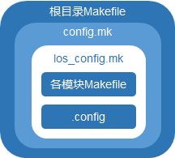

# Huawei LiteOS 编译介绍和开发工具

## 目 录

-   [编译框架简介](#1)
-   [搭建Linux编译环境](#2)
-   [Linux下编译流程](#3)
-   [Windows下编译流程](#4)

<h2 id="1">编译框架简介</h2>

Huwawei LiteOS使用Kconfig文件配置系统，基于GCC/Makefile实现了组件化编译。

使用make menuconfig命令配置系统时，Huwawei LiteOS会同时解析、展示根目录下的.config文件和tools/menuconfig/config.in文件（该文件包含了各个模块的Kconfig文件）。config.in文件由Kconfig语言（一种菜单配置语言）编写而成。config.in文件决定了要展示的配置项，.config文件决定了各个配置项的默认值。

Huawei LiteOS通过在根目录下执行make命令完成自动化编译整个工程。对于根目录下的Makefile文件，其中包含了config.mk，config.mk又包含了los\_config.mk，而los\_config.mk则包含了各个模块的Makefile和.config文件，从而定义了对整个工程的编译链接规则。



Huwawei LiteOS目前支持Windows及Linux平台的编译。

-   对于Windows平台，提供了Huawei LiteOS Studio图形化界面IDE，用户可直接在 Studio上完成编译。
-   对于Linux平台，通过menuconfig进行组件化配置及裁剪后，执行make命令完成编译。

<h2 id="2">搭建Linux编译环境</h2>

### 软件要求

-   Ubuntu Version 14.04，作为编译Huwawei LiteOS的服务器。
-   GNU Arm Embedded Toolchain编译器，用于代码编译。
-   GNU Make构建器，用于文件组织与链接。
-   python 2.7/3.2+，pip包管理工具，kconfiglib库，用于编译前通过图形化界面完成配置。

### 软件安装

-   安装GNU Arm Embedded Toolchain编译器。
    1.  下载编译器。

        官方下载地址为：<a href="https://developer.arm.com/tools-and-software/open-source-software/developer-tools/gnu-toolchain/gnu-rm/downloads" target="_blank">GNU Arm Embedded Toolchain编译器下载</a>，建议使用2019-q4-major及以上版本。

    2.  解压编译器。

        可以参考如下命令完成解压，将压缩包名替换为实际下载的软件包名：

        ```
        tar -xvf gcc-arm-none-eabi-9-2019-q4-major-x86_64-linux.tar.bz2
        ```

        解压后可以得到文件夹gcc-arm-none-eabi-9-2019-q4-major。

    3.  添加编译器的执行路径到环境变量。

        以第二步解压的编译器为例，将gcc-arm-none-eabi-9-2019-q4-major/bin目录添加到环境变量中，可以编辑\~/.bashrc文件，参考如下方法设置PATH环境变量：

        ```
        export PATH=$PATH:YOUR_PARTH/gcc-arm-none-eabi-9-2019-q4-major/bin/
        ```

        然后执行以下命令使新设置的环境变量立即生效：

        ```
        source ~/.bashrc
        ```


-   GNU Make构建器。

    下载<a href="http://ftp.gnu.org/pub/gnu/make/" target="_blank">Make构建器</a>，安装官方文档完成安装。

-   安装python 2.7/3.2+。

    如果服务器没有安装python，根据官网<a href="https://docs.python.org/2.7/using/unix.html#on-linux" target="_blank">python 2.7 安装文档</a>或<a href="https://docs.python.org/3.8/using/unix.html#on-linux" target="_blank">python 3.8 安装文档</a>，完成安装。

-   安装pip包管理工具。

    如果pip命令不存在，可以下载pip源码包进行安装。pip依赖setuptools，如果setuptools不存在，也需要安装。

    1.  安装setuptools。

        点击<a href="https://pypi.org/project/setuptools/" target="_blank">setuptools源代码包下载地址</a>，可以参考下面的命令进行安装：

        ```
        sudo unzip setuptools-50.3.2.zip
        cd setuptools
        sudo python setup.py install
        ```

        > **须知：** 
        >setuptools最新版本不支持python 2.7，如果使用python 2.7，请下载<a href="https://pypi.org/project/setuptools/45.0.0/#files" target="_blank">setuptools 45.0.0版本</a>以支持python 2.7。

    2.  安装pip。

        点击<a href="https://pypi.org/project/pip/" target="_blank">pip源代码包下载地址</a>，可以参考下面的命令进行安装：

        ```
        sudo tar -zxvf pip-20.2.4.tar.gz
        cd pip-20.2.4
        sudo python setup.py install
        ```


-   安装kconfiglib库。
    -   对于服务器可以联网的情况。

        可以直接使用如下命令安装kconfiglib：

        ```
        sudo pip install kconfiglib
        ```

    -   对于服务器不能联网的情况。

        可以采用离线的方式安装。首先在其他能联网的环境上<a href="https://pypi.org/project/kconfiglib/#files" target="_blank">下载kconfiglib</a>，可以下载kconfiglib的wheel文件kconfiglib-14.1.0-py2.py3-none-any.whl或源代码文件kconfiglib-14.1.0.tar.gz，这里以14.1.0版本为例。

        -   wheel文件的安装，可以参考如下命令：

            ```
            sudo pip install kconfiglib-14.1.0-py2.py3-none-any.whl
            ```

        -   源代码文件的安装，可以参考如下命令：

            ```
            sudo tar -zxvf kconfiglib-14.1.0.tar.gz
            cd kconfiglib-14.1.0
            sudo python setup.py install
            ```

<h2 id="3">Linux下编译流程</h2>

参照[搭建Linux编译环境](#2)完成环境搭建后，即可按以下步骤完成编译。

1.  下载Huawei LiteOS代码。

    请下载完整的Huawei LiteOS代码，代码仓在gitee上，请选择master分支进行下载：<a href="https://gitee.com/LiteOS/LiteOS" target="_blank">LiteOS代码仓</a>。

2.  拷贝开发板配置文件为根目录.config文件。

    根据实际使用的开发板，拷贝tools/build/config/目录下的默认配置文件$\{platform\}.config到根目录，并重命名为.config。

3.  配置系统。

    根据使用场景，在根目录下执行下述其中一个命令即可完成系统的配置。

    -   根据需要自定义配置。

        执行**make menuconfig**命令，展示图形化配置界面，用户可以根据需要自行裁剪模块或者修改设置。执行完保存菜单退出，该命令会更新根目录下.config文件。

    -   使用根目录下的.config文件进行配置。

        执行**make savemenuconfig**命令以解析根目录下的.config文件，实现系统配置。

    -   使用config.in文件中的默认配置项进行配置。

        执行**make defconfig**命令以解析tools/menuconfig/config.in文件，该命令会尽可能使用其默认配置，并更新根目录下.config文件。

    -   尽可能使能config.in文件中的配置项进行配置。

        执行**make allyesconfig**命以解析tools/menuconfig/config.in文件，该命令会尽可能使能文件中的所有配置项（即设置为Y），并更新根目录下.config文件。

    -   尽可能禁用config.in文件中的配置项进行配置。

        执行**make allnoconfig**命令以解析tools/menuconfig/config.in文件，该命令会尽可能禁用文件中的所有配置项（即设置为is not set），并更新根目录下.config文件。

4.  清理工程。

    在编译前，先在根目录下执行**make clean**命令删除以前编译出的二进制文件。

5.  编译工程。

    在根目录下执行**make**命令即可完成工程编译，编译结果会在屏幕上输出。

    以Cloud\_STM32F429IGTx\_FIRE为例，生成的中间文件在out/Cloud\_STM32F429IGTx\_FIRE/obj目录中，库文件在out/Cloud\_STM32F429IGTx\_FIRE/lib目录中，最终生成镜像bin文件、反汇编asm文件等在out/Cloud\_STM32F429IGTx\_FIRE目录中。


> **说明：** 
>通过**make menuconfig**命令显示的图形化配置界面，其中有一级菜单“Targets”，可以在里面配置要编译的平台。
>如果只编译某个模块，而不是整个工程代码，**在完成该模块和编译平台的配置后**，参考如下步骤完成编译。
>1.  导出LITEOSTOPDIR环境变量。
>    LITEOSTOPDIR变量表示Huawei LiteOS代码的保存路径，例如代码路径为“/usr1/mypc/Huawei\_LiteOS”，则执行如下命令：
>    ```
>    export LITEOSTOPDIR=/usr1/mypc/Huawei_LiteOS
>    ```
>2.  编译模块。
>    进入要编译的模块目录，执行make命令。


<h2 id="4">Windows下编译流程</h2>

Windows下的编译可以使用Huawei LiteOS Studio图形化IDE。Huawei LiteOS Studio是以Visual Studio Code的社区开源代码为基础，根据C语言编程特点、Huawei LiteOS嵌入式系统软件的业务场景开发的工具。它提供了Windows操作系统下代码编辑、编译、烧录、调试等功能，可以对系统关键数据进行实时跟踪、保存与回放。

1.  下载Huawei LiteOS Studio。

    访问<a href="https://gitee.com/LiteOS/LiteOS_Studio/releases/" target="_blank">Huawei LiteOS Studio下载链接</a>获取最新发行版。

2.  搭建Huawei LiteOS Studio运行环境。

    参考<a href="https://liteos.gitee.io/liteos_studio/#/install" target="_blank">Huawei LiteOS Studio安装指南</a>，完成运行环境搭建。

3.  编译工程。

    参考<a href="https://liteos.gitee.io/liteos_studio/#/project_stm32?id=%e4%bd%bf%e7%94%a8%e5%85%a5%e9%97%a8" target="_blank">Huawei LiteOS Studio使用入门</a>，完成Huawei LiteOS工程编译。IDE中各个界面介绍可以参考<a href="https://liteos.gitee.io/liteos_studio/#/introduction" target="_blank">HUAWEI LiteOS Studio界面介绍</a>。