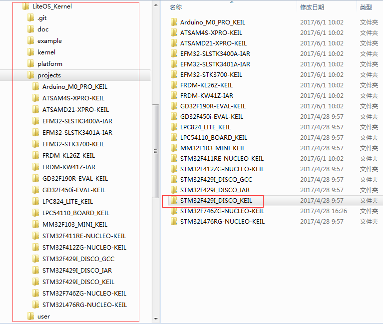
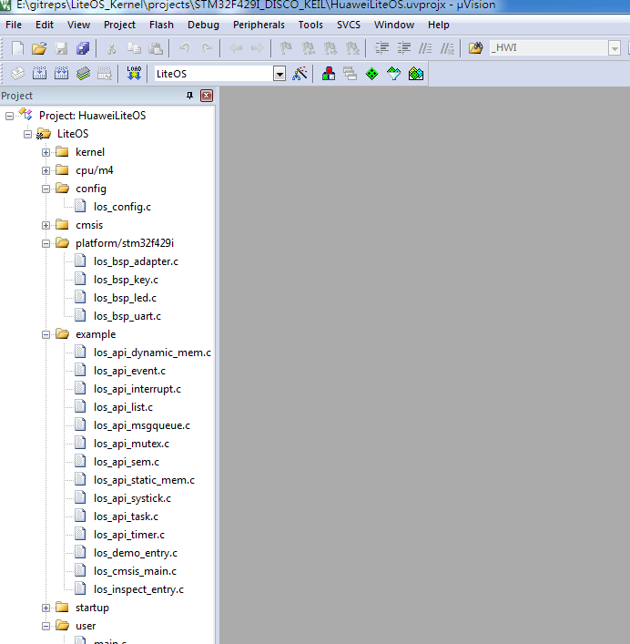
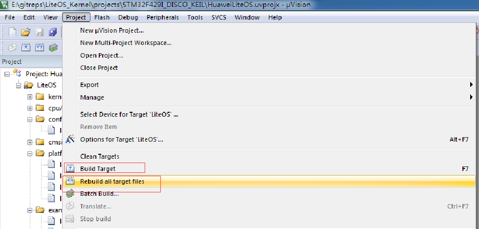
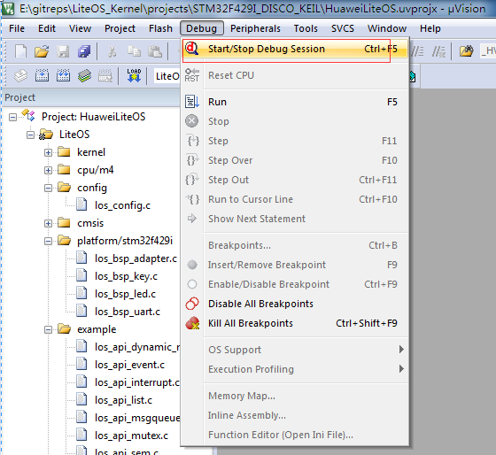
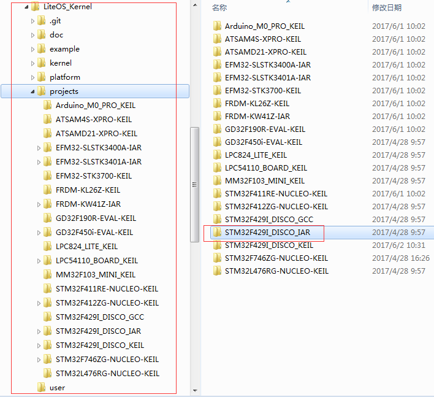
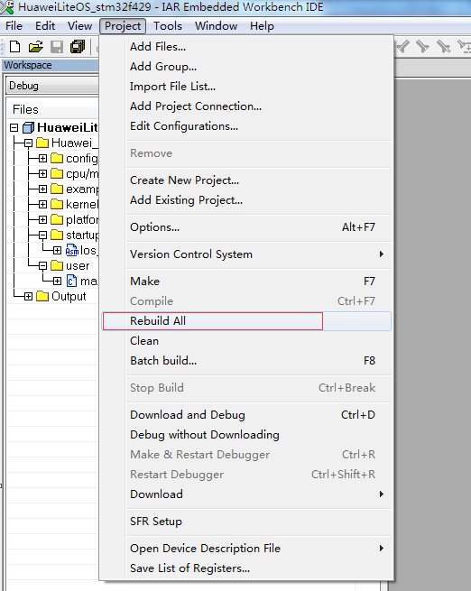
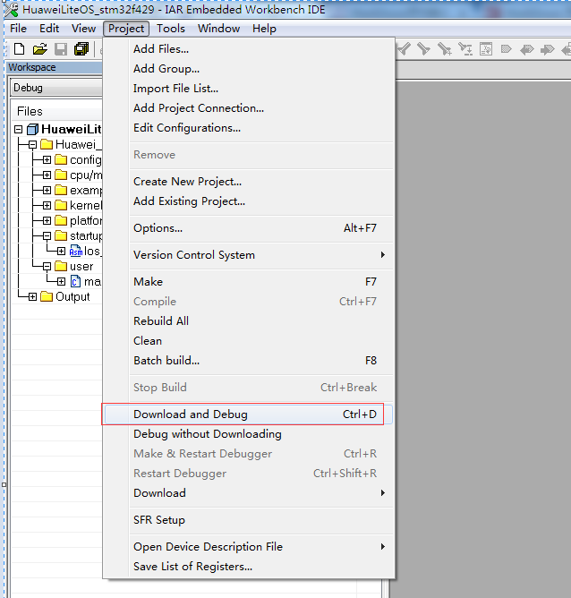
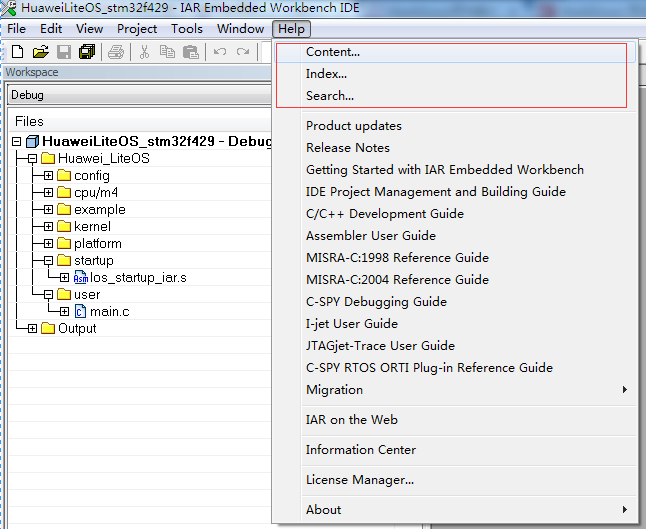
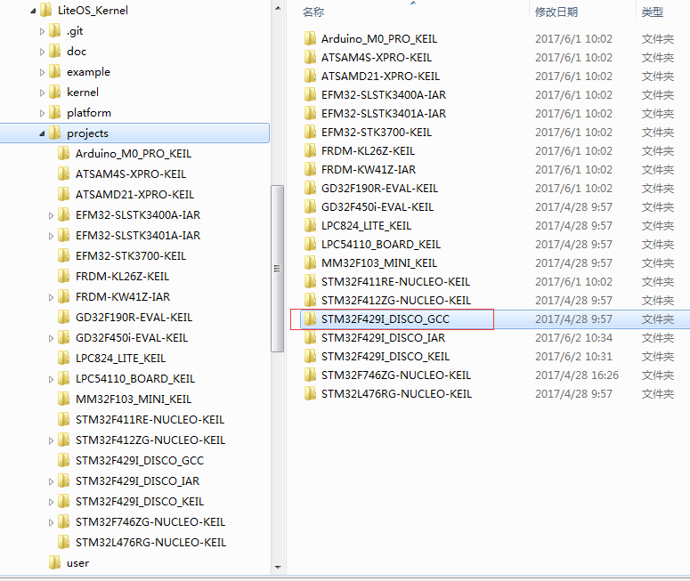

## LiteOS 编译说明
目前LiteOS有三种编译方式他们分别如下：

- Keil 编译

- IAR 编译

- GCC 编译

目前Github上主要支持的的是Keil的编译，所有的开发板对应的代码都有已经做好的Keil工程 

LiteOS的所有已经适配好的开发板的工程文件都存放在projects目录下

下面将分3个章节分别介绍 Keil 、IAR、GCC这三种编译方式。

## 如何使用Keil编译？

- keil编译的环境要求

	Window 7 操作系统	安装Keil和相关调试驱动的操作系统

	Keil(5.18以上版本)

	STLink或者JLink驱动PEMicro Debugger驱动(根据具体的开发板而定)

- keil工具需要的支持包文件
  
	使用keil编译LiteOS代码运行在不同的cpu上时，需要对应的pack文件支持，比如stm32f429ZI芯片需要Keil.STM32F4xx_DFP.2.11.0.pack，而STM32F746的芯片则需要Keil.STM32F7xx_DFP.2.9.0.pack
  
	下载这些开发包可以直接到MDK的网站下去搜索下载，链接地址是：http://www.keil.com/dd2/Pack/#/eula-container

- STLink的驱动

	ST的驱动可以到http://www.st.com 去搜索下载，一般下载en.stsw-link009即可。

	其他的非ST开发板的驱动，请参考各开发板对应的移植指导文档中描述的内容进行下载安装。

- 使用Keil的编译调试步骤

  1：找到对应开发板的keil工程位置，比如STM32F429I_DISCO开发板的keil工程

  
    
  2：进入工程目录，然后双击keil工程，比如STM32F429I_DISCO的工程文件是 HuaweiLiteOS.uvprojx 
     
  

  3：点击Project->Build Target或者Rebuild all target files编译工程

  

  4：编译完成后，可以点击Debug->Start/Stop Debug Session开始调试代码

  

  说明：如果对Keil的使用不熟悉，请参考keil工具上的help文档，里面有详细的keil使用说明。

  

## 如何使用IAR编译？

- IAR编译的环境要求
  
   Window 7 操作系	安装IAR和相关调试驱动的操作系统

   IAR(7.30以上版本)	用于编译、链接、调试程序代码

   STLink或者JLink驱动PEMicro Debugger驱动(根据具体的开发板而定)

- STLink的驱动

	ST的驱动可以到http://www.st.com 去搜索下载，一般下载en.stsw-link009即可。

	其他的非ST开发板的驱动，请参考各开发板对应的移植指导文档中描述的内容进行下载安装。

- 使用IAR的编译调试步骤

  1：找到对应开发板的IAR工程位置，比如STM32F429I_DISCO开发板的IAR工程

  
    
  2：进入工程目录，然后双击IAR工程，比如STM32F429I_DISCO的工程文件是 HuaweiLiteOS_stm32f429.eww
     
  

  3：点击Project->Rebuild All编译工程

  

  4：编译完成后，可以点击Project->Download and Debug开始调试代码

  

  说明：如果对IAR的使用不熟悉，请参考IAR工具上的help文档，里面有详细的IAR使用说明。

  

- 关于IAR工程

  目前只有部分开发板进行了IAR工程的创建，如果想使用IAR工程，请仿造STM32F429的工程添加代码。
  
  当然必须根据cpu的型号选择cpu的对应代码，比如stm32f429的是m4核，则选择m4的代码，如果是M3或者M0的核

  请选择对应的核的代码。

## 如何使用GCC编译？

- 关于GCC编译调试
  
  1：目前的LiteOS代码中只加入了STM32F429I_DISCO的GCC编译示例，如果想使用GCC编译LiteOS运行到其他开发板，请仿造
     F429的makefile自行改造。

  2：GCC的编译对开发人员的基础知识的储备要求比较高，如果对Linux下的嵌入式开发不熟悉，不建议采用GCC方式编译调试

- GCC编译的环境要求 

  Ubuntu14.04 及以上操作系统	安装arm-none-eabi-gcc的操作系统

  arm-none-eabi-gcc(gcc version 5.4以上版本)	用于编译、链接、调试程序代码

  stlink	开发板与pc连接的驱动程序，用户加载及调试程序代码

- 使用GCC的编译调试步骤

  1：找到对应开发板的GCC工程位置，比如STM32F429I_DISCO开发板的GCC工程

  

  2：在ubuntu上配置好交叉编译工具链之后，进入projects/STM32F429I_DISCO_GCC 目录，执行make

  3：make成功后，st-flash工具烧录

