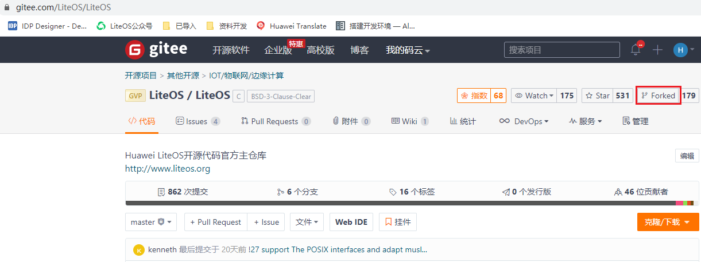
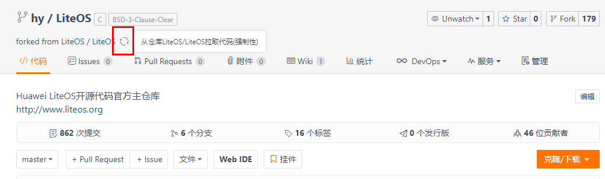
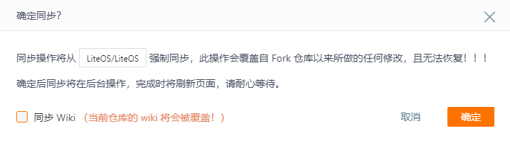
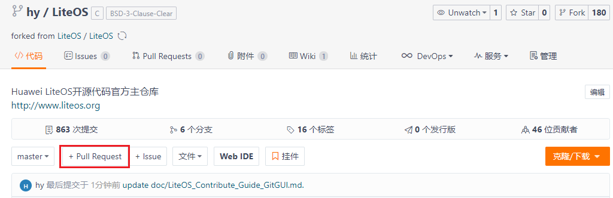
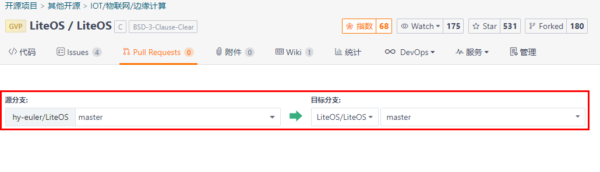
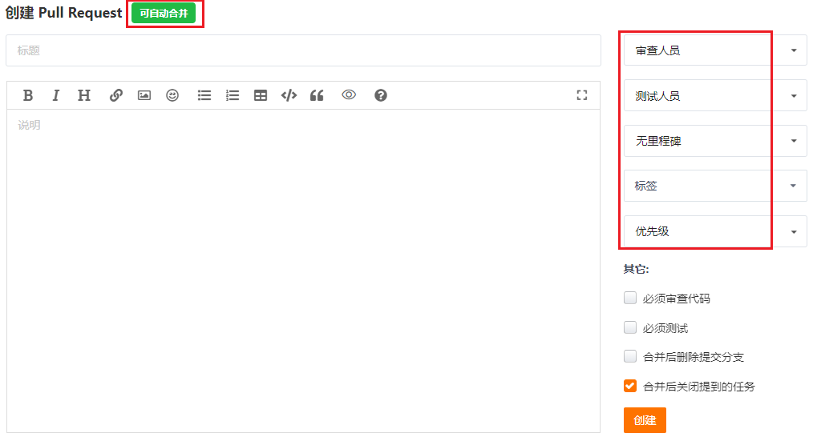
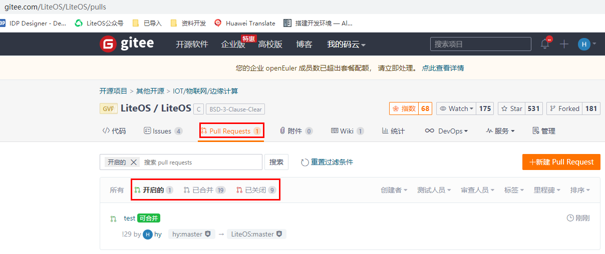

# LiteOS贡献代码流程

Huawei LiteOS（以下简称LiteOS）的代码仓托管在gitee上，因此代码贡献者需要在gitee上注册账号才能贡献代码。注册账号可以参考<a href="https://gitee.com/help/articles/4113#article-header0" target="_blank">注册Gitee账号</a>。

代码贡献可以分为**在线修改**和**本地提交**两种。

## 方法一：在线修改

在线修改适用于修改量较少的情况，方便快捷，点击页面“编辑”按钮，跳转到对应的编辑页面。


编辑修改后，点击页面下方“提交”按钮，即提交修改到 LiteOS 工程，静候工作人员审核即可。


## 方法二：本地提交

进行LiteOS的代码贡献可以遵循以下流程：

1.  下载Git工具。
2.  配置SSH公钥。
3.  配置本地Git账户信息。
4.  fork LiteOS源代码。
5.  同步LiteOS仓库代码到fork的仓库。
6.  提交本地修改到fork的仓库。
7.  提交Pull Request到LiteOS官方主仓库。
8.  查看Pull Request的状态。

### 1 下载Git工具

请至<a href="https://git-scm.com/download" target="_blank">git官网下载</a>，安装方法可以参考<a href="https://gitee.com/help/articles/4106#article-header0" target="_blank">Git的安装</a>。


### 2 配置SSH公钥
1) 先查看本地是否有公钥。如果存在公钥，则返回类似如下显示的一对文件，一般文件名为 id\_rsa 和 id\_rsa.pub，其中 .pub 后缀的文件是公钥，另一个文件是密钥。

    ```
    $ ls ~/.ssh
    id_rsa id_rsa.pub
    ```

    如果系统内没有公钥文件，可以执行如下命令生成，公钥文件一般默认存放在 \~/.ssh路径下：

    ```
    $ ssh-keygen -t rsa -C "your-email@youremail.com"  //其中的邮箱为注册gitee账户时使用的邮箱
    ```

2) 配置gitee账户的SSH公钥，参考<a href="https://gitee.com/help/articles/4191#article-header0" target="_blank">gitee上SSH公钥设置</a>。


### 3 配置本地Git账户信息
账户信息即用户名和邮箱，注意此处的用户名和邮箱指的是注册gitee账户所使用的账户名和邮箱。配置以后，每次Git提交都会使用该信息：

```
$ git config --global user.name "your-username"
$ git config --global user.email "your-email@youremail.com"
```

如果本地pc上已经存储了账户信息，可以在“控制面板-\>用户帐户-\>凭据管理器”中确认保存的gitee账号密码是否正确，如果错误会导致无法提交修改到远程仓库。如果无法在本地pc上确认或修改为正确的账号信息，可以执行如下命令，不使用本地pc中保存的账号密码：

```
$ git config --global --unset credential.helper
```

查看git的所有配置信息，可以使用如下命令：

```
$ git config --list
```


### 4 fork LiteOS源代码
1) 使用个人gitee账号登陆gitee。
2) 进入LiteOS官方主仓库（master分支）：<a href="https://gitee.com/LiteOS/LiteOS" target="_blank">LiteOS源码仓</a>。
3) 点击右上角fork按钮，将LiteOS的代码fork到个人账号下，在弹出的窗口中选择要fork到的个人账号，点击确认后，稍等一会就会自动跳转到刚刚fork出来的个人账号下的LiteOS仓库。

    


### 5 同步LiteOS仓库代码到fork的仓库

开发代码前，首先需要确保当前个人账号下的LiteOS代码和LiteOS官方仓库是一致的。 因为从fork代码到现在，LiteOS官方仓库可能已经更新了内容，所以开发代码前需要先同步LiteOS仓库代码到fork的仓库。如果仓库刚刚fork，可以跳过此步。



点击上图中红框中的按钮从LiteOS官方仓库拉取代码到个人账号fork的仓库，此时会弹出一个对话框以确定同步动作，如下图所示：



点击确定后，gitee就会开始同步代码，用户无需再做其他操作。


### 6 提交本地修改到fork的仓库


1) 开发的第一步，是clone代码到本地pc。

    ```
    git clone https://gitee.com/gitee账户名/LiteOS.git    //个人账号fork的仓库地址，clone下来后仓库名默认为origin
    ```

    基于LiteOS的远程master分支，创建并切换到本地分支，例如本地分支名也是master：

    ```
    git checkout -b master origin/master
    ```

2) 在本地分支上进行开发。开发完成之后，git add 添加代码到本地仓库，并git commit 提交到本地仓库，具体commit信息的填写规范，请参考<a href="https://gitee.com/LiteOS/LiteOS/blob/master/doc/LiteOS_Commit_Message.md" target="_blank">LiteOS提交修改时的commit写作规范</a>。
3) 执行git push origin master操作，将代码提交到gitee上自己个人账号的master分支。

**说明：** 所有git命令相关操作，如果不熟悉，请自行google或者baidu查找。


### 7 提交Pull Request到LiteOS官方主仓库

通过上述步骤，修改已经提交到个人远程仓库中，此时就可以向LiteOS官方主仓库master分支提交Pull Request，该操作在gitee网页上进行。

1) 进入个人账号下fork的LiteOS仓库首页，点击下图红框中的“+ Pull Request”。

    

2) 之后gitee会跳转到创建Pull Request的详细页面，并给出对应的源分支和要修改的目标分支，目标分支为LiteOS官方主仓库master分支，如下图。

    

    如果代码没有冲突则会显示下图红框中“可自动合并”的提示，否则需要先解决冲突然后再重新创建Pull Request。在线解决代码冲突可以参考<a href="https://gitee.com/help/articles/4305" target="_blank">在线解决代码冲突</a>。

    

    填入Pull Request的标题和说明，点击“创建”，就可以提交一个Pull Request。右边的审查人员、测试人员、里程碑、标签、优先级是可选项，不选择也不影响Pull Request的创建。

    > **说明：** 
    >-   如果提交的代码是为了解决issue问题，记得将issue和此次代码提交相关联，关联方法请参考<a href="https://gitee.com/help/articles/4141" target="_blank">Commit关联Issue</a>和<a href="https://gitee.com/help/articles/4142" target="_blank">Pull Request关联Issue</a>。
    >-   如果提交的Pull Request中有新增意见，需要在评论里回复，并@提意见的人说明已经解决。


### 8 查看Pull Request的状态
1) 进入<a href="https://gitee.com/LiteOS/LiteOS" target="_blank">LiteOS主仓库</a>首页。

2) 点击下图中的“Pull Requests”，可以看到当前LiteOS仓库上所有的Pull Request。

    

    “开启的”表示这个Pull Request的代码还没有合入，“已合并”表示这个Pull Request的代码已经合入，“已关闭”表示这个Pull Request虽然已经关闭但是代码没有被合入。

    现在就静候LiteOS主仓库管理员review代码吧，验证ok就会合入修改，恭喜您成为Contributor，感谢您为开源社区做出的贡献。
