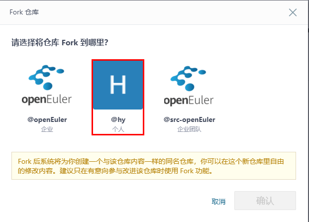
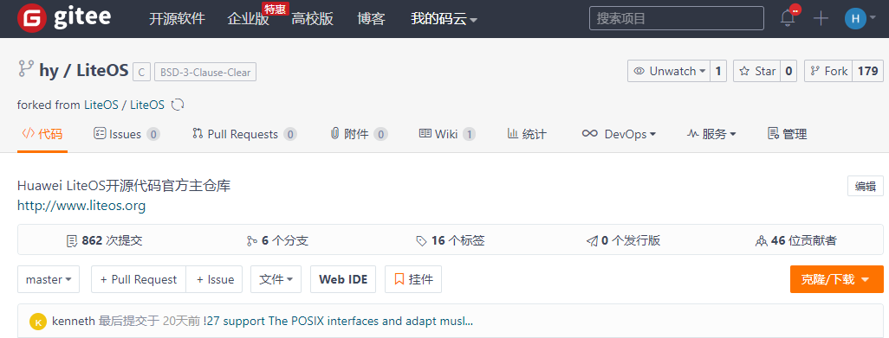

## LiteOS贡献代码流程
进行LiteOS的代码贡献可以遵循以下流程：

1. 创建gitee账号
2. fork LiteOS源代码
3. 同步LiteOS仓库代码到fork的仓库
4. 在本地PC上开发代码并提交到fork的仓库
5. 提交Pull Request到LiteOS仓库
6. 查看Pull Request的状态

### 1 创建gitee账号

由于LiteOS是在gitee上进行代码管理的，因此代码贡献者需要在gitee上注册账号才能贡献代码。
在浏览器中输入 gitee.com，然后在其界面上进行账号的注册(如有gitee账号，则直接使用即可)。

### 2 fork LiteOS源代码

拥有gitee账号后，则可以将LiteOS仓库fork到自己账号下，步骤如下：

- 首先登录gitee账号
- 然后在gitee中找到LiteOS的源码 https://gitee.com/LiteOS/LiteOS

- 点击右上角fork按钮，将LiteOS的代码fork到自己的个人账号下(比如：我的个人账号名是hy)

- 点击确定后，稍等一会就会自动跳转到刚刚fork到自己个人账号下的LiteOS仓库

### 3 同步LiteOS仓库代码到fork的仓库

开发代码前，首先需要确保当前个人账号下的LiteOS代码和LiteOS官方仓库是一致的。
因为从fork代码到现在，LiteOS官方仓库可能已经更新了内容，所以开发代码前需要先同步LiteOS仓库代码到fork的仓库，同步方法如下：

点击上图中红框中的按钮从LiteOS官方仓库拉取代码到个人账号fork的仓库，此时会弹出一个对话框以确定同步动作，如下图所示：

点击确定后，gitee就会开始同步代码，用户无需再做其他操作。

### 4 在本地PC上开发代码并提交到fork的仓库

- 开发的第一步，是clone代码到本地PC

		git clone https://gitee.com/hy/LiteOS
  
		clone之后checkout到master分支

		git checkout -b master origin/master

- 然后在该分支上进行开发，开发完成之后，git add 添加代码到本地PC的仓库，然后git commit 提交到本地PC仓库
- 最后执行git push origin master操作，将代码提交到gitee上自己个人账号的master分支

说明：所有git命令相关操作，如果不熟悉，请自行google或者baidu查找。

### 5 提交Pull Request到LiteOS仓库

代码开发完成后，就可以向LiteOS的主仓库提交Pull Request，该操作在gitee网页上进行操作。

- 进入个人账号下fork的LiteOS仓库首页，点击下图红框中的“+ Pull Request”

- 之后gitee会跳转到创建Pull Request的详细页面，并给出对应的源分支和要修改的目标分支，如下图

如果代码没有冲突则会显示下图红框中“可自动合并”的提示，否则需要先解决冲突然后再重新创建Pull Request。在线解决代码冲突可以参考 https://gitee.com/help/articles/4305

填入Pull Request的标题和说明，点击“创建”，就可以提交一个Pull Request。右边的审查人员、测试人员、里程碑、标签、优先级是可选项，不选择也不影响Pull Request的创建。

注：

- 如果提交的代码是为了解决issue问题，记得将issue和此次代码提交相关联，关联方法请参考 https://gitee.com/help/articles/4141 和 https://gitee.com/help/articles/4142

- 如果提交的Pull Request中有新增意见，需要在评论里回复，并@提意见的人说明已经解决

### 6. 查看Pull Request的状态
- 进入LiteOS仓库首页 https://gitee.com/LiteOS/LiteOS

- 点击下图中的“Pull Requests”，可以看到当前LiteOS仓库上所有的Pull Request

“开启的”表示这个Pull Request的代码还没有合入，“已合并”表示这个Pull Request的代码已经合入，“已关闭”表示这个Pull Request虽然已经关闭但是代码没有被合入。
