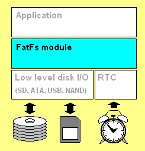

## 1关于本文档的开源协议说明
**您可以自由地：**

**分享** 

- 在任何媒介以任何形式复制、发行本文档

**演绎** 

- 修改、转换或以本文档为基础进行创作。只要你遵守许可协议条款，许可人就无法收回你的这些权利。

**惟须遵守下列条件：**

**署名** 

- 您必须提供适当的证书，提供一个链接到许可证，并指示是否作出更改。您可以以任何合理的方式这样做，但不是以任何方式表明，许可方赞同您或您的使用。

**非商业性使用** 

- 您不得将本作品用于商业目的。

**相同方式共享** 

- 如果您的修改、转换，或以本文档为基础进行创作，仅得依本素材的
授权条款来散布您的贡献作品。

**没有附加限制** 

- 您不能增设法律条款或科技措施，来限制别人依授权条款本已许可的作为。

**声明：**

-  当您使用本素材中属于公众领域的元素，或当法律有例外或限制条款允许您的使用，
则您不需要遵守本授权条款。
未提供保证。本授权条款未必能完全提供您预期用途所需要的所有许可。例如：形象
权、隐私权、著作人格权等其他权利，可能限制您如何使用本素材。

**注意**

- 为了方便用户理解，这是协议的概述. 可以访问网址 https://creativecommons.org/licenses/by-sa/3.0/legalcode 了解完整协议内容.

## 2前言
### 目的
本文档主要介绍如和在Huawei LiteOS上使用FatFs进行应用开发。
### 读者对象
本文档主要适用于Huawei LiteOS Kernel的开发者。
本文档主要适用于以下对象：
- 物联网端软件开发工程师
- 物联网架构设计师

### 符号约定
在本文中可能出现下列标志，它们所代表的含义如下。

     用于警示紧急的危险情形，若不避免，将会导致人员死亡或严重的人身伤害

    用于警示潜在的危险情形，若不避免，可能会导致人员死亡或严重的人身伤害

    用于警示潜在的危险情形，若不避免，可能会导致中度或轻微的人身伤害

     用于传递设备或环境安全警示信息，若不避免，可能会导致设备损坏、数据丢失、设备性能降低或其它不可预知的结果“注意”不涉及人身伤害

| 说明	|		“说明”不是安全警示信息，不涉及人身、设备及环境伤害信息	|

### 修订记录
修改记录累积了每次文档更新的说明。最新版本的文档包含以前所有文档版本的更新
内容。

<table>
	<tr>
	<td>日期</td>
	<td>修订版本</td>
	<td>描述</td>
	</tr>
	<tr>
	<td>2017年3月13日</td>
	<td>1.0</td>
	<td>完成初稿</td>
	</tr>
</table>

## 3概述

### FATFS简介

FatFS是一个为小型嵌入式系统设计的通用FAT(File Allocation Table)文件系统模块,它完全免费开源，具有以下特点：

- Windows兼容的FAT文件系统，

- 代码和工作区占用空间非常小

- 使用标准C语言编写，且独立于I/O层，易于移植

- 支持多个存储媒介，有独立的缓冲区，可以对多个文件进行读／写

Huawei LiteOS支持FatFs的移植使用，同时封装了自己的文件系统API编程接口，本手册介绍文件系统的主要数据结构及经过LiteOS封装的API编程接口。

## 4 FATFS主要数据结构

**FATFS**

文件系统对象结构体，用来保存独立逻辑驱动器动态工作区域，所在文件ff.h。

	/* File system object structure (FATFS) */
	typedef struct {
		BYTE	fs_type;		/* FAT sub-type (0:Not mounted) */
		BYTE	drv;			/* Physical drive number */
		BYTE	csize;			/* Sectors per cluster (1,2,4...128) */
		BYTE	n_fats;			/* Number of FAT copies (1 or 2) */
		BYTE	wflag;			/* win[] flag (b0:dirty) */
		BYTE	fsi_flag;		/* FSINFO flags (b7:disabled, b0:dirty) */
		WORD	id;				/* File system mount ID */
		WORD	n_rootdir;		/* Number of root directory entries (FAT12/16) */
	#if _MAX_SS != _MIN_SS
		WORD	ssize;			/* Bytes per sector (512, 1024, 2048 or 4096) */
	#endif
	#if _FS_REENTRANT
		_SYNC_t	sobj;			/* Identifier of sync object */
	#endif
	#if !_FS_READONLY
		DWORD	last_clust;		/* Last allocated cluster */
		DWORD	free_clust;		/* Number of free clusters */
	#endif
	#if _FS_RPATH
		DWORD	cdir;			/* Current directory start cluster (0:root) */
	#endif
		DWORD	n_fatent;		/* Number of FAT entries, = number of clusters + 2 */
		DWORD	fsize;			/* Sectors per FAT */
		DWORD	volbase;		/* Volume start sector */
		DWORD	fatbase;		/* FAT start sector */
		DWORD	dirbase;		/* Root directory start sector (FAT32:Cluster#) */
		DWORD	database;		/* Data start sector */
		DWORD	winsect;		/* Current sector appearing in the win[] */
		BYTE	win[_MAX_SS];	/* Disk access window for Directory, FAT (and file data at tiny cfg) */
	} FATFS;

**FIL**

文件对象结构，用来保存打开文件的状态，所在文件ff.h。
	
	/* File object structure (FIL) */
	
	typedef struct {
		FATFS*	fs;				/* Pointer to the related file system object (**do not change order**) */
		WORD	id;				/* Owner file system mount ID (**do not change order**) */
		BYTE	flag;			/* Status flags */
		BYTE	err;			/* Abort flag (error code) */
		DWORD	fptr;			/* File read/write pointer (Zeroed on file open) */
		DWORD	fsize;			/* File size */
		DWORD	sclust;			/* File start cluster (0:no cluster chain, always 0 when fsize is 0) */
		DWORD	clust;			/* Current cluster of fpter (not valid when fprt is 0) */
		DWORD	dsect;			/* Sector number appearing in buf[] (0:invalid) */
	#if !_FS_READONLY
		DWORD	dir_sect;		/* Sector number containing the directory entry */
		BYTE*	dir_ptr;		/* Pointer to the directory entry in the win[] */
	#endif
	#if _USE_FASTSEEK
		DWORD*	cltbl;			/* Pointer to the cluster link map table (Nulled on file open) */
	#endif
	#if _FS_LOCK
		UINT	lockid;			/* File lock ID origin from 1 (index of file semaphore table Files[]) */
	#endif
	#if !_FS_TINY
		BYTE	buf[_MAX_SS];	/* File private data read/write window */
	#endif
	} FIL;

**DIR**

目录对象结构体，所在文件ff.h。
	
	/* Directory object structure (DIR) */
	
	typedef struct {
		FATFS*	fs;				/* Pointer to the owner file system object (**do not change order**) */
		WORD	id;				/* Owner file system mount ID (**do not change order**) */
		WORD	index;			/* Current read/write index number */
		DWORD	sclust;			/* Table start cluster (0:Root dir) */
		DWORD	clust;			/* Current cluster */
		DWORD	sect;			/* Current sector */
		BYTE*	dir;			/* Pointer to the current SFN entry in the win[] */
		BYTE*	fn;				/* Pointer to the SFN (in/out) {file[8],ext[3],status[1]} */
	#if _FS_LOCK
		UINT	lockid;			/* File lock ID (index of file semaphore table Files[]) */
	#endif
	#if _USE_LFN
		WCHAR*	lfn;			/* Pointer to the LFN working buffer */
		WORD	lfn_idx;		/* Last matched LFN index number (0xFFFF:No LFN) */
	#endif
	} DIR;

**FILINFO**	

记录文件信息的结构体，所在文件ff.h。

	/* File status structure (FILINFO) */
	
	typedef struct {
		DWORD	fsize;			/* File size */
		WORD	fdate;			/* Last modified date */
		WORD	ftime;			/* Last modified time */
		BYTE	fattrib;		/* Attribute */
		TCHAR	fname[13];		/* Short file name (8.3 format) */
	#if _USE_LFN
		TCHAR*	lfname;			/* Pointer to the LFN buffer */
		UINT 	lfsize;			/* Size of LFN buffer in TCHAR */
	#endif
	} FILINFO;
	

**LOS_FRESULT**

文件操作函数返回值枚举，所在文件los_fs.h。

	/* File function return code (LOS_FRESULT) */
	typedef enum {
	    LOS_FS_OK = 0,                  /* (0) Succeeded */
	    LOS_FS_DISK_ERR,                /* (1) A hard error occurred in the low level disk I/O layer */
	    LOS_FS_INT_ERR,                 /* (2) Assertion failed */
	    LOS_FS_NOT_READY,               /* (3) The physical drive cannot work */
	    LOS_FS_NO_FILE,                 /* (4) Could not find the file */
	    LOS_FS_NO_PATH,                 /* (5) Could not find the path */
	    LOS_FS_INVALID_NAME,            /* (6) The path name format is invalid */
	    LOS_FS_DENIED,                  /* (7) Access denied due to prohibited access or directory full */
	    LOS_FS_EXIST,                   /* (8) Access denied due to prohibited access */
	    LOS_FS_INVALID_OBJECT,          /* (9) The file/directory object is invalid */
	    LOS_FS_WRITE_PROTECTED,         /* (10) The physical drive is write protected */
	    LOS_FS_INVALID_DRIVE,           /* (11) The logical drive number is invalid */
	    LOS_FS_NOT_ENABLED,             /* (12) The volume has no work area */
	    LOS_FS_NO_FILESYSTEM,           /* (13) There is no valid FAT volume */
	    LOS_FS_MKFS_ABORTED,            /* (14) The LOS_fmkfs() aborted due to any parameter error */
	    LOS_FS_TIMEOUT,                 /* (15) Could not get a grant to access the volume within defined period */
	    LOS_FS_LOCKED,                  /* (16) The operation is rejected according to the file sharing policy */
	    LOS_FS_NOT_ENOUGH_CORE,         /* (17) LFN working buffer could not be allocated */
	    LOS_FS_TOO_MANY_OPEN_FILES,     /* (18) Number of open files > _FS_SHARE */
	    LOS_FS_INVALID_PARAMETER        /* (19) Given parameter is invalid */
	} LOS_FRESULT;

## 5 封装的API接口介绍

LiteOS封装了如下常用的API接口函数。

**LOS_fopen** 

创建/打开一个用于访问文件的文件对象，对应f_open接口。
    
	int LOS_fopen (
	    const char * path,
	    unsigned char mode
	    ); /* Open or create a file */

参数:

path：  字符串指针，该字符串指定了将被创建或打开的文件名。

mode：  指定文件的访问类型和打开方法。它是由下列标志的一个组合指定的。

模式描述:

LOS_FS_READ: 指定读访问对象,可以从文件中读取数据,与LOS_FS_WRITE结合可以进行读写访问。

LOS_FS_WRITE: 指定写访问对象,可以向文件中写入数据,与LOS_FS_READ结合可以进行读写访问。

LOS_FS_OPEN_EXISTING: 打开文件,如果文件不存在，则打开失败。

LOS_FS_OPEN_ALWAYS: 如果文件存在，则打开；否则，创建一个新文件。

LOS_FS_CREATE_NEW: 创建一个新文件。如果文件已存在，则创建失败。

LOS_FS_CREATE_ALWAYS: 创建一个新文件。如果文件已存在，则它将被截断并覆盖。

注意：

当FAT文件系统中_FS_READONLY == 1 时，模式标志 LOS_FS_WRITE, LOS_FS_CREATE_ALWAYS, LOS_FS_CREATE_NEW, LOS_FS_OPEN_ALWAYS 是无效的。

返回值:
 
成功：返回打开文件的 id

失败：返回 0

描述:

- 如果函数成功，则创建一个文件对象。该文件对象被后续的读/写函数用来访问文件。如果想要关闭一个打开的文件对象，则使用LOS_fclose函数。如果不关闭修改后的文件，那么文件可能会崩溃。

- 在使用任何文件函数之前，必须使用LOS_fmount函数为驱动器注册一个工作区。只有这样，其他文件函数才能正常工作。

**LOS_fclose**

关闭一个打开的文件，对应f_close接口。

	LOS_FRESULT LOS_fclose (int fd); /* Close an open file object */

参数:

fd:将被关闭的已打开的文件对象的id。

返回值:

LOS_FS_OK： 文件对象已被成功关闭。

LOS_FS_DISK_ERR： 由于底层磁盘I/O函数中的错误，而导致该函数失败。

LOS_FS_INT_ERR： 由于一个错误的FAT结构或一个内部错误，而导致该函数失败。

LOS_FS_NOT_READY： 由于驱动器中没有存储介质或任何其他原因，而导致磁盘驱动器无法工作。

LOS_FS_INVALID_OBJECT： 文件对象无效。

描述:

LOS_fclose函数关闭一个打开的文件对象。无论向文件写入任何数据，文件的缓存信息都将被写回到磁盘。该函数成功后，文件对象不再有效，并且可以被丢弃。

**LOS_fread**

从一个文件读取数据，对应f_read接口。
	
	size_t LOS_fread (
	    void* buffer,
	    size_t size,
	    size_t count,int fd
	    ); /* Read data from a file */

参数：

buffer：指向存储读取数据的缓冲区的指针。

size ：要读的每个数据项的字节数，单位是字节。

count： 要读count个数据项，每个数据项size个字节。

fd：将被读取的已打开的文件对象的id。

返回值：

返回已读取的字节数
 
描述

从文件中读取数据，文件对象中的读/写指针以已读取字节数增加。

**LOS_fwrite**

写入数据到一个文件，对应f_write接口。

	size_t LOS_fwrite(
	    const void* buffer,
	    size_t size,
	    size_t count,
	    int fd
	    );	/* Write data to a file */

参数：

buffer：指向存储写入数据的缓冲区的指针。

size ：要写的每个数据项的字节数，单位是字节。

count： 要写count个数据项，每个数据项size个字节。

fd：将被写入的已打开的文件对象的id。

返回值：

返回已写入的字节数
 
描述：

将数据写入文件中，文件对象中的读/写指针以已写入字节数增加。

**LOS_lseek**

移动一个打开的文件对象的文件读/写指针，也可以被用来扩展文件大小(簇预分配)，对应FAT的f_lseek接口。

	LOS_FRESULT LOS_fseek(
	    int fd,
	    long offset
	    ); /* Move file pointer of a file object */

参数:

fd:打开的文件对象的id

Offset:相对于文件起始处的字节数

返回值:

LOS_FS_OK： (0)函数成功。

LOS_FS_DISK_ERR： 由于底层磁盘I/O函数中的错误，而导致该函数失败。

LOS_FS_INT_ERR： 由于一个错误的FAT结构或一个内部错误，而导致该函数失败。

LOS_FS_NOT_READY： 由于驱动器中没有存储介质或任何其他原因，而导致磁盘驱动器无法工作。

LOS_FS_INVALID_OBJECT： 文件对象无效。

描述:

LOS_lseek函数当FAT中配置 FS_MINIMIZE <= 2时可用。

offset只能被指定为相对于文件起始处的字节数。当在写模式下指定了一个超过文件大小的offset时，文件的大小将被扩展，并且该扩展的区域中的数据是未定义的。

LOS_lseek函数成功后，为了确保读/写指针已被正确地移动，必须检查文件对象中的成员fd。如果fd不是所期望的值，则发生了下列情况之一:

- 文件结束。指定的offset被钳在文件大小，因为文件已被以只读模式打开。
- 磁盘满。卷上没有足够的空闲空间去扩展文件大小。

**LOS_fsync**			

冲洗一个写文件的缓存信息，对应f_sync接口。

	LOS_FRESULT LOS_fsync (
        int fd
        );	/* Flush cached data of a writing file */

参数：

fd：待冲洗的打开的文件对象的id。

返回值:

LOS_FS_OK： (0)函数成功。

LOS_FS_DISK_ERR： 由于底层磁盘I/O函数中的错误，而导致该函数失败。

LOS_FS_INT_ERR： 由于一个错误的FS结构或一个内部错误，而导致该函数失败。

LOS_FS_NOT_READY： 由于驱动器中没有存储介质或任何其他原因，而导致磁盘驱动器无法工作。

LOS_FS_INVALID_OBJECT： 文件对象无效。

描述:

- LOS_fsync函数当FAT中配置_FS_READONLY == 0时可用。
- LOS_fsync函数和LOS_fclose函数执行同样的过程，但是文件仍处于打开状态，并且可以继续对文件执行读/写/移动指针操作。这适用于以写模式长时间打开文件，比如数据记录器。定期的或LOS_fwrite后立即执行LOS_fsync可以将由于突然断电或移去磁盘而导致数据丢失的风险最小化。
- 在LOS_fclose前立即执行LOS_fsync没有作用，因为在LOS_fclose中执行了LOS_fsync。换句话说，这两个函数的差异就是文件对象是不是无效的。

**LOS_fmount**  

在FatFs模块上注册/注销一个工作区(文件系统对象)，对应f_mount接口。

	LOS_FRESULT LOS_fmount (
	    const char* path, /* Logical drive number to be mounted/unmounted */
	    unsigned char opt /* 0:Do not mount (delayed mount), 1:Mount immediately */
	    ); /* Mount/Unmount a logical drive */

返回值：

LOS_FS_OK： 成功。

LOS_FS_INVALID_DRIVE： 驱动器号无效

参数：

path：注册/注销工作区的逻辑驱动器号(0-9)。

opt ：初始化操作 0:取消挂载，1：马上挂载。

描述：

- LOS_fmount函数注册/注销一个工作区。 在使用任何其他文件函数之前，必须使用该函数为每个卷注册一个工作区。要注销一个工作区，只要指定opt为0即可，然后该工作区可以被丢弃。

- 该函数只初始化给定的工作区，以及将该工作区的地址注册到内部表中，不访问磁盘I/O层。卷装入过程是在LOS_fmount函数后或存储介质改变后的第一次文件访问时完成的。

**LOS_fmkfs**

在驱动器上创建一个文件系统，对应f_mkfs接口。

	LOS_FRESULT LOS_fmkfs (
	    const char* path,
	    unsigned char sfd,
	    unsigned int au
	    );/* Create a file system on the volume */

参数:

path: 待格式化的逻辑驱动器号(0-9)。

sfd: 当给定0时，首先在驱动器上的第一个扇区创建一个分区表，然后文件系统被创建在分区上。这被称为FDISK格式化，用于硬盘和存储卡；当给定1时，文件系统从第一个扇区开始创建，而没有分区表。这被称为超级软盘(SFD)格式化，用于软盘和可移动磁盘。

au: 指定每簇中以字节为单位的分配单元大小。数值必须是0或从512到32K之间2的幂。当指定0时，簇大小取决于卷大小。

返回值:
 
LOS_FS_OK： (0)函数成功。

LOS_FS_INVALID_DRIVE： 驱动器号无效。

LOS_FS_NOT_READY： 由于驱动器中没有存储介质或任何其他原因，而导致磁盘驱动器无法工作。

LOS_FS_WRITE_PROTECTED： 驱动器被写保护。

LOS_FS_NOT_ENABLED： 逻辑驱动器没有工作区。

LOS_FS_DISK_ERR： 由于底层磁盘I/O函数中的错误，而导致该函数失败。

LOS_FS_MKFS_ABORTED： 由于下列原因之一，而导致函数在开始格式化前终止：

- 磁盘容量太小
- 参数无效
- 该驱动器不允许的簇大小。
 
描述:

LOS_fmkfs函数当FAT文件系统配置FAT_FS_READOLNY == 0并且_USE_MKFS == 1时可用。

LOS_fmkfs函数在驱动器中创建一个FAT文件系统。对于可移动媒介，有两种分区规则：FDISK和SFD，通过参数sfd选择。FDISK格式在大多数情况下被推荐使用。该函数当前不支持多分区，因此，物理驱动器上已存在的分区将被删除，并且重新创建一个占据全部磁盘空间的新分区。
根据Microsoft发布的FAT规范，FAT分类：FAT12/FAT16/FAT32，由驱动器上的簇数决定.因此，选择哪种FAT分类，取决于卷大小和指定的簇大小。簇大小影响文件系统的性能，并且大簇会提高性能。

## 其他说明

- 关于如何将FatFs移植到LiteOS，可参考源码doc目录下《LiteOS_Migration_Guide_FatFs_Keil》文档。

- 关于FatFs标准API接口使用说明，请参考：http://elm-chan.org/fsw/ff/00index_e.html

