# Huawei LiteOS 维测指南
-   [CPU占用率](#CPU占用率)
-   [Trace](#Trace)
-   [LMS](#LMS)
-   [Shell](#Shell)
-   [调度统计](#调度统计)
-   [内存调测方法](#内存调测方法)
    -   [多模块内存统计](#多模块内存统计)
    -   [多内存池机制](#多内存池机制)
    -   [内存备份机制](#内存备份机制)
    -   [内存合法性检查](#内存合法性检查)
    -   [内存size检查](#内存size检查)
    -   [内存泄露检测](#内存泄露检测)
-   [任务间通信调测方法](#任务间通信调测方法)
    -   [队列调测方法](#队列调测方法)
    -   [互斥锁调测方法](#互斥锁调测方法)
    -   [自旋锁调测方法](#自旋锁调测方法)
-   [临终遗言使用方法](#临终遗言使用方法)
-   [魔法键使用方法](#魔法键使用方法)
-   [调试案例](#调试案例)
    -   [踩内存定位方法](#踩内存定位方法)
        -   [全局变量踩内存定位方法](#全局变量踩内存定位方法)
        -   [task状态判断是否踩内存](#task状态判断是否踩内存)

<h2 id="CPU占用率">CPU占用率</h2>

<h3 id="概述">概述</h3>

#### 基本概念

Huawei LiteOS的CPUP（Central Processing Unit Percent，CPU占用率）分为系统CPU占用率和任务CPU占用率。

系统CPU占用率是指周期时间内系统的CPU占用率，用于表示系统一段时间内的闲忙程度，也表示CPU的负载情况。

任务CPU占用率指单个任务的CPU占用率，用于表示单个任务在一段时间内的闲忙程度。

#### 运作机制

Huawei LiteOS的CPUP采用任务级记录的方式，在任务切换时，记录任务启动时间，任务切出或者退出时间。每次任务退出时，系统会累加任务的占用时间。

**CPU占用率的计算方法：**

系统CPU占用率=系统中除idle任务外其他任务运行总时间/系统运行总时间。

任务CPU占用率=任务运行总时间/系统运行总时间。

<h3 id="开发指导">开发指导</h3>

#### 使用场景

通过系统CPU占用率，判断当前系统负载是否超出设计规格。

通过系统中各个任务的CPU占用率，判断各个任务的CPU占用率是否符合设计的预期。

#### 功能

Huawei LiteOS的CPU占用率模块为用户提供下面几种功能，接口详细信息可以查看API参考。

**表 1**  功能列表

<a name="table423153820811"></a>
<table><thead align="left"><tr id="row1872972720811"><th class="cellrowborder" valign="top" width="21.32786721327867%" id="mcps1.2.4.1.1"><p id="p2197741720811"><a name="p2197741720811"></a><a name="p2197741720811"></a>功能分类</p>
</th>
<th class="cellrowborder" valign="top" width="21.767823217678234%" id="mcps1.2.4.1.2"><p id="p1280752020811"><a name="p1280752020811"></a><a name="p1280752020811"></a>接口名</p>
</th>
<th class="cellrowborder" valign="top" width="56.9043095690431%" id="mcps1.2.4.1.3"><p id="p3595409320811"><a name="p3595409320811"></a><a name="p3595409320811"></a>描述</p>
</th>
</tr>
</thead>
<tbody><tr id="row3156887520811"><td class="cellrowborder" valign="top" width="21.32786721327867%" headers="mcps1.2.4.1.1 "><p id="p534411020433"><a name="p534411020433"></a><a name="p534411020433"></a>获取系统CPU占用率</p>
</td>
<td class="cellrowborder" valign="top" width="21.767823217678234%" headers="mcps1.2.4.1.2 "><p id="p6009666520811"><a name="p6009666520811"></a><a name="p6009666520811"></a>LOS_HistorySysCpuUsage</p>
</td>
<td class="cellrowborder" valign="top" width="56.9043095690431%" headers="mcps1.2.4.1.3 "><p id="p6683076820811"><a name="p6683076820811"></a><a name="p6683076820811"></a>获取系统CPU占用率，不包含idle任务</p>
</td>
</tr>
<tr id="row749511820811"><td class="cellrowborder" rowspan="2" valign="top" width="21.32786721327867%" headers="mcps1.2.4.1.1 "><p id="p157261813435"><a name="p157261813435"></a><a name="p157261813435"></a>获取任务CPU占用率</p>
</td>
<td class="cellrowborder" valign="top" width="21.767823217678234%" headers="mcps1.2.4.1.2 "><p id="p30313106201548"><a name="p30313106201548"></a><a name="p30313106201548"></a>LOS_HistoryTaskCpuUsage</p>
</td>
<td class="cellrowborder" valign="top" width="56.9043095690431%" headers="mcps1.2.4.1.3 "><p id="p6481168620811"><a name="p6481168620811"></a><a name="p6481168620811"></a>使能LOSCFG_CPUP_INCLUDE_IRQ后，获取指定中断（传入中断号）的CPU占用率；未使能LOSCFG_CPUP_INCLUDE_IRQ，获取指定任务的CPU占用率</p>
</td>
</tr>
<tr id="row11187400233110"><td class="cellrowborder" valign="top" headers="mcps1.2.4.1.1 "><p id="p50546033233110"><a name="p50546033233110"></a><a name="p50546033233110"></a>LOS_AllCpuUsage</p>
</td>
<td class="cellrowborder" valign="top" headers="mcps1.2.4.1.2 "><p id="p1551115616178"><a name="p1551115616178"></a><a name="p1551115616178"></a>使能LOSCFG_CPUP_INCLUDE_IRQ且设置入参flag为0时，获取所有中断的CPU占用率。设置入参flag为非0，或者关闭LOSCFG_CPUP_INCLUDE_IRQ后，获取所有任务的CPU占用率，这里的任务也包含了idel任务</p>
</td>
</tr>
<tr id="row56789172171319"><td class="cellrowborder" valign="top" width="21.32786721327867%" headers="mcps1.2.4.1.1 "><p id="p36520229171319"><a name="p36520229171319"></a><a name="p36520229171319"></a>重置CPU占用率</p>
</td>
<td class="cellrowborder" valign="top" width="21.767823217678234%" headers="mcps1.2.4.1.2 "><p id="p5348574171319"><a name="p5348574171319"></a><a name="p5348574171319"></a>LOS_CpupReset</p>
</td>
<td class="cellrowborder" valign="top" width="56.9043095690431%" headers="mcps1.2.4.1.3 "><p id="p30581384171319"><a name="p30581384171319"></a><a name="p30581384171319"></a>重置CPU占用率数据，包含系统和任务的CPU占用率</p>
</td>
</tr>
</tbody>
</table>

> **说明：** 
>1.  通过上述接口获取到的CPU占用率是千分比，所以CPU占用率的有效表示范围为0～1000。系统CPU占用率为1000，表示系统满负荷运转。任务CPU占用率为1000，表示在一段时间内系统一直在运行该任务。
>2.  获取任务CPU占用率有三种模式，通过入参mode设置：
>    -   CPUP\_LAST\_TEN\_SECONDS（值为0）：表示获取最近10s内的CPU占用率。
>    -   CPUP\_LAST\_ONE\_SECONDS（值为1）： 表示获取最近1s的CPU占用率。
>    -   CPUP\_ALL\_TIME（值为0xffff），或除0和1之外的其他值：表示获取自系统启动以来的CPU占用率。

#### CPUP错误码

<a name="table66521465191749"></a>
<table><thead align="left"><tr id="row66647056191749"><th class="cellrowborder" valign="top" width="4.4799999999999995%" id="mcps1.1.6.1.1"><p id="p65995609191749"><a name="p65995609191749"></a><a name="p65995609191749"></a>序号</p>
</th>
<th class="cellrowborder" valign="top" width="21.77%" id="mcps1.1.6.1.2"><p id="p44044076191749"><a name="p44044076191749"></a><a name="p44044076191749"></a>定义</p>
</th>
<th class="cellrowborder" valign="top" width="10.54%" id="mcps1.1.6.1.3"><p id="p10800441191749"><a name="p10800441191749"></a><a name="p10800441191749"></a>实际数值</p>
</th>
<th class="cellrowborder" valign="top" width="30.29%" id="mcps1.1.6.1.4"><p id="p39597633191844"><a name="p39597633191844"></a><a name="p39597633191844"></a>描述</p>
</th>
<th class="cellrowborder" valign="top" width="32.92%" id="mcps1.1.6.1.5"><p id="p61844251191749"><a name="p61844251191749"></a><a name="p61844251191749"></a>参考解决方案</p>
</th>
</tr>
</thead>
<tbody><tr id="row134571758181017"><td class="cellrowborder" valign="top" width="4.4799999999999995%" headers="mcps1.1.6.1.1 "><p id="p4487040819218"><a name="p4487040819218"></a><a name="p4487040819218"></a>1</p>
</td>
<td class="cellrowborder" valign="top" width="21.77%" headers="mcps1.1.6.1.2 "><p id="p951161311811"><a name="p951161311811"></a><a name="p951161311811"></a>LOS_ERRNO_CPUP_NO_MEMORY</p>
</td>
<td class="cellrowborder" valign="top" width="10.54%" headers="mcps1.1.6.1.3 "><p id="p16806186191017"><a name="p16806186191017"></a><a name="p16806186191017"></a>0x02001e00</p>
</td>
<td class="cellrowborder" valign="top" width="30.29%" headers="mcps1.1.6.1.4 "><p id="p3955882919926"><a name="p3955882919926"></a><a name="p3955882919926"></a>初始化CPU占用率模块时，内存不足</p>
</td>
<td class="cellrowborder" valign="top" width="32.92%" headers="mcps1.1.6.1.5 "><p id="p60375397191252"><a name="p60375397191252"></a><a name="p60375397191252"></a>调整OS_SYS_MEM_SIZE，以确保有足够的内存供CPU占用率模块使用</p>
</td>
</tr>
<tr id="row151402056115819"><td class="cellrowborder" valign="top" width="4.4799999999999995%" headers="mcps1.1.6.1.1 "><p id="p18369922191749"><a name="p18369922191749"></a><a name="p18369922191749"></a>2</p>
</td>
<td class="cellrowborder" valign="top" width="21.77%" headers="mcps1.1.6.1.2 "><p id="p1332621616820"><a name="p1332621616820"></a><a name="p1332621616820"></a>LOS_ERRNO_CPUP_TASK_PTR_NULL</p>
</td>
<td class="cellrowborder" valign="top" width="10.54%" headers="mcps1.1.6.1.3 "><p id="p6826106121015"><a name="p6826106121015"></a><a name="p6826106121015"></a>0x02001e01</p>
</td>
<td class="cellrowborder" valign="top" width="30.29%" headers="mcps1.1.6.1.4 "><p id="p1732013725019"><a name="p1732013725019"></a><a name="p1732013725019"></a>入参存在空指针</p>
</td>
<td class="cellrowborder" valign="top" width="32.92%" headers="mcps1.1.6.1.5 "><p id="p1314075613583"><a name="p1314075613583"></a><a name="p1314075613583"></a>传入正确的指针</p>
</td>
</tr>
<tr id="row6482175315584"><td class="cellrowborder" valign="top" width="4.4799999999999995%" headers="mcps1.1.6.1.1 "><p id="p20814974191749"><a name="p20814974191749"></a><a name="p20814974191749"></a>3</p>
</td>
<td class="cellrowborder" valign="top" width="21.77%" headers="mcps1.1.6.1.2 "><p id="p1353114131819"><a name="p1353114131819"></a><a name="p1353114131819"></a>LOS_ERRNO_CPUP_NO_INIT</p>
</td>
<td class="cellrowborder" valign="top" width="10.54%" headers="mcps1.1.6.1.3 "><p id="p98261367102"><a name="p98261367102"></a><a name="p98261367102"></a>0x02001e02</p>
</td>
<td class="cellrowborder" valign="top" width="30.29%" headers="mcps1.1.6.1.4 "><p id="p14547152614018"><a name="p14547152614018"></a><a name="p14547152614018"></a>CPU占用率模块没有初始化</p>
</td>
<td class="cellrowborder" valign="top" width="32.92%" headers="mcps1.1.6.1.5 "><p id="p11482135313584"><a name="p11482135313584"></a><a name="p11482135313584"></a>初始化CPU占用率模块后，再使用该模块</p>
</td>
</tr>
<tr id="row193514965819"><td class="cellrowborder" valign="top" width="4.4799999999999995%" headers="mcps1.1.6.1.1 "><p id="p64337369191749"><a name="p64337369191749"></a><a name="p64337369191749"></a>4</p>
</td>
<td class="cellrowborder" valign="top" width="21.77%" headers="mcps1.1.6.1.2 "><p id="p1853111137813"><a name="p1853111137813"></a><a name="p1853111137813"></a>LOS_ERRNO_CPUP_MAXNUM_INVALID</p>
</td>
<td class="cellrowborder" valign="top" width="10.54%" headers="mcps1.1.6.1.3 "><p id="p682520620109"><a name="p682520620109"></a><a name="p682520620109"></a>0x02001e03</p>
</td>
<td class="cellrowborder" valign="top" width="30.29%" headers="mcps1.1.6.1.4 "><p id="p181431132184915"><a name="p181431132184915"></a><a name="p181431132184915"></a>传入LOS_AllCpuUsage接口的入参（最大线程数或中断数）是一个无效值</p>
</td>
<td class="cellrowborder" valign="top" width="32.92%" headers="mcps1.1.6.1.5 "><p id="p2744733101114"><a name="p2744733101114"></a><a name="p2744733101114"></a>传入正确的最大线程数或中断数</p>
</td>
</tr>
<tr id="row6517730619218"><td class="cellrowborder" valign="top" width="4.4799999999999995%" headers="mcps1.1.6.1.1 "><p id="p6877374191749"><a name="p6877374191749"></a><a name="p6877374191749"></a>5</p>
</td>
<td class="cellrowborder" valign="top" width="21.77%" headers="mcps1.1.6.1.2 "><p id="p25313131813"><a name="p25313131813"></a><a name="p25313131813"></a>LOS_ERRNO_CPUP_THREAD_NO_CREATED</p>
</td>
<td class="cellrowborder" valign="top" width="10.54%" headers="mcps1.1.6.1.3 "><p id="p1082517610102"><a name="p1082517610102"></a><a name="p1082517610102"></a>0x02001e04</p>
</td>
<td class="cellrowborder" valign="top" width="30.29%" headers="mcps1.1.6.1.4 "><p id="p1677174015619"><a name="p1677174015619"></a><a name="p1677174015619"></a>获取指定任务的CPU占用率时，发现该任务未创建</p>
</td>
<td class="cellrowborder" valign="top" width="32.92%" headers="mcps1.1.6.1.5 "><p id="p1372919138224"><a name="p1372919138224"></a><a name="p1372919138224"></a>系统只能统计已经被创建的任务的CPU占用率，检查传入的任务ID对应的任务是否已经创建</p>
</td>
</tr>
<tr id="row33366968191749"><td class="cellrowborder" valign="top" width="4.4799999999999995%" headers="mcps1.1.6.1.1 "><p id="p44562467191749"><a name="p44562467191749"></a><a name="p44562467191749"></a>6</p>
</td>
<td class="cellrowborder" valign="top" width="21.77%" headers="mcps1.1.6.1.2 "><p id="p1353051315819"><a name="p1353051315819"></a><a name="p1353051315819"></a>LOS_ERRNO_CPUP_TSK_ID_INVALID</p>
</td>
<td class="cellrowborder" valign="top" width="10.54%" headers="mcps1.1.6.1.3 "><p id="p178242614103"><a name="p178242614103"></a><a name="p178242614103"></a>0x02001e05</p>
</td>
<td class="cellrowborder" valign="top" width="30.29%" headers="mcps1.1.6.1.4 "><p id="p9238164164714"><a name="p9238164164714"></a><a name="p9238164164714"></a>调用获取指定任务的CPU占用率的接口时，传入了无效的任务ID</p>
</td>
<td class="cellrowborder" valign="top" width="32.92%" headers="mcps1.1.6.1.5 "><p id="p5424607519267"><a name="p5424607519267"></a><a name="p5424607519267"></a>检查传入的任务ID的正确性</p>
</td>
</tr>
</tbody>
</table>

> **须知：**
>错误码定义见<a href="https://gitee.com/LiteOS/LiteOS/blob/master/doc/Huawei_LiteOS_Kernel_Developer_Guide_zh.md#错误码简介" target="_blank">错误码简介</a>。8\~15位的所属模块为CPUP模块，值为0x1e。

#### 开发流程

CPU占用率的典型开发流程：

1.  通过make menuconfig的配置CPU占用率模块。

    <a name="table06655375130"></a>
    <table><thead align="left"><tr id="row8665203751318"><th class="cellrowborder" valign="top" width="20.910000000000004%" id="mcps1.1.6.1.1"><p id="p61687296155221"><a name="p61687296155221"></a><a name="p61687296155221"></a>配置项</p>
    </th>
    <th class="cellrowborder" valign="top" width="37.82%" id="mcps1.1.6.1.2"><p id="p25007692155221"><a name="p25007692155221"></a><a name="p25007692155221"></a>含义</p>
    </th>
    <th class="cellrowborder" valign="top" width="10.730000000000002%" id="mcps1.1.6.1.3"><p id="p47081329204415"><a name="p47081329204415"></a><a name="p47081329204415"></a>取值范围</p>
    </th>
    <th class="cellrowborder" valign="top" width="9.280000000000001%" id="mcps1.1.6.1.4"><p id="p7383544155221"><a name="p7383544155221"></a><a name="p7383544155221"></a>默认值</p>
    </th>
    <th class="cellrowborder" valign="top" width="21.260000000000005%" id="mcps1.1.6.1.5"><p id="p34917797155221"><a name="p34917797155221"></a><a name="p34917797155221"></a>依赖</p>
    </th>
    </tr>
    </thead>
    <tbody><tr id="row9665837161320"><td class="cellrowborder" valign="top" width="20.910000000000004%" headers="mcps1.1.6.1.1 "><p id="p3665143710130"><a name="p3665143710130"></a><a name="p3665143710130"></a>LOSCFG_KERNEL_CPUP</p>
    </td>
    <td class="cellrowborder" valign="top" width="37.82%" headers="mcps1.1.6.1.2 "><p id="p13665737191318"><a name="p13665737191318"></a><a name="p13665737191318"></a>CPUP模块的裁剪开关</p>
    </td>
    <td class="cellrowborder" valign="top" width="10.730000000000002%" headers="mcps1.1.6.1.3 "><p id="p19665193721319"><a name="p19665193721319"></a><a name="p19665193721319"></a>YES/NO</p>
    </td>
    <td class="cellrowborder" valign="top" width="9.280000000000001%" headers="mcps1.1.6.1.4 "><p id="p1866573713131"><a name="p1866573713131"></a><a name="p1866573713131"></a>YES</p>
    </td>
    <td class="cellrowborder" valign="top" width="21.260000000000005%" headers="mcps1.1.6.1.5 "><p id="p1266519378138"><a name="p1266519378138"></a><a name="p1266519378138"></a>LOSCFG_KERNEL_EXTKERNEL</p>
    </td>
    </tr>
    <tr id="row7665183761312"><td class="cellrowborder" valign="top" width="20.910000000000004%" headers="mcps1.1.6.1.1 "><p id="p666523715137"><a name="p666523715137"></a><a name="p666523715137"></a>LOSCFG_CPUP_INCLUDE_IRQ</p>
    </td>
    <td class="cellrowborder" valign="top" width="37.82%" headers="mcps1.1.6.1.2 "><p id="p766543721311"><a name="p766543721311"></a><a name="p766543721311"></a>使能该配置项后，可以在LOS_HistoryTaskCpuUsage和LOS_AllCpuUsage接口中获取中断的CPU占用率。关闭该配置项后，只能获取任务的CPU占用率。</p>
    </td>
    <td class="cellrowborder" valign="top" width="10.730000000000002%" headers="mcps1.1.6.1.3 "><p id="p9665183731312"><a name="p9665183731312"></a><a name="p9665183731312"></a>YES/NO</p>
    </td>
    <td class="cellrowborder" valign="top" width="9.280000000000001%" headers="mcps1.1.6.1.4 "><p id="p116651837181311"><a name="p116651837181311"></a><a name="p116651837181311"></a>YES</p>
    </td>
    <td class="cellrowborder" valign="top" width="21.260000000000005%" headers="mcps1.1.6.1.5 "><p id="p1066517373133"><a name="p1066517373133"></a><a name="p1066517373133"></a>LOSCFG_KERNEL_CPUP</p>
    </td>
    </tr>
    </tbody>
    </table>

2.  获取系统CPU使用率LOS\_HistorySysCpuUsage。
3.  获取指定任务或中断的CPU使用率LOS\_HistoryTaskCpuUsage。
4.  获取所有任务或所有中断的CPU使用率LOS\_AllCpuUsage。

#### 平台差异性

无。

<h3 id="注意事项">注意事项</h3>

-   CPU占用率对性能有一定影响，而一般只有在产品开发时需要了解各个任务的占用率，因此建议在发布产品时，关闭CPU占用率。
-   关闭配置项LOSCFG\_CPUP\_INCLUDE\_IRQ后，系统中的中断耗时会被统计到中断发生的任务中。

<h3 id="编程实例">编程实例</h3>

#### 实例描述

本实例实现如下功能：

1.  创建一个测试CPUP的任务。
2.  获取系统最近1s内所有任务或中断的CPUP。
3.  获取系统（除idel任务外）最近10s内的总CPU占用率。
4.  获取CPUP测试任务的CPUP。

#### 编程示例

前提条件：通过make menuconfig配置好CPU占用率模块。

代码实现如下：

```c
#include <unistd.h >
#include "los_task.h"
#include "los_cpup.h"

#define MAXTASKNUM  32

UINT32 cpupUse;
UINT32 g_cpuTestTaskId;

VOID Example_CPUP(VOID)
{
    printf("entry cpup test example\n");
    while(1) {
        usleep(100);
    }
}

UINT32 Example_CPUP_Test(VOID)
{
    UINT32 ret;
    TSK_INIT_PARAM_S cpupTestTask;
    CPUP_INFO_S cpupInfo;

    /* 创建测试CPUP的任务 */
    memset(&cpupTestTask, 0, sizeof(TSK_INIT_PARAM_S));
    cpupTestTask.pfnTaskEntry = (TSK_ENTRY_FUNC)Example_CPUP;
    cpupTestTask.pcName       = "TestCpupTsk";                           /* 测试任务名称 */
    cpupTestTask.uwStackSize  = LOSCFG_BASE_CORE_TSK_DEFAULT_STACK_SIZE;
    cpupTestTask.usTaskPrio   = 5;
    cpupTestTask.uwResved   = LOS_TASK_STATUS_DETACHED;

    ret = LOS_TaskCreate(&g_cpuTestTaskId, &cpupTestTask);
    if(ret != LOS_OK) {
        printf("cpupTestTask create failed.\n");
        return LOS_NOK;
    }
    usleep(100);

    /* 系统中运行的任务或者中断数量 */
    UINT16 maxNum = MAXTASKNUM; 

    /* 获取系统所有任务或中断最近1s的CPU占用率 */
    cpupUse = LOS_AllCpuUsage(maxNum, &cpupInfo, CPUP_LAST_ONE_SECONDS, 0);
    printf("the system cpu usage in last 1s: %d\n", cpupUse);

    /* 获取最近10s内系统（除idel任务外）总CPU占用率 */
    cpupUse = LOS_HistorySysCpuUsage(CPUP_LAST_TEN_SECONDS);
    printf("the history system cpu usage in last 10s: %d\n", cpupUse);

    /* 获取指定任务在最近1s的CPU占用率，该测试例程中指定的任务为上面创建的CPUP测试任务 */
    cpupUse = LOS_HistoryTaskCpuUsage(g_cpuTestTaskId, CPUP_LAST_ONE_SECONDS);
    printf("cpu usage of the cpupTestTask in last 1s:\n TaskID: %d\n usage: %d\n", g_cpuTestTaskId, cpupUse);

    return LOS_OK;
}
```

#### 结果验证

编译运行得到的结果为：

```
the system cpu usage in last 1s: 15
the history system cpu usage in last 10s: 3
cpu usage of the cpupTestTask in last 1s:
TaskID: 10
usage: 0
```

#### 完整实例代码

[sample\_cpup.c](resource/sample_cpup.c)

<h2 id="Trace">Trace</h2>

<h3 id="概述-0">概述</h3>

#### 基本概念

Trace即追踪，实时记录系统行为，类似系统“录像”功能。在系统发生异常后，能辅助用户查看历史事件，定位问题。

#### 运作机制

Huawei LiteOS的Trace采用静态代码打桩和缓冲区记录方式，在桩被执行时，获取事件发生的上下文，并写入到缓冲区。

插桩函数的入参中需要提供追踪的事件类型，事件操作的主体对象，事件的参数，这些信息会被写入缓冲区，同时缓冲区中也会记录事件发生的时间、系统中的任务信息等事件上下文信息。

<h3 id="开发指导-1">开发指导</h3>

#### 使用场景

-   通过Trace了解系统运转的轨迹，理解系统。

-   通过Trace分析系统发生异常前的操作，定位死机问题。

#### 功能

Huawei LiteOS的Trace模块为用户提供下面几种功能，接口详细信息可以查看API参考。

**表 1**  功能列表

<a name="table826553194917"></a>
<table><thead align="left"><tr id="row19261653124916"><th class="cellrowborder" valign="top" width="20.812081208120812%" id="mcps1.2.4.1.1"><p id="p137061421145020"><a name="p137061421145020"></a><a name="p137061421145020"></a>功能分类</p>
</th>
<th class="cellrowborder" valign="top" width="21.42214221422142%" id="mcps1.2.4.1.2"><p id="p197061221105017"><a name="p197061221105017"></a><a name="p197061221105017"></a>接口名</p>
</th>
<th class="cellrowborder" valign="top" width="57.76577657765777%" id="mcps1.2.4.1.3"><p id="p117060212502"><a name="p117060212502"></a><a name="p117060212502"></a>描述</p>
</th>
</tr>
</thead>
<tbody><tr id="row62615354910"><td class="cellrowborder" valign="top" width="20.812081208120812%" headers="mcps1.2.4.1.1 "><p id="p1570622110504"><a name="p1570622110504"></a><a name="p1570622110504"></a>配置Trace缓冲区</p>
</td>
<td class="cellrowborder" valign="top" width="21.42214221422142%" headers="mcps1.2.4.1.2 "><p id="p77061021175013"><a name="p77061021175013"></a><a name="p77061021175013"></a>LOS_TraceInit</p>
</td>
<td class="cellrowborder" valign="top" width="57.76577657765777%" headers="mcps1.2.4.1.3 "><p id="p15706102115017"><a name="p15706102115017"></a><a name="p15706102115017"></a>配置Trace缓冲区的地址和大小</p>
</td>
</tr>
<tr id="row7277531490"><td class="cellrowborder" rowspan="2" valign="top" width="20.812081208120812%" headers="mcps1.2.4.1.1 "><p id="p1070622117508"><a name="p1070622117508"></a><a name="p1070622117508"></a>开启/停止Trace事件记录</p>
</td>
<td class="cellrowborder" valign="top" width="21.42214221422142%" headers="mcps1.2.4.1.2 "><p id="p1070652116503"><a name="p1070652116503"></a><a name="p1070652116503"></a>LOS_TraceStart</p>
</td>
<td class="cellrowborder" valign="top" width="57.76577657765777%" headers="mcps1.2.4.1.3 "><p id="p870672112506"><a name="p870672112506"></a><a name="p870672112506"></a>开启事件记录</p>
</td>
</tr>
<tr id="row52705319498"><td class="cellrowborder" valign="top" headers="mcps1.2.4.1.1 "><p id="p167067218506"><a name="p167067218506"></a><a name="p167067218506"></a>LOS_TraceStop</p>
</td>
<td class="cellrowborder" valign="top" headers="mcps1.2.4.1.2 "><p id="p137061321135015"><a name="p137061321135015"></a><a name="p137061321135015"></a>停止事件记录</p>
</td>
</tr>
<tr id="row1218417320179"><td class="cellrowborder" rowspan="3" valign="top" width="20.812081208120812%" headers="mcps1.2.4.1.1 "><p id="p74971212111717"><a name="p74971212111717"></a><a name="p74971212111717"></a>操作Trace记录的数据</p>
</td>
<td class="cellrowborder" valign="top" width="21.42214221422142%" headers="mcps1.2.4.1.2 "><p id="p20497121231712"><a name="p20497121231712"></a><a name="p20497121231712"></a>LOS_TraceRecordDump</p>
</td>
<td class="cellrowborder" valign="top" width="57.76577657765777%" headers="mcps1.2.4.1.3 "><p id="p184971112191712"><a name="p184971112191712"></a><a name="p184971112191712"></a>输出Trace缓冲区数据</p>
</td>
</tr>
<tr id="row627175314920"><td class="cellrowborder" valign="top" headers="mcps1.2.4.1.1 "><p id="p13706421145011"><a name="p13706421145011"></a><a name="p13706421145011"></a>LOS_TraceRecordGet</p>
</td>
<td class="cellrowborder" valign="top" headers="mcps1.2.4.1.2 "><p id="p15706421145019"><a name="p15706421145019"></a><a name="p15706421145019"></a>获取Trace缓冲区的首地址</p>
</td>
</tr>
<tr id="row727153194910"><td class="cellrowborder" valign="top" headers="mcps1.2.4.1.1 "><p id="p57061421145010"><a name="p57061421145010"></a><a name="p57061421145010"></a>LOS_TraceReset</p>
</td>
<td class="cellrowborder" valign="top" headers="mcps1.2.4.1.2 "><p id="p1170617214502"><a name="p1170617214502"></a><a name="p1170617214502"></a>清除Trace缓冲区中的事件</p>
</td>
</tr>
<tr id="row18271153114920"><td class="cellrowborder" valign="top" width="20.812081208120812%" headers="mcps1.2.4.1.1 "><p id="p1270672112501"><a name="p1270672112501"></a><a name="p1270672112501"></a>过滤Trace记录的模块</p>
</td>
<td class="cellrowborder" valign="top" width="21.42214221422142%" headers="mcps1.2.4.1.2 "><p id="p570617212502"><a name="p570617212502"></a><a name="p570617212502"></a>LOS_TraceEventMaskSet</p>
</td>
<td class="cellrowborder" valign="top" width="57.76577657765777%" headers="mcps1.2.4.1.3 "><p id="p10706172110508"><a name="p10706172110508"></a><a name="p10706172110508"></a>设置事件掩码，仅记录某些模块的事件</p>
</td>
</tr>
<tr id="row1767361119506"><td class="cellrowborder" valign="top" width="20.812081208120812%" headers="mcps1.2.4.1.1 "><p id="p197061021155019"><a name="p197061021155019"></a><a name="p197061021155019"></a>屏蔽某些中断号事件</p>
</td>
<td class="cellrowborder" valign="top" width="21.42214221422142%" headers="mcps1.2.4.1.2 "><p id="p1670642185010"><a name="p1670642185010"></a><a name="p1670642185010"></a>LOS_TraceHwiFilterHookReg</p>
</td>
<td class="cellrowborder" valign="top" width="57.76577657765777%" headers="mcps1.2.4.1.3 "><p id="p10706321125012"><a name="p10706321125012"></a><a name="p10706321125012"></a>注册过滤特定中断号事件的钩子函数</p>
</td>
</tr>
<tr id="row9700201318364"><td class="cellrowborder" rowspan="2" valign="top" width="20.812081208120812%" headers="mcps1.2.4.1.1 "><p id="p148201139133610"><a name="p148201139133610"></a><a name="p148201139133610"></a>插桩函数</p>
</td>
<td class="cellrowborder" valign="top" width="21.42214221422142%" headers="mcps1.2.4.1.2 "><p id="p970111134363"><a name="p970111134363"></a><a name="p970111134363"></a>LOS_TRACE_EASY</p>
</td>
<td class="cellrowborder" valign="top" width="57.76577657765777%" headers="mcps1.2.4.1.3 "><p id="p167011613133619"><a name="p167011613133619"></a><a name="p167011613133619"></a>简易插桩</p>
</td>
</tr>
<tr id="row140992673615"><td class="cellrowborder" valign="top" headers="mcps1.2.4.1.1 "><p id="p12410526133613"><a name="p12410526133613"></a><a name="p12410526133613"></a>LOS_TRACE</p>
</td>
<td class="cellrowborder" valign="top" headers="mcps1.2.4.1.2 "><p id="p24103265361"><a name="p24103265361"></a><a name="p24103265361"></a>标准插桩</p>
</td>
</tr>
</tbody>
</table>

> **说明：** 
>1.  LOS\_TRACE\_EASY\(TYPE, IDENTITY, params...\) 简易插桩。
>    -   一句话插桩，用户在目标源代码中插入该接口即可。
>    -   TYPE有效取值范围为\[0, 0xF\]，表示不同的事件类型。
>    -   IDENTITY类型UINTPTR，表示事件操作的主体对象。
>    -   Params类型UINTPTR，表示事件的参数。
>    -   示例：
>        ```c
>        LOS_TRACE_EASY(1, userId0, userParam1, userParam2);
>        LOS_TRACE_EASY(2, userId0);
>        LOS_TRACE_EASY(1, userId1, userParam1, userParam2);
>        LOS_TRACE_EASY(2, userId1);
>        ```
>2.  LOS\_TRACE\(TYPE, IDENTITY, params...\) 标准插桩。
>    -   相比简易插桩，支持动态过滤事件和参数裁剪，但使用上需要用户按规则来扩展。
>    -   TYPE用于设置具体的事件类型，可以在头文件los\_trace.h中的enum LOS\_TRACE\_TYPE中自定义事件类型。定义方法和规则可以参考其他事件类型。
>    -   IDENTITY和Params的类型及含义同简易插桩。
>    -   示例：
>        ```
>        1.在enum LOS_TRACE_MASK中定义事件掩码，即模块级别的事件类型。定义规范为TRACE_#MOD#_FLAG，#MOD#表示模块名，例如：
>          TRACE_FS_FLAG = 0x2000
>        2.在enum LOS_TRACE_TYPE中定义具体事件类型。定义规范为#TYPE# = TRACE_#MOD#_FLAG | NUMBER，例如：
>          FS_READ  = TRACE_FS_FLAG | 0; // 读文件
>          FS_WRITE = TRACE_FS_FLAG | 1; // 写文件
>        3.定义事件参数。定义规范为#TYPE#_PARAMS(IDENTITY, parma1...) IDENTITY, ...
>          其中的#TYPE#就是上面2中的#TYPE#，例如：
>          #define FS_READ_PARAMS(fp, fd, flag, size)    fp, fd, flag, size
>          宏定义的参数对应于Trace缓冲区中记录的事件参数，用户可对任意参数字段进行裁剪；
>          当定义为空时，表示不追踪该类型事件：
>          #define FS_READ_PARAMS(fp, fd, flag, size) // 不追踪文件读事件
>        4.在适当位置插入代码桩。定义规范为LOS_TRACE(#TYPE#, #TYPE#_PARAMS(IDENTITY, parma1...))
>          LOS_TRACE(FS_READ, fp, fd, flag, size); // 读文件的代码桩，#TYPE#之后的入参就是上面3中的FS_READ_PARAMS函数的入参
>        ```
>3.  Huawei Liteos预置的Trace事件及参数均可以通过上述方式进行裁剪，参数详见kernel\\include\\los\_trace.h。

#### Trace错误码

对Trace存在失败可能性的操作，包括初始化Trace、启动Trace 均需要返回对应的错误码，以便快速定位错误原因。其他无返回值的接口如停止Trace、清除与dump Trace 数据均为Trace状态不合法，系统会直接打印错误原因。

<a name="table6015294495642"></a>
<table><thead align="left"><tr id="row2267197395642"><th class="cellrowborder" valign="top" width="6.845296303539997%" id="mcps1.1.6.1.1"><p id="p1908783195642"><a name="p1908783195642"></a><a name="p1908783195642"></a>序号</p>
</th>
<th class="cellrowborder" valign="top" width="24.124779972618814%" id="mcps1.1.6.1.2"><p id="p261046995642"><a name="p261046995642"></a><a name="p261046995642"></a>定义</p>
</th>
<th class="cellrowborder" valign="top" width="10.219049481713279%" id="mcps1.1.6.1.3"><p id="p1012144095642"><a name="p1012144095642"></a><a name="p1012144095642"></a>实际数值</p>
</th>
<th class="cellrowborder" valign="top" width="26.276158810874247%" id="mcps1.1.6.1.4"><p id="p1453028795642"><a name="p1453028795642"></a><a name="p1453028795642"></a>描述</p>
</th>
<th class="cellrowborder" valign="top" width="32.534715431253666%" id="mcps1.1.6.1.5"><p id="p2753561710026"><a name="p2753561710026"></a><a name="p2753561710026"></a>参考解决方案</p>
</th>
</tr>
</thead>
<tbody><tr id="row6366372295642"><td class="cellrowborder" valign="top" width="6.845296303539997%" headers="mcps1.1.6.1.1 "><p id="p5648782795642"><a name="p5648782795642"></a><a name="p5648782795642"></a>1</p>
</td>
<td class="cellrowborder" valign="top" width="24.124779972618814%" headers="mcps1.1.6.1.2 "><p id="p1211123695642"><a name="p1211123695642"></a><a name="p1211123695642"></a>LOS_ERRNO_TRACE_ERROR_STATUS</p>
</td>
<td class="cellrowborder" valign="top" width="10.219049481713279%" headers="mcps1.1.6.1.3 "><p id="p4148605495642"><a name="p4148605495642"></a><a name="p4148605495642"></a>0x02001400</p>
</td>
<td class="cellrowborder" valign="top" width="26.276158810874247%" headers="mcps1.1.6.1.4 "><p id="p492720095642"><a name="p492720095642"></a><a name="p492720095642"></a>初始化Trace或启动Trace时状态不正确</p>
</td>
<td class="cellrowborder" valign="top" width="32.534715431253666%" headers="mcps1.1.6.1.5 "><p id="p144215555119"><a name="p144215555119"></a><a name="p144215555119"></a>禁止重复初始化Trace，未初始化Trace前禁止启动Trace</p>
</td>
</tr>
<tr id="row112091915183814"><td class="cellrowborder" valign="top" width="6.845296303539997%" headers="mcps1.1.6.1.1 "><p id="p2020918159388"><a name="p2020918159388"></a><a name="p2020918159388"></a>2</p>
</td>
<td class="cellrowborder" valign="top" width="24.124779972618814%" headers="mcps1.1.6.1.2 "><p id="p8209171516380"><a name="p8209171516380"></a><a name="p8209171516380"></a>LOS_ERRNO_TRACE_NO_MEMORY</p>
</td>
<td class="cellrowborder" valign="top" width="10.219049481713279%" headers="mcps1.1.6.1.3 "><p id="p182092153388"><a name="p182092153388"></a><a name="p182092153388"></a>0x02001401</p>
</td>
<td class="cellrowborder" valign="top" width="26.276158810874247%" headers="mcps1.1.6.1.4 "><p id="p20209111510381"><a name="p20209111510381"></a><a name="p20209111510381"></a>初始化Trace时，缓冲区申请失败</p>
</td>
<td class="cellrowborder" valign="top" width="32.534715431253666%" headers="mcps1.1.6.1.5 "><p id="p14525105518557"><a name="p14525105518557"></a><a name="p14525105518557"></a>解决方案有两个：</p>
<a name="ul17711443556"></a><a name="ul17711443556"></a><ul id="ul17711443556"><li>减小Trace缓冲区的大小，可以修改los_config.h中的LOS_TRACE_BUFFER_SIZE</li><li>配置LOSCFG_BASE_CORE_TSK_LIMIT减少最大任务数</li></ul>
</td>
</tr>
<tr id="row1698417245383"><td class="cellrowborder" valign="top" width="6.845296303539997%" headers="mcps1.1.6.1.1 "><p id="p149841024163810"><a name="p149841024163810"></a><a name="p149841024163810"></a>3</p>
</td>
<td class="cellrowborder" valign="top" width="24.124779972618814%" headers="mcps1.1.6.1.2 "><p id="p2098432413813"><a name="p2098432413813"></a><a name="p2098432413813"></a>LOS_ERRNO_TRACE_BUF_TOO_SMALL</p>
</td>
<td class="cellrowborder" valign="top" width="10.219049481713279%" headers="mcps1.1.6.1.3 "><p id="p19984162443818"><a name="p19984162443818"></a><a name="p19984162443818"></a>0x02001402</p>
</td>
<td class="cellrowborder" valign="top" width="26.276158810874247%" headers="mcps1.1.6.1.4 "><p id="p6984202473819"><a name="p6984202473819"></a><a name="p6984202473819"></a>初始化Trace时，缓冲区size设置过小</p>
</td>
<td class="cellrowborder" valign="top" width="32.534715431253666%" headers="mcps1.1.6.1.5 "><p id="p1098419242384"><a name="p1098419242384"></a><a name="p1098419242384"></a>增大Trace缓冲区的大小，可以修改los_config.h中的LOS_TRACE_BUFFER_SIZE</p>
</td>
</tr>
</tbody>
</table>

> **须知：** 
>错误码定义见<a href="https://gitee.com/LiteOS/LiteOS/blob/master/doc/Huawei_LiteOS_Kernel_Developer_Guide_zh.md#错误码简介" target="_blank">错误码简介</a>。8\~15位的所属模块为Trace模块，值为0x14。

#### 开发流程

Trace的典型开发流程：

1.  通过make menuconfig配置Trace。

    <a name="table06655375130"></a>
    <table><thead align="left"><tr id="row8665203751318"><th class="cellrowborder" valign="top" width="24.36%" id="mcps1.1.6.1.1"><p id="p61687296155221"><a name="p61687296155221"></a><a name="p61687296155221"></a>配置项</p>
    </th>
    <th class="cellrowborder" valign="top" width="32.09%" id="mcps1.1.6.1.2"><p id="p25007692155221"><a name="p25007692155221"></a><a name="p25007692155221"></a>含义</p>
    </th>
    <th class="cellrowborder" valign="top" width="10.27%" id="mcps1.1.6.1.3"><p id="p47081329204415"><a name="p47081329204415"></a><a name="p47081329204415"></a>取值范围</p>
    </th>
    <th class="cellrowborder" valign="top" width="8.64%" id="mcps1.1.6.1.4"><p id="p7383544155221"><a name="p7383544155221"></a><a name="p7383544155221"></a>默认值</p>
    </th>
    <th class="cellrowborder" valign="top" width="24.64%" id="mcps1.1.6.1.5"><p id="p34917797155221"><a name="p34917797155221"></a><a name="p34917797155221"></a>依赖</p>
    </th>
    </tr>
    </thead>
    <tbody><tr id="row9665837161320"><td class="cellrowborder" valign="top" width="24.36%" headers="mcps1.1.6.1.1 "><p id="p3665143710130"><a name="p3665143710130"></a><a name="p3665143710130"></a>LOSCFG_KERNEL_TRACE</p>
    </td>
    <td class="cellrowborder" valign="top" width="32.09%" headers="mcps1.1.6.1.2 "><p id="p13665737191318"><a name="p13665737191318"></a><a name="p13665737191318"></a>Trace模块的裁剪开关</p>
    </td>
    <td class="cellrowborder" valign="top" width="10.27%" headers="mcps1.1.6.1.3 "><p id="p19665193721319"><a name="p19665193721319"></a><a name="p19665193721319"></a>YES/NO</p>
    </td>
    <td class="cellrowborder" valign="top" width="8.64%" headers="mcps1.1.6.1.4 "><p id="p1866573713131"><a name="p1866573713131"></a><a name="p1866573713131"></a>NO</p>
    </td>
    <td class="cellrowborder" valign="top" width="24.64%" headers="mcps1.1.6.1.5 "><p id="p1266519378138"><a name="p1266519378138"></a><a name="p1266519378138"></a>LOSCFG_KERNEL_EXTKERNEL</p>
    </td>
    </tr>
    <tr id="row1193311701712"><td class="cellrowborder" valign="top" width="24.36%" headers="mcps1.1.6.1.1 "><p id="p565351111510"><a name="p565351111510"></a><a name="p565351111510"></a>LOSCFG_RECORDER_MODE_OFFLINE</p>
    </td>
    <td class="cellrowborder" valign="top" width="32.09%" headers="mcps1.1.6.1.2 "><p id="p9933111721714"><a name="p9933111721714"></a><a name="p9933111721714"></a>Trace工作模式为离线模式</p>
    </td>
    <td class="cellrowborder" valign="top" width="10.27%" headers="mcps1.1.6.1.3 "><p id="p6933141711719"><a name="p6933141711719"></a><a name="p6933141711719"></a>YES/NO</p>
    </td>
    <td class="cellrowborder" valign="top" width="8.64%" headers="mcps1.1.6.1.4 "><p id="p13933131712173"><a name="p13933131712173"></a><a name="p13933131712173"></a>YES</p>
    </td>
    <td class="cellrowborder" valign="top" width="24.64%" headers="mcps1.1.6.1.5 "><p id="p79331717111713"><a name="p79331717111713"></a><a name="p79331717111713"></a>LOSCFG_KERNEL_TRACE</p>
    </td>
    </tr>
    <tr id="row1363216235172"><td class="cellrowborder" valign="top" width="24.36%" headers="mcps1.1.6.1.1 "><p id="p164432221258"><a name="p164432221258"></a><a name="p164432221258"></a>LOSCFG_RECORDER_MODE_ONLINE</p>
    </td>
    <td class="cellrowborder" valign="top" width="32.09%" headers="mcps1.1.6.1.2 "><p id="p463216237171"><a name="p463216237171"></a><a name="p463216237171"></a>Trace工作模式为在线模式</p>
    </td>
    <td class="cellrowborder" valign="top" width="10.27%" headers="mcps1.1.6.1.3 "><p id="p063232310177"><a name="p063232310177"></a><a name="p063232310177"></a>YES/NO</p>
    </td>
    <td class="cellrowborder" valign="top" width="8.64%" headers="mcps1.1.6.1.4 "><p id="p136321523141717"><a name="p136321523141717"></a><a name="p136321523141717"></a>NO</p>
    </td>
    <td class="cellrowborder" valign="top" width="24.64%" headers="mcps1.1.6.1.5 "><p id="p13632623151714"><a name="p13632623151714"></a><a name="p13632623151714"></a>LOSCFG_KERNEL_TRACE</p>
    </td>
    </tr>
    <tr id="row866021191717"><td class="cellrowborder" valign="top" width="24.36%" headers="mcps1.1.6.1.1 "><p id="p176602181713"><a name="p176602181713"></a><a name="p176602181713"></a>LOSCFG_TRACE_CLIENT_INTERACT</p>
    </td>
    <td class="cellrowborder" valign="top" width="32.09%" headers="mcps1.1.6.1.2 "><p id="p66612114174"><a name="p66612114174"></a><a name="p66612114174"></a>使能与Trace IDE （Huawei LiteOS Studio）的交互，包括数据可视化和流程控制</p>
    </td>
    <td class="cellrowborder" valign="top" width="10.27%" headers="mcps1.1.6.1.3 "><p id="p136610216173"><a name="p136610216173"></a><a name="p136610216173"></a>YES/NO</p>
    </td>
    <td class="cellrowborder" valign="top" width="8.64%" headers="mcps1.1.6.1.4 "><p id="p8666214175"><a name="p8666214175"></a><a name="p8666214175"></a>NO</p>
    </td>
    <td class="cellrowborder" valign="top" width="24.64%" headers="mcps1.1.6.1.5 "><p id="p4662021201717"><a name="p4662021201717"></a><a name="p4662021201717"></a>LOSCFG_KERNEL_TRACE</p>
    </td>
    </tr>
    <tr id="row1985044712205"><td class="cellrowborder" valign="top" width="24.36%" headers="mcps1.1.6.1.1 "><p id="p1685054715202"><a name="p1685054715202"></a><a name="p1685054715202"></a>LOSCFG_TRACE_PIPELINE_SERIAL</p>
    </td>
    <td class="cellrowborder" valign="top" width="32.09%" headers="mcps1.1.6.1.2 "><p id="p13850147192010"><a name="p13850147192010"></a><a name="p13850147192010"></a>选择串口作为IDE数据可视化通道</p>
    </td>
    <td class="cellrowborder" valign="top" width="10.27%" headers="mcps1.1.6.1.3 "><p id="p1985024716201"><a name="p1985024716201"></a><a name="p1985024716201"></a>YES/NO</p>
    </td>
    <td class="cellrowborder" valign="top" width="8.64%" headers="mcps1.1.6.1.4 "><p id="p1685024712012"><a name="p1685024712012"></a><a name="p1685024712012"></a>YES</p>
    </td>
    <td class="cellrowborder" valign="top" width="24.64%" headers="mcps1.1.6.1.5 "><p id="p53475337916"><a name="p53475337916"></a><a name="p53475337916"></a>LOSCFG_TRACE_CLIENT_INTERACT</p>
    </td>
    </tr>
    <tr id="row38211350172019"><td class="cellrowborder" valign="top" width="24.36%" headers="mcps1.1.6.1.1 "><p id="p48221509207"><a name="p48221509207"></a><a name="p48221509207"></a>LOSCFG_TRACE_CONTROL_VIA_SHELL</p>
    </td>
    <td class="cellrowborder" valign="top" width="32.09%" headers="mcps1.1.6.1.2 "><p id="p482235020204"><a name="p482235020204"></a><a name="p482235020204"></a>选择shell作为IDE流程控制的方式</p>
    </td>
    <td class="cellrowborder" valign="top" width="10.27%" headers="mcps1.1.6.1.3 "><p id="p12822750132015"><a name="p12822750132015"></a><a name="p12822750132015"></a>YES/NO</p>
    </td>
    <td class="cellrowborder" valign="top" width="8.64%" headers="mcps1.1.6.1.4 "><p id="p13822105012014"><a name="p13822105012014"></a><a name="p13822105012014"></a>YES</p>
    </td>
    <td class="cellrowborder" valign="top" width="24.64%" headers="mcps1.1.6.1.5 "><p id="p12551133151117"><a name="p12551133151117"></a><a name="p12551133151117"></a>LOSCFG_TRACE_CLIENT_INTERACT &amp;&amp; LOSCFG_SHELL</p>
    </td>
    </tr>
    <tr id="row20489356191111"><td class="cellrowborder" valign="top" width="24.36%" headers="mcps1.1.6.1.1 "><p id="p548925610113"><a name="p548925610113"></a><a name="p548925610113"></a>LOSCFG_TRACE_CONTROL_AGENT</p>
    </td>
    <td class="cellrowborder" valign="top" width="32.09%" headers="mcps1.1.6.1.2 "><p id="p748975617115"><a name="p748975617115"></a><a name="p748975617115"></a>选择agent作为IDE流程控制的方式</p>
    </td>
    <td class="cellrowborder" valign="top" width="10.27%" headers="mcps1.1.6.1.3 "><p id="p245718577126"><a name="p245718577126"></a><a name="p245718577126"></a>YES/NO</p>
    </td>
    <td class="cellrowborder" valign="top" width="8.64%" headers="mcps1.1.6.1.4 "><p id="p5489956171118"><a name="p5489956171118"></a><a name="p5489956171118"></a>NO</p>
    </td>
    <td class="cellrowborder" valign="top" width="24.64%" headers="mcps1.1.6.1.5 "><p id="p7489115613117"><a name="p7489115613117"></a><a name="p7489115613117"></a>LOSCFG_TRACE_CLIENT_INTERACT</p>
    </td>
    </tr>
    <tr id="row10858152718144"><td class="cellrowborder" valign="top" width="24.36%" headers="mcps1.1.6.1.1 "><p id="p685952717142"><a name="p685952717142"></a><a name="p685952717142"></a>LOSCFG_TRACE_NO_CONTROL</p>
    </td>
    <td class="cellrowborder" valign="top" width="32.09%" headers="mcps1.1.6.1.2 "><p id="p68591027191416"><a name="p68591027191416"></a><a name="p68591027191416"></a>不启用IDE的流程控制</p>
    </td>
    <td class="cellrowborder" valign="top" width="10.27%" headers="mcps1.1.6.1.3 "><p id="p1540675816140"><a name="p1540675816140"></a><a name="p1540675816140"></a>YES/NO</p>
    </td>
    <td class="cellrowborder" valign="top" width="8.64%" headers="mcps1.1.6.1.4 "><p id="p188591827141416"><a name="p188591827141416"></a><a name="p188591827141416"></a>NO</p>
    </td>
    <td class="cellrowborder" valign="top" width="24.64%" headers="mcps1.1.6.1.5 "><p id="p10859152716147"><a name="p10859152716147"></a><a name="p10859152716147"></a>LOSCFG_TRACE_CLIENT_INTERACT</p>
    </td>
    </tr>
    </tbody>
    </table>

2.  \(可选\)预置事件参数和事件桩（或使用系统默认的事件参数配置和事件桩）。
3.  \(可选\)调用LOS\_TraceStop停止Trace后，清除缓冲区LOS\_TraceReset（系统默认已启动trace）。
4.  \(可选\)调用LOS\_TraceEventMaskSet设置需要追踪的事件掩码（系统默认的事件掩码仅使能中断与任务切换）。
5.  在需要记录事件的代码起始点调用LOS\_TraceStart。
6.  在需要记录事件的代码结束点调用LOS\_TraceStop。
7.  调用LOS\_TraceRecordDump输出缓冲区数据（函数的入参为布尔型，FALSE表示格式化输出，TRUE表示输出到windows客户端）。

#### 平台差异性

无。

<h3 id="注意事项-2">注意事项</h3>

由于Trace会影响系统性能，同时考虑到一般只有在产品开发时才需要了解系统发生的事件，因此建议在产品发布时关闭Trace。

<h3 id="编程实例-3">编程实例</h3>

#### 实例描述

本实例实现如下功能：

1.  创建一个用于Trace测试的任务。
2.  设置事件掩码。
3.  启动trace。
4.  停止trace。
5.  格式化输出trace数据。

#### 编程实例

前提条件：在menuconfig菜单中完成Trace模块的配置。

代码实现如下：

```c
#include "los_trace.h"

UINT32 g_traceTestTaskId;
VOID Example_Trace(VOID)
{
    UINT32 ret;

    LOS_TaskDelay(10);

    /* 开启trace */
    ret = LOS_TraceStart();
    if (ret != LOS_OK) {
        dprintf("trace start error\n");
        return;
    }

    /* 触发任务切换的事件 */
    LOS_TaskDelay(1);

    LOS_TaskDelay(1);

    LOS_TaskDelay(1);

    /* 停止trace */
    LOS_TraceStop();

    LOS_TraceRecordDump(FALSE);
}

UINT32 Example_Trace_test(VOID)
{
    UINT32 ret;
    TSK_INIT_PARAM_S traceTestTask;

    /* 创建用于trace测试的任务 */
    memset(&traceTestTask, 0, sizeof(TSK_INIT_PARAM_S));
    traceTestTask.pfnTaskEntry = (TSK_ENTRY_FUNC)Example_Trace;
    traceTestTask.pcName       = "TestTraceTsk";    /* 测试任务名称 */
    traceTestTask.uwStackSize  = 0x800;
    traceTestTask.usTaskPrio   = 5;
    traceTestTask.uwResved   = LOS_TASK_STATUS_DETACHED;
    ret = LOS_TaskCreate(&g_traceTestTaskId, &traceTestTask);
    if(ret != LOS_OK){
        dprintf("TraceTestTask create failed .\n");
        return LOS_NOK;
    }

    /* 系统默认情况下已启动trace, 因此可先关闭trace后清除缓存区后，再重启trace */
    LOS_TraceStop();
    LOS_TraceReset();

    /* 开启任务模块事件记录 */
    LOS_TraceEventMaskSet(TRACE_TASK_FLAG);

    return LOS_OK;
}
```

#### 结果验证

编译运行得到的结果为：

```
 
*******TraceInfo begin*******
clockFreq = 50000000
CurObjIndex = 9
Index   TaskID   TaskPrio   TaskName 
0       0x10000  0          Swt_Task
1       0x10001  31         IdleCore000
2       0x10002  1          system_wq
3       0x10003  10         app_Task
4       0x10004  5          TestTraceTsk
5       0x10005  0          Swt_Task
6       0x10006  31         IdleCore000
7       0x10007  10         SendToSer
8       0x10008  5          tcpip_thread
9       0x0      0          

CurEvtIndex = 7
Index   Time(cycles)      EventType      CurTask   Identity      params    
0       0x78142f2         0x45           0x10004   0x10006       0x5          0x20         0x1f         
1       0x788b982         0x45           0x10006   0x10004       0x1f         0x4          0x5          
2       0x788ba2e         0x45           0x10004   0x10006       0x5          0x20         0x1f         
3       0x7905aa7         0x45           0x10003   0x10004       0xa          0x4          0x5          
4       0x7905b82         0x45           0x10004   0x10003       0x5          0x20         0xa          
5       0x7908402         0x45           0x10006   0x10008       0x1f         0x4          0x5          
6       0x79084a9         0x45           0x10003   0x10004       0xa          0x4          0x5   
 *******TraceInfo end*******
```

两段数据分别为任务信息和事件信息。

-   任务信息：任务id， 任务优先级， 任务名称。
-   事件信息：发生时间、事件类型、在哪个任务中发生、事件操作的主体对象、事件的其他参数。

    事件类型EventType表示的具体事件可查阅头文件los\_trace.h中enum LOS\_TRACE\_TYPE了解。

    主体对象Identity描述的对象及params表示的事件参数可查阅头文件los\_trace.h中\#TYPE\#\_PARAMS了解。


#### 完整实例代码

[sample\_trace.c](resource/sample_trace.c)

<h2 id="LMS">LMS</h2>

<h3 id="概述-4">概述</h3>

#### 基本概念

LMS全称为Lite Memory Sanitizer，是一种实时检测内存操作合法性的调测工具。LMS能够实时检测缓冲区溢出（buffer overflow），释放后使用（use after free），多重释放（double free）和释放野指针（wild pointer），在异常发生的第一时间通知操作系统，结合操作系统Backtrace等定位手段，能准确定位到产生内存问题的代码行，大大提升内存问题定位效率。

#### 运作机制

LMS使用影子内存映射标记系统内存的状态，一共可标记为四个状态：可读写，不可读写，部分可读写，已释放。影子内存存放在内存池的尾节点中。

-   编译程序时，会在数组和结构体等局部变量两侧插入红区，并将红区所映射的影子内存设置为“不可读写”。
-   内存在堆上被释放时，会将被释放内存的影子内存设置为“已释放”状态。
-   编译代码时，会在代码中的读写指令前插入检测函数，对地址的合法性进行检验。主要是检测访问内存的影子内存的状态值，若检测到影子内存为不可读写，则会报溢出错误；若检测到影子内存为已释放，则会报释放后使用（Use After Free）错误；若在调用free时检测到影子内存为已释放，则会报重复释放（Double Free）错误。

<h3 id="使用指南">使用指南</h3>

#### 使用场景

-   疑似系统内存问题需要定位时。
-   开发过程中需要验证是否存在内存问题时。

#### 使用流程

1.  在被检测模块的Makefile文件里，增加LMS检测编译选项-fsanitize=kernel-address。
2.  通过menuconfig，开启LMS配置项：

    LOSCFG\_KERNEL\_LMS=y   【Debug--\>Enable Lite Memory Sanitizer】

3.  为输出Backtrace信息，需要开启配置项：

    LOSCFG\_BACKTRACE=y 【Debug--\>Enable Backtrace】

4.  为避免编译器优化，需要配置编译器选项：

    LOSCFG\_COMPILER\_OPTIMIZE\_NONE=y 【Compiler--\>Optimize Option --\> Optimize None】

5.  LMS只适配了bestfit内存算法，且不支持SLAB算法，需要开启如下配置项：

    LOSCFG\_KERNEL\_MEM\_BESTFIT=y【Kernel--\>Memory Management--\>Dynamic Memory Management Algorithm】

    LOSCFG\_KERNEL\_MEM\_SLAB\_EXTENTION is not set【Kernel--\>Memory Management--\>Enable Mem SLAB Extension】

6.  重新编译，查看串口输出。如果检测到内存问题，会输出检测结果。LMS输出的检测信息类似下图所示：

    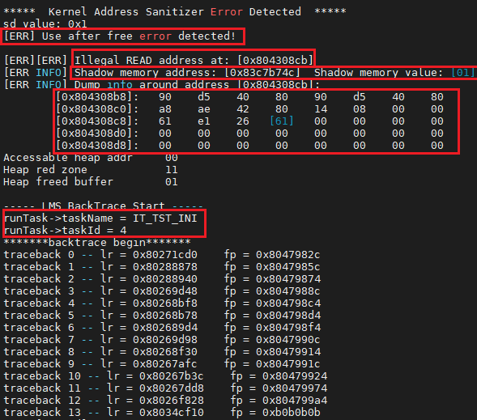

    LMS检测信息包含下述几类信息：

    -   检测到的内存问题，示例图中为释放后使用Use After Free
    -   发生问题的内存地址，示例图中为0x804308cb。
    -   发生问题的内存地址对应的影子内存及该影子内存的值，示例图中影子内存地址为0x83c7b74c，该地址的值为01。
    -   发生问题的内存地址前后内存的取值。
    -   当前运行的任务，示例图中为IT\_TST\_INI，任务ID为4。
    -   发生问题时的backtrace回溯栈。


#### 平台差异性

无。

<h3 id="注意事项-5">注意事项</h3>

-   LMS属于调测特性，在产品发布时，需关闭LMS模块的裁剪开关LOSCFG\_KERNEL\_LMS，删除LMS检测编译选项-fsanitize=kernel-address，恢复为开启LMS特性开启的其他配置项，参见[使用流程](#使用指南)。
-   如果被检测的模块有大量堆内存读写操作，需要增加任务栈大小。
-   内存模块和LMS模块不需要增加LMS检测编译选项-fsanitize=kernel-address。
-   如果要检测memcpy、memmove、strcat、strcpy、memcpy\_s、memmove\_s、strcat\_s、strcpy\_s这些函数的使用是否会引入内存问题，需要include头文件los\_lms.h。
-   LMS不支持栈上内存、全局变量的溢出检测，需要编译器支持。
-   LMS当前只适配了bestfit内存算法，且不支持SLAB算法。

<h2 id="Shell">Shell</h2>
参见<a href="https://gitee.com/LiteOS/LiteOS/blob/master/shell/README_CN.md" target="_blank">Shell使用教程</a>。

<h2 id="调度统计">调度统计</h2>

### 功能说明

用于统计CPU的一些调度信息，包括idle任务启动时间、idle任务运行时长、调度切次数等。

### 使用方法

1.  通过menuconfig开启该调度统计功能，即配置LOSCFG\_DEBUG\_SCHED\_STATISTICS=y，该功能默认关闭。
2.  将以下函数注册为Shell命令。Shell命令注册方法详见<a href="https://gitee.com/LiteOS/LiteOS/blob/master/shell/README_CN.md" target="_blank">Shell使用教程</a>中的“新增命令开发流程”。

    OsShellStatisticsStart---调度统计功能开启函数。

    OsShellStatisticsStop---调度统计功能关闭函数。关闭后，会自动调用OsStatisticsShow输出调度统计信息。

    OsShellCmdDumpSched---显示CPU调度信息的函数。

3.  调度信息查看。

    在Shell窗口中调用注册的命令。


### 注意事项

先执行OsShellStatisticsStart对应的Shell命令，开启调度统计功能后，再查看调度信息。

### 输出说明

图1 调用OsShellStatisticsStop后输出

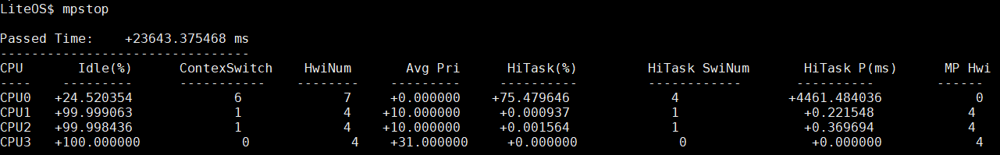

图中的mpstop是OsShellStatisticsStop注册的Shell命令，仅用于举例，实际上系统中并不存在该命令。图中各输出项说明如下表所示：

<a name="table1978162419917"></a>
<table><tbody><tr id="row68145245917"><td class="cellrowborder" valign="top" width="27.57%"><p id="p128141624198"><a name="p128141624198"></a><a name="p128141624198"></a>Passed Time</p>
</td>
<td class="cellrowborder" valign="top" width="72.43%"><p id="p19814924598"><a name="p19814924598"></a><a name="p19814924598"></a>调度功能运行时长</p>
</td>
</tr>
<tr id="row16814122416918"><td class="cellrowborder" valign="top" width="27.57%"><p id="p581410241796"><a name="p581410241796"></a><a name="p581410241796"></a>CPU</p>
</td>
<td class="cellrowborder" valign="top" width="72.43%"><p id="p17814924891"><a name="p17814924891"></a><a name="p17814924891"></a>CPU名称</p>
</td>
</tr>
<tr id="row10814132418916"><td class="cellrowborder" valign="top" width="27.57%"><p id="p7814132410916"><a name="p7814132410916"></a><a name="p7814132410916"></a>Idle(%)</p>
</td>
<td class="cellrowborder" valign="top" width="72.43%"><p id="p158141424397"><a name="p158141424397"></a><a name="p158141424397"></a>idle任务运行时长百分比</p>
</td>
</tr>
<tr id="row381415246912"><td class="cellrowborder" valign="top" width="27.57%"><p id="p681462413919"><a name="p681462413919"></a><a name="p681462413919"></a>ContexSwitch</p>
</td>
<td class="cellrowborder" valign="top" width="72.43%"><p id="p1481422412910"><a name="p1481422412910"></a><a name="p1481422412910"></a>任务调度切换次数</p>
</td>
</tr>
<tr id="row198141424191"><td class="cellrowborder" valign="top" width="27.57%"><p id="p15814324296"><a name="p15814324296"></a><a name="p15814324296"></a>HwiNum</p>
</td>
<td class="cellrowborder" valign="top" width="72.43%"><p id="p1181416246918"><a name="p1181416246918"></a><a name="p1181416246918"></a>中断触发次数</p>
</td>
</tr>
<tr id="row1681422417916"><td class="cellrowborder" valign="top" width="27.57%"><p id="p1814182414916"><a name="p1814182414916"></a><a name="p1814182414916"></a>Avg Pri</p>
</td>
<td class="cellrowborder" valign="top" width="72.43%"><p id="p6814124395"><a name="p6814124395"></a><a name="p6814124395"></a>切入任务不为idle任务的任务优先级平均值</p>
</td>
</tr>
<tr id="row2814324495"><td class="cellrowborder" valign="top" width="27.57%"><p id="p118141824391"><a name="p118141824391"></a><a name="p118141824391"></a>HiTask(%)</p>
</td>
<td class="cellrowborder" valign="top" width="72.43%"><p id="p1481513241890"><a name="p1481513241890"></a><a name="p1481513241890"></a>高优先级任务运行时长所占百分比，定义优先级小于16为高优先级</p>
</td>
</tr>
<tr id="row1881518241593"><td class="cellrowborder" valign="top" width="27.57%"><p id="p2081513241599"><a name="p2081513241599"></a><a name="p2081513241599"></a>HiTask SwiNum</p>
</td>
<td class="cellrowborder" valign="top" width="72.43%"><p id="p281522418911"><a name="p281522418911"></a><a name="p281522418911"></a>切入新任务为高优先级的切换次数，定义优先级小于16为高优先级</p>
</td>
</tr>
<tr id="row681517241394"><td class="cellrowborder" valign="top" width="27.57%"><p id="p881582416919"><a name="p881582416919"></a><a name="p881582416919"></a>HiTask P(ms)</p>
</td>
<td class="cellrowborder" valign="top" width="72.43%"><p id="p158155241892"><a name="p158155241892"></a><a name="p158155241892"></a>高优先级任务运行的平均时长，定义优先级小于16为高优先级</p>
</td>
</tr>
<tr id="row178156241097"><td class="cellrowborder" valign="top" width="27.57%"><p id="p58151924297"><a name="p58151924297"></a><a name="p58151924297"></a>MP Hwi</p>
</td>
<td class="cellrowborder" valign="top" width="72.43%"><p id="p13815124995"><a name="p13815124995"></a><a name="p13815124995"></a>核间中断触发次数，仅用于多核</p>
</td>
</tr>
</tbody>
</table>

图2 调用OsShellCmdDumpSched输出

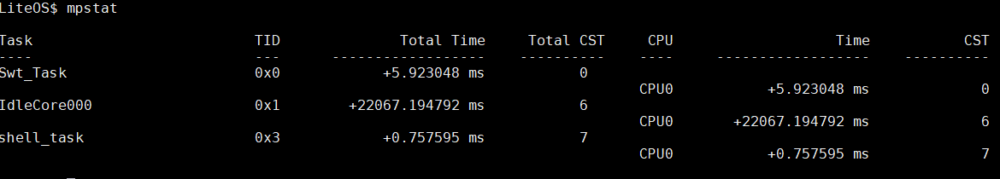

图中的mpstat是OsShellCmdDumpSched注册的Shell命令，仅用于举例，实际上系统中并不存在该命令。图中各输出项说明如下表所示：

<a name="table959215014287"></a>
<table><tbody><tr id="row12613125072817"><td class="cellrowborder" valign="top" width="28.09%"><p id="p961375018282"><a name="p961375018282"></a><a name="p961375018282"></a>Task</p>
</td>
<td class="cellrowborder" valign="top" width="71.91%"><p id="p1761365002814"><a name="p1761365002814"></a><a name="p1761365002814"></a>任务名称</p>
</td>
</tr>
<tr id="row461395082818"><td class="cellrowborder" valign="top" width="28.09%"><p id="p561315002816"><a name="p561315002816"></a><a name="p561315002816"></a>TID</p>
</td>
<td class="cellrowborder" valign="top" width="71.91%"><p id="p1961335016281"><a name="p1961335016281"></a><a name="p1961335016281"></a>任务ID</p>
</td>
</tr>
<tr id="row4613195022813"><td class="cellrowborder" valign="top" width="28.09%"><p id="p1661314503286"><a name="p1661314503286"></a><a name="p1661314503286"></a>Total Time</p>
</td>
<td class="cellrowborder" valign="top" width="71.91%"><p id="p1561320506285"><a name="p1561320506285"></a><a name="p1561320506285"></a>所有CPU的任务运行时长</p>
</td>
</tr>
<tr id="row16131850132813"><td class="cellrowborder" valign="top" width="28.09%"><p id="p126131850162817"><a name="p126131850162817"></a><a name="p126131850162817"></a>Total CST</p>
</td>
<td class="cellrowborder" valign="top" width="71.91%"><p id="p96131450112818"><a name="p96131450112818"></a><a name="p96131450112818"></a>所有CPU任务上下文切换次数</p>
</td>
</tr>
<tr id="row136131450122819"><td class="cellrowborder" valign="top" width="28.09%"><p id="p1613185072816"><a name="p1613185072816"></a><a name="p1613185072816"></a>CPU</p>
</td>
<td class="cellrowborder" valign="top" width="71.91%"><p id="p761385072818"><a name="p761385072818"></a><a name="p761385072818"></a>CPU名称</p>
</td>
</tr>
<tr id="row1461375014284"><td class="cellrowborder" valign="top" width="28.09%"><p id="p19613185016284"><a name="p19613185016284"></a><a name="p19613185016284"></a>Time</p>
</td>
<td class="cellrowborder" valign="top" width="71.91%"><p id="p10613450182820"><a name="p10613450182820"></a><a name="p10613450182820"></a>单CPU的任务运行时长</p>
</td>
</tr>
<tr id="row061316508285"><td class="cellrowborder" valign="top" width="28.09%"><p id="p1661385020280"><a name="p1661385020280"></a><a name="p1661385020280"></a>CST</p>
</td>
<td class="cellrowborder" valign="top" width="71.91%"><p id="p861316509286"><a name="p861316509286"></a><a name="p861316509286"></a>单CPU的任务上下文切换次数</p>
</td>
</tr>
</tbody>
</table>

<h2 id="内存调测方法">内存调测方法</h2>

-   **[多模块内存统计](#多模块内存统计)**

-   **[多内存池机制](#多内存池机制)**

-   **[内存备份机制](#内存备份机制)**

-   **[内存合法性检查](#内存合法性检查)**

-   **[内存size检查](#内存size检查)**

-   **[内存泄露检测](#内存泄露检测)**


<h3 id="多模块内存统计">多模块内存统计</h3>

#### 使用场景

系统业务模块化清晰，用户需统计各模块的内存占用情况。

#### 功能说明

Huawei LiteOS提供了一套基于内核内存接口的封装接口，增加模块ID作为入参。不同业务模块进行内存操作时，调用对应封装接口，可统计各模块的内存使用情况，并通过模块ID获取指定模块的内存使用情况。

<a name="table62913171618"></a>
<table><thead align="left"><tr id="row29861117131613"><th class="cellrowborder" valign="top" width="22.24%" id="mcps1.1.4.1.1"><p id="p1642661951613"><a name="p1642661951613"></a><a name="p1642661951613"></a>功能分类</p>
</th>
<th class="cellrowborder" valign="top" width="23.21%" id="mcps1.1.4.1.2"><p id="p1442671919166"><a name="p1442671919166"></a><a name="p1442671919166"></a>接口名</p>
</th>
<th class="cellrowborder" valign="top" width="54.55%" id="mcps1.1.4.1.3"><p id="p174261519191610"><a name="p174261519191610"></a><a name="p174261519191610"></a>描述</p>
</th>
</tr>
</thead>
<tbody><tr id="row8291819162"><td class="cellrowborder" rowspan="4" valign="top" width="22.24%" headers="mcps1.1.4.1.1 "><p id="p9291113162"><a name="p9291113162"></a><a name="p9291113162"></a>为指定模块申请、释放动态内存，并纳入模块统计</p>
</td>
<td class="cellrowborder" valign="top" width="23.21%" headers="mcps1.1.4.1.2 "><p id="p17292017165"><a name="p17292017165"></a><a name="p17292017165"></a>LOS_MemMalloc</p>
</td>
<td class="cellrowborder" valign="top" width="54.55%" headers="mcps1.1.4.1.3 "><p id="p329181131610"><a name="p329181131610"></a><a name="p329181131610"></a>从指定动态内存池分配size长度的内存给指定模块</p>
</td>
</tr>
<tr id="row62916101620"><td class="cellrowborder" valign="top" headers="mcps1.1.4.1.1 "><p id="p5305117164"><a name="p5305117164"></a><a name="p5305117164"></a>LOS_MemMfree</p>
</td>
<td class="cellrowborder" valign="top" headers="mcps1.1.4.1.2 "><p id="p113011131618"><a name="p113011131618"></a><a name="p113011131618"></a>释放指定模块的内存块</p>
</td>
</tr>
<tr id="row1330412161"><td class="cellrowborder" valign="top" headers="mcps1.1.4.1.1 "><p id="p4305171615"><a name="p4305171615"></a><a name="p4305171615"></a>LOS_MemMallocAlign</p>
</td>
<td class="cellrowborder" valign="top" headers="mcps1.1.4.1.2 "><p id="p1930131121614"><a name="p1930131121614"></a><a name="p1930131121614"></a>从指定动态内存池中申请长度为size且地址按boundary字节对齐的内存给指定模块</p>
</td>
</tr>
<tr id="row83013111166"><td class="cellrowborder" valign="top" headers="mcps1.1.4.1.1 "><p id="p193041181619"><a name="p193041181619"></a><a name="p193041181619"></a>LOS_MemMrealloc</p>
</td>
<td class="cellrowborder" valign="top" headers="mcps1.1.4.1.2 "><p id="p713816242294"><a name="p713816242294"></a><a name="p713816242294"></a>按size大小重新分配内存块给指定模块，并将原内存块内容拷贝到新内存块。如果新内存块申请成功，则释放原内存块</p>
</td>
</tr>
<tr id="row19305121617"><td class="cellrowborder" valign="top" width="22.24%" headers="mcps1.1.4.1.1 "><p id="p73016117166"><a name="p73016117166"></a><a name="p73016117166"></a>获取指定模块的内存使用量</p>
</td>
<td class="cellrowborder" valign="top" width="23.21%" headers="mcps1.1.4.1.2 "><p id="p8301819168"><a name="p8301819168"></a><a name="p8301819168"></a>LOS_MemMusedGet</p>
</td>
<td class="cellrowborder" valign="top" width="54.55%" headers="mcps1.1.4.1.3 "><p id="p1305121613"><a name="p1305121613"></a><a name="p1305121613"></a>获取指定模块的内存使用量，单位为Byte</p>
</td>
</tr>
</tbody>
</table>

#### 使用方法

1.  通过make menuconfig打开多模块内存统计功能。

    该功能依赖于LOSCFG\_MEM\_MUL\_MODULE，使用时需要在配置项中开启“Enable Memory module statistics”：

    ```
    Debug  ---> Enable a Debug Version ---> Enable MEM Debug ---> Enable Memory module statistics
    ```

2.  每个业务模块配置唯一module ID，模块代码中在内存操作时调用对应接口，并传入相应模块ID。
3.  通过LOS\_MemMusedGet接口获取指定模块的内存使用情况，可用于模块内存占用优化分析。

#### 注意事项

-   模块ID由宏MEM\_MODULE\_MAX限定，当系统模块个数超过该值时，需修改MEM\_MODULE\_MAX。
-   模块中所有内存操作都需调用封装接口，否则可能导致统计不准确。
-   目前只有bestfit内存管理算法支持该功能，需要使能LOSCFG\_KERNEL\_MEM\_BESTFIT。

#### 编程实例

```c
void test(void)
{
    void *ptr = NULL;
    void *ptrTmp = NULL;
    UINT32 size = 0x10;
    UINT32 module = 0;
    UINT32 memUsed = 0;

    ptr = LOS_MemMalloc(OS_SYS_MEM_ADDR, size, module);
    if (ptr == NULL) {
        PRINTK("module %d malloc failed\n", module);
    } else {
        PRINTK("module %d malloc successed\n", module);
    }

    memUsed = LOS_MemMusedGet(module);
    PRINTK("module %d mem used size %d\n", module, memUsed);

    module = 1;
    ptrTmp = LOS_MemMalloc(OS_SYS_MEM_ADDR, size, module);
    if (ptrTmp == NULL) {
        PRINTK("module %d malloc failed\n", module);
    } else {
        PRINTK("module %d malloc successed\n", module);
    }

    memUsed = LOS_MemMusedGet(module);
    PRINTK("module %d mem used size %d\n", module, memUsed);

    module = 0;
    LOS_MemMfree(OS_SYS_MEM_ADDR, ptr, module);
    module = 1;
    LOS_MemMfree(OS_SYS_MEM_ADDR, ptrTmp, module);
}

```

log：

```
module 0 malloc successed
module 0 mem used size 32
module 1 malloc successed
module 1 mem used size 32
```

<h3 id="多内存池机制">多内存池机制</h3>

#### 使用场景

系统中使用多个动态内存池时，需对各内存池进行管理和使用情况统计。

#### 功能说明

系统内存机制中通过链表实现对多个内存池的管理。内存池需回收时可调用对应接口进行去初始化。

通过多内存池机制，可以获取系统各个内存池的信息和使用情况，也可以检测内存池空间分配交叉情况，当系统两个内存池空间交叉时，第二个内存池会初始化失败，并给出空间交叉的提示信息。

<a name="table17171164165"></a>
<table><thead align="left"><tr id="row31169589163114"><th class="cellrowborder" valign="top" width="21.97%" id="mcps1.1.4.1.1"><p id="p41708771163114"><a name="p41708771163114"></a><a name="p41708771163114"></a>功能分类</p>
</th>
<th class="cellrowborder" valign="top" width="19.75%" id="mcps1.1.4.1.2"><p id="p22967294163114"><a name="p22967294163114"></a><a name="p22967294163114"></a>接口名</p>
</th>
<th class="cellrowborder" valign="top" width="58.28%" id="mcps1.1.4.1.3"><p id="p48411501163114"><a name="p48411501163114"></a><a name="p48411501163114"></a>描述</p>
</th>
</tr>
</thead>
<tbody><tr id="row29017497163114"><td class="cellrowborder" valign="top" width="21.97%" headers="mcps1.1.4.1.1 "><p id="p1607017163114"><a name="p1607017163114"></a><a name="p1607017163114"></a>初始化内存池</p>
</td>
<td class="cellrowborder" valign="top" width="19.75%" headers="mcps1.1.4.1.2 "><p id="p63059525163114"><a name="p63059525163114"></a><a name="p63059525163114"></a>LOS_MemInit</p>
</td>
<td class="cellrowborder" valign="top" width="58.28%" headers="mcps1.1.4.1.3 "><p id="p7547926163114"><a name="p7547926163114"></a><a name="p7547926163114"></a>初始化一块指定的动态内存池，大小为size</p>
</td>
</tr>
<tr id="row566665491512"><td class="cellrowborder" valign="top" width="21.97%" headers="mcps1.1.4.1.1 "><p id="p5634586991512"><a name="p5634586991512"></a><a name="p5634586991512"></a>删除内存池</p>
</td>
<td class="cellrowborder" valign="top" width="19.75%" headers="mcps1.1.4.1.2 "><p id="p61270991512"><a name="p61270991512"></a><a name="p61270991512"></a>LOS_MemDeInit</p>
</td>
<td class="cellrowborder" valign="top" width="58.28%" headers="mcps1.1.4.1.3 "><p id="p4962945391512"><a name="p4962945391512"></a><a name="p4962945391512"></a>删除指定内存池，仅打开LOSCFG_MEM_MUL_POOL时有效</p>
</td>
</tr>
<tr id="row131382579613"><td class="cellrowborder" valign="top" width="21.97%" headers="mcps1.1.4.1.1 "><p id="p2077919553615"><a name="p2077919553615"></a><a name="p2077919553615"></a>显示系统内存池</p>
</td>
<td class="cellrowborder" valign="top" width="19.75%" headers="mcps1.1.4.1.2 "><p id="p9779255064"><a name="p9779255064"></a><a name="p9779255064"></a>LOS_MemPoolList</p>
</td>
<td class="cellrowborder" valign="top" width="58.28%" headers="mcps1.1.4.1.3 "><p id="p2077919551963"><a name="p2077919551963"></a><a name="p2077919551963"></a>打印系统中已初始化的所有内存池，包括内存池的起始地址、内存池大小、空闲内存总大小、已使用内存总大小、最大的空闲内存块大小、空闲内存块数量、已使用的内存块数量，仅打开LOSCFG_MEM_MUL_POOL时有效</p>
</td>
</tr>
</tbody>
</table>

#### 使用方法

1.  通过make menuconfig打开多内存池机制。

    功能依赖于LOSCFG\_MEM\_MUL\_POOL，使用时在配置项中开启“Enable Memory multi-pool control”：

    ```
    Debug  ---> Enable a Debug Version---> Enable MEM Debug---> Enable Memory multi-pool control
    ```

2.  调用LOS\_MemInit接口进行内存池初始化，内存池回收时调用LOS\_MemDeInit接口进行去初始化。
3.  调用LOS\_MemInfoGet获取指定内存池的信息和使用情况。
4.  调用LOS\_MemPoolList获取系统所有内存池信息和使用情况。

#### 注意事项

-   初始化内存池时，需保证各内存池空间无交叉，若交叉则会导致初始化失败。
-   malloc/free系列接口默认从OS系统内存池申请和释放内存，其它内存池的操作必须调用Huawei LiteOS内存接口（LOS\_MemAlloc等），不能调用malloc/free系列接口及其相关封装接口。
-   内存池回收必须调用LOS\_MemDeInit接口去初始化（回收前需确保池中内存块均已释放），否则二次初始化该内存池空间会失败，导致该内存池不能被重新使用。
-   内存池大小需根据业务实际情况合理分配。

#### 编程实例

```c
void test(void)
{
    UINT32 ret = 0;
    UINT32 size = 0x100000;

    VOID *poolAddr1 = LOS_MemAlloc(OS_SYS_MEM_ADDR, size);
    ret = LOS_MemInit(poolAddr1, size);
    if (ret != 0) {
        PRINTK("LOS_MemInit failed\n");
        return;
    }

    VOID *poolAddr2 = LOS_MemAlloc(OS_SYS_MEM_ADDR, size);
    ret = LOS_MemInit(poolAddr2, size);
    if (ret != 0) {
        PRINTK("LOS_MemInit failed\n");
        return;
    }

    PRINTK("\n********step1 list the mem poll\n");
    LOS_MemPoolList();

    LOS_MemDeInit(poolAddr1);
    if (ret != 0) {
        PRINTK("LOS_MemDeInit failed\n");
        return;
    }

    PRINTK("\n********step2 list the mem poll\n");
    LOS_MemPoolList();

    LOS_MemDeInit(poolAddr2);
    if (ret != 0) {
        PRINTK("LOS_MemDeInit failed\n");
        return;
    } 

    PRINTK("\n********step3 list the mem poll\n");
    LOS_MemPoolList(); 
}
```

log：

```
********step1 list the mem poll
pool0 :
pool addr          pool size    used size     free size    max free node size   used node num     free node num
---------------    --------     -------       --------     --------------       -------------      ------------
0x8017b2c0         0x100000     0x2e1fc       0xd1d20      0xd1d20              0x2b               0x1            
pool1 :
pool addr          pool size    used size     free size    max free node size   used node num     free node num
---------------    --------     -------       --------     --------------       -------------      ------------
0x8027b2c0         0x7d84d40    0x7070c8      0x767db94    0x767db94            0x1026             0x1            
pool2 :
pool addr          pool size    used size     free size    max free node size   used node num     free node num
---------------    --------     -------       --------     --------------       -------------      ------------
0x8078244c         0x100000     0x10          0xfff0c      0xfff0c              0x1                0x1            
pool3 :
pool addr          pool size    used size     free size    max free node size   used node num     free node num
---------------    --------     -------       --------     --------------       -------------      ------------
0x8088245c         0x100000     0x10          0xfff0c      0xfff0c              0x1                0x1            

********step2 list the mem poll
pool0 :
pool addr          pool size    used size     free size    max free node size   used node num     free node num
---------------    --------     -------       --------     --------------       -------------      ------------
0x8017b2c0         0x100000     0x2e1fc       0xd1d20      0xd1d20              0x2b               0x1            
pool1 :
pool addr          pool size    used size     free size    max free node size   used node num     free node num
---------------    --------     -------       --------     --------------       -------------      ------------
0x8027b2c0         0x7d84d40    0x7070c8      0x767db94    0x767db94            0x1026             0x1            
pool2 :
pool addr          pool size    used size     free size    max free node size   used node num     free node num
---------------    --------     -------       --------     --------------       -------------      ------------
0x8088245c         0x100000     0x10          0xfff0c      0xfff0c              0x1                0x1            

********step3 list the mem poll
pool0 :
pool addr          pool size    used size     free size    max free node size   used node num     free node num
---------------    --------     -------       --------     --------------       -------------      ------------
0x8017b2c0         0x100000     0x2e1fc       0xd1d20      0xd1d20              0x2b               0x1            
pool1 :
pool addr          pool size    used size     free size    max free node size   used node num     free node num
---------------    --------     -------       --------     --------------       -------------      ------------
0x8027b2c0         0x7d84d40    0x7070c8      0x767db94    0x767db94            0x1026             0x1   
```

<h3 id="内存备份机制">内存备份机制</h3>

#### 使用场景

业务代码中出现踩内存、释放野指针问题，通过异常dump信息较难定位内存非法操作的位置。

#### 功能说明

备份动态内存节点控制头信息：在前一内存节点控制头中备份当前节点控制头信息。在内存申请和释放操作中增加对当前节点的控制头信息与备份信息的检测，在节点控制头被踩而备份信息未踩时，输出节点控制头备份信息及被踩节点前一内存节点信息，用于进一步分析是否为越界踩内存问题。在释放野指针时可及时输出提示信息和调用栈信息，快速定位释放野指针的位置。

#### 使用方法

通过make menuconfig打开内存备份机制。目前只有bestfit内存管理算法支持该功能，需要使能LOSCFG\_KERNEL\_MEM\_BESTFIT。同时该功能依赖于LOSCFG\_MEM\_HEAD\_BACKUP，使用时在配置项中开启“Enable Node Head Backup”：

```
Debug  ---> Enable a Debug Version ---> Enable MEM Debug ---> Enable Node Head Backup
```

#### 注意事项

该功能开启后会增加系统内存占用（占用大小=节点个数\*节点控制头大小），且影响内存操作性能。建议仅在问题检测时开启，默认关闭。

<h3 id="内存合法性检查">内存合法性检查</h3>

#### 使用场景

业务发生踩内存导致内存节点控制头被踩，长时间后才触发业务异常，业务逻辑复杂，难以定位发生踩内存的位置。

#### 功能说明

开启该功能后，在动态内存申请接口中增加内存合法性检查，对动态内存池中所有节点控制头的合法性进行检查，若已发生动态内存节点被踩，及时触发异常，输出error信息，缩小问题定位范围。

#### 使用方法

1.  通过make menuconfig打开内存合法性检查。

    功能依赖LOSCFG\_BASE\_MEM\_NODE\_INTEGRITY\_CHECK，使用时在配置项中开启“Enable integrity check or not”：

    ```
    Debug  ---> Enable a Debug Version ---> Enable MEM Debug ---> Enable integrity check or not
    ```

2.  发生踩内存后，下一次内存申请操作即触发异常，并给出被踩节点和前一节点信息，可初步分析定位是否是前一节点越界踩内存。踩内存发生范围为上一次内存申请和此次内存申请之间。异常信息可以通过执行Shell命令<a href="https://gitee.com/LiteOS/LiteOS/blob/master/shell/README_CN.md#memcheck" target="_blank">memcheck</a>查看。

#### 注意事项

该功能开启时，系统内存申请操作的性能下降明显，建议仅在定位问题时开启，默认关闭。

#### 踩内存问题定位实例

通过构造超出内存长度的memset操作，构造越界踩内存，造成内存节点损坏，构造代码如下：

```c
VOID SampleFunc(VOID *p)
{
    memset(p, 0, 0x110); // 超出长度的memset,设置踩内存场景
}

UINT32 Test(UINT32 argc, CHAR **args)
{
    void *p1, *p2;

    p1 = LOS_MemAlloc((void*)OS_SYS_MEM_ADDR, 0x100);
    p2 = LOS_MemAlloc((void*)OS_SYS_MEM_ADDR, 0x100);
    dprintf("p1 = %p, p2 = %p \n", p1, p2);
    SampleFunc(p1); // 因为p1和p2相邻，当memset的长度超过p1的内存大小，就会越界踩到p2内存

    LOS_MemFree(OS_SYS_MEM_ADDR, (void *)p1);
    LOS_MemFree(OS_SYS_MEM_ADDR, (void *)p2);
    return 0;
}
```

执行上述代码后，执行Shell命令memcheck，其输出内容如下：

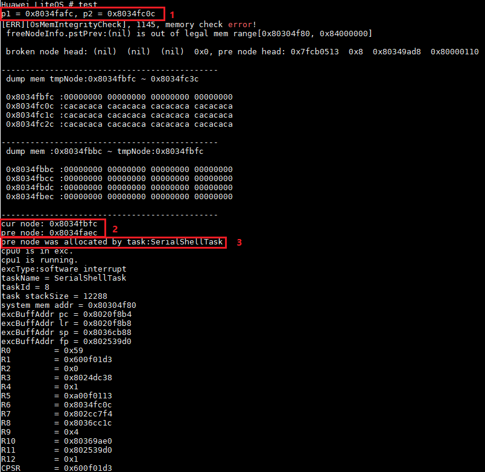

从上图可以看到打印了错误信息。

-   标记2所指“cur node：0x8034fbfc”表示该节点内存被踩，“pre node：0x8034faec”表示被踩节点前面的节点。标记3所示“pre node was allocated by task:SerialShellTask”表示在SerialShellTask任务中发生了踩内存。
-   标记1打印的是p1和p2内存的起始地址，“p2 = 0x8034fc0c”，减去控制头大小0x10，即p2-0x10=0x8034fbfc，就是cur node打印出的地址，即p2内存被踩。从代码可以看到p1和p2是两个相邻的节点（这也可以从打印的p1和p2地址看出来，即p1+p1的size+控制头大小=p2，0x8034fafc+0x100+0x10=0x8034fc0c），所以“pre node：0x8034faec”应该就是p1的地址，从标记1获取p1地址为“p1 = 0x8034fafc”，即pre node加上控制头大小0x10（0x8034faec+0x10=0x8034fafc）。

<h3 id="内存size检查">内存size检查</h3>

#### 使用场景

memset和memcpy操作动态内存，发生越界踩内存问题。

#### 功能说明

对于memset和memcpy操作，当入参为动态内存节点时，增加对内存节点实际大小与入参指定大小的检查，若指定大小大于节点实际大小时，输出error信息，并且取消该次memset或memcpy操作，所以能够防止操作越界。动态内存越界场景下，可开启该功能定位问题。

<a name="table6587685163114"></a>
<table><thead align="left"><tr id="row8355205704514"><th class="cellrowborder" valign="top" width="34.86%" id="mcps1.1.3.1.1"><p id="a2dffaf83b2894662b99e38092a81f4c0"><a name="a2dffaf83b2894662b99e38092a81f4c0"></a><a name="a2dffaf83b2894662b99e38092a81f4c0"></a>接口名</p>
</th>
<th class="cellrowborder" valign="top" width="65.14%" id="mcps1.1.3.1.2"><p id="a78e2e39f5b894c1d9e717315aceb9aeb"><a name="a78e2e39f5b894c1d9e717315aceb9aeb"></a><a name="a78e2e39f5b894c1d9e717315aceb9aeb"></a>描述</p>
</th>
</tr>
</thead>
<tbody><tr id="row10513314151950"><td class="cellrowborder" valign="top" width="34.86%" headers="mcps1.1.3.1.1 "><p id="p663627871946"><a name="p663627871946"></a><a name="p663627871946"></a>LOS_MemCheckLevelSet</p>
</td>
<td class="cellrowborder" valign="top" width="65.14%" headers="mcps1.1.3.1.2 "><p id="p66766791946"><a name="p66766791946"></a><a name="p66766791946"></a>设置内存检查级别</p>
</td>
</tr>
<tr id="row57717782151954"><td class="cellrowborder" valign="top" width="34.86%" headers="mcps1.1.3.1.1 "><p id="p591081821946"><a name="p591081821946"></a><a name="p591081821946"></a>LOS_MemCheckLevelGet</p>
</td>
<td class="cellrowborder" valign="top" width="65.14%" headers="mcps1.1.3.1.2 "><p id="p230334311946"><a name="p230334311946"></a><a name="p230334311946"></a>获取内存检查级别</p>
</td>
</tr>
<tr id="row193316438483"><td class="cellrowborder" valign="top" width="34.86%" headers="mcps1.1.3.1.1 "><p id="p846713011116"><a name="p846713011116"></a><a name="p846713011116"></a>LOS_MemNodeSizeCheck</p>
</td>
<td class="cellrowborder" valign="top" width="65.14%" headers="mcps1.1.3.1.2 "><p id="p104671930316"><a name="p104671930316"></a><a name="p104671930316"></a>获取指定内存块的总大小和可用大小</p>
</td>
</tr>
</tbody>
</table>

#### 错误码

<a name="table6015294495642"></a>
<table><thead align="left"><tr id="row2267197395642"><th class="cellrowborder" valign="top" width="7.5200000000000005%" id="mcps1.1.6.1.1"><p id="p1908783195642"><a name="p1908783195642"></a><a name="p1908783195642"></a>序号</p>
</th>
<th class="cellrowborder" valign="top" width="29.03%" id="mcps1.1.6.1.2"><p id="p261046995642"><a name="p261046995642"></a><a name="p261046995642"></a>定义</p>
</th>
<th class="cellrowborder" valign="top" width="11.58%" id="mcps1.1.6.1.3"><p id="p1012144095642"><a name="p1012144095642"></a><a name="p1012144095642"></a>实际数值</p>
</th>
<th class="cellrowborder" valign="top" width="26.790000000000003%" id="mcps1.1.6.1.4"><p id="p1453028795642"><a name="p1453028795642"></a><a name="p1453028795642"></a>描述</p>
</th>
<th class="cellrowborder" valign="top" width="25.080000000000002%" id="mcps1.1.6.1.5"><p id="p2753561710026"><a name="p2753561710026"></a><a name="p2753561710026"></a>参考解决方案</p>
</th>
</tr>
</thead>
<tbody><tr id="row6366372295642"><td class="cellrowborder" valign="top" width="7.5200000000000005%" headers="mcps1.1.6.1.1 "><p id="p5648782795642"><a name="p5648782795642"></a><a name="p5648782795642"></a>1</p>
</td>
<td class="cellrowborder" valign="top" width="29.03%" headers="mcps1.1.6.1.2 "><p id="p261116438345"><a name="p261116438345"></a><a name="p261116438345"></a>LOS_ERRNO_MEMCHECK_PARA_NULL</p>
</td>
<td class="cellrowborder" valign="top" width="11.58%" headers="mcps1.1.6.1.3 "><p id="p660114510360"><a name="p660114510360"></a><a name="p660114510360"></a>0x02000101</p>
</td>
<td class="cellrowborder" valign="top" width="26.790000000000003%" headers="mcps1.1.6.1.4 "><p id="p165631814114010"><a name="p165631814114010"></a><a name="p165631814114010"></a>LOS_MemNodeSizeCheck的入参中存在空指针</p>
</td>
<td class="cellrowborder" valign="top" width="25.080000000000002%" headers="mcps1.1.6.1.5 "><p id="p54251328201810"><a name="p54251328201810"></a><a name="p54251328201810"></a>传入有效指针</p>
</td>
</tr>
<tr id="row18396131112373"><td class="cellrowborder" valign="top" width="7.5200000000000005%" headers="mcps1.1.6.1.1 "><p id="p163971911103714"><a name="p163971911103714"></a><a name="p163971911103714"></a>2</p>
</td>
<td class="cellrowborder" valign="top" width="29.03%" headers="mcps1.1.6.1.2 "><p id="p15397191113710"><a name="p15397191113710"></a><a name="p15397191113710"></a>LOS_ERRNO_MEMCHECK_OUTSIDE</p>
</td>
<td class="cellrowborder" valign="top" width="11.58%" headers="mcps1.1.6.1.3 "><p id="p739751114372"><a name="p739751114372"></a><a name="p739751114372"></a>0x02000102</p>
</td>
<td class="cellrowborder" valign="top" width="26.790000000000003%" headers="mcps1.1.6.1.4 "><p id="p193971711193717"><a name="p193971711193717"></a><a name="p193971711193717"></a>内存地址不在合法范围内</p>
</td>
<td class="cellrowborder" valign="top" width="25.080000000000002%" headers="mcps1.1.6.1.5 "><p id="p4397811113714"><a name="p4397811113714"></a><a name="p4397811113714"></a>输入内存地址本身不在内存管理范围之内，不做处理</p>
</td>
</tr>
<tr id="row1077061733719"><td class="cellrowborder" valign="top" width="7.5200000000000005%" headers="mcps1.1.6.1.1 "><p id="p10770111716371"><a name="p10770111716371"></a><a name="p10770111716371"></a>3</p>
</td>
<td class="cellrowborder" valign="top" width="29.03%" headers="mcps1.1.6.1.2 "><p id="p177703178376"><a name="p177703178376"></a><a name="p177703178376"></a>LOS_ERRNO_MEMCHECK_NO_HEAD</p>
</td>
<td class="cellrowborder" valign="top" width="11.58%" headers="mcps1.1.6.1.3 "><p id="p7770191743713"><a name="p7770191743713"></a><a name="p7770191743713"></a>0x02000103</p>
</td>
<td class="cellrowborder" valign="top" width="26.790000000000003%" headers="mcps1.1.6.1.4 "><p id="p5770101743720"><a name="p5770101743720"></a><a name="p5770101743720"></a>内存地址已经被释放或者是野指针</p>
</td>
<td class="cellrowborder" valign="top" width="25.080000000000002%" headers="mcps1.1.6.1.5 "><p id="p187701217163712"><a name="p187701217163712"></a><a name="p187701217163712"></a>输入非法地址，内存size检测不做处理</p>
</td>
</tr>
<tr id="row1577222415378"><td class="cellrowborder" valign="top" width="7.5200000000000005%" headers="mcps1.1.6.1.1 "><p id="p1477282433715"><a name="p1477282433715"></a><a name="p1477282433715"></a>4</p>
</td>
<td class="cellrowborder" valign="top" width="29.03%" headers="mcps1.1.6.1.2 "><p id="p1677242453718"><a name="p1677242453718"></a><a name="p1677242453718"></a>LOS_ERRNO_MEMCHECK_WRONG_LEVEL</p>
</td>
<td class="cellrowborder" valign="top" width="11.58%" headers="mcps1.1.6.1.3 "><p id="p18772162443714"><a name="p18772162443714"></a><a name="p18772162443714"></a>0x02000104</p>
</td>
<td class="cellrowborder" valign="top" width="26.790000000000003%" headers="mcps1.1.6.1.4 "><p id="p18772142493717"><a name="p18772142493717"></a><a name="p18772142493717"></a>内存检测等级不合法</p>
</td>
<td class="cellrowborder" valign="top" width="25.080000000000002%" headers="mcps1.1.6.1.5 "><p id="p1177210244376"><a name="p1177210244376"></a><a name="p1177210244376"></a>通过LOS_MemCheckLevelGet检查等级，并通过LOS_MemCheckLevelSet来配置合法的等级</p>
</td>
</tr>
<tr id="row126753302374"><td class="cellrowborder" valign="top" width="7.5200000000000005%" headers="mcps1.1.6.1.1 "><p id="p18675193014379"><a name="p18675193014379"></a><a name="p18675193014379"></a>5</p>
</td>
<td class="cellrowborder" valign="top" width="29.03%" headers="mcps1.1.6.1.2 "><p id="p7675163011372"><a name="p7675163011372"></a><a name="p7675163011372"></a>LOS_ERRNO_MEMCHECK_DISABLED</p>
</td>
<td class="cellrowborder" valign="top" width="11.58%" headers="mcps1.1.6.1.3 "><p id="p967513014372"><a name="p967513014372"></a><a name="p967513014372"></a>0x02000105</p>
</td>
<td class="cellrowborder" valign="top" width="26.790000000000003%" headers="mcps1.1.6.1.4 "><p id="p19675530163715"><a name="p19675530163715"></a><a name="p19675530163715"></a>内存检测被关闭</p>
</td>
<td class="cellrowborder" valign="top" width="25.080000000000002%" headers="mcps1.1.6.1.5 "><p id="p186751830193715"><a name="p186751830193715"></a><a name="p186751830193715"></a>通过LOS_MemCheckLevelSet使能内存检测</p>
</td>
</tr>
</tbody>
</table>

#### 使用方法

通过make menuconfig打开内存size检查的配置项LOSCFG\_BASE\_MEM\_NODE\_SIZE\_CHECK，即在menuconfig中开启“Enable size check or not”。目前只有bestfit内存管理算法支持该功能，所以还需要使能LOSCFG\_KERNEL\_MEM\_BESTFIT。

```
Debug  ---> Enable a Debug Version ---> Enable MEM Debug ---> Enable size check or not
```

#### 注意事项

开启该功能后，memset和memcpy性能下降，建议仅在需要定位越界问题时开启，默认关闭。

#### 内存越界问题定位实例

通过构造超出内存长度的memset和memcpy操作，构造越界踩内存问题，构造代码如下：

```c
VOID test(VOID)
{
    UINT32 size = 0x100;

    VOID *poolAddr1 = LOS_MemAlloc((VOID *)OS_SYS_MEM_ADDR, size);
    if (poolAddr1 == NULL) {
        PRINTK("malloc poolAddr1 failed\n");
        return;
    } else {
        PRINTK("malloc poolAddr1 %p successed\n", poolAddr1);
    }

    VOID *poolAddr2 = LOS_MemAlloc((VOID *)OS_SYS_MEM_ADDR, size);
    if (poolAddr2 == NULL) {
        PRINTK("malloc poolAddr2 failed\n");
        return;
    } else {
        PRINTK("malloc poolAddr2 %p successed\n", poolAddr2);
    }

    LOS_MemCheckLevelSet(LOS_MEM_CHECK_LEVEL_LOW);      // 开启对memset和memcpy的长度检测

    PRINTK("memset poolAddr1 overflow\n"); 
    memset(poolAddr1, 0x10, size * 2);                  // 超出长度的memset
    PRINTK("memset poolAddr1\n"); 
    memset(poolAddr1, 0x10, size);                      // 合理长度的memset

    PRINTK("memcpy poolAddr2 overflow\n"); 
    memcpy(poolAddr2, poolAddr1, size * 2);            // 超出长度的memcpy

    PRINTK("memcpy poolAddr2\n"); 
    memcpy(poolAddr2, poolAddr1, size);                // 合理长度的memcpy

    LOS_MemCheckLevelSet(LOS_MEM_CHECK_LEVEL_DISABLE); // 关闭对memset和memcpy的长度检测

    LOS_MemFree((VOID *)OS_SYS_MEM_ADDR, (VOID *)poolAddr1);
    LOS_MemFree((VOID *)OS_SYS_MEM_ADDR, (VOID *)poolAddr2);

    return 0;
}
```

log：

```
malloc poolAddr1 0x80349514 successed
malloc poolAddr2 0x80349624 successed
LOS_MemCheckLevelSet: LOS_MEM_CHECK_LEVEL_LOW
memset poolAddr1 overflow
[ERR] ---------------------------------------------
memset: dst inode availSize is not enough availSize = 0x100, memcpy length = 0x200
runTask->taskName = osMain
runTask->taskId = 64
*******backtrace begin*******
traceback 0 -- lr = 0x80209798    fp = 0x802c6930
traceback 1 -- lr = 0x80210fc4    fp = 0x802c6954
traceback 2 -- lr = 0x8020194c    fp = 0x802c6994
traceback 3 -- lr = 0x80201448    fp = 0x802c699c
traceback 4 -- lr = 0x802012fc    fp = 0x0
[ERR] ---------------------------------------------
memset poolAddr1
memcpy poolAddr2 overflow
[ERR] ---------------------------------------------
memcpy: dst inode availSize is not enough availSize = 0x100, memcpy length = 0x200
runTask->taskName = osMain
runTask->taskId = 64
*******backtrace begin*******
traceback 0 -- lr = 0x80209798    fp = 0x802c6930
traceback 1 -- lr = 0x8020dbc4    fp = 0x802c6954
traceback 2 -- lr = 0x8020194c    fp = 0x802c6994
traceback 3 -- lr = 0x80201448    fp = 0x802c699c
traceback 4 -- lr = 0x802012fc    fp = 0x0
[ERR] ---------------------------------------------
memcpy poolAddr2
```

由于开启size检测，非法的memset和memcpy操作被取消，输出error信息。“runTask-\>taskName = osMain”显示了该非法操作发生在 osMain函数中，并打印寄存器lr和fp的值。此时可以打开编译后生成的 vs\_server.asm（默认生成在Huawei\_LiteOS/out/<platform\>目录下，其中的platform为具体的平台名），通过对比“寄存器lr”的值，查看函数的嵌套调用。

<h3 id="内存泄露检测">内存泄露检测</h3>

#### 使用场景

业务运行中发生内存泄露，业务逻辑复杂或者长时间运行才出现。

#### 功能说明

申请内存和释放申请时，在内存节点控制头中记录函数调用栈，发生内存泄露时，通过分析used节点信息，可定位疑似内存泄露的位置。

#### 使用方法

1.  通过make menuconfig打开内存泄漏检测。

    目前只有bestfit内存管理算法支持该功能，需要使能LOSCFG\_KERNEL\_MEM\_BESTFIT。同时该功能依赖于LOSCFG\_MEM\_LEAKCHECK，可以在menuconfig中配置“Enable Function call stack of Mem operation recorded”：

    ```
    Debug  ---> Enable a Debug Version ---> Enable MEM Debug ---> Enable Function call stack of Mem operation recorded
    ```

2.  配置调用栈回溯信息。

    -   LOS\_OMIT\_LR\_CNT：调用栈回溯忽略层级，默认配置为2。
    -   LOS\_RECORD\_LR\_CNT：调用栈回溯记录个数，默认配置为3。

    默认配置下，获取0\~4层LR信息，忽略0和1两层（调用封装接口的节点0层和1层LR信息相同），记录2、3、4三层。

    > **说明：** 
    >宏配置LOS\_OMIT\_LR\_CNT 和LOS\_RECORD\_LR\_CNT位于los\_memory.h中。

3.  使用Shell命令** memused **获取used节点数据。

    系统稳定运行后，若used节点个数随时间一直增加，极大可能存在内存泄露，对数据进行对比分析，重点关注LR重复的节点是否存在内存泄露，泄漏点可通过LR信息进行回溯查找。

    打印log信息如下，memused命令说明详见<a href="https://gitee.com/LiteOS/LiteOS/blob/master/shell/README_CN.md#memused" target="_blank">memused</a>。

    ```
    Huawei LiteOS # memused
    node         LR[0]       LR[1]       LR[2]
    0x802d7b34:  0x8006d86c  0x8011c604  0x8011c758
    0x802dab6c:  0x8006d16c  0x8006d8a0  0x8011c604
    ```


#### 注意事项

该功能开启时会增加系统内存占用（内存占用=节点个数\*LOS\_RECORD\_LR\_CNT\*指针大小），影响内存操作性能，建议仅在定位问题时开启，默认关闭。

<h2 id="任务间通信调测方法">任务间通信调测方法</h2>

-   **[队列调测方法](#队列调测方法)**

-   **[互斥锁调测方法](#互斥锁调测方法)**

-   **[自旋锁调测方法](#自旋锁调测方法)**


<h3 id="队列调测方法">队列调测方法</h3>

#### 功能说明

队列是一种生产者消费者模型，生产者生产消息放入队列，等待被消费者使用。如果队列已满，生产者被挂起，如果队列已空，消费者被挂起。Huawei LiteOS中使用队列传递消息时，可以设置超时时间，队列的主要作用是实现任务间的异步通信。通过Shell命令<a href="https://gitee.com/LiteOS/LiteOS/blob/master/shell/README_CN.md#queue" target="_blank">queue</a>可以查看队列的使用情况。

#### 使用方法

queue命令依赖LOSCFG\_DEBUG\_QUEUE，使用时需要在menuconfig中开启"Enable Queue Debugging"。

```
Debug ---> Enable a Debug Version ---> Enable Debug LiteOS Kernel Resource ---> Enable Queue Debugging
```

#### 使用实例

在Shell窗口中执行命令queue，打印系统中的队列信息如下：

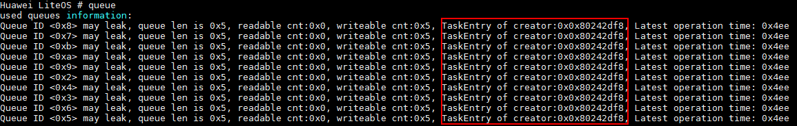

其输出项的含义见<a href="https://gitee.com/LiteOS/LiteOS/blob/master/shell/README_CN.md#queue" target="_blank">Shell使用教程中queue命令的使用示例</a>，调试过程中主要使用上图中的标识项TaskEntry of creator，即创建队列的接口函数地址（0x0x80242df8）。在vs\_server.asm反汇编文件（默认在Huawei\_LiteOS/out/<platform\>目录下，其中的platform为具体的平台名）中找到该地址，可以看到创建队列的函数名，比如这里的app\_init（0x0x80242df8），见下图。

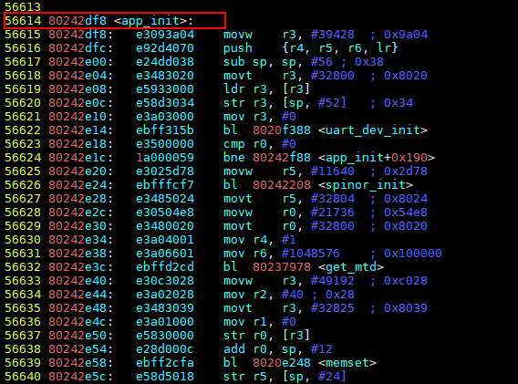


<h3 id="互斥锁调测方法">互斥锁调测方法</h3>

#### 使用场景

多任务系统使用互斥锁达到资源互斥的目的，其他任务不能强行抢占任务已经占有的资源。使用互斥锁时，可能存在任务间相互等对方释放资源的情况，从而造成死锁。死锁会使任务陷入无限循环等待，导致业务功能障碍。

#### 功能说明

开启互斥锁死锁检测功能后，每个任务在成功获取互斥锁时，会记录该互斥锁为本任务持有，因此通过任务ID可以得知持有的互斥锁。此外，互斥锁控制块本身会记录那些因申请不到该锁而被阻塞的任务。执行Shell命令<a href="https://gitee.com/LiteOS/LiteOS/blob/master/shell/README_CN.md#dlock" target="_blank">dlock</a>可以输出系统中所有任务持有互斥锁的信息及任务调用栈信息，再结合系统反汇编vs\_server.asm文件和代码就可以确定哪些任务发生了死锁。

#### 互斥锁死锁检测机制

任务发生死锁后，无法得到调度，通过记录任务上次调度的时间，设置一个超时时间阈值，如果任务在这段时间内都没有得到调度，则怀疑该任务发生了死锁。

#### 使用方法

配置宏LOSCFG\_DEBUG\_DEADLOCK，即在menuconfig配置项中开启“Enable Mutex Deadlock Debugging”，若关闭该选项，则关闭死锁检测功能。

```
Debug->Enable Debug LiteOS Kernel Resource->Enable Mutex Deadlock Debugging
```

#### 注意事项

死锁检测输出的是超过时间阈值（默认为10min）的任务信息，但不代表这些任务都发生了死锁，需要通过互斥锁信息及任务调用栈信息进一步确认。

#### 死锁定位实例

构造ABBA互斥锁死锁场景，具体如下：

有两个任务，分别为app\_Task和mutexDlock\_Task，同时系统中还存在其他系统默认初始任务。在任务app\_Task中执行MutexDlockDebug函数，并在该函数中创建任务mutexDlock\_Task。函数MutexDlockDebug（即任务app\_Task）创建了个互斥锁mutex0，并持有mutex0，接着创建更高优先级的任务mutexDlock\_Task，休眠一段时间后去申请mutex1被阻塞（任务mutexDlock\_Task已经率先持有mutex1）。任务mutexDlock\_Task创建并持有mutex1，然后申请mutex0被阻塞（任务app\_Task已经率先持有mutex0）。代码如下：

```c
#include "unistd.h"
#include "los_mux.h"
#include "los_task.h"

static UINT32 mutexTest[2];
extern UINT32 OsShellCmdMuxDeadlockCheck(UINT32 argc, const CHAR **argv);

VOID DlockDebugTask(VOID)
{
    UINT32 ret;

    ret = LOS_MuxPend(mutexTest[1], LOS_WAIT_FOREVER);
    if (ret != LOS_OK) {
        PRINT_ERR("pend mutex1 error %u\n", ret);
    }

    ret = LOS_MuxPend(mutexTest[0], LOS_WAIT_FOREVER);
    if (ret != LOS_OK) {
        PRINT_ERR("pend mutex0 error %u\n", ret);
    }

    ret = LOS_MuxPost(mutexTest[1]);
    if (ret != LOS_OK) {
        PRINT_ERR("post mutex1 error %u\n", ret);
    }

    ret = LOS_MuxPost(mutexTest[0]);
    if (ret != LOS_OK) {
        PRINT_ERR("post mutex0 error %u\n", ret);
    }
}

// MutexDlockDebug函数在用户任务app_Task中被调度
STATIC UINT32 MutexDlockDebug(VOID)
{
    UINT32 ret;
    UINT32 taskId;
    TSK_INIT_PARAM_S debugTask;

    ret = LOS_MuxCreate(&mutexTest[0]);
    if (ret != LOS_OK) {
        PRINT_ERR("create mutex0 error %u\n", ret);
    }

    ret = LOS_MuxCreate(&mutexTest[1]);
    if (ret != LOS_OK) {
        PRINT_ERR("create mutex1 error %u\n", ret);
    }

    ret = LOS_MuxPend(mutexTest[0], LOS_WAIT_FOREVER);
    if (ret != LOS_OK) {
        PRINT_ERR("pend mutex0 error %u\n", ret);
    }

    (VOID)memset_s(&debugTask, sizeof(TSK_INIT_PARAM_S), 0, sizeof(TSK_INIT_PARAM_S));
    debugTask.pfnTaskEntry = (TSK_ENTRY_FUNC)DlockDebugTask;
    debugTask.uwStackSize = LOSCFG_BASE_CORE_TSK_DEFAULT_STACK_SIZE;
    debugTask.pcName = "mutexDlock_Task";
    debugTask.usTaskPrio = 9;
    debugTask.uwResved = LOS_TASK_STATUS_DETACHED;

    ret = LOS_TaskCreate(&taskId, &debugTask);   // 创建mutexDlock_Task任务，任务入口函数DlockDebugTask，优先级9高于app_Task任务
    if (ret != LOS_OK) {
        PRINT_ERR("create debugTask error %u\n", ret);
    }

    sleep(2);
    ret = LOS_MuxPend(mutexTest[1], LOS_WAIT_FOREVER);
    if (ret != LOS_OK) {
        PRINT_ERR("pend mutex1 error %u\n", ret);
    }

    ret = LOS_MuxPost(mutexTest[0]);
    if (ret != LOS_OK) {
        PRINT_ERR("post mutex0 error %u\n", ret);
    }

    ret = LOS_MuxPost(mutexTest[1]);
    if (ret != LOS_OK) {
        PRINT_ERR("post mutex1 error %u\n", ret);
    }
    return ret;
}
```

针对以上场景出现的问题，在怀疑发生死锁后，可以参考一下步骤定位问题：

1.  在Shell中运行<a href="https://gitee.com/LiteOS/LiteOS/blob/master/shell/README_CN.md#dlock" target="_blank">dlock</a>命令检测死锁。

    输出结果如下图：

    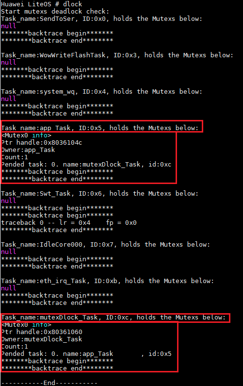

    -   “Task\_name:app\_Task, ID:0x5, holds the Mutexs below：”和“Task\_name:mutexDlock\_Task, ID:0xc, holds the Mutexs below:”这两行后面有mutex信息，表示可能是任务app\_Task（任务ID为5）和mutexDlock\_Task （任务ID为c）发生了死锁。
    -   <Mutex0 info\>：其后几行是该互斥锁的详细信息，包括“Ptr handle”为互斥锁句柄、“Owner”为锁的持有者、“Count”为该锁的引用计数、“Pended task”为阻塞在这把锁上的任务。如果该任务持有多把锁，会逐个打印这些锁的信息（Mutex0\~MutexN）。当前app\_Task和mutexDlock\_Task俩任务分别只持有一把锁。

2.  在Shell中运行task命令显示当前所有正在运行的任务状态和信息。

    输出结果如下图：

    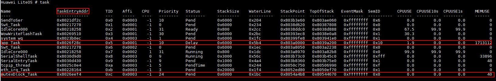根据步骤1，任务app\_Task和mutexDlock\_Task是找到的疑似发生死锁的任务。上图中的TaskEntryAddr列为发生死锁时互斥锁pend的任务入口函数地址，如本例中为任务app\_Task（0x8026f28c）和mutexDlock\_Task（0x8026eef4）。

3.  在反汇编文件中找到相应函数。

    打开反汇编文件 vs\_server.asm（默认在Huawei\_LiteOS/out/<platform\>目录下，其中的platform为具体的平台名），在vs\_server.asm中找到相应的地址，以mutexDlock\_Task（0x8026eef4）为例如下图所示，即可定位到互斥锁pend的位置及调用的接口：

    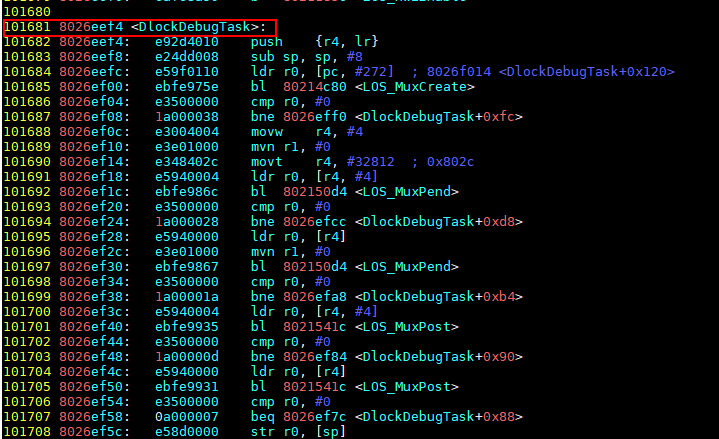

4.  查看单个任务的栈调用信息。

    如果需要进一步确认任务的调用关系，可以在Shell中运行task命令加ID号查看该任务的栈调用信息，最后再根据上下文判断是否存在死锁。


<h3 id="自旋锁调测方法">自旋锁调测方法</h3>

#### 功能说明

多核环境下，多任务系统使用自旋锁达到互斥访问资源的目的。自旋锁的检测模块（lockdep），能够检测以下几种类型的错误（包括使用错误）：

1.  重复上锁。
2.  死锁，以ABBA为例进行说明：

    1.  任务A持有自旋锁X，并永久等待自旋锁Y。
    2.  任务B持有自旋锁Y，并永久等待自旋锁X。

    此时任务A和任务B死锁。

3.  未持锁情况下释放锁。
4.  lockdep记录信息溢出。

#### 使用方法

通过配置项LOSCFG\_KERNEL\_SMP\_LOCKDEP打开自旋锁的检测模块lockdep，开启自旋锁调测功能。

#### 死锁定位实例

1.  打开自旋锁检测后，检测到死锁时会打印死锁信息，死锁检测的打印信息示例如下。

    **图 1**  死锁模块打印信息<a name="f6bb63b55c1874aebb9e4a4a0cdc1f9f7"></a>  
    

    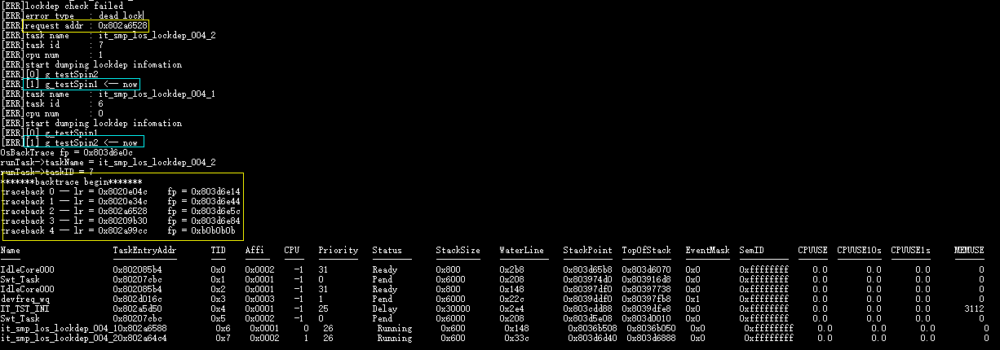

2.  复制request addr的值（本例中为0x802a6528），在系统镜像的反汇编文件vs\_server.asm（默认在Huawei\_LiteOS/out/<platform\>目录下，其中的platform为具体的平台名）中找到相应的地址，如下图所示，即可定位到调用spinlock的位置及调用函数（本例中为task\_fx02）。

    **图 2**  反汇编文件中找到对应地址<a name="fdbc53a06347c4cfb9ba13da71c3bbe31"></a>  
    

    

3.  根据图一死锁打印信息中第二个蓝框的自旋锁，通过代码逻辑找到另一个任务持有该锁的情况，再结合代码，调整spinlock调用的时序，从而解决死锁问题。

#### 建议与总结

自旋锁死锁一般发生在某个CPU卡住、任务不再发生调度时。若不开启自旋锁死锁检查，可以使用JLink等调试工具halt住CPU或者触发看门狗异常，查看PC值是否为自旋锁代码，以此确定是否发生了自旋锁死锁。

<h2 id="临终遗言使用方法">临终遗言使用方法</h2>

### 功能说明

临终遗言日志存储钩子函数，实现日志存储的读写函数的注册，接口详细信息可以查看API参考。

<a name="table65300298141415"></a>
<table><thead align="left"><tr id="row54518477141415"><th class="cellrowborder" valign="top" width="29.080000000000002%" id="mcps1.1.3.1.1"><p id="p5483720141415"><a name="p5483720141415"></a><a name="p5483720141415"></a>接口名</p>
</th>
<th class="cellrowborder" valign="top" width="70.92%" id="mcps1.1.3.1.2"><p id="p41528136141415"><a name="p41528136141415"></a><a name="p41528136141415"></a>描述</p>
</th>
</tr>
</thead>
<tbody><tr id="row8335828141415"><td class="cellrowborder" valign="top" width="29.080000000000002%" headers="mcps1.1.3.1.1 "><p id="p64757555141415"><a name="p64757555141415"></a><a name="p64757555141415"></a>LOS_ExcInfoRegHook</p>
</td>
<td class="cellrowborder" valign="top" width="70.92%" headers="mcps1.1.3.1.2 "><p id="p10870613141415"><a name="p10870613141415"></a><a name="p10870613141415"></a>注册读写临终遗言日志的钩子函数，并设置记录临终遗言日志的起始地址、大小和缓冲区。</p>
</td>
</tr>
</tbody>
</table>

> **说明：** 
>LOS\_ExcInfoRegHook有4个参数：
>-   startAddr：临终遗言日志的存储起始地址。
>-   space：临终遗言日志的存储空间大小。
>-   buf：临终遗言日志在内存中的buffer地址，大小space。
>-   LogReadWriteFunc：读写异常信息的钩子函数。该函数的入参包括startAddr、space、rwFlag和buf。rwFlag是读写标记，0为写，1为读。其余3个入参同LOS\_ExcInfoRegHook。

### 使用方法

1.  通过menuconfig开启临终遗言记录功能，即配置LOSCFG\_SHELL\_EXCINFO\_DUMP=y，该功能默认关闭。
2.  注册读写钩子函数。
    1.  编写读写临终遗言日志的钩子函数，示例代码如下。

        ```c
        #include "los_base.h"
        #if defined(LOSCFG_SHELL_EXCINFO) && defined(LOSCFG_DRIVERS_MTD_SPI_NOR)
        #include "linux/mtd/mtd.h"
        #include "linux/module.h"
        #include "linux/mtd/mtd_list.h"
        #include "spinor.h"
        #endif
        #include "los_hwi.h"
        #ifdef LOSCFG_FS_VFS
        #include "fs/fs.h"
        #endif
        
        #ifdef LOSCFG_SHELL_EXCINFO_DUMP
        STATIC struct mtd_info *g_mtdSpinor = NULL;
        STATIC VOID OsSpiflashErase(UINT32 start, size_t size)
        {
            struct erase_info eraseInfo;
            (VOID)memset_s(&eraseInfo, sizeof(struct erase_info), 0, sizeof(struct erase_info));
            eraseInfo.mtd = g_mtdSpinor;
            eraseInfo.callback = NULL;
            eraseInfo.fail_addr = (UINT64)MTD_FAIL_ADDR_UNKNOWN;
            eraseInfo.addr = start;
            eraseInfo.len = size;
            eraseInfo.time = 1;
            eraseInfo.retries = 1;
            eraseInfo.dev = 0;
            eraseInfo.cell = 0;
            eraseInfo.priv = 0;
            eraseInfo.state = 0;
            eraseInfo.next = NULL;
            eraseInfo.scrub = 0;
            (VOID)g_mtdSpinor->erase(g_mtdSpinor, &eraseInfo);
        }
        STATIC INT32 OsWriteExcInfoToSpiFlash(UINT32 startAddr, UINT32 space, const CHAR *buf)
        {
            UINT32 outLen;
            OsSpiflashErase(startAddr, LOS_Align(space, g_mtdSpinor->erasesize));
            return g_mtdSpinor->write(g_mtdSpinor, (loff_t)startAddr, space, &outLen, buf);
        }
        STATIC INT32 OsReadExcInfoForSpiFlash(UINT32 startAddr, UINT32 space, CHAR *buf)
        {
            UINT32 outLen;
            return g_mtdSpinor->read(g_mtdSpinor, (loff_t)startAddr, space, &outLen, buf);
        }
        
        /* Be called in the exception. */
        VOID OsReadWriteExceptionInfo(UINT32 startAddr, UINT32 space, UINT32 flag, CHAR *buf)
        {
            if ((buf == NULL) || (space == 0)) {
                PRINT_ERR("buffer is null or space is zero\n");
                return;
            }
        
            g_mtdSpinor = get_mtd("spinor");
            if (g_mtdSpinor == NULL) {
                (VOID)spinor_init();
                g_mtdSpinor = get_mtd("spinor");
                if (g_mtdSpinor == NULL) {
                    PRINT_ERR("Init spinor is failed\n");
                    return;
                }
            }
        
            if (flag == 0) {
                if (OsWriteExcInfoToSpiFlash(startAddr, space, buf) != LOS_OK) {
                    PRINT_ERR("Exception information written to 0x%x flash failed\n", startAddr);
                }
        #ifndef LOSCFG_EXC_INTERACTION
                /*
                 * When system is in the exception interaction, this buf was free,
                 * but this feature is still running. This buffer may be used again
                 * without malloc.
                 * So, consider whether or not the "buf" is released according to actual use.
                 */
                free(buf);
        #endif
            } elseif (flag == 1) {
                if (OsReadExcInfoForSpiFlash(startAddr, space, buf) != LOS_OK) {
                    PRINT_ERR("Exception information read from 0x%x flash failed\n", startAddr);
                }
            } else {
                PRINT_ERR("flag is error\n");
            }
        }
        #endif
        #endif
        ```

    2.  在初始化函数如app\_init中注册钩子函数，示例代码如下。

        ```c
        #ifdef LOSCFG_SHELL_EXCINFO_DUMP
        #define EXCINFO_RECORD_BUF_SIZE     (16 * 1024)   /* 用户自己定义 */
        #define EXCINFO_RECORD_ADDR         (0xffffffff)  /* 此处是非法值，需要用户自己定义 */
            CHAR *buf = (CHAR *)malloc(EXCINFO_RECORD_BUF_SIZE);
            if (buf != NULL) {
                (VOID)memset_s(buf, EXCINFO_RECORD_BUF_SIZE, 0, EXCINFO_RECORD_BUF_SIZE);
                LOS_ExcInfoRegHook(EXCINFO_RECORD_ADDR, EXCINFO_RECORD_BUF_SIZE, buf, OsReadWriteExceptionInfo);
            } else {
                PRINTK("shell excinfo malloc failed!\n");
            }
        #ifdef LOSCFG_FS_VFS
            los_vfs_init();
        #endif
        #endif
        ```

        > **须知：** 
        >-   OsReadWriteExceptionInfo函数是对Nor Flash进行读写的功能函数，宏EXCINFO\_RECORD\_BUF\_SIZE，EXCINFO\_RECORD\_ADDR需要用户根据实际情况进行配置，建议该段代码放在用户业务代码前。
        >-   Nor Flash写数据之前要进行块擦除，块大小为64k，因此设置的临终遗言存储起始地址之后的64k区域，在写临终遗言信息时会被擦除，建议此区域不保存数据。


3.  查看异常信息。

    系统复位重启后，Shell窗口中执行excInfo命令，会打印出已记录的临终遗言日志。


### 注意事项

保存临终遗言信息的buffer需要用户进行维护，重复调用注册函数时，需要用户自行释放前一次注册时传入的buffer。

<h2 id="魔法键使用方法">魔法键使用方法</h2>

### 使用场景

系统未输出挂死相关信息，但是无响应时，可以通过魔法键查看中断是否有响应。在中断有响应的情况下，可以通过魔法键查看task信息中 的CPUP（CPU占用率），找到是哪个任务长时间占用CPU导致系统其他任务无响应（一般为比较高优先级任务一直抢占CPU，导致低优先级任务无响应）。

### 功能说明

在uart中断和usb转虚拟串口中断中，嵌入魔法键检查功能，对特殊按键进行识别，输出相关信息。

### 使用方法

1.  通过menuconfig开启魔法键功能，即配置LOSCFG\_ENABLE\_MAGICKEY=y。若关闭该选项，则魔法键失效。

    > **说明：** 
    >可以在menuconfig中光标移动到该选项上，输入“？”，查看帮助信息：
    >```
    >Answer Y to enable LiteOS Magic key.
    >  ctrl + r : Magic key check switch;
    >  ctrl + z : Show all magic op key;
    >  ctrl + t : Show task information;
    >  ctrl + p : System panic;
    >  ctrl + e : Check system memory pool.
    >```

2.  输入“ctrl + r ” 键，打开或者关闭魔法键检测功能。

    在连接uart或者usb转虚拟串口的情况下，输入“ctrl + r ” 键，打开魔法键检测功能，输出 “Magic key on”；再输入一次后，则关闭魔法键检测功能，输出“Magic key off”。魔法键功能如下：

    -   ctrl + z：帮助键，输出相关魔法键简单介绍。
    -   ctrl + t：输出任务相关信息。
    -   ctrl + p：系统主动进入panic，输出panic相关信息后，系统会挂住。
    -   ctrl + e：系统进行简单的内存池完整性检查，检查发现错误则输出相关错误信息，检查正常则输出“system memcheck over, all passed!”。


### 注意事项

魔法键检测功能打开情况下，如果需要通过uart或者usb转虚拟串口输入特殊字符需避免与魔法键值重复，否则魔法键会被误触发，而原有设计功能可能出现错误。

<h2 id="调试案例">调试案例</h2>

<h3 id="踩内存定位方法">踩内存定位方法</h3>

-   通过异常信息定位问题，参见<a href="https://gitee.com/LiteOS/LiteOS/blob/master/doc/Huawei_LiteOS_Kernel_Developer_Guide_zh.md#问题定位实例" target="_blank">异常接管定位实例</a>。
-   通过内存备份机制定位问题，参见[内存备份机制](#内存备份机制)。 
-   通过内存合法性检查定位问题，参见[内存合法性检查](#内存合法性检查)。
-   通过内存size检查定位问题，参见[内存size检查](#内存size检查)。
-   **[全局变量踩内存定位方法](#全局变量踩内存定位方法)**
-   **[task状态判断是否踩内存](#task状态判断是否踩内存)**


<h4 id="全局变量踩内存定位方法">全局变量踩内存定位方法</h4>

调试过程中，发现一个全局变量只在一处赋值为0，但使用时打印发现变成一个非零异常值，大概率是该全局变量被踩。

如果已知一个全局变量被踩内存，可在Huawei\_LiteOS/out/<platform\>/vs\_server.map文件中找到该全局变量所在的地址。注意该地址前面最近被使用的变量，排查是否前面变量操作不当引发踩内存，比如对该前面变量进行memcpy，memset操作时越界，溢出覆盖了当前全局变量。

这里列举一个测试的例子，在文件中定义了两全局变量，并且初始化。

```c
UINT32 g_uwEraseMap[16] = {0};
UINT32 g_uwEraseCount = 0;
```

在vs\_server.map中可以找到这些全局变量在bss段对应的位置。


若g\_uwEraseMap被踩，在vs\_server.map中找到其地址，再查找该地址前面的变量，即g\_uwEraseCount。特别注意分析g\_uwEraseCount变量的使用情况，观察是否存在某处，对变量g\_uwEraseCount进行了越界操作。

<h4 id="task状态判断是否踩内存">task状态判断是否踩内存</h4>

Shell命令<a href="https://gitee.com/LiteOS/LiteOS/blob/master/shell/README_CN.md#task" target="_blank">task</a>“”，可以查看当前系统所有任务的状态。命令输出的stackSize、WaterLine、StackPoint、Top0fStack信息，可以作为判断任务栈是否踩内存的指标。

这里举例说明如何通过task命令判断是否踩内存，如下图所示，有一任务名为shellTask。

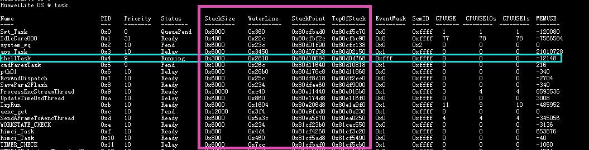

StackSize = 0x3000（创建该任务时分配的栈大小）

WaterLine = 0x2810（水线，目前为止该任务栈已经被使用的内存大小）

StackPoint = 0x80d10084 （任务栈指针， 指向该任务当前的地址）

Top0fStack = 0x80d0d768（栈顶）

MaxStackPoint = Top0fStack + StackSize = 0x80d10768（得到该任务栈最大的可访问地址）

-   若WaterLine \> StackSize，则说明该任务踩内存。
-   若StackPoint \> MaxStackPoint 或 StackPoint < Top0fStack，则说明该任务踩内存。

