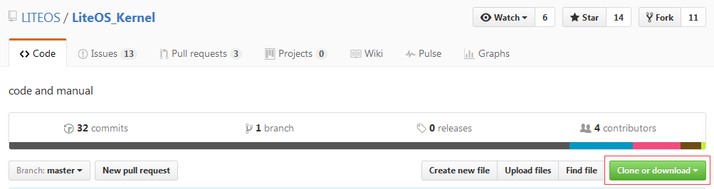
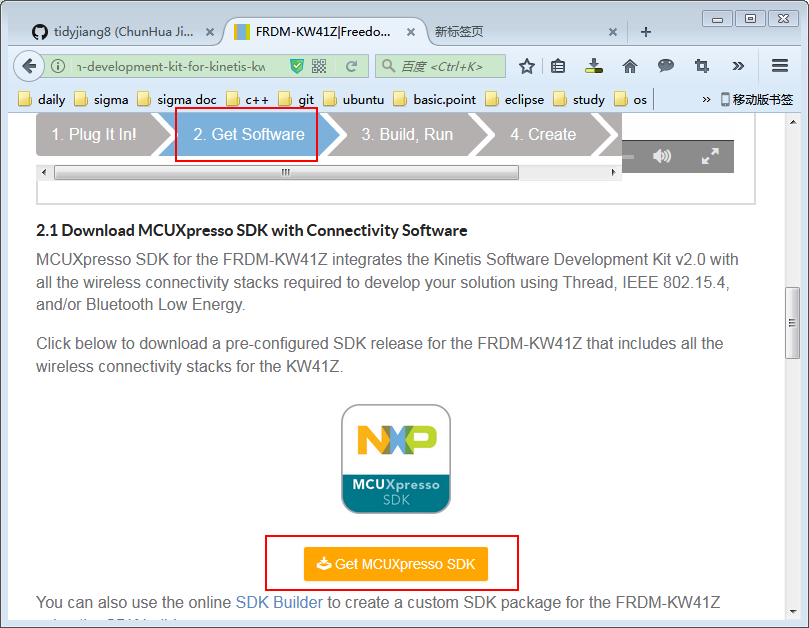
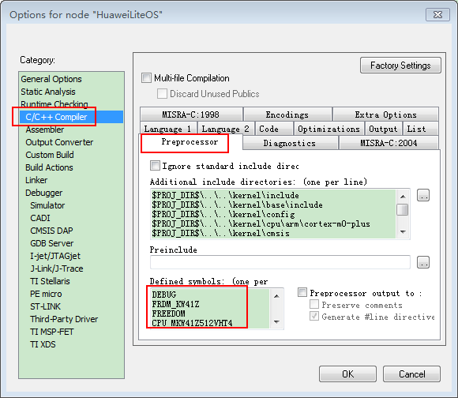
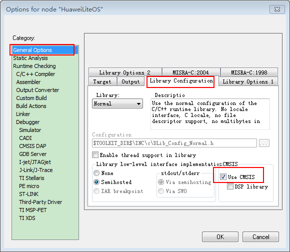
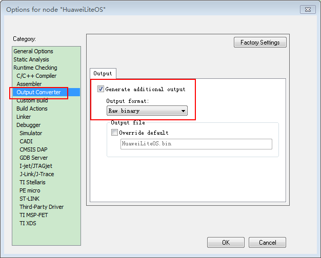
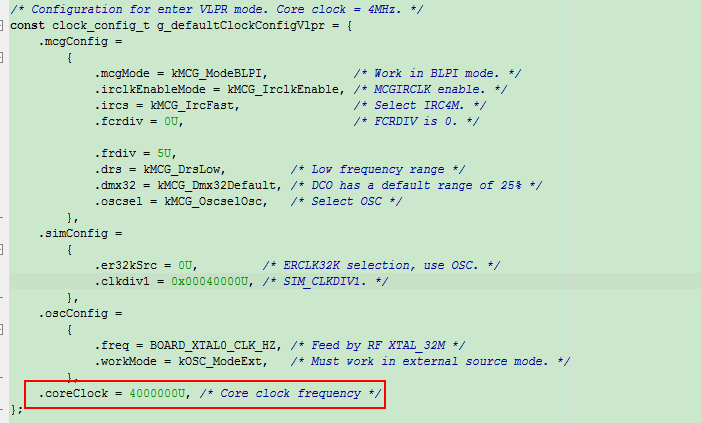
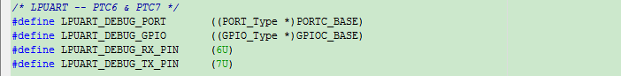
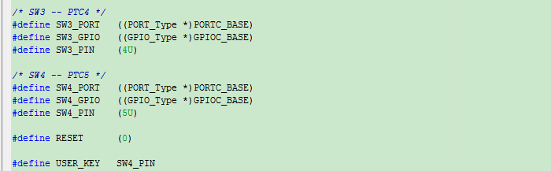
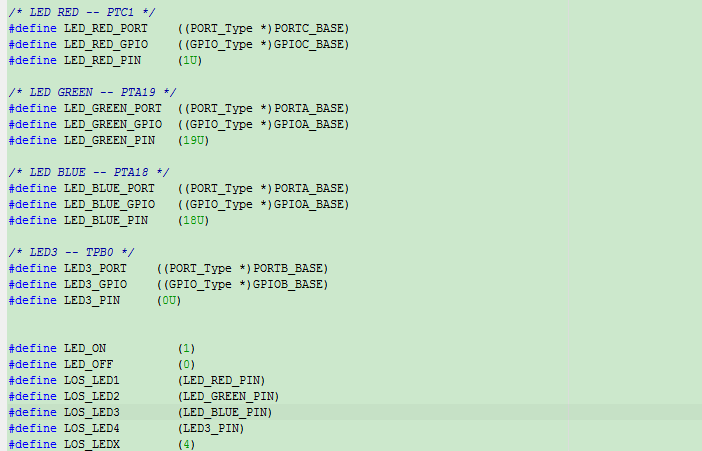

## 1关于本文档的开源协议说明
**您可以自由地：**

**分享** 

- 在任何媒介以任何形式复制、发行本文档

**演绎** 

- 修改、转换或以本文档为基础进行创作。只要你遵守许可协议条款，许可人就无法收回你的这些权利。

**惟须遵守下列条件：**

**署名** 

- 您必须提供适当的证书，提供一个链接到许可证，并指示是否作出更改。您可以以任何合理的方式这样做，但不是以任何方式表明，许可方赞同您或您的使用。

**非商业性使用** 

- 您不得将本作品用于商业目的。

**相同方式共享** 

- 如果您的修改、转换，或以本文档为基础进行创作，仅得依本素材的
授权条款来散布您的贡献作品。

**没有附加限制** 

- 您不能增设法律条款或科技措施，来限制别人依授权条款本已许可的作为。

**声明：**

-  当您使用本素材中属于公众领域的元素，或当法律有例外或限制条款允许您的使用，
则您不需要遵守本授权条款。
未提供保证。本授权条款未必能完全提供您预期用途所需要的所有许可。例如：形象
权、隐私权、著作人格权等其他权利，可能限制您如何使用本素材。

**注意**

- 为了方便用户理解，这是协议的概述. 可以访问网址 https://creativecommons.org/licenses/by-sa/3.0/legalcode 了解完整协议内容.

## 2前言
### 目的

本文档介如何移植Huawei LiteOS到第三方开发板，并成功运行基础示例。

### 读者对象

本文档主要适用于Huawei LiteOS Kernel的开发者。
本文档主要适用于以下对象：

- 物联网端软件开发工程师

- 物联网架构设计师

### 符号约定
在本文中可能出现下列标志，它们所代表的含义如下。

     用于警示紧急的危险情形，若不避免，将会导致人员死亡或严重的人身伤害

    用于警示潜在的危险情形，若不避免，可能会导致人员死亡或严重的人身伤害

    用于警示潜在的危险情形，若不避免，可能会导致中度或轻微的人身伤害

     用于传递设备或环境安全警示信息，若不避免，可能会导致设备损坏、数据丢失、设备性能降低或其它不可预知的结果“注意”不涉及人身伤害

| 说明	|		“说明”不是安全警示信息，不涉及人身、设备及环境伤害信息	|				


### 修订记录
修改记录累积了每次文档更新的说明。最新版本的文档包含以前所有文档版本的更新
内容。

<table>
	<tr>
	<td>日期</td>
	<td>修订版本</td>
	<td>描述</td>
	</tr>
	<tr>
	<td>2017年04月22日</td>
	<td>1.0</td>
	<td>完成初稿</td>
	</tr>
</table>

## 3概述

目前在github上已开源的Huawei LiteOS内核源码已适配好STM32F412、STM32F429、STM32L476、GD32F450、GD32F190等M3/M4内核芯片，本手册将以NXP的FRDM-KW41Z的开发板为例，介绍基于ARM Cortex M0+内核芯片 Kinetis® KW41Z 的移植过程。

## 4环境准备
基于Huawei LiteOS Kernel开发前，我们首先需要准备好单板运行的环境，包括软件环
境和硬件环境。
硬件环境：
<table>
	<tr>
	<td>所需硬件</td>
	<td>描述</td>
	</tr>
	<tr>
	<td>FRDM-KW41Z开发板</td>
	<td>基于Cortex M0+芯片Kinetis® KW41Z的开发板 </td>
	</tr>
	<tr>
	<td>PC机</td>
	<td>用于编译、加载并调试镜像</td>
	</tr>
	<tr>
	<td>电源</td>
	<td>开发板供电(使用Mini USB连接线)</td>
	</tr>
</table>


软件环境：
<table>
	<tr>
	<td>软件</td>
	<td>描述</td>
	</tr>
	<tr>
	<td>Window 7 操作系</td>
	<td>安装IAR和相关调试驱动的操作系统</td>
	</tr>
	<tr>
	<td>IAR(8.0以上版本)</td>
	<td>用于编译、链接、调试程序代码</td>
	</tr>
	<tr>
	<td>Link驱动</td>
	<td>开发板与pc连接的驱动程序，用户加载及调试程序代码</td>
	</tr>
</table>

**说明**

IAR工具需要开发者自行购买，Link驱动程序需根据具体使用的开发板芯片来确定，开发板配套的资料中会提供，或者在使用的芯片官网下载。//tidyjiang

## 5获取Huawei LiteOS 源码

首先下载Huawei LiteOS开发包，步骤如下：

- 仓库地址：https://github.com/LITEOS/LiteOS_Kernel.git 


- 点击”clone or download”按钮,下载源代码


- 目录结构如下：


关于代码树中各个目录存放的源代码的相关内容简介如下：

<table>
<tr>
	<td>一级目录</td>
	<td>二级目录</td>
	<td>说明</td>
</tr>
<tr>
	<td>doc</td>
	<td></td>
	<td>此目录存放的是LiteOS的使用文档和API说明文档</td>
</tr>
<tr>
	<td>example</td>
	<td>api</td>
	<td>此目录存放的是内核功能测试用的相关用例的代码</td>
</tr>
<tr>
	<td></td>
	<td>include</td>
	<td>aip功能头文件存放目录</td>
</tr>
<tr>
	<td>kernel</td>
	<td>base</td>
	<td>此目录存放的是与平台无关的内核代码，包含核心提供给外部调用的接口的头文件以及内核中进程调度、进程通信、内存管理等等功能的核心代码。用户一般不需要修改此目录下的相关内容。</td>
</tr>
<tr>
	<td></td>
	<td>cmsis</td>
	<td>LiteOS提供的cmsis接口</td>
</tr>
<tr>
	<td></td>
	<td>config</td>
	<td>此目录下是内核资源配置相关的代码，在头文件中配置了LiteOS所提供的各种资源所占用的内存池的总大小以及各种资源的数量，例如task的最大个数、信号量的最大个数等等</td>
</tr>
<tr>
	<td></td>
	<td>cpu</td>
	<td>此目录以及以下目录存放的是与体系架构紧密相关的适配LiteOS的代码。比如目前我们适配了arm/cortex-m4及arm/cortex-m3系列对应的初始化内容。</td>
</tr>
<tr>
	<td></td>
	<td>include</td>
	<td>内核的相关头文件存放目录</td>
</tr>
<tr>
	<td></td>
	<td>link</td>
	<td>与IDE相关的编译链接相关宏定义</td>
</tr>
<tr>
	<td>platform</td>
	<td>GD32F190R-EVAL</td>
	<td>GD190开发板systick以及led、uart、key驱动bsp适配代码</td>
</tr>
<tr>
	<td></td>
	<td>GD32F450i-EVAL</td>
	<td>GD450开发板systick以及led、uart、key驱动bsp适配代码</td>
</tr>
<tr>
	<td></td>
	<td>STM32F412ZG-NUCLEO</td>
	<td>STM32F412开发板systick以及led、uart、key驱动bsp适配代码</td>
</tr>
<tr>
	<td></td>
	<td>STM32F429I_DISCO</td>
	<td>STM32F429开发板systick以及led、uart、key驱动bsp适配代码</td>
</tr>
<tr>
	<td></td>
	<td>STM32L476RG_NUCLEO</td>
	<td>STM32L476开发板systick以及led、uart、key驱动bsp适配代码</td>
</tr>
<tr>
	<td></td>
	<td>LOS_EXPAND_XXX</td>
	<td>用于新扩展的开发板systick以及led、uart、key驱动bsp适配代码</td>
</tr>
<tr>
	<td>projects</td>
	<td>STM32F412ZG-NUCLEO-KEIL</td>
	<td>stm32f412开发板的keil工程目录</td>
</tr>
<tr>
	<td></td>
	<td>STM32F429I_DISCO_IAR</td>
	<td>stm32f429开发板的iar工程目录</td>
</tr>
<tr>
	<td></td>
	<td>STM32F429I_DISCO_KEIL</td>
	<td>stm32f429开发板的keil工程目录</td>
</tr>
<tr>
	<td></td>
	<td>STM32L476R-NUCLEO-KEIL</td>
	<td>stm32l476开发板的keil工程目录</td>
</tr>
<tr>
	<td></td>
	<td>GD32F190R-EVAL-KEIL</td>
	<td>gd32f190开发板的keil工程目录</td>
</tr>
<tr>
	<td></td>
	<td>GD32F450i-EVAL-KEIL</td>
	<td>gd32f450开发板的keil工程目录</td>
</tr>
<tr>
	<td>user</td>
	<td></td>
	<td>此目录存放用户测试代码，LiteOS的初始化和使用示例在main.c文件中</td>
</tr>
</table>

获取Huawei LiteOS源代码之后，我们就可以开始创建自己的project开发工程了，详细内容请参考后续各章节。


## 6创建Huawei LiteOS 工程

### 6.1 获取 SDK

FRDM-KW41Z的SDK又叫做连接软件，它提供了MKW41Z系列芯片的驱动程序和协议栈，我们主要借助它里面提供的驱动程序来适配LiteOS内核。进入FRDM-KW41Z的[官网](http://www.nxp.com/cn/products/microcontrollers-and-processors/%E5%85%B6%E4%BB%96%E5%A4%84%E7%90%86%E5%99%A8/application-specific-mcus-mpus/bluetooth-low-energy-ble/nxp-freedom-development-kit-for-kinetis-kw41z-31z-21z-mcus:FRDM-KW41Z?&tab=In-Depth_Tab&tid=van/frdm-kw41z/startnow)进行下载。下载下来后可以看到它是一个以.exe为后缀的可执行文件，我们直接像安装普通软件一样安装它。默认的安装路径是`C:\NXP\MKW41Z_ConnSw_1.0.2\`（注：今后的版本号可能会变更）。



<center>图 - 下载连接软件</center>


安装完成后，先浏览安装文件夹下的内容，了解该文件夹中各个子目录的作用，确定我们需要用到哪些内容。主要用到的文件夹包括：
```
├── boards
│   ├── frdmkw41z // 开发板相关的代码，下面包含很多示例程序
│   │   ├── demo_apps
│   │   │   ├── hello_world // hello_world 示例程序
├── CMSIS   // 略
├── devices
│   └── MKW41Z4 // 芯片相关文件，包括分散加载文件/驱动文件/启动文件/以及一些关于芯片的定义
│       ├── drivers
│       │   ├── fsl_adc16.c
│       │   ├── fsl_adc16.h
│       │   ├── fsl_clock.c
│       │   ├── ...
│       ├── fsl_device_registers.h
│       ├── iar
│       │   ├── MKW41Z512xxx4_flash.icf
│       │   ├── MKW41Z512xxx4_ram.icf
│       │   └── startup_MKW41Z4.s
│       ├── MKW41Z4_features.h
│       ├── MKW41Z4.h
│       ├── system_MKW41Z4.c
│       ├── system_MKW41Z4.h
│       └── utilities
│           ├── fsl_debug_console.c
│           ├── fsl_debug_console.h
│           ├── fsl_notifier.c
│           ├── fsl_notifier.h
│           └── fsl_sbrk.c
├── docs // 略
├── rtos // 略
...

```

基本了解完整个目录架构后，用 IAR 打开 hello_world 示例代码(`C:\NXP\MKW41Z_ConnSw_1.0.2\boards\frdmkw41z\hello_world\iar\`)，再详细查看该工程中所使用到的文件。

### 6.2 创建工程&添加代码&配置属性

按照[LiteOS_Migration_Guide_IAR.md
](https://github.com/LITEOS/LiteOS_Kernel/blob/master/doc/LiteOS_Migration_Guide_IAR.md)所述方法创建好IAR的基本工程，并添加好源码。

**说明**：

* 添加工程代码前，将前面所述的相关代码拷贝至LiteOS源码的`platform/frdm-kw41z/`目录下作为库目录。

* 配置工程属性时，在C/C++ Compiler->PreProcessor->Defined symbols 下面添加如下宏定义：
```
DEBUG
CPU_MKW41Z512VHT4
PRINTF_FLOAT_ENABLE=0
SCANF_FLOAT_ENABLE=0
PRINTF_ADVANCED_ENABLE=0
SCANF_ADVANCED_ENABLE=0
FRDM_KW41Z
FREEDOM
_RTE_
```
这些宏定义是从 hello_world 工程中拷贝过来的，如果不添加这些宏定义，则会在编译时报错。



<center>图 - 添加宏定义</center>

* 配置工程属性时，勾选上 General Options->Library Configuration->Use CMSIS。我在拷贝库文件的时候没有拷贝 CMSIS 文件夹，所以需要勾选上。如果你将 CMSIS 目录拷贝到工程中了，则不需要勾选此选项。



<center>图 - CMSIS</center>

* 配置工程时，勾选上 Output Converter->Output->generate additonal ooutput，并在 Output format 下拉栏中选择 Raw binary，这样可以直接产生 .bin 镜像。



<center>图 - 生成.bin</center>

## 7适配驱动代码

### 适配 bsp_adapter

将 los_bsp_adapter.c 中的变量 sys_clk_freq 设置为系统的时钟频率 40000000。


<center>图 - 修改clock</center>

系统的时钟频率是在 clock_clock.c 文件中设置的。



<center>图 - 设置clock</center>

### 适配 bsp_uart

先在 los_bsp_uart.h 中定义一些与 uart 相关的宏，在适配 uart 的代码时会用到。这里只定义了与lpurat相关的 port、gpio和pin相关的宏。



<center>图 - 定义uart宏</center>

然后依次适配 uart 的初始化函数，读写数据的函数。具体代码请参考工程中的源文件。

### 适配 bsp_key

根据 frdm-kw41z 板载的按键资源，在los_bsp_key.h中定义一些与key相关的宏，在适配key的代码时会用到。这里定义了SW3/SW4两个开关相关的port、gpio和pin相关的宏。



<center>图 - 定义key宏</center>

然后依次适配key的初始化函数，读取key引脚的函数。具体代码请参考工程中的源文件。

### 适配 bsp_led

根据 frdm-kw41z 板载的LED资源，在los_bsp_led.h中定义一些与led相关的宏，在适配led的代码时会用到。这里定义了三色红、绿、蓝LED灯以及led3相关的port、gpio和pin相关的宏。



<center>图 - 定义led宏</center>

然后依次适配led的初始化函数，控制led的函数。具体代码请参考工程中的源文件。

## 8其它

* frdm-kw41z的内核是cortex-m0+，不支持非对齐访问，移植过程中遇到访问内存不对其而出错的问题，详见[liteos porting issue 2](https://github.com/LITEOS/PortingContest/issues/2)。

* 移植过程中，在测试按键时，发现只要按下一次，程序就会检测到gpio一直为0（即key一直被按下），后来发现gpio的上拉寄存器默认没有使能，配置其使能后就正常了。
