## 1关于本文档的开源协议说明
**您可以自由地：**

**分享** 

- 在任何媒介以任何形式复制、发行本文档

**演绎** 

- 修改、转换或以本文档为基础进行创作。只要你遵守许可协议条款，许可人就无法收回你的这些权利。

**惟须遵守下列条件：**

**署名** 

- 您必须提供适当的证书，提供一个链接到许可证，并指示是否作出更改。您可以以任何合理的方式这样做，但不是以任何方式表明，许可方赞同您或您的使用。

**非商业性使用** 

- 您不得将本作品用于商业目的。

**相同方式共享** 

- 如果您的修改、转换，或以本文档为基础进行创作，仅得依本素材的
授权条款来散布您的贡献作品。

**没有附加限制** 

- 您不能增设法律条款或科技措施，来限制别人依授权条款本已许可的作为。

**声明：**

-  当您使用本素材中属于公众领域的元素，或当法律有例外或限制条款允许您的使用，
则您不需要遵守本授权条款。

- 未提供保证。本授权条款未必能完全提供您预期用途所需要的所有许可。例如：形象
权、隐私权、著作人格权等其他权利，可能限制您如何使用本素材。

**注意**

- 为了方便用户理解，这是协议的概述. 可以访问网址 https://creativecommons.org/licenses/by-sa/3.0/legalcode 了解完整协议内容.

## 2前言
### 目的
本文档介绍基于Huawei LiteOS如何移植到第三方开发板，并成功运行基础示例。
### 读者对象
本文档主要适用于Huawei LiteOS Kernel的开发者。
本文档主要适用于以下对象：

- 物联网端软件开发工程师

- 物联网架构设计师

### 符号约定
在本文中可能出现下列标志，它们所代表的含义如下。

     用于警示紧急的危险情形，若不避免，将会导致人员死亡或严重的人身伤害

    用于警示潜在的危险情形，若不避免，可能会导致人员死亡或严重的人身伤害

    用于警示潜在的危险情形，若不避免，可能会导致中度或轻微的人身伤害

     用于传递设备或环境安全警示信息，若不避免，可能会导致设备损坏、数据丢失、设备性能降低或其它不可预知的结果“注意”不涉及人身伤害

| 说明	|		“说明”不是安全警示信息，不涉及人身、设备及环境伤害信息	|

### 修订记录
修改记录累积了每次文档更新的说明。最新版本的文档包含以前所有文档版本的更新
内容。

<table>
	<tr>
	<td>日期</td>
	<td>修订版本</td>
	<td>描述</td>
	</tr>
	<tr>
	<td>2017年1月17日</td>
	<td>1.0</td>
	<td>完成初稿</td>
	</tr>
</table>

## 3概述

目前在github上已开源的Huawei LiteOS内核源码已适配好STM32F411、STM32F429、GD32F450I、GD32F190R8芯片，本手册将
以GD32F190R8芯片为例，介绍基于Cortex M3核芯片的移植过程。

## 4环境准备
基于Huawei LiteOS Kernel开发前，我们首先需要准备好单板运行的环境，包括软件环
境和硬件环境。
硬件环境：

<table>
	<tr>
	<td>所需硬件</td>
	<td>描述</td>
	</tr>
	<tr>
	<td>GD32F190R-EVAL单板</td>
	<td>GD32开发板(芯片型号GD32F190R8T6)</td>
	</tr>
	<tr>
	<td>PC机</td>
	<td>用于编译、加载并调试镜像</td>
	</tr>
	<tr>
	<td>电源（5v）</td>
	<td>开发板供电(使用Mini USB连接线)</td>
	</tr>
</table>

软件环境：

<table>
	<tr>
	<td>软件</td>
	<td>描述</td>
	</tr>
	<tr>
	<td>Window 7 操作系</td>
	<td>安装Keil的操作系统</td>
	</tr>
	<tr>
	<td>Keil(5.18以上版本)</td>
	<td>用于编译、链接、调试程序代码
	uVision V5.18.0.0 </td>
	</tr>
</table>

**说明**

Keil工具需要开发者自行购买，GD32F190R-EVAL开发板的调试器是gd-link，在开发板上已经有了gd-link的芯片，并且不用安装驱动。

## 5获取Huawei LiteOS 源码

首先我们需要通过网络下载获取Huawei LiteOS开发包。目前Huawei LiteOS的代码已经
开源，可以直接从网络上获取，步骤如下：

- 仓库地址是https://github.com/LITEOS/LiteOS_Kernel.git 

- 点击”clone or download”按钮,下载源代码

- 目录结构如下：Huawei LiteOS的源代码目录的各子目录包含的内容如下：

关于代码树中各个目录存放的源代码的相关内容简介如下：

<table>
<tr>
	<td>一级目录</td>
	<td>二级目录</td>
	<td>说明</td>
</tr>
<tr>
	<td>kernel</td>
	<td>base</td>
	<td>此目录存放的是与平台无关的内核代码，包含核心提供给外部调用的接口的头文件以及内核中进程调度、进程通信、内存管理等等功能的核心代码。用户一般不需要修改此目录下的相关内容。</td>
</tr>
<tr>
	<td></td>
	<td>include</td>
	<td>内核的相关头文件存放目录</td>
</tr>
<tr>
	<td></td>
	<td>cmsis</td>
	<td>LiteOS提供的cmsis接口</td>
</tr>
<tr>
	<td>platform</td>
	<td>bsp</td>
	<td>目录下则是内核入口相关示例代码。用户自己实现的相关应用程序源代码都可以放到此文件夹下的子目录或者拷贝sample目录更名为其他名称再添加新的源代码。(注：总入口函数是main函数)</td>
</tr>
<tr>
	<td></td>
	<td>cpu</td>
	<td>该目录以及以下目录存放的是与体系架构紧密相关的硬件初始化的代码。此目录最好按照芯片的体系结构以及芯片型号进行命名方便区分。比如目前我们实现了arm/cortex-m4这个芯片对应的硬件初始化内容。用户最好按照这样的划分进行新的芯片型号的添加</td>
</tr>
<tr>
	<td>example</td>
	<td>api</td>
	<td>此目录存放的是内核功能测试用的相关用例的代码</td>
</tr>
<tr>
	<td></td>
	<td>include</td>
	<td>内核功能测试的用例相关头文件</td>
</tr>
<tr>
	<td>projects</td>
	<td>stm32f411_iar</td>
	<td>stm32f411开发板的iar工程目录</td>
</tr>
<tr>
	<td></td>
	<td>stm32f429_iar</td>
	<td>stm32f429开发板的iar工程目录</td>
</tr>
<tr>
	<td></td>
	<td>stm32f429_keil</td>
	<td>stm32f429开发板的keil工程目录</td>
</tr>
<tr>
	<td></td>
	<td>gd32f190_keil</td>
	<td>gd32f190R8开发板的keil工程目录</td>
</tr>
<tr>
	<td></td>
	<td>gd32f450_keil</td>
	<td>gd32f450I开发板的keil工程目录</td>
</tr>
<tr>
	<td>doc</td>
	<td></td>
	<td>此目录存放的是LiteOS的使用文档和API说明文档</td>
</tr>
</table>

获取Huawei LiteOS源代码之后，我们就可以创建project然后编译调试我们的程序了，
详细可以参考后续的各个章节。详细的编程应用编程API请参考《HuaweiLiteOSKernelDevGuide》

### kernel API测试代码

如果需要测试LiteOS是否正常运行，可以将example\api添加到工程目录中。

### 测试代码使用

测试代码入口是main.c中的LOS_Demo_Entry()这个接口，使用方法los_config.c的main中调用

示例如下：

	extern void LOS_Demo_Entry(void)；
	int main(void)
	{
		UINT32 uwRet;
		uwRet = osMain();
		if (uwRet != LOS_OK) {
			return LOS_NOK;
		}
		LOS_Demo_Entry()；
		LOS_Start();

		for (;;);
		/* Replace the dots (...) with your own code.  */
	}

**如何选择测试的功能：**

在example\include\los_demo_entry.h 打开要测试的功能的宏开关

- LOS_KERNEL_TEST_xxx，比如测试task调度打开 LOS_KERNEL_TEST_TASK 即可（//#define LOS_KERNEL_TEST_TASK 修改为 #define LOS_KERNEL_TEST_TASK）

- 如果需要printf，则将los_demo_debug.h中的LOS_KERNEL_DEBUG_OUTLOS_KERNEL_TEST_KEIL_SWSIMU打开。如果是在IAR工程中则不需要打开LOS_KERNEL_TEST_KEIL_SWSIMU

- 中断测试无法在软件仿真的情况下测试。

**在keil中需要使用printf打印可以有几种方法**

- 将printf重定位到uart输出，这个需要uart驱动支持，如果只有liteOS而没有相关驱动加入工程则不建议使用该方法。
- 使用软件仿真的方式在keil IDE的debug printf view中查看。

**关于中断向量位置选择**

- 在los_bsp_adapter.c中，g_use_ram_vect变量控制了LiteOS中是否使用vector向量表（中断向量表）重定向功能。如果g_use_ram_vect设置为 1 ，则需要在配置分散加载文件，如果配置为0，则不配置分散加载文件（即在上面的配置步骤中可以不进行分散加载文件配置），系统启动后默认中断向量表在Rom的0x00000000地址。
- 在GD32F190R8这个芯片上面，由于只有8K的RAM，所以不使用LiteOS本身的中断机制，也不用配置分散加载文件。

**关于工程创建**

目前在LiteOS的源代码中已经存在了一些已经创建好的工程，用户可以直接使用，它们都在projects目录下。建议用户使用projects下已经建立好的工程作为LiteOS运行是否正常的参考工程使用。

**如何使用LiteOS 开发**

LiteOS中提供的功能包括如下内容： 任务创建与删除、任务同步（信号量、互斥锁）、动态中断注册机制 等等内容，更详细的内容可以参考“HuaweiLiteOSKernelDevGuide”中描述的相关内容。

## 6如何移植LiteOS到已有工程
本章节将讲述如何在已有平台基础上使用LiteOS提供的功能，以GD32F190R开发包的LED测试程序为例讲述如何使用LiteOS。

### GD32的开发资料获取
- 从http://gd32mcu.21ic.com/下载相关的开发包
- 从购买的开发板的光盘中获取相关资料。

注意：光盘上的内容可能比网络上的更全面一些，建议使用光盘上面的内容。

### GD32的开发工具安装
- 安装keil 5.14或者以上版本
- 安装Keil.GD32F1x0_DFP.2.0.0.pack或者更高版本的1x0系列的pack文件
- 安装MDK-ARM_AddOn_GD32F1x0-V3.0.0。这个插件的安装目录需要选择C:\Keil_v5

**创建GD32F190R的Keil 5工程**

由于GD32F190R的原始工程是在Keil 4中创建的，在使用Keil 5工具打开的时候可能无法正常工作。如果无法正常工作，请使用Keil 5重新添加代码到空工程中。

- 将LiteOS Kernel的代码放到GD32190R-EVAL Files目录下

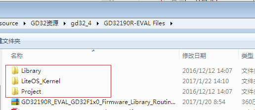

- 使用Keil 5创建空工程。

下图显示的是创建之后的芯片型号等内容

- 添加LED测试代码到工程目录，下面是添加完成后的内容

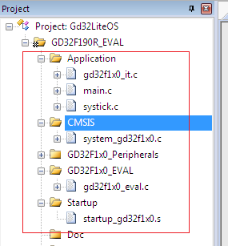
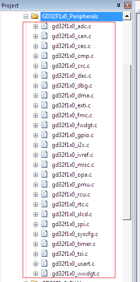

- 将LiteOS的代码添加到已有工程中如下图所示：

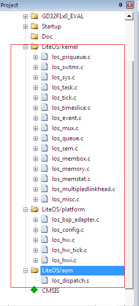

- 增加liteos以及原始工程需要的头文件路径。

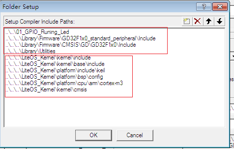

- 编译C/C++设置中需要勾选C99选项，否则编译会报错。

添加宏定义 USE_STDPERIPH_DRIVER,GD32F170_190,RAM_SIZE_LEVEL_0,GD32F190R8

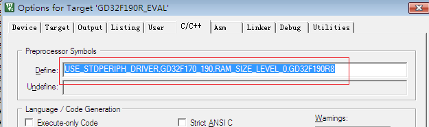

勾选C99选项

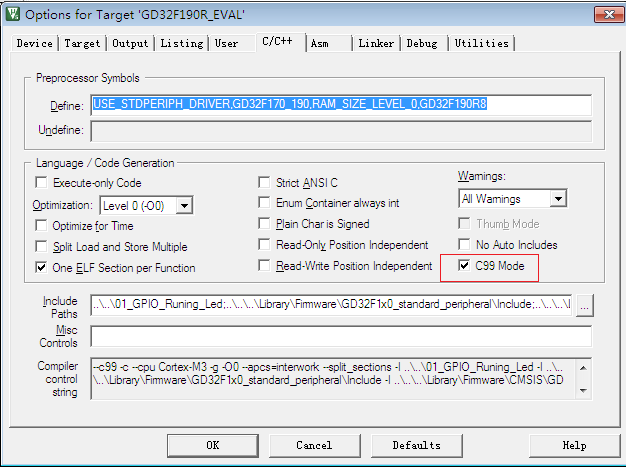

- 设置Debug选项

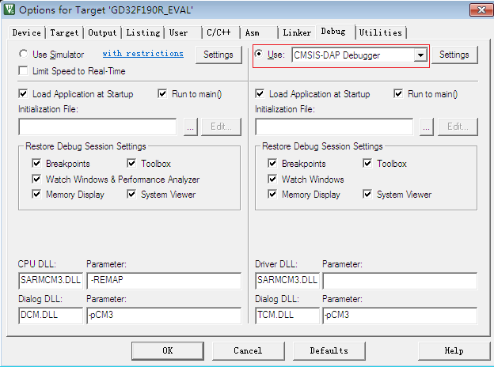
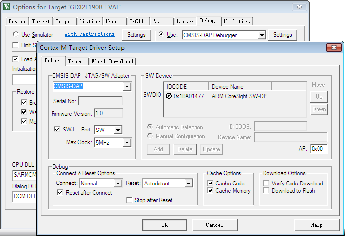

- 修改los_bsp_adapter.c适配LiteOS到GD32F190R8芯片

包含如下头文件

	#include "gd32f1x0.h"
	#include "systick.h"

添加外部接口引用声明

	extern void system_clock_config(void);

修改osTickStart()函数实现为如下内容

	unsigned int osTickStart(void)
	{
	    unsigned int uwRet = 0;
			
	    //g_ucycle_per_tick = sys_clk_freq / tick_per_second;
		g_ucycle_per_tick = SystemCoreClock / tick_per_second;
		
	    LOS_SetTickSycle(g_ucycle_per_tick);
	
		system_clock_config();
		   
		SysTick_Config(g_ucycle_per_tick);
		NVIC_SetPriority(SysTick_IRQn, 0x00);
			
	    return uwRet;
	}

修改SysTick_Handler()为如下内容

	void SysTick_Handler(void)
	{
	    /* 
	        LOS need call LOS_TickHandler() in SysTick_Handler, don't change it,
	        otherwise, LiteOS will not work.
	    */
	    LOS_TickHandler();
		
	    /*add your code here */
		delay_decrement();
	
	    return ;
	}

将如下接口的实现为空函数

	void LosAdapIntInit(void)
	{
	    return ;
	}

	void LosAdapIrpEnable(unsigned int irqnum, unsigned short prior)
	{
	    return ;
	}

	void LosAdapIrqDisable(unsigned int irqnum)
	{
	    return ;
	}

- 修改system_gd32f1x0.c

将SystemInit()函数最后调用的system_clock_config();注释掉。

- 修改startup_gd32f1x0.s

Heap_Size EQU 0x00000400 修改为 Heap_Size EQU 0x00000200

- 修改gd32f1x0_it.c

将PendSV_Handler()和SysTick_Handler()实现#if 0掉

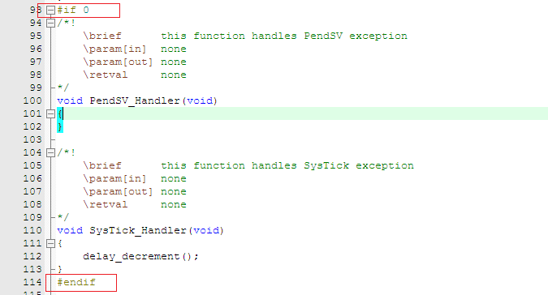

- 在main.c中实现如下功能，

创建2个task，用于点亮LED1和LED2，并且用互斥锁来决定哪个task可以执行亮灯的操作。

创建一个中断(Tamper按键)，在中断中点亮熄灭 LED3和LED4.

修改main.c, 详细内容如下

	#include "gd32f1x0.h"
	#include "systick.h"
	#include "gd32f1x0_eval.h"
	#include <stdio.h>
	#include "los_sys.h"
	#include "los_tick.h"
	#include "los_task.ph"
	#include "los_config.h"
	#include "los_compiler.h"
	#include "los_mux.h"
	
	UINT32 g_Testmux01;
	
	#define TSK_PRIOR_HI 4
	
	UINT32 g_uwTskHiID;
	UINT32 Example_TaskHi(VOID)
	{
	  UINT32 uwRet;
	  gd_eval_keyinit(KEY_TAMPER, KEY_MODE_EXTI);
		gd_eval_ledinit(LED1);
	
		while(1)
		{
			uwRet=LOS_MuxPend(g_Testmux01, 5000);
	    if(uwRet == LOS_OK)
	    {
					gd_eval_ledon(LED1);
					/* insert 200 ms delay */
					LOS_TaskDelay(200);
			 
					/* turn off LEDs */
					gd_eval_ledoff(LED1);
					/* insert 200 ms delay */
					LOS_TaskDelay(200);
					LOS_MuxPost(g_Testmux01);
	    }
	    else if(uwRet == LOS_ERRNO_MUX_TIMEOUT )
			{
				/* turn on LED1 */
			}
		}
	}
	
	UINT32 Example_TaskHi2(VOID)
	{
	  UINT32 uwRet;
		gd_eval_ledinit(LED2);
	
		while(1)
		{
			uwRet=LOS_MuxPend(g_Testmux01, 5000);
	    if(uwRet == LOS_OK)
	    {
					gd_eval_ledon(LED2);
					/* insert 200 ms delay */
					LOS_TaskDelay(3000);
			 
					/* turn off LEDs */
					gd_eval_ledoff(LED2);
					/* insert 200 ms delay */
					LOS_TaskDelay(200);
					LOS_MuxPost(g_Testmux01);
	    }
	    else if(uwRet == LOS_ERRNO_MUX_TIMEOUT )
			{
				/* turn on LED1 */
			}
		}
	}
	
	
	void EXTI4_15_IRQHandler(void)
	{
	    if(RESET != exti_interrupt_flag_get(EXTI_13))
			{
				gd_eval_ledtoggle(LED3);
				gd_eval_ledtoggle(LED4);
	    }
	    exti_interrupt_flag_clear(EXTI_13);
	}
	
	
	
	UINT32 CreatLedtask(VOID)
	{
	    UINT32 uwRet;
	    TSK_INIT_PARAM_S stInitParam;
	
		LOS_MuxCreate(&g_Testmux01);
		gd_eval_ledinit(LED3);
	    gd_eval_ledinit(LED4);
		
	    LOS_TaskLock();
	
	    stInitParam.pfnTaskEntry = (TSK_ENTRY_FUNC)Example_TaskHi;
	    stInitParam.usTaskPrio = TSK_PRIOR_HI;
	    stInitParam.pcName = "Led Test";
	    stInitParam.uwStackSize = 0x200;
	    stInitParam.uwResved   = LOS_TASK_STATUS_DETACHED;
	
	    uwRet = LOS_TaskCreate(&g_uwTskHiID, &stInitParam);
	    if (uwRet != LOS_OK)
	    {
	        LOS_TaskUnlock();
	        return LOS_NOK;
	    }
	
	    stInitParam.pfnTaskEntry = (TSK_ENTRY_FUNC)Example_TaskHi2;
	    stInitParam.usTaskPrio = TSK_PRIOR_HI;
	    stInitParam.pcName = "Led Test2";
	    stInitParam.uwStackSize = 0x200;
	    stInitParam.uwResved   = LOS_TASK_STATUS_DETACHED;
	
	    uwRet = LOS_TaskCreate(&g_uwTskHiID, &stInitParam);
	    if (uwRet != LOS_OK)
	    {
	        LOS_TaskUnlock();
	        return LOS_NOK;
	    }
			
	    LOS_TaskUnlock();
	
	    return LOS_OK;
	
	}
	int main(void)
	{
	    UINT32 uwRet;
	    uwRet = osMain();
	    if (uwRet != LOS_OK) {
	        return LOS_NOK;
	    }
			CreatLedtask();
	    LOS_Start();
	    for (;;);
	    /* Replace the dots (...) with your own code.  */
	}

## 其他说明

**关于M3和M4的汇编不同的地方**

- 左边的是Cortex M3的实现，右边是M4的实现

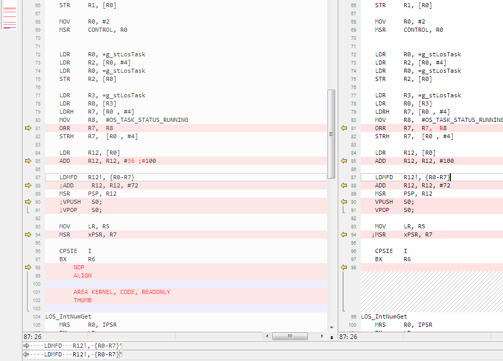

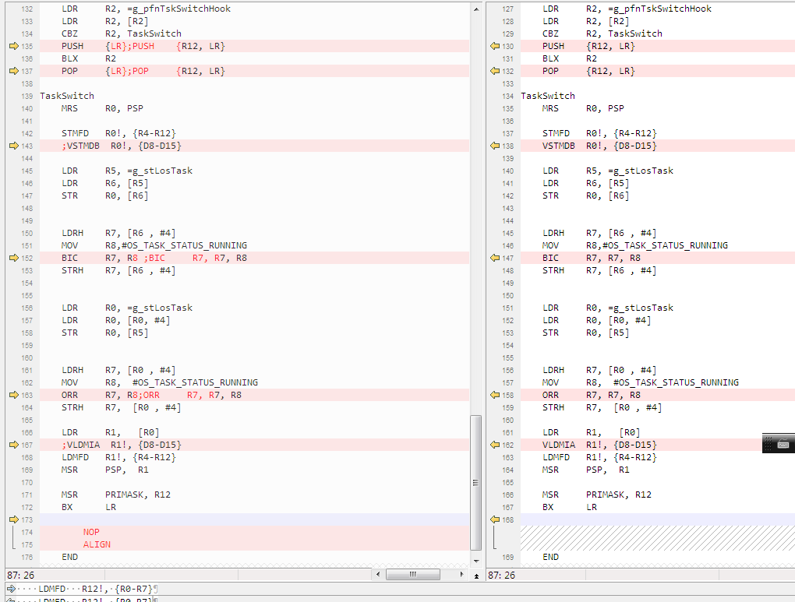

- 在platform下M3和M4分成2个目录，详细可以对比代码查看（主要是task调度时保存的寄存器不同）。

