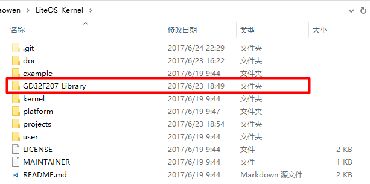
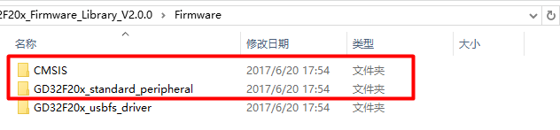
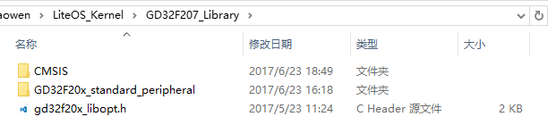
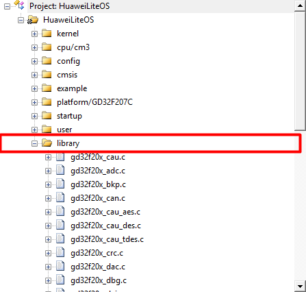
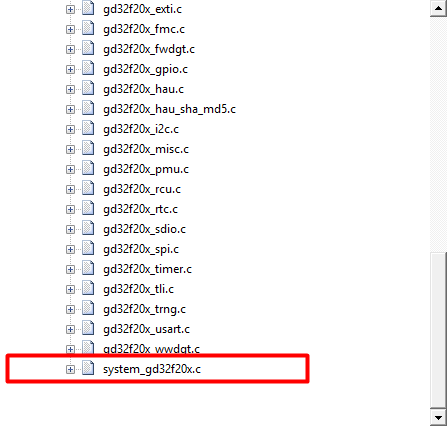
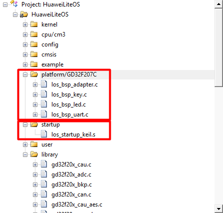
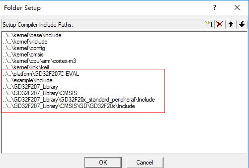
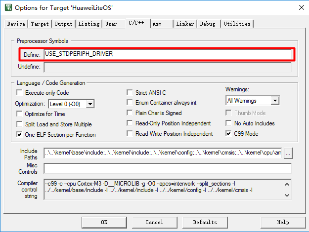
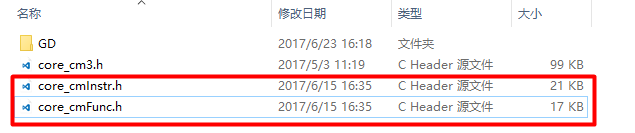

## 1关于本文档的开源协议说明
**您可以自由地：**

**分享** 

- 在任何媒介以任何形式复制、发行本文档

**演绎** 

- 修改、转换或以本文档为基础进行创作。只要你遵守许可协议条款，许可人就无法收回你的这些权利。

**惟须遵守下列条件：**

**署名** 

- 您必须提供适当的证书，提供一个链接到许可证，并指示是否作出更改。您可以以任何合理的方式这样做，但不是以任何方式表明，许可方赞同您或您的使用。

**非商业性使用** 

- 您不得将本作品用于商业目的。

**相同方式共享** 

- 如果您的修改、转换，或以本文档为基础进行创作，仅得依本素材的
授权条款来散布您的贡献作品。

**没有附加限制** 

- 您不能增设法律条款或科技措施，来限制别人依授权条款本已许可的作为。

**声明：**

-  当您使用本素材中属于公众领域的元素，或当法律有例外或限制条款允许您的使用，
则您不需要遵守本授权条款。

- 未提供保证。本授权条款未必能完全提供您预期用途所需要的所有许可。例如：形象
权、隐私权、著作人格权等其他权利，可能限制您如何使用本素材。

**注意**

- 为了方便用户理解，这是协议的概述. 可以访问网址 https://creativecommons.org/licenses/by-sa/3.0/legalcode 了解完整协议内容.

## 2前言
### 目的
本文档介绍基于Huawei LiteOS如何移植到第三方开发板，并成功运行基础示例。
### 读者对象
本文档主要适用于Huawei LiteOS Kernel的开发者。
本文档主要适用于以下对象：

- 物联网端软件开发工程师

- 物联网架构设计师

### 符号约定
在本文中可能出现下列标志，它们所代表的含义如下。

     用于警示紧急的危险情形，若不避免，将会导致人员死亡或严重的人身伤害

    用于警示潜在的危险情形，若不避免，可能会导致人员死亡或严重的人身伤害

    用于警示潜在的危险情形，若不避免，可能会导致中度或轻微的人身伤害

     用于传递设备或环境安全警示信息，若不避免，可能会导致设备损坏、数据丢失、设备性能降低或其它不可预知的结果“注意”不涉及人身伤害

| 说明	|		“说明”不是安全警示信息，不涉及人身、设备及环境伤害信息	|

### 修订记录
修改记录累积了每次文档更新的说明。最新版本的文档包含以前所有文档版本的更新
内容。

<table>
	<tr>
	<td>日期</td>
	<td>修订版本</td>
	<td>描述</td>
	</tr>
	<tr>
	<td>2017年06月23日</td>
	<td>1.0</td>
	<td>完成初稿</td>
	</tr>
    <tr>
</table>

## 3概述

目前在github上已开源的Huawei LiteOS内核源码已适配好STM32F412、STM32F429、STM32L476、GD32F450、GD32F190、GD32F207芯片。
本手册将以GD32F207C-EVAL开发板为例，介绍基于GD32F207VC芯片(Cortex M3内核)的移植过程

## 4环境准备
基于Huawei LiteOS Kernel开发前，我们首先需要准备好单板运行的环境，包括软件环
境和硬件环境。
硬件环境：

<table>
	<tr>
	<td>所需硬件</td>
	<td>描述</td>
	</tr>
	<tr>
	<td>GD32F207C-EVAL开发板</td>
	<td>GD32开发板(芯片型号GD32F207VC)</td>
	</tr>
	<tr>
	<td>Windows10/Windows7</td>
	<td>操作系统</td>
	</tr>
    <tr>
	<td>Keil</td>
	<td>需要安装5.21版本及以上</td>
	</tr>
	<tr>
	<td>jlink</td>
	<td>用于调试</td>
	</tr>
</table>

软件环境：

<table>
	<tr>
	<td>软件</td>
	<td>描述</td>
	</tr>
	<tr>
	<td>Window 7 操作系</td>
	<td>安装Keil的操作系统</td>
	</tr>
	<tr>
	<td>Keil(5.18以上版本)</td>
	<td>用于编译、链接、调试程序代码
	uVision V5.18.0.0 </td>
	</tr>
</table>

**说明**

Keil工具需要开发者自行购买，开发板的调试器是GD-Link,也可以通过SWD/jtag接口连接jlink进行调试

## 5获取Huawei LiteOS 源码

首先我们需要通过网络下载获取Huawei LiteOS开发包。目前Huawei LiteOS的代码已经
开源，可以直接从网络上获取，步骤如下：

- 仓库地址是https://github.com/LITEOS/LiteOS_Kernel.git 

- 点击”clone or download”按钮,下载源代码

- 目录结构如下：Huawei LiteOS的源代码目录的各子目录包含的内容如下：

关于代码树中各个目录存放的源代码的相关内容简介如下：

<table>
<tr>
	<td>一级目录</td>
	<td>二级目录</td>
	<td>说明</td>
</tr>
<tr>
	<td>doc</td>
	<td></td>
	<td>此目录存放的是LiteOS的使用文档和API说明文档</td>
</tr>
<tr>
	<td>example</td>
	<td>api</td>
	<td>此目录存放的是内核功能测试用的相关用例的代码</td>
</tr>
<tr>
	<td></td>
	<td>include</td>
	<td>aip功能头文件存放目录</td>
</tr>
<tr>
	<td>kernel</td>
	<td>base</td>
	<td>此目录存放的是与平台无关的内核代码，包含核心提供给外部调用的接口的头文件以及内核中进程调度、进程通信、内存管理等等功能的核心代码。用户一般不需要修改此目录下的相关内容。</td>
</tr>
<tr>
	<td></td>
	<td>cmsis</td>
	<td>LiteOS提供的cmsis接口</td>
</tr>
<tr>
	<td></td>
	<td>config</td>
	<td>此目录下是内核资源配置相关的代码，在头文件中配置了LiteOS所提供的各种资源所占用的内存池的总大小以及各种资源的数量，例如task的最大个数、信号量的最大个数等等</td>
</tr>
<tr>
	<td></td>
	<td>cpu</td>
	<td>此目录以及以下目录存放的是与体系架构紧密相关的适配LiteOS的代码。比如目前我们适配了arm/cortex-m4及arm/cortex-m3系列对应的初始化内容。</td>
</tr>
<tr>
	<td></td>
	<td>include</td>
	<td>内核的相关头文件存放目录</td>
</tr>
<tr>
	<td></td>
	<td>link</td>
	<td>IDE相关宏定义</td>
</tr>
<tr>
	<td>platform</td>
	<td>Arduino_M0_Pro</td>
	<td>Arduino_M0_Pro开发板systick及驱动相关代码</td>
</tr>
<tr>
	<td></td>
	<td>ATSAM4S-XPRO</td>
	<td>ATSAM4S开发板systick及驱动相关代码</td>
</tr>
<tr>
	<td></td>
	<td>ATSAMD21-XPRO</td>
	<td>ATSAMD21开发板systick及驱动相关代码</td>
</tr>
<tr>
	<td></td>
	<td>EFM32-SLSTK3400A</td>
	<td>SLSTK3400A开发板systick及驱动相关代码</td>
</tr>
<tr>
	<td></td>
	<td>EFM32-SLSTK3401A</td>
	<td>SLSTK3401A开发板systick及驱动相关代码</td>
</tr>
<tr>
	<td></td>
	<td>EFM32-STK3700</td>
	<td>STK3700开发板systick及驱动相关代码</td>
</tr>
<tr>
	<td></td>
	<td>FRDM-KL26Z</td>
	<td>KL26Z开发板systick及驱动相关代码</td>
</tr>
<tr>
	<td></td>
	<td>FRDM-KW41Z</td>
	<td>KW41Z开发板systick及驱动相关代码</td>
</tr>
<tr>
	<td></td>
	<td>GD32F190R-EVAL</td>
	<td>GD32F190开发板systick及驱动相关代码</td>
</tr>
<tr>
	<td></td>
	<td>GD32F207C-EVAL</td>
	<td>GD32F207开发板systick及驱动相关代码</td>
</tr>
<tr>
	<td></td>
	<td>GD32F450i-EVAL</td>
	<td>GD32F450开发板systick及驱动相关代码</td>
</tr>
<tr>
	<td></td>
	<td>EFM32-STK3700</td>
	<td>STK3700开发板systick及驱动相关代码</td>
</tr>
<tr>
	<td></td>
	<td>LOS_EXPAND_XXX</td>
	<td>用于新扩展的开发板systick以及led、uart、key驱动bsp适配代码</td>
</tr>
<tr>
	<td></td>
	<td>LPC824_LITE</td>
	<td>STK3700开发板systick及驱动相关代码</td>
</tr>
<tr>
	<td></td>
	<td>LPC54110_BOARD</td>
	<td>LPC54110开发板systick及驱动相关代码</td>
</tr>
<tr>
	<td></td>
	<td>MM32F103_MINI</td>
	<td>MM32F103开发板systick及驱动相关代码</td>
</tr>
<tr>
	<td></td>
	<td>STM32F411RE-NUCLEO</td>
	<td>STM32F411开发板systick及驱动相关代码</td>
</tr>
<tr>
	<td></td>
	<td>STM32F412ZG-NUCLEO</td>
	<td>STM32F412开发板systick及驱动相关代码</td>
</tr>
<tr>
	<td></td>
	<td>STM32F746ZG_NUCLEO</td>
	<td>STM32F746开发板systick及驱动相关代码</td>
</tr>
<tr>
	<td></td>
	<td>STM32L476RG_NUCLEO</td>
	<td>STM32L476开发板systick及驱动相关代码</td>
</tr>
<tr>
	<td>project</td>
	<td>Arduino_M0_Pro_KEIL</td>
	<td>Arduino_M0_Pro开发板的keil工程目录</td>
</tr>
<tr>
	<td></td>
	<td>ATSAM4S-XPRO_KEIL</td>
	<td>ATSAM4S开发板的keil工程目录</td>
</tr>
<tr>
	<td></td>
	<td>ATSAMD21-XPRO_KEIL</td>
	<td>ATSAMD21开发板的keil工程目录</td>
</tr>
<tr>
	<td></td>
	<td>EFM32-SLSTK3400A_IAR</td>
	<td>SLSTK3400A开发板的iar工程目录</td>
</tr>
<tr>
	<td></td>
	<td>EFM32-SLSTK3401A_IAR</td>
	<td>SLSTK3401A开发板的iar工程目录</td>
</tr>
<tr>
	<td></td>
	<td>EFM32-STK3700_KEIL</td>
	<td>STK3700开发板的keil工程目录</td>
</tr>
<tr>
	<td></td>
	<td>FRDM-KL26Z_KEIL</td>
	<td>KL26Z开发板的keil工程目录</td>
</tr>
<tr>
	<td></td>
	<td>FRDM-KW41Z_IAR</td>
	<td>KW41Z开发板的iar工程目录</td>
</tr>
<tr>
	<td></td>
	<td>GD32F190R-EVAL_KEIL</td>
	<td>GD32F190开发板的keil工程目录</td>
</tr>
<tr>
	<td></td>
	<td>GD32F207C-EVAL_KEIL</td>
	<td>GD32F207开发板的keil工程目录</td>
</tr>
<tr>
	<td></td>
	<td>GD32F450i-EVAL_KEIL</td>
	<td>GD32F450开发板的keil工程目录</td>
</tr>
<tr>
	<td></td>
	<td>LPC824_LITE_KEIL</td>
	<td>STK3700开发板的keil工程目录</td>
</tr>
<tr>
	<td></td>
	<td>LPC54110_BOARD_KEIL</td>
	<td>LPC54110开发板的keil工程目录</td>
</tr>
<tr>
	<td></td>
	<td>MM32F103_MINI_KEIL</td>
	<td>MM32F103开发板的keil工程目录</td>
</tr>
<tr>
	<td></td>
	<td>STM32F411RE-NUCLEO_KEIL</td>
	<td>STM32F411开发板的keil工程目录</td>
</tr>
<tr>
	<td></td>
	<td>STM32F412ZG-NUCLEO_KEIL</td>
	<td>STM32F412开发板的keil工程目录</td>
</tr>
<tr>
	<td></td>
	<td>STM32F429I_DISCO_GCC</td>
	<td>STM32F429开发板的gcc工程目录</td>
</tr>
<tr>
	<td></td>
	<td>STM32F429I_DISCO_IAR</td>
	<td>STM32F429开发板的iar工程目录</td>
</tr>
<tr>
	<td></td>
	<td>STM32F429I_DISCO_KEIL</td>
	<td>STM32F429开发板的keil工程目录</td>
</tr>
<tr>
	<td></td>
	<td>STM32F746ZG_NUCLEO_KEIL</td>
	<td>STM32F746开发板的keil工程目录</td>
</tr>
<tr>
	<td></td>
	<td>STM32L476RG_NUCLEO_KEIL</td>
	<td>STM32L476开发板的keil工程目录</td>
</tr>
<tr>
	<td>user</td>
	<td></td>
	<td>此目录存放用户代码，LiteOS启动代码在mian()函数中</td>
</tr>
</table>

获取Huawei LiteOS源代码之后，我们可以将自己本地已有工程的代码适配到LiteOS内核工程中进行应用开发。

## 6如何适配LiteOS内核工程开发
本章节描述的内容以gigadevice提供的官方固件库(GD32F20x_Firmware_Library_V2.0.0.rar)为基础，适配到LiteOS的GD32F207C-EVAL-KEIL工程中，演示串口输出、按键中断及LED点亮功能。

### GD32F207C-EVAL的资料获取
从http://gd32mcu.21ic.com/documents 下载以下文件

    GD32F2 series DFP for with Keil MDK 5.15及更高版本
    GD32F20x_Firmware_Library_V2.0.0
    GD32F20x User Manual
    GD32207C-EVAL User Manual
### GD32的开发工具安装
- 安装keil 5.18或者以上版本
- 安装GD32F2 series DFP for with Keil MDK 5.15及更高版本

**添加代码到LiteOS工程**

在LiteOS内核代码目录中新建GD32F207_Library文件夹，将相关的代码拷贝到其中。

复制GD32F20x_Firmware_Library_V2.0.0目录下的CMSIS和GD32F20x_standard_peripheral两个文件夹到GD32F207_Library文件夹中。

复制文件GD32F20x_Firmware_Library_V2.0.0/Template/gd32f20x_libopt.h到GD32f207_Library文件夹中。

复制完成后的GD32F207_Library文件夹内容如下图：

在LiteOS工程添加library目录，将GD示例工程中的gd32f20x库文件（GD32f207_Library/GD32F20x_standard_peripheral/Source）添加到library文件夹下。

在LiteOS工程中library中添加GD32F207C-EVAL的system_gd32f20x.c文件（GD32F207_Library/CMSIS/GD/GD32F20x/Source/system_gd32f20x.c）

在LiteOS工程中添加GD32F207C-EVAL的相关外设驱动、systick、芯片启动代码（LiteOS_Kernel/platform/GD32F207C-EVAL）

**添加头文件搜索路径**

**添加编译宏选项**

如果此时编译出现无法找到文件：core_cmInstr.h，那么请自行复制core_cmInstr.h和core_cmFunc.h文件到GD32F207_Library/CMSIS下，如下所示：

经过以上步骤的修改，完成了代码的初步移植，然后可以编译代码,连接串口线（事先安装相关驱动）并在串口调试工具中打开相应串口，调试运行时可看到串口打印输出，按demo板上的User Key键，可以调试按键中断及LED。

## 7 其他说明

###如何使用LiteOS 开发###

LiteOS中提供的功能包括如下内容： 任务创建与删除、任务同步（信号量、互斥锁）、动态中断注册机制等等内容，详细内容请参考《HuaweiLiteOSKernelDevGuide》。

###从零开始创建LiteOS工程###

目前在LiteOS的源代码的projects目录下已附带一些开发板的内核示例工程，用户可以直接使用，如果您所使用的开发板（芯片型号）与在示例工程中找不到，您可以从零开始创建LiteOS工程，创建流程请参考《LiteOS_Migration_Guide_Keil》。

###关于中断向量位置选择###

如果您需要使用LiteOS的中断注册机制，详细内容请参考《LiteOS_Migration_Guide_Keil》。

### kernel API测试代码 ###

如果您需要测试LiteOS内核工程运行情况，详细内容请参考《LiteOS_Migration_Guide_Keil》。