## 1开源协议说明
**您可以自由地：**

**分享** 

- 在任何媒介以任何形式复制、发行本作品

**演绎** 

- 修改、转换或以本作品为基础进行创作。只要你遵守许可协议条款，许可人就无法收回你的这些权利。

**惟须遵守下列条件：**

**署名** 

- 您必须提供适当的证书，提供一个链接到许可证，并指示是否作出更改。您可以以任何合理的方式这样做，但不是以任何方式表明，许可方赞同您或您的使用。

**非商业性使用** 

- 您不得将本作品用于商业目的。

**相同方式共享** 

- 如果您的修改、转换，或以本作品为基础进行创作，仅得依本素材的
授权条款来散布您的贡献作品。

**没有附加限制** 

- 您不能增设法律条款或科技措施，来限制别人依授权条款本已许可的作为。

**声明：**

-  当您使用本素材中属于公众领域的元素，或当法律有例外或限制条款允许您的使用，
则您不需要遵守本授权条款。
未提供保证。本授权条款未必能完全提供您预期用途所需要的所有许可。例如：形象
权、隐私权、著作人格权等其他权利，可能限制您如何使用本素材。

**注意**

- 为了方便用户理解，这是协议的概述. 可以访问网址 https://creativecommons.org/licenses/by-sa/3.0/legalcode 了解完整协议内容.

## 2前言
### 目的
本文档介绍基于Huawei LiteOS如何移植到第三方开发板，并成功运行基础示例。
### 读者对象
本文档主要适用于Huawei LiteOS Kernel的开发者。
本文档主要适用于以下对象：
- 物联网端软件开发工程师
- 物联网架构设计师

### 符号约定
在本文中可能出现下列标志，它们所代表的含义如下。

     用于警示紧急的危险情形，若不避免，将会导致人员死亡或严重的人身伤害

    用于警示潜在的危险情形，若不避免，可能会导致人员死亡或严重的人身伤害

    用于警示潜在的危险情形，若不避免，可能会导致中度或轻微的人身伤害

     用于传递设备或环境安全警示信息，若不避免，可能会导致设备损坏、数据丢失、设备性能降低或其它不可预知的结果“注意”不涉及人身伤害

| 说明	|		“说明”不是安全警示信息，不涉及人身、设备及环境伤害信息	|				

### 修订记录
修改记录累积了每次文档更新的说明。最新版本的文档包含以前所有文档版本的更新
内容。

<table>
	<tr>
	<td>日期</td>
	<td>修订版本</td>
	<td>描述</td>
	</tr>
	<tr>
	<td>2017年01月17日</td>
	<td>1.0</td>
	<td>完成初稿</td>
	</tr>
</table>

## 3概述

目前在github上已开源的Huawei LiteOS内核源码已适配好STM32F411、STM32F429芯片，本手册将
以STM32F429ZI芯片为例，介绍基于Cortex M4核芯片的移植过程。

## 4环境准备
基于Huawei LiteOS Kernel开发前，我们首先需要准备好单板运行的环境，包括软件环
境和硬件环境。
硬件环境：
<table>
	<tr>
	<td>所需硬件</td>
	<td>描述</td>
	</tr>
	<tr>
	<td>STM32F4291-DISCO单板</td>
	<td>STM32开发板(芯片型号STM32F429ZIT6)</td>
	</tr>
	<tr>
	<td>PC机</td>
	<td>用于编译、加载并调试镜像</td>
	</tr>
	<tr>
	<td>电源（5v）</td>
	<td>开发板供电(使用Mini USB连接线)</td>
	</tr>
</table>

软件环境：
<table>
	<tr>
	<td>软件</td>
	<td>描述</td>
	</tr>
	<tr>
	<td>Window 7 操作系</td>
	<td>安装IAR和st-link的操作系统</td>
	</tr>
	<tr>
	<td>IAR(7.30以上版本)</td>
	<td>用于编译、链接、调试程序代码</td>
	</tr>
	<tr>
	<td>st-link_v2_usbdriver</td>
	<td>开发板与pc连接的驱动程序，用户加载及调试程序代码</td>
	</tr>
</table>

**说明**

IAR工具需要开发者自行购买，ST-Link的驱动程序可以从st link的相关网站获取，采用J-Link还
是ST-Link需要根据具体使用的开发板来确定。这里以STM32F429为例，使用ST-Link。

## 5获取Huawei LiteOS 源码

首先我们需要通过网络下载获取Huawei LiteOS开发包。目前Huawei LiteOS的代码已经
开源，可以直接从网络上获取，步骤如下：

- 直接到github上面clone。仓库地址是https://github.com/LITEOS/LiteOS_Kernel.git

- 从github上获取的代码，则目录结构如下：

关于代码树中各个目录存放的源代码的相关内容简介如下：

<table>
<tr>
	<td>一级目录</td>
	<td>二级目录</td>
	<td>说明</td>
</tr>
<tr>
	<td>kernel</td>
	<td>base</td>
	<td>此目录存放的是与平台无关的内核代码，包含核心提供给外部调用的接口的头文件以及内核中进程调度、进程通信、内存管理等等功能的核心代码。用户一般不需要修改此目录下的相关内容。</td>
</tr>
<tr>
	<td></td>
	<td>include</td>
	<td>内核的相关头文件存放目录</td>
</tr>
<tr>
	<td></td>
	<td>cmsis</td>
	<td>LiteOS提供的cmsis接口</td>
</tr>
<tr>
	<td>platform</td>
	<td>bsp</td>
	<td>目录下则是内核入口相关示例代码。用户自己实现的相关应用程序源代码都可以放到此文件夹下的子目录或者拷贝sample目录更名为其他名称再添加新的源代码。(注：总入口函数是main函数)</td>
</tr>
<tr>
	<td></td>
	<td>cpu</td>
	<td>该目录以及以下目录存放的是与体系架构紧密相关的硬件初始化的代码。此目录最好按照芯片的体系结构以及芯片型号进行命名方便区分。比如目前我们实现了arm/cortex-m4这个芯片对应的硬件初始化内容。用户最好按照这样的划分进行新的芯片型号的添加</td>
</tr>
<tr>
	<td>example</td>
	<td>api</td>
	<td>此目录存放的是内核功能测试用的相关用例的代码</td>
</tr>
<tr>
	<td></td>
	<td>include</td>
	<td>内核功能测试的用例相关头文件</td>
</tr>
<tr>
	<td>projects</td>
	<td>stm32f411_iar</td>
	<td>stm32f411开发板的iar工程目录</td>
</tr>
<tr>
	<td></td>
	<td>stm32f429_iar</td>
	<td>stm32f429开发板的iar工程目录</td>
</tr>
<tr>
	<td></td>
	<td>stm32f429_keil</td>
	<td>stm32f429开发板的keil工程目录</td>
</tr>
<tr>
	<td>doc</td>
	<td></td>
	<td>此目录存放的是LiteOS的使用文档和API说明文档</td>
</tr>
</table>

获取Huawei LiteOS源代码之后，我们就可以创建project然后编译调试我们的程序了，
详细可以参考后续的各个章节。详细的编程应用编程API请参考《HuaweiLiteOSKernelDevGuide》

## 6创建Huawei LiteOS 工程

在获取完成Huawei LiteOS的源代码和安装好IAR等相关的开发工具后，我们需要用IAR
集成开发环境创建编译Huawei LiteOS的工程，步骤如下：

- 打开IAR， 然后点击File->New->Workspace创建一个新的工作空间

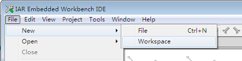

- 然后点击Project->Create New Project...创建一个新的project

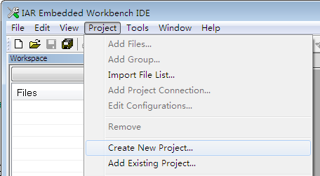
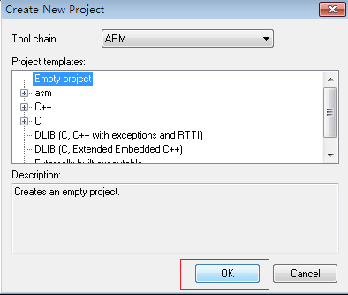

    创建一个空的工程

- 保存工程名，比如HuaweiLiteOS

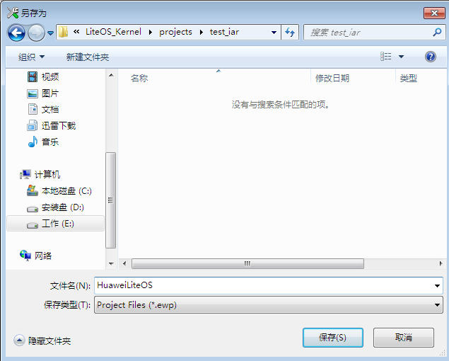

- 创建工程中的目录结构

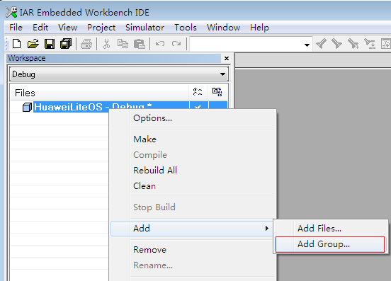

如上图所示，通过add Group 操作来创建一个在工程中显示的目录树，方便我们区分代码功能，比如我们创建如下结构的目录树

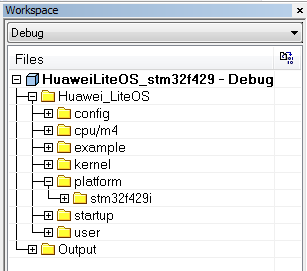

- 创建完成目录树之后我们添加源代码到目录树中。
- 将kernel/base目录下的所有C代码添加到工程中的kernel下
- 将kernel/cmsis目录下的所有C代码添加到工程中的cmsis下。
- 将platform/bsp/config目录下的所有C代码添加到工程中的Platform/bsp下
- 将platform/cpu/arm/cortex-m4目录下的所有C代码添加到工程中的Platform/cortexm4下

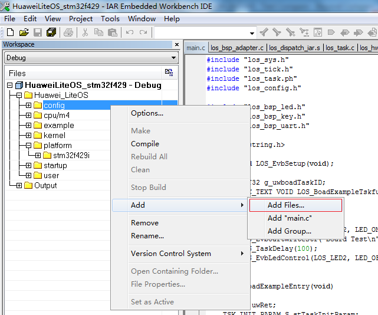
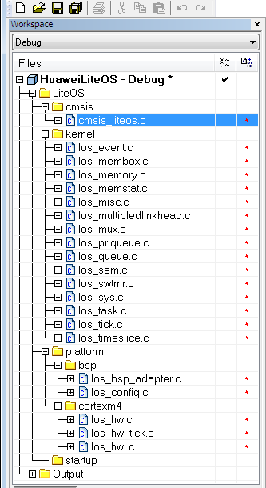

最后需要添加启动相关的汇编文件。示例中我们以stm32f429开发板为例，所以我们可以将
projects/stm32f429_iar/startup目录下的文件拷贝到我们新创建的目录中，然后在将其添加到工程目录树中。

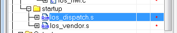

- 完成上面内容后我们先保存一下

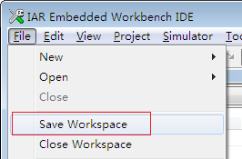
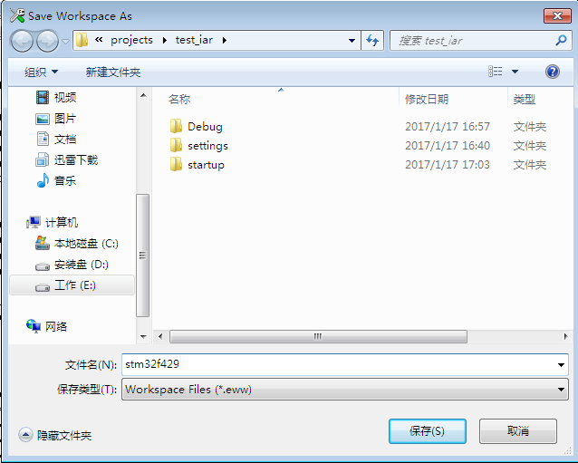

- 完成添加文件之后，需要对工程进行详细的配置，配置内容步骤如下所示：

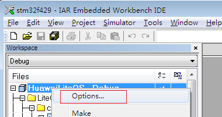

- 配置芯片型号

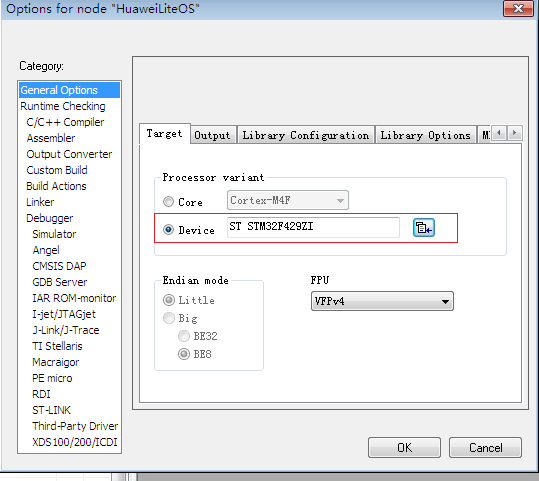

- 配置C编译选项，使用C99语法

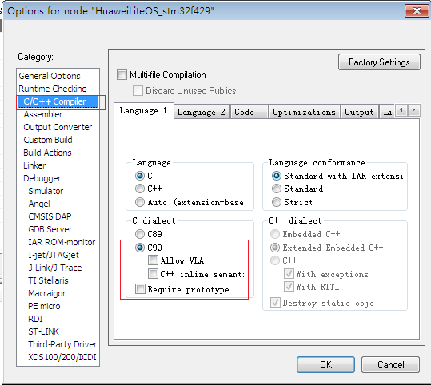

- 配置C文件头文件搜索路径，需要将所有的头文件路径都包含进来

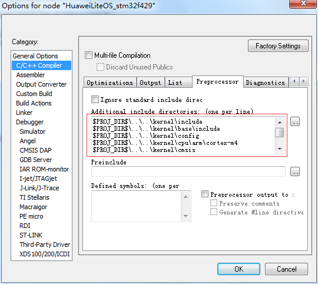
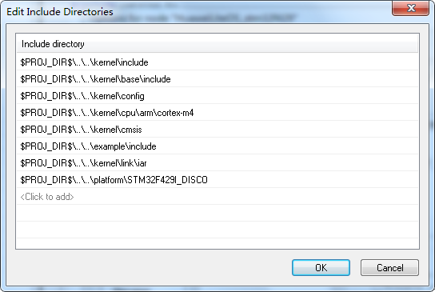

- 配置分散加载文件

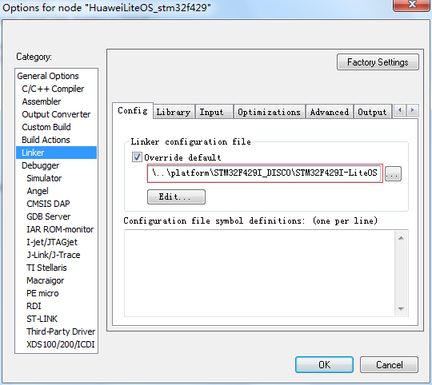

说明：分散配置文件中增加的是vector（中断向量表）的内容，LiteOS的中断向量表在stm32f429ZI这个芯片中定义的是0x400大小。如果不了解分散加载文件可以参考IDE的help中sct文件的说明。或者baidu、google分散加载文件相关内容。

- 配置debug相关选项，是stm32f429开发板中使用ST-Link

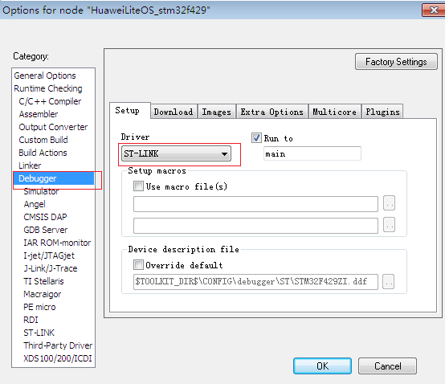
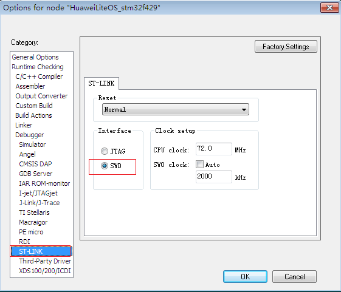

说明：los_dispatch.s、los_vendor.s这个文件在git上的代码时放在projects/stm32f429_keil/startup目录下的，如果是iar工程则是在projects/stm32f429_iar/startup目录下。他们因为工具不同所以汇编文件语法有些不一样。

### kernel API测试代码

如果需要测试LiteOS是否正常运行，可以将example/api添加到工程目录中。

### 测试代码使用

测试代码入口是los_demo_entry.c中的LOS_Demo_Entry()这个接口，使用方法los_config.c的main中调用

示例如下：

	extern void LOS_Demo_Entry(void)；
	int main(void)
	{
		UINT32 uwRet;
		uwRet = osMain();
		if (uwRet != LOS_OK) {
			return LOS_NOK;
		}
		LOS_Demo_Entry()；
		LOS_Start();

		for (;;);
		/* Replace the dots (...) with your own code.  */
	}

**如何选择测试的功能：**

- 在example/include/los_demo_entry.h 打开要测试的功能的宏开关LOS_KERNEL_TEST_xxx，比如测试task调度打开 LOS_KERNEL_TEST_TASK 即可（//#define LOS_KERNEL_TEST_TASK 修改为 #define LOS_KERNEL_TEST_TASK）

- 如果需要printf，并且是Keil工程，则将los_demo_debug.h中的LOS_KERNEL_DEBUG_OUTLOS_KERNEL_TEST_KEIL_SWSIMU打开。目前文档描述的是在IAR工程中，所以不需要打开LOS_KERNEL_TEST_KEIL_SWSIMU

- 中断测试无法在软件仿真的情况下测试。

**使用printf打印可以有几种方法**

- 将printf重定位到uart输出，这个需要uart驱动支持，如果只有liteOS而没有相关驱动加入工程则不建议使用该方法。
- 在IAR中直接可以在调试窗口看到printf的log输出。

## 7编译调试
打开工程后，菜单栏Project→Clean 、Rebuild All，可clean和build 文件。这里点
击Rebuild All，编译全部文件
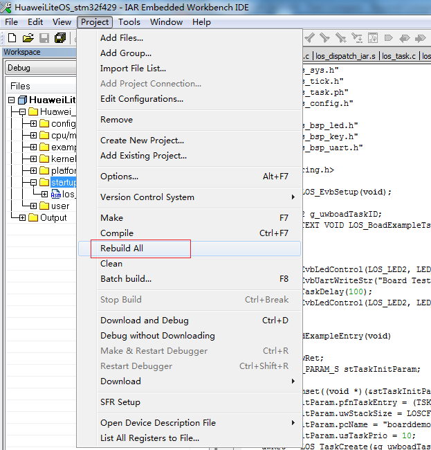

**关于中断向量位置选择**

- 在los_bsp_adapter.c中，g_use_ram_vect变量控制了LiteOS中是否使用vector向量表（中断向量表）重定向功能。如果g_use_ram_vect设置为 1 ，则需要在配置分散加载文件，如果配置为0，则不配置分散加载文件（即在上面的配置步骤中可以不进行分散加载文件配置），系统启动后默认中断向量表在Rom的0x00000000地址。

**关于工程创建**

目前在LiteOS的源代码中已经存在了一些已经创建好的工程，用户可以直接使用，它们都在projects目录下。建议用户使用projects下已经建立好的工程作为LiteOS运行是否正常的参考工程使用。

## 8如何使用LiteOS 开发

LiteOS中提供的功能包括如下内容： 任务创建与删除、任务同步（信号量、互斥锁）、动态中断注册机制 等等内容，更详细的内容可以参考“HuaweiLiteOSKernelDevGuide”中描述的相关内容。下面章节将对任务和中断进行说明

### 8.1 创建任务

- 对于嵌入式系统来说，内存都是比较宝贵的资源，因此在一般的程序都会严格管理内存使用。LiteOS也是一样。在LiteOS中系统资源使用了g_ucMemStart[OS_SYS_MEM_SIZE]作为内存池，来管理任务、信号量等等资源的创建，总共是32K。而给用户创建的task的的个数则是LOSCFG_BASE_CORE_TSK_LIMIT（15）.

- 用户使用LOS_TaskCreate(...)等接口来进行任务的创建。具体可以参考example/api/los_api_task.c中的使用方法来创建管理任务。

### 8.2 中断处理
#### Huawei LiteOS 的中断使用
在驱动开发的过程中我们可能会使用到中断，因此我们需要注册自己的中断处理程
序。在Huawei LiteOS中有一套自己的中断的逻辑。

- 在OS启动后，ram的起始地址0x20000000到0x20000400是用来存放中断向量表的，并且系统启动的汇编代码中只讲reset功能写入到了对应的区域。并且用了一个全局的m_pstHwiForm[ ] 来管理中断。

- 开发者需要使用某些中断时，可以通过LOS_HwiCreate (…)接口来添加自己的中断处理函数。如果驱动卸载还可以通过LOS_HwiDelete(….)来删除自己的中断处理函数。系统还提供了LOS_IntLock()关中断LOS_IntRestore()恢复到中断前状态等接口。详细的使用方法可以参考LiteOS中已经使用的地方。

- LiteOS的中断机制会额外地使用2K的RAM，并且跟大部分开发板的bsp代码包中的的机制也不是一个工作方式。用户可以选择不使用该中断机制。简单的办法在los_bsp_adapter.c中将g_use_ram_vect变量设置为0，并且在配置工程的时候不配置分散加载文件。这样就可以使用demo板的bsp包提供的中断使用的方式了。

### 8.3 其他功能接口

LiteOS中提供的所有接口的使用示例都可以在“HuaweiLiteOSKernelDevGuide”文档中找到。
根据文档中描述的内容就可以开发出逻辑复杂的应用程序了。

## 9如何移植LiteOS 到已有系统
本章节将讲述如何在已有平台的基础上使用LiteOS提供的功能。
### 修改sct配置文件
这个文件的修改是根据芯片提供的硬件来修改的，主要修改片上的rom的大小以及ram的大小。由于LiteOS使用了自己的中断向量管理机制，所以在配置文件中还需要加入LiteOS需要的向量的相关区域的定义。详细修改方法可以参考创建工程的章节进行配置。文件位置projects\stm32f429_iar\startup目录下的sct文件。

说明：
这个文件中定义了分散加载的相关内容，LiteOS主要就是要在其中加入中断向量所需要的地址范
围。中断向量的大小根据芯片实际的中断数目进行决定的。如果需要加入其它内容，开发者可以
自己定义。

### 修改los_vendor.s文件

- 此文件是系统启动文件，目前示例用的demo板可以直接使用开源代码中projects\stm32f429_iar\startup目录下提供的los_vendor.s，该文件中主要定义的就是Reset相关内容。
- 比如stm32f429的演示工程中，将stm32官方提供的startup_stm32f429xx.s直接在工程中remove掉，直接使用LiteOS提供的.s文件。或者将LiteOS中的los_vendor.s文件实现的内容增加到startup_stm32f429xx.s中。
- 中断处理函数的实现可以在此.s文件中实现，也可以在c文件中实现，但是最后都必须使用kernel提供的中断注册函数进行注册。

说明：
此文件中通常还会定义很多系统用到的中断处理函数。不过建议将中断在一个新的c文件实现，
并用LiteOS的中断向量表m_pstHwiForm[]管理或者LOS_HwiCreate()函数动态添加。

### 修改los_dispatch.s文件
- 此文件中是与锁以及进程调度相关的一些内容的实现，不同的芯片类型汇编代码以及寄存器都不一样这样需要根据实际的芯片来进行相关的修改。但是功能必须保证跟LiteOS中提供的汇编代码功能一致。当然用户也可以增加其他需要的功能。
- 目前LiteOS的los_dispatch.s中定义的PendSV_Handler()这个函数是比较重要的与进程调度相关。如果涉及到不同芯片的汇编指令不一样需要特别注意。
- 目前LiteOS中提供对于Cortex M4的适配的汇编文件，都放在了projects 目录下对应的工程目录下的startup文件夹下面了，用户可以直接使用。

### 修改los_bsp_adapter.c配置系统时钟主频
- 此文件中列出了LiteOS运行时需要根据实际的硬件平台进行适配修改的接口。
- osTickStart() 配置时钟的接口。该接口是在LiteOS初始化完毕后才被调用的，所以不能在LiteOS初始化完成之前进行时钟的相关操作。
- sys_clk_freq、tick_per_second控制LiteOS中的时钟设置和tick设置。
- SysTick_Handler() 系统时钟中断处理函数
	
  以下3个接口都是与LiteOS中断机制相关的，如果不使用LiteOS的中断机制，可以实现为空函数 LosAdapIntInit()、LosAdapIrpEnable()、LosAdapIrqDisable()

- demo板为STM32F429，硬件主频为可达180Mhz，就需要将sys_clk_freq配置为180000000，目前LiteOS的kernel并未根据stm32f429的芯片的寄存器进行配置，所以使用的是16M的默认时钟作为system tick的时钟源。关于stm32f429的芯片的时钟可以参考"stm32中文手册"中关于系统时钟的描述。

**LiteOS中断机制说明：**

- LiteOS启动的时候，即platform\bsp\config\los_config.c中的的osMain()用到osHwiInit()将中断OS_M4_SYS_VECTOR_CNT开始的其他中断都注册成了defaut的处理函数，用户在需要使用外部中断的话（即中断号大于OS_M4_SYS_VECTOR_CNT的中断），则需要通过调用LOS_HwiCreate()来动态的添加。

- 在OS_M4_SYS_VECTOR_CNT之前的中断都在m_pstHwiForm[]静态地添加。目前最重要的Reset的的中断处理中只是调用osEnableFPU来使能浮点运算，并没有初始化一些芯片其他的配置，如果需要我们可以将某些寄存器的初始化也放到Reset中进行实现。

### 修改los_config.h文件

目前los_config.h中的内容比较匹配arm cortex M4这种类型的芯片。该文件中在进行不
同芯片平台移植时需要适配修改的内容如下：

- LOSCFG_PLATFORM_HWI_LIMIT 中断的最大数目，这个需要根据实际的芯片进行定义
- LOSCFG_BASE_CORE_TSK_LIMIT 定义系统中能够创建的task的数目。

其他还有许多的宏，其中代码中有相关的注释可以参考，如果有需要可以修改其中的定义，不过修改这些值需要注意不要超过系统中能够使用的内存的大小。

### 关注los_hw.c文件

此文件中的osTskStackInit()中初始化了task stack的 context相关内容，其中这个保存的是task切换时寄存器等相关的内容，具体保存的内容是在los_dispatch.s中实现的。任务切换需要保存哪些内容到这个里面就是根据实际的芯片来决定的。有些芯片的寄存器比较少，可能需要修改TSK_CONTEXT_S这个结构体中的内容。

### 添加LiteOS到已有的平台示例

本章节描述的内容是以stm32f429zi中的LED灯亮灭示例程序为基础添加LiteOS。工程位置STM32Cube_FW_F4_V1.14.0\Projects\STM32F429I-Discovery\Examples\BSP\EWARM

- 首先将LiteOS的代码添加到已有工程中如下图所示：

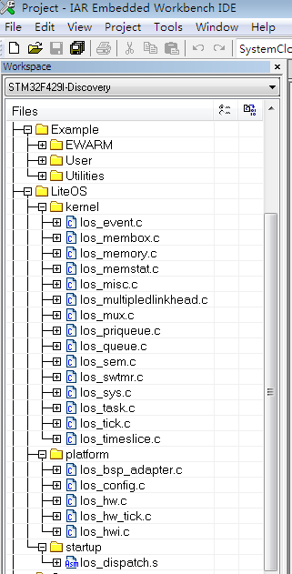

说明：示例中直接使用了原始工程中的汇编启动文件，所以就不需要添加los_vendor.s文件。

- 目前示例中我们不使用LiteOS的中断处理机制，所以不配置LiteOS的分散加载文件。

**添加头文件搜索路径**

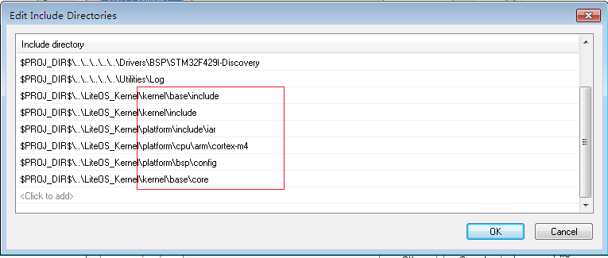

如上图所示的头文件路径，以及编译时需要使用C99，并且去掉Require prototype的勾选

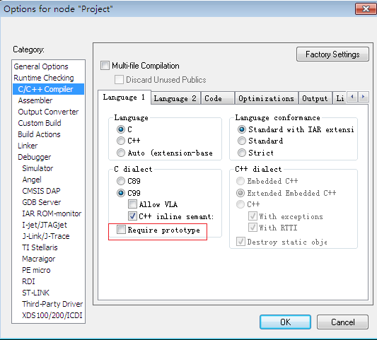

**代码修改**

- 将los_config.c中的main()函数改名为非main()，比如修改为main_1()

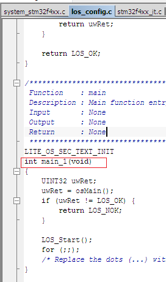

- 修改工程中的main.c，添加和修改如下内容

将static void SystemClock_Config(void);修改为void SystemClock_Config(void);

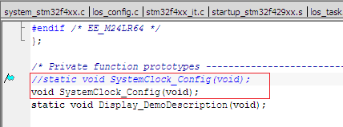

将main()中调用SystemClock_Config()的地方注释掉

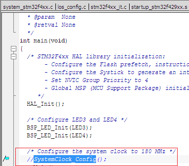

修改los_bsp_adapter.c，添加头文件包含

	头文件包含
	#include "stm32f4xx.h"
	#include "core_cm4.h"

修改los_bsp_adapter.c中osTickStart()的实现，调用SystemClock_Config()

	unsigned int osTickStart(void)
	{
	    unsigned int uwRet = 0;
		
	    /* This code section LOS need, so don't change it */
	    g_ucycle_per_tick = sys_clk_freq / tick_per_second;
	    LOS_SetTickSycle(g_ucycle_per_tick);
	    
	    /* 
	      Set system tick relaod register valude, current register valude and start
	      system tick exception.
	      Note: here can be replaced by some function , for example in Stm32 bsp
	      you can just call SysTick_Config(sys_clk_freq/tick_per_second);
	    */
	#if 0
	    *(volatile UINT32 *)OS_SYSTICK_RELOAD_REG = g_ucycle_per_tick - 1;
	    *((volatile UINT8 *)OS_NVIC_EXCPRI_BASE + (((UINT32)(-1) & 0xF) - 4)) = ((7 << 4) & 0xff);
	    *(volatile UINT32 *)OS_SYSTICK_CURRENT_REG = 0;
	    *(volatile UINT32 *)OS_SYSTICK_CONTROL_REG = (1 << 2) | (1 << 1) | (1 << 0);
	#else
	    SystemClock_Config();
		SysTick_Config(g_ucycle_per_tick);
	#endif    
	    return uwRet;
	
	}

修改los_bsp_adapter.c中SysTick_Handler()的实现，添加HAL_IncTick()的调用

	void SysTick_Handler(void)
	{
	    /* 
	        LOS need call LOS_TickHandler() in SysTick_Handler, don't change it,
	        otherwise, LiteOS will not work.
	    */
	    LOS_TickHandler();
		
	    /*add your code here */
	    HAL_IncTick();	
	
	    return ;
	}

修改los_bsp_adapter.c中sys_clk_freq和g_use_ram_vect的值，如下图所示

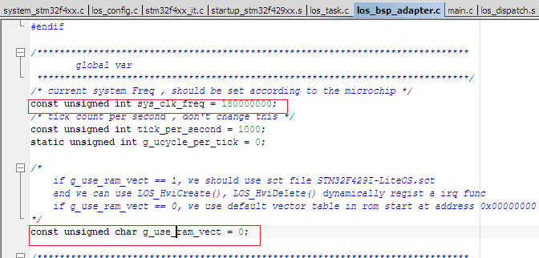

在main.c中，添加如下头文件包含

	#include "time.h"
	#include "los_task.h"

在main.c中，添加如下LED测试的task的创建代码。此代码可以在main()函数的上面添加

	UINT32 g_uwTskHiID;
	UINT32 Example_TaskHi(VOID)
	{
	    UINT32 uwRet;
	
	    while(1)
	    {
	       BSP_LED_Toggle(LED3);
	       BSP_LED_Toggle(LED4);
	       uwRet = LOS_TaskDelay(500);
	    }
	  
	    return uwRet;
	}
	UINT32 Example_TskCaseEntry(VOID)
	{
	    UINT32 uwRet;
	    TSK_INIT_PARAM_S stInitParam;
	
	    /*锁任务调度*/
	    LOS_TaskLock();
	    stInitParam.pfnTaskEntry = (TSK_ENTRY_FUNC)Example_TaskHi;
	    stInitParam.usTaskPrio = 4;
	    stInitParam.pcName = "HIGH_NAME";
	    stInitParam.uwStackSize = 0x400;
	    stInitParam.uwResved   = LOS_TASK_STATUS_DETACHED;
	    /*创建高优先级任务，由于锁任务调度，任务创建成功后不会马上执行*/
	    uwRet = LOS_TaskCreate(&g_uwTskHiID, &stInitParam);
	    if (uwRet != LOS_OK)
	    {
	        LOS_TaskUnlock();
	        return LOS_NOK;
	    }
	    LOS_TaskUnlock();
	
	
			
	    return LOS_OK;
	
	}

修改main()的实现，加入LiteOS的启动，以及测试LED的task的启动

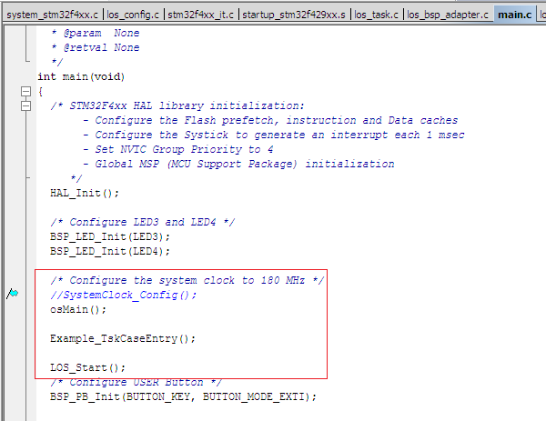

然后编译，编译时会提示PendSV_Handler()和SysTick_Handler()重复定义，解决办法是
直接将stm32f4xx_it.c中这两个接口的实现去掉或者#if 0掉。

完成之后再次编译，这样就OK了。之后再调试运行就可以看到LED3和LED4会亮灭交替变化。

- 注意：LOS_Start();执行就开启了时钟中断以及进程调度，LOS_Start();之后的代码都是不会执行的。

## 其他说明
目前git上提供的代码中直接提供了IAR和Keil的示例工程，可以直接用来进行参考。代码中关于时钟的设置都是开发板的复位后的默认时钟配置。

