## 1关于本文档的开源协议说明
**您可以自由地：**

**分享** 

- 在任何媒介以任何形式复制、发行本文档

**演绎** 

- 修改、转换或以本文档为基础进行创作。只要你遵守许可协议条款，许可人就无法收回你的这些权利。

**惟须遵守下列条件：**

**署名** 

- 您必须提供适当的证书，提供一个链接到许可证，并指示是否作出更改。您可以以任何合理的方式这样做，但不是以任何方式表明，许可方赞同您或您的使用。

**非商业性使用** 

- 您不得将本作品用于商业目的。

**相同方式共享** 

- 如果您的修改、转换，或以本文档为基础进行创作，仅得依本素材的
授权条款来散布您的贡献作品。

**没有附加限制** 

- 您不能增设法律条款或科技措施，来限制别人依授权条款本已许可的作为。

**声明：**

-  当您使用本素材中属于公众领域的元素，或当法律有例外或限制条款允许您的使用，
则您不需要遵守本授权条款。

- 未提供保证。本授权条款未必能完全提供您预期用途所需要的所有许可。例如：形象
权、隐私权、著作人格权等其他权利，可能限制您如何使用本素材。

**注意**

- 为了方便用户理解，这是协议的概述. 可以访问网址 https://creativecommons.org/licenses/by-sa/3.0/legalcode 了解完整协议内容.

## 2前言
### 目的
本文档介绍基于Huawei LiteOS如何移植到第三方开发板，并成功运行基础示例。
### 读者对象
本文档主要适用于Huawei LiteOS Kernel的开发者。
本文档主要适用于以下对象：

- 物联网端软件开发工程师

- 物联网架构设计师

### 符号约定
在本文中可能出现下列标志，它们所代表的含义如下。

     用于警示紧急的危险情形，若不避免，将会导致人员死亡或严重的人身伤害

    用于警示潜在的危险情形，若不避免，可能会导致人员死亡或严重的人身伤害

    用于警示潜在的危险情形，若不避免，可能会导致中度或轻微的人身伤害

     用于传递设备或环境安全警示信息，若不避免，可能会导致设备损坏、数据丢失、设备性能降低或其它不可预知的结果“注意”不涉及人身伤害

| 说明	|		“说明”不是安全警示信息，不涉及人身、设备及环境伤害信息	|

### 修订记录
修改记录累积了每次文档更新的说明。最新版本的文档包含以前所有文档版本的更新
内容。

<table>
	<tr>
	<td>日期</td>
	<td>修订版本</td>
	<td>描述</td>
	</tr>
	<tr>
	<td>2017年04月30日</td>
	<td>1.0</td>
	<td>完成初稿</td>
	</tr>
</table>

## 3概述

目前在github上已开源的Huawei LiteOS内核源码已适配好STM32F412、STM32F429、STM32L476、GD32F450、GD32F190芯片，本手册将以SAM4SD32C芯片为例，介绍基于Cortex M4核芯片的移植过程

## 4环境准备
基于Huawei LiteOS Kernel开发前，我们首先需要准备好单板运行的环境，包括软件环
境和硬件环境。
硬件环境：

<table>
	<tr>
	<td>所需硬件</td>
	<td>描述</td>
	</tr>
	<tr>
	<td>ATSAM4S-XPRO单板</td>
	<td>ATMEL开发板(芯片型号SAM4SD32C)</td>
	</tr>
	<tr>
	<td>PC机</td>
	<td>用于编译、加载并调试镜像</td>
	</tr>
	<tr>
	<td>电源（5v）</td>
	<td>开发板供电(使用Mini USB连接线)</td>
	</tr>
</table>

软件环境：

<table>
	<tr>
	<td>软件</td>
	<td>描述</td>
	</tr>
	<tr>
	<td>Window 7 操作系</td>
	<td>安装Keil的操作系统</td>
	</tr>
	<tr>
	<td>Keil(5.18以上版本)</td>
	<td>用于编译、链接、调试程序代码
	uVision V5.18.0.0 </td>
	</tr>
</table>

**说明**

Keil工具需要开发者自行安装，开发板的调试器是为板载调试器，连接USB时自动安装驱动程序

## 5获取Huawei LiteOS 源码

首先我们需要通过网络下载获取Huawei LiteOS开发包。目前Huawei LiteOS的代码已经
开源，可以直接从网络上获取，步骤如下：

- 仓库地址是https://github.com/LITEOS/LiteOS_Kernel.git 

- 点击”clone or download”按钮,下载源代码

- 目录结构如下：Huawei LiteOS的源代码目录的各子目录包含的内容如下：

关于代码树中各个目录存放的源代码的相关内容简介如下：

<table>
<tr>
	<td>一级目录</td>
	<td>二级目录</td>
	<td>说明</td>
</tr>
<tr>
	<td>doc</td>
	<td></td>
	<td>此目录存放的是LiteOS的使用文档和API说明文档</td>
</tr>
<tr>
	<td>example</td>
	<td>api</td>
	<td>此目录存放的是内核功能测试用的相关用例的代码</td>
</tr>
<tr>
	<td></td>
	<td>include</td>
	<td>aip功能头文件存放目录</td>
</tr>
<tr>
	<td>kernel</td>
	<td>base</td>
	<td>此目录存放的是与平台无关的内核代码，包含核心提供给外部调用的接口的头文件以及内核中进程调度、进程通信、内存管理等等功能的核心代码。用户一般不需要修改此目录下的相关内容。</td>
</tr>
<tr>
	<td></td>
	<td>cmsis</td>
	<td>LiteOS提供的cmsis接口</td>
</tr>
<tr>
	<td></td>
	<td>config</td>
	<td>此目录下是内核资源配置相关的代码，在头文件中配置了LiteOS所提供的各种资源所占用的内存池的总大小以及各种资源的数量，例如task的最大个数、信号量的最大个数等等</td>
</tr>
<tr>
	<td></td>
	<td>cpu</td>
	<td>此目录以及以下目录存放的是与体系架构紧密相关的适配LiteOS的代码。比如目前我们适配了arm/cortex-m4及arm/cortex-m3系列对应的初始化内容。</td>
</tr>
<tr>
	<td></td>
	<td>include</td>
	<td>内核的相关头文件存放目录</td>
</tr>
<tr>
	<td></td>
	<td>link</td>
	<td>IDE相关宏定义</td>
</tr>
<tr>
	<td>platform</td>
	<td>GD32F190R-EVAL</td>
	<td>GD190开发板systick及驱动相关代码</td>
</tr>
<tr>
	<td></td>
	<td>GD32F450i-EVAL</td>
	<td>GD450开发板systick及驱动相关代码</td>
</tr>
<tr>
	<td></td>
	<td>STM32F412ZG-NUCLEO</td>
	<td>STM32F412开发板systick及驱动相关代码</td>
</tr>
<tr>
	<td></td>
	<td>STM32F429I_DISCO</td>
	<td>STM32F429开发板systick及驱动相关代码</td>
</tr>
<tr>
	<td></td>
	<td>STM32L476RG_NUCLEO</td>
	<td>STM32L476开发板systick及驱动相关代码</td>
</tr>
<tr>
	<td></td>
	<td>LOS_EXPAND_XXX</td>
	<td>用于新扩展的开发板systick以及led、uart、key驱动bsp适配代码</td>
</tr>
<tr>
	<td>projects</td>
	<td>STM32F412ZG-NUCLEO-KEIL</td>
	<td>stm32f412开发板的keil工程目录</td>
</tr>
<tr>
	<td></td>
	<td>STM32F429I_DISCO_IAR</td>
	<td>stm32f429开发板的iar工程目录</td>
</tr>
<tr>
	<td></td>
	<td>STM32F429I_DISCO_KEIL</td>
	<td>stm32f429开发板的keil工程目录</td>
</tr>
<tr>
	<td></td>
	<td>STM32L476R-NUCLEO-KEIL</td>
	<td>stm32l476开发板的keil工程目录</td>
</tr>
<tr>
	<td></td>
	<td>GD32F190R-EVAL-KEIL</td>
	<td>gd32f190开发板的keil工程目录</td>
</tr>
<tr>
	<td></td>
	<td>GD32F450i-EVAL-KEIL</td>
	<td>gd32f450开发板的keil工程目录</td>
</tr>
<tr>
	<td>user</td>
	<td></td>
	<td>此目录存放用户代码，LiteOS启动代码在mian()函数中</td>
</tr>
</table>

获取Huawei LiteOS源代码之后，我们可以将自己本地已有工程的代码适配到LiteOS内核工程中进行应用开发。

## 6如何适配LiteOS内核工程开发
本章节描述的内容以ATSAM4S-XPRO开发板为基础，适配到LiteOS的ATSAM4S-XPRO-KEIL工程中，演示串口输出、按键响应及LED点亮功能。

### ATSAM4S-XPRO的开发资料获取
- 从http://www.atmel.com/zh/cn/devices/ATSAM4SD32C.aspx下载相关资料
- 从网络获取开发资源

### ATSAM4S-XPRO的开发工具安装
- 安装keil 5.18或者以上版本
- 安装Keil.SAM4_DFP.1.6.0或者更高版本的pack文件到keil安装目录
- 相关资源可以从http://www.keil.com/dd2/atmel/atsam4sd32c/下载

### Keil开发环境搭建与裸机驱动编写

1.在最新的Keil5环境中，器件以pack形式管理，在开发前，我们需要先安装对应pack，所以先去keil官网搜索MCU相关信息，查找相关资源；

[http://www.keil.com/dd2/atmel/atsam4sd32c/](http://www.keil.com/dd2/atmel/atsam4sd32c/ "atsam4sd32c")

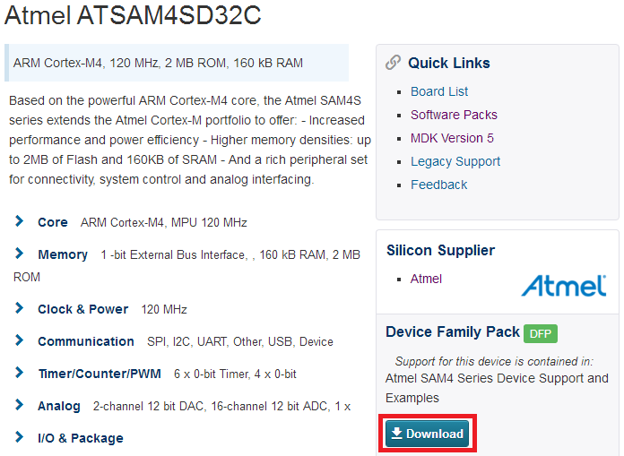

点击download下载安装即可，安装后效果如下：

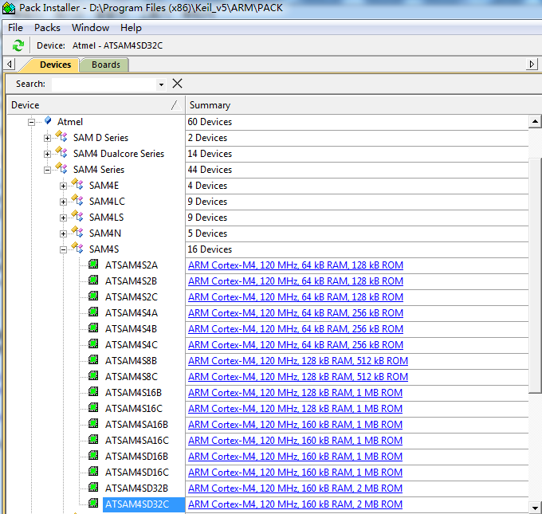

2.接下来就可以创建新的工程了

project->New uVision Project...->工程路径及工程名->选择器件：ATSAM4SD32C->选择包：CMSIS+DEVICE

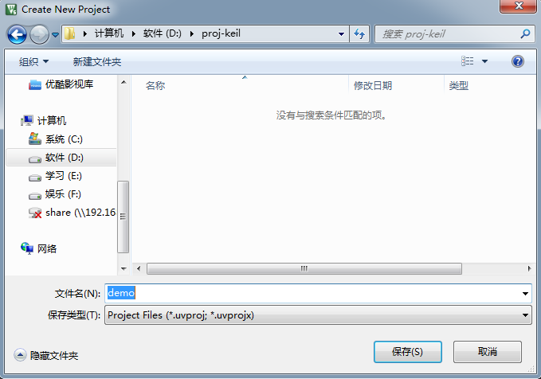

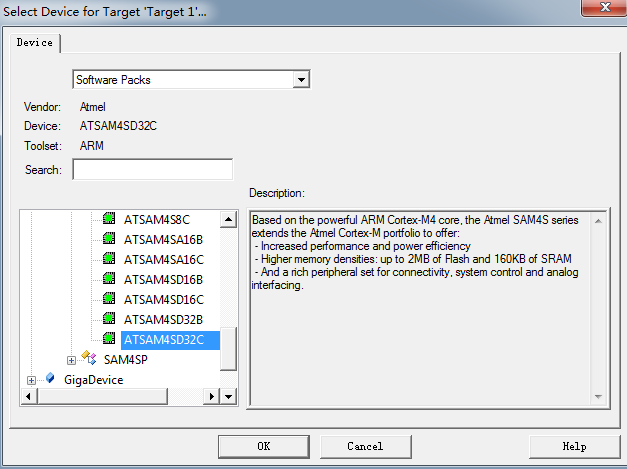

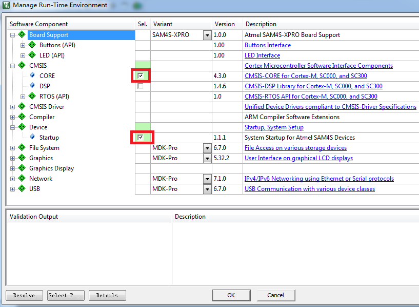

整个过程完成后，我们可以看到如下工程目录树：

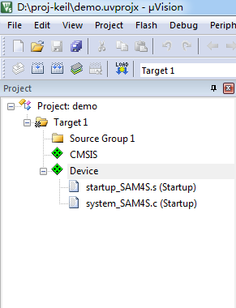

可以看到启动汇编文件和系统函数C文件已经加入，我们再加入main函数，完成入门实验：点亮LED

3.点亮LED灯

新建main.c systick.c led.c文件，源码如下：

main.c:

<pre>
#include "sam4s.h"
#include "systick.h"
#include "led.h"

int main(void)
{
	SystemInit();
	SystemCoreClockUpdate();
	SysTick_Config(SystemCoreClock/1000); //1ms
	
	LED_Init();
	
	while(1)
	{
		LED_On();
		delay_ms(500);
		LED_Off();
		delay_ms(500);
	}
}
</pre>

systick.c:

<pre>
#include "sam4s.h"                    
#include "systick.h" 

static volatile unsigned int TIME_DELAY=0;

void delay_ms(unsigned int n)
{
  TIME_DELAY = n;
  while(TIME_DELAY != 0x00);
}

void SysTick_Handler()
{
   if(TIME_DELAY !=0x00 )
    {
        TIME_DELAY--;
    }
}
</pre>

led.c:

<pre>
#include "sam4s.h"                    
#include "led.h"                 

void LED_Init(void) 
{
  PMC->PMC_WPMR = 0x504D4300;             /* Disable write protect            */

  PMC->PMC_PCER0 = (1UL << ID_PIOC);      /* enable PIOC clock                */

  PIOC->PIO_PER  =
  PIOC->PIO_OER  =
  PIOC->PIO_PUDR =
  PIOC->PIO_OWER = (PIO_PC23);            /* Setup PC23 for LEDs              */
	
  LED_Off();

  PMC->PMC_WPMR = 0x504D4301;             /* Enable write protect             */
}

void LED_On(void)
{
    PIOC->PIO_CODR = PIO_PC23;
}

void LED_Off(void)
{
    PIOC->PIO_SODR = PIO_PC23;
}
</pre>

最终效果如下：

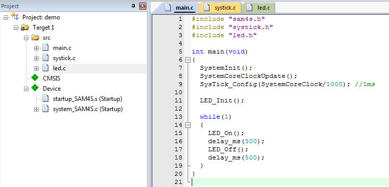

以上程序中时钟部分是Keil的Device中system_SAM4S.c已经写好的，LED相关的PIO寄存器操作需要参考上面提到的ASF或者pack中自带的LED例程，也就是选择CMSIS的时候勾选Board Support，学习其源码。

4.编译无误后，通过USB插到开发板DEBUG_USB口，等待板载仿真器安装驱动后，进行如下设置：

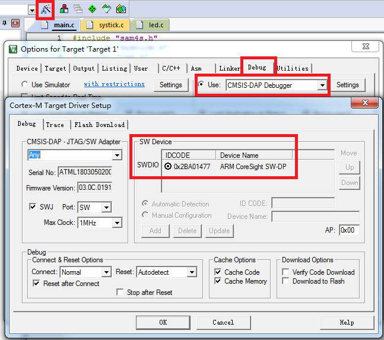

选择CMSIS-DAP仿真器，可以发现仿真器信息已经自动识别。

5.下载程序，LED点亮了呢...

6.在此基础之上，再依次编写key和uart的驱动程序完成测试，最终有如下工程结构

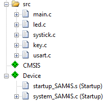

PS：相关驱动源码已打包放在 platform\ATSAM4S-XPRO 目录下

### 添加代码到LiteOS工程

**在此之前，我们已完成环境搭建与LED，KEY，UART的裸机驱动程序编写，接下来移植LiteOS**

1.相关文件、目录准备

- 在project目录下新建工程文件夹ATSAM4S-XPRO-KEIL存放工程文件
- 在platform目录下新建平台文件夹ATSAM4S-XPRO存放驱动文件

由于已有相关平台的移植可以参考，为快速进行，这里以相近M4F内核的GD32F450为参考，直接拷贝对应文件到上面创建的文件夹，后面再做修改，也就是说：

先直接拷贝 platform\GD32F450i-EVAL 目录下的 los_bsp_xxx.c/los_bsp_xxx.h/los_startup_xxx.s 等文件到 platform\ATSAM4S-XPRO 目录下，相关文件(.sct)重命名，后面再修改具体内容，如下图所示：

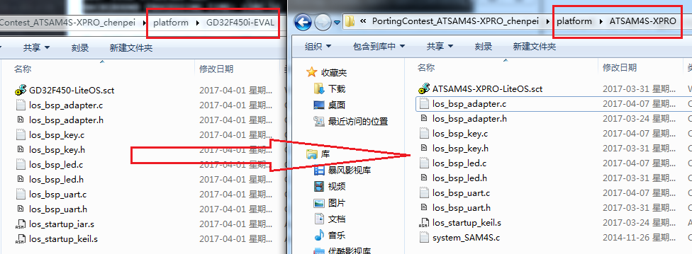

2.新建工程

参考各已有工程的文件组织结构，新建工程，添加对应文件，最终形成如下工程代码目录结构：

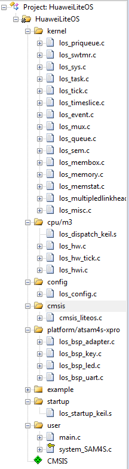

下面就一些问题说明：

- 因为LiteOS已经包含系统启动最小实现los_startup_keil.s，所以不需要pack的Device了，只保留CMSIS
- user下的system_SAM4S.c是从keil安装目录下Keil.SAM4_DFP.1.6.0的目录下面拷贝出来的，存放在platform下对应我开发板文件夹ATSAM4S-XPRO-KEIL了，之所添加这个文件是因为我想使用SystemInit这个函数配置系统时钟，而不是用MCU默认的时钟，如果使用默认时钟不要这个文件也是可以的
- SAM4SD32C是Cortex-M4内核，然而我却使用的cpu/m3/los_dispatch_keil.s是因为这颗U不带FPU，而最新LiteOS内核代码结构调整，m4对应los_dispatch_keil.s使用了几个浮点汇编指令，所以编译不过，只能使用m3的，进一步说，不带浮点的话m3和m4基本是一样的，这一点也和华为LiteOS的工程师沟通过，为了不改动原有LiteOS代码，所以综合评估后使用m3的，在此申明！

关于是否能够使用浮点功能，在Keil中看有没有这个选项：

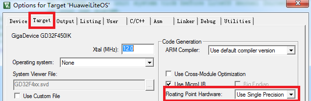

3.添加头文件搜索路径

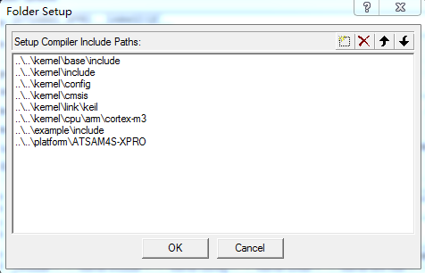

4.添加编译宏选项

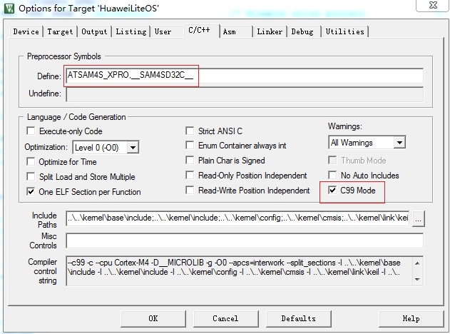

用到的宏定义有：ATSAM4S_XPRO,__SAM4SD32C__，ATSAM4S_XPRO用用于外设驱动程序，__SAM4SD32C__是sam4s.h需要以包含真正的头文件sam4sd32c.h

5.修改时钟相关配置

本工程中SystemInit函数会配置系统时钟到96MHz，我们需要修改LiteOS的时钟与之一致

- 1.在los_config.h中大致57行位置修改#define OS_SYS_CLOCK 96000000
- 2.在los_bsp_adapter.c中大致36行位置修改const unsigned int sys_clk_freq = 96000000

6.修改外设驱动

由于当前的驱动是直接拷贝的GD32F450i-EVAL的驱动，我们需要适配为自己的开发板驱动，根据已有的裸机驱动，直接替换函数实现即可

以los_bsp_key.c为例：

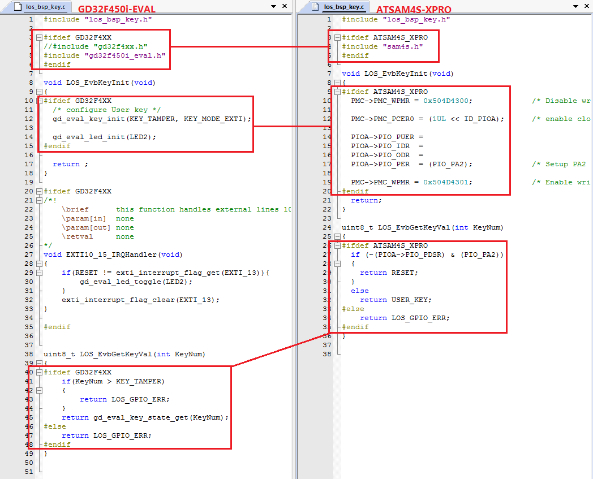

其余驱动完成类似替换即可...

分散加载文件(目前暂未使用)也完成如下修改，其中具体参数计算请自行搜索分散加载文件相关资料

FLASH 2048 KB // SRAM 160 KB

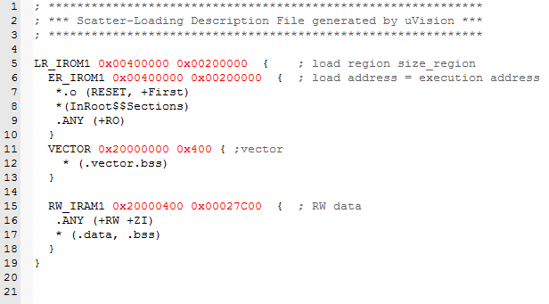

7.修改main函数

包含测试头文件： #include "los_inspect_entry.h"

配置时钟： SystemInit();

修改测试任务入口函数： LOS_Inspect_Entry();

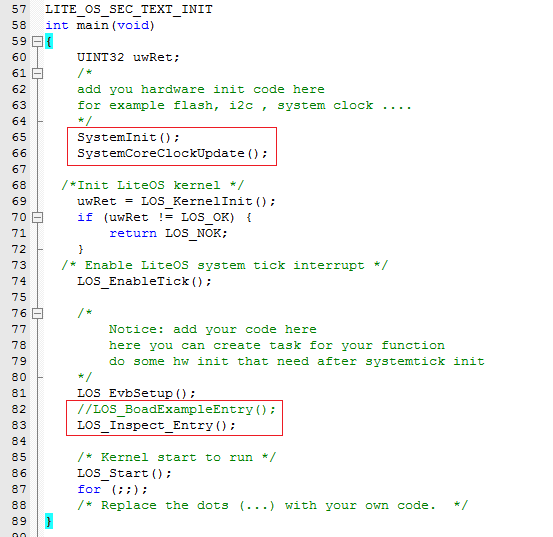

8.编译下载

经过上述步骤后就可以编译下载了，无误的话可以看到如下效果：

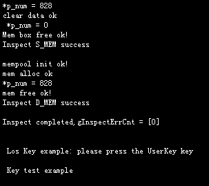

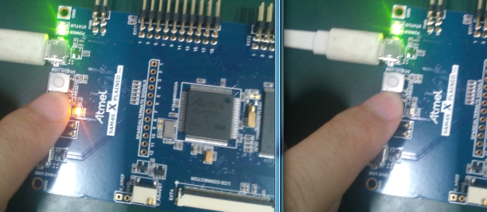

## 7 其他说明

###如何使用LiteOS 开发###

LiteOS中提供的功能包括如下内容： 任务创建与删除、任务同步（信号量、互斥锁）、动态中断注册机制等等内容，详细内容请参考《HuaweiLiteOSKernelDevGuide》。

###从零开始创建LiteOS工程###

目前在LiteOS的源代码的projects目录下已附带一些开发板的内核示例工程，用户可以直接使用，如果您所使用的开发板（芯片型号）与在示例工程中找不到，您可以从零开始创建LiteOS工程，创建流程请参考《LiteOS_Migration_Guide_Keil》。

###关于中断向量位置选择###

如果您需要使用LiteOS的中断注册机制，详细内容请参考《LiteOS_Migration_Guide_Keil》。

### kernel API测试代码 ###

如果您需要测试LiteOS内核工程运行情况，详细内容请参考《LiteOS_Migration_Guide_Keil》。