## 1关于本文档的开源协议说明
**您可以自由地：**

**分享** 

- 在任何媒介以任何形式复制、发行本文档

**演绎** 

- 修改、转换或以本文档为基础进行创作。只要你遵守许可协议条款，许可人就无法收回你的这些权利。

**惟须遵守下列条件：**

**署名** 

- 您必须提供适当的证书，提供一个链接到许可证，并指示是否作出更改。您可以以任何合理的方式这样做，但不是以任何方式表明，许可方赞同您或您的使用。

**非商业性使用** 

- 您不得将本作品用于商业目的。

**相同方式共享** 

- 如果您的修改、转换，或以本文档为基础进行创作，仅得依本素材的
授权条款来散布您的贡献作品。

**没有附加限制** 

- 您不能增设法律条款或科技措施，来限制别人依授权条款本已许可的作为。

**声明：**

-  当您使用本素材中属于公众领域的元素，或当法律有例外或限制条款允许您的使用，
则您不需要遵守本授权条款。

- 未提供保证。本授权条款未必能完全提供您预期用途所需要的所有许可。例如：形象
权、隐私权、著作人格权等其他权利，可能限制您如何使用本素材。

**注意**

- 为了方便用户理解，这是协议的概述. 可以访问网址 https://creativecommons.org/licenses/by-sa/3.0/legalcode 了解完整协议内容.

## 2前言
### 目的
本文档介绍基于Huawei LiteOS如何移植到第三方开发板，并成功运行基础示例。
### 读者对象
本文档主要适用于Huawei LiteOS Kernel的开发者。
本文档主要适用于以下对象：

- 物联网端软件开发工程师

- 物联网架构设计师

### 符号约定
在本文中可能出现下列标志，它们所代表的含义如下。

     用于警示紧急的危险情形，若不避免，将会导致人员死亡或严重的人身伤害

    用于警示潜在的危险情形，若不避免，可能会导致人员死亡或严重的人身伤害

    用于警示潜在的危险情形，若不避免，可能会导致中度或轻微的人身伤害

     用于传递设备或环境安全警示信息，若不避免，可能会导致设备损坏、数据丢失、设备性能降低或其它不可预知的结果“注意”不涉及人身伤害

| 说明	|		“说明”不是安全警示信息，不涉及人身、设备及环境伤害信息	|

### 修订记录
修改记录累积了每次文档更新的说明。最新版本的文档包含以前所有文档版本的更新
内容。

<table>
	<tr>
	<td>日期</td>
	<td>修订版本</td>
	<td>描述</td>
	</tr>
	<tr>
	<td>2017年4月28日</td>
	<td>1.0</td>
	<td>修正稿</td>
	</tr>
</table>

## 3概述

目前在github上已开源的Huawei LiteOS内核源码已适配好STM32F412、STM32F429、STM32L476、GD32F450、GD32F190、LPC824、LPC54114芯片，本手册将以ATSAMD21J18A芯片为例，介绍基于Cortex-M0+核芯片的移植过程。

## 4环境准备
基于Huawei LiteOS Kernel开发前，我们首先需要准备好单板运行的环境，包括软件环
境和硬件环境。
硬件环境：

<table>
	<tr>
	<td>所需硬件</td>
	<td>描述</td>
	</tr>
	<tr>
	<td>ATSAMD21单板</td>
	<td>ATSAMD21-XPRO评估板(芯片型号ATSAMD21J18A)</td>
	</tr>
	<tr>
	<td>PC机</td>
	<td>用于编译、加载并调试镜像</td>
	</tr>
	<tr>
	<td>电源（5v）</td>
	<td>开发板供电(使用Mini USB连接线)</td>
	</tr>
</table>

软件环境：

<table>
	<tr>
	<td>软件</td>
	<td>描述</td>
	</tr>
	<tr>
	<td>Window 7 操作系</td>
	<td>安装Keil的操作系统</td>
	</tr>
	<tr>
	<td>Keil 5</td>
	<td>用于编译、链接、调试程序代码 uVision V5.23.0.0 </td>
	</tr>
	<tr>
	<td>SAMD21 DFP</td>
	<td>关于SAMD21的PACK</td>
	</tr>
	<tr>
	<td>EDBG驱动</td>
	<td>EDBG驱动</td>
	</tr>
	<tr>
    <td>Atmel Studio 7</td>
	<td>ATMEL官方IDE</td>
	</tr>
</table>

**说明**

Keil工具需要开发者自行购买，EDBG驱动程序可以从网络获取，使用前请先安装。

## 5获取Huawei LiteOS 源码

首先我们从github上下载Huawei LiteOS内核源代码，步骤如下：

- 仓库地址是https://github.com/LITEOS/LiteOS_Kernel.git 

- 点击”clone or download”按钮,下载源代码

- 目录结构如下：Huawei LiteOS的源代码目录的各子目录包含的内容如下：

关于代码树中各个目录存放的源代码的相关内容简介如下：

<table>
<tr>
	<td>一级目录</td>
	<td>二级目录</td>
	<td>说明</td>
</tr>
<tr>
	<td>doc</td>
	<td></td>
	<td>此目录存放的是LiteOS的使用文档和API说明文档</td>
</tr>
<tr>
	<td>example</td>
	<td>api</td>
	<td>此目录存放的是内核功能测试用的相关用例的代码</td>
</tr>
<tr>
	<td></td>
	<td>include</td>
	<td>aip功能头文件存放目录</td>
</tr>
<tr>
	<td>kernel</td>
	<td>base</td>
	<td>此目录存放的是与平台无关的内核代码，包含核心提供给外部调用的接口的头文件以及内核中进程调度、进程通信、内存管理等等功能的核心代码。用户一般不需要修改此目录下的相关内容。</td>
</tr>
<tr>
	<td></td>
	<td>cmsis</td>
	<td>LiteOS提供的cmsis接口</td>
</tr>
<tr>
	<td></td>
	<td>config</td>
	<td>此目录下是内核资源配置相关的代码，在头文件中配置了LiteOS所提供的各种资源所占用的内存池的总大小以及各种资源的数量，例如task的最大个数、信号量的最大个数等等</td>
</tr>
<tr>
	<td></td>
	<td>cpu</td>
	<td>此目录以及以下目录存放的是与体系架构紧密相关的适配LiteOS的代码。比如目前我们适配了arm/cortex-m4及arm/cortex-m3系列对应的初始化内容。</td>
</tr>
<tr>
	<td></td>
	<td>include</td>
	<td>内核的相关头文件存放目录</td>
</tr>
<tr>
	<td></td>
	<td>link</td>
	<td>IDE相关宏定义</td>
</tr>
<tr>
	<td>platform</td>
	<td>GD32F190R-EVAL</td>
	<td>GD190开发板systick及驱动相关代码</td>
</tr>
<tr>
	<td></td>
	<td>GD32F450i-EVAL</td>
	<td>GD450开发板systick及驱动相关代码</td>
</tr>
<tr>
	<td></td>
	<td>STM32F412ZG-NUCLEO</td>
	<td>STM32F412开发板systick及驱动相关代码</td>
</tr>
<tr>
	<td></td>
	<td>STM32F429I_DISCO</td>
	<td>STM32F429开发板systick及驱动相关代码</td>
</tr>
<tr>
	<td></td>
	<td>STM32L476RG_NUCLEO</td>
	<td>STM32L476开发板systick及驱动相关代码</td>
</tr>
<tr>
	<td></td>
	<td>LOS_EXPAND_XXX</td>
	<td>用于新扩展的开发板systick以及led、uart、key驱动bsp适配代码</td>
</tr>
<tr>
	<td>projects</td>
	<td>STM32F412ZG-NUCLEO-KEIL</td>
	<td>stm32f412开发板的keil工程目录</td>
</tr>
<tr>
	<td></td>
	<td>STM32F429I_DISCO_IAR</td>
	<td>stm32f429开发板的iar工程目录</td>
</tr>
<tr>
	<td></td>
	<td>STM32F429I_DISCO_KEIL</td>
	<td>stm32f429开发板的keil工程目录</td>
</tr>
<tr>
	<td></td>
	<td>STM32L476R-NUCLEO-KEIL</td>
	<td>stm32l476开发板的keil工程目录</td>
</tr>
<tr>
	<td></td>
	<td>GD32F190R-EVAL-KEIL</td>
	<td>gd32f190开发板的keil工程目录</td>
</tr>
<tr>
	<td></td>
	<td>GD32F450i-EVAL-KEIL</td>
	<td>gd32f450开发板的keil工程目录</td>
</tr>
<tr>
	<td>user</td>
	<td></td>
	<td>此目录存放用户代码，LiteOS启动代码在main()函数中</td>
</tr>
</table>

获取Huawei LiteOS源代码之后，我们可以将自己本地工程的驱动代码适配到LiteOS内核工程中进行应用开发。

## 6如何适配LiteOS内核工程开发

### 创建工程
获取到LiteOS内核代码后，在project目录下新建文件夹ATSAMD21-XPRO-KEIL。重命名platform目录下的文件夹LOS_EXPAND_xxx为ATSAMD21-XPRO。
打开keil，新建工程，保存在project\LiteOS_Arduino_M0_Pro_Expand目录下，工程名为LiteOS，器件选择如下：

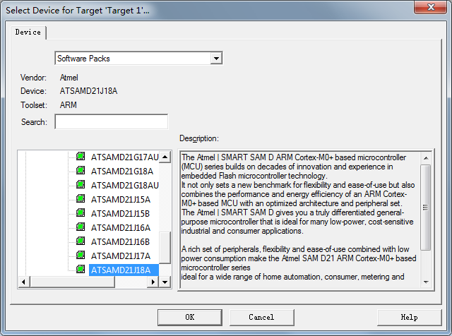

下一个界面，选择如下：

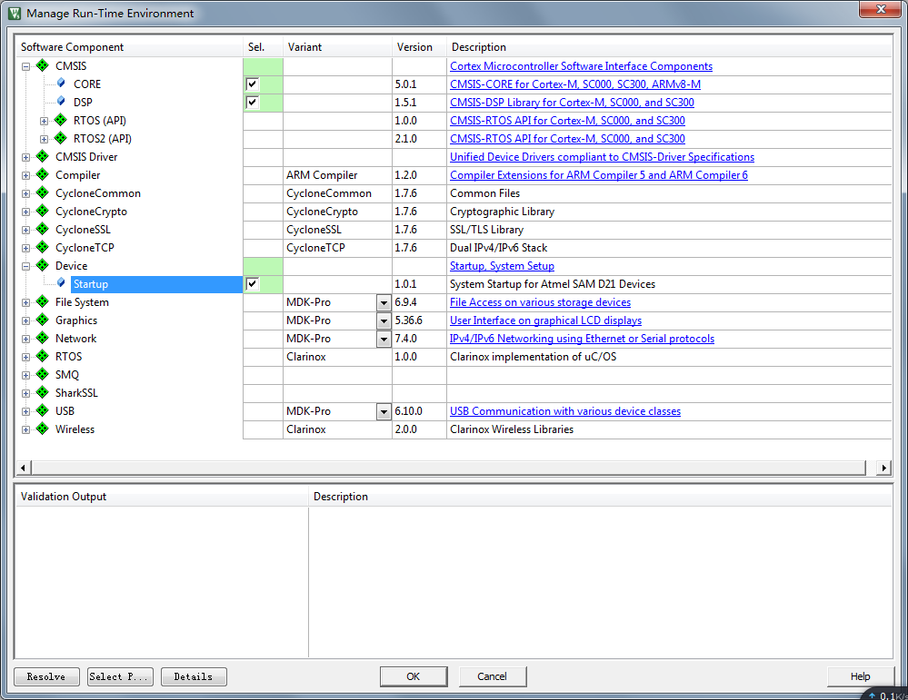

点击OK即可，至此，我们的工程已经创建完成。

### 添加kernel代码到工程
创建如下目录层级：

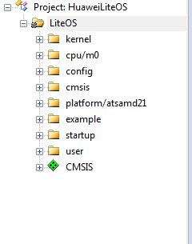

创建完成目录树之后我们添加源代码到目录树中，最终添加完成的内容如下：

- 将kernel/base目录下的所有C文件添加到工程中的kernel下
- 将kernel/cmsis目录下的所有C文件添加到工程中的cmsis下。
- 将platform\ATSAMD21-XPRO目录下的所有C文件添加到工程中的platform/atsamd21下
- 根据芯片内核型号，将kernel\cpu\arm\cortex-m0目录下的所有C文件以及汇编代码添加到工程中的cpu/m0下，除了los_vector.s
- 将kernel\config目录下的所有C文件添加到工程中的config下
- 将user目录下的所有C文件添加到工程中的user下
- 添加example/api目录下的所有C文件到工程的example目录下

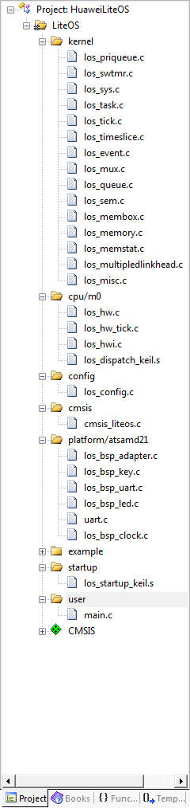

### 配置工程属性
打开配置文件，如下，在Target界面勾选上“Use MicroLIB”：

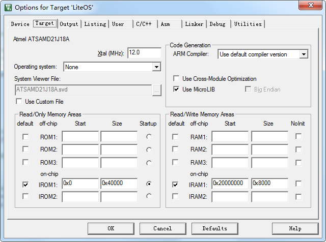

点击“Include Paths”后面的省略号，添加如下头文件路径：

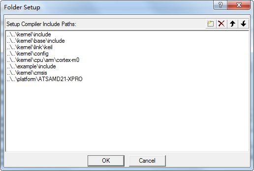

在Debugger界面，设置如下，大部分都是默认，只有右上角的Use，选择CMSIS-DAP Debugger。

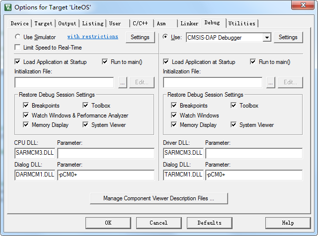

## 8 适配驱动代码

### 修改时钟参数

修改los_bsp_adapter.c中如下：

`const unsigned int sys_clk_freq = 16000000;`

改为如下：

`const unsigned int sys_clk_freq = 48000000;`

### 修改系统时钟接口
参考网络上ATSAMD21时钟初始化的文章：http://bbs.eeworld.com.cn/thread-448782-1-1.html及Atmel Studio样例工程：
新增los_bsp_clock.c文件，修改设置芯片时钟为48MHz:

`
int SystemClockInit(void) {		
　　_system_clock_source_setting();		
　　_system_clock_dfll_setting();		
　　_system_clock_gclkgen_setting();		
　　return 0;		
}`

### 修改串口初始化接口
参考Atmel Studio样例程序的串口初始化：
	Quick Start for the SAM D20/D21 SERCOM USART Driver (Callback) – SAM D21 Xplained Pro
新增uart.c文件，增加串口初始化及读写函数：
其中UART初始化函数如下，由于使用的是SERCOM3，参数为N 8 1，波特率9600：

UART读写函数如下：

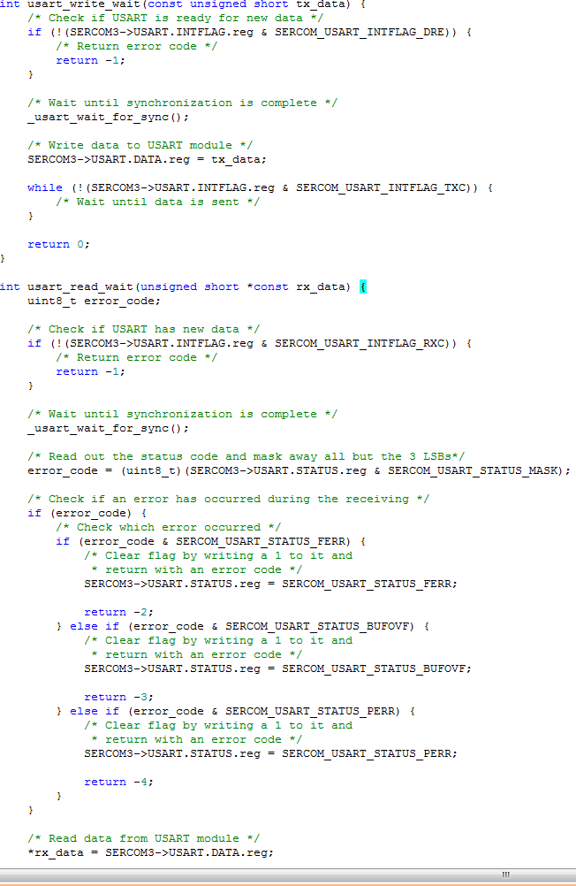

随后还有一些重定向函数，定义了之后可以使用printf直接从串口输出数据。

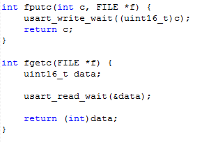

### 修改los_bsp_led.c

Xplained Pro开发板上的LED灯，对应ATSAMD21J18A的PB30，所以此处设置LED的初始化函数如下，其中设置PB30为输出口：

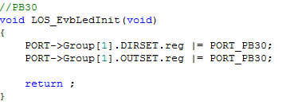

因为只控制这一个LED，所以修改其控制函数如下，PB30为低电平的时候，L灯亮，反之，L灯灭：

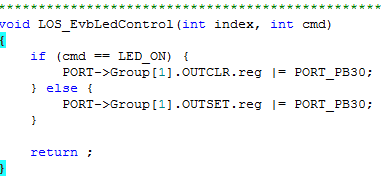

### 修改los_bsp_key.c

Xplained Pro开发板上有一个复位按键和一个用户按键，用户按键对应PA15，其初始化函数如下：

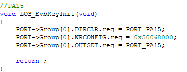

## 修改LiteOS部分代码
在测试的时候发现Example_MsgQueue这个测试始终通过不了，

`/*队列Write*/		
*((UINT32 *)pucQueueNode) = (UINT32)pBufferAddr;`

改为如下：

`/*队列Write*/		
for(i=0; i<uwBufferSize; i++) {		
　　UINT8 *ptData = (UINT8 *)pBufferAddr;		
　　pucQueueNode[i] = ptData[i];	
}	
pucQueueNode[uwBufferSize] = 0;`

`/*队列Read*/		
*(UINT32*)pBufferAddr = *(UINT32*)(pucQueueNode);`

改为如下：

`/*队列Read*/		
*(UINT32*)pBufferAddr = (UINT32)pucQueueNode;`

在los_config.h中，做相应配置：		
`#define OS_SYS_CLOCK                                    16000000`		
改为：		
`#define OS_SYS_CLOCK                                    48000000`		

`#define OS_SYS_MEM_SIZE                                     0x00008000          // size`		
改为：		
`#define OS_SYS_MEM_SIZE                                     0x00007400          // size`

### main函数修改

修改main函数如下，其中调用巡检函数LOS_Inspect_Entry：

`/*****************************************************************************		
 Function    : main		
 Description : Main function entry		
 Input       : None		
 Output      : None		
 Return      : None		
 *****************************************************************************/		
int main(void)		
{		
　　UINT32 uwRet;		
　　uwRet = LOS_KernelInit();		
　　if (uwRet != LOS_OK) {		
　　　　return LOS_NOK;		
　　}		
　　LOS_EnableTick();		
　　LOS_EvbSetup();		
　　LOS_Inspect_Entry();		
　　LOS_Start();		
　　for (;;);		
}`

### 验证移植后的工程

连接Xplained Pro开发板的Programmer接口到计算机，在计算机上会出现一个EDBG虚拟串口的设备，keil编译、下载，打开串口调试工具，选择出现的EDBG虚拟串口，速率选择为9600，然后按下Xplained Pro开发板上的复位按钮，会显示如下结果，表示巡检程序运行正常：

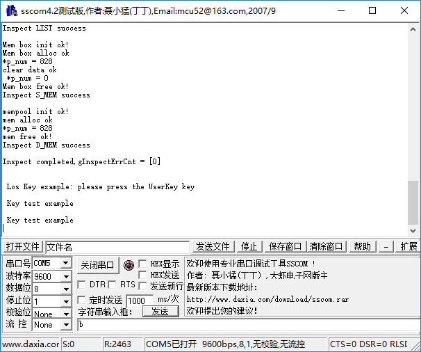

- 从Atmel官网获取Atmel Stduio，网址为：http://www.atmel.com/zh/cn/tools/atmelstudio.aspx?tab=overview

- 从开发板官网获取开发板资料，网址为：http://www.microchip.com/wwwproducts/en/atsamd21j18

- 从keil官网下载PACK包，网址为：http://www.keil.com/dd2/atmel/atsamd21j18a/
