## 1关于本文档的开源协议说明
**您可以自由地：**

**分享** 

- 在任何媒介以任何形式复制、发行本文档

**演绎** 

- 修改、转换或以本文档为基础进行创作。只要你遵守许可协议条款，许可人就无法收回你的这些权利。

**惟须遵守下列条件：**

**署名** 

- 您必须提供适当的证书，提供一个链接到许可证，并指示是否作出更改。您可以以任何合理的方式这样做，但不是以任何方式表明，许可方赞同您或您的使用。

**非商业性使用** 

- 您不得将本作品用于商业目的。

**相同方式共享** 

- 如果您的修改、转换，或以本文档为基础进行创作，仅得依本素材的
授权条款来散布您的贡献作品。

**没有附加限制** 

- 您不能增设法律条款或科技措施，来限制别人依授权条款本已许可的作为。

**声明：**

-  当您使用本素材中属于公众领域的元素，或当法律有例外或限制条款允许您的使用，
则您不需要遵守本授权条款。

- 未提供保证。本授权条款未必能完全提供您预期用途所需要的所有许可。例如：形象
权、隐私权、著作人格权等其他权利，可能限制您如何使用本素材。

**注意**

- 为了方便用户理解，这是协议的概述. 可以访问网址 https://creativecommons.org/licenses/by-sa/3.0/legalcode 了解完整协议内容.

## 2前言
### 目的
本文档介绍基于Huawei LiteOS如何移植到第三方开发板，并成功运行基础示例。
### 读者对象
本文档主要适用于Huawei LiteOS Kernel的开发者。
本文档主要适用于以下对象：

- 物联网端软件开发工程师

- 物联网架构设计师

### 符号约定
在本文中可能出现下列标志，它们所代表的含义如下。

     用于警示紧急的危险情形，若不避免，将会导致人员死亡或严重的人身伤害

    用于警示潜在的危险情形，若不避免，可能会导致人员死亡或严重的人身伤害

    用于警示潜在的危险情形，若不避免，可能会导致中度或轻微的人身伤害

     用于传递设备或环境安全警示信息，若不避免，可能会导致设备损坏、数据丢失、设备性能降低或其它不可预知的结果“注意”不涉及人身伤害

| 说明	|		“说明”不是安全警示信息，不涉及人身、设备及环境伤害信息	|

### 修订记录
修改记录累积了每次文档更新的说明。最新版本的文档包含以前所有文档版本的更新
内容。

<table>
	<tr>
	<td>日期</td>
	<td>修订版本</td>
	<td>描述</td>
	</tr>
	<tr>
	<td>2017年8月21日</td>
	<td>1.0</td>
	<td>修正稿</td>
	</tr>
</table>

## 3概述

本手册将以ATSAMR21G18A芯片为例，介绍基于Cortex-M0+核芯片的移植过程。

## 4环境准备
基于Huawei LiteOS Kernel开发前，我们首先需要准备好单板运行的环境，包括软件环
境和硬件环境。
硬件环境：

<table>
	<tr>
	<td>所需硬件</td>
	<td>描述</td>
	</tr>
	<tr>
	<td>ATSAMR21单板</td>
	<td>ATSAMR21-XPRO评估板(芯片型号ATSAMR21G18A)</td>
	</tr>
	<tr>
	<td>PC机</td>
	<td>用于编译、加载并调试镜像</td>
	</tr>
	<tr>
	<td>电源（5v）</td>
	<td>开发板供电(使用Mini USB连接线)</td>
	</tr>
</table>

软件环境：

<table>
	<tr>
	<td>软件</td>
	<td>描述</td>
	</tr>
	<tr>
	<td>Window 7 操作系</td>
	<td>安装Keil的操作系统</td>
	</tr>
	<tr>
	<td>Keil 5</td>
	<td>用于编译、链接、调试程序代码 uVision V5.23.0.0 </td>
	</tr>
	<tr>
	<td>SAMR21 DFP</td>
	<td>关于SAMR21的PACK</td>
	</tr>
	<tr>
	<td>EDBG驱动</td>
	<td>EDBG驱动</td>
	</tr>
	<tr>
    <td>Atmel Studio 7</td>
	<td>ATMEL官方IDE</td>
	</tr>
</table>

**说明**

Keil工具需要开发者自行购买，EDBG驱动程序可以从网络获取，使用前请先安装。

- 从Atmel官网获取Atmel Stduio，网址为：http://www.atmel.com/zh/cn/tools/atmelstudio.aspx?tab=overview

- 从开发板官网获取开发板资料，网址为：http://www.microchip.com

- 从keil官网下载PACK包，网址为：http://www.keil.com/dd2/atmel/atsamr21g18a/

## 5获取Huawei LiteOS 源码

首先我们从github上下载Huawei LiteOS内核源代码，步骤如下：

- 仓库地址是https://github.com/LITEOS/LiteOS_Kernel.git 

- 点击”clone or download”按钮,下载源代码

- 目录结构介绍，[请参考LiteOS_Code_Info.md](./doc/LiteOS_Code_Info.md)

获取Huawei LiteOS源代码之后，我们可以将自己本地工程的驱动代码适配到LiteOS内核工程中进行应用开发。

## 6创建Huawei LiteOS 工程

### 创建工程
获取到LiteOS内核代码后，在project目录下新建文件夹ATSAMR21-XPRO-KEIL。重命名platform目录下的文件夹LOS_EXPAND_xxx为ATSAMR21-XPRO。
打开keil，新建工程，保存在project\ATSAMR21-XPRO-KEIL目录下，工程名为HuaweiLiteOS，器件选择如下：

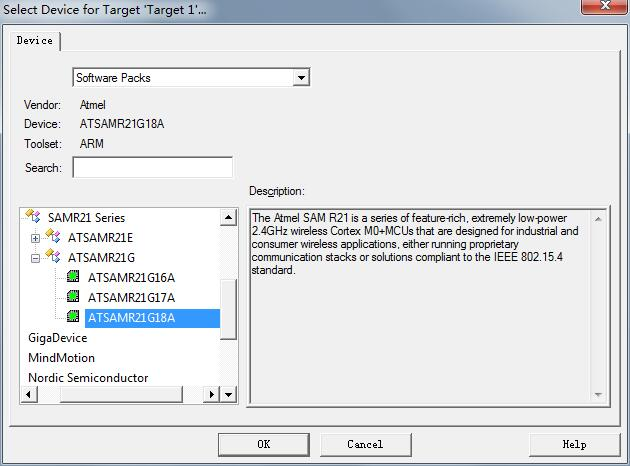

下一个界面，选择如下：

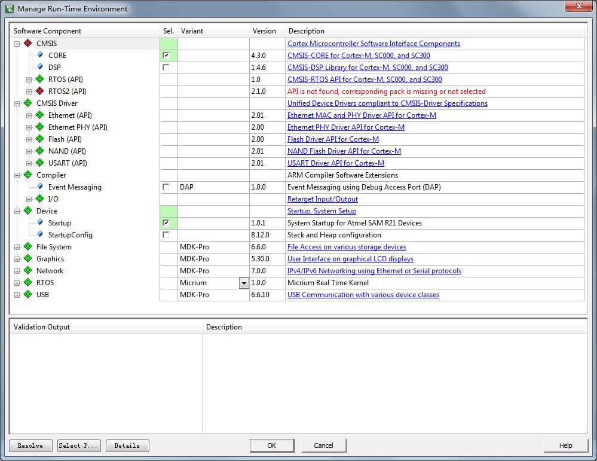

点击OK即可，至此，我们的工程已经创建完成。

### 添加kernel代码到工程
创建如下目录层级：

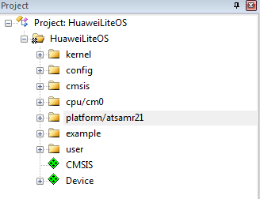

创建完成目录树之后我们添加源代码到目录树中，最终添加完成的内容如下：

- 将kernel/base目录下的所有C文件添加到工程中的kernel下
- 将kernel/cmsis目录下的所有C文件添加到工程中的cmsis下。
- 将platform\ATSAMR21-XPRO目录下的所有C文件添加到工程中的platform/atsamr21下
- 根据芯片内核型号，将kernel\cpu\arm\cortex-m0目录下的所有C文件以及汇编代码添加到工程中的cpu/m0下
- 将kernel\config目录下的所有C文件添加到工程中的config下
- 将user目录下的所有C文件添加到工程中的user下
- 添加example/api目录下的所有C文件到工程的example目录下

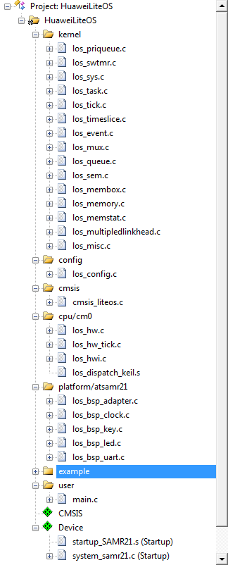

### 配置工程属性
打开配置文件，如下，在Target界面勾选上“Use MicroLIB”：

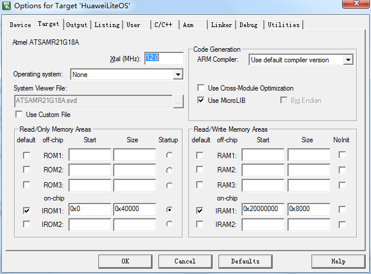

点击“Include Paths”后面的省略号，添加如下头文件路径：

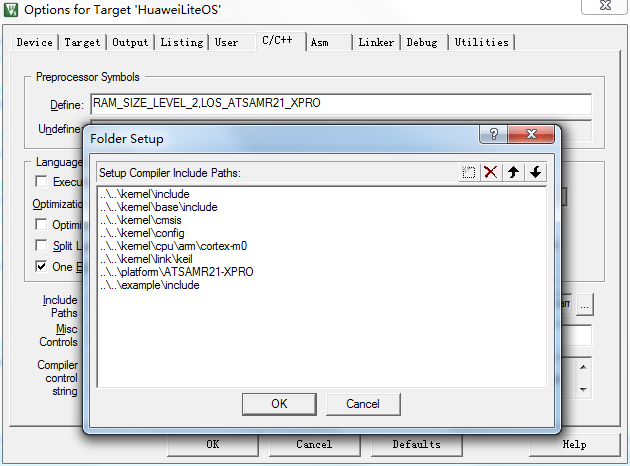

在Debugger界面，的Use选择CMSIS-DAP Debugger。

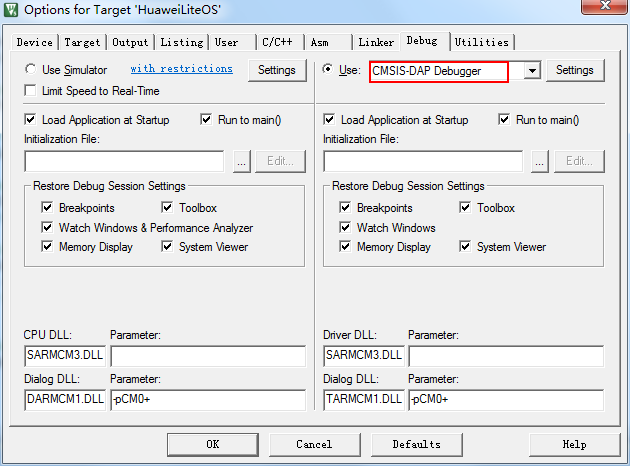

在C/C++界面配置相关宏定义如下：

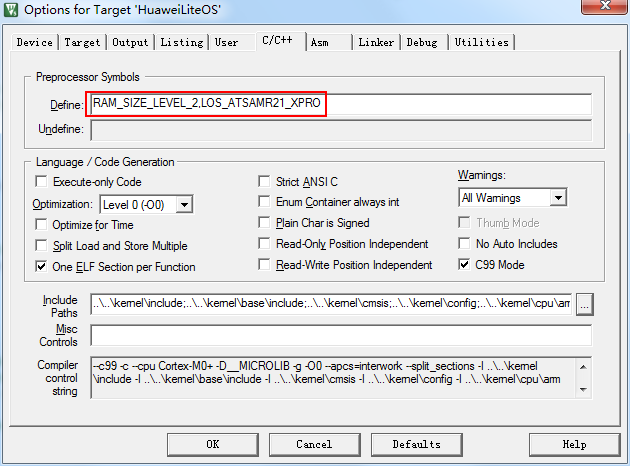

## 7适配驱动代码

### 修改时钟参数

修改los_bsp_adapter.c文件中sys_clk_freq如下：

`const unsigned int sys_clk_freq = 16000000;`

改为如下：

`const unsigned int sys_clk_freq = 48000000;`

### 修改系统时钟接口
参考Atmel Studio示例工程，新增los_bsp_clock.c文件，修改设置芯片时钟为48MHz:

	int SystemClockInit(void) {		
	　　_system_clock_source_setting();		
	　　_system_clock_dfll_setting();		
	　　_system_clock_gclkgen_setting();		
	　　return 0;		
	}

### 修改串口初始化接口
参考Atmel Studio样例程序的串口初始化：
	Quick Start for the SAM SERCOM USART Driver (Callback) – SAM R21 Xplained Pro
在los_bsp_uart.c文件中增加串口初始化及读写函数：
其中UART初始化函数如下，由于使用的是SERCOM3，参数为N 8 1，波特率9600：

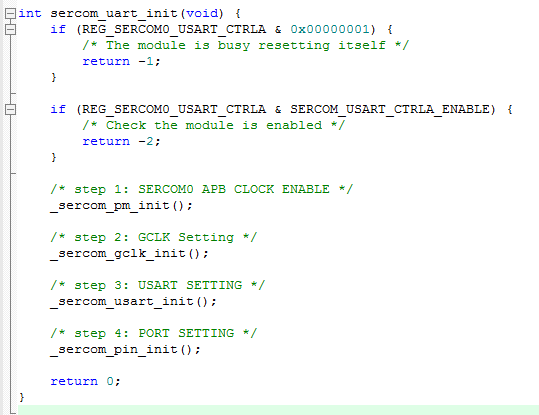

UART读写函数如下：

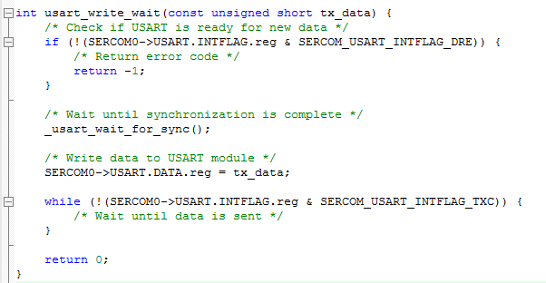

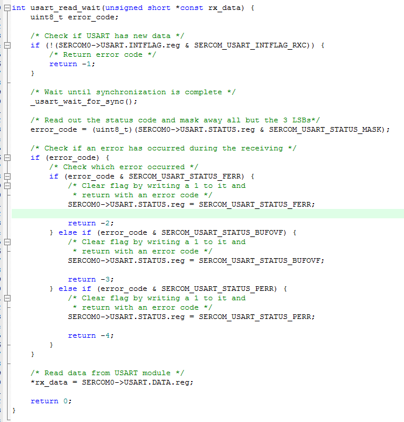

随后还有一些重定向函数，定义了之后可以使用printf直接从串口输出数据。

	int fputc(int ch, FILE *f)
	{
	    LOS_EvbUartWriteByte((char)ch);
	
	    return (ch);
	}

### 修改los_bsp_led.c

Xplained Pro开发板上的LED灯为PA19，所以此处设置LED的初始化函数如下，设置PA19为输出口：

	void LOS_EvbLedInit(void)
	{
	    PORT->Group[0].DIRSET.reg |= PORT_PA19;
	    PORT->Group[0].OUTSET.reg |= PORT_PA19;
	    
	    return;
	}

PA28为低电平时LED灯亮，反之LED灯灭：

	void LOS_EvbLedControl(int index, int cmd)
	{
	    if (cmd == LED_ON) {
	        PORT->Group[0].DIRSET.reg |= PORT_PA19;
	        PORT->Group[0].OUTCLR.reg |= PORT_PA19;
	    } 
	    else {
	        PORT->Group[0].DIRSET.reg |= PORT_PA19;
	        PORT->Group[0].OUTSET.reg |= PORT_PA19;
	    }
	    
	    return;
	}

### 修改los_bsp_key.c

Xplained Pro开发板上有一个复位按键和一个用户按键，用户按键对应PA28，其初始化函数如下：

	void LOS_EvbKeyInit(void)
	{
	    PORT->Group[0].DIRCLR.reg |= PORT_PA28;
	    PORT->Group[0].WRCONFIG.reg |= 0xD0071000;
	    PORT->Group[0].OUTSET.reg |= PORT_PA28;
	    
	    return;
	}	

### main函数修改

修改main函数如下，其中调用巡检函数LOS_Inspect_Entry：

	int main(void)		
	{		
	　　UINT32 uwRet;		
	　　uwRet = LOS_KernelInit();		
	　　if (uwRet != LOS_OK) {		
	　　　　return LOS_NOK;		
	　　}		
	　　LOS_EnableTick();		
	　　LOS_EvbSetup();
		if (uwRet != LOS_OK) {
		        return LOS_NOK;
		    }		
	　　LOS_Inspect_Entry();		
	　　LOS_Start();		
	　　for (;;);		
	}

### 验证移植后的工程

连接Xplained Pro开发板的EDBG USB接口到计算机，keil编译、下载，打开串口调试工具，选择出现的EDBG虚拟串口，速率选择为9600，然后按下Xplained Pro开发板上的复位按钮（待巡检完成，按下SW0，LED灯亮），会显示如下结果，表示程序运行正常：

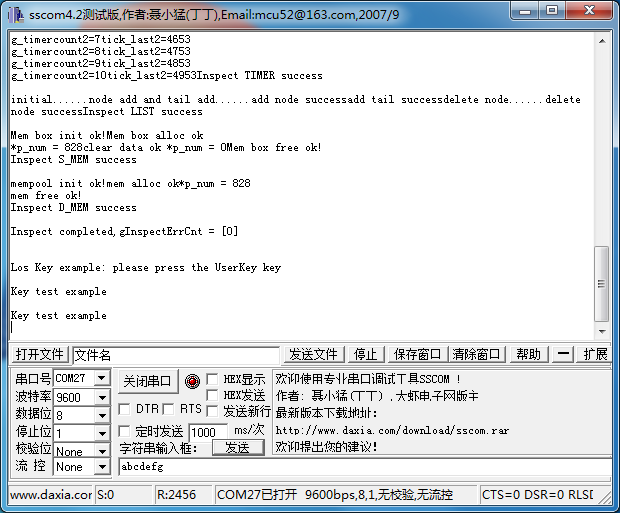
