## 1关于本文档的开源协议说明
**您可以自由地：**

**分享** 

- 在任何媒介以任何形式复制、发行本文档

**演绎** 

- 修改、转换或以本文档为基础进行创作。只要你遵守许可协议条款，许可人就无法收回你的这些权利。

**惟须遵守下列条件：**

**署名** 

- 您必须提供适当的证书，提供一个链接到许可证，并指示是否作出更改。您可以以任何合理的方式这样做，但不是以任何方式表明，许可方赞同您或您的使用。

**非商业性使用** 

- 您不得将本作品用于商业目的。

**相同方式共享** 

- 如果您的修改、转换，或以本文档为基础进行创作，仅得依本素材的
  授权条款来散布您的贡献作品。

**没有附加限制** 

- 您不能增设法律条款或科技措施，来限制别人依授权条款本已许可的作为。

**声明：**

-  当您使用本素材中属于公众领域的元素，或当法律有例外或限制条款允许您的使用，
  则您不需要遵守本授权条款。
  未提供保证。本授权条款未必能完全提供您预期用途所需要的所有许可。例如：形象
  权、隐私权、著作人格权等其他权利，可能限制您如何使用本素材。

**注意**

- 为了方便用户理解，这是协议的概述. 可以访问网址 https://creativecommons.org/licenses/by-sa/3.0/legalcode 了解完整协议内容.

## 2前言
### 目的
本文档介绍基于Huawei LiteOS如何移植到第三方开发板，并成功运行基础示例。
### 读者对象
本文档主要适用于Huawei LiteOS Kernel的开发者。
本文档主要适用于以下对象：
- 物联网端软件开发工程师
- 物联网架构设计师

### 符号约定
在本文中可能出现下列标志，它们所代表的含义如下。

     用于警示紧急的危险情形，若不避免，将会导致人员死亡或严重的人身伤害

    用于警示潜在的危险情形，若不避免，可能会导致人员死亡或严重的人身伤害

    用于警示潜在的危险情形，若不避免，可能会导致中度或轻微的人身伤害

     用于传递设备或环境安全警示信息，若不避免，可能会导致设备损坏、数据丢失、设备性能降低或其它不可预知的结果“注意”不涉及人身伤害

| 说明	|		“说明”不是安全警示信息，不涉及人身、设备及环境伤害信息	|

### 修订记录
修改记录累积了每次文档更新的说明。最新版本的文档包含以前所有文档版本的更新
内容。

<table>
	<tr>
	<td>日期</td>
	<td>修订版本</td>
	<td>描述</td>
	</tr>
	<tr>
	<td>2017年04月27日</td>
	<td>1.0</td>
	<td>完成初稿</td>
	</tr>
</table>

## 3环境准备
基于Huawei LiteOS Kernel开发前，我们首先需要准备好单板运行的环境，包括软件环
境和硬件环境。
硬件环境：

<table>
	<tr>
	<td>所需硬件</td>
	<td>描述</td>
	</tr>
	<tr>
	<td>EFM32-STK3700单板</td>
	<td>EFK32开发板(芯片型号EFM32GG990F1024)</td>
	</tr>
	<tr>
	<td>PC机</td>
	<td>用于编译、加载并调试镜像</td>
	</tr>
	<tr>
	<td>电源（5v）</td>
	<td>开发板供电(使用Mini USB连接线)</td>
	</tr>
</table>

软件环境：

<table>
	<tr>
	<td>软件</td>
	<td>描述</td>
	</tr>
	<tr>
	<td>Window 10 操作系统</td>
	<td>安装Keil和J-link的操作系统</td>
	</tr>
	<tr>
	<td>Keil(5.21以上版本)</td>
	<td>用于编译、链接、调试程序代码
	uVision V5.23.1.0 MDK-Lite uVersion:5.23a</td>
	</tr>
	<tr>
	<td>simplicity-studio</td>
	<td>芯片官方提供用于编译、链接、调试程序代码</td>
	</tr>
	<tr>
	<td>J-link_v2_usbdriver</td>
	<td>开发板与pc连接的驱动程序，用户加载及调试程序代码</td>
	</tr>
</table>

**说明**

>Keil工具需要开发者自行购买，板载的Jlink可以直接插上USB线进行调试。
>Keil获取路径：http://www2.keil.com/mdk5/editions/pro
>Keil可以申请一个月专业版试用，也可以申请4K编译限制版永久免费。
>EFM32GG990F1024的芯片文档：http://cn.silabs.com/products/mcu/32-bit/efm32-giant-gecko
>STK3700开发板文档:http://cn.silabs.com/products/development-tools/mcu/32-bit/efm32-giant-gecko-starter-kit
>simplicity-studio下载地址：http://cn.silabs.com/products/development-tools/software/simplicity-studio

## 4获取Huawei LiteOS 源码

首先我们需要通过网络下载获取Huawei LiteOS开发包。目前Huawei LiteOS的代码已经
开源，可以直接从网络上获取，步骤如下：

- 仓库地址是https://github.com/LITEOS/LiteOS_Kernel.git 
  

- 点击”clone or download”按钮,下载源代码

- 目录结构如下：Huawei LiteOS的源代码目录的各子目录包含的内容如下：
  

关于代码树中各个目录存放的源代码的相关内容简介如下：

<table>
<tr>
	<td>一级目录</td>
	<td>二级目录</td>
	<td>说明</td>
</tr>
<tr>
	<td>doc</td>
	<td></td>
	<td>此目录存放的是LiteOS的使用文档和API说明文档</td>
</tr>
<tr>
	<td>example</td>
	<td>api</td>
	<td>此目录存放的是内核功能测试用的相关用例的代码</td>
</tr>
<tr>
	<td></td>
	<td>include</td>
	<td>aip功能头文件存放目录</td>
</tr>
<tr>
	<td>kernel</td>
	<td>base</td>
	<td>此目录存放的是与平台无关的内核代码，包含核心提供给外部调用的接口的头文件以及内核中进程调度、进程通信、内存管理等等功能的核心代码。用户一般不需要修改此目录下的相关内容。</td>
</tr>
<tr>
	<td></td>
	<td>cmsis</td>
	<td>LiteOS提供的cmsis接口</td>
</tr>
<tr>
	<td></td>
	<td>config</td>
	<td>此目录下是内核资源配置相关的代码，在头文件中配置了LiteOS所提供的各种资源所占用的内存池的总大小以及各种资源的数量，例如task的最大个数、信号量的最大个数等等</td>
</tr>
<tr>
	<td></td>
	<td>cpu</td>
	<td>此目录以及以下目录存放的是与体系架构紧密相关的适配LiteOS的代码。比如目前我们适配了arm/cortex-m4及arm/cortex-m3系列对应的初始化内容。</td>
</tr>
<tr>
	<td></td>
	<td>include</td>
	<td>内核的相关头文件存放目录</td>
</tr>
<tr>
	<td></td>
	<td>link</td>
	<td>与IDE相关的编译链接相关宏定义</td>
</tr>
<tr>
	<td>platform</td>
	<td>GD32F190R-EVAL</td>
	<td>GD190开发板systick以及led、uart、key驱动bsp适配代码</td>
</tr>
<tr>
	<td></td>
	<td>GD32F450i-EVAL</td>
	<td>GD450开发板systick以及led、uart、key驱动bsp适配代码</td>
</tr>
<tr>
	<td></td>
	<td>STM32F412ZG-NUCLEO</td>
	<td>STM32F412开发板systick以及led、uart、key驱动bsp适配代码</td>
</tr>
<tr>
	<td></td>
	<td>STM32F429I_DISCO</td>
	<td>STM32F429开发板systick以及led、uart、key驱动bsp适配代码</td>
</tr>
<tr>
	<td></td>
	<td>STM32L476RG_NUCLEO</td>
	<td>STM32L476开发板systick以及led、uart、key驱动bsp适配代码</td>
</tr>
<tr>
	<td></td>
	<td>LOS_EXPAND_XXX</td>
	<td>用于新扩展的开发板systick以及led、uart、key驱动bsp适配代码</td>
</tr>
<tr>
	<td>projects</td>
	<td>STM32F412ZG-NUCLEO-KEIL</td>
	<td>stm32f412开发板的keil工程目录</td>
</tr>
<tr>
	<td></td>
	<td>STM32F429I_DISCO_IAR</td>
	<td>stm32f429开发板的iar工程目录</td>
</tr>
<tr>
	<td></td>
	<td>STM32F429I_DISCO_KEIL</td>
	<td>stm32f429开发板的keil工程目录</td>
</tr>
<tr>
	<td></td>
	<td>STM32L476R-NUCLEO-KEIL</td>
	<td>stm32l476开发板的keil工程目录</td>
</tr>
<tr>
	<td></td>
	<td>GD32F190R-EVAL-KEIL</td>
	<td>gd32f190开发板的keil工程目录</td>
</tr>
<tr>
	<td></td>
	<td>GD32F450i-EVAL-KEIL</td>
	<td>gd32f450开发板的keil工程目录</td>
</tr>
<tr>
	<td>user</td>
	<td></td>
	<td>此目录存放用户测试代码，LiteOS的初始化和使用示例在main.c中</td>
</tr>
</table>

获取Huawei LiteOS源代码之后，我们可以将自己本地已有工程的代码适配到LiteOS内核工程中进行应用开发。

## 5适配LiteOS内核工程开发
本章节描述的内容以STK3700官方提供的软件开发包中的driver为基础，适配到LiteOS的STK3700_LiteOS_KEIL工程中，演示内核的检查以及串口输出、按键中断及LED点亮功能。

### 获取STK3700软件开发包

- 在添加代码之前，首先需要从Silicon Labs的官网上面下载Simplicity Studio 软件套件。套件安装地址的`SiliconLabs\SimplicityStudio\v4\developer\sdks\gecko_sdk_suite\v1.0`中含有驱动和一些实例的程序。

- 获取内核代码。直接在内核代码的基础上建立工程。

### 新建一个STK3700-LiteOS-Keil工程

- 我们可以参考LiteOS官方提供的参考工程STM32F429-Keil为例，分析STM32F429的源代码工程，我们发现对于我们自己的工程需要单独修改的部分主要为`platform`和`project`下面的内容。如下图所示，在`platform`和`project`下面各建立了这样一个文件夹。

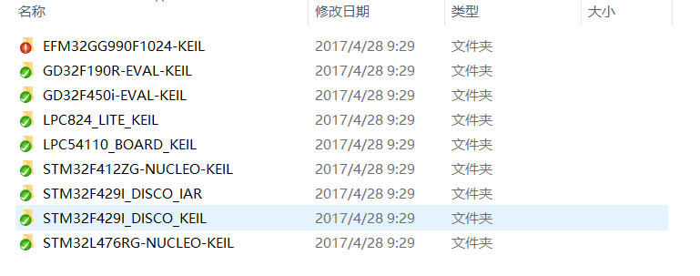

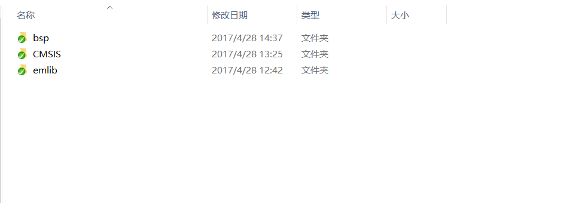

- 我们将Drivers以及应用代码拷贝到LiteOS的工程中，比如在LiteOS/platform目录下创建EFM32GG990F1024-KEIL目录，然后将Drivers目录拷贝到`library/`下面，并且将`system_efm32gg.c`和`startup.s`也拷贝到stm32f429目录中。其中`bsp`为上层模块驱动文件夹，`CMSIS`为适配ARM内核相关的一些头文件，`emlib`为底层适配EFM32GG990F1024的文件。

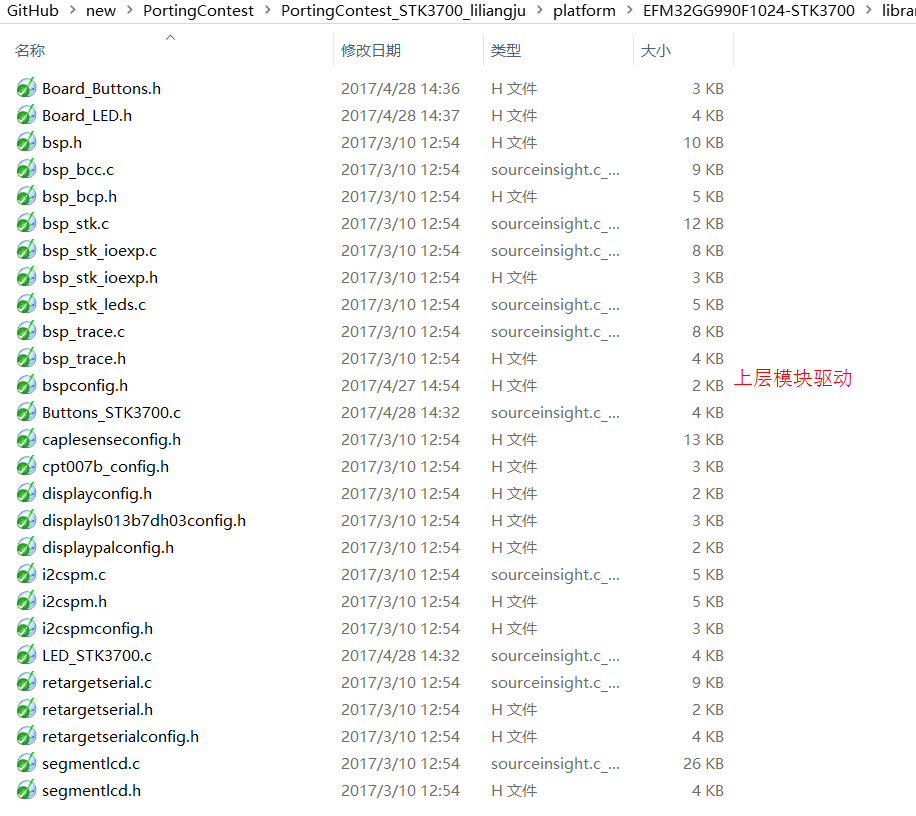

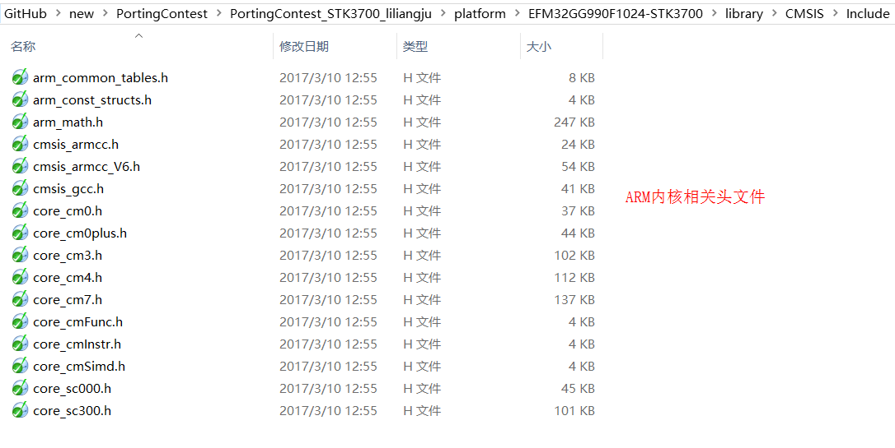

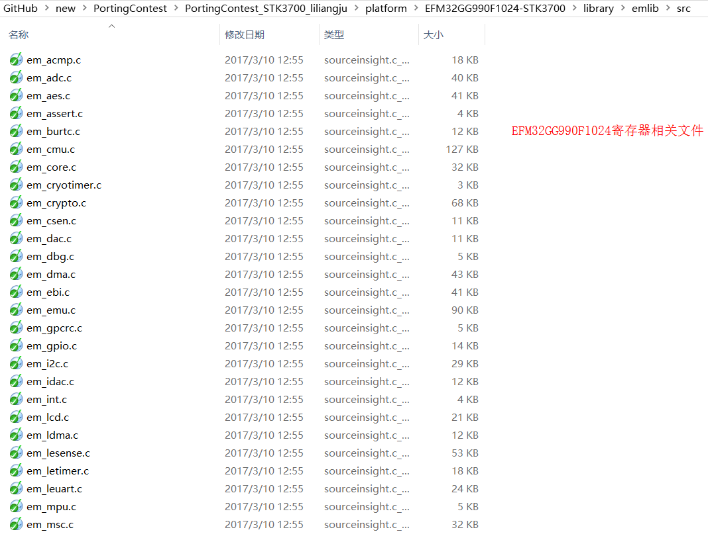

- 代码准备完毕之后，需要将STK 3700的key驱动和led驱动和uart驱动代码添加到LiteOS的工程中，添加后的结果如下所示

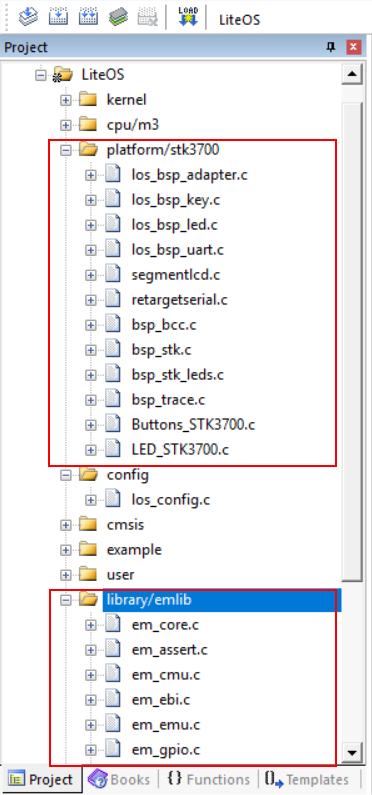
需要添加到工程中的代码有两处，一处是添加在`platform/stk3700`，一处是添加在`library/emlib`。其他的地方和官方例程里面的代码相同，不需要做修改。
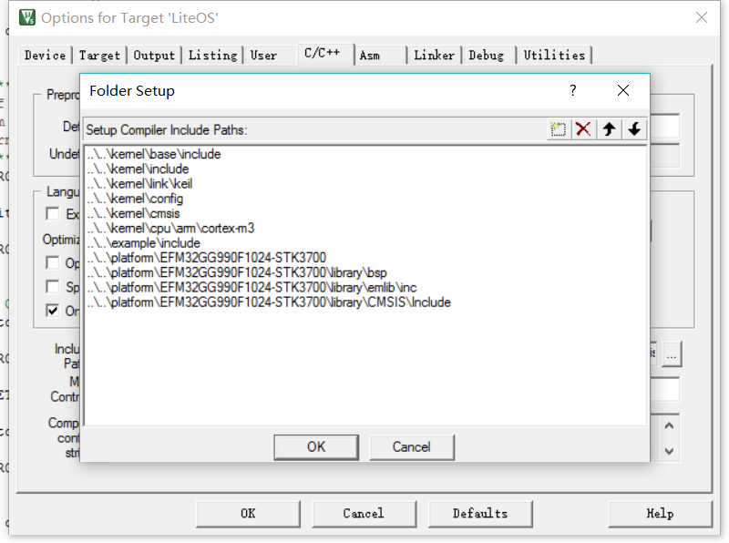
然后需要设置include文件的文件夹。如上图所示。

**注意**

在LiteOS工程中，原始的startup文件需要使用startup_stm32f429xx.s替换掉，因为LiteOS的默认startup汇编文件中只实现了能够使LiteOS运行的最小功能。

### 修改los_bsp_adapter.c文件

- 代码添加完毕之后，需要修改los_bsp_adapter.c中的system tick时钟const unsigned int sys_clk_freq = 16000000;修改为const unsigned int sys_clk_freq = 480000000; 因为代码中是给出的默认system clock的值。

- 增加官方对芯片的一个修正。需要添加两个头文件。
  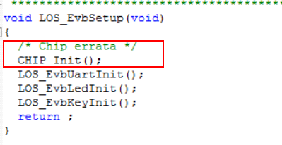
  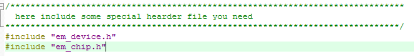
  
### 修改los_bsp_key.c文件

- 添加Buttons_STK3700.c初始化以及提供可调用的key控制API。然后在los_bsp_key.c中调用，具体调用请参考源代码。

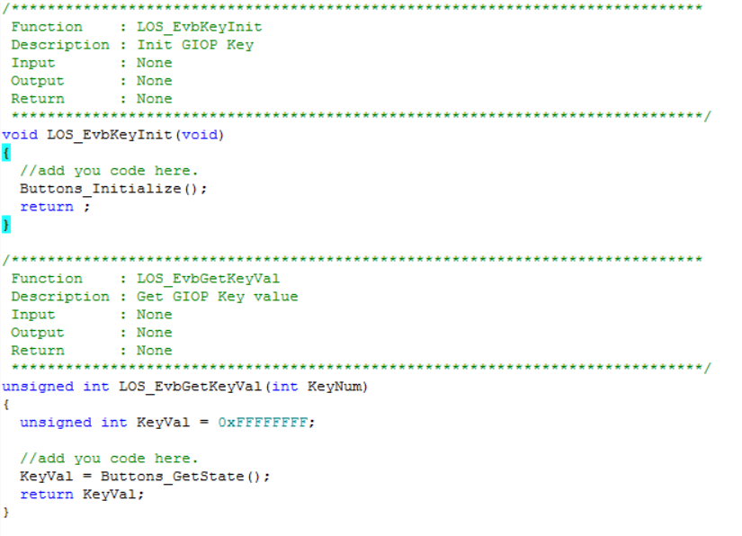

### 修改los_bsp_led.c文件

- 添加LED_STK3700.c初始化以及提供可调用的LED控制API。然后在los_bsp_led.c中调用，具体调用请参考源代码。

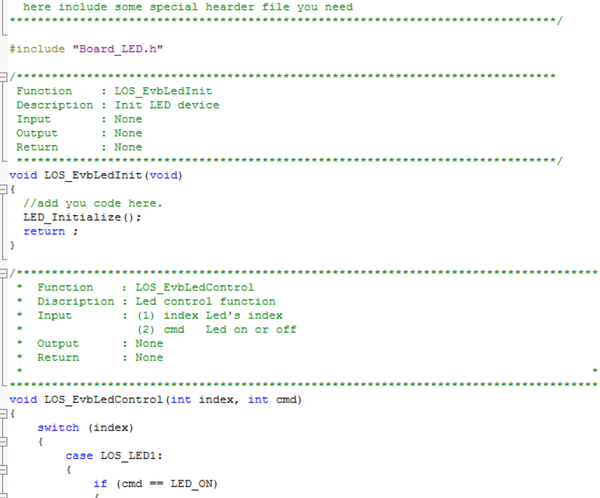

### 修改los_bsp_uart.c文件

- 添加retargetserial.c初始化以及提供可调用的uart控制API。然后在los_bsp_uart.c中调用，具体调用请参考源代码。

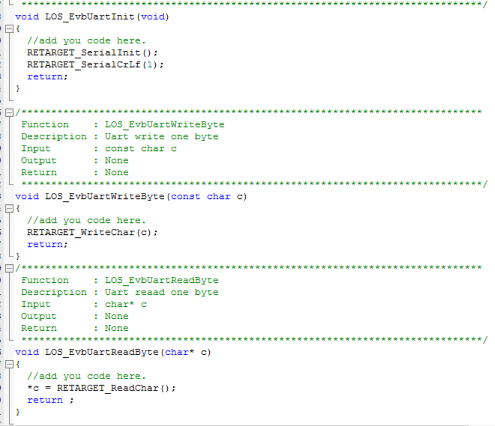

### 编译运行

- 以上步骤完成之后，直接编译调试运行就可以看到效果了。串口我们使用uart1 PD0和PD1作为TX和RX脚。串口会每隔100毫秒打印一次。

## 7 其他说明

###如何使用LiteOS 开发###

LiteOS中提供的功能包括如下内容： 任务创建与删除、任务同步（信号量、互斥锁）、动态中断注册机制等等内容，详细内容请参考《HuaweiLiteOSKernelDevGuide》。

###从零开始创建LiteOS工程###

目前在LiteOS的源代码的projects目录下已附带一些开发板的内核示例工程，用户可以直接使用，如果您所使用的开发板（芯片型号）与在示例工程中找不到，您可以从零开始创建LiteOS工程，创建流程请参考《LiteOS_Migration_Guide_Keil》。

###关于中断向量位置选择###

如果您需要使用LiteOS的中断注册机制，详细内容请参考《LiteOS_Migration_Guide_Keil》。

### kernel API测试代码 ###

如果您需要测试LiteOS内核工程运行情况，详细内容请参考《LiteOS_Migration_Guide_Keil》。

### kernel API测试代码 ###

