## 1 关于本文档的开源协议说明
**您可以自由地：**

**分享** 

- 在任何媒介以任何形式复制、发行本文档

**演绎** 

- 修改、转换或以本文档为基础进行创作。只要你遵守许可协议条款，许可人就无法收回你的这些权利。

**惟须遵守下列条件：**

**署名** 

- 您必须提供适当的证书，提供一个链接到许可证，并指示是否作出更改。您可以以任何合理的方式这样做，但不是以任何方式表明，许可方赞同您或您的使用。

**非商业性使用** 

- 您不得将本作品用于商业目的。

**相同方式共享** 

- 如果您的修改、转换，或以本文档为基础进行创作，仅得依本素材的
授权条款来散布您的贡献作品。

**没有附加限制** 

- 您不能增设法律条款或科技措施，来限制别人依授权条款本已许可的作为。

**声明：**

-  当您使用本素材中属于公众领域的元素，或当法律有例外或限制条款允许您的使用，
则您不需要遵守本授权条款。
未提供保证。本授权条款未必能完全提供您预期用途所需要的所有许可。例如：形象
权、隐私权、著作人格权等其他权利，可能限制您如何使用本素材。

**注意**

- 为了方便用户理解，这是协议的概述. 可以访问网址 https://creativecommons.org/licenses/by-sa/3.0/legalcode 了解完整协议内容.

## 2 前言
### 目的
本文档介绍基于Huawei LiteOS如何移植到第三方开发板，并成功运行基础示例。
### 读者对象
本文档主要适用于Huawei LiteOS Kernel的开发者。
本文档主要适用于以下对象：
- 物联网端软件开发工程师
- 物联网架构设计师

### 符号约定
在本文中可能出现下列标志，它们所代表的含义如下。

     用于警示紧急的危险情形，若不避免，将会导致人员死亡或严重的人身伤害

    用于警示潜在的危险情形，若不避免，可能会导致人员死亡或严重的人身伤害

    用于警示潜在的危险情形，若不避免，可能会导致中度或轻微的人身伤害

     用于传递设备或环境安全警示信息，若不避免，可能会导致设备损坏、数据丢失、设备性能降低或其它不可预知的结果“注意”不涉及人身伤害

| 说明	|		“说明”不是安全警示信息，不涉及人身、设备及环境伤害信息	|

### 修订记录
修改记录累积了每次文档更新的说明。最新版本的文档包含以前所有文档版本的更新
内容。

<table>
	<tr>
	<td>日期</td>
	<td>修订版本</td>
	<td>描述</td>
	</tr>
	<tr>
	<td>2017年04月14日</td>
	<td>1.0</td>
	<td>完成初稿</td>
	</tr>
</table>

## 3 概述

目前在github上已开源的Huawei LiteOS内核源码已适配好STM32F412、STM32F429、STM32L476、GD32F450、GD32F190等M3/M4内核芯片，本手册将以Silicon Labs的EFM32HG322F64的开发板[HAPPYGECKO START-KIT(3400A)](http://www.silabs.com/products/development-tools/mcu/32-bit/efm32-happy-gecko-starter-kit)为例，介绍基于ARM Cortex M0+内核芯片EFM32HG322F64的移植过程   

## 4 环境准备
基于Huawei LiteOS Kernel开发前，我们首先需要准备好单板运行的环境，包括软件环
境和硬件环境。
硬件环境：

<table>
	<tr>
	<td>所需硬件</td>
	<td>描述</td>
	</tr>
	<tr>
	<td>HAPPYGECKO开发板</td>
	<td>EFM32HG开发板(芯片型号EFM32HG322F64)</td>
	</tr>
	<tr>
	<td>PC机</td>
	<td>用于编译、加载并调试镜像</td>
	</tr>
	<tr>
	<td>电源（5v）</td>
	<td>开发板供电(使用Mini USB连接线)</td>
	</tr>
</table>

软件环境：

<table>
	<tr>
	<td>软件</td>
	<td>描述</td>
	</tr>
	<tr>
	<td>Window 7 操作系统</td>
	<td>安装IAR和J-link驱动的操作系统</td>
	</tr>
	<tr>
	<td>IAR for ARM(7.40以上版本)</td>
	<td>用于编译、链接、调试程序代码
	IAR for ARM 7.40 </td>
	</tr>
</table>

**说明**

IAR工具需要开发者自行购买，HAPPYGECKO START-KIT(3400A)自带板载J-Link仿真器。

## 5 获取Huawei LiteOS 源码

首先我们需要通过网络下载获取Huawei LiteOS开发包。目前Huawei LiteOS的代码已经
开源，可以直接从网络上获取，步骤如下：

- 仓库地址是https://github.com/LITEOS/LiteOS_Kernel.git 

- 点击”clone or download”按钮,下载源代码

- 目录结构如下：Huawei LiteOS的源代码目录的各子目录包含的内容如下：

关于代码树中各个目录存放的源代码的相关内容简介如下：

<table>
<tr>
	<td>一级目录</td>
	<td>二级目录</td>
	<td>说明</td>
</tr>
<tr>
	<td>doc</td>
	<td></td>
	<td>此目录存放的是LiteOS的使用文档和API说明文档</td>
</tr>
<tr>
	<td>example</td>
	<td>api</td>
	<td>此目录存放的是内核功能测试用的相关用例的代码</td>
</tr>
<tr>
	<td></td>
	<td>include</td>
	<td>aip功能头文件存放目录</td>
</tr>
<tr>
	<td>kernel</td>
	<td>base</td>
	<td>此目录存放的是与平台无关的内核代码，包含核心提供给外部调用的接口的头文件以及内核中进程调度、进程通信、内存管理等等功能的核心代码。用户一般不需要修改此目录下的相关内容。</td>
</tr>
<tr>
	<td></td>
	<td>cmsis</td>
	<td>LiteOS提供的cmsis接口</td>
</tr>
<tr>
	<td></td>
	<td>config</td>
	<td>此目录下是内核资源配置相关的代码，在头文件中配置了LiteOS所提供的各种资源所占用的内存池的总大小以及各种资源的数量，例如task的最大个数、信号量的最大个数等等</td>
</tr>
<tr>
	<td></td>
	<td>cpu</td>
	<td>此目录以及以下目录存放的是与体系架构紧密相关的适配LiteOS的代码。比如目前我们适配了arm/cortex-m4及arm/cortex-m3系列对应的初始化内容。</td>
</tr>
<tr>
	<td></td>
	<td>include</td>
	<td>内核的相关头文件存放目录</td>
</tr>
<tr>
	<td></td>
	<td>link</td>
	<td>与IDE相关的编译链接相关宏定义</td>
</tr>
<tr>
	<td>platform</td>
	<td>GD32F190R-EVAL</td>
	<td>GD190开发板systick以及led、uart、key驱动bsp适配代码</td>
</tr>
<tr>
	<td></td>
	<td>GD32F450i-EVAL</td>
	<td>GD450开发板systick以及led、uart、key驱动bsp适配代码</td>
</tr>
<tr>
	<td></td>
	<td>STM32F412ZG-NUCLEO</td>
	<td>STM32F412开发板systick以及led、uart、key驱动bsp适配代码</td>
</tr>
<tr>
	<td></td>
	<td>STM32F429I_DISCO</td>
	<td>STM32F429开发板systick以及led、uart、key驱动bsp适配代码</td>
</tr>
<tr>
	<td></td>
	<td>STM32L476RG_NUCLEO</td>
	<td>STM32L476开发板systick以及led、uart、key驱动bsp适配代码</td>
</tr>
<tr>
	<td></td>
	<td>EFM32-SLSTK3400A</td>
	<td>EFM32HG开发板systick以及led、uart、key驱动bsp适配代码</td>
</tr>
<tr>
	<td></td>
	<td>LOS_EXPAND_XXX</td>
	<td>用于新扩展的开发板systick以及led、uart、key驱动bsp适配代码</td>
</tr>
<tr>
	<td>projects</td>
	<td>STM32F412ZG-NUCLEO-KEIL</td>
	<td>stm32f412开发板的keil工程目录</td>
</tr>
<tr>
	<td></td>
	<td>STM32F429I_DISCO_IAR</td>
	<td>stm32f429开发板的iar工程目录</td>
</tr>
<tr>
	<td></td>
	<td>STM32F429I_DISCO_KEIL</td>
	<td>stm32f429开发板的keil工程目录</td>
</tr>
<tr>
	<td></td>
	<td>STM32L476R-NUCLEO-KEIL</td>
	<td>stm32l476开发板的keil工程目录</td>
</tr>
<tr>
	<td></td>
	<td>GD32F190R-EVAL-KEIL</td>
	<td>gd32f190开发板的keil工程目录</td>
</tr>
<tr>
	<td></td>
	<td>GD32F450i-EVAL-KEIL</td>
	<td>gd32f450开发板的keil工程目录</td>
</tr>
<tr>
	<td></td>
	<td>EFM32-SLSTK3400A-IAR</td>
	<td>EFM32HG332F64开发板的keil工程目录</td>
</tr>
<tr>
	<td>user</td>
	<td></td>
	<td>此目录存放用户测试代码，LiteOS的初始化和使用示例在main.c中</td>
</tr>
</table>

获取Huawei LiteOS源代码之后，我们可以将自己本地已有工程的代码适配到LiteOS内核工程中进行应用开发。

## 6 如何适配LiteOS内核工程开发
本章节描述的内容以Silicon Labs的Simplicity Studio开发包中的cslib示例工程为基础，适配到LiteOS的HAPPYGECKO-STARTER-KIT(SLSTK3400A)-IAR工程中，演示串口输出、按键中断及LED点亮功能。

### 获取EFM32HG软件开发包

- 登录Silicon Labs官网下载[Simplicity Studio](http://www.silabs.com/products/development-tools/software/simplicity-studio)并安装。Simplicity Studio工具中选择对应的开发板，即可获得对应的资料及IAR例程。   
- **注意：EFM32HG系列在高版本的IAR中才得到支持，建议使用IAR for ARM 7.4或以上版本进行移植！本文档中采用的是7.4版本，若误使用低版本打开本移植工程会破坏IAR工程，需要重新下载工程并使用正确版本打开；另外需要注意IAR工程及源码路径不宜过长，会导致工程打开失败**    
    
 

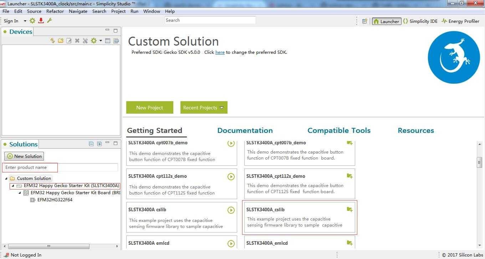

- HAPPYGECKO-STARTER-KIT(SLSTK3400A)具有板载J-Link支持虚拟串口，所以我们使用基于有串口打印的cslib例程进行移植修改。路径为xxx\Silicon\developer\sdks\exx32\v5.0.0.0\hardware\kit\SLSTK3400A_EFM32HG\examples   
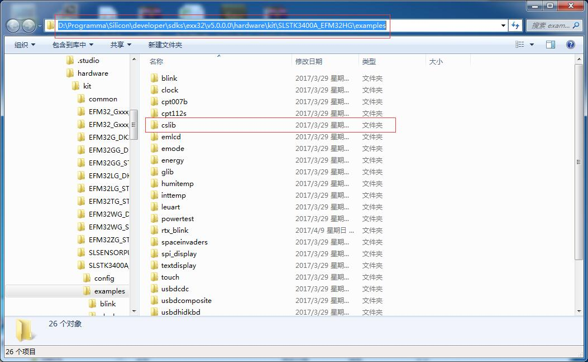

### 添加LiteOS源码

- cslib工程如下图所示，实现基本的iar工程配置（芯片配置、路径、宏定义等）和虚拟串口配置。   

- 下载LiteOS源码后，根据[IAR移植指南中添加内核代码](https://github.com/LITEOS/LiteOS_Kernel/blob/master/doc/LiteOS_Migration_Guide_IAR.md#62-%E6%B7%BB%E5%8A%A0kernel%E4%BB%A3%E7%A0%81%E5%88%B0%E5%B7%A5%E7%A8%8B)的说明，添加LiteOS**源码**及**包含路径**   
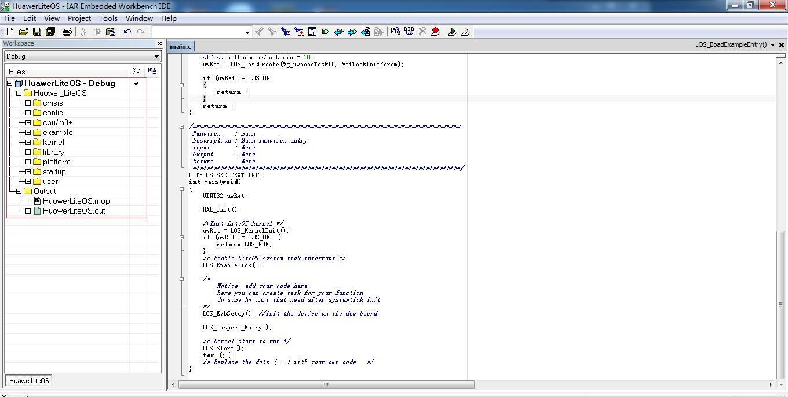

- 然后将原本cslib工程中的源码移至Library文件夹中，如下图   
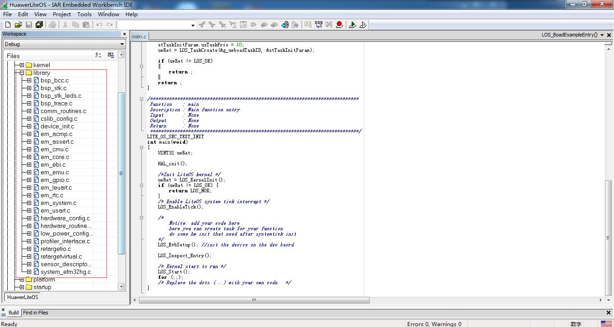

- 上述过程是将LiteOS代码添加至已有的EFM32HG的IAR工程中；若是**新建IAR工程**，可参考cslib工程来添加EFM32HG开发板的相关**源码**及**包含路径**，同时注意添加*库文件*和配置*debugger选项*，如下图：    
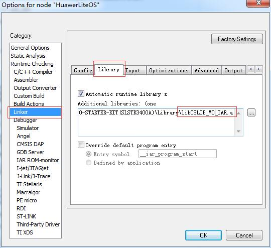   
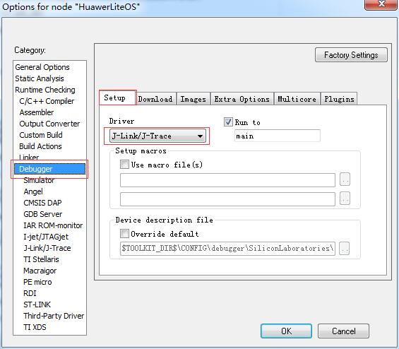

- 至此已经完成IAR工程的基本配置，下面需要修改代码。   

### 修改cpu/M0+/下文件
- 此文件夹包含MCU内核相关文件，相同内核基本可以复用。目前以支持ARM Cortex-M3/4/0+的内核。若是新内核类型，请根据LiteOS的调度设计、硬件特性和硬件汇编进行修改。
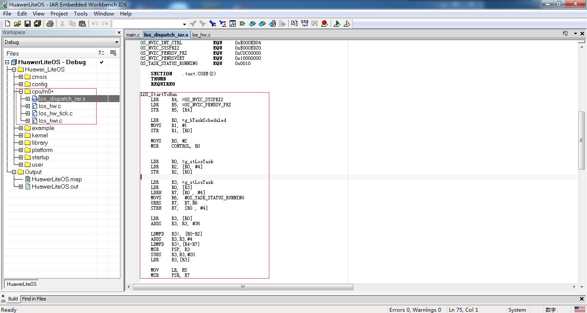 

### 修改config/下文件
- Los_Config包含了对LiteOS操作系统本身参数的配置，涉及功能使非能，资源分配等等，可以根据实际项目情况进行修改，此次移植的EFM32HG322F64，RAM为8KByte，需要调整一下Los_Config.h中的参数。   
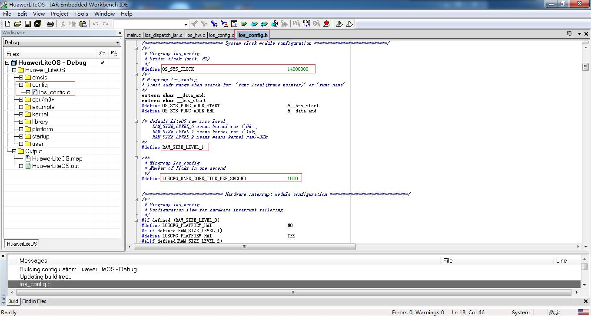 

### 修改los_bsp_adapter文件
- 在此文件中需要提供时钟配置，HAPPYGECKO-STARTER_KIT(SLSTK3400A)的时钟配置为14MHz。
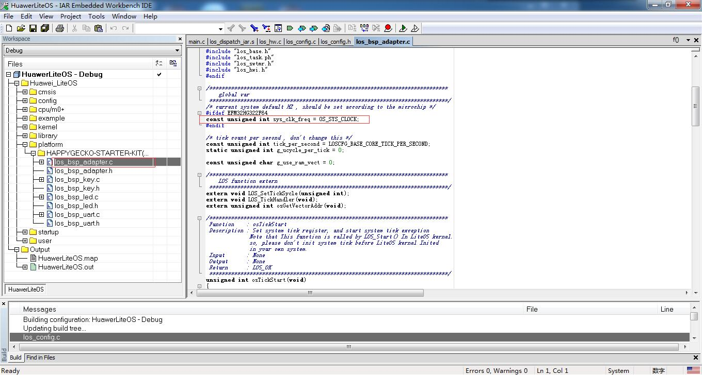 
- 此次移植仅实现KEY,LED,UART的功能，所以需要在代码中实现如下调用：

        void LOS_EvbSetup(void)   
        {   
	        LOS_EvbUartInit();   
	        LOS_EvbLedInit();   
	        LOS_EvbKeyInit();   
	        return ;   
        }   

### 修改los\_bsp\_key文件
- 此文件为LiteOS与key相关底层功能接口，在此需要实现key的初始化及key状态的读取。
- 关于key的相关函数，可以从官方提供的库或模块中提取使用。   
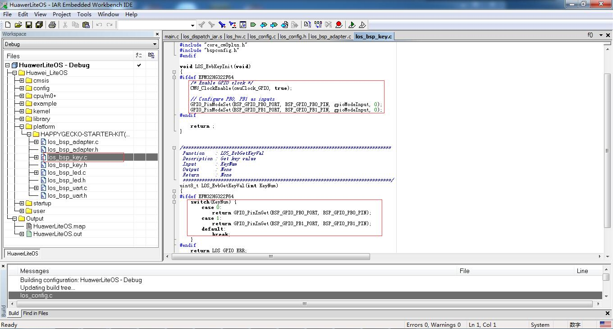 

### 修改los\_bsp\_led文件
- 此文件为LiteOS与led相关底层功能接口，在此需要实现led的初始化及led的的ON/OFF控制。
- 关于led的相关函数，可以从官方提供的库或模块中提取使用。   
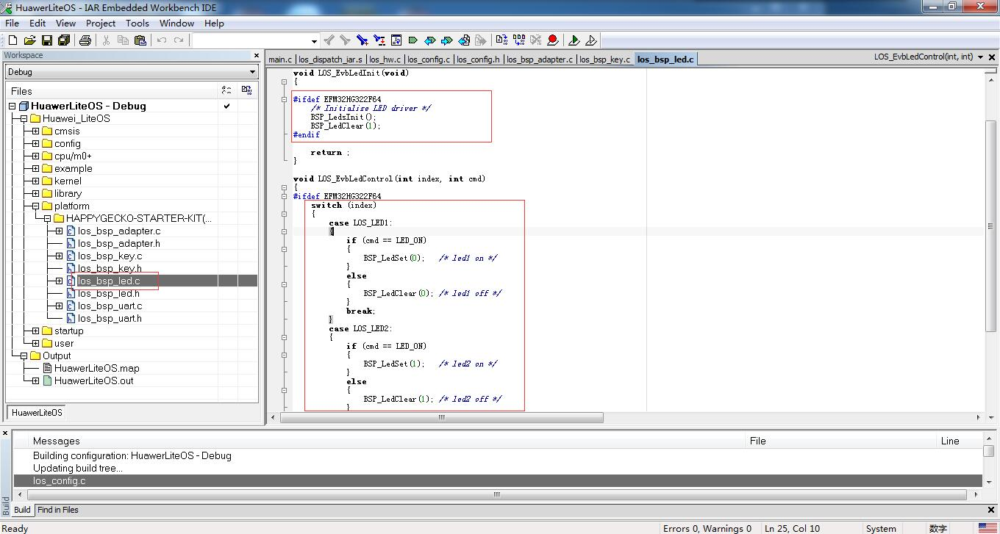 

### 修改los\_bsp\_uart文件
- 此文件为LiteOS与uart相关底层功能接口，在此需要实现uart的初始化及读写等操作。
- 关于uart的相关函数，可以从官方提供的库或模块中提取使用。   
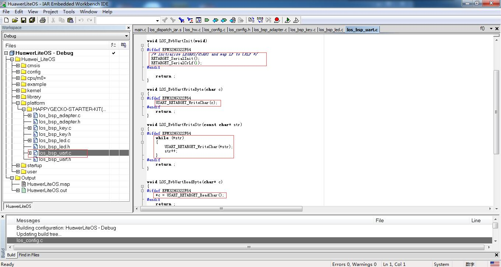 

### 修改startup.s文件
- 此处的启动文件可以采用例程中提供的startup.s文件，注意PendSV，SysTick中断向量赋值。   
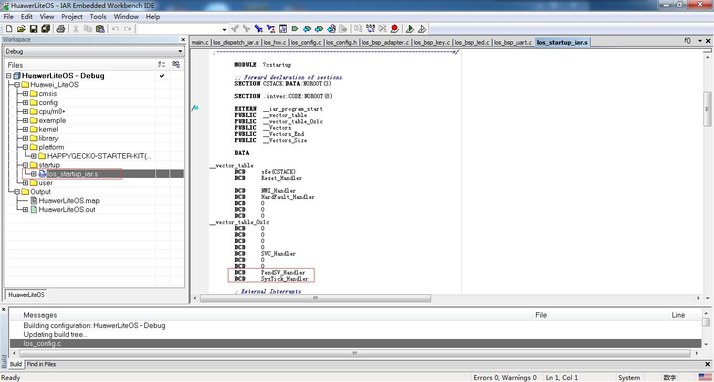 

### 修改main.c文件
- 在main.c中添加开发板初始化等操作，调用LOS_Inspect_Entry()巡检程序以检查移植是否正确。
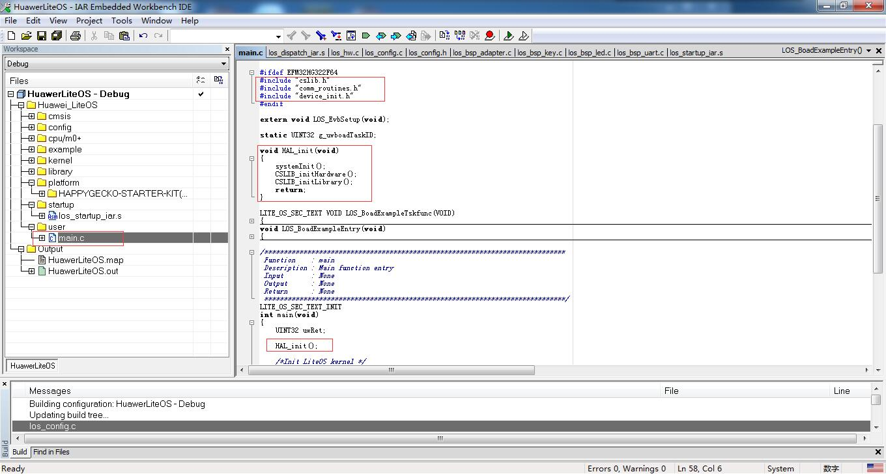 

### 关于8k RAM M0+下使用巡检程序的说明
- 因为RAM资源有限，不能直接运行巡检程序，需要对巡检程序中一些资源做调整。
  - 在Los_Config.h中定义RAM_SIZE_LEVEL_1，并修改LEVEL_1下的OS_SYS_MEM_SIZE为0x00001650    
  - 修改swtmr和其他任务的默认stack size为0x200
  - 任务创建删除测试中的任务1,2的stack size建议修改为0x150
  - 消息测试中LOS_QueueCreate的usMaxMsgSize参数修改为24。此外，若使用旧版本LiteOS代码，M0+内核下usMaxMsgSize参数必须是4的倍数（M0+不支持不对齐访问）

### 移植成功后巡检结果
- 串口打印内容
        

              Los Inspect start.
              
              LOS_TaskLock() Success!
              
              Example_TaskHi create Success!
              
              Example_TaskLo create Success!
              
              Enter TaskHi Handler.
              
              Enter TaskLo Handler.
              
              TaskHi LOS_TaskDelay Done.
              
              TaskHi LOS_TaskSuspend Success.
              
              TaskHi LOS_TaskResume Success.
              
              Inspect TASK success
              

              Example_Event wait event 0x1 
              Example_TaskEntry_Event write event .
              Example_Event,read event :0x1
              EventMask:1
              EventMask:0
              Inspect EVENT success
              

              create the queue success!
              recv message:test is message 0
              recv message:test is message 1
              recv message:test is message 2
              recv message:test is message 3
              recv message:test is message 4
              recv message failure,error:200061d
              delete the queue success!
              Inspect MSG success
              

              Example_SemTask2 try get sem g_usSemID wait forever.
              Example_SemTask1 try get sem g_usSemID ,timeout 10 ticks.
              Example_SemTask2 get sem g_usSemID and then delay 20ticks .
              Example_SemTask1 timeout and try get sem g_usSemID wait forever.
              Example_SemTask2 post sem g_usSemID .
              Example_SemTask1 wait_forever and got sem g_usSemID success.
              Inspect SEM success
              

              task2 try to get mutex, wait forever.
              task2 get mutex g_Testmux01 and suspend 100 Tick.
              task1 try to get mutex, wait 10 Tick.
              task1 timeout and try to get  mutex, wait forever.
              task2 resumed and post the g_Testmux01
              task1 wait forever,got mutex g_Testmux01 success.
              Inspect MUTEX success
              

              LOS_CyclePerTickGet = 14000 
              LOS_TickCountGet = 1106 
              LOS_TickCountGet after delay = 1309 
              Inspect SYSTIC success
              

              create Timer1 success
              start Timer1 sucess
              stop Timer1 sucess
              g_timercount1=1
              tick_last1=2619
              delete Timer1 sucess
              start Timer2
              g_timercount2=1
              tick_last2=2724
              g_timercount2=2
              tick_last2=2824
              g_timercount2=3
              tick_last2=2924
              g_timercount2=4
              tick_last2=3024
              g_timercount2=5
              tick_last2=3124
              g_timercount2=6
              tick_last2=3224
              g_timercount2=7
              tick_last2=3324
              g_timercount2=8
              tick_last2=3424
              g_timercount2=9
              tick_last2=3524
              g_timercount2=10
              tick_last2=3624
              Inspect TIMER success
              
              
              initial......
              node add and tail add......
              add node success
              add tail success
              delete node......
              delete node success
              Inspect LIST success
              
              
              Mem box init ok!
              Mem box alloc ok
              *p_num = 828
              clear data ok
               *p_num = 0
              Mem box free ok!
              Inspect S_MEM success
              

              mempool init ok!
              mem alloc ok
              *p_num = 828
              mem free ok!
              Inspect D_MEM success
              

              Inspect completed,gInspectErrCnt = [0]
              
              
               Los Key example: please press the UserKey key 
              

               Key test example 

- 按键&LED
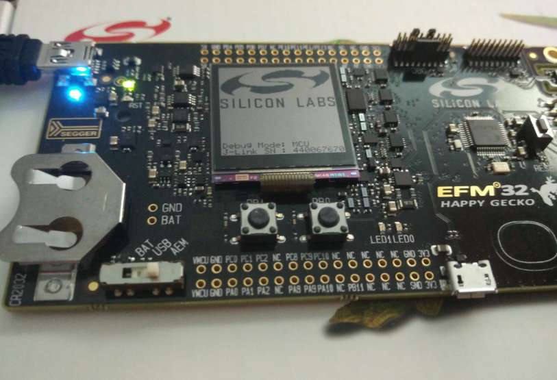      

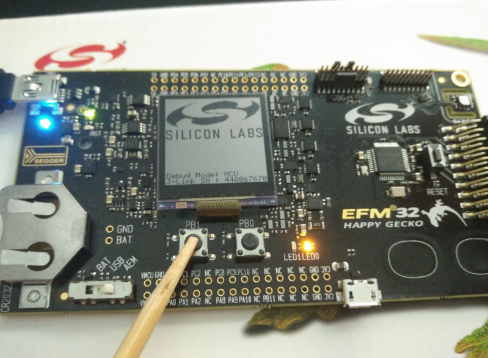

## 7 其他说明

### 如何使用LiteOS 开发

LiteOS中提供的功能包括如下内容： 任务创建与删除、任务同步（信号量、互斥锁）、动态中断注册机制等等内容，详细内容请参考《HuaweiLiteOSKernelDevGuide》。

### 从零开始创建LiteOS工程

目前在LiteOS的源代码的projects目录下已附带一些开发板的内核示例工程，用户可以直接使用，如果您所使用的开发板（芯片型号）与在示例工程中找不到，您可以从零开始创建LiteOS工程，创建流程请参考《LiteOS_Migration_Guide_Keil》。

### 关于中断向量位置选择

如果您需要使用LiteOS的中断注册机制，详细内容请参考《LiteOS_Migration_Guide_Keil》。

### kernel API测试代码

如果您需要测试LiteOS内核工程运行情况，详细内容请参考《LiteOS_Migration_Guide_Keil》。

