## 1关于本文档的开源协议说明
**您可以自由地：**

**分享** 

- 在任何媒介以任何形式复制、发行本文档

**演绎** 

- 修改、转换或以本文档为基础进行创作。只要你遵守许可协议条款，许可人就无法收回你的这些权利。

**惟须遵守下列条件：**

**署名** 

- 您必须提供适当的证书，提供一个链接到许可证，并指示是否作出更改。您可以以任何合理的方式这样做，但不是以任何方式表明，许可方赞同您或您的使用。

**非商业性使用** 

- 您不得将本作品用于商业目的。

**相同方式共享** 

- 如果您的修改、转换，或以本文档为基础进行创作，仅得依本素材的
授权条款来散布您的贡献作品。

**没有附加限制** 

- 您不能增设法律条款或科技措施，来限制别人依授权条款本已许可的作为。

**声明：**

-  当您使用本素材中属于公众领域的元素，或当法律有例外或限制条款允许您的使用，
则您不需要遵守本授权条款。
未提供保证。本授权条款未必能完全提供您预期用途所需要的所有许可。例如：形象
权、隐私权、著作人格权等其他权利，可能限制您如何使用本素材。

**注意**

- 为了方便用户理解，这是协议的概述. 可以访问网址 https://creativecommons.org/licenses/by-sa/3.0/legalcode 了解完整协议内容.

## 2前言
### 目的

本文档介如何移植Huawei LiteOS到Silicon LAB开发板 SLSTK3401A，并成功运行基础示例。

### 读者对象

本文档主要适用于Huawei LiteOS Kernel的开发者。
本文档主要适用于以下对象：

- 物联网端软件开发工程师

- 物联网架构设计师

### 符号约定
在本文中可能出现下列标志，它们所代表的含义如下。

     用于警示紧急的危险情形，若不避免，将会导致人员死亡或严重的人身伤害

    用于警示潜在的危险情形，若不避免，可能会导致人员死亡或严重的人身伤害

    用于警示潜在的危险情形，若不避免，可能会导致中度或轻微的人身伤害

     用于传递设备或环境安全警示信息，若不避免，可能会导致设备损坏、数据丢失、设备性能降低或其它不可预知的结果“注意”不涉及人身伤害

| 说明	|		“说明”不是安全警示信息，不涉及人身、设备及环境伤害信息	|				

### 修订记录
修改记录累积了每次文档更新的说明。最新版本的文档包含以前所有文档版本的更新
内容。

<table>
	<tr>
	<td>日期</td>
	<td>修订版本</td>
	<td>描述</td>
	</tr>
	<tr>
	<td>2017年04月25日</td>
	<td>1.0</td>
	<td>完成初稿</td>
	</tr>
</table>

## 3概述

目前在github上已开源的Huawei LiteOS_Kernel源码已适配好SLSTK3401A芯片的iar示例工程，如果您使用的芯片(开发板)未在其中，可以参照本文档从零开始创建自己的发开工程，并验证移植的结果。

## 4环境准备
基于Huawei LiteOS Kernel开发前，我们首先需要准备好单板运行的环境，包括软件环
境和硬件环境。
硬件环境：
<table>
	<tr>
	<td>所需硬件</td>
	<td>描述</td>
	</tr>
	<tr>
	<td>SLSTK3401A-SiliconLab单板</td>
	<td>EFM32开发板(芯片型号EFM32PG1B200F256GM48)</td>
	</tr>
	<tr>
	<td>PC机</td>
	<td>用于编译、加载并调试镜像</td>
	</tr>
	<tr>
	<td>电源（5v）</td>
	<td>开发板供电(使用Mini USB连接线)</td>
	</tr>
</table>

软件环境：
<table>
	<tr>
	<td>软件</td>
	<td>描述</td>
	</tr>
	<tr>
	<td>Window 10 操作系统</td>
	<td>安装IAR和J-link的操作系统</td>
	</tr>
	<tr>
	<td>IAR(8.10版本)</td>
	<td>用于编译、链接、调试程序代码</td>
	</tr>
	<tr>
	<td>EFM32 Starter Kit</td>
	<td>Silicon LAB 提供的一系列例程</td>
	</tr>
</table>

**说明**

I). IAR 获取https://www.iar.com/iar-embedded-workbench/?focus=wbselector
II).Starter Kit获取：
http://www.silabs.com/products/development-tools/mcu/32-bit/efm32-pearl-gecko-starter-kit
官方使用的Simplicity Studio IDE，需要注册账号;
安装成功后，首次打开软件，登陆后，会弹出一个对话框，可以对SDK进行选择;
下载完成后的Starter Kit的路径是：
$(INSTALL_DIR)\SiliconLabs\SimplicityStudio\v4\developer\sdks\exx32\v4.4.1\

III).安装完软件过程中，提示安装驱动，按照提示安装，安装完成后，(J-link)J-Trace便已经支持了；

## 5获取Huawei LiteOS 源码

首先我们需要通过网络下载获取Huawei LiteOS开发包。目前Huawei LiteOS的代码已经
开源，可以直接从网络上获取，步骤如下：

- 直接到github上面clone。仓库地址是https://github.com/LITEOS/LiteOS_Kernel.git

- 从github上获取的代码，则目录结构如下：
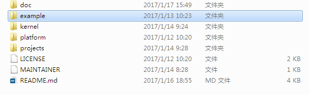

关于代码树中各个目录存放的源代码的相关内容简介如下：

<table>
<tr>
	<td>一级目录</td>
	<td>二级目录</td>
	<td>说明</td>
</tr>
<tr>
	<td>doc</td>
	<td></td>
	<td>此目录存放的是LiteOS的使用文档和API说明文档</td>
</tr>
<tr>
	<td>example</td>
	<td>api</td>
	<td>此目录存放的是内核功能测试用的相关用例的代码</td>
</tr>
<tr>
	<td></td>
	<td>include</td>
	<td>aip功能头文件存放目录</td>
</tr>
<tr>
	<td>kernel</td>
	<td>base</td>
	<td>此目录存放的是与平台无关的内核代码，包含核心提供给外部调用的接口的头文件以及内核中进程调度、进程通信、内存管理等等功能的核心代码。用户一般不需要修改此目录下的相关内容。</td>
</tr>
<tr>
	<td></td>
	<td>cmsis</td>
	<td>LiteOS提供的cmsis接口</td>
</tr>
<tr>
	<td></td>
	<td>config</td>
	<td>此目录下是内核资源配置相关的代码，在头文件中配置了LiteOS所提供的各种资源所占用的内存池的总大小以及各种资源的数量，例如task的最大个数、信号量的最大个数等等</td>
</tr>
<tr>
	<td></td>
	<td>cpu</td>
	<td>此目录以及以下目录存放的是与体系架构紧密相关的适配LiteOS的代码。比如目前我们适配了arm/cortex-m4及arm/cortex-m3系列对应的初始化内容。</td>
</tr>
<tr>
	<td></td>
	<td>include</td>
	<td>内核的相关头文件存放目录</td>
</tr>
<tr>
	<td></td>
	<td>link</td>
	<td>与IDE相关的编译链接相关宏定义</td>
</tr>
<tr>
	<td>platform</td>
	<td>GD32F190R-EVAL</td>
	<td>GD190开发板systick以及led、uart、key驱动bsp适配代码</td>
</tr>
<tr>
	<td></td>
	<td>GD32F450i-EVAL</td>
	<td>GD450开发板systick以及led、uart、key驱动bsp适配代码</td>
</tr>
<tr>
	<td></td>
	<td>STM32F412ZG-NUCLEO</td>
	<td>STM32F412开发板systick以及led、uart、key驱动bsp适配代码</td>
</tr>
<tr>
	<td></td>
	<td>STM32F429I_DISCO</td>
	<td>STM32F429开发板systick以及led、uart、key驱动bsp适配代码</td>
</tr>
<tr>
	<td></td>
	<td>STM32L476RG_NUCLEO</td>
	<td>STM32L476开发板systick以及led、uart、key驱动bsp适配代码</td>
</tr>
<tr>
	<td></td>
	<td>SLSTK3401A-SLab</td>
	<td>SLSTK3401A开发板systick以及led/uart/key/lcd驱动bsp适配代码</td>
</tr>
<tr>
	<td>projects</td>
	<td>STM32F412ZG-NUCLEO-KEIL</td>
	<td>stm32f412开发板的keil工程目录</td>
</tr>
<tr>
	<td></td>
	<td>STM32F429I_DISCO_IAR</td>
	<td>stm32f429开发板的iar工程目录</td>
</tr>
<tr>
	<td></td>
	<td>STM32F429I_DISCO_KEIL</td>
	<td>stm32f429开发板的keil工程目录</td>
</tr>
<tr>
	<td></td>
	<td>STM32L476R-Nucleo</td>
	<td>stm32f476开发板的keil工程目录</td>
</tr>
<tr>
	<td></td>
	<td>GD32F190R-EVAL-KEIL</td>
	<td>gd32f190开发板的keil工程目录</td>
</tr>
<tr>
	<td></td>
	<td>GD32F450i-EVAL-KEIL</td>
	<td>gd32f450开发板的keil工程目录</td>
</tr>
<tr>
	<td></td>
	<td>SLSTK3401A-SLab</td>
	<td>Slstk3401A开发板的iar工程目录</td>
</tr>
<tr>
	<td>user</td>
	<td></td>
	<td>此目录存放用户测试代码，LiteOS的初始化和使用示例在main.c中</td>
</tr>
</table>

获取Huawei LiteOS源代码之后，我们就可以创建project然后编译调试我们的程序了，
详细可以参考后续的各个章节。详细的编程应用编程API请参考《HuaweiLiteOSKernelDevGuide》

## 6创建Huawei LiteOS 工程

在获取完成Huawei LiteOS的源代码和安装好IAR等相关的开发工具后，我们需要用IAR
集成开发环境创建编译Huawei LiteOS的工程，步骤如下：

- 打开IAR， 然后点击File->New->Workspace创建一个新的工作空间

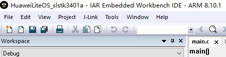

- 然后点击Project->Create New Project...创建一个新的project

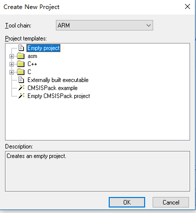

    创建一个空的工程

- 保存工程名，比如HuaweiLiteOS_slstk3401a

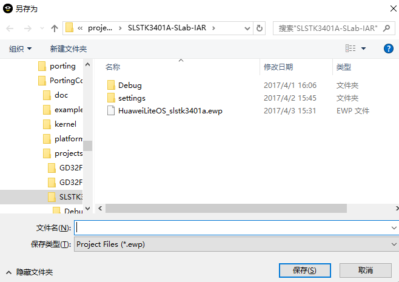

- 创建工程中的目录结构

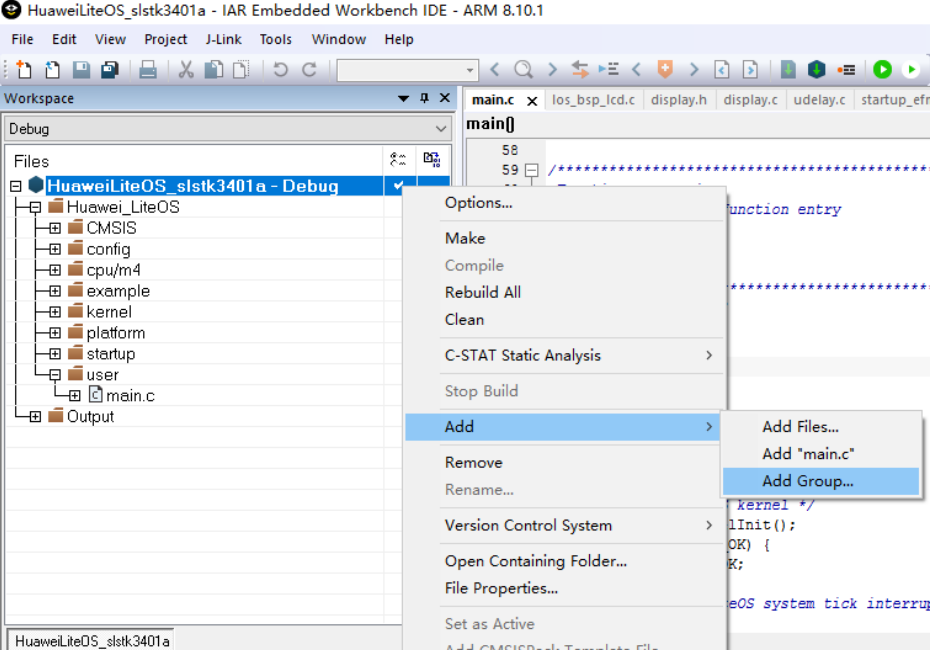

如上图所示，通过add Group 操作来创建一个在工程中显示的目录树，方便我们区分代码功能，比如我们创建如下结构的目录树

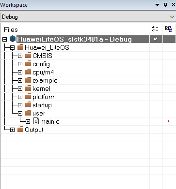

- 创建完成目录树之后我们添加源代码到目录树中，最终添加完成的内容如下：
- 将kernel/base目录下的所有C文件添加到工程中的kernel下
- 将platform/SLSTK3401A-SLab目录下的所有驱动适配文件，平台无关文件，添加到工程中的platform/slstk3401a下(slstk3401a文件夹名字可自行修改)
- 根据芯片内核型号，将kernel\cpu\arm\cortex-m4（或者cortex-m3）目录下的所有C文件以及汇编代码添加到工程中的cpu/m4（cpu/m3）下
- 将kernel\config目录下的所有C文件添加到工程中的config下
- 将user目录下的所有C文件添加到工程中的user下
- 从Starter Kit中找到例程，可以使用其中的startup_efm32pg1b.s，因为，SLSTK3401A属于EFM32PG1B200F256GM48系列；添加到platform/startup目录下；
- 将\platform\SLSTK3401A-SLab下驱动文件，平台相关文件，拷贝到工程中的CMSIS目录，可以设置子目录；
- 添加example/api目录下的所有C文件到工程的example目录下

- 完成代码添加后的工程目录如下图

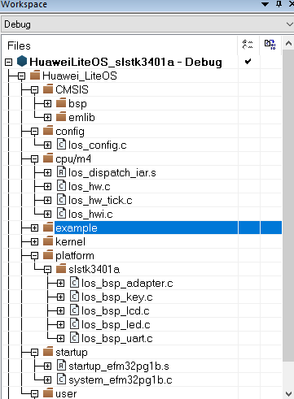

- 完成添加文件之后，需要对工程进行详细的配置，配置内容步骤如下所示：

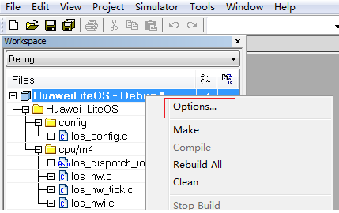

- 配置芯片型号, 假如您使用的是SiliconLaboratories EFM32PG1B200F256GM48芯片

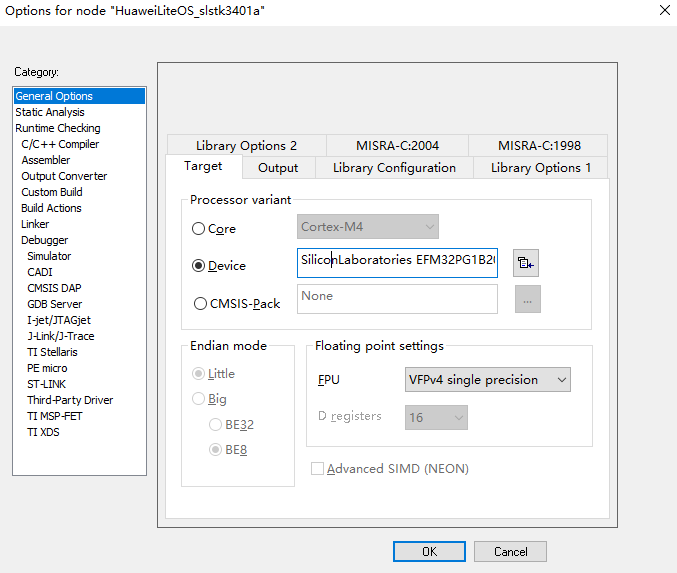

- 配置C文件头文件搜索路径，需要将所有的头文件路径都包含进来，定义宏；

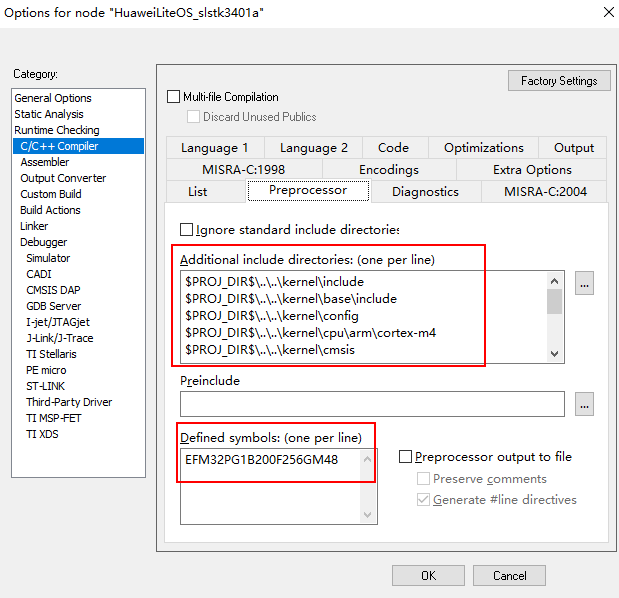

- 配置分散加载文件

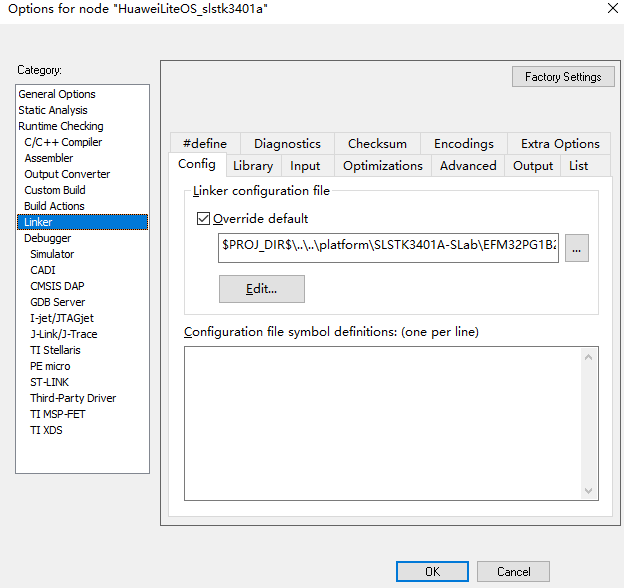

说明：分散配置文件，IAR就是icf文件，IAR默认指向了一个，可以从中拷贝出来，放到某个路径下，然后，覆盖就可以；分散加载的意思，是划分了ro,rw,vector这些section的位置；如果您需要使用中断动态注册功能，则需要配套使用分散机制。本示例中未使用分散加载机制，可参考源码中其他工程的分散加载文件自己编写。

SLSTK3401A的配置文件内容如下：
/*###ICF### Section handled by ICF editor, don't touch! ****/
/*-Editor annotation file-*/
/* IcfEditorFile="$TOOLKIT_DIR$\config\ide\IcfEditor\cortex_v1_0.xml" */

/*-Specials-*/
define symbol __ICFEDIT_intvec_start__ = 0x00000000;

/*-Memory Regions-*/
define symbol __ICFEDIT_region_ROM_start__   = 0x00000000;
define symbol __ICFEDIT_region_ROM_end__     = (0x00000000+0x00040000-1);
define symbol __ICFEDIT_region_RAM_start__   = 0x20000000;
define symbol __ICFEDIT_region_RAM_end__     = (0x20000000+0x00008000-1);

/*-Sizes-*/
if ( !isdefinedsymbol( __ICFEDIT_size_cstack__ ) )
{ define symbol __ICFEDIT_size_cstack__   = 0x400; }

if ( !isdefinedsymbol( __ICFEDIT_size_heap__ ) )
{ define symbol __ICFEDIT_size_heap__     = 0x800; }

/**** End of ICF editor section. ###ICF###*/

define memory mem with size = 4G;
define region ROM_region   = mem:[from __ICFEDIT_region_ROM_start__   to __ICFEDIT_region_ROM_end__];
define region RAM_region   = mem:[from __ICFEDIT_region_RAM_start__   to __ICFEDIT_region_RAM_end__];

define block CSTACK    with alignment = 8, size = __ICFEDIT_size_cstack__   { };
define block HEAP      with alignment = 8, size = __ICFEDIT_size_heap__     { };

initialize by copy { readwrite };
do not initialize  { section .noinit };

keep { section .intvec };
place at address mem:__ICFEDIT_intvec_start__ { readonly section .intvec };

place in ROM_region   { readonly };
place in RAM_region   { readwrite,
                        block CSTACK,
                        block HEAP };

- 配置debug相关选项，比如您使用的是slstk3401A芯片，则使用选择,J-Link/J-Trace

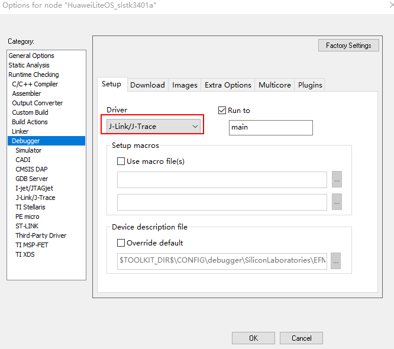

### 适配驱动代码
如果您不需要适配驱动代码到工程，可忽略此章。

内核代码中提供了bsp适配的框架代码，存放在platform文件夹下

根据本地Library代码提供的接口函数，来实现LiteOS中相关的bsp接口函数
（1）修改los_bsp_adapter.c文件，配置系统时钟及SysTick，适配sysTick_Handler函数；
（2）实现los_bsp_led.c、los_bsp_key.c、los_bsp_uart.c等文件中提供的空函数。
     空函数的具体实现可参考源码中已适配的其他工程中同名的文件，如有其他需要增加的驱动功能，可以在同级目录下添加相关文件。

将驱动代码添加到内核工程更详细的过程可参考源码doc目录下其他开发板的移植指南文档。

### kernel API测试代码

如果需要测试LiteOS是否正常运行，可以将example/api添加到工程目录中。

### 测试代码使用
目前LiteOS提供了单独测试每个功能的api代码，可在main()函数中调用los_demo_entry.c文件中的LOS_Demo_Entry()函数，并放开相应的宏定义。

如果需要一次测试内核所有的功能，则可调用los_inspect_entry.c文件中的LOS_Inspect_Entry()函数。在本例中，是采用的这种方式；(develop-branch)

LiteOS最小需要占用8K的RAM,使用Inspect巡检功能需要再增加1k RAM，不满足此要求的芯片请使用API单项测试功能。
SLSTK3401A的RAM是32K，因此，满足要求，我们可以直接调用LOS_Inspect_Entry函数；

测试代码入口是los_inspect_entry.c中的LOS_Inspect_Entry()这个接口，使用方法user/main.c的main中调用

示例如下：

	int main(void)
	{
	    UINT32 uwRet;
	    /*
				add you hardware init code here
				for example flash, i2c , system clock ....
	    */
		//HAL_init();....
		
		/*Init LiteOS kernel */
	    uwRet = LOS_KernelInit();
	    if (uwRet != LOS_OK) {
	        return LOS_NOK;
	    }
			/* Enable LiteOS system tick interrupt */
	    LOS_EnableTick();
			
			
	    /* 
	        Notice: add your code here
	        here you can create task for your function 
	        do some hw init that need after systemtick init
	    */
	    //LOS_EvbSetup();
	    //LOS_BoadExampleEntry();
		
		LOS_Inspect_Entry();
	    /* Kernel start to run */
	    LOS_Start();
	    for (;;);
	    /* Replace the dots (...) with your own code.  */
	}

**使用printf打印可以有几种方法**

- 将printf重定位到uart输出，这个需要uart驱动支持，如果只有liteOS而没有相关驱动加入工程则不建议使用该方法。
- 我们已经适配了串口驱动代码，因此，可以尝试使用printf，具体，可以参考retargetio.c里的处理；

## 7编译调试
打开工程后，菜单栏Project→Clean 、Rebuild All，可clean和build 文件。这里点
击Rebuild All，编译全部文件
(1)如果调用LOS_Demo_Entry()函数进行测试，可根据《HuaweiLiteOSKernelDevGuide》文档中列出每项API功能测试结果来进行对比判断。
(2)如果调用LOS_Inspect_Entry()函数进行功能巡检，gInspectErrCnt值为0则代表移植成功。

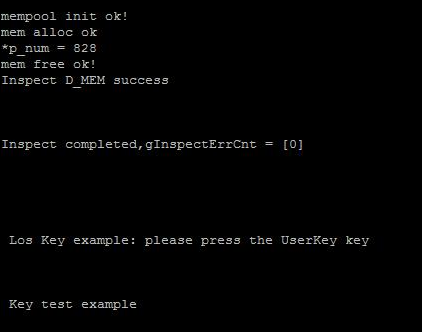

**关于中断向量位置选择**

- 在los_bsp_adapter.c中，g_use_ram_vect变量控制了LiteOS中是否使用vector向量表（中断向量表）重定向功能。如果g_use_ram_vect设置为 1 ，则需要在配置分散加载文件，如果配置为0，则不配置分散加载文件（即在上面的配置步骤中可以不进行分散加载文件配置），系统启动后默认中断向量表在Rom的0x00000000地址。

**关于工程创建**

目前在LiteOS的源代码中已经存在了一些已经创建好的工程，用户可以直接使用，它们都在projects目录下。建议用户使用projects下已经建立好的工程作为LiteOS运行是否正常的参考工程使用。

## 8 如何使用LiteOS 开发

LiteOS中提供的功能包括如下内容： 任务创建与删除、任务同步（信号量、互斥锁）、动态中断注册机制 等等内容，更详细的内容可以参考“HuaweiLiteOSKernelDevGuide”中描述的相关内容。下面章节将对任务和中断进行说明。

### 8.1 创建任务

- 用户使用LOS_TaskCreate(...)等接口来进行任务的创建。具体可以参考example/api/los_api_task.c中的使用方法来创建管理任务。

### 8.2 中断处理
#### Huawei LiteOS 的中断使用
在驱动开发的过程中我们通常会使用到中断，Huawei LiteOS有一套自己的中断的逻辑，在使用每个中断前需要为其注册相关的中断处理程序。

- OS启动后，RAM起始地址是0x20000000到0x20000400，用来存放中断向量表，系统启动的汇编代码中只将reset功能写入到了对应的区域，系统使用一个全局的m_pstHwiForm[ ]来管理中断。m3以及m4核的前16个异常处理程序都是直接写入m_pstHwiForm[]这个数组的。

- 开发者需要使用某些中断(m3以及m4中非前16个异常)时，可以通过LOS_HwiCreate (…)接口来注册自己的中断处理函数。如果驱动卸载还可以通过LOS_HwiDelete(….)来删除已注册的中断处理函数。系统还提供了LOS_IntLock()关中断及LOS_IntRestore()恢复到中断前状态等接口。详细的使用方法可以参考LiteOS中已经使用的地方。

- LiteOS中断机制会额外地使用2K的RAM，跟大部分开发板bsp代码包中的机制不一样。如果没有动态修改中断处理函数的需要，用户可以选择不使用该中断机制，简单的方法是在los_bsp_adapter.c中将g_use_ram_vect变量设置为0，并且在配置工程时不配置分散加载文件。这样就可以使用demo板bsp包中提供的中断方式。

- 如果使用LiteOS的中断机制，那么在启动LiteOS之前，请先将所有用到的中断都用LOS_HwiCreate()完成注册，否则在完成中断注册前就初始化了相关的硬件以及中断会直接进入osHwiDefaultHandler()导致程序无法正常运行。
- los_bsp_adapter.c中LosAdapIntInit() LosAdapIrpEnable() LosAdapIrqDisable（）等接口都可以调用BSP包中的接口实现。

###  8.3 系统tick中断配置修改

- los_bsp_adapter.c中修改后的osTickStart()函数，比如在该函数中直接调用BSP包中的接口配置system tick，在stm32中可以调用SysTick_Config(g_ucycle_per_tick);
- 根据实际配置的system clock 修改sys_clk_freq的值，工程中给出的值都是默认时钟频率。比如stm32f429的默认时钟是16M HZ。

### 8.4 LiteOS资源配置

- 对于嵌入式系统来说，内存都是比较宝贵的资源，因此一般的程序都会严格管理内存使用，LiteOS也一样。在LiteOS中系统资源使用g_ucMemStart[OS_SYS_MEM_SIZE]作为内存池，来管理任务、信号量等等资源的创建，总共是32K。而留给用户创建的task的的个数则是LOSCFG_BASE_CORE_TSK_LIMIT（15）.

- LiteOS中的内存使用都是在los_config.h中进行配置的，需要使用多大的内存，可以根据实际的task个数、信号量、互斥锁、timer、消息队列、链表等内容的个数来决定的（根据各自的结构体大小以及个数计算），总的内存池的大小是OS_SYS_MEM_SIZE来定义的。

- LiteOS的中断机制，目前使用了2K的内存。

###  8.4 移植到不同的芯片

- 移植LiteOS到不同的芯片时，需要在kernel\cpu下去添加一个芯片系列的目录，并且在该新增加的目录下添加los_dispatch，los_hw.c、los_hw_tick、los_hwi这些内容。dispatch主要实现task调度相关的处理以及开关中断获取中断号等内容，los_hw.c中实现的task调度时需要保存的寄存器等内容，los_hwi则是中断的相关内容，los_hw_tick则是系统tick中断处理以及获取tick等的实现

### 8.5 LiteOS资源配置
对于嵌入式系统来说，内存都是比较宝贵的资源，因此一般的程序都会严格管理内存使用，LiteOS也一样。在LiteOS中系统资源使用g_ucMemStart[OS_SYS_MEM_SIZE]作为内存池，来管理任务、信号量等等资源的创建。而留给用户创建的task的的个数则是LOSCFG_BASE_CORE_TSK_LIMIT
根据RAM_SIZE_LEVEL_X宏进行控制，需要根据实际情况进行配置，否则，超过RAM空间限制，在link阶段会报错误；可以通过查看icf分散加载文件和查看生成的map文件进行分析；

LiteOS中的内存使用都是在los_config.h中进行配置的，需要使用多大的内存，可以根据实际的task个数、信号量、互斥锁、timer、消息队列、链表等内容的个数来决定的（根据各自的结构体大小以及个数计算），总的内存池的大小是OS_SYS_MEM_SIZE来定义的。
LiteOS的中断机制，由于未涉及向量表映射，因此，这部分并没有处理；
关于这里，有些疑问，会在另一篇issue文档中进行阐述；

对于RAM较小的芯片，请参照los_config.h文件中的注释，在工程中定义相关的编译宏，否则会出现链接失败（RAM大于32k可不定义）。
  /* default LiteOS ram size level 
	RAM_SIZE_LEVEL_0 means kernel ram < 8k  , 
	RAM_SIZE_LEVEL_1 means kernel ram < 16k, 
	RAM_SIZE_LEVEL_2 means means kernel ram>=32k 
  */
目前在LiteOS的源代码中有一些已经创建好了的工程，移植到新的开发板(芯片)时可参考源码中的这些工程。
详细的应用编程API请参考《HuaweiLiteOSKernelDevGuide》。
FatFs文件系统移植请参考《LiteOS_Migration_Guide_FatFs_Keil.md》。

### 8.6 系统tick中断配置修改
los_bsp_adapter.c中修改后的osTickStart()函数，比如在该函数中直接调用BSP包中的接口配置system tick
在SLSTK3401A中可以调用SysTick_Config(g_ucycle_per_tick);
根据实际配置的system clock 修改sys_clk_freq的值，比如SLSTK3401A的最大时钟是40M HZ。

## 其他说明
目前git上提供的代码中直接提供了IAR的示例工程，可以直接用来进行参考；将用户自己的代码适配到LiteOS内核工程进行开发的过程，可参考各自开发板移植指导文档。

RAM空间不足时，IAR在链接阶段会报错，可以根据生成的map文件定位，也能推倒出对RAM资源的限制的结论；也算是一种很好的调试手段；

LCD的调试需要注意，矩阵的行数和列数；

