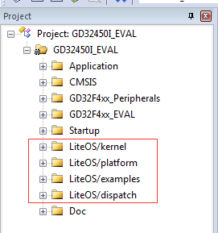
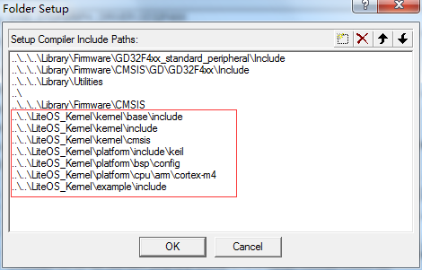
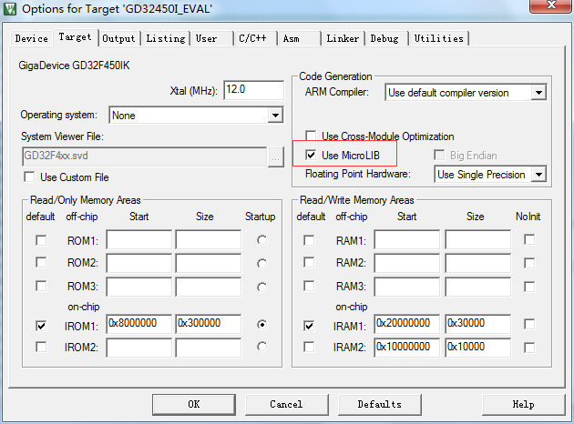
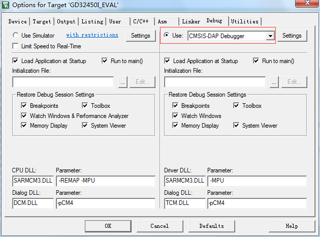
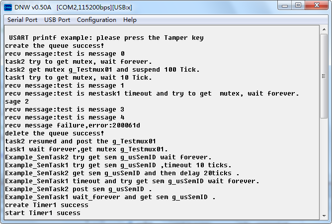

## 1开源协议说明
**您可以自由地：**

**分享** 

- 在任何媒介以任何形式复制、发行本作品

**演绎** 

- 修改、转换或以本作品为基础进行创作。只要你遵守许可协议条款，许可人就无法收回你的这些权利。

**惟须遵守下列条件：**

**署名** 

- 您必须提供适当的证书，提供一个链接到许可证，并指示是否作出更改。您可以以任何合理的方式这样做，但不是以任何方式表明，许可方赞同您或您的使用。

**非商业性使用** 

- 您不得将本作品用于商业目的。

**相同方式共享** 

- 如果您的修改、转换，或以本作品为基础进行创作，仅得依本素材的
授权条款来散布您的贡献作品。

**没有附加限制** 

- 您不能增设法律条款或科技措施，来限制别人依授权条款本已许可的作为。

**声明：**

-  当您使用本素材中属于公众领域的元素，或当法律有例外或限制条款允许您的使用，
则您不需要遵守本授权条款。
未提供保证。本授权条款未必能完全提供您预期用途所需要的所有许可。例如：形象
权、隐私权、著作人格权等其他权利，可能限制您如何使用本素材。

**注意**

- 为了方便用户理解，这是协议的概述. 可以访问网址 https://creativecommons.org/licenses/by-sa/3.0/legalcode 了解完整协议内容.

## 2前言
### 目的
本文档介绍基于Huawei LiteOS如何移植到第三方开发板，并成功运行基础示例。
### 读者对象

本文档主要适用于Huawei LiteOS Kernel的开发者。
本文档主要适用于以下对象：
- 物联网端软件开发工程师
- 物联网架构设计师

### 符号约定
在本文中可能出现下列标志，它们所代表的含义如下。

     用于警示紧急的危险情形，若不避免，将会导致人员死亡或严重的人身伤害

    用于警示潜在的危险情形，若不避免，可能会导致人员死亡或严重的人身伤害

    用于警示潜在的危险情形，若不避免，可能会导致中度或轻微的人身伤害

     用于传递设备或环境安全警示信息，若不避免，可能会导致设备损坏、数据丢失、设备性能降低或其它不可预知的结果“注意”不涉及人身伤害

| 说明	|		“说明”不是安全警示信息，不涉及人身、设备及环境伤害信息	|

### 修订记录
修改记录累积了每次文档更新的说明。最新版本的文档包含以前所有文档版本的更新
内容。

<table>
	<tr>
	<td>日期</td>
	<td>修订版本</td>
	<td>描述</td>
	</tr>
	<tr>
	<td>2017年1月22日</td>
	<td>1.0</td>
	<td>完成初稿</td>
	</tr>
</table>

## 3概述

目前在github上已开源的Huawei LiteOS内核源码已适配好STM32F411、STM32F429、GD32F450、GD32F190芯片，本手册将
以GD32F450IK芯片为例，介绍基于Cortex M4核芯片的移植过程。

## 4环境准备
基于Huawei LiteOS Kernel开发前，我们首先需要准备好单板运行的环境，包括软件环
境和硬件环境。
硬件环境：

<table>
	<tr>
	<td>所需硬件</td>
	<td>描述</td>
	</tr>
	<tr>
	<td>GD32450i-EVAL V1.1单板</td>
	<td>GDF450开发板(芯片型号GD32F450IK)</td>
	</tr>
	<tr>
	<td>PC机</td>
	<td>用于编译、加载并调试镜像</td>
	</tr>
	<tr>
	<td>电源（5v）</td>
	<td>开发板供电(使用Mini USB连接线)</td>
	</tr>
</table>

软件环境：

<table>
	<tr>
	<td>软件</td>
	<td>描述</td>
	</tr>
	<tr>
	<td>Window 7 操作系统</td>
	<td>安装Keil</td>
	</tr>
	<tr>
	<td>Keil(5.21以上版本)</td>
	<td>用于编译、链接、调试程序代码
	uVision V5.21.1.0 MDK-Lite uVersion:5.21a</td>
	</tr>
	<tr>
	<td>DNW串口调试工具</td>
	<td>串口调试工具，根据个人喜好可使用其他的串口工具</td>
	</tr>
</table>

**说明**

Keil工具需要开发者自行购买,GD-Link免驱动安装,这里以GD32F450为例，使用GD-Link调试。

## 5获取Huawei LiteOS 源码

首先我们需要通过网络下载获取Huawei LiteOS开发包。目前Huawei LiteOS的代码已经
开源，可以直接从网络上获取，步骤如下：

- 仓库地址是https://github.com/LITEOS/LiteOS_Kernel.git 

- 点击”clone or download”按钮,下载源代码

- 目录结构如下：Huawei LiteOS的源代码目录的各子目录包含的内容如下：

关于代码树中各个目录存放的源代码的相关内容简介如下：

<table>
<tr>
	<td>一级目录</td>
	<td>二级目录</td>
	<td>说明</td>
</tr>
<tr>
	<td>kernel</td>
	<td>base</td>
	<td>此目录存放的是与平台无关的内核代码，包含核心提供给外部调用的接口的头文件以及内核中进程调度、进程通信、内存管理等等功能的核心代码。用户一般不需要修改此目录下的相关内容。</td>
</tr>
<tr>
	<td></td>
	<td>include</td>
	<td>内核的相关头文件存放目录</td>
</tr>
<tr>
	<td></td>
	<td>cmsis</td>
	<td>LiteOS提供的cmsis接口</td>
</tr>
<tr>
	<td>platform</td>
	<td>bsp</td>
	<td>目录下则是内核入口相关示例代码。用户自己实现的相关应用程序源代码都可以放到此文件夹下的子目录或者拷贝sample目录更名为其他名称再添加新的源代码。(注：总入口函数是main函数)</td>
</tr>
<tr>
	<td></td>
	<td>cpu</td>
	<td>该目录以及以下目录存放的是与体系架构紧密相关的硬件初始化的代码。此目录最好按照芯片的体系结构以及芯片型号进行命名方便区分。比如目前我们实现了arm/cortex-m4这个芯片对应的硬件初始化内容。用户最好按照这样的划分进行新的芯片型号的添加</td>
</tr>
<tr>
	<td>example</td>
	<td>api</td>
	<td>此目录存放的是内核功能测试用的相关用例的代码</td>
</tr>
<tr>
	<td></td>
	<td>include</td>
	<td>内核功能测试的用例相关头文件</td>
</tr>
<tr>
	<td>projects</td>
	<td>stm32f411_iar</td>
	<td>stm32f411开发板的iar工程目录</td>
</tr>
<tr>
	<td></td>
	<td>stm32f429_iar</td>
	<td>stm32f429开发板的iar工程目录</td>
</tr>
<tr>
	<td></td>
	<td>stm32f429_keil</td>
	<td>stm32f429开发板的keil工程目录</td>
</tr>
<tr>
	<td></td>
	<td>gd32f450_keil</td>
	<td>gd32f450开发板的keil工程目录</td>
</tr>
<tr>
	<td></td>
	<td>gd32f190_keil</td>
	<td>gd32f190开发板的keil工程目录</td>
</tr>
<tr>
	<td>doc</td>
	<td></td>
	<td>此目录存放的是LiteOS的使用文档和API说明文档</td>
</tr>
</table>

获取Huawei LiteOS源代码之后，我们可以将内核代码移植到现有工程中进行应用开发。

## 6如何移植LiteOS到已有工程
本章节描述的内容以gd32f450i-EVAL的04_USART_Printf示例工程为基础(代码资料在光盘中获取)，进一步添加LiteOS代码及demo代码。

**添加LiteOS的代码到已有工程**

**添加头文件搜索路径**

**编译C/C++设置中勾选C99选项**

**配置target，选择Use MicroLib**

**配置debug驱动，选择CMSIS-DAP**

为了方便修改，在本示例中直接使用工程原有的启动文件，并且不使用分散加载机制。在完成了代码添加及工程配置后，开始修改、添加代码，步骤如下：

- 在los_bsp_adapter.c文件中osTickStart()函数内调用system_clock_config()及SysTick_Config()函数，进行系统时钟及tick配置，sys_clk_freq修改为系统时钟总频率200000000，注释掉system_gd32f4xx.c文件SystemInit()函数中调用的system_clock_config()。
 
- 注释掉gd32f4xx_it.c中的PendSV_Handler()及SysTick_Handler()函数，并将SysTick_Handler()函数中的代码移到los_bsp_adapter.c文件中的SysTick_Handler()函数内。

- 修改los_bsp_adapter.c文件中的g_use_ram_vect变量值为0.

- 将LiteOS提供的main()函数的内容复制到现有工程main.c文件的main()函数中,并使用宏定义的方式注释掉其中原有的代码。

- 在main.c文件中增加创建Uart任务的函数LOS_Uart_Entry()，并实现任务处理函数。LOS_Uart_TskDeal()。

- 放开los_demo_entry.h中的LOS_KERNEL_TEST_QUEUE、LOS_KERNEL_TEST_MUTEX、LOS_KERNEL_TEST_SEMPHORE及LOS_KERNEL_TEST_SWTIMER等宏。

- 在main()函数中调用uart任务创建函数LOS_Test_Gpio_Entry()及LiteOS基本功能测试函数LOS_Demo_Entry()，并将led及uart初始化等相关代码封装成Los_Hal_Init()函数，在拷LOS_Star()函数之后，LOS_StartToRun()函数之前调用。

main.c中包含的头文件：
	#include "gd32f4xx.h"
	#include "gd32f450i_eval.h"
	#include "systick.h"
	#include <stdio.h>
	
	#include <string.h>
	#include "los_sys.h"
	#include "los_tick.h"
	#include "los_task.ph"
	#include "los_config.h"
	#include "los_compiler.h"
	#include "los_task.h"
	#include "los_hwi.h"
	#include "los_demo_entry.h"

修改后的main函数内容如下：
		
    int main(void)
	{
	#ifndef LITEOS_TEST_ENTRY
	    /* initialize the LEDs */
	    led_init();
	    
	    /* configure systick */
	    systick_config();
	    
	    /* flash the LEDs for 1 time */
	    led_flash(1);
	    
	    /* configure EVAL_COM1 */
	    gd_eval_com_init(EVAL_COM1);
	    
	    /* configure TAMPER key */
	    gd_eval_key_init(KEY_TAMPER, KEY_MODE_GPIO);
	    
	    /* output a message on hyperterminal using printf function */
	    printf("\r\n USART printf example: please press the Tamper key \r\n");
	    
	    /* wait for completion of USART transmission */
	    while(RESET == usart_flag_get(EVAL_COM1 ,USART_FLAG_TC)){
	    }
	    while(1){
	        /* check if the tamper key is pressed */
	        if(RESET == gd_eval_key_state_get(KEY_TAMPER)){
	            delay_1ms(50);
	            if(RESET == gd_eval_key_state_get(KEY_TAMPER)){
	                delay_1ms(50);
	                if(RESET == gd_eval_key_state_get(KEY_TAMPER)){
	                    /* turn on LED1 */
	                    gd_eval_led_on(LED1);
	                    /* output a message on hyperterminal using printf function */
	                    printf("\r\n USART printf example \r\n");
	                    /* wait for completion of USART transmission */
	                    while(RESET == usart_flag_get(EVAL_COM1, USART_FLAG_TC)){
	                    }
	                }else{
	                    /* turn off LED1 */
	                    gd_eval_led_off(LED1);
	                }
	            }else{
	                /* turn off LED1 */
	                gd_eval_led_off(LED1);
	            }
	        }else{
	            /* turn off LED1 */
	            gd_eval_led_off(LED1);
	        }
	    }
	#else
			
	    UINT32 uwRet;
	    uwRet = osMain();
	    if (uwRet != LOS_OK) {
	        return LOS_NOK;
	    }
			
		LOS_Uart_Entry();
		
		LOS_Demo_Entry();
			
	    uwRet = osTickStart();
	    if (uwRet != LOS_OK)
	    {
	        return uwRet;
	    }
			
		/* add you Hal init function here*/
		Los_Hal_Init();
		
		LOS_StartToRun();
	    for (;;);
			
	#endif 
	}

main.c中添加uart任务创建函数LOS_Uart_Entry()内容如下：
	
    void LOS_Uart_Entry(void)
	{
	    UINT32 uwRet;
	    TSK_INIT_PARAM_S stTaskInitParam;
	
	    (VOID)memset((void *)(&stTaskInitParam), 0, sizeof(TSK_INIT_PARAM_S));
	    stTaskInitParam.pfnTaskEntry = (TSK_ENTRY_FUNC)LOS_Uart_TskDeal;
	    stTaskInitParam.uwStackSize = LOSCFG_BASE_CORE_TSK_IDLE_STACK_SIZE;
	    stTaskInitParam.pcName = "UartDemo";
	    stTaskInitParam.usTaskPrio = 30;
	    uwRet = LOS_TaskCreate(&g_uwDemoTaskID, &stTaskInitParam);
	    if (uwRet != LOS_OK)
	    {
	        return ;
	    }
			
	    return ;
	}

main.c中添加uart任务处理函数LOS_Uart_TskDeal()内容如下：

	void LOS_Uart_TskDeal(void)
	{
	    printf("\r\n LOS_Uart_TskDeal task start run.\r\n");
			while(1)
			{
			    /* check if the tamper key is pressed */
	        if(RESET == gd_eval_key_state_get(KEY_TAMPER)){
	            delay_1ms(50);
	            if(RESET == gd_eval_key_state_get(KEY_TAMPER)){
	                delay_1ms(50);
	                if(RESET == gd_eval_key_state_get(KEY_TAMPER)){
	                    /* turn on LED1 */
	                    gd_eval_led_on(LED1);
	                    /* output a message on hyperterminal using printf function */
	                    printf("\r\n USART printf example \r\n");
	                    /* wait for completion of USART transmission */
	                    while(RESET == usart_flag_get(EVAL_COM1, USART_FLAG_TC)){
	                    }
	                }else{
	                    /* turn off LED1 */
	                    gd_eval_led_off(LED1);
	                }
	            }else{
	                /* turn off LED1 */
	                gd_eval_led_off(LED1);
	            }
	        }else{
	            /* turn off LED1 */
	            gd_eval_led_off(LED1);
	        } 
			}
	}

main.c中封装的Los_Hal_Init()函数内容如下：

	void Los_Hal_Init(void)
	{
		/* initialize the LEDs */
	    led_init();
	    /* configure systick */
	    //systick_config();
	    /* flash the LEDs for 1 time */
	    led_flash(1);
	    /* configure EVAL_COM1 */
	    gd_eval_com_init(EVAL_COM1);
	    /* configure TAMPER key */
	    gd_eval_key_init(KEY_TAMPER, KEY_MODE_GPIO);  
		return;
	}

los_bsp_adapter.c中修改后的osTickStart()函数：
		
	unsigned int osTickStart(void)
	{
	    unsigned int uwRet = 0;
		
	    /* This code section LOS need, so don't change it */
	    g_ucycle_per_tick = sys_clk_freq / tick_per_second;
	    LOS_SetTickSycle(g_ucycle_per_tick);
	  
	#if 0  
	    /* 
	      Set system tick relaod register valude, current register valude and start
	      system tick exception.
	      Note: here can be replaced by some function , for example in Stm32 bsp
	      you can just call SysTick_Config(sys_clk_freq/tick_per_second);
	    */
	    *(volatile UINT32 *)OS_SYSTICK_RELOAD_REG = g_ucycle_per_tick - 1;
	    *((volatile UINT8 *)OS_NVIC_EXCPRI_BASE + (((UINT32)(-1) & 0xF) - 4)) = ((7 << 4) & 0xff);
	    *(volatile UINT32 *)OS_SYSTICK_CURRENT_REG = 0;
	    *(volatile UINT32 *)OS_SYSTICK_CONTROL_REG = (1 << 2) | (1 << 1) | (1 << 0);
	#endif
	
	    system_clock_config();	
		   
	    SysTick_Config(g_ucycle_per_tick);
		
	    return uwRet;
	
	}

los_demo_entry.h文件中放开的宏定义： 
	    
	...
	
	/* test Queue */
	#define LOS_KERNEL_TEST_QUEUE
	
	/* test Event */
	//#define LOS_KERNEL_TEST_EVENT
	
	/* test Mutex */
	#define LOS_KERNEL_TEST_MUTEX
	
	/* test Semphore */
	#define LOS_KERNEL_TEST_SEMPHORE
	
	/* test sysTick */
	//#define LOS_KERNEL_TEST_SYSTICK
	
	/* test Timer1 */
	#define LOS_KERNEL_TEST_SWTIMER

    ......

注释system_gd32f4xx.c文件中SystemInit()函数内调用的system_clock_config()。
  
	void SystemInit (void)
	{
	 
      ......
	         
	  /* Configure the System clock source, PLL Multiplier and Divider factors, 
	     AHB/APBx prescalers and Flash settings ----------------------------------*/
	  //system_clock_config();
	
	
	}

经过以上步骤的修改，完成了代码的初步移植，然后可以编译代码,连接串口线（实现安装相关驱动）并在串口调试工具中打开串口，调试运行时可看到相关任务的串口打印输出，按demo板上的Tamper键，可以专门调试串口打印输出。

printf函数经过重定向到串口后打印内容如下图：

**移植需要注意的地方**

- 汇编启动文件必须保证正常运行，可以使用平台已经有的启动文件再加上los_dispatch.s或者直接使用liteos提供的汇编启动文件los_vendor.s。

- 系统时钟必须根据配置的内容进行修改。

- 如果涉及到芯片跟文档中使用的型号不一样，那么还需要熟悉汇编的人员修改los_dispatch.s来达到在新平台上能够正常运行。

- 需依赖系统时间配置后才能进程初始化的一些配置，需要放在osTickStart()函数之后调用。

GD32F450-LiteOS.sct文件内容如下：
	
    ; *************************************************************
	; *** Scatter-Loading Description File generated by uVision ***
	; *************************************************************
	
	LR_IROM1 0x08000000 0x00300000  {    ; load region size_region
	  ER_IROM1 0x08000000 0x00300000  {  ; load address = execution address
	   *.o (RESET, +First)
	   *(InRoot$$Sections)
	   .ANY (+RO)
	  }
	  VECTOR 0x20000000 0x400 { ;vector
		* (.vector.bss)
	  }
	
	  RW_IRAM1 0x20000400 0x0002FC00  {  ; RW data
	   .ANY (+RW +ZI)
	   * (.data, .bss)
	  }
	}

文件中主要增加了VECTOR 及内存中加载* (.data, .bss)这个段的内容。

## 其他说明
目前git上提供的代码中直接提供了IAR和Keil的示例工程，可以直接用来进行参考。

