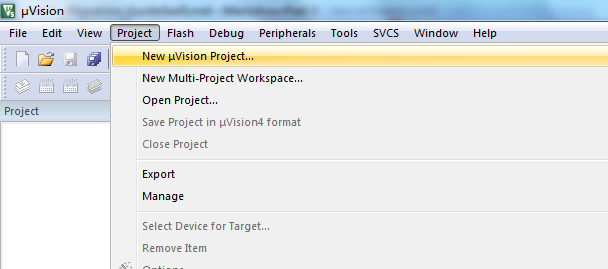
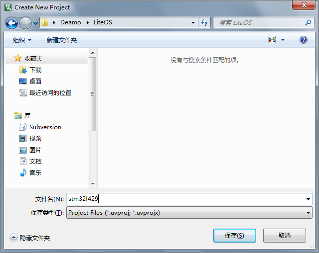
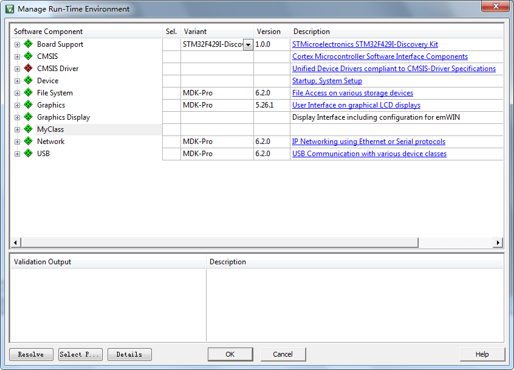
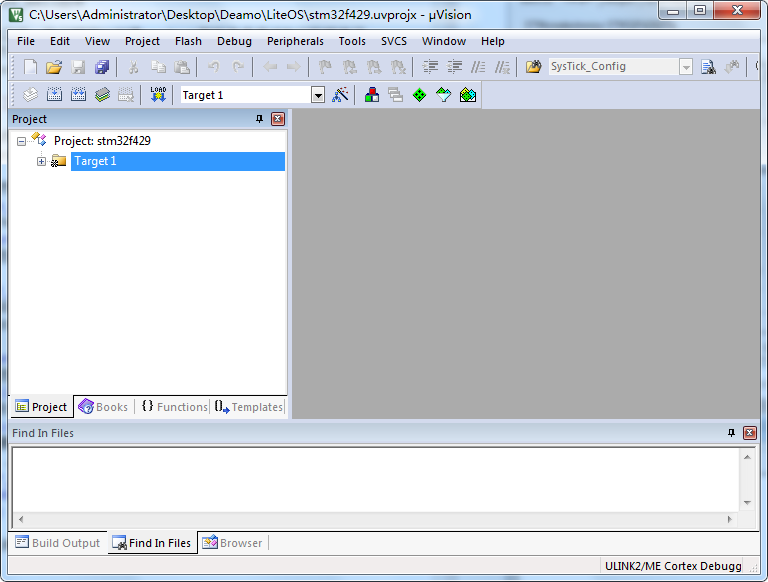
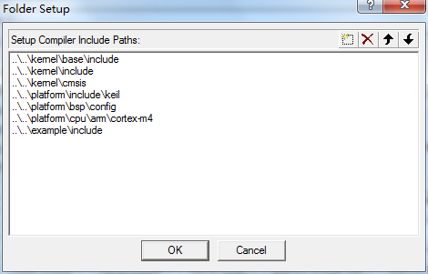
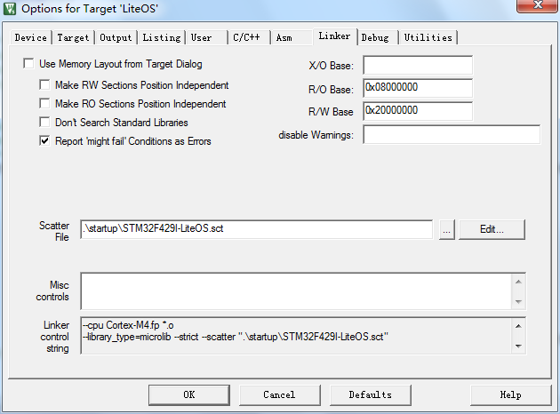
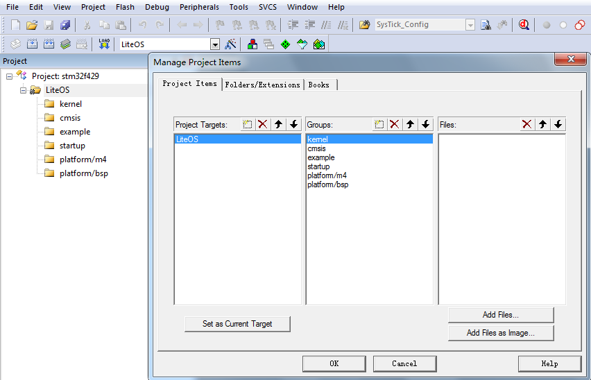
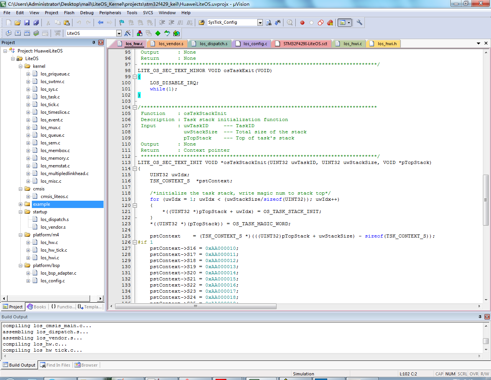

## 1开源协议说明
**您可以自由地：**

**分享** 

- 在任何媒介以任何形式复制、发行本作品

**演绎** 

- 修改、转换或以本作品为基础进行创作。只要你遵守许可协议条款，许可人就无法收回你的这些权利。

**惟须遵守下列条件：**

**署名** 

- 您必须提供适当的证书，提供一个链接到许可证，并指示是否作出更改。您可以以任何合理的方式这样做，但不是以任何方式表明，许可方赞同您或您的使用。

**非商业性使用** 

- 您不得将本作品用于商业目的。

**相同方式共享** 

- 如果您的修改、转换，或以本作品为基础进行创作，仅得依本素材的
授权条款来散布您的贡献作品。

**没有附加限制** 

- 您不能增设法律条款或科技措施，来限制别人依授权条款本已许可的作为。

**声明：**

-  当您使用本素材中属于公众领域的元素，或当法律有例外或限制条款允许您的使用，
则您不需要遵守本授权条款。
未提供保证。本授权条款未必能完全提供您预期用途所需要的所有许可。例如：形象
权、隐私权、著作人格权等其他权利，可能限制您如何使用本素材。

**注意**

- 为了方便用户理解，这是协议的概述. 可以访问网址 https://creativecommons.org/licenses/by-sa/3.0/legalcode 了解完整协议内容.

## 2前言
### 目的
本文档介绍基于Huawei LiteOS如何移植到第三方开发板，并成功运行基础示例。
### 读者对象
本文档主要适用于Huawei LiteOS Kernel的开发者。
本文档主要适用于以下对象：
- 物联网端软件开发工程师
- 物联网架构设计师

### 符号约定
在本文中可能出现下列标志，它们所代表的含义如下。

     用于警示紧急的危险情形，若不避免，将会导致人员死亡或严重的人身伤害

    用于警示潜在的危险情形，若不避免，可能会导致人员死亡或严重的人身伤害

    用于警示潜在的危险情形，若不避免，可能会导致中度或轻微的人身伤害

     用于传递设备或环境安全警示信息，若不避免，可能会导致设备损坏、数据丢失、设备性能降低或其它不可预知的结果“注意”不涉及人身伤害

| 说明	|		“说明”不是安全警示信息，不涉及人身、设备及环境伤害信息	|

### 修订记录
修改记录累积了每次文档更新的说明。最新版本的文档包含以前所有文档版本的更新
内容。

<table>
	<tr>
	<td>日期</td>
	<td>修订版本</td>
	<td>描述</td>
	</tr>
	<tr>
	<td>2017年1月17日</td>
	<td>1.0</td>
	<td>完成初稿</td>
	</tr>
</table>

## 3概述

目前在github上已开源的Huawei LiteOS内核源码已适配好STM32F411、STM32F429芯片，本手册将
以STM32F429ZI芯片为例，介绍基于Cortex M4核芯片的移植过程。

## 4环境准备
基于Huawei LiteOS Kernel开发前，我们首先需要准备好单板运行的环境，包括软件环
境和硬件环境。
硬件环境：

<table>
	<tr>
	<td>所需硬件</td>
	<td>描述</td>
	</tr>
	<tr>
	<td>STM32F4291-DISCO单板</td>
	<td>STM32开发板(芯片型号STM32F429ZIT6)</td>
	</tr>
	<tr>
	<td>PC机</td>
	<td>用于编译、加载并调试镜像</td>
	</tr>
	<tr>
	<td>电源（5v）</td>
	<td>开发板供电(使用Mini USB连接线)</td>
	</tr>
</table>

软件环境：

<table>
	<tr>
	<td>软件</td>
	<td>描述</td>
	</tr>
	<tr>
	<td>Window 7 操作系</td>
	<td>安装Keil和st-link的操作系统</td>
	</tr>
	<tr>
	<td>Keil(5.21以上版本)</td>
	<td>用于编译、链接、调试程序代码
	uVision V5.21.1.0 MDK-Lite uVersion:5.21a</td>
	</tr>
	<tr>
	<td>st-link_v2_usbdriver</td>
	<td>开发板与pc连接的驱动程序，用户加载及调试程序代码</td>
	</tr>
</table>

**说明**

Keil工具需要开发者自行购买，ST-Link的驱动程序可以从st link的相关网站获取，采用J-Link还
是ST-Link需要根据具体使用的开发板来确定。这里以STM32F429为例，使用ST-Link。

## 5获取Huawei LiteOS 源码

首先我们需要通过网络下载获取Huawei LiteOS开发包。目前Huawei LiteOS的代码已经
开源，可以直接从网络上获取，步骤如下：

- 仓库地址是https://github.com/LITEOS/LiteOS_Kernel.git 

- 点击”clone or download”按钮,下载源代码

- 目录结构如下：Huawei LiteOS的源代码目录的各子目录包含的内容如下：

关于代码树中各个目录存放的源代码的相关内容简介如下：

<table>
<tr>
	<td>一级目录</td>
	<td>二级目录</td>
	<td>说明</td>
</tr>
<tr>
	<td>kernel</td>
	<td>base</td>
	<td>此目录存放的是与平台无关的内核代码，包含核心提供给外部调用的接口的头文件以及内核中进程调度、进程通信、内存管理等等功能的核心代码。用户一般不需要修改此目录下的相关内容。</td>
</tr>
<tr>
	<td></td>
	<td>include</td>
	<td>内核的相关头文件存放目录</td>
</tr>
<tr>
	<td></td>
	<td>cmsis</td>
	<td>LiteOS提供的cmsis接口</td>
</tr>
<tr>
	<td>platform</td>
	<td>bsp</td>
	<td>目录下则是内核入口相关示例代码。用户自己实现的相关应用程序源代码都可以放到此文件夹下的子目录或者拷贝sample目录更名为其他名称再添加新的源代码。(注：总入口函数是main函数)</td>
</tr>
<tr>
	<td></td>
	<td>cpu</td>
	<td>该目录以及以下目录存放的是与体系架构紧密相关的硬件初始化的代码。此目录最好按照芯片的体系结构以及芯片型号进行命名方便区分。比如目前我们实现了arm/cortex-m4这个芯片对应的硬件初始化内容。用户最好按照这样的划分进行新的芯片型号的添加</td>
</tr>
<tr>
	<td>example</td>
	<td>api</td>
	<td>此目录存放的是内核功能测试用的相关用例的代码</td>
</tr>
<tr>
	<td></td>
	<td>include</td>
	<td>内核功能测试的用例相关头文件</td>
</tr>
<tr>
	<td>projects</td>
	<td>stm32f411_iar</td>
	<td>stm32f411开发板的iar工程目录</td>
</tr>
<tr>
	<td></td>
	<td>stm32f429_iar</td>
	<td>stm32f429开发板的iar工程目录</td>
</tr>
<tr>
	<td></td>
	<td>stm32f429_keil</td>
	<td>stm32f429开发板的keil工程目录</td>
</tr>
<tr>
	<td>doc</td>
	<td></td>
	<td>此目录存放的是LiteOS的使用文档和API说明文档</td>
</tr>
</table>

获取Huawei LiteOS源代码之后，我们就可以创建project然后编译调试我们的程序了，
详细可以参考后续的各个章节。详细的编程应用编程API请参考《HuaweiLiteOSKernelDevGuide》

## 6创建Huawei LiteOS 工程

在获取完成Huawei LiteOS的源代码和安装好Keil等相关的开发工具后，我们需要用Keil
集成开发环境创建编译Huawei LiteOS的工程，步骤如下：

- 打开Keil uVision5， 然后点击project->New uVision Project...创建一个新的工程

- 保存工程名，比如stm32f429

保存后会立即出现芯片型号选择的窗口，根据实际的开发板的芯片进行选择，比如stm32f429zi是目前demo使用的芯片

- 然后选择要包含的开发基础库，比如CMSIS、DEVICE两个选项可以选择平台提供的支持包和启动汇编文件，不过目前LiteOS有自己的启动文件，并且不需要额外的驱动，所以可以直接点击OK跳过

- 完成上面的芯片和支持包选择之后，可以配置相关编译选项。

- 配置target，如果需要调试log输出（printf）到IDE，可以选择Use MicroLib。

- 配置头文件搜索路径，需要kernel/include kernel/base/include platform/include platform/include/keil .....等等，详细参考图片所示内容。

- 配置分散加载文件

stm32f429的配置文件内容如下：

说明：分散配置文件中增加的是vector（中断向量表）的内容，LiteOS的中断向量表在stm32f429ZI这个芯片中定义的是0x400大小。如果不了解分散加载文件可以参考IDE的help中有关sct文件的说明。或者baidu、google分散加载文件相关内容。

- 配置debug使用的驱动

如上图所示，使用ST-Link

- 如果需要使用printf输出调试log，可以使用软件仿真的方式

### 添加代码到工程目录

- 创建LiteOS的相关目录层级

- 添加源代码到相关目录下，最终添加完成的内容如下：

说明：
los_dispatch.s、los_vendor.s这两个文件在Keil工程中放在projects\stm32f429_keil\startup目录下，iar工程中放在projects\stm32f429_iar\startup目录下。因为编译工具不同，汇编文件语法不一样，所以有各自不同的汇编文件。

### kernel API测试代码

如果需要测试LiteOS是否正常运行，可以将example\api添加到工程目录中。

### 测试代码使用

测试代码入口是los_demo_entry.c中的LOS_Demo_Entry()这个接口，使用方法los_config.c的main中调用

示例如下：

	extern void LOS_Demo_Entry(void)；
	int main(void)
	{
		UINT32 uwRet;
		uwRet = osMain();
		if (uwRet != LOS_OK) {
			return LOS_NOK;
		}
		LOS_Demo_Entry()；
		LOS_Start();

		for (;;);
		/* Replace the dots (...) with your own code.  */
	}

**如何选择测试的功能：**

在example\include\los_demo_entry.h 打开要测试的功能的宏开关

- LOS_KERNEL_TEST_xxx，比如测试task调度打开 LOS_KERNEL_TEST_TASK 即可（//#define LOS_KERNEL_TEST_TASK 修改为 #define LOS_KERNEL_TEST_TASK）

- 如果需要printf，则将los_demo_debug.h中的LOS_KERNEL_DEBUG_OUTLOS_KERNEL_TEST_KEIL_SWSIMU打开。如果是在IAR工程中则不需要打开LOS_KERNEL_TEST_KEIL_SWSIMU

- 中断测试无法在软件仿真的情况下测试。

**在keil中需要使用printf打印可以有几种方法**

- 将printf重定位到uart输出，这个需要uart驱动支持，如果只有liteOS而没有相关驱动加入工程则不建议使用该方法。
- 使用软件仿真的方式在keil IDE的debug printf view中查看。

## 7编译调试
打开工程后，菜单栏Project→Clean Targets、Build target、Rebuild All target files，可编译文件。这里点
击Rebuild All target file，编译全部文件

**关于中断向量位置选择**

- 在los_bsp_adapter.c中，g_use_ram_vect变量控制了LiteOS中是否使用vector向量表（中断向量表）重定向功能。如果g_use_ram_vect设置为 1 ，则需要在配置分散加载文件，如果配置为0，则不配置分散加载文件（即在上面的配置步骤中可以不进行分散加载文件配置），系统启动后默认中断向量表在Rom的0x00000000地址。

**关于工程创建**

目前在LiteOS的源代码中已经存在了一些已经创建好的工程，用户可以直接使用，它们都在projects目录下。建议用户使用projects下已经建立好的工程作为LiteOS运行是否正常的参考工程使用。

## 8如何使用LiteOS 开发

LiteOS中提供的功能包括如下内容： 任务创建与删除、任务同步（信号量、互斥锁）、动态中断注册机制 等等内容，更详细的内容可以参考“HuaweiLiteOSKernelDevGuide”中描述的相关内容。下面章节将对任务和中断进行说明

### 8.1 创建任务

- 对于嵌入式系统来说，内存都是比较宝贵的资源，因此在一般的程序都会严格管理内存使用。LiteOS也是一样。在LiteOS中系统资源使用了g_ucMemStart[OS_SYS_MEM_SIZE]作为内存池，来管理任务、信号量等等资源的创建，总共是32K。而给用户创建的task的的个数则是LOSCFG_BASE_CORE_TSK_LIMIT（15）.

- 用户使用LOS_TaskCreate(...)等接口来进行任务的创建。具体可以参考example/api/los_api_task.c中的使用方法来创建管理任务。

### 8.2 中断处理
#### Huawei LiteOS 的中断使用
在驱动开发的过程中我们可能会使用到中断，因此我们需要注册自己的中断处理程
序。在Huawei LiteOS中有一套自己的中断的逻辑。

- 在OS启动后，ram的起始地址0x20000000到0x20000400是用来存放中断向量表的，并且系统启动的汇编代码中只讲reset功能写入到了对应的区域。并且用了一个全局的m_pstHwiForm[ ] 来管理中断。

- 开发者需要使用某些中断时，可以通过LOS_HwiCreate (…)接口来添加自己的中断处理函数。如果驱动卸载还可以通过LOS_HwiDelete(….)来删除自己的中断处理函数。系统还提供了LOS_IntLock()关中断LOS_IntRestore()恢复到中断前状态等接口。详细的使用方法可以参考LiteOS中已经使用的地方。

- LiteOS的中断机制会额外地使用2K的RAM，并且跟大部分开发板的bsp代码包中的的机制也不是一个工作方式。用户可以选择不使用该中断机制。简单的办法在los_bsp_adapter.c中将g_use_ram_vect变量设置为0，并且在配置工程的时候不配置分散加载文件。这样就可以使用demo板的bsp包提供的中断使用的方式了。

### 8.3 其他功能接口

LiteOS中提供的所有接口的使用示例都可以在“HuaweiLiteOSKernelDevGuide”文档中找到。
根据文档中描述的内容就可以开发出逻辑复杂的应用程序了。

## 9如何移植LiteOS到已有工程
本章节将讲述如何在已有平台的基础上使用LiteOS提供的功能。
### 修改sct配置文件
sct分散加载文件的修改需要参考芯片说明手册，主要修改片上rom及ram的大小。由于LiteOS使用了自己的中断向量管理机制，在配置文件中需要加入LiteOS所使用的中断向量区域的定义。详细修改方法可以参考第6章进行配置。

**说明**

sct中定义了分散加载的相关内容，LiteOS主要是在其中加入了中断向量所需要的地址范围。中断向量表的大小可根据芯片实际支持的中断数目进行修改。如果需要加入其它内容，开发者可以自己定义。

### 修改startup_xxx.s文件

- 此文件是系统启动文件，该文件中主要定义Reset相关的内容。LiteOS开源代码中与之对应的文件名为los_vendor.s，不同工程目录下有各自的los_vendor.s文件，例如Keil工程中的路径：LiteOS_Kernel\projects\stm32f429_keil\startup\los_vendor.s。
- stm32f429的演示工程中，直接使用工程中的startup_stm32f429xx.s文件，不做修改，也可以使用LiteOS提供的los_vendor.s文件替换。
- 使用中断注册是必须配套使用分散加载文件机制，且将g_use_ram_vect的值改为1。

### 修改los_dispatch.s文件
- 此文件中是与锁以及进程调度相关的一些内容的实现，不同的芯片类型汇编代码以及寄存器都不一样这样需要根据实际的芯片来进行相关的修改。但是功能必须保证跟LiteOS中提供的汇编代码功能一致。当然用户也可以增加其他需要的功能。
- 目前LiteOS的los_dispatch.s中定义的PendSV_Handler()这个函数是比较重要的与进程调度相关。由于不同芯片的汇编指令不一样，需要特别注意。

### 移植系统中断和外部中断
- Huawei LiteOS定义了自己的中断向量表，OS_M4_SYS_VECTOR_CNT后的其他中断处理函数都默认注册成了osHwiDefaultHandler处理函数，用户使用前需要使用LOS_HwiCreate进行注册。

- 系统tick的相关中断。osTickStart()使能了系统时钟中断。LiteOS调度相关的内容都会在每个tick中断到来时被执行。如果平台底层驱动有需要在tick中断中处理的事物，使用LiteOS的中断机制的情况下，请在LOS_TickHandler()中增加相关内容。

**说明：**

在OS_M4_SYS_VECTOR_CNT之前的中断(系统异常和fault)都在m_pstHwiForm[]静态地添加。

### 添加LiteOS到已有的平台示例
本章节描述的内容是以STM32F429I中的GPIO示例程序为基础添加LiteOS。
- 首先将LiteOS的代码添加到已有工程中如下图所示：

- 之后我们需要配置好增加liteos后需要的头文件路径以及分散加载文件等内容。

**添加头文件搜索路径**

编译C/C++设置中需要勾选C99选项，否则编译会报错。

**添加分散加载文件**

- 将los_config.c文件中main函数改为mian_1,将其中的代码复制到main.c的main函数中，并注释掉其中的SystemClock_Config()。
 
- 新建GPIO相关的任务，并实现任务处理函数LOS_Demo_Tskfunc()，将原有的main函数代移动到GPIO任务处理函数中。
 
- 在LOS_Demo_Tskfunc()函数中注册GPIO外部中断到LiteOS的中断向量管理表。
 
- los_bsp_adapter.c文件中osTickStart()函数需调用SystemClock_Config()及SysTick_Config()函数，进行系统时钟及tick配置，sys_clk_freq修改为系统时钟总频率180000000。
 
- 将m_pstHwiForm表格中的LOS_TickHandler()函数修改为SysTick_Handler()函数，并在SysTick_Handler()函数中添加HAL_IncTick()函数.

- 在main()函数中调用GPIO任务创建函数LOS_Test_Gpio_Entry()。

修改后的main函数内容如下：
	
	int main(void)
	{
		UINT32 uwRet;
		
		uwRet = osMain();
		if (uwRet != LOS_OK) {
				return LOS_NOK;
		}
		
		LOS_Test_Gpio_Entry();
		
		LOS_Start();
	  
	  /* Infinite loop */
	  while (1)
	  {
	  }
	}

main.c中添加GPIO任务创建函数：
	
	void LOS_Test_Gpio_Entry(void)
	{
	    UINT32 uwRet;
	    TSK_INIT_PARAM_S stTaskInitParam;
	
	    (VOID)memset((void *)(&stTaskInitParam), 0, sizeof(TSK_INIT_PARAM_S));
	    stTaskInitParam.pfnTaskEntry = (TSK_ENTRY_FUNC)LOS_Demo_Tskfunc;
	    stTaskInitParam.uwStackSize = LOSCFG_BASE_CORE_TSK_IDLE_STACK_SIZE;
	    stTaskInitParam.pcName = "UartDemo";
	    stTaskInitParam.usTaskPrio = 10;
	    uwRet = LOS_TaskCreate(&g_uwDemoTaskID, &stTaskInitParam);
	
	    if (uwRet != LOS_OK)
	    {
	        return ;
	    }
	    return ;
	}

main.c中添加GPIO任务处理函数LOS_Demo_Tskfunc()内容如下：

	LITE_OS_SEC_TEXT VOID LOS_Demo_Tskfunc(VOID)
	{
		LOS_HwiCreate(6, 0,0,Gpio_Demo_IRQHandler,0);
		
		/* This sample code shows how to use STM32F4xx GPIO HAL API to toggle PG13 
	     IOs (connected to LED3 on STM32F429i-Discovery board) 
	    in an infinite loop.
	    To proceed, 3 steps are required: */
	
	  /* STM32F4xx HAL library initialization:
	       - Configure the Flash prefetch, instruction and Data caches
	       - Configure the Systick to generate an interrupt each 1 msec
	       - Set NVIC Group Priority to 4
	       - Global MSP (MCU Support Package) initialization
	     */
	  HAL_Init();
	
	  /* Configure LED3 and LED4 */
	  BSP_LED_Init(LED3);
	  BSP_LED_Init(LED4);
	  
	  /* Configure the system clock to 180 MHz */
	  //SystemClock_Config();
	  
	  /* Configure EXTI Line0 (connected to PA0 pin) in interrupt mode */
	  EXTILine0_Config();
	}

los_bsp_adapter.c中修改后的osTickStart()函数：
		
	unsigned int osTickStart(void)
	{
	    unsigned int uwRet = 0;
		
	    /* This code section LOS need, so don't change it */
	    g_ucycle_per_tick = sys_clk_freq / tick_per_second;
	    LOS_SetTickSycle(g_ucycle_per_tick);
	  
	#if 0  
	    /* 
	      Set system tick relaod register valude, current register valude and start
	      system tick exception.
	      Note: here can be replaced by some function , for example in Stm32 bsp
	      you can just call SysTick_Config(sys_clk_freq/tick_per_second);
	    */
	    *(volatile UINT32 *)OS_SYSTICK_RELOAD_REG = g_ucycle_per_tick - 1;
	    *((volatile UINT8 *)OS_NVIC_EXCPRI_BASE + (((UINT32)(-1) & 0xF) - 4)) = ((7 << 4) & 0xff);
	    *(volatile UINT32 *)OS_SYSTICK_CURRENT_REG = 0;
	    *(volatile UINT32 *)OS_SYSTICK_CONTROL_REG = (1 << 2) | (1 << 1) | (1 << 0);
	#endif
	
	    SystemClock_Config();	
		   
			SysTick_Config(g_ucycle_per_tick);
		
	    return uwRet;
	
	}
los_hwi.c中修改后的m_pstHwiForm表格：

	LITE_OS_SEC_VEC HWI_PROC_FUNC m_pstHwiForm[OS_M4_VECTOR_CNT] =
	{
	  0,                    // [0] Top of Stack
	  Reset_Handler,        // [1] reset
	  osHwiDefaultHandler,  // [2] NMI Handler
	  osHwiDefaultHandler,  // [3] Hard Fault Handler
	  osHwiDefaultHandler,  // [4] MPU Fault Handler
	  osHwiDefaultHandler,  // [5] Bus Fault Handler
	  osHwiDefaultHandler,  // [6] Usage Fault Handler
	  0,                    // [7] Reserved
	  0,                    // [8] Reserved
	  0,                    // [9] Reserved
	  0,                    // [10] Reserved
	  osHwiDefaultHandler,  // [11] SVCall Handler
	  osHwiDefaultHandler,  // [12] Debug Monitor Handler
	  0,                    // [13] Reserved
	  PendSV_Handler,             // [14] PendSV Handler
	  SysTick_Handler,  // [15] SysTick Handler
	};

修改los_config.h中的systick配置：

	#define OS_SYS_CLOCK 16000000修改为#define OS_SYS_CLOCK 180000000

经过以上步骤，完成了代码的初步移植，然后可以编译调试运行，按demo板上的user按键，可以看到LED3指示灯亮、灭。

**移植需要注意的地方**

汇编启动文件必须保证正常运行，可以使用平台已经有的启动文件再加上los_dispatch.s或者直接使用liteos提供的汇编文件而不使用原工程中的汇编文件。
系统时钟必须根据配置的内容进行修改。
如果涉及到芯片跟文档中使用的型号不一样，那么还需要熟悉汇编的人员修改los_dispatch.s来达到在新平台上能够正常运行。
分散加载文件必须保证正确的配置，如需修改请根据liteOS中提供的分散加载文件进行不同平台的适配

	; *************************************************************
	; *** Scatter-Loading Description File generated by uVision ***
	; *************************************************************

	LR_IROM1 0x08000000 0x00200000  {    ; load region size_region
	  ER_IROM1 0x08000000 0x00200000  {  ; load address = execution address
	   *.o (RESET, +First)
	   *(InRoot$$Sections)
	   .ANY (+RO)
	  }
	  VECTOR 0x20000000 0x400 { ;vector
		* (.vector.bss)
	  }

	  RW_IRAM1 0x20000400 0x0002Fc00  {  ; RW data
	   .ANY (+RW +ZI)
	   * (.data, .bss)
	  }
	}

主要增加了VECTOR 及内存中加载* (.data, .bss)这个段的内容。

## 其他说明
目前git上提供的代码中直接提供了IAR和Keil的示例工程，可以直接用来进行参考。

