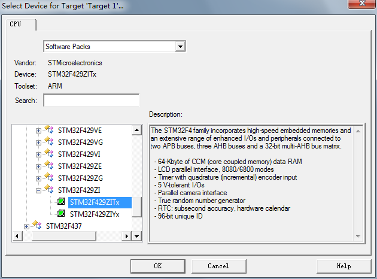

<!-- order:10 -->
## 创建Huawei LiteOS 工程
---

在获取完成Huawei LiteOS的源代码和安装好Keil等相关的开发工具后，我们需要用Keil
集成开发环境创建编译Huawei LiteOS的工程，步骤如下：

1. 打开Keil uVision5， 然后点击project->New uVision Project...创建一个新的工程

    

2. 保存工程名，比如stm32f429

    

3. 保存后会立即弹出芯片型号选择的窗口，根据实际的开发板的芯片进行选择，比如stm32f429zi是目前demo使用的芯片。

    

4. 然后选择要包含的开发基础库，比如CMSIS、DEVICE两个选项可以选择平台提供的支持包和启动汇编文件，不过目前LiteOS有自己的启动文件，并且不需要额外的驱动，所以可以直接点击OK跳过。

    

5. 至此，我们的工程已经创建完成，如下图所示：

    

完成上面的芯片和支持包选择之后，可以将源代码添加到工程中。

