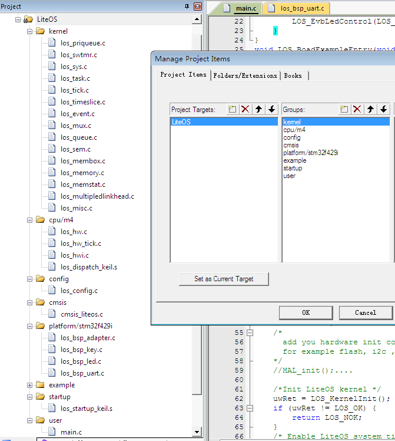

<!-- order:11 -->
### 添加kernel代码到工程
---

1. 创建LiteOS的相关目录层级

    

2. 创建完成目录树之后我们逐个添加源代码到目录树中，最终添加完成的内容如下：

    - 将kernel/base目录下的所有C代码添加到工程中的kernel下
    - 将kernel/cmsis目录下的所有C代码添加到工程中的cmsis下。
    - 将platform\STM32F429I_DISCO目录下的所有C代码添加到工程中的platform/stm32f429i下
    - 将kernel\cpu\arm\cortex-m4目录下的所有C代码以及汇编代码添加到工程中的cpu/m4下
    - 将kernel\config目录下的所有C代码添加到工程中的config下
    - 将user目录下的所有C代码添加到工程中的user下
    - 将platform\STM32F429I_DISCO目录下keil版本的startup汇编代码添加到工程中的startup下

说明：已经创建好的工程中还增加了example的添加，example下的内容是用来测试kernel api接口的。
