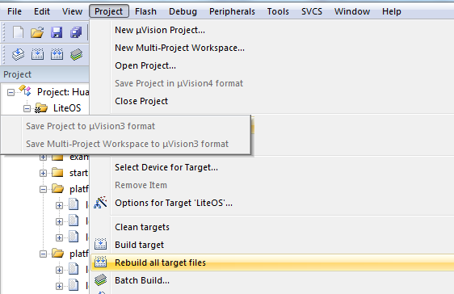

<!-- order:15 -->
## 编译调试
---
打开工程后，菜单栏Project→Clean Targets、Build target、Rebuild All target files，可编译文件。这里点
击Rebuild All target file，编译全部文件

**关于中断向量位置选择**

在los_bsp_adapter.c中，g_use_ram_vect变量控制了LiteOS中是否使用vector向量表（中断向量表）重定向功能。如果g_use_ram_vect设置为 1 ，则需要在配置分散加载文件，如果配置为0，则不配置分散加载文件（即在上面的配置步骤中可以不进行分散加载文件配置），系统启动后默认中断向量表在Rom的0x00000000地址。

**关于工程创建**

目前在LiteOS的源代码中已经存在了一些已经创建好的工程，用户可以直接使用，它们都在projects目录下。建议用户使用projects下已经建立好的工程作为LiteOS运行是否正常的参考工程使用。

