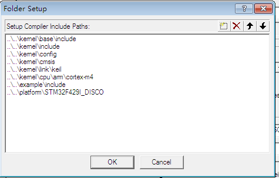
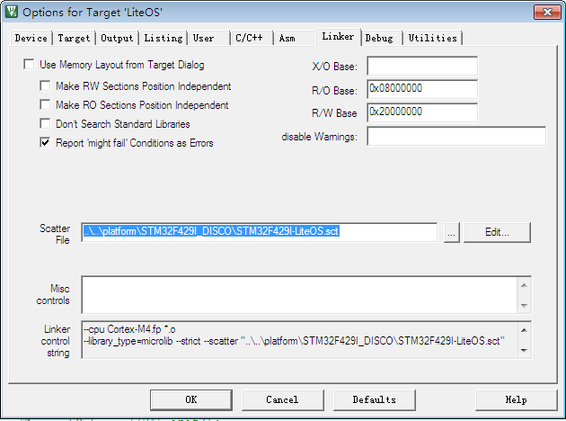
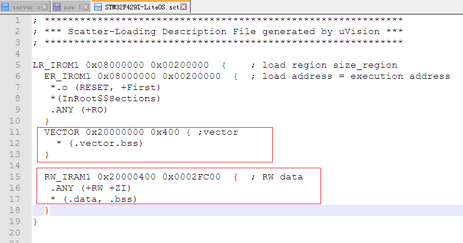
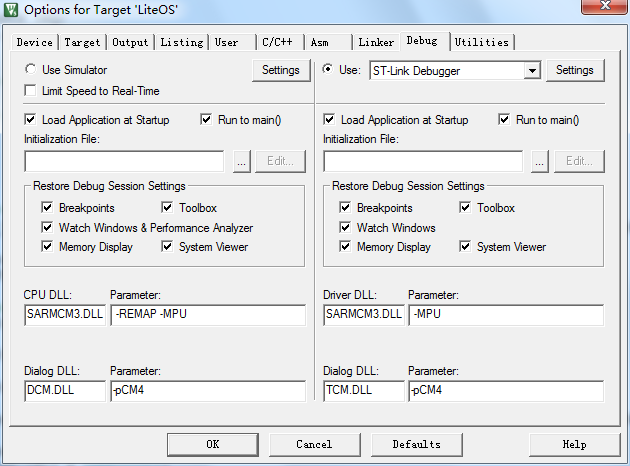
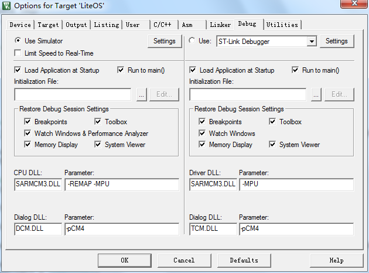

<!-- order:12 -->
### 配置工程属性
---

1. 配置target，如果需要调试log输出（printf）到IDE，可以选择Use MicroLib。

    

2. 编译C/C++设置中勾选C99选项

    

3. 配置头文件搜索路径，需要..\..\kernel\base\include;..\..\kernel\include;..\..\kernel\config;..\..\kernel\cmsis;..\..\kernel\link\keil;..\..\kernel\cpu\arm\cortex-m4;..\..\example\include;..\..\platform\STM32F429I_DISCO等等，详细参考图片所示内容。

    

    **说明**： platform\STM32F429I_DISCO以及kernel\cpu\arm\cortex-m4则需要根据实际使用的cpu和开发板目录来添加。

4. 配置分散加载文件

    

    **例子**：stm32f429的配置文件内容如下：

    

     **说明**：
    - 分散加载文件在每个开发板目录下，比如stm32f429的是\platform\STM32F429I_DISCO\STM32F429I-LiteOS.sct

    - 分散配置文件中增加的是vector（中断向量表）的内容，LiteOS的中断向量表在stm32f429ZI这个芯片中定义的是0x400大小。如果不了解分散加载文件可以参考IDE的help中有关sct文件的说明。或者baidu、google分散加载文件相关内容。

5. 配置debug使用的驱动，选择ST-Link。

    

6. 对于需要使用printf输出调试log的场景，可以使用软件仿真。

    

