## 1开源协议说明
**您可以自由地：**

**分享** 

- 在任何媒介以任何形式复制、发行本作品

**演绎** 

- 修改、转换或以本作品为基础进行创作。只要你遵守许可协议条款，许可人就无法收回你的这些权利。

**惟须遵守下列条件：**

**署名** 

- 您必须提供适当的证书，提供一个链接到许可证，并指示是否作出更改。您可以以任何合理的方式这样做，但不是以任何方式表明，许可方赞同您或您的使用。

**非商业性使用** 

- 您不得将本作品用于商业目的。

**相同方式共享** 

- 如果您的修改、转换，或以本作品为基础进行创作，仅得依本素材的
授权条款来散布您的贡献作品。

**没有附加限制** 

- 您不能增设法律条款或科技措施，来限制别人依授权条款本已许可的作为。

**声明：**

-  当您使用本素材中属于公众领域的元素，或当法律有例外或限制条款允许您的使用，
则您不需要遵守本授权条款。
未提供保证。本授权条款未必能完全提供您预期用途所需要的所有许可。例如：形象
权、隐私权、著作人格权等其他权利，可能限制您如何使用本素材。

**注意**

- 为了方便用户理解，这是协议的概述. 可以访问网址 https://creativecommons.org/licenses/by-sa/3.0/legalcode 了解完整协议内容.

## 2前言
### 目的
本文档介绍基于Huawei LiteOS如何移植到第三方开发板，并成功运行基础示例。
### 读者对象

本文档主要适用于Huawei LiteOS Kernel的开发者。
本文档主要适用于以下对象：
- 物联网端软件开发工程师
- 物联网架构设计师

### 符号约定
在本文中可能出现下列标志，它们所代表的含义如下。

     用于警示紧急的危险情形，若不避免，将会导致人员死亡或严重的人身伤害

    用于警示潜在的危险情形，若不避免，可能会导致人员死亡或严重的人身伤害

    用于警示潜在的危险情形，若不避免，可能会导致中度或轻微的人身伤害

     用于传递设备或环境安全警示信息，若不避免，可能会导致设备损坏、数据丢失、设备性能降低或其它不可预知的结果“注意”不涉及人身伤害

| 说明	|		“说明”不是安全警示信息，不涉及人身、设备及环境伤害信息	|

### 修订记录
修改记录累积了每次文档更新的说明。最新版本的文档包含以前所有文档版本的更新
内容。

<table>
	<tr>
	<td>日期</td>
	<td>修订版本</td>
	<td>描述</td>
	</tr>
	<tr>
	<td>2017年04月20日</td>
	<td>1.0</td>
	<td>完成初稿</td>
	</tr>
</table>

## 3概述

目前在github上已开源的Huawei LiteOS内核源码已适配好STM32F412、STM32F429、STM32L476、GD32F450、GD32F190、LPC824、LPC54114、MM32F103芯片，本手册将以MM32F103芯片为例，介绍如何将驱动代码移植到内核工程的过程。

## 4环境准备
基于Huawei LiteOS Kernel开发前，我们首先需要准备好单板运行的环境，包括软件环
境和硬件环境。
硬件环境：

<table>
	<tr>
	<td>所需硬件</td>
	<td>描述</td>
	</tr>
	<tr>
	<td>MM32F103 MindBoard</td>
	<td>MM32F103开发板(芯片型号MM32F103CBT6)</td>
	</tr>
	<tr>
	<td>PC机</td>
	<td>用于编译、加载并调试镜像</td>
	</tr>
	<tr>
	<td>电源（5v）</td>
	<td>开发板供电(使用Micro USB连接线)</td>
	</tr>
</table>

软件环境：

<table>
	<tr>
	<td>软件</td>
	<td>描述</td>
	</tr>
	<tr>
	<td>Window 7 操作系统</td>
	<td>安装Keil</td>
	</tr>
	<tr>
	<td>Keil(5.18以上版本)</td>
	<td>用于编译、链接、调试程序代码
	uVision V5.18.0.0 MDK-Lite</td>
	</tr>
    <tr>
	<td>Setup_JLinkARM_V490.exe</td>
	<td>j-link仿真器与pc连接的驱动程序，用户加载及调试程序代码</td>
	</tr>
	<tr>
	<td>SSCOM串口调试工具</td>
	<td>串口调试工具，根据个人喜好可使用其他的串口工具</td>
	</tr>
</table>

**说明**

Keil工具需要开发者自行购买,MM32F103开发板的调试器是J-LINK，支持SWD调试接口，使用前需要安装J-LIINK驱动。

## 5获取Huawei LiteOS 源码

首先我们从github上下载Huawei LiteOS内核源代码，步骤如下：

- 仓库地址是https://github.com/LITEOS/LiteOS_Kernel.git 

- 点击”clone or download”按钮,下载源代码

- 目录结构如下：Huawei LiteOS的源代码目录的各子目录包含的内容如下：

关于代码树中各个目录存放的源代码的相关内容简介如下：

<table>
<tr>
	<td>一级目录</td>
	<td>二级目录</td>
	<td>说明</td>
</tr>
<tr>
	<td>doc</td>
	<td></td>
	<td>此目录存放的是LiteOS的使用文档和API说明文档</td>
</tr>
<tr>
	<td>example</td>
	<td>api</td>
	<td>此目录存放的是内核功能测试用的相关用例的代码</td>
</tr>
<tr>
	<td></td>
	<td>include</td>
	<td>aip功能头文件存放目录</td>
</tr>
<tr>
	<td>kernel</td>
	<td>base</td>
	<td>此目录存放的是与平台无关的内核代码，包含核心提供给外部调用的接口的头文件以及内核中进程调度、进程通信、内存管理等等功能的核心代码。用户一般不需要修改此目录下的相关内容。</td>
</tr>
<tr>
	<td></td>
	<td>cmsis</td>
	<td>LiteOS提供的cmsis接口</td>
</tr>
<tr>
	<td></td>
	<td>config</td>
	<td>此目录下是内核资源配置相关的代码，在头文件中配置了LiteOS所提供的各种资源所占用的内存池的总大小以及各种资源的数量，例如task的最大个数、信号量的最大个数等等</td>
</tr>
<tr>
	<td></td>
	<td>cpu</td>
	<td>此目录以及以下目录存放的是与体系架构紧密相关的适配LiteOS的代码。比如目前我们适配了arm/cortex-m4及arm/cortex-m3系列对应的初始化内容。</td>
</tr>
<tr>
	<td></td>
	<td>include</td>
	<td>内核的相关头文件存放目录</td>
</tr>
<tr>
	<td></td>
	<td>link</td>
	<td>IDE相关宏定义</td>
</tr>
<tr>
	<td>platform</td>
	<td>GD32F190R-EVAL</td>
	<td>GD190开发板systick及驱动相关代码</td>
</tr>
<tr>
	<td></td>
	<td>GD32F450i-EVAL</td>
	<td>GD450开发板systick及驱动相关代码</td>
</tr>
<tr>
	<td></td>
	<td>STM32F412ZG-NUCLEO</td>
	<td>STM32F412开发板systick及驱动相关代码</td>
</tr>
<tr>
	<td></td>
	<td>STM32F429I_DISCO</td>
	<td>STM32F429开发板systick及驱动相关代码</td>
</tr>
<tr>
	<td></td>
	<td>STM32L476RG_NUCLEO</td>
	<td>STM32L476开发板systick及驱动相关代码</td>
</tr>
<tr>
	<td></td>
	<td>LPC824_LITE</td>
	<td>LPC824Lite开发板systick及驱动相关代码</td>
</tr>
<tr>
	<td></td>
	<td>LPC54110_BOARD</td>
	<td>LPC54110开发板systick及驱动相关代码</td>
</tr>
<tr>
	<td></td>
	<td>MM32F103_MINI</td>
	<td>MM32F103开发板systick及驱动相关代码</td>
</tr>
<tr>
	<td></td>
	<td>LOS_EXPAND_XXX</td>
	<td>用于新扩展的开发板systick以及led、uart、key驱动bsp适配代码</td>
</tr>
<tr>
	<td>projects</td>
	<td>STM32F412ZG-NUCLEO-KEIL</td>
	<td>stm32f412开发板的keil工程目录</td>
</tr>
<tr>
	<td></td>
	<td>STM32F429I_DISCO_IAR</td>
	<td>stm32f429开发板的iar工程目录</td>
</tr>
<tr>
	<td></td>
	<td>STM32F429I_DISCO_KEIL</td>
	<td>stm32f429开发板的keil工程目录</td>
</tr>
<tr>
	<td></td>
	<td>STM32L476R-NUCLEO-KEIL</td>
	<td>stm32l476开发板的keil工程目录</td>
</tr>
<tr>
	<td></td>
	<td>GD32F190R-EVAL-KEIL</td>
	<td>gd32f190开发板的keil工程目录</td>
</tr>
<tr>
	<td></td>
	<td>GD32F450i-EVAL-KEIL</td>
	<td>gd32f450开发板的keil工程目录</td>
</tr>
<tr>
	<td></td>
	<td>LPC824_LITE_KEIL</td>
	<td>lpc824Lite开发板的keil工程目录</td>
</tr>
<tr>
	<td></td>
	<td>LPC54110_BOARD_KEIL</td>
	<td>lpc54110开发板的keil工程目录</td>
</tr>
<tr>
	<td></td>
	<td>MM32F103_MINI_KEIL</td>
	<td>MindMotion MM32 MiniBoard开发板的keil工程目录</td>
</tr>
<tr>
	<td>user</td>
	<td></td>
	<td>此目录存放用户代码，LiteOS启动代码在mian()函数中</td>
</tr>
</table>

获取Huawei LiteOS源代码之后，我们可以将自己本地的驱动代码适配到LiteOS内核工程中进行应用开发。

## 6如何适配LiteOS内核工程开发
本章节描述的内容以MM32F103 MiniBoard开发板官方提供的开发包资料为基础，适配硬件驱动代码到LiteOS源码MM32F103_MINI_KEIL工程中，演示按键中断、LED点亮、串口输出、AD采集、外部Flash及EEPROM等操作。

**MM32F103开发资料获取**

从开发板官网获取开发包资料，网址为：http://www.mindmotion.com.cn/download1.aspx

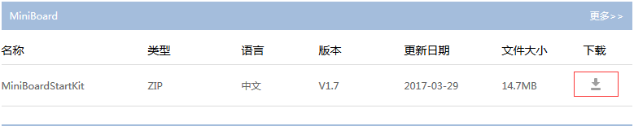

**MM32F103 pack包安装**

解压“MiniBoardStartKit_V1.7.zip”文件，安装MindMotion.MM32x103_DFP.1.3.0.pack文件到keil软件安装目录。

**添加代码到LiteOS工程**

- 拷贝3-Sample_Code\MM32F103RegLibCB_MB_V1.9.0目录下的Device文件夹到platform\MM32F103_MINI文件夹中。

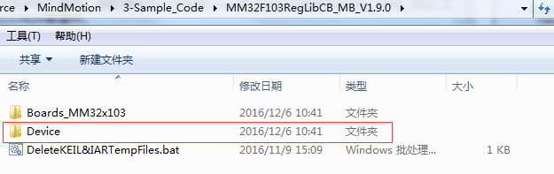

- 拷贝MiniBoard_test文件夹下的bsp、HARDWARE、SYSTEM文件夹到platform\MM32F103_MINI文件夹中。

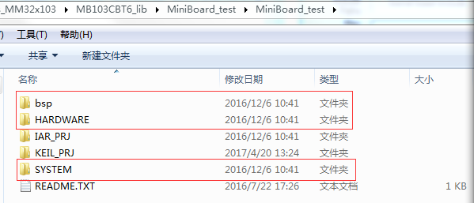

- 拷贝EXTI_KEY\HARDWARE文件夹下的EXTI、KEY文件夹到\platform\MM32F103_MINI\HARDWARE文件夹中。

- 拷贝完成后的MM32F103_MINI文件夹内容如下图

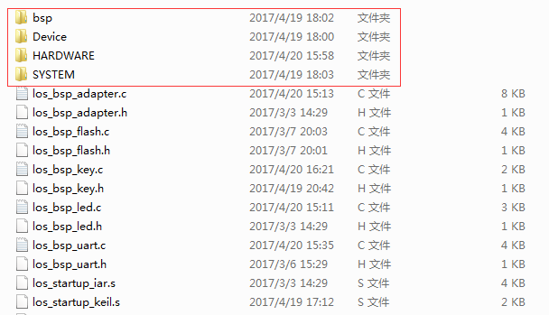

- 拷贝完成后的MM32F103_MINI\HARDWARE文件夹内容如下图

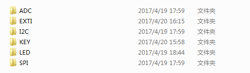

- 参照MiniBoard_test工程在LiteOS工程中添加下图所示目录及对应的源文件，hardware目录下需要再添加exti.c及key.c文件。

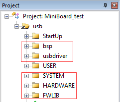

- 替换LiteOS工程startup目录下的启动汇编文件如下图

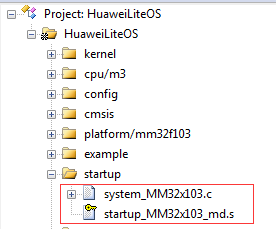

- 完成添加后的LiteOS新增的目录如下图

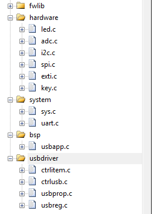

**添加头文件搜索路径**

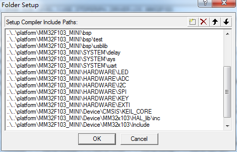

**添加编译宏选项**

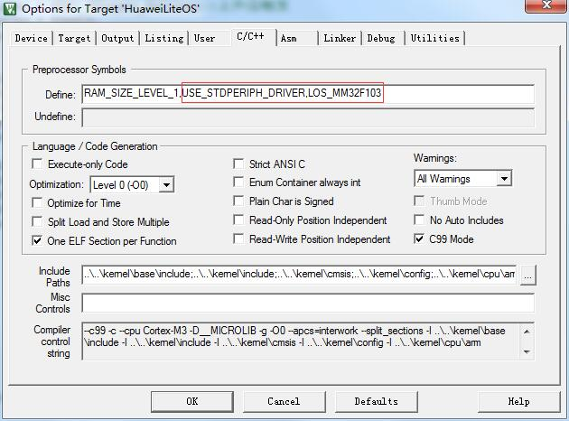

LiteOS工程替换启动文件后，使用中断时不需再使用LiteOS中断注册接口进行注册。在完成了代码添加及工程配置后，开始修改代码，步骤如下：

- 在main.c文件中添加如下代码。

		#include "usb.h"  
		#include "spi.h"	  
		#include "adc.h"
		
		
		unsigned char volatile usb_flag=0;
		
		extern u8  SPIM_Test(SPI_TypeDef* SPIx);
		extern u8 I2CMasterTest(I2C_TypeDef *I2Cx);
		
		/*****************************************************************************
		 Function    : SetUSBSysClockTo48M
		 Description : config system clock to 48 MHZ
		 Input       : None
		 Output      : None
		 Return      : None
		 *****************************************************************************/
		void SetUSBSysClockTo48M(void)
		{
		    __IO uint32_t StartUpCounter = 0, HSEStatus = 0;
		    RCC_DeInit();
		    /* SYSCLK, HCLK, PCLK2 and PCLK1 configuration ---------------------------*/
		    /* Enable HSE */    
		    RCC->CR |= ((uint32_t)RCC_CR_HSEON);
		
		    /* Wait till HSE is ready and if Time out is reached exit */
		    do
		    {
		        HSEStatus = RCC->CR & RCC_CR_HSERDY;
		        StartUpCounter++;  
		    } while((HSEStatus == 0) && (StartUpCounter != HSE_STARTUP_TIMEOUT));
		
		    if ((RCC->CR & RCC_CR_HSERDY) != RESET)
		    {
		        HSEStatus = (uint32_t)0x01;
		    }
		    else
		    {
		        HSEStatus = (uint32_t)0x00;
		    }  
		    
		    if (HSEStatus == (uint32_t)0x01)
		    {
		        /* Enable Prefetch Buffer */
		        FLASH->ACR |= FLASH_ACR_PRFTBE;
		        /* Flash 0 wait state ,bit0~2*/
		        FLASH->ACR &= ~0x07;
		        FLASH->ACR |=0x02;
		        /* HCLK = SYSCLK */
		        RCC->CFGR |= (uint32_t)RCC_CFGR_HPRE_DIV1;
		
		        /* PCLK2 = HCLK */
		        RCC->CFGR |= (uint32_t)RCC_CFGR_PPRE2_DIV1;
		
		        /* PCLK1 = HCLK */
		        RCC->CFGR |= (uint32_t)RCC_CFGR_PPRE1_DIV2;
		
		        /*  PLL configuration:  = (HSE ) * (5+1) = 48MHz */
		        RCC->CFGR &= (uint32_t)0xFFFCFFFF;
		        RCC->CR &= (uint32_t)0x000FFFFF;  
		
		        RCC->CFGR |= (uint32_t ) RCC_CFGR_PLLSRC ;
		        RCC->CR |= 0x14000000;//pll = 6/1
		        //RCC->CFGR &= (uint32_t)((uint32_t)~(RCC_CFGR_PLLSRC | RCC_CFGR_PLLXTPRE | RCC_CFGR_PLLMULL));
		        //RCC->CFGR |= (uint32_t)(RCC_CFGR_PLLSRC_HSE | RCC_CFGR_PLLXTPRE_HSE_Div2 | RCC_CFGR_PLLMULL6);
		
		        /* Enable PLL */
		        RCC->CR |= RCC_CR_PLLON;
		
		        /* Wait till PLL is ready */
		        while((RCC->CR & RCC_CR_PLLRDY) == 0)
		        {
		        }
		
		        /* Select PLL as system clock source */
		        RCC->CFGR &= (uint32_t)((uint32_t)~(RCC_CFGR_SW));
		        RCC->CFGR |= (uint32_t)RCC_CFGR_SW_PLL;    
		
		        /* Wait till PLL is used as system clock source */
		        while ((RCC->CFGR & (uint32_t)RCC_CFGR_SWS) != (uint32_t)0x08)
		        {
		        }
		    }
		    else
		    { /* If HSE fails to start-up, the application will have wrong clock 
		        configuration. User can add here some code to deal with this error */
		    }
		}

- 修改main.c文件中的LOS_BoadExampleTskfunc()函数

		LITE_OS_SEC_TEXT VOID LOS_BoadExampleTskfunc(VOID)
		{     
		    u8 ucRet;
			u8 ucLed = 0xff;
			u32 delay=2000,usb_ok=0;
			unsigned char ucFlag=0;
			unsigned int uiADData=0;
			float fValue = 0;
		
		    usb_test();
		    printf("/***************/\r\n");
		    SPIM_Test(SPI2);
		    printf("\r\n");
		    ucRet=I2CMasterTest(I2C1);
		    if(0 == ucRet)
		        printf("   EEPROM OK\r\n");
		    else
		        printf("   EEPROM error\r\n");
		
		    printf("\r\n");
		
		    while(delay--)
		    {
		        LOS_TaskDelay(1);
		        usb_ok=0;
		        if(usb_flag==1)
		        {
		            usb_ok=1;
		            printf("   USB OK!!!\r\n");
		            break;
		        }
		    }
		    if(usb_ok==0)
		        printf("   USB ERROR!!!\r\n");
		
		    printf("/***************/\r\n");
		
		    while(1)              
		    {   
		        ucFlag=ADC1_SingleChannel_Get( ADC_Channel_1, &uiADData);  
		        if(ucFlag==1)
		        {
		            ucFlag=0;
		            fValue = ((float)uiADData/4096)*3.3;
		            printf("@_@ ADC1_CH_1=%fV\r\n",fValue);   
		        }
		        LOS_TaskDelay(1000);  
		        ucLed = ~ucLed;
		        LOS_EvbLedControl(LOS_LED1, ucLed);
		    }          
		}

- 修改los_bsp_adapter.c文件中的sys_clk_freq变量值与实际配置的系统时钟一致。

	    const unsigned int sys_clk_freq = 48000000;

- 修改exti.c文件，注释掉“delay.h”头文件包含，添加delay_ms(u32 ulMs)函数。
  
		//#include "delay.h"
		 
		/*****************************************************************************
		 Function    : delay_ms
		 Description : The time delay function
		 Input       : ulMs
		 Output      : None
		 Return      : None
		 *****************************************************************************/
		void delay_ms(u32 ulMs)
		{
		    u32 i;
		    u16 j;
		    for(i = ulMs;i > 0;i--)
		    {
		        for(j = 4700;j > 0;j--);
		    }
		}

- 修改uart.c文件，屏蔽掉printf重定向代码

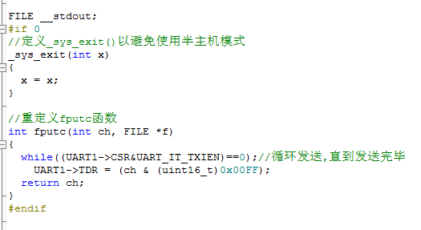

- 为了避免与驱动代码的重复定义，修改los_typedef.h文件中的宏定义，并同步修改引用这些宏的代码

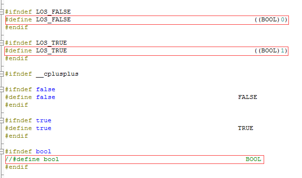

经过以上步骤，完成了代码的初步移植，接下来可以编译代码,连接串口线（事先安装相关驱动）并在串口调试工具中打开相应串口，调试运行时可看到串口打印输出采集到的电压值，LED3闪烁，按开发板上的K2-K4键，有对应的LED灯亮、灭。

## 7 其他说明

###如何使用LiteOS 开发###

LiteOS中提供的功能包括如下内容： 任务创建与删除、任务同步（信号量、互斥锁）、动态中断注册机制等等内容，详细内容请参考《HuaweiLiteOSKernelDevGuide》。

###从零开始创建LiteOS工程###

目前在LiteOS的源代码的projects目录下已附带一些开发板的内核示例工程，用户可以直接使用，如果您所使用的开发板（芯片型号）与在示例工程中找不到，您可以从零开始创建LiteOS工程，创建流程请参考《LiteOS_Migration_Guide_Keil》。

###关于中断向量位置选择###

如果您需要使用LiteOS的中断注册机制，详细内容请参考《LiteOS_Migration_Guide_Keil》。

### kernel API测试代码 ###

如果您需要测试LiteOS内核工程运行情况，详细内容请参考《LiteOS_Migration_Guide_Keil》。