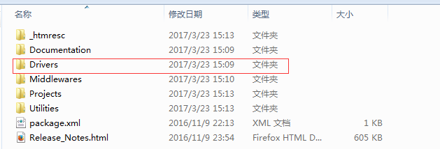
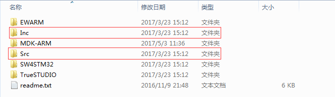
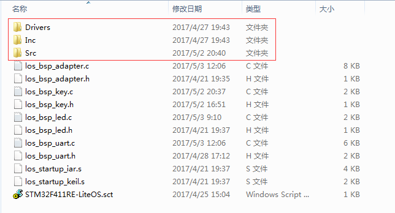
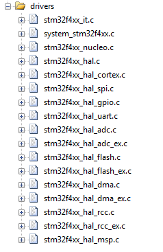
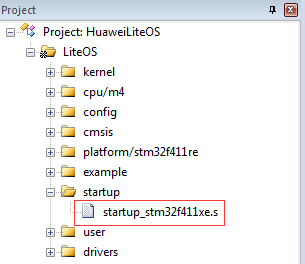
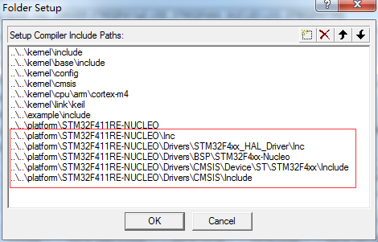
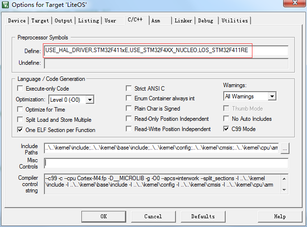

## 1关于本文档的开源协议说明
**您可以自由地：**

**分享** 

- 在任何媒介以任何形式复制、发行本文档

**演绎** 

- 修改、转换或以本文档为基础进行创作。只要你遵守许可协议条款，许可人就无法收回你的这些权利。

**惟须遵守下列条件：**

**署名** 

- 您必须提供适当的证书，提供一个链接到许可证，并指示是否作出更改。您可以以任何合理的方式这样做，但不是以任何方式表明，许可方赞同您或您的使用。

**非商业性使用** 

- 您不得将本作品用于商业目的。

**相同方式共享** 

- 如果您的修改、转换，或以本文档为基础进行创作，仅得依本素材的
授权条款来散布您的贡献作品。

**没有附加限制** 

- 您不能增设法律条款或科技措施，来限制别人依授权条款本已许可的作为。

**声明：**

-  当您使用本素材中属于公众领域的元素，或当法律有例外或限制条款允许您的使用，
则您不需要遵守本授权条款。
未提供保证。本授权条款未必能完全提供您预期用途所需要的所有许可。例如：形象
权、隐私权、著作人格权等其他权利，可能限制您如何使用本素材。

**注意**

- 为了方便用户理解，这是协议的概述. 可以访问网址 https://creativecommons.org/licenses/by-sa/3.0/legalcode 了解完整协议内容.

## 2前言
### 目的
本文档介绍基于Huawei LiteOS如何移植到第三方开发板，并成功运行基础示例。
### 读者对象
本文档主要适用于Huawei LiteOS Kernel的开发者。
本文档主要适用于以下对象：
- 物联网端软件开发工程师
- 物联网架构设计师

### 符号约定
在本文中可能出现下列标志，它们所代表的含义如下。

     用于警示紧急的危险情形，若不避免，将会导致人员死亡或严重的人身伤害

    用于警示潜在的危险情形，若不避免，可能会导致人员死亡或严重的人身伤害

    用于警示潜在的危险情形，若不避免，可能会导致中度或轻微的人身伤害

     用于传递设备或环境安全警示信息，若不避免，可能会导致设备损坏、数据丢失、设备性能降低或其它不可预知的结果“注意”不涉及人身伤害

| 说明	|		“说明”不是安全警示信息，不涉及人身、设备及环境伤害信息	|

### 修订记录
修改记录累积了每次文档更新的说明。最新版本的文档包含以前所有文档版本的更新
内容。

<table>
	<tr>
	<td>日期</td>
	<td>修订版本</td>
	<td>描述</td>
	</tr>
	<tr>
	<td>2017年05月03日</td>
	<td>1.0</td>
	<td>完成初稿</td>
	</tr>
</table>

## 3 概述

目前在github上的Huawei LiteOS内核源码已适配好部分芯片的内核工程，本手册将以STM32F411RET6芯片为例，介绍基于Cortex M4核芯片的驱动移植过程。

## 4 环境准备
基于Huawei LiteOS Kernel开发前，我们首先需要准备好单板运行的环境，包括软件环
境和硬件环境。
硬件环境：

<table>
	<tr>
	<td>所需硬件</td>
	<td>描述</td>
	</tr>
	<tr>
	<td>STM32 NUCLEO-F411RE单板</td>
	<td>STM32开发板(芯片型号STM32F411RET6)</td>
	</tr>
	<tr>
	<td>PC机</td>
	<td>用于编译、加载并调试镜像</td>
	</tr>
	<tr>
	<td>电源（5v）</td>
	<td>开发板供电(使用Mini USB连接线)</td>
	</tr>
</table>

软件环境：

<table>
	<tr>
	<td>软件</td>
	<td>描述</td>
	</tr>
	<tr>
	<td>Window 7 操作系统</td>
	<td>安装Keil和st-link的操作系统</td>
	</tr>
	<tr>
	<td>Keil(5.21以上版本)</td>
	<td>用于编译、链接、调试程序代码
	uVision V5.21.1.0 MDK-Lite uVersion:5.21a</td>
	</tr>
	<tr>
	<td>stsw-link009</td>
	<td>开发板与pc连接的驱动程序，用户加载及调试程序代码</td>
	</tr>
</table>

**说明**

Keil工具需要开发者自行购买，ST-Link的驱动程序可以从st官网获取。

## 5获取Huawei LiteOS 源码

首先我们需要通过网络下载获取Huawei LiteOS开发包。目前Huawei LiteOS的代码已经
开源，可以直接从网络上获取，步骤如下：

- 仓库地址是https://github.com/LITEOS/LiteOS_Kernel.git 

- 点击”clone or download”按钮,下载源代码

- 目录结构如下：Huawei LiteOS的源代码目录的各子目录包含的内容如下：

关于代码树中各个目录存放的源代码的相关内容简介如下：

<table>
<tr>
	<td>一级目录</td>
	<td>二级目录</td>
	<td>说明</td>
</tr>
<tr>
	<td>doc</td>
	<td></td>
	<td>此目录存放的是LiteOS的使用文档和API说明文档</td>
</tr>
<tr>
	<td>example</td>
	<td>api</td>
	<td>此目录存放的是内核功能测试用的相关用例的代码</td>
</tr>
<tr>
	<td></td>
	<td>include</td>
	<td>aip功能头文件存放目录</td>
</tr>
<tr>
	<td>kernel</td>
	<td>base</td>
	<td>此目录存放的是与平台无关的内核代码，包含核心提供给外部调用的接口的头文件以及内核中进程调度、进程通信、内存管理等等功能的核心代码。用户一般不需要修改此目录下的相关内容。</td>
</tr>
<tr>
	<td></td>
	<td>cmsis</td>
	<td>LiteOS提供的cmsis接口</td>
</tr>
<tr>
	<td></td>
	<td>config</td>
	<td>此目录下是内核资源配置相关的代码，在头文件中配置了LiteOS所提供的各种资源所占用的内存池的总大小以及各种资源的数量，例如task的最大个数、信号量的最大个数等等</td>
</tr>
<tr>
	<td></td>
	<td>cpu</td>
	<td>此目录以及以下目录存放的是与体系架构紧密相关的适配LiteOS的代码。比如目前我们适配了arm/cortex-m4及arm/cortex-m3系列对应的初始化内容。</td>
</tr>
<tr>
	<td></td>
	<td>include</td>
	<td>内核的相关头文件存放目录</td>
</tr>
<tr>
	<td></td>
	<td>link</td>
	<td>与IDE相关的编译链接相关宏定义</td>
</tr>
<tr>
	<td>platform</td>
	<td>GD32F190R-EVAL</td>
	<td>GD190开发板systick以及led、uart、key驱动bsp适配代码</td>
</tr>
<tr>
	<td></td>
	<td>GD32F450i-EVAL</td>
	<td>GD450开发板systick以及led、uart、key驱动bsp适配代码</td>
</tr>
<tr>
	<td></td>
	<td>STM32F412ZG-NUCLEO</td>
	<td>STM32F412开发板systick以及led、uart、key驱动bsp适配代码</td>
</tr>
<tr>
	<td></td>
	<td>STM32F411RE-NUCLEO</td>
	<td>STM32F411开发板systick以及led、uart、key驱动bsp适配代码</td>
</tr>
<tr>
	<td></td>
	<td>STM32F429I_DISCO</td>
	<td>STM32F429开发板systick以及led、uart、key驱动bsp适配代码</td>
</tr>
<tr>
	<td></td>
	<td>STM32L476RG_NUCLEO</td>
	<td>STM32L476开发板systick以及led、uart、key驱动bsp适配代码</td>
</tr>
<tr>
	<td></td>
	<td>LOS_EXPAND_XXX</td>
	<td>用于新扩展的开发板systick以及led、uart、key驱动bsp适配代码</td>
</tr>
<tr>
	<td>projects</td>
	<td>STM32F412ZG-NUCLEO-KEIL</td>
	<td>stm32f412开发板的keil工程目录</td>
</tr>
<tr>
	<td></td>
	<td>STM32F411RE-NUCLEO-KEIL</td>
	<td>stm32f411开发板的keil工程目录</td>
</tr>
<tr>
	<td></td>
	<td>STM32F429I_DISCO_IAR</td>
	<td>stm32f429开发板的iar工程目录</td>
</tr>
<tr>
	<td></td>
	<td>STM32F429I_DISCO_KEIL</td>
	<td>stm32f429开发板的keil工程目录</td>
</tr>
<tr>
	<td></td>
	<td>STM32L476R-NUCLEO-KEIL</td>
	<td>stm32l476开发板的keil工程目录</td>
</tr>
<tr>
	<td></td>
	<td>GD32F190R-EVAL-KEIL</td>
	<td>gd32f190开发板的keil工程目录</td>
</tr>
<tr>
	<td></td>
	<td>GD32F450i-EVAL-KEIL</td>
	<td>gd32f450开发板的keil工程目录</td>
</tr>
<tr>
	<td>user</td>
	<td></td>
	<td>此目录存放用户测试代码，LiteOS的初始化和使用示例在main.c中</td>
</tr>
</table>

获取Huawei LiteOS源代码之后，我们可以将自己本地已有工程的代码适配到LiteOS内核工程中进行应用开发。

## 6如何适配LiteOS内核工程开发
本章节描述的内容以stm32cubef4开发包中的UART_Printf示例工程为基础，适配到LiteOS的STM32F411RE-NUCLEO-KEIL工程中，演示串口输出、按键检测及LED点亮功能。

### 获取STM32开发资料获取

- 从ST官网搜索“stm32cubef4”，获取相应的开发包资料，网址为：http://www.st.com/content/st_com/en/products/embedded-software/mcus-embedded-software/stm32-embedded-software/stm32cube-embedded-software/stm32cubef4.html

- 从keil官网下载PACK包，网址为：http://www.keil.com/dd2/stmicroelectronics/stm32f411retx/

- 下载STSW-LINK009驱动，网址为：http://www.st.com/content/st_com/en/products/embedded-software/development-tool-software/stsw-link009.html

### pack包及驱动安装

- 安装Keil.STM32F4xx_DFP.2.11.0.pack或者更高版本的pack文件到keil安装目录
 
- 解压en.stsw-link009.zip文件，点击stlink_winusb_install.bat，安装st-link驱动

### 添加驱动代码到LiteOS工程中

下载后解压缩开发包，找到\STM32Cube_FW_F4_V1.14.0\Projects\STM32F411RE-Nucleo\Examples\UART\UART_Printf\MDK-ARM下面的工程文件并打开，做为STM32F411的驱动代码移植的参考。

分析STM32F411的源代码工程主要包含两个部分的内容：

- STM32Cube_FW_F4_V1.14.0目录下的驱动代码

- STM32Cube_FW_F4_V1.14.0\Projects\STM32F411RE-Nucleo\Examples\UART\UART_Printf工程目录下的应用适配程序

将上面截图的这两部分代码拷贝到LiteOS_Kernel\platform\STM32F411RE-NUCLEO目录下，拷贝完成后如下图所示

完成驱动代码拷贝后，开始添加驱动代码到工程,新建drivers目录，添加如下文件

使用Drivers\CMSIS\Device\ST\STM32F4xx\Source\Templates\arm目录下的startup_stm32f411xe.s文件替换工程startup目录下的los_startup_keil.s文件

替换LiteOS工程启动文件后，使用中断时不需再使用LiteOS中断注册接口进行注册。

**添加头文件搜索路径**

**添加编译宏选项**

### 代码修改适配

- 在main.c文件中添加代码如下

		#include "stm32f4xx_hal.h"	
		
		/**
		  * @brief  This function is executed in case of error occurrence.
		  * @param  None
		  * @retval None
		  */
		static void Error_Handler(void)
		{
		  /* Turn LED2 on */
		  BSP_LED_On(LED2);
		  while(1)
		  {
		  }
		}
		
		/**
		  * @brief  System Clock Configuration
		  *         The system Clock is configured as follow : 
		  *            System Clock source            = PLL (HSI)
		  *            SYSCLK(Hz)                     = 100000000
		  *            HCLK(Hz)                       = 100000000
		  *            AHB Prescaler                  = 1
		  *            APB1 Prescaler                 = 2
		  *            APB2 Prescaler                 = 1
		  *            HSI Frequency(Hz)              = 16000000
		  *            PLL_M                          = 16
		  *            PLL_N                          = 400
		  *            PLL_P                          = 4
		  *            PLL_Q                          = 7
		  *            VDD(V)                         = 3.3
		  *            Main regulator output voltage  = Scale2 mode
		  *            Flash Latency(WS)              = 3
		  * @param  None
		  * @retval None
		  */
		static void SystemClock_Config(void)
		{
		  RCC_ClkInitTypeDef RCC_ClkInitStruct;
		  RCC_OscInitTypeDef RCC_OscInitStruct;
		
		  /* Enable Power Control clock */
		  __HAL_RCC_PWR_CLK_ENABLE();
		  
		  /* The voltage scaling allows optimizing the power consumption when the device is 
		     clocked below the maximum system frequency, to update the voltage scaling value 
		     regarding system frequency refer to product datasheet.  */
		  __HAL_PWR_VOLTAGESCALING_CONFIG(PWR_REGULATOR_VOLTAGE_SCALE2);
		  
		  /* Enable HSI Oscillator and activate PLL with HSI as source */
		  RCC_OscInitStruct.OscillatorType = RCC_OSCILLATORTYPE_HSI;
		  RCC_OscInitStruct.HSIState = RCC_HSI_ON;
		  RCC_OscInitStruct.HSICalibrationValue = 0x10;
		  RCC_OscInitStruct.PLL.PLLState = RCC_PLL_ON;
		  RCC_OscInitStruct.PLL.PLLSource = RCC_PLLSOURCE_HSI;
		  RCC_OscInitStruct.PLL.PLLM = 16;
		  RCC_OscInitStruct.PLL.PLLN = 400;
		  RCC_OscInitStruct.PLL.PLLP = RCC_PLLP_DIV4;
		  RCC_OscInitStruct.PLL.PLLQ = 7;
		  if(HAL_RCC_OscConfig(&RCC_OscInitStruct) != HAL_OK)
		  {
		    Error_Handler();
		  }
		  
		  /* Select PLL as system clock source and configure the HCLK, PCLK1 and PCLK2 
		     clocks dividers */
		  RCC_ClkInitStruct.ClockType = (RCC_CLOCKTYPE_SYSCLK | RCC_CLOCKTYPE_HCLK | RCC_CLOCKTYPE_PCLK1 | RCC_CLOCKTYPE_PCLK2);
		  RCC_ClkInitStruct.SYSCLKSource = RCC_SYSCLKSOURCE_PLLCLK;
		  RCC_ClkInitStruct.AHBCLKDivider = RCC_SYSCLK_DIV1;
		  RCC_ClkInitStruct.APB1CLKDivider = RCC_HCLK_DIV2;  
		  RCC_ClkInitStruct.APB2CLKDivider = RCC_HCLK_DIV1;  
		  if(HAL_RCC_ClockConfig(&RCC_ClkInitStruct, FLASH_LATENCY_3) != HAL_OK)
		  {
		    Error_Handler();
		  }
		}

- 修改main.c文件中main()函数

		/*****************************************************************************
		Function    : main
		Description : Main function entry
		Input       : None
		Output      : None
		Return      : None
		 *****************************************************************************/
		LITE_OS_SEC_TEXT_INIT
		int main(void)
		{
		    UINT32 uwRet;
		    /*
		        add you hardware init code here
		        for example flash, i2c , system clock ....
		    */
		    HAL_Init();
		    SystemClock_Config();
		
		    /*Init LiteOS kernel */
		    uwRet = LOS_KernelInit();
		    if (uwRet != LOS_OK) {
		        return LOS_NOK;
		    }

		    /* Enable LiteOS system tick interrupt */
		    LOS_EnableTick();
		
		    /*
		        Notice: add your code here
		        here you can create task for your function 
		        do some hw init that need after systemtick init
		     */
		    LOS_EvbSetup();//init the device on the dev baord
		
		    //LOS_Demo_Entry();
		
		    LOS_Inspect_Entry();
		
		    //LOS_BoadExampleEntry();
		
		    /* Kernel start to run */
		    LOS_Start();
		    for (;;);
		    /* Replace the dots (...) with your own code. */
		}

- 修改los_bsp_adapter.c文件中的sys_clk_freq变量值与实际配置的系统时钟一致

	    const unsigned int sys_clk_freq = 100000000;

### 编译运行

经过以上步骤，完成了代码的初步移植，接下来可以编译代码,连接串口线（事先安装串口驱动）并在串口调试工具中打开相应串口，设置波特率为115200，调试运行时可看到串口会打印输出内核巡检结果，按开发板上的USER键，LED2灯点，串口输出“Key test example”，松开按键LED2熄灭。

**关于串口输出乱码说明**

部分USB转串口连接后会出现打印乱码的现象，建议更换较短或其他型号的串口线调试。

## 7 其他说明

###如何使用LiteOS 开发###

LiteOS中提供的功能包括如下内容： 任务创建与删除、任务同步（信号量、互斥锁）、动态中断注册机制等等内容，详细内容请参考《HuaweiLiteOSKernelDevGuide》。

###从零开始创建LiteOS工程###

目前在LiteOS的源代码的projects目录下已附带一些开发板的内核示例工程，用户可以直接使用，如果您所使用的开发板（芯片型号）与在示例工程中找不到，您可以从零开始创建LiteOS工程，创建流程请参考《LiteOS_Migration_Guide_Keil》。

###关于中断向量位置选择###

如果您需要使用LiteOS的中断注册机制，详细内容请参考《LiteOS_Migration_Guide_Keil》。

### kernel API测试代码 ###

如果您需要测试LiteOS内核工程运行情况，详细内容请参考《LiteOS_Migration_Guide_Keil》。

