# LiteOS移植指南
-   [概述](#概述)
    -   [什么是移植，为什么要移植](#什么是移植-为什么要移植)
    -   [指南适用范围](#指南适用范围)
    -   [移植目录结构](#移植目录结构)
-   [环境准备](#环境准备)
    -   [获取LiteOS源代码](#获取LiteOS源代码)
    -   [硬件环境](#硬件环境)
    -   [软件环境](#软件环境)
-   [创建裸机工程](#创建裸机工程)
    -   [简介](#简介-1)
    -   [新建工程](#新建工程)
    -   [配置芯片外设](#配置芯片外设)
    -   [配置工程](#配置工程)
    -   [生成裸机工程代码](#生成裸机工程代码)
    -   [测试裸机工程](#测试裸机工程)
-   [移植适配](#移植适配)
    -   [移植步骤](#移植步骤)
    -   [增加新开发板的目录](#增加新开发板的目录)
    -   [适配外设驱动和HAL库配置文件](#适配外设驱动和HAL库配置文件)
    -   [配置系统时钟](#配置系统时钟)
    -   [适配串口初始化文件](#适配串口初始化文件)
    -   [修改链接脚本](#修改链接脚本)
    -   [适配编译配置](#适配编译配置)
    -   [在LiteOS Studio上验证](#在LiteOS-Studio上验证)
-   [任务创建示例](#任务创建示例)
    -   [任务处理函数简介](#任务处理函数简介)
    -   [创建任务](#创建任务)
-   [常见问题](#常见问题)
    -   [如何进行GDB调试](#如何进行GDB调试)
    -   [如何联系LiteOS官方开发人员](#如何联系LiteOS官方开发人员)
<h2 id="概述">概述</h2>

-   **[什么是移植，为什么要移植](#什么是移植-为什么要移植)**

-   **[指南适用范围](#指南适用范围)**

-   **[移植目录结构](#移植目录结构)**


<h3 id="什么是移植-为什么要移植">什么是移植，为什么要移植</h3>

对于嵌入式设备，由于芯片型号和外设差异较大，且资源有限，所以物联网操作系统无法像 Windows/Linux 那样适配集成所有驱动，因此通常会先适配部分芯片/开发板。为了让操作系统运行在其他芯片/开发板上，此时就需要移植。

开发板的移植包括 CPU架构移植、板级/外设驱动移植和操作系统的移植。

<h3 id="指南适用范围">指南适用范围</h3>

本指南基于STM32芯片平台，以正点原子STM32F407开发板为例介绍如何快速移植LiteOS，其中并不涉及CPU架构移植。

<h3 id="移植目录结构">移植目录结构</h3>

表格列出了LiteOS源码的目录，其中加粗字体的目录/文件在移植过程中需要修改。

**表 1**  LiteOS源码目录
| 一级目录                    | 二级目录/文件            | 说明                                                          |
| ----------                  | ----------------------   |  -----------------------------------------------------------  |
| arch                        |                          |  芯片架构支持                                                 |
| build                       |                          |  LiteOS编译系统需要的配置及脚本                               |
| compat                      |                          |  LiteOS提供的CMSIS-RTOS 1.0和2.0接口                          |
| components                  |                          |  组件代码                                                     |
| demos                       |                          |  组件和内核的demo                                             |
| doc                         |                          |  LiteOS使用文档                                               |
| include                     |                          |  components中各模块的头文件                                   |
| kernel                      |                          |  内核代码                                                     |
| lib                         |                          |  libc/zlib/posix接口                                          |
| osdepends                   |                          |  LiteOS提供的部分OS适配接口                                   |
| targets                     | bsp                      |  通用板级支持包                                               |
|                             | Cloud_STM32F429IGTx_FIRE |  野火STM32F429（ARM Cortex M4）开发板的开发工程源码包         |
|                             | qemu-virt-a53            |  Coretex A53的qemu开发工程源码包                              |
|                             | realview-pbx-a9          |  Coretex A9的qemu开发工程源码包                               |
|                             | STM32F072_Nucleo         |  STM32F072_Nucleo（ARM Cortex M0）开发板的开发工程源码包      |
|                             | STM32F103_FIRE_Arbitrary |  野火STM32F103（ARM Cortex M3）霸道开发板的开发工程源码包     |
|                             | STM32F769IDISCOVERY      |  STM32F769IDISCOVERY（ARM Cortex M7）开发板的开发工程源码包   |
|                             | ...                      |  其他开发板的开发工程源码包                                   |
|                             | Kconfig                  |                                                               |
|                             | Makefile                 |                                                               |
|                             | **<font color="blue">targets.mk</font>** |                                               |
| tools                       | **<font color="blue">build/config</font>** |  LiteOS支持的各开发板的编译配置文件，移植新的开发板时，需要在这个目录下增加这个新开发板的编译配置文件 |
|                             |  menuconfig              |  LiteOS编译所需的menuconfig脚本                               |
| Makefile                    |                          |  整个LiteOS的Makefile                                         |
| **<font color="blue">.config</font>** |                |  开发板的编译配置文件，默认为Cloud_STM32F429IGTx_FIRE开发板的配置文件，移植时需要替换成新开发板的编译配置文件 |

target目录下保存了当前已经支持的开发板工程源码。当移植新开发板时，应该在target目录下增加该开发板的目录，目录结构和代码可以参考当前已支持的开发板的目录。例如：

-   STM32F4系列的移植可以参考Cloud\_STM32F429IGTx\_FIRE工程。
-   STM32F7系列的移植可以参考STM32F769IDISCOVERY工程。
-   STM32L4系列的移植可以参考STM32L431\_BearPi工程。

<h2 id="环境准备">环境准备</h2>

-   **[获取LiteOS源代码](#获取LiteOS源代码)**

-   **[硬件环境](#硬件环境)**

-   **[软件环境](#软件环境)**


<h3 id="获取LiteOS源代码">获取LiteOS源代码</h3>

<a href="https://gitee.com/LiteOS/LiteOS" target="_blank">LiteOS源码仓</a>在码云上，使用master分支。

<h3 id="硬件环境">硬件环境</h3>

<h4 id="开发板">开发板</h4>

本指南以国内主流STM32学习板-正点原子STM32F407开发板为例进行移植。该开发板的介绍可参考官方网站：<a href="http://www.alientek.com/productinfo/714608.html" target="_blank">探索者STM32F407开发板</a>。

<h4 id="烧录仿真器">烧录仿真器</h4>

JLink。

<h3 id="软件环境">软件环境</h3>

<h4 id="简介">简介</h4>

本指南主要基于LiteOS Studio集成开发环境进行移植，烧录工具为JLink，同时使用STM32CubeMX软件生成裸机工程。

<h4 id="安装STM32CubeMX">安装STM32CubeMX</h4>

<a href="https://www.st.com/content/st_com/en/products/development-tools/software-development-tools/stm32-software-development-tools/stm32-configurators-and-code-generators/stm32cubemx.html" target="_blank">STM32CubeMX下载</a>，本指南使用的是6.0.1版本。

<h4 id="安装LiteOS-Studio">安装LiteOS Studio</h4>

除了LiteOS Studio，同时还需要安装git工具、arm-none-eabi软件、make构建软件、C/C++扩展、JLink烧录软件，这些软件的安装均可参考<a href="https://liteos.gitee.io/liteos_studio/#/install" target="_blank">LiteOS Studio安装指南</a>。

所有软件安装完毕后，需要重启计算机。

> **须知：**
>对于板载STLink仿真器的STM32开发板，需要先把STLink仿真器刷成JLink仿真器，再按照JLink的方式烧写。可以参考LiteOS Studio官方文档的“STM32工程示例”中的<a href="https://liteos.gitee.io/liteos_studio/#/project_stm32?id=st-link仿真器单步调测" target="_blank">“ST-Link仿真器单步调测”</a>。

<h4 id="验证LiteOS-Studio集成开发环境">验证LiteOS Studio集成开发环境</h4>

在正式开始移植前，可以先验证当前开发环境是否能成功编译LiteOS代码并完成烧录。目前<a href="https://gitee.com/LiteOS/LiteOS" target="_blank">开源LiteOS</a>支持了若干开发板，如：Cloud\_STM32F429IGTx\_FIRE、STM32F769IDISCOVERY、STM32L431\_BearPi等。可以视情况验证环境：

-   没有官方已适配的开发板，可以先使用LiteOS已支持的开发板工程验证编译功能。暂时不验证烧录功能，在下一章节“[测试裸机工程](#测试裸机工程)”中再验证。
-   有官方已适配的开发板，使用开发板对应的工程验证编译和烧录功能。即：
    -   对于Cloud\_STM32F429IGTx\_FIRE开发板，在LiteOS Studio中配置目标板信息时，选择STM32F429IG。
    -   对于STM32F769IDISCOVERY开发板，在LiteOS Studio中配置目标板信息时，选择STM32F769NI。
    -   对于STM32L431\_BearPi 开发板，在LiteOS Studio中配置目标板信息时，选择STM32L431RC。


验证方法可以参考LiteOS Studio官方文档的“STM32工程示例”中的<a href="https://liteos.gitee.io/liteos_studio/#/project_stm32?id=使用入门" target="_blank">“使用入门”</a>（只需关注其中的“打开工程”、“目标板配置”、“编译配置-编译代码”和“烧录配置-烧录”）。

<h2 id="创建裸机工程">创建裸机工程</h2>

-   **[简介](#简介-1)**

-   **[新建工程](#新建工程)**

-   **[配置芯片外设](#配置芯片外设)**

-   **[配置工程](#配置工程)**

-   **[生成裸机工程代码](#生成裸机工程代码)**

-   **[测试裸机工程](#测试裸机工程)**

<h3 id="简介-1">简介</h3>

STM32CubeMX 是意法半导体\(ST\) 推出的一款图形化开发工具，支持 STM32 全系列产品，能够让用户轻松配置芯片外设引脚和功能，并一键生成C语言的裸机工程。

裸机工程可以为移植提供硬件配置文件和外设驱动文件，同时可以测试开发板的基本功能。以下介绍正点原子STM32F407的裸机工程创建过程。

<h3 id="新建工程">新建工程</h3>

1.  打开STM32CubeMX软件，点击菜单栏“File”在下拉菜单中选择“New Project”，如下图所示：

    **图 1**  新建工程<a name="fig4460124474916"></a>
    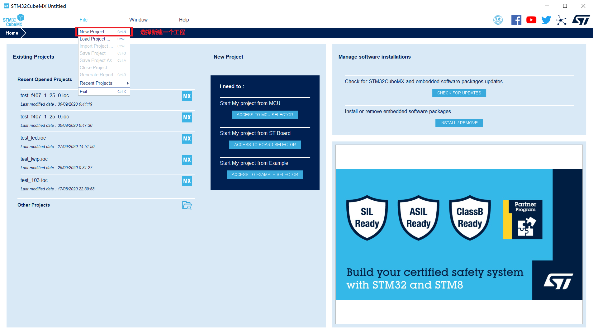

2.  选择开发板芯片。

    选择对应的开发板MCU（对于正点原子STM32F407开发板，选择STM32F407ZG），如下图所示：

    **图 2**  设置开发板芯片<a name="fig13913182955219"></a>
    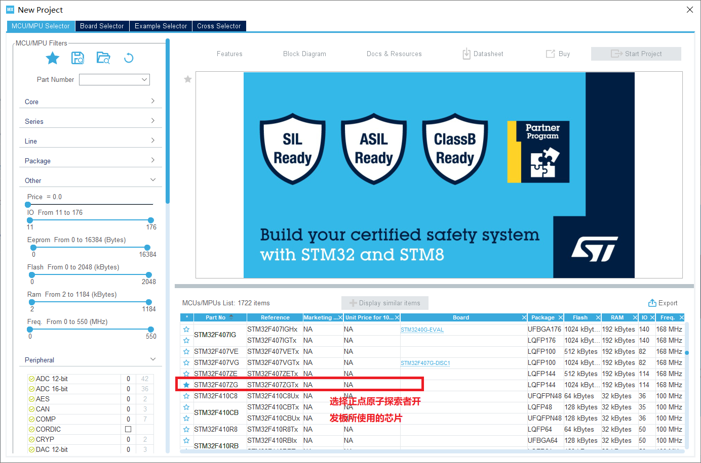


<h3 id="配置芯片外设">配置芯片外设</h3>

<h4 id="简介-0">简介</h4>

可以根据需要，自定义配置外设。这里仅配置了最基本的时钟、串口和LED灯、以及烧录调试方式，已经能满足LiteOS运行所需的基本硬件需求。

<h4 id="配置时钟">配置时钟</h4>

1.  配置时钟引脚。

    选择“Pinout & Configuration”标签页，在左边的“System Core”中选择RCC，设置HSE（High Speed Clock，外部高速时钟）为Crystal/ Ceramic Resonator（晶振/陶瓷谐振器），即采用外部晶振作为 HSE 的时钟源，如下图所示：

    **图 1**  配置时钟引脚<a name="fig197751515215"></a>
    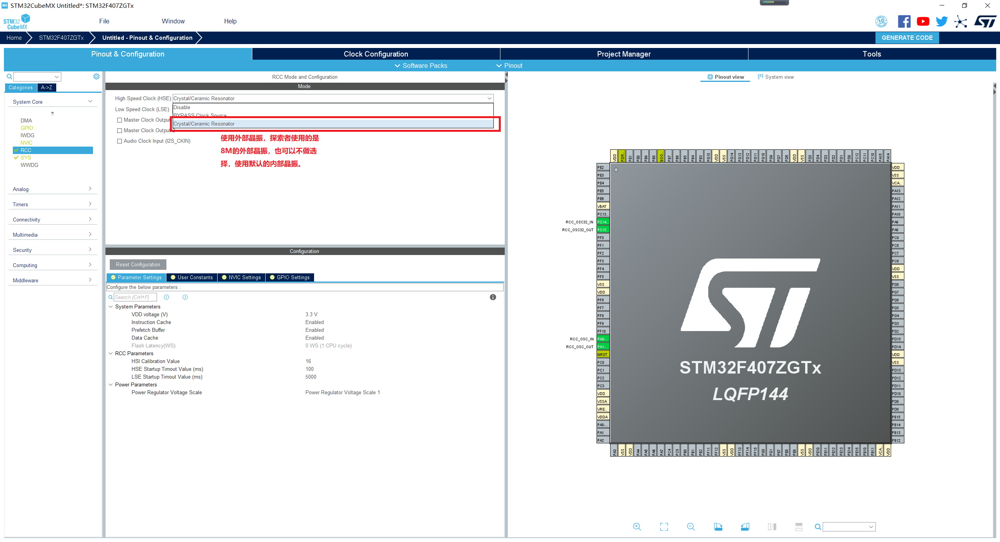

2.  配置时钟频率。

    将标签页切换为“Clock Configuration”。STM32F407芯片的最高时钟为168MHz，在HCLK处输入168并且回车即可完成配置，如下图所示。其他开发板的配置方式也类似。

    **图 2**  配置时钟频率<a name="fig118761971236"></a>
    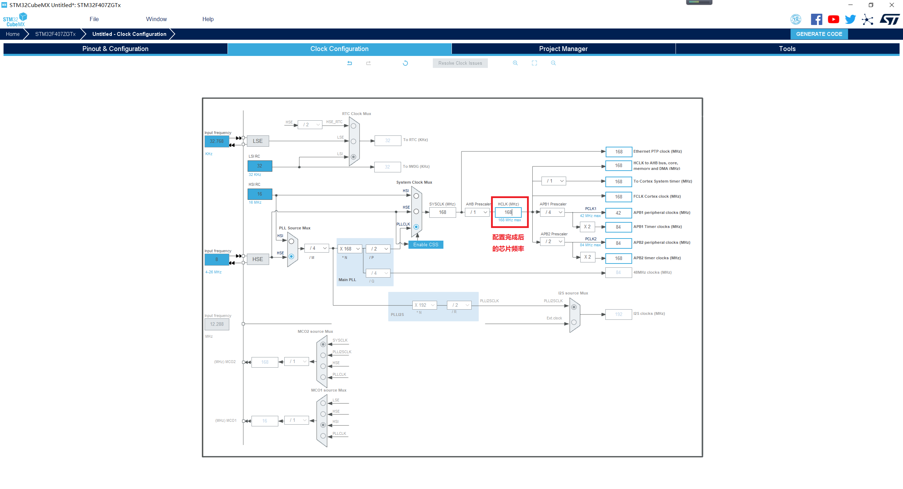


<h4 id="配置串口和LED灯">配置串口和LED灯</h4>

将标签页切换回“Pinout & Configuration”。下图是正点原子STM32F407开发板的配置方法。对于其他开发板，可以参考开发板的原理图进行相应配置。

**图 1**  配置串口和LED引脚<a name="fig103021431642"></a>
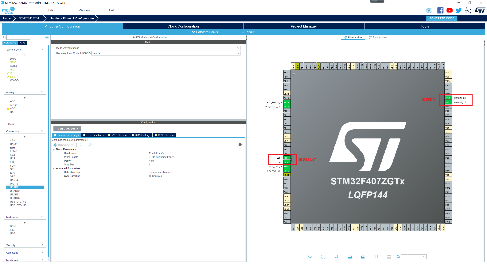

<h4 id="配置烧录调试方式">配置烧录调试方式</h4>

仍然在“Pinout & Configuration”标签页中，在左边的“System Core”中选择“SYS”，将“Debug”设置为“Serial Wire”，即SWD接口。该接口适用于STLink和JLink。

**图 1**  设置烧录调试方式<a name="fig18835710054"></a>
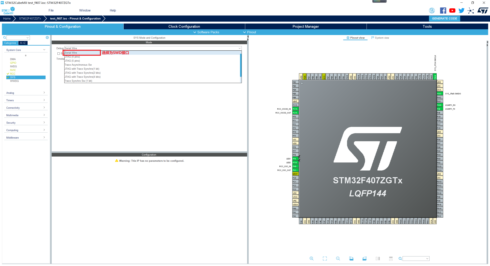

<h3 id="配置工程">配置工程</h3>

工程配置中，需要设置工程名、代码保存路径、编译工具链/IDE、代码使用的堆栈大小以及HAL库版本。CubeMX 可以生成 Makefile、MDK-ARM、IAR 等 IDE 工程。本指南基于GCC编译工具链，所以Toolchain/IDE需要选择Makefile。将标签页切换到“Project Manager”，选择左边的“Project”标签，如下图所示：

**图 1**  工程配置<a name="fig1322816561169"></a>
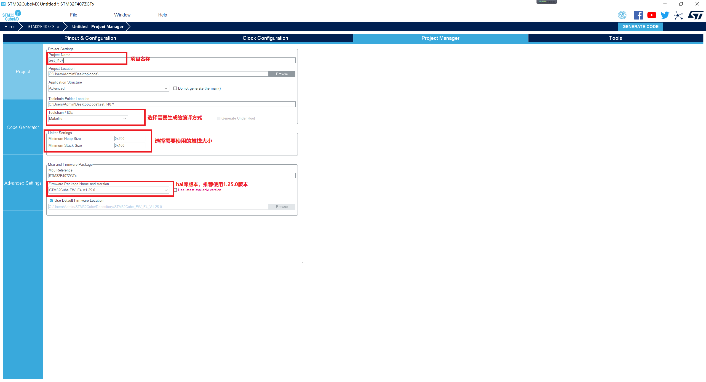

为便于外设相关代码维护，建议勾选生成外设驱动的.c/.h文件。选择左边的“Code Generator”标签，如下图所示：

**图 2**  生成代码配置<a name="fig1246184715710"></a>
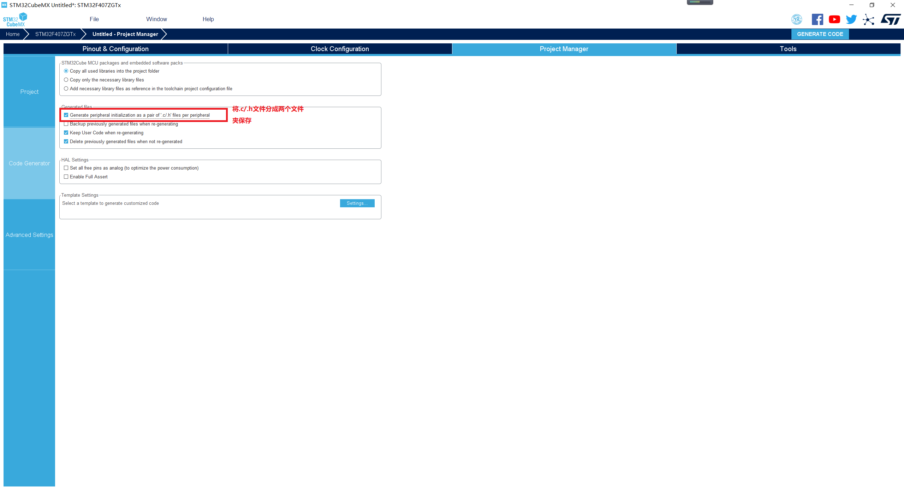

<h3 id="生成裸机工程代码">生成裸机工程代码</h3>

按以上步骤设置完外设和工程配置后，就可以生成裸机工程代码了，如下图所示：

**图 1**  生成工程<a name="fig74894405817"></a>


生成的裸机工程目录结构如下表所示：

**表 1**  裸机工程目录结构

<a name="table1355043241010"></a>
<table><thead align="left"><tr id="row6550732141014"><th class="cellrowborder" valign="top" width="23.78%" id="mcps1.2.3.1.1"><p id="p955023201015"><a name="p955023201015"></a><a name="p955023201015"></a>目录/文件</p>
</th>
<th class="cellrowborder" valign="top" width="76.22%" id="mcps1.2.3.1.2"><p id="p1551103211018"><a name="p1551103211018"></a><a name="p1551103211018"></a>说明</p>
</th>
</tr>
</thead>
<tbody><tr id="row7551103213106"><td class="cellrowborder" valign="top" width="23.78%" headers="mcps1.2.3.1.1 "><p id="p911519532107"><a name="p911519532107"></a><a name="p911519532107"></a>build</p>
</td>
<td class="cellrowborder" valign="top" width="76.22%" headers="mcps1.2.3.1.2 "><p id="p492631615117"><a name="p492631615117"></a><a name="p492631615117"></a>该目录用于存放编译生成的文件</p>
</td>
</tr>
<tr id="row7551632101015"><td class="cellrowborder" valign="top" width="23.78%" headers="mcps1.2.3.1.1 "><p id="p20115115317106"><a name="p20115115317106"></a><a name="p20115115317106"></a>Core</p>
</td>
<td class="cellrowborder" valign="top" width="76.22%" headers="mcps1.2.3.1.2 "><p id="p169261616141113"><a name="p169261616141113"></a><a name="p169261616141113"></a>用户代码和开发板的基本配置文件</p>
</td>
</tr>
<tr id="row195511328107"><td class="cellrowborder" valign="top" width="23.78%" headers="mcps1.2.3.1.1 "><p id="p1711515391010"><a name="p1711515391010"></a><a name="p1711515391010"></a>Drivers</p>
</td>
<td class="cellrowborder" valign="top" width="76.22%" headers="mcps1.2.3.1.2 "><p id="p49262169111"><a name="p49262169111"></a><a name="p49262169111"></a>STM32 官方HAL 库</p>
</td>
</tr>
<tr id="row14551163281018"><td class="cellrowborder" valign="top" width="23.78%" headers="mcps1.2.3.1.1 "><p id="p181151153131010"><a name="p181151153131010"></a><a name="p181151153131010"></a>Makefile</p>
</td>
<td class="cellrowborder" valign="top" width="76.22%" headers="mcps1.2.3.1.2 "><p id="p1892611671116"><a name="p1892611671116"></a><a name="p1892611671116"></a>裸机工程的Makefile</p>
</td>
</tr>
<tr id="row14551123210105"><td class="cellrowborder" valign="top" width="23.78%" headers="mcps1.2.3.1.1 "><p id="p2115165316101"><a name="p2115165316101"></a><a name="p2115165316101"></a>startup_stm32f407xx.s</p>
</td>
<td class="cellrowborder" valign="top" width="76.22%" headers="mcps1.2.3.1.2 "><p id="p109261516151116"><a name="p109261516151116"></a><a name="p109261516151116"></a>芯片启动文件，主要包含堆栈定义等</p>
</td>
</tr>
<tr id="row117273425108"><td class="cellrowborder" valign="top" width="23.78%" headers="mcps1.2.3.1.1 "><p id="p51152053131017"><a name="p51152053131017"></a><a name="p51152053131017"></a>STM32F407ZGTx_FLASH.ld</p>
</td>
<td class="cellrowborder" valign="top" width="76.22%" headers="mcps1.2.3.1.2 "><p id="p1792691651118"><a name="p1792691651118"></a><a name="p1792691651118"></a>裸机工程的链接脚本</p>
</td>
</tr>
</tbody>
</table>

<h3 id="测试裸机工程">测试裸机工程</h3>

<h4 id="编写测试程序">编写测试程序</h4>

下面在裸机工程Core\\Src\\main.c文件中编写测试代码，实现串口循环输出并且LED灯闪烁：

1.  添加头文件：

    ```c
    #include <stdio.h>
    ```

2.  在main\(\)函数的while\(1\)循环中添加如下代码：

    ```c
    printf("hello\n");
    HAL_Delay(1000);
    HAL_GPIO_TogglePin(GPIOF, GPIO_PIN_9);
    ```

3.  /\* USER CODE BEGIN 4 \*/中添加函数：

    ```c
    __attribute__((used)) int _write(int fd, char *ptr, int len)
    {
        (void)HAL_UART_Transmit(&huart1, (uint8_t *)ptr, len, 0xFFFF);
        return len;
    }
    ```


<h4 id="使用LiteOS-Studio测试裸机工程">使用LiteOS Studio测试裸机工程</h4>

1.  配置目标板。

    在“工程配置”界面中点击“目标板”，在“操作”列中点击“+”后，在出现的空行中填入STM32F407开发板信息，选中新增的开发板后，点击确认按钮保存，如下图所示：

    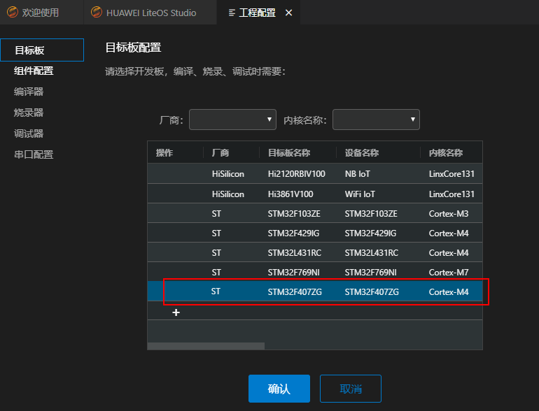

2.  编译。

    在裸机工程根目录下的Makefile文件上点击右键-\>设置为Makefile文件，然后编译工程，编译生成的二进制镜像文件在工程根目录的build目录下，如下图所示：

    **图 1**  编译裸机工程<a name="fig11370205501817"></a>
    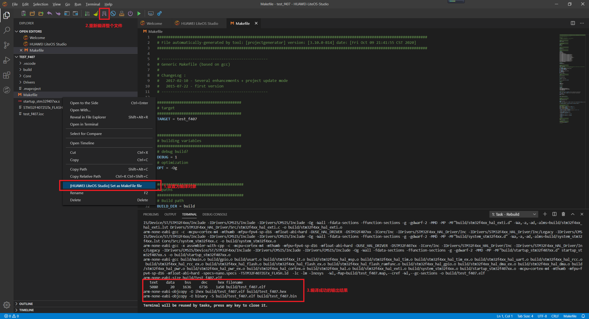

3.  烧录。
    1)  配置烧录器。

        在“工程配置”界面中点击“烧录器”，参照下图进行配置，要烧录的二进制镜像文件就是上一步编译生成的bin文件，配置项中的“连接速率”、“加载地址”保持默认即可。

        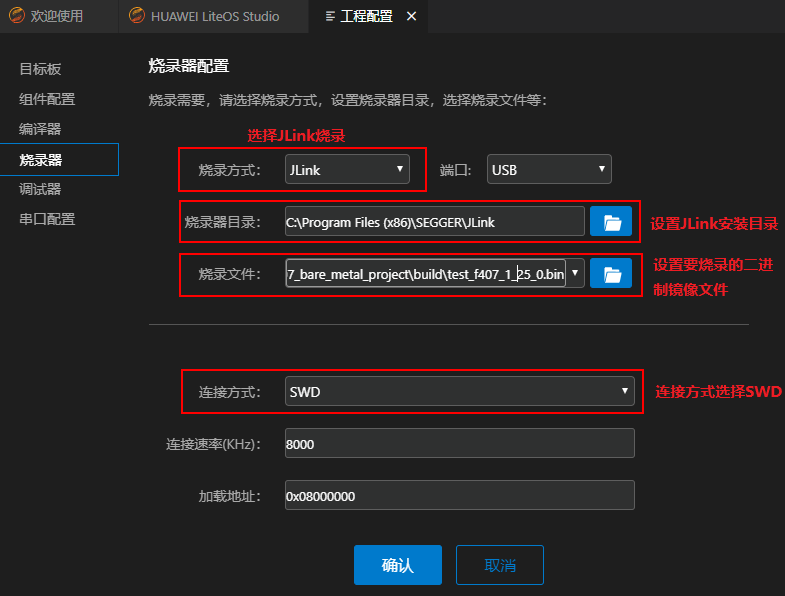

    2)  点击“工具栏”上的“烧录”按钮，进行烧录。

        

        烧录成功后，可以在终端界面看到如下输出：

        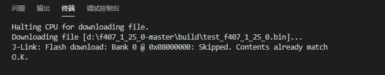

    3)  查看串口输出。

        点击“工具栏”上“串口终端”图标，打开串口终端界面。如下图，只需设置与开发板连接的实际端口号，并打开串口开关。开发板按下复位RESET按钮后，即可在“串口终端”界面中看到不断输出hello，同时也可以观察到开发板的LED灯闪烁。

        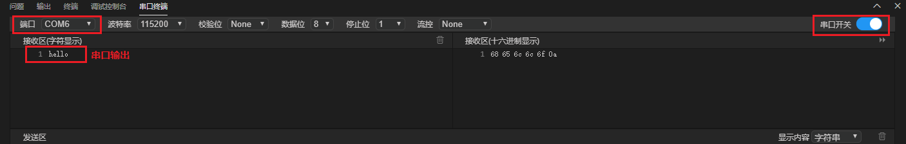


> **说明：**
>如果想更详细的了解LiteOS Studio的使用，可以参考LiteOS Studio官方文档的<a href="https://liteos.gitee.io/liteos_studio/#/project_stm32" target="_blank">“STM32工程示例”</a>。

<h2 id="移植适配">移植适配</h2>

-   **[移植步骤](#移植步骤)**

-   **[增加新开发板的目录](#增加新开发板的目录)**

-   **[适配外设驱动和HAL库配置文件](#适配外设驱动和HAL库配置文件)**

-   **[配置系统时钟](#配置系统时钟)**

-   **[适配串口初始化文件](#适配串口初始化文件)**

-   **[修改链接脚本](#修改链接脚本)**

-   **[适配编译配置](#适配编译配置)**

-   **[在LiteOS Studio上验证](#在LiteOS-Studio上验证)**


<h3 id="移植步骤">移植步骤</h3>

下面的移植工作会基于现有的裸机工程进行，大致步骤如下：

1.  增加新移植开发板的目录。
2.  适配新开发板的外设驱动和HAL库配置文件。
3.  配置系统时钟。
4.  适配串口初始化文件。
5.  修改链接脚本。
6.  适配编译配置。

<h3 id="增加新开发板的目录">增加新开发板的目录</h3>

正点原子STM32F407开发板使用的是STM32F4芯片，可以参考Cloud\_STM32F429IGTx\_FIRE工程代码。

在LiteOS源码target目录下拷贝Cloud\_STM32F429IGTx\_FIRE目录，并将目录重命名为新开发板名，比如STM32F407\_OpenEdv。下表是STM32F407\_OpenEdv目录中的子目录和文件，只列出了和本次移植相关的内容，不相关的文件和目录可以删除。

**表 1**  新增开发板目录结构

<a name="table21661548135412"></a>
<table><thead align="left"><tr id="row21661485542"><th class="cellrowborder" valign="top" width="20.369999999999997%" id="mcps1.2.3.1.1"><p id="p838233610550"><a name="p838233610550"></a><a name="p838233610550"></a>目录/文件</p>
</th>
<th class="cellrowborder" valign="top" width="79.63%" id="mcps1.2.3.1.2"><p id="p17777155205513"><a name="p17777155205513"></a><a name="p17777155205513"></a>说明</p>
</th>
</tr>
</thead>
<tbody><tr id="row1316624817544"><td class="cellrowborder" valign="top" width="20.369999999999997%" headers="mcps1.2.3.1.1 "><p id="p15382183612550"><a name="p15382183612550"></a><a name="p15382183612550"></a>Inc</p>
</td>
<td class="cellrowborder" valign="top" width="79.63%" headers="mcps1.2.3.1.2 "><p id="p87771652145517"><a name="p87771652145517"></a><a name="p87771652145517"></a>芯片外设配置的头文件</p>
</td>
</tr>
<tr id="row10166164845419"><td class="cellrowborder" valign="top" width="20.369999999999997%" headers="mcps1.2.3.1.1 "><p id="p153821036165519"><a name="p153821036165519"></a><a name="p153821036165519"></a>include</p>
</td>
<td class="cellrowborder" valign="top" width="79.63%" headers="mcps1.2.3.1.2 "><p id="p117777527557"><a name="p117777527557"></a><a name="p117777527557"></a>LiteOS系统相关配置头文件</p>
</td>
</tr>
<tr id="row1716714815415"><td class="cellrowborder" valign="top" width="20.369999999999997%" headers="mcps1.2.3.1.1 "><p id="p73831362557"><a name="p73831362557"></a><a name="p73831362557"></a>os_adapt</p>
</td>
<td class="cellrowborder" valign="top" width="79.63%" headers="mcps1.2.3.1.2 "><p id="p13777185210556"><a name="p13777185210556"></a><a name="p13777185210556"></a>LiteOS适配的接口文件</p>
</td>
</tr>
<tr id="row1516734814544"><td class="cellrowborder" valign="top" width="20.369999999999997%" headers="mcps1.2.3.1.1 "><p id="p2038353611557"><a name="p2038353611557"></a><a name="p2038353611557"></a>Src</p>
</td>
<td class="cellrowborder" valign="top" width="79.63%" headers="mcps1.2.3.1.2 "><p id="p147771452155511"><a name="p147771452155511"></a><a name="p147771452155511"></a>芯片外设配置的源文件</p>
</td>
</tr>
<tr id="row516754815410"><td class="cellrowborder" valign="top" width="20.369999999999997%" headers="mcps1.2.3.1.1 "><p id="p1738383615558"><a name="p1738383615558"></a><a name="p1738383615558"></a>config.mk</p>
</td>
<td class="cellrowborder" valign="top" width="79.63%" headers="mcps1.2.3.1.2 "><p id="p577745211554"><a name="p577745211554"></a><a name="p577745211554"></a>当前开发板工程的编译配置文件</p>
</td>
</tr>
<tr id="row141671148115413"><td class="cellrowborder" valign="top" width="20.369999999999997%" headers="mcps1.2.3.1.1 "><p id="p03834365559"><a name="p03834365559"></a><a name="p03834365559"></a>liteos.ld</p>
</td>
<td class="cellrowborder" valign="top" width="79.63%" headers="mcps1.2.3.1.2 "><p id="p477765245517"><a name="p477765245517"></a><a name="p477765245517"></a>当前开发板工程的链接文件</p>
</td>
</tr>
<tr id="row11167204825415"><td class="cellrowborder" valign="top" width="20.369999999999997%" headers="mcps1.2.3.1.1 "><p id="p1238303665519"><a name="p1238303665519"></a><a name="p1238303665519"></a>los_startup_gcc.S</p>
</td>
<td class="cellrowborder" valign="top" width="79.63%" headers="mcps1.2.3.1.2 "><p id="p1577775219559"><a name="p1577775219559"></a><a name="p1577775219559"></a>芯片启动文件，主要包含堆栈定义等</p>
</td>
</tr>
<tr id="row121671948115419"><td class="cellrowborder" valign="top" width="20.369999999999997%" headers="mcps1.2.3.1.1 "><p id="p7383153615514"><a name="p7383153615514"></a><a name="p7383153615514"></a>Makefile</p>
</td>
<td class="cellrowborder" valign="top" width="79.63%" headers="mcps1.2.3.1.2 "><p id="p87772521551"><a name="p87772521551"></a><a name="p87772521551"></a>当前开发板工程的Makefile</p>
</td>
</tr>
</tbody>
</table>

<h3 id="适配外设驱动和HAL库配置文件">适配外设驱动和HAL库配置文件</h3>

1.  将芯片外设驱动文件替换为对应芯片的文件。
    -   修改芯片外设驱动源文件system\_xxx.c。

        LiteOS对STM32F407\_OpenEdv\\Src\\system\_stm32f4xx.c做了修改，所以该文件无法使用在新开发板上，移植时可以直接替换为裸机工程中对应的文件。对于正点原子STM32F407开发板，在裸机工程中的对应文件为：Core\\Src\\system\_stm32f4xx.c。

    -   修改芯片外设驱动头文件。

        删除原stm32f429芯片外设驱动的头文件STM32F407\_OpenEdv\\Inc\\stm32f429xx.h，替换为新开发版对应的文件，可以直接使用裸机工程中的Drivers\\CMSIS\\Device\\ST\\STM32F4xx\\Include\\stm32f407xx.h文件。

        同时注意在某些文件中可能引用了原芯片外设的头文件stm32f429xx.h，需要在文件中改为stm32f407xx.h。目前在新增开发板STM32F407\_OpenEdv目录下，只有include\\asm\\hal\_platform\_ints.h中的引用了stm32f429xx.h，修改 **\#include "stm32f429xx.h"** 为 **\#include "stm32f407xx.h"**。

2.  移植HAL库配置文件。

    直接用裸机工程中的**Core\\Inc\\stm32f4xx\_hal\_conf.h**文件替换**STM32F407\_OpenEdv\\Inc\\stm32f4xx\_hal\_conf.h**即可。

3.  注释随机数代码。

    目前不需要使用随机数，为减少不必要的移植工作，先注释随机数相关代码。搜索关键字“**rng**”，在STM32F407\_OpenEdv目录下找到以下几处使用，将其注释掉：

    -   Src\\sys\_init.c中：

        ```c
        /*
        int atiny_random(void *output, size_t len)
        {
            return hal_rng_generate_buffer(output, len);
        }
        */
        ```

    -   Src\\main.c中：

        ```c
        VOID HardwareInit(VOID)
        {
            SystemClock_Config();
            MX_USART1_UART_Init();
            // hal_rng_config();
            dwt_delay_init(SystemCoreClock);
        }
        ```

4.  在STM32F407\_OpenEdv\\Src\\main.c硬件初始化函数的第一行，添加初始化HAL库的函数HAL\_Init\(\)：

    ```c
    VOID HardwareInit(VOID)
    {
        HAL_Init();
        SystemClock_Config();
        MX_USART1_UART_Init();
        // hal_rng_config();
        dwt_delay_init(SystemCoreClock);
    }
    ```


<h3 id="配置系统时钟">配置系统时钟</h3>

1.  设置系统主频。

    可在STM32F407\_OpenEdv\\include\\hisoc\\clock.h文件中设置，一般将时间频率设置为SystemCoreClock，实现代码为：

    ```c
    #define get_bus_clk()  SystemCoreClock
    ```

2.  修改系统时钟配置函数SystemClock\_Config\(\)。

    函数定义在STM32F407\_OpenEdv\\Src\\sys\_init.c文件中，可以直接使用裸机工程Core\\Src\\main.c中的函数实现。同时在函数结束前加上 **SystemCoreClockUpdate\(\);** 调用。


<h3 id="适配串口初始化文件">适配串口初始化文件</h3>

1.  使用裸机工程的串口初始化文件**Core\\Src\\usart.c**和**Core\\Inc\\usart.h**替换LiteOS源码中的**targets\\STM32F407\_OpenEdv\\Src\\usart.c**和**targets\\STM32F407\_OpenEdv\\Inc\\usart.h**。
2.  在targets\\STM32F407\_OpenEdv\\Inc\\usart.h中增加对STM32F4系列芯片的HAL驱动头文件的引用：

    ```c
    #include "stm32f4xx_hal.h"
    ```

3.  在targets\\STM32F407\_OpenEdv\\Src\\usart.c文件尾部添加如下两个函数定义：

    ```c
    __attribute__((used)) int _write(int fd, char *ptr, int len)
    {
        (void)HAL_UART_Transmit(&huart1, (uint8_t *)ptr, len, 0xFFFF);
        return len;
    }
    int uart_write(const char *buf, int len, int timeout)
    {
        (void)HAL_UART_Transmit(&huart1, (uint8_t *)buf, len, 0xFFFF);
        return len;
    }
    ```


<h3 id="修改链接脚本">修改链接脚本</h3>

STM32F407\_OpenEdv\\liteos.ld是新开发板的链接脚本，需要根据开发板实际情况修改stack，flash，ram的值，可以参考裸机工程链接脚本STM32F407ZGTx\_FLASH.ld中的设定值进行设置。

-   stack在链接脚本中对应的是“\_estack”变量。
-   flash 对应的是“FLASH”变量。
-   ram对应的是“RAM ”变量。

同时为适配LiteOS操作系统，链接脚本中增加了如下代码：

1.  增加了一个vector，用于初始化LiteOS：

    ```
    /* used by the startup to initialize liteos vector */
    _si_liteos_vector_data = LOADADDR(.vector_ram);
    
    /* Initialized liteos vector sections goes into RAM, load LMA copy after code */
    .vector_ram :
    {
    . = ORIGIN(RAM);
    _s_liteos_vector = .;
    *(.data.vector)    /* liteos vector in ram */
    _e_liteos_vector = .;
    } > RAM AT> FLASH
    ```

2.  在.bss段中增加“\_\_bss\_end”变量的定义，因为在LiteOS中使用的是这个变量而非“\_\_bss\_end\_\_”变量：

    ```
    __bss_end = _ebss;
    ```

3.  设置LiteOS使用的内存池的地址，包括起始地址和结束地址：

    ```
    . = ALIGN(8);
    __los_heap_addr_start__ = .;
    __los_heap_addr_end__ = ORIGIN(RAM) + LENGTH(RAM) - _Min_Stack_Size - 1;
    ```


<h3 id="适配编译配置">适配编译配置</h3>

<h4 id="修改开发板Makefile文件">修改开发板Makefile文件</h4>

1.  将所有“**Cloud\_STM32F429IGTx\_FIRE**”替换成“**STM32F407\_OpenEdv**”。
2.  STM32F407\_OpenEdv目录结构相对于Cloud\_STM32F429IGTx\_FIRE工程的目录少了一些文件和子目录，需要在Makefile中删除对这些目录文件的引用，即删除如下内容：

    ```makefile
    HARDWARE_SRC =  \
            ${wildcard $(LITEOSTOPDIR)/targets/Cloud_STM32F429IGTx_FIRE/Hardware/Src/*.c}
            C_SOURCES += $(HARDWARE_SRC)
    ```

    ```makefile
    HARDWARE_INC = \
            -I $(LITEOSTOPDIR)/targets/Cloud_STM32F429IGTx_FIRE/Hardware/Inc
            BOARD_INCLUDES += $(HARDWARE_INC)
    ```

3.  搜索关键字“**STM32F429**”，替换为“**STM32F407**”。
4.  如果需要添加自己的源文件，可以将该源文件添加到“**USER\_SRC**”变量中。

<h4 id="添加新开发板到系统配置中">添加新开发板到系统配置中</h4>

1.  修改targets\\targets.mk。

    可以参考其他开发板的编译配置，新增正点原子开发板的配置，如下所示：

    ```makefile
    ######################### STM32F407ZGTX Options###############################
    else ifeq ($(LOSCFG_PLATFORM_STM32F407ZGTX), y)
        TIMER_TYPE := arm/timer/arm_cortex_m
        LITEOS_CMACRO_TEST += -DSTM32F407xx
        HAL_DRIVER_TYPE := STM32F4xx_HAL_Driver
    ```

2.  新增STM32F407\_OpenEdv.config。

    在tools\\build\\config文件夹下复制Cloud\_STM32F429IGTx\_FIRE.config文件，并重命名为STM32F407\_OpenEdv.config，同时将文件内容中的“**Cloud\_STM32F429IGTx\_FIRE**”改为“**STM32F407\_OpenEdv**”，将“**LOSCFG\_PLATFORM\_STM32F429IGTX**”改为“**LOSCFG\_PLATFORM\_STM32F407ZGTX**”。

3.  修改.config。

    复制tools\\build\\config\\STM32F407\_OpenEdv.config文件到LiteOS根目录下，并重命名为.config以替换根目录下原有的.config文件。


<h3 id="在LiteOS-Studio上验证">在LiteOS Studio上验证</h3>

通过编译和烧录，验证移植后的LiteOS源码，验证方法可以参考“[使用LiteOS Studio测试裸机工程](#使用LiteOS-Studio测试裸机工程)”。

> **说明：**
>对于移植后的LiteOS源码，其**Makefile**文件在源码根目录下，编译生成的镜像文件**Huawei\_LiteOS.bin**在根目录的**out**目录下。

将Huawei\_LiteOS.bin烧录到开发板后，复位开发板，可以在串口看到类似下图的输出：


<h2 id="任务创建示例">任务创建示例</h2>

-   **[任务处理函数简介](#任务处理函数简介)**

-   **[创建任务](#创建任务)**


<h3 id="任务处理函数简介">任务处理函数简介</h3>

LiteOS的main函数定义在开发板工程的main.c文件中，主要负责硬件和内核的初始化工作，并在初始化完成后开始任务调度。在**main\(\)** 调用的**OsMain**函数中，会调用**OsAppInit\(\)** 创建一个名为“app\_Task”的任务，该任务的处理函数为**app\_init\(\)**。用户可以直接在app\_init\(\)中添加自己的代码，可以为一段功能代码或者是一个任务。

<h3 id="创建任务">创建任务</h3>

#### 任务简介<a name="section4752185813211"></a>

LiteOS支持多任务。在LiteOS 中，一个任务表示一个线程。任务可以使用或等待CPU、使用内存空间等系统资源，并独立于其它任务运行。LiteOS实现了任务之间的切换和通信，帮助开发者管理业务程序流程。开发者可以将更多的精力投入到业务功能的实现中。

在LiteOS中，通过函数LOS\_TaskCreate\(\)创建任务，LOS\_TaskCreate\(\)函数原型在kernel\\base\\los\_task.c文件中定义。调用LOS\_TaskCreate\(\)创建一个任务后，任务就会进入就绪状态。

#### 任务创建流程<a name="section844516171537"></a>

下面以一个循环亮灯任务为例，介绍LiteOS任务创建流程。

在移植好的开发板工程“targets\\开发板名称\\Src\\main.c”文件中按照如下流程创建任务：

1.  编写任务函数，创建两个不同闪烁频率的LED指示灯任务：

    ```c
    UINT32 LED1_init(VOID)
    {
        while(1) {
            HAL_GPIO_TogglePin(GPIOF, GPIO_PIN_9); // 需要和“创建裸机工程”中配置的LED灯引脚对应
            LOS_TaskDelay(500000);
        }
        return 0;
    }
    
    UINT32 LED2_init(VOID)
    {
        while(1) {
            HAL_GPIO_TogglePin(GPIOF, GPIO_PIN_10); // 需要和“创建裸机工程”中配置的LED灯引脚对应
            LOS_TaskDelay(1000000);
        }
        return 0;
    }
    ```

2.  配置两个任务的参数并创建任务：

    ```c
    STATIC UINT32 LED1TaskCreate(VOID)
    {
        UINT32 taskId;
        TSK_INIT_PARAM_S LEDTask;
    
        (VOID)memset_s(&LEDTask, sizeof(TSK_INIT_PARAM_S), 0, sizeof(TSK_INIT_PARAM_S));
        LEDTask.pfnTaskEntry = (TSK_ENTRY_FUNC)LED1_init;
        LEDTask.uwStackSize = LOSCFG_BASE_CORE_TSK_DEFAULT_STACK_SIZE;
        LEDTask.pcName = "LED1_Task";
        LEDTask.usTaskPrio = LOSCFG_BASE_CORE_TSK_DEFAULT_PRIO;
        LEDTask.uwResved = LOS_TASK_STATUS_DETACHED;
        return LOS_TaskCreate(&taskId, &LEDTask);
    }
    
    STATIC UINT32 LED2TaskCreate(VOID)
    {
        UINT32 taskId;
        TSK_INIT_PARAM_S LEDTask;
    
        (VOID)memset_s(&LEDTask, sizeof(TSK_INIT_PARAM_S), 0, sizeof(TSK_INIT_PARAM_S));
        LEDTask.pfnTaskEntry = (TSK_ENTRY_FUNC)LED2_init;
        LEDTask.uwStackSize = LOSCFG_BASE_CORE_TSK_DEFAULT_STACK_SIZE;
        LEDTask.pcName = "LED2_Task";
        LEDTask.usTaskPrio = LOSCFG_BASE_CORE_TSK_DEFAULT_PRIO;
        LEDTask.uwResved = LOS_TASK_STATUS_DETACHED;
        return LOS_TaskCreate(&taskId, &LEDTask);
    }
    ```

3.  在硬件初始化函数HardwareInit\(\)中增加对LED灯的初始化：

    ```c
    MX_GPIO_Init();
    ```

4.  对于移植好的STM32F407\_OpenEdv工程，任务处理函数app\_init定义在targets\\STM32F407\_OpenEdv\\Src\\user\_task.c文件中，其中包含了网络、文件系统等相关的任务，目前并不需要执行这些任务，可在targets\\STM32F407\_OpenEdv\\Makefile的“**USER\_SRC**”变量中删除这个文件，后续有相关任务需求时，可以参考这个文件的实现。
5.  在main.c文件的main\(\)函数前实现任务处理函数app\_init\(\)，添加对LED任务创建函数的调用：

    ```c
    UINT32 app_init(VOID)
    {
        LED1TaskCreate();
        LED2TaskCreate();
    
        return 0;
    }
    ```


#### 完整代码示例<a name="section1095419341137"></a>

[main.c](resource/main.c)

> **说明：**
>此代码示例只完成了基本任务的创建，开发者可以根据实际需求创建自己的任务。

<h2 id="常见问题">常见问题</h2>

-   **[如何进行GDB调试](#如何进行GDB调试)**

-   **[如何联系LiteOS官方开发人员](#如何联系LiteOS官方开发人员)**


<h3 id="如何进行GDB调试">如何进行GDB调试</h3>

参考LiteOS Studio官方文档的“STM32工程示例”中的“使用入门”，其中有<a href="https://liteos.gitee.io/liteos_studio/#/project_stm32?id=调试器-执行调试" target="_blank">“调试器”</a>相关介绍。

<h3 id="如何联系LiteOS官方开发人员">如何联系LiteOS官方开发人员</h3>

1.  在gitee网站上的<a href="https://gitee.com/LiteOS/LiteOS/issues" target="_blank">LiteOS项目</a>中提出issue。
2.  在<a href="https://bbs.huaweicloud.com/forum/forum-729-1.html" target="_blank">Huawei LiteOS官方论坛</a>上提问。

