# Huawei LiteOS通用移植指南（Keil版）

## 环境准备

### 硬件环境

- 开发板：可选STM32F0、STM32F1、STM32F4、STM32F7全系列芯片，本教程将使用STM32官方demo开发板 STM32F0Discovery开发板进行移植，其他STM32开发板移植方法类似。  

- 仿真器：J-Link或者ST-Link

### 软件环境

- MDK：本移植指南使用的微控制器集成开发环境为MDK5.25，下载地址：https://www.keil.com/demo/eval/arm.htm

- 芯片器件支持包：MDK安装完成后，要支持具体芯片的开发，还需要安装相应芯片器件支持包，比如STM32F0Discovery需要安装Keil.STM32F0xx_DFP.2.0.0.pack，下载地址：http://www.keil.com/dd2/Pack/#/eula-container ；下载完成后直接双击即可安装。  

- 开发板对应裸机工程：LiteOS移植需要提供开发板对应的裸机工程

    - 本文裸机工程将使用STM32官方的STM32CubeMX软件生成，该软件的下载地址为：https://www.st.com/content/st_com/zh/products/development-tools/software-development-tools/stm32-software-development-tools/stm32-configurators-and-code-generators/stm32cubemx.html

    - 使用STM32CubeMX还需要安装JDK环境，开发者可以按照网上方法安装，此处不再赘述。

### 源码准备

Huawei LiteOS开源代码托管在GitHub的LiteOS工程目录下，下载地址：https://github.com/LiteOS/LiteOS

**目录说明：**

```
.
├─ arch
│  ├─ arm
│     ├─ arm-m                            M核中断、调度、tick相关代码
│     ├─ common                           arm核公用的cmsis core接口
├─ components
│  ├─ cmsis                               LiteOS提供的cmsis os接口实现
├─ doc                                    此目录存放的是LiteOS的使用文档和API说明等文档
├─ examples
│  ├─ API                                 供开发者测试LiteOS内核的demo示例，此目录存放的是内核功能测试用的相关用例的代码
│  ├─ include                             API功能头文件存放目录
├─ kernel
│  ├─ base
│     ├─ core                             LiteOS基础内核代码，包括队列、task调度、软timer、时间片计算等功能
│     ├─ OM                               与错误处理相关的文件
│     ├─ include                          LiteOS内核内部使用的头文件
│     ├─ ipc                              LiteOS中task间通讯的相关接口，包括事件、信号量、消息队列、互斥锁等
│     ├─ mem                              LiteOS中的内核内存管理的相关代码
│     ├─ misc                             内存对齐功能以及毫秒级休眠sleep功能
│  ├─ include                             LiteOS开源内核头文件
│  ├─ extended
│     ├─ tickless                         低功耗框架代码
├─ targets
   ├─ Standard_FRDM_KW41Z                 FRDM（ARM Cortex M0+）板端工程代码（含原厂芯片驱动）
   ├─ Standard_STM32F103RB_NUCLEO         F103（ARM Cortex M3）板端工程代码（含原厂芯片驱动）
   ├─ Cloud_STM32F429IGTx_FIRE            F429（ARM Cortex M4）板端工程代码（含原厂芯片驱动）
   └─ Standard_STM32F746ZG_NUCLEO         F746（ARM Cortex M7）板端工程代码（含原厂芯片驱动）

```

由于这里主要介绍的是内核移植，我们涉及到的只有3个目录下的内容：arch、components/cmsis和kernel。下面介绍的移植过程只涉及到这三个目录下的源码。

## 内核移植

### 使用CubeMX新建STM32裸机工程

以下步骤以STM32芯片为例，非STM32芯片请自行构建对应的裸机工程。

1. 启动CubeMX后，首先新建工程：

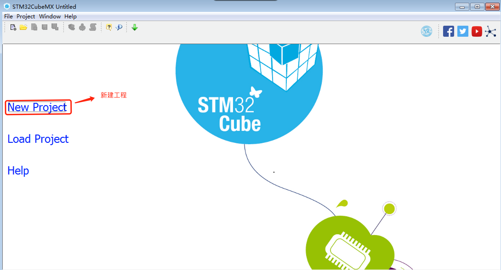

2. 选择单板


    如上图中标识序号
    - 1：可以选择通过MCU还是Board来创建工程
    - 2：设置单板筛选条件
    - 3：选择对应的单板
    - 4：点击即可进行工程创建

3. 配置引脚信息

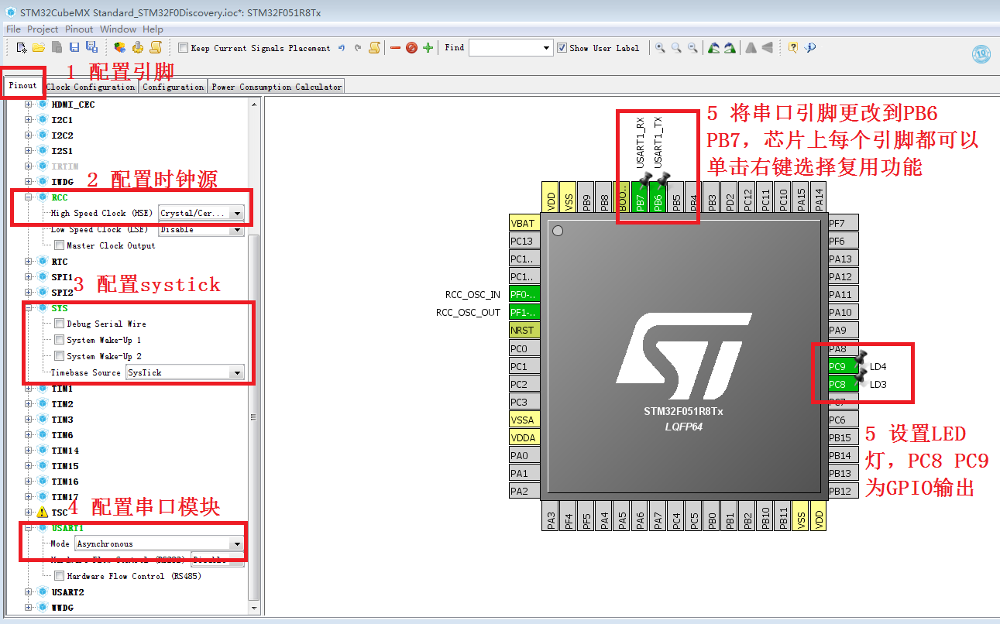

    如上图中标识序号
    - 5：选择Pinout标签页
    - 6：这里作为示例，只选择配置串口1 的引脚，并选择配置成异步方式。根据使用情况，可配置其他不同组件的引脚

4. 配置时钟频率信息

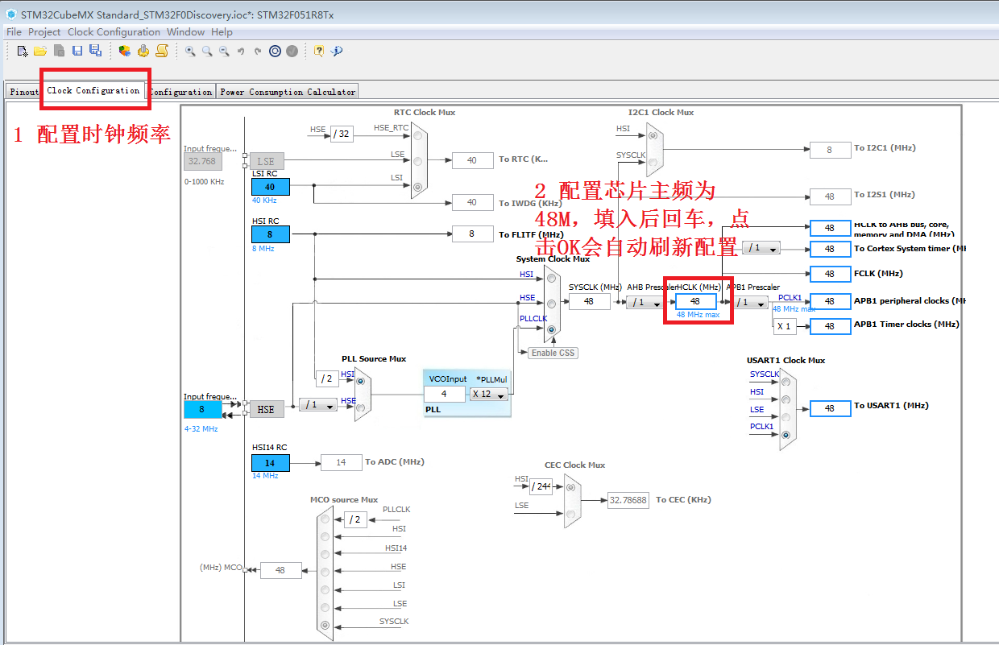
 
5. 选择功能模块的参数配置

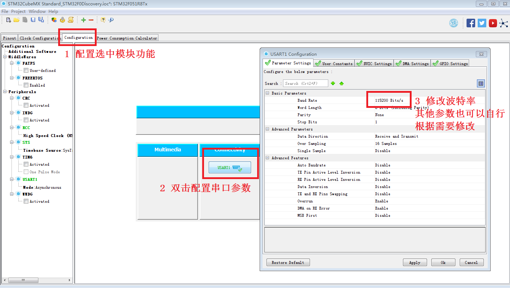  

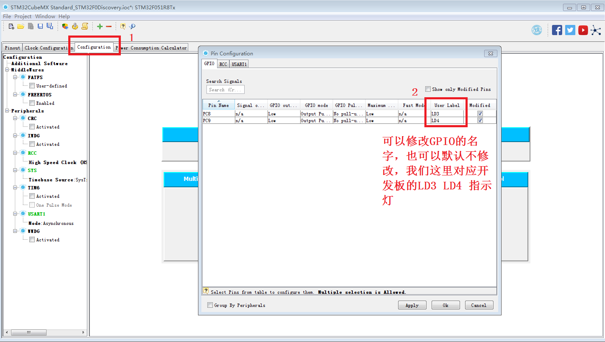

6. 配置生成的工程参数和路径


7. 代码生成配置

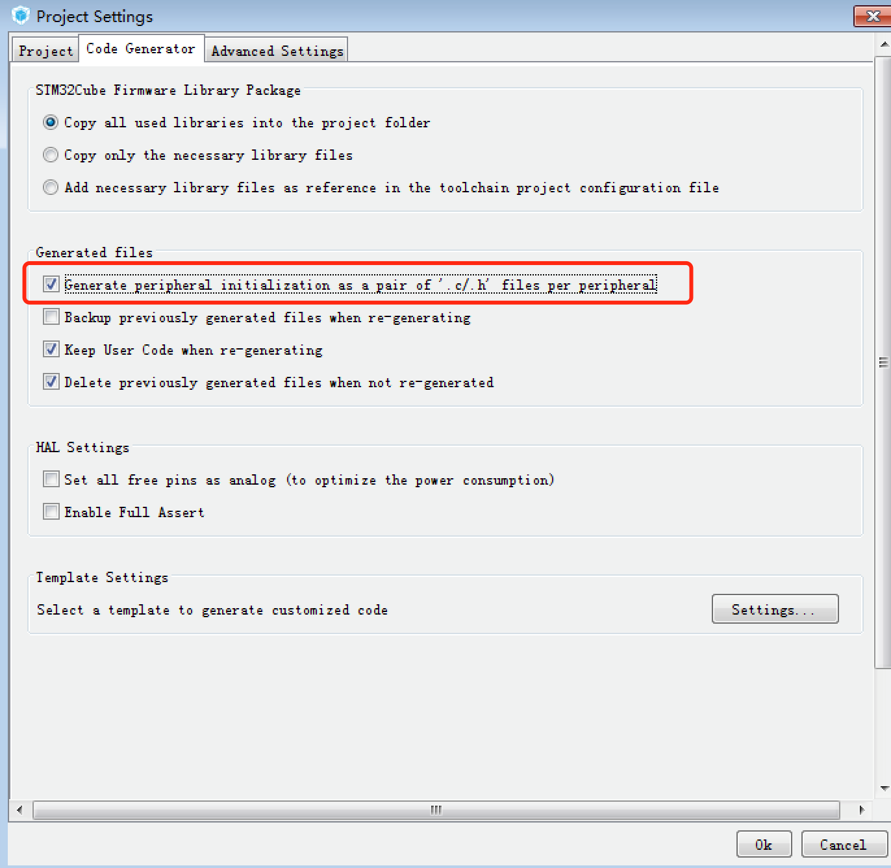

**注意：** 需勾选对相应选项如图示，对应组件的代码（如串口）分别写在单独的.c和.h文件中，否则将全生成在main.c文件中。

8. 生成裸机工程

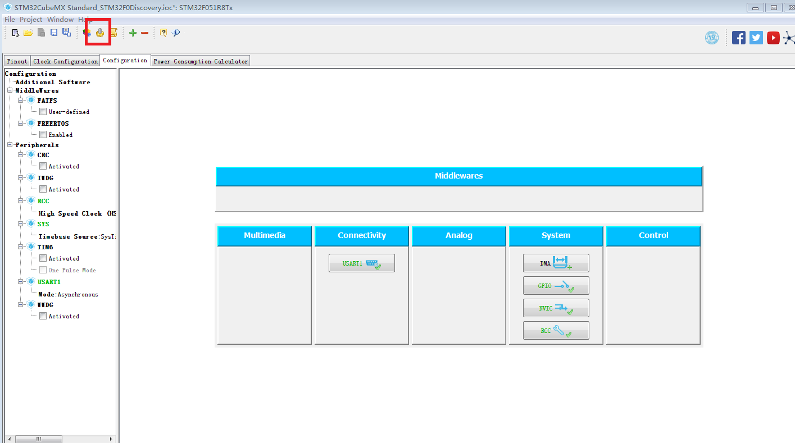

点击图示按钮即可生成STM32F051 discovery的裸机工程。

9. 查看keil工程

点击OK，生成工程效果如下：

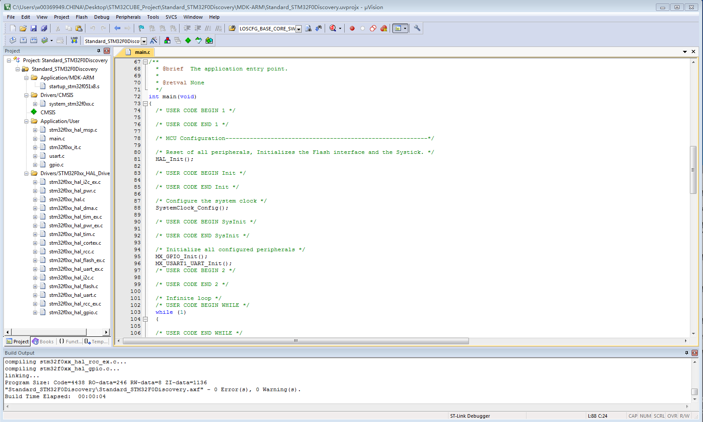
 
至此STM32F051 discovery裸机工程生成成功，该工程可直接编译并烧写在板子上运行。

### 加入内核源码  

加入内核源码之前，请将之前生成的裸机工程放入targets目录下，保持和LiteOS目录一致。将arc和components\cmsis两个目录下的源码也加入工程，后续操作涉及到的目录如下，其他不涉及的暂不列举：

```c
LiteOS
├─ arch
├─ components\cmsis
├─ kernel
├─ targets
   └─ Standard_STM32F0Discovery    // “使用CubeMX新建STM32裸机工程”步骤构建的裸机工程
···
```  

1. 添加cmsis os代码

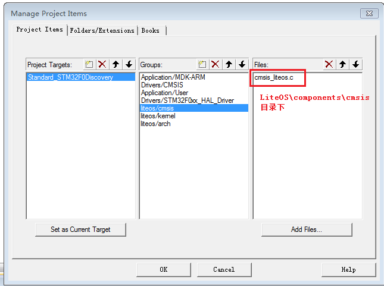

2. 添加内核代码

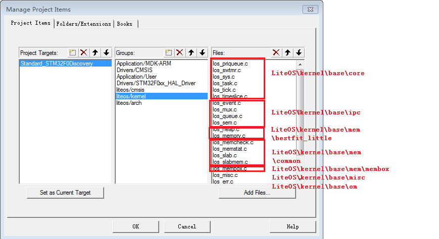  


按照以上标注的源码路径添加LiteOS内核代码，需要注意的是，LiteOS提供了3套动态内存分配算法，位于 `LiteOS\kernel\base\mem` 目录下，分别是bestfit、bestfit_little、tlsf，这三套动态内存算法只需要添加其中一套就行了，对于资源有限的芯片，建议选bestfit_little，上面示例也是添加了这一套动态内存算法；另外 `LiteOS\kernel\base\mem\membox` 目录下是LiteOS提供的静态内存算法，与动态内存算法不冲突，需要添加； `LiteOS\kernel\base\mem\common` 目录的内容需要全部添加。

3. 添加arch（平台相关）代码

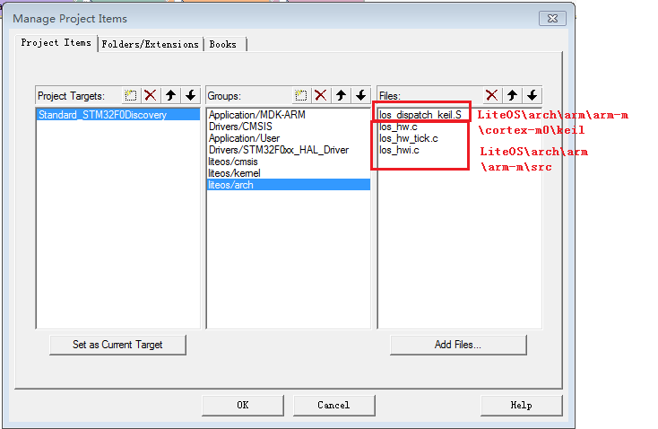

los_dispatch_keil.S 文件为LiteOS的调度汇编，每个芯片IP核都不一样，比如本文使用的STM32F0Discovery 是ARM Cortex M0，编译IDE是keil，所以选择 `LiteOS\arch\arm\arm-m\cortex-m0\keil` ，如果你的开发板是M4核，GCC编译器，则选择 `LiteOS\arch\arm\arm-m\cortex-m4\gcc` 的 `los_dispatch_gcc.S` ；而 `LiteOS\arch\arm\arm-m\src` 则是ARM cortex M核公用的tick，中断，硬件堆栈实现文件。

4. 添加内核以及平台相关代码的头文件目录

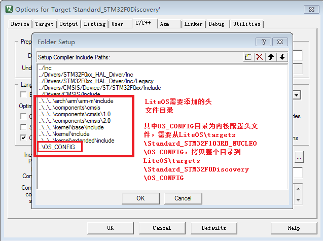

OS_CONFIG 文件夹下的三个头文件为LiteOS配置模板，需要开发者自行拷贝到自己的目标板源码目录下，对于ARM Cortex M系列，只需要修改 `target_config.h` 中的参数就可以完成操作系统的配置。

至此内核源码加入完成。

### 创建LiteOS任务

开发者在Appplication/User目录下找到main.c函数，在main.c里面先增加LiteOS头文件，对于创建任务一般只需要增加以下几个头文件：

```c
/* Includes LiteOS------------------------------------------------------------------*/
#include "los_base.h"
#include "los_sys.h"
#include "los_typedef.h"
#include "los_task.ph"
```  

然后在main函数中增加任务创建函数，比如这里我们创建了两个任务task1和task2，示例代码如下：

```c
void task1(void)
{
	int count = 1;
	while (1)
  {
		printf("This is task1,count is %d\r\n",count++);
		LOS_TaskDelay(1000);
  }
}
UINT32 creat_task1()
{
    UINT32 uwRet = LOS_OK;
    TSK_INIT_PARAM_S task_init_param;

    task_init_param.usTaskPrio = 0;
    task_init_param.pcName = "task1";
    task_init_param.pfnTaskEntry = (TSK_ENTRY_FUNC)task1;
    task_init_param.uwStackSize = 0x200;

    uwRet = LOS_TaskCreate(&g_TskHandle, &task_init_param);
    if(LOS_OK != uwRet)
    {
        return uwRet;
    }
    return uwRet;
}

void task2(void)
{
	int count = 1;
	while (1)
  {
		printf("This is task2,count is %d\r\n",count++);
		LOS_TaskDelay(2000);
  }
}
UINT32 creat_task2()
{
    UINT32 uwRet = LOS_OK;
    TSK_INIT_PARAM_S task_init_param;

    task_init_param.usTaskPrio = 1;
    task_init_param.pcName = "task2";
    task_init_param.pfnTaskEntry = (TSK_ENTRY_FUNC)task2;
    task_init_param.uwStackSize = 0x200;

    uwRet = LOS_TaskCreate(&g_TskHandle, &task_init_param);
    if(LOS_OK != uwRet)
    {
        return uwRet;
    }
    return uwRet;
}
```

最后，在main函数中初始化LiteOS内核，创建task1 和task2，然后调用LOS_ Start函数就可以启动LiteOS了。

```c
uwRet = LOS_KernelInit();
    if (uwRet != LOS_OK)
    {
        return LOS_NOK;
    }
uwRet = creat_task1();
    if (uwRet != LOS_OK)
    {
        return LOS_NOK;
    }
uwRet = creat_task2();
    if (uwRet != LOS_OK)
    {
        return LOS_NOK;
    }
LOS_Start();
``` 

### 配置LiteOS

LiteOS内核的板级配置均在target_config.h中完成，target_config.h配置文件模板请参考其他工程的OS_CONFIG文件夹，2.2章节第4部分已经介绍，这里展开介绍主要配置项：

```c 
#define    OS_SYS_CLOCK     (SystemCoreClock)   //配置CPU主频，需要用户更改
#define    LOSCFG_PLATFORM_HWI     NO           //配置OS是否接管中断
#define    LOSCFG_PLATFORM_HWI_LIMIT    32      //配置外部中断数目
#define    LOSCFG_BASE_CORE_TSK_LIMIT	3	//配置支持的最大任务数量
#define    LOSCFG_BASE_IPC_SEM_LIMIT     2	//配置支持的最大信号量数量
#define    LOSCFG_BASE_IPC_MUX_LIMIT     2      //配置支持的最大互斥锁数量
#define    LOSCFG_BASE_IPC_QUEUE_LIMIT   2      //配置支持的最大队列数量
#define    LOSCFG_BASE_CORE_SWTMR_LIMIT  2      //配置支持的最大软件定时器数量
#define    BOARD_SRAM_START_ADDR     0x20000000 //配置目标芯片RAM起始地址
#define    BOARD_SRAM_SIZE_KB        8	        //配置目标芯片RAM大小，单位KB
#define    CMSIS_OS_VER                 2       //配置CMSIS OS版本，支持V1和V2
```

**注意：**
- 用户根据自身硬件情况修改上述配置，特别是CPU主频和RAM尺寸要根据情况修改；
- 本教程要求OS不接管中断，接管中断的方式需要自行修改sct文件，所以推荐初级用户先不要使能接管中断的方式；
- 最大任务数、信号量数、互斥锁数、队列数、软件定时器数建议用户根据实际需要配置合理的数量，数量太多会占用额外的RAM资源；

### 编译下载LiteOS

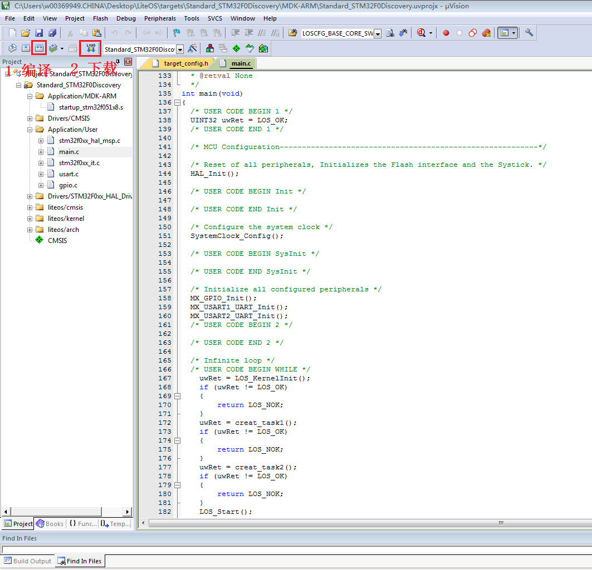

按照上图步骤编译下载LiteOS，就可以在开发板中运行LiteOS了，串口打印效果如下图所示，显示两个任务交替运行：

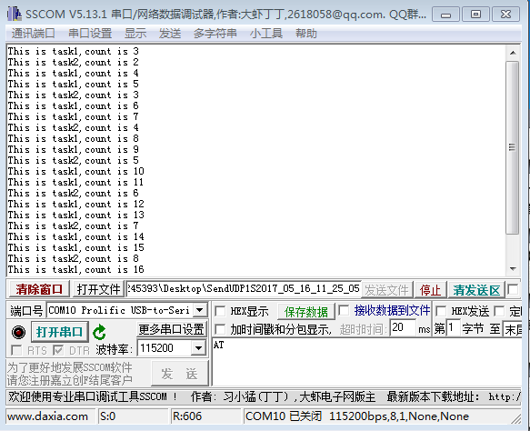
